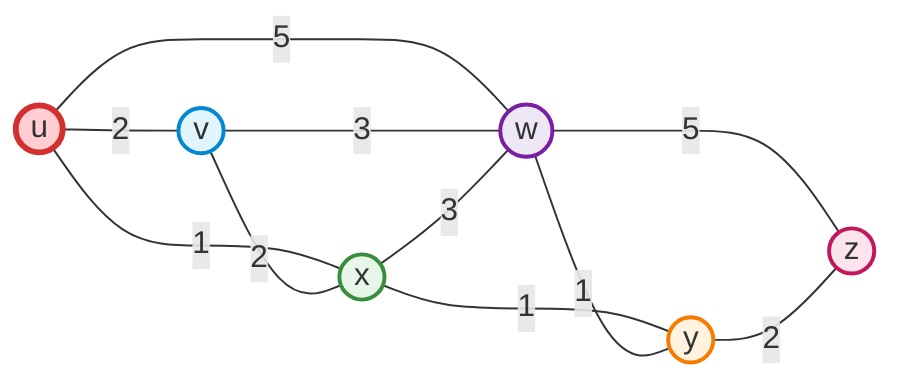
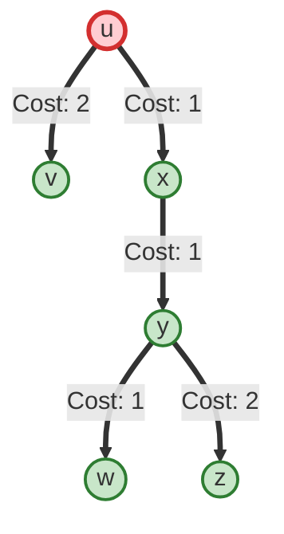

---
tags:
  - networking
  - homework-04
  - dijkstra
  - shortest-path
  - link-state
  - routing-table
  - forwarding-table
created: 2026-10-04
updated: 2026-10-04
type: assignment-solution
author: นายปภาวิน นิติกาญจนกุล (6806021612037)
---

# เฉลยการบ้านชุดที่ 4: Dijkstra's Shortest Path Algorithm & Forwarding Table

> [!INFO] **ข้อมูลการบ้านและการส่งงาน (Assignment Overview)**
> - **วิชา:** Computer Networks and Internet Architecture (ภาคเรียนที่ 1/2569)
> - **ผู้จัดทำ:** นายปภาวิน นิติกาญจนกุล (รหัสนักศึกษา 6806021612037)
> - **ไฟล์โจทย์ต้นฉบับ:** [`Homework4.docx`](file:///c:/Project/computer-network-&-Internet/03_Homework/Current_Year_Assignments/Homework4.docx)
> - **ไฟล์ภาพลายมือส่งงาน:** [`IMG_20260907_153633_628_Homework4_Dijkstra_Submission.jpg`](file:///c:/Project/computer-network-&-Internet/03_Homework/Current_Year_Assignments/work/IMG_20260907_153633_628_Homework4_Dijkstra_Submission.jpg)
> - **สื่อการสอนอ้างอิง:** สไลด์ Chapter 5 หน้า 26 และคลิปสอนสรุป [Dijkstra's algorithm in 3 minutes](https://www.youtube.com/watch?v=_lHSawdgXpI&t=1s) ([`Screenshot 2026-10-04 224212_Dijkstra_Summary_Guide.png`](file:///c:/Project/computer-network-&-Internet/03_Homework/Current_Year_Assignments/work/Screenshot%202026-10-04%20224212_Dijkstra_Summary_Guide.png))

---

## 📌 1. โจทย์ที่กำหนด (Problem Statement)

> **ข้อกำหนด:**  
> จงแสดงการคำนวณเส้นทางที่มีค่าใช้จ่ายน้อยที่สุด (Least-Cost Path) จากโหนด $u$ ไปยังโหนดอื่น ๆ ทั้งหมดในเครือข่าย ($v, w, x, y, z$) โดยใช้ **Dijkstra's Algorithm** พร้อมเขียนตาราง Trace Table และสร้างตาราง Forwarding Table จากโหนด $u$

### แผนภาพโทโพโลยีเครือข่าย (Network Topology Graph)

เครือข่ายประกอบด้วย 6 โหนด มีค่าน้ำหนักของลิงก์ (Link Costs) ดังนี้:
- $c(u, v) = 2$, $c(u, x) = 1$, $c(u, w) = 5$
- $c(v, w) = 3$, $c(v, x) = 2$
- $c(x, w) = 3$, $c(x, y) = 1$
- $c(w, y) = 1$, $c(w, z) = 5$
- $c(y, z) = 2$

---

## ⚡ 2. สรุปหลักการคำนวณ Dijkstra ภายใน 3 ขั้นตอน (Quick Rules)

> [!TIP]
> **หลักการจำง่าย 3 นาที (จาก `Screenshot 2026-10-04 224212`):**
> 1. **เตรียมตาราง:**
>    - เขียนหัวตารางคอลัมน์แรกเป็น $N'$ (เซตของโหนดที่ยืนยันเส้นทางสั้นสุดแล้ว) และตามด้วยโหนดปลายทางทุกตัวยกเว้นโหนดต้นทาง: $v, w, x, y, z$
>    - ในแต่ละเซลล์บันทึกรูปคู่ $(D(n), p(n))$ โดย $D(n)$ คือต้นทุนสะสม และ $p(n)$ คือโหนดก่อนหน้า (predecessor)
> 2. **แถวเริ่มต้น (Step 0 - Initialization):**
>    - กำหนด $N' = \{u\}$
>    - โหนดที่ต่อตรงกับ $u$: ใส่ค่า cost และระบุ $p=u$ เช่น $(2, u), (1, u), (5, u)$
>    - โหนดที่ไม่ต่อตรงกับ $u$: ใส่ค่า $\infty$
> 3. **เข้าลูปคำนวณ (Iterative Loop):**
>    - **เลือก (Choice):** เลือกโหนดนอก $N'$ ที่มีค่า $D$ ต่ำที่สุด แล้วนำเข้าสู่เซต $N'$
>    - **อัปเดต (Update เพื่อนบ้าน):** ตรวจสอบโหนดเพื่อนบ้าน $b$ ที่ยังไม่อยู่ใน $N'$:
>      $$D(b) = \min(D(b), D(a) + c(a, b))$$
>      *(เปรียบเทียบว่า "ทางเดิมไปหา $b$" กับ "ทางใหม่ที่วิ่งผ่าน $a$" ทางไหนต้นทุนต่ำกว่า ให้เลือกเก็บทางนั้น พร้อมเปลี่ยน $p(b) = a$)*
>    - **คงค่าเดิม:** โหนดที่ไม่ได้รับผลกระทบจากการอัปเดต ให้ยกค่าจากแถวก่อนหน้าลงมา
>    - ทำซ้ำจนทุกโหนดอยู่ใน $N'$ ครบถ้วน!

---

## 📊 3. ตาราง Trace Table การทำงานของ Dijkstra (Step-by-Step Execution Trace)

| Step | $N'$ (เซตโหนดที่เลือกแล้ว) | $D(v), p(v)$ | $D(w), p(w)$ | $D(x), p(x)$ | $D(y), p(y)$ | $D(z), p(z)$ | โหนดที่เลือกเข้ารอบถัดไป (Choice) |
| :---: | :--- | :---: | :---: | :---: | :---: | :---: | :--- |
| **0** | $\{u\}$ | $2, u$ | $5, u$ | $\mathbf{1, u}$ | $\infty$ | $\infty$ | **เลือก $x$** ($D=1$) |
| **1** | $\{u, x\}$ | $\mathbf{2, u}$ | $\min(5, 1+3) = 4, x$ | — | $\min(\infty, 1+1) = \mathbf{2, x}$ | $\infty$ | **เลือก $y$** ($D=2$) *(หรือ $v$)* |
| **2** | $\{u, x, y\}$ | $\mathbf{2, u}$ | $\min(4, 2+1) = 3, y$ | — | — | $\min(\infty, 2+2) = 4, y$ | **เลือก $v$** ($D=2$) |
| **3** | $\{u, x, y, v\}$ | — | $\mathbf{3, y}$ | — | — | $4, y$ | **เลือก $w$** ($D=3$) |
| **4** | $\{u, x, y, v, w\}$ | — | — | — | — | $\mathbf{4, y}$ | **เลือก $z$** ($D=4$) |
| **5** | $\{u, x, y, v, w, z\}$ | — | — | — | — | — | **ครบทุกโหนดในเครือข่าย** |

> [!NOTE]
> ใน Step 1 ค่า $D(v)=2$ และ $D(y)=2$ เท่ากัน สามารถเลือก $y$ หรือ $v$ ก่อนก็ได้ ผลลัพธ์สุดท้ายของ Least-Cost Path และ Forwarding Table จะได้ค่า Cost และ Next-Hop ที่ถูกต้องเหมือนกัน 100%

---

## 🌳 4. แผนภาพเส้นทางสั้นที่สุด (Least-Cost Path Tree)

เมื่อพิจารณา Predecessor ย้อนกลับจากโหนดปลายทางมายังต้นทาง $u$:
- ไปยัง **$v$**: $p(v) = u \implies \mathbf{u \to v}$ (Cost = 2)
- ไปยัง **$x$**: $p(x) = u \implies \mathbf{u \to x}$ (Cost = 1)
- ไปยัง **$y$**: $p(y) = x \implies u \to x \to y \implies \mathbf{u \to x \to y}$ (Cost = 2)
- ไปยัง **$w$**: $p(w) = y \implies u \to x \to y \to w \implies \mathbf{u \to x \to y \to w}$ (Cost = 3)
- ไปยัง **$z$**: $p(z) = y \implies u \to x \to y \to z \implies \mathbf{u \to x \to y \to z}$ (Cost = 4)

---

## 📋 5. ตารางส่งต่อข้อมูลของโหนด $u$ (Forwarding Table / Routing Table)

ตารางส่งต่อข้อมูลแสดงว่าเมื่อโหนด $u$ ต้องการส่งแพ็กเก็ตไปยังแต่ละปลายทาง จะต้องส่งออกไปยัง Next Hop Interface ใด:

| Destination (ปลายทาง) | ค่าสุดท้าย $(D, p)$ | Least-Cost Path จาก $u$ | Path Cost รวม | Next-Hop Link / Outgoing Interface จาก $u$ |
| :---: | :---: | :---: | :---: | :---: |
| **$v$** | $2, u$ | $u \to v$ | **2** | $(u, v)$ |
| **$x$** | $1, u$ | $u \to x$ | **1** | $(u, x)$ |
| **$y$** | $2, x$ | $u \to x \to y$ | **2** | $(u, x)$ |
| **$w$** | $3, y$ | $u \to x \to y \to w$ | **3** | $(u, x)$ |
| **$z$** | $4, y$ | $u \to x \to y \to z$ | **4** | $(u, x)$ |

---

## 📎 6. หลักฐานเอกสารประกอบ (Verification & Attachments)

1. **ภาพการคำนวณลายมือส่งงานจริง:**  
   
2. **ภาพสรุปวิธีทำและตาราง Slide 26:**  
   
