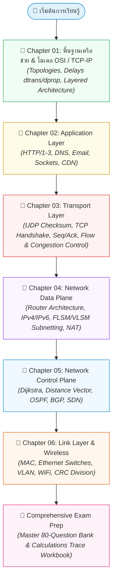

---
tags:
  - networking
  - roadmap
  - study-guide
  - obsidian-wiki
  - master-guide
created: 2026-09-05
updated: 2026-09-05
type: roadmap
---

# 🗺️ Master Study Roadmap & Reading Order (เริ่มต้นอ่านที่นี่)

> [!SUMMARY]
> **แผนที่นำทางวิชา Computer Networks and the Internet (ฉบับจัดหมวดหมู่ตามบทเรียน 100%)**
> เพื่อแก้ปัญหาความสับสนว่า *"ควรเริ่มต้นอ่านอะไรก่อน-หลัง"* โครงสร้าง Wiki ทั้งหมดได้ถูกจัดระเบียบใหม่แยกตาม **บทเรียน (Chapter)** พร้อมระบุ **ลำดับขั้นตอนการอ่าน (Step-by-Step Learning Flow)** ให้คุณเดินตามได้อย่างเป็นระบบตั้งแต่พื้นฐานจนถึงการสอบ!

---

## 🧭 แผนผังโฟลเดอร์ใน Wiki (New Chapter-Based Organization)

| โฟลเดอร์ใน Wiki | บทเรียนที่ครอบคลุม | เอกสารสำคัญในโฟลเดอร์ |
| :--- | :--- | :--- |
| **`00_Master_Roadmap_and_Index/`** | ภาพรวมทั้งวิชา | • [[00_START_HERE_Reading_Roadmap]] (แผนที่การอ่าน) • [[Computer Network and Internet Master Index]] (ดัชนีรวม) • [[Progress Checklist]] (ตารางเช็กสถานะการเรียน) |
| **`Chapter_01_Fundamentals_and_Architecture/`** | บทที่ 1 & 2 (สไลด์บท 1) | • [[00_Chapter_01_Reading_Guide]] • `01_Lecture_01_Network_Fundamentals` • `02_Lecture_02_Network_Models_and_Architecture` • `03_Interactive_Lab_Guide_Chapter_1` • `04_Interactive_Lab_Guide_Chapter_2` |
| **`Chapter_02_Application_Layer/`** | บทที่ 3 (สไลด์บท 2) | • [[00_Chapter_02_Reading_Guide]] • `01_Lecture_03_Application_Layer_Protocols` • `02_Interactive_Lab_Guide_Chapter_3` |
| **`Chapter_03_Transport_Layer/`** | บทที่ 4 (สไลด์บท 3) | • [[00_Chapter_03_Reading_Guide]] • `01_Lecture_04_Transport_Layer_Protocols_and_Mechanics` |
| **`Chapter_04_Network_Data_Plane/`** | บทที่ 5 (สไลด์บท 4 Data Plane) | • [[00_Chapter_04_Reading_Guide]] • `01_Lecture_05_Chapter_4_Network_Data_Plane_v9` • `02_Subnetting_and_FLSM_Master_Guide_Video_and_Example` ⭐ *(เฉลย Video.md & Example.md)* |
| **`Chapter_05_Network_Control_Plane/`** | บทที่ 5 (Control Plane & Routing) | • [[00_Chapter_05_Reading_Guide]] |
| **`Chapter_06_Link_Layer_and_Wireless/`** | บทที่ 6 & 7 (Link & Wireless) | • [[00_Chapter_06_Reading_Guide]] • `01_Lecture_06_Link_Layer_LANs_and_Wireless` |
| **`Comprehensive_Exam_and_Calculations/`** | คลังข้อสอบ & สูตรคำนวณ | • `Calculations and Trace Workbook` • `Exam Preparation Guide and Master 80-Question Bank` • `Master Exam Review - Chapters 1 to 4` |

---

## 🚦 กฎทองลำดับการอ่าน (How to Study Each Chapter)

ในทุก ๆ โฟลเดอร์ของแต่ละบท ให้ยึดลำดับการอ่านตามเลขนำหน้าไฟล์เสมอ:

1. **Step 0: อ่าน `00_Chapter_XX_Reading_Guide.md` เสมอ**
   - เพื่อทำความเข้าใจภาพรวม (Big Picture), วัตถุประสงค์การเรียนรู้, สูตรคำนวณที่เกี่ยวข้อง และจุดหลอกในข้อสอบ
2. **Step 1: ศึกษาไฟล์ทฤษฎีหลัก `01_Lecture_XX_...`**
   - เป็นเนื้อหาฉบับละเอียดระดับ Deep Dive มีแผนภาพสถาปัตยกรรม Mermaid และรายละเอียดการทำงานระดับ Protocol / Bitfield
3. **Step 2: ศึกษาคู่มือแล็บและโจทย์ทดสอบ `02_Interactive_Lab_Guide_...`**
   - ถอดรหัสบทเรียนแบบโต้ตอบ (Interactive Slides), คำสั่งเครือข่าย และ Wireshark Packet Capture Analysis
4. **Step 3: ฝึกทำโจทย์คำนวณและตะลุยข้อสอบ `02/03_Calculations_...` หรือ `Comprehensive_Exam_and_Calculations`**
   - ดูวิธีทำทีละสเต็ป และฝึกคำนวณด้วยตัวเองจนคล่อง
