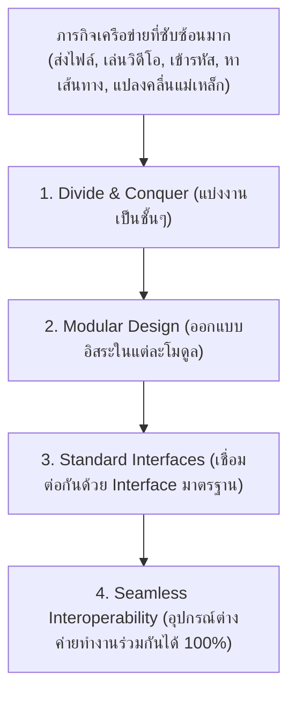
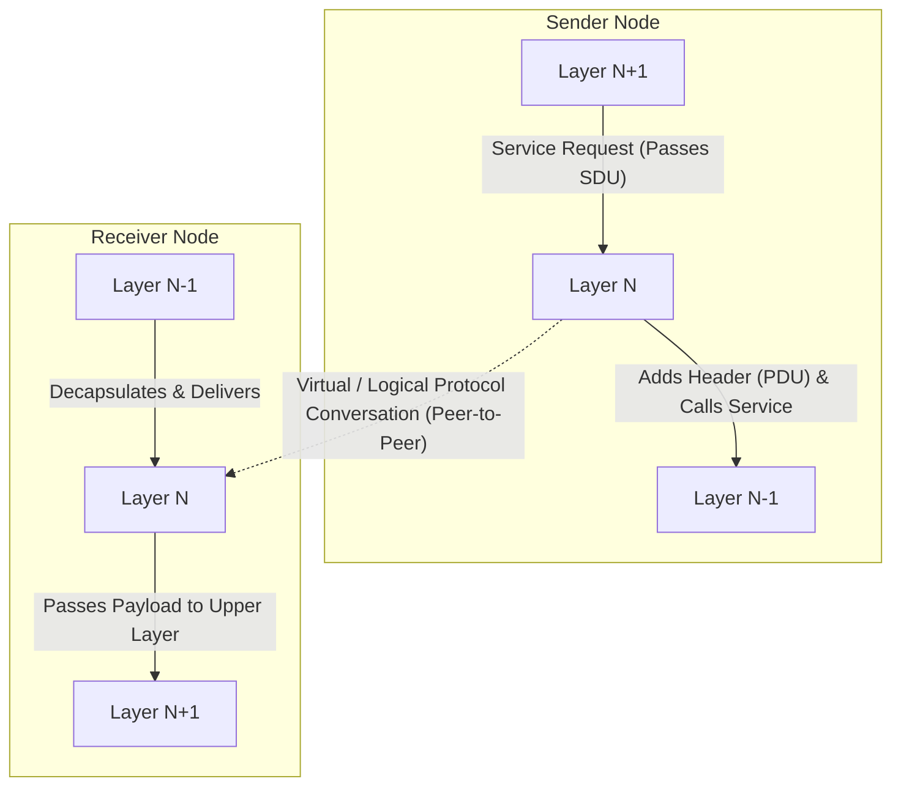
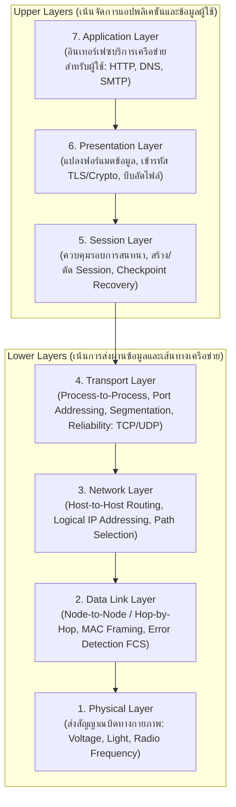
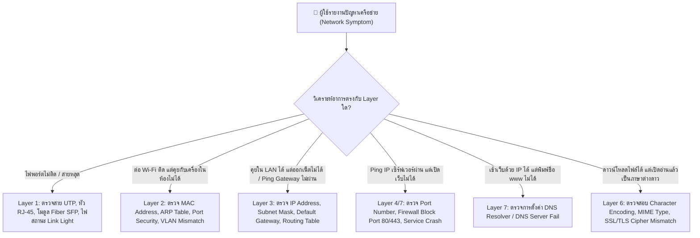
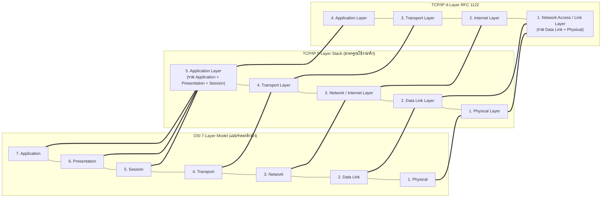
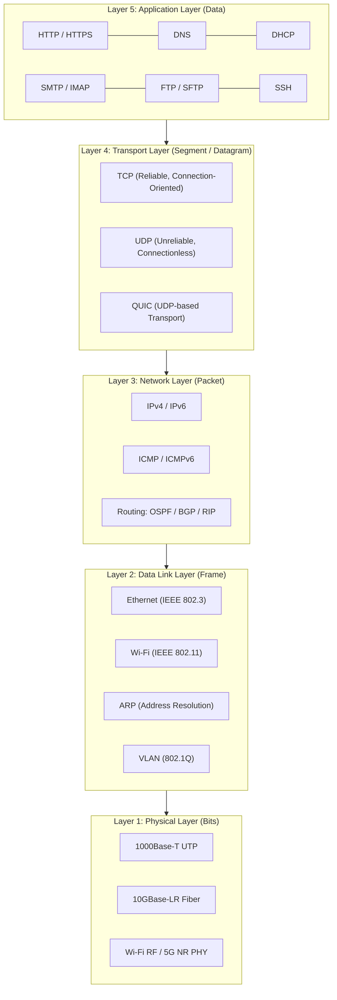
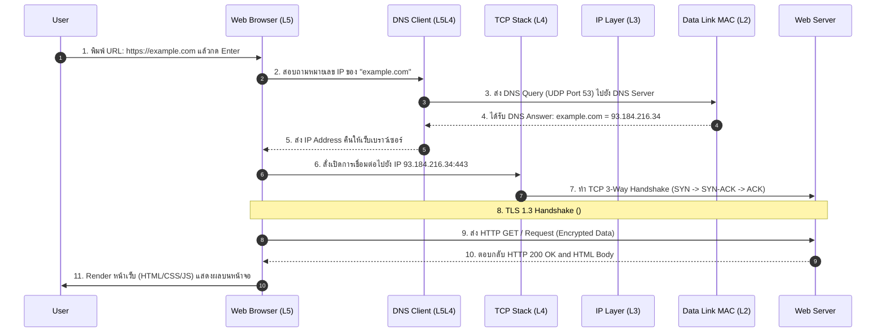

---
tags:
  - networking
  - interactive-course
  - chapter2
  - osi-model
  - tcp-ip
  - encapsulation
  - pdu
created: 2026-08-17
updated: 2026-08-17
type: interactive-lab-guide
---

# Interactive Lab Guide: Chapter 2 — Network Models & Layered Protocol Stack

> [!INFO] 📂 แหล่งไฟล์อ้างอิงต้นฉบับ (Source Documents in New/ & Root)
> - **บทเรียนแบบโต้ตอบหลัก:** [ch2.html](file:///c:/Project/computer-network-&-Internet/New/ch2.html) *(Chapter 2 Network Models: ครบทั้ง 23 Interactive Sections & Widget Data)*
> - **สไลด์บรรยายหลักของอาจารย์:** [Chapter_1_Fundamental-Network_models_1-89.html](file:///c:/Project/computer-network-&-Internet/New/Chapter_1_Fundamental-Network_models_1-89.html) *(สไลด์ 50–89)*
> - **ไฟล์สไลด์ PDF:** [Chapter_1_Introduction.pdf](file:///c:/Project/computer-network-&-Internet/Chapter_1_Introduction.pdf) & [Chapter_1_Introduction_TH.pdf](file:///c:/Project/computer-network-&-Internet/Chapter_1_Introduction_TH.pdf)
> - **หนังสือเรียนอ้างอิง:** *Computer Networking: A Top-Down Approach (8th Edition)* โดย Kurose & Ross — Section 1.5: Protocol Layers and Their Service Models
> - **บทเรียนเว็บโต้ตอบ:** [tcpipmodel.html](file:///c:/Project/computer-network-&-Internet/New/tcpipmodel.html) & [computer-network-course/ch2/index.html](file:///c:/Project/computer-network-&-Internet/computer-network-course/ch2/index.html)

คู่มือสรุปบทเรียนเชิงปฏิบัติการและเนื้อหาแบบละเอียดสมบูรณ์ 100% จากเอกสารการสอนแบบโต้ตอบ `New/ch2.html` ครอบคลุมทั้ง 23 ส่วนการเรียนรู้ อุปมาอุปไมยการบิน แบบจำลอง OSI 7 ชั้น และ TCP/IP 5 ชั้น ตารางวิเคราะห์ตัดปัญหาเครือข่าย (Troubleshooting Matrix) กระบวนการ Encapsulation/Decapsulation แบบ Step-by-step และคลังข้อสอบ/แบบฝึกหัดแล็บพร้อมเฉลยละเอียด

---

## สารบัญโครงสร้างเนื้อหา (Interactive Course Roadmap)
1. [[#1. แนวคิดเรื่องแบบจำลองและการแบ่งชั้นสถาปัตยกรรม (What is a Network Model & Why Layering Matters)]]
2. [[#2. แบบจำลองเปรียบเทียบในชีวิตจริง: การเดินทางโดยเครื่องบิน (Flight Booking Layer Analogy)]]
3. [[#3. กฎเกณฑ์และหลักการของการแบ่งชั้น (Layering Rules & Modularity Principles)]]
4. [[#4. แบบจำลองอ้างอิง OSI 7 ชั้น (The OSI 7-Layer Reference Model)]]
5. [[#5. ตารางวิเคราะห์และค้นหาจุดบกพร่องตามชั้น OSI (OSI Troubleshooting Diagnostic Matrix)]]
6. [[#6. การเปลี่ยนผ่านสู่แบบจำลอง TCP/IP ของอินเทอร์เน็ต (OSI vs TCP/IP Architectural Comparison)]]
7. [[#7. สถาปัตยกรรม TCP/IP 5 ชั้นและหน้าที่เชิงลึก (TCP/IP 5-Layer Stack & Responsibilities)]]
8. [[#8. เส้นทางกายภาพจริง vs การสื่อสารเชิงตรรกะระดับเพียร์ (Physical Path vs Logical Peer-to-Peer View)]]
9. [[#9. กระบวนการห่อหุ้มและแกะข้อมูล (Encapsulation & Decapsulation Mechanics)]]
10. [[#10. หน่วยข้อมูล PDU ในแต่ละชั้น (Protocol Data Unit - PDU Taxonomy)]]
11. [[#11. องค์ประกอบ 3 ประการของโปรโตคอล (Syntax, Semantics, Timing)]]
12. [[#12. แผนผังโปรโตคอลในสแต็ก 5 ชั้น (Five-Layer Protocol Stack Matrix)]]
13. [[#13. การทำงานร่วมกันข้ามชั้นในงานเครือข่ายจริง (Multi-Layer End-to-End Task Simulations)]]
14. [[#14. แบบฝึกหัดภาคปฏิบัติและคลังข้อสอบทบทวน (Interactive Matching Lab & Quick Check Quiz Bank)]]

---

# 1. แนวคิดเรื่องแบบจำลองและการแบ่งชั้นสถาปัตยกรรม (What is a Network Model & Why Layering Matters)

> [!DEFINITION]
> **Network Model (แบบจำลองเครือข่าย):** คือกรอบแนวคิดเชิงโครงสร้าง (Conceptual Framework) ที่แบ่งกระบวนการสื่อสารข้อมูลที่ซับซ้อนมหาศาลออกเป็นส่วนย่อยๆ ที่มีขอบเขตหน้าที่ชัดเจน (Layering Architecture) เพื่อให้ง่ายต่อการศึกษา ออกแบบ พัฒนาฮาร์ดแวร์/ซอฟต์แวร์ และแก้ไขปัญหาเครือข่าย



### เหตุผล 4 ประการที่ต้องใช้ Network Model:
1. **Reduce Complexity (ลดความซับซ้อน):** แปลงกระบวนการสื่อสารตั้งแต่ระดับแอปพลิเคชันจนถึงคลื่นไฟฟ้า ให้กลายเป็นหน้าที่เฉพาะของแต่ละชั้น
2. **Standardize Interfaces (สร้างมาตรฐานอินเทอร์เฟซ):** ผู้ผลิตสามารถพัฒนาฮาร์ดแวร์ในชั้นของตน (เช่น ทำการ์ด LAN Wi-Fi ใน Layer 1-2) ให้ทำงานร่วมกับระบบปฏิบัติการและเว็บเบราว์เซอร์ในชั้นบนได้ทันที
3. **Facilitate Modular Engineering (ความยืดหยุ่นในการอัปเกรด):** การเปลี่ยนเทคโนโลยีในชั้นหนึ่ง (เช่น เปลี่ยนสาย UTP เป็น Optical Fiber หรือ 5G) จะไม่ส่งผลกระทบต่อโปรโตคอลในชั้นบน (HTTP, DNS, TCP ยังทำงานได้เหมือนเดิม)
4. **Accelerate Troubleshooting (แก้ไขปัญหาอย่างเป็นระบบ):** วิศวกรสามารถตัดปัญหาแบบทีละชั้น (Layer-by-layer troubleshooting) จากล่างขึ้นบน หรือจากบนลงล่างได้อย่างรวดเร็ว

---

# 2. แบบจำลองเปรียบเทียบในชีวิตจริง: การเดินทางโดยเครื่องบิน (Flight Booking Layer Analogy)

เพื่อสร้างความเข้าใจที่เห็นภาพชัดเจน สื่อการสอนเปรียบเทียบสถาปัตยกรรมเครือข่ายกับการเดินทางโดยสายการบิน ซึ่งประกอบด้วย 5 ขั้นตอนที่เป็นลำดับชั้น:

```mermaid
flowchart TD
    subgraph FLIGHT_DEPARTURE ["ต้นทาง (Departure Airport)"]
        L5_D["🎫 Layer 5: Ticket & Booking<br/>(จองตั๋ว, กำหนดเป้าหมายการเดินทาง)"]
        L4_D["🧳 Layer 4: Baggage & Security<br/>(โหลดกระเป๋า, ติด Tag รหัสระบุตัวตน)"]
        L3_D["🚪 Layer 3: Gate & Boarding<br/>(ตรวจสอบ Gate, จัดคิวขึ้นเครื่อง)"]
        L2_D["🛫 Layer 2: Runway & Takeoff<br/>(วิ่งขึ้นรันเวย์, สื่อสารหอบังคับการบิน)"]
        L1_D["✈️ Layer 1: Airplane in Flight<br/>(เครื่องบินลอยตัวบนเส้นทางบินจริง)"]

        L5_D --> L4_D --> L3_D --> L2_D --> L1_D
    end

    subgraph FLIGHT_PHYSICAL ["การเดินทางทางกายภาพ (Physical Transfer)"]
        L1_D ===|"เส้นทางบินข้ามทวีป (Physical Air Route)"|===> L1_A
    end

    subgraph FLIGHT_ARRIVAL ["ปลายทาง (Arrival Airport)"]
        L1_A["✈️ Layer 1: Airplane Landing<br/>(เครื่องแตะพื้นรันเวย์)"]
        L2_A["🛬 Layer 2: Taxi to Gate<br/>(แท็กซี่เข้าเทียบหลุมจอด Gate)"]
        L3_A["🚶 Layer 3: Passenger Deboarding<br/>(ผู้โดยสารเดินออกจากเกต)"]
        L4_A["🧳 Layer 4: Baggage Claim<br/>(รับกระเป๋าสัมภาระที่สายพาน)"]
        L5_A["🏁 Layer 5: Journey Completed<br/>(ถึงจุดหมายปลายทางและใช้งานเป้าหมาย)"]

        L1_A --> L2_A --> L3_A --> L4_A --> L5_A
    end

```

### ตารางเปรียบเทียบ Layer การบิน ↔ Layer ระบบเครือข่าย:

| ชั้นการเดินทางโดยสารการบิน | หน้าที่เทียบเคียงในระบบเครือข่าย | ชั้นใน TCP/IP Model |
| :--- | :--- | :--- |
| **1. Ticket & Booking** | ผู้ใช้งานสร้างสารสนเทศและเลือกบริการ (สร้างข้อความ/คำขอหน้าเว็บ) | **Application Layer (L5)** |
| **2. Baggage & Tagging** | การแบ่งข้อมูลเป็นชิ้นย่อยและติดรหัสติดตาม (Segmentation & Port Addressing) | **Transport Layer (L4)** |
| **3. Gate & Routing** | การระบุที่อยู่ต้นทาง-ปลายทาง และกำหนดเส้นทางการเดินทางข้ามเมือง (IP Routing) | **Network Layer (L3)** |
| **4. Runway & Takeoff** | การควบคุมการเข้าสู่รันเวย์เฉพาะแห่ง และหลีกเลี่ยงการชนกัน (MAC & Framing) | **Data Link Layer (L2)** |
| **5. Airplane in Flight** | ตัวกลางและการขับเคลื่อนทางกายภาพข้ามอากาศ (Physical Signals & Media) | **Physical Layer (L1)** |

---

# 3. กฎเกณฑ์และหลักการของการแบ่งชั้น (Layering Rules & Modularity Principles)



### กฎเหล็ก 3 ข้อของสถาปัตยกรรมแบบ Layering:
1. **Vertical Interface Rule:** เลเยอร์หนึ่งๆ จะสื่อสารโดยตรงกับเฉพาะเลเยอร์ที่อยู่ **ติดกันทันที** เท่านั้น (Layer $N$ สื่อสารกับ Layer $N-1$ และ Layer $N+1$) ผ่าน Service Access Points (SAP)
2. **Information Hiding (Encapsulation Rule):** เลเยอร์ชั้นบนไม่จำเป็นต้องรู้รายละเอียดภายในของเลเยอร์ชั้นล่าง (เช่น เบราว์เซอร์ใน L5 ไม่ต้องรู้ว่าข้างล่างใช้สายไฟเบอร์หรือคลื่น Wi-Fi) รู้เพียงบริการ (Services) ที่เลเยอร์ล่างส่งมอบให้
3. **Horizontal Peer-to-Peer Protocol Rule:** เลเยอร์ $N$ ของฝั่งส่ง กำลังสนทนาเชิงตรรกะ (Logical Dialogue) กับเลเยอร์ $N$ ของฝั่งรับเสมอ ผ่านรูปแบบ Header และข้อตกลงที่เรียกว่า **Protocol Data Unit (PDU)**

---

# 4. แบบจำลองอ้างอิง OSI 7 ชั้น (The OSI 7-Layer Reference Model)

มาตรฐานสากล ISO/IEC 7498-1 แบ่งโครงสร้างเครือข่ายออกเป็น 7 เลเยอร์:



### รายละเอียดหน้าที่ของทั้ง 7 ชั้น:
1. **Layer 7 — Application Layer:** จุดเชื่อมต่อระหว่างแอปพลิเคชันของผู้ใช้กับบริการเครือข่าย เช่น เว็บบราวเซอร์, โปรแกรมอีเมล, คำสั่งสืบค้น DNS
2. **Layer 6 — Presentation Layer:** จัดการรูปแบบการนำเสนอข้อมูล (Data Syntax & Semantics) รวมถึงการแปลงรหัสอักขระ (Character Encoding: ASCII, UTF-8), การบีบอัดข้อมูล (Data Compression), และการเข้ารหัสความปลอดภัย (Encryption/Decryption เช่น SSL/TLS)
3. **Layer 5 — Session Layer:** ควบคุมการเปิด รักษา และปิดรอบการติดต่อสื่อสาร (Dialog Control) ระหว่าง 2 โปรเซส จัดการกลไก Simplex/Half/Full Duplex และการใส่จุดตรวจสอบ (Checkpoints) เพื่อกู้คืนสถานะเมื่อเกิดข้อผิดพลาด
4. **Layer 4 — Transport Layer:** รับผิดชอบการส่งข้อมูลระหว่าง **โปรเซสถึงโปรเซส (Process-to-Process Delivery)** แบบ End-to-End อาศัยหมายเลข Port Number มีการแบ่งข้อมูลเป็น Segments และควบคุมความถูกต้อง (TCP Reliability, Flow Control, Congestion Control)
5. **Layer 3 — Network Layer:** รับผิดชอบการส่งแพ็กเก็ตจาก **โฮสต์ต้นทางไปยังโฮสต์ปลายทาง (Host-to-Host Delivery)** ข้ามโครงข่ายอินเทอร์เน็ต อาศัยหมายเลข Logical Address (IP Address) และอัลกอริทึมหาเส้นทาง (Routing)
6. **Layer 2 — Data Link Layer:** รับผิดชอบการส่งเฟรมข้อมูลระหว่าง **โหนดที่อยู่ติดกันโดยตรง (Hop-by-Hop / Node-to-Node Delivery)** บนสื่อกลางเดียวกัน อาศัย Physical Address (MAC Address) ตรวจสอบข้อผิดพลาดด้วย Cyclic Redundancy Check (CRC/FCS)
7. **Layer 1 — Physical Layer:** รับผิดชอบการแปลงบิตดิจิทัล (0 และ 1) ให้เป็นสัญญาณทางกายภาพ (แรงดันไฟฟ้า, แสงเลเซอร์, หรือคลื่นความถี่วิทยุ) และควบคุมคุณสมบัติเชิงกล/ไฟฟ้าของสายสัญญาณและหัวต่อ

---

# 5. ตารางวิเคราะห์และค้นหาจุดบกพร่องตามชั้น OSI (OSI Troubleshooting Diagnostic Matrix)

เทคนิคการตัดปัญหาเครือข่ายอย่างเป็นมืออาชีพตามอาการที่พบ (Symptom-to-Layer Diagnostic):



### ตารางแมทริกซ์การตัดปัญหาเชิงลึก (Troubleshooting Matrix):

| อาการที่พบ (Observed Symptom) | เลเยอร์ที่เป็นสาเหตุหลัก | คำอธิบายและขั้นตอนการตรวจสอบ (Action Steps) |
| :--- | :--- | :--- |
| **1. No link light / cable unplugged** | **Layer 1 (Physical)** | ไฟสถานะบนการ์ดแลนหรือพอร์ตสวิตช์ดับ $\to$ เปลี่ยนสาย LAN, เสียบสายใหม่, ตรวจสอบไฟเบอร์ขาด |
| **2. Connected to Wi-Fi but no local LAN access** | **Layer 2 (Data Link)** | เกาะสัญญาณคลื่นได้ แต่แลกเปลี่ยนเฟรมไม่ได้ $\to$ ตรวจสอบการยืนยันตัวตน WPA2/WPA3, Port Security บล็อก MAC, หรือใส่ VLAN ID ผิด |
| **3. Can reach LAN but cannot reach other networks/Internet** | **Layer 3 (Network)** | คุยกับเครื่องในวงเดียวกันได้ แต่ออกนอกไม่ได้ $\to$ ตรวจสอบการตั้งค่า **Default Gateway** และ Routing Table บนเร้าเตอร์ |
| **4. Server IP replies to Ping, but web page won't load** | **Layer 4 (Transport)** | L3 เชื่อมต่อได้ แต่พอร์ต TCP 80/443 ปลายทางไม่ตอบสนอง $\to$ Web Service บนเซิร์ฟเวอร์อาจดับ หรือมี Firewall บล็อกหมายเลขพอร์ต |
| **5. Website name fails, but direct IP works** | **Layer 7 (Application - DNS)** | พิมพ์ `142.250.190.46` เข้าได้ แต่พิมพ์ `google.com` ไม่ได้ $\to$ ปัญหาที่ DNS Client Cache หรือระบุ DNS Server IP ผิดพลาด |
| **6. File opens with wrong character format / garbled text** | **Layer 6 (Presentation)** | รับข้อมูลครบถ้วนแต่แปลงการเข้ารหัสภาษาผิดพลาด $\to$ ตรวจสอบ Header `Content-Type: text/html; charset=UTF-8` |

---

# 6. การเปลี่ยนผ่านสู่แบบจำลอง TCP/IP ของอินเทอร์เน็ต (OSI vs TCP/IP Architectural Comparison)



> [!INFO]
> **ทำไมสถาปัตยกรรม TCP/IP จึงชนะ OSI ในโลกความเป็นจริง? (Why TCP/IP Won):**
> 1. **Bad Timing:** มาตรฐาน OSI ออกมาช้าเกินไป ขณะที่โปรโตคอล TCP/IP ได้รับการติดตั้งและใช้งานอย่างแพร่หลายในระบบปฏิบัติการ UNIX และ ARPANET ไปแล้ว
> 2. **Bad Technology:** โมเดล OSI ซับซ้อนเกินจำเป็น มีเลเยอร์ Presentation และ Session ที่แอปพลิเคชันส่วนใหญ่สามารถจัดการได้เองภายในตัวโค้ด
> 3. **Bad Implementation:** โค้ดของ OSI ยุคแรกมีขนาดใหญ่ เทอะทะ และทำงานช้ามาก
> 4. **Rough Consensus & Running Code:** ปรัชญาของ TCP/IP คือการสร้างโค้ดที่รันได้จริง ทดสอบจริง และเปิดให้ทุกคนใช้งานได้ฟรีแบบ Open Standard

---

# 7. สถาปัตยกรรม TCP/IP 5 ชั้นและหน้าที่เชิงลึก (TCP/IP 5-Layer Stack & Responsibilities)

### 1. Application Layer (Layer 5)
- **PDU:** Data / Message
- **หน้าที่หลัก:** ให้บริการเครือข่ายสำหรับแอปพลิเคชันของผู้ใช้งาน กำหนดรูปแบบคำขอ (Requests) และคำตอบ (Responses)
- **โปรโตคอลสำคัญ:** HTTP/HTTPS (เว็บ), DNS (แปลงชื่อ), DHCP (จ่าย IP), SMTP/IMAP/POP3 (อีเมล), FTP/SFTP (ถ่ายโอนไฟล์), SSH (รีโมต)

### 2. Transport Layer (Layer 4)
- **PDU:** Segment (TCP) / Datagram (UDP)
- **หน้าที่หลัก:** การส่งข้อมูลระหว่างกระบวนการ (Process-to-Process Delivery), กำหนดหมายเลขพอร์ตต้นทาง-ปลายทาง (Port Addressing), ตัดแบ่งข้อมูลเป็นชิ้นย่อย (Segmentation), จัดลำดับข้อมูล (Sequence Numbers), ควบคุมการไหล (Flow Control) และแก้ปัญหาความคับคั่ง (Congestion Control)
- **โปรโตคอลสำคัญ:** TCP, UDP, QUIC, SCTP

### 3. Network / Internet Layer (Layer 3)
- **PDU:** Packet / IP Datagram
- **หน้าที่หลัก:** กำหนดที่อยู่เชิงตรรกะระดับสากล (Logical IP Addressing), ค้นหาและเลือกเส้นทางข้ามเครือข่าย (Routing), ส่งต่อแพ็กเก็ต (Forwarding), และจัดการการแบ่งส่วนแพ็กเก็ต (Fragmentation)
- **โปรโตคอลสำคัญ:** IPv4, IPv6, ICMP, IGMP, OSPF, BGP, RIP

### 4. Data Link Layer (Layer 2)
- **PDU:** Frame
- **หน้าที่หลัก:** รับผิดชอบการส่งเฟรมข้อมูลระหว่างโหนดที่เชื่อมต่ออยู่บนสายหรือเครือข่ายท้องถิ่นเดียวกัน (Hop-by-Hop Delivery), กำหนด Physical MAC Address, ควบคุมการเข้าใช้ตัวกลาง (Media Access Control), และตรวจจับข้อผิดพลาดด้วย Frame Check Sequence (FCS/CRC)
- **โปรโตคอลสำคัญ:** Ethernet (802.3), Wi-Fi (802.11), ARP, PPP, VLAN (802.1Q), STP

### 5. Physical Layer (Layer 1)
- **PDU:** Bits / Signals
- **หน้าที่หลัก:** รับบิตข้อมูล 0 และ 1 จาก Data Link Layer แล้วแปลงเป็นสัญญาณคลื่นกายภาพ (ไฟฟ้า, แสง, หรือคลื่นวิทยุ) ส่งออกสู่ตัวกลางนำสัญญาณ และแปลงสัญญาณที่รับเข้ามากลับเป็นบิตดิจิทัล
- **เทคโนโลยีสำคัญ:** 1000Base-T UTP, Single-mode/Multi-mode Fiber PHY, Wi-Fi RF PHY, Bluetooth PHY

---

# 8. เส้นทางกายภาพจริง vs การสื่อสารเชิงตรรกะระดับเพียร์ (Physical Path vs Logical Peer-to-Peer View)

```mermaid
sequenceDiagram
    autonumber
    participant App_A as L5 App
    participant Tra_A as L4 Trans
    participant Net_A as L3 Net
    participant Lnk_A as L2 Link
    participant Phy_A as L1 Phy
    participant SW as L2 Switch
    participant RT as L3 Router
    participant Phy_B as L1 Phy
    participant Lnk_B as L2 Link
    participant Net_B as L3 Net
    participant Tra_B as L4 Trans
    participant App_B as L5 App
    box LightBlue Sending Host (Client)

    box LightGray Intermediate Devices

    box LightGreen Receiving Host (Server)

    Note over App_A,App_B: Logical End-to-End Application Conversation (HTTP DNS)
    Note over Tra_A,Tra_B: Logical End-to-End Transport Connection (TCP Port to Port)
    Note over Net_A,Net_B: Logical Host-to-Host Addressing (Source IP to Dest IP)

    App_A->>Tra_A: 1. Pass Data Payload
    Tra_A->>Net_A: 2. Add TCP Header (Segment)
    Net_A->>Lnk_A: 3. Add IP Header (Packet)
    Lnk_A->>Phy_A: 4. Add MAC Header and Trailer (Frame)
    Phy_A->>SW: 5. Transmit Physical Bits
    Note over SW: L2 Switch MAC Headerbr Router
    SW->>RT: 6. Forward Frame to Router
    Note over RT: L3 Router L2 Frame br IP Header L3 br L2 Header (MAC )
    RT->>Phy_B: 7. Forward to Server Physical Link
    Phy_B->>Lnk_B: 8. Receive Bits as Frame
    Lnk_B->>Net_B: 9. Strip MAC Header (Verify FCS)
    Net_B->>Tra_B: 10. Strip IP Header
    Tra_B->>App_B: 11. Strip TCP Header (Demux to Port)
    Note over App_B: Server Process Original Data Payload

```

---

# 9. กระบวนการห่อหุ้มและแกะข้อมูล (Encapsulation & Decapsulation Mechanics)

```mermaid
flowchart TD
    subgraph ENCAPSULATION ["ฝั่งผู้ส่ง (Encapsulation: Top-Down Wrapping)"]
        E5["Application Layer: สร้างข้อมูลดิบ (User Data)"] -->|ส่งลงชั้นล่าง| E4["Transport Layer: เติม TCP/UDP Header (Port No, Seq) $\to$ SEGMENT"]
        E4 -->|ส่งลงชั้นล่าง| E3["Network Layer: เติม IP Header (Source/Dest IP) $\to$ PACKET"]
        E3 -->|ส่งลงชั้นล่าง| E2["Data Link Layer: เติม MAC Header + FCS Trailer $\to$ FRAME"]
        E2 -->|ส่งลงชั้นล่าง| E1["Physical Layer: แปลงเฟรมเป็นสัญญาณบิตไฟฟ้า/แสง $\to$ BITS"]
    end

    subgraph DECAPSULATION ["ฝั่งผู้รับ (Decapsulation: Bottom-Up Unwrapping)"]
        D1["Physical Layer: รับสัญญาณคลื่น ถอดรหัสเป็นบิต (BITS)"] -->|ส่งขึ้นชั้นบน| D2["Data Link Layer: ตรวจสอบ FCS $\to$ ปลด MAC Header $\to$ PACKET"]
        D2 -->|ส่งขึ้นชั้นบน| D3["Network Layer: ตรวจสอบ Dest IP $\to$ ปลด IP Header $\to$ SEGMENT"]
        D3 -->|ส่งขึ้นชั้นบน| D4["Transport Layer: ตรวจสอบ Port Number $\to$ ปลด TCP Header $\to$ DATA"]
        D4 -->|ส่งขึ้นชั้นบน| D5["Application Layer: ส่งมอบ User Data เข้าโปรเซสแอปพลิเคชัน"]
    end

    E1 ===|"Transmission Medium"|===> D1

```

### โครงสร้างเฟรมข้อมูลที่สมบูรณ์เมื่อเดินทางบนสายสัญญาณ (Complete Encapsulated Frame Layout):

```

+-----------------------------------------------------------------------------------------------+
|                                    Ethernet Frame (Layer 2 PDU)                               |

+-------------------+-------------------------------------------------------+-------------------+
| Ethernet Header   |                    IP Packet (Layer 3 PDU)            | Ethernet Trailer  |
| (Dest MAC,        +-------------------+-----------------------------------+ (FCS / CRC-32)    |
|  Src MAC,         | IP Header         |      TCP Segment (Layer 4 PDU)    | (4 Bytes)         |
|  EtherType)       | (Src IP, Dest IP, +-------------------+---------------+                   |

| (14 Bytes)        |  TTL, Protocol)   | TCP Header        |  Application  |                   |
|                   | (20 Bytes)        | (Src Port,        |  Data Payload |                   |

|                   |                   |  Dest Port, Seq)  | (HTTP, JSON)  |                   |
|                   |                   | (20 Bytes)        |               |                   |

+-------------------+-------------------+-------------------+---------------+-------------------+

```

---

# 10. หน่วยข้อมูล PDU ในแต่ละชั้น (Protocol Data Unit - PDU Taxonomy)

| ชั้น (Layer) | ชื่อเรียก PDU ทางการ | ข้อมูลควบคุมที่ถูกเติมเข้าไป (Control Information Added) | หน้าที่หลักของการระบุตำแหน่ง (Addressing Type) |
| :--- | :--- | :--- | :--- |
| **Layer 5: Application** | **Data / Message** | Application Headers (เช่น HTTP Request Line, MIME Headers) | Application Identifiers (เช่น URL, Domain Name) |
| **Layer 4: Transport** | **Segment** (TCP) / **Datagram** (UDP) | Source Port, Destination Port, Sequence Number, ACK Number, Checksum | **Port Number** (เช่น Port 80 HTTP, Port 443 HTTPS, Port 53 DNS) |
| **Layer 3: Network** | **Packet** / **Datagram** | Source IP Address, Destination IP Address, TTL, Protocol ID | **Logical IP Address** (เช่น IPv4 `192.168.1.50` หรือ IPv6) |
| **Layer 2: Data Link** | **Frame** | Source MAC Address, Destination MAC Address, EtherType, Frame Check Sequence (FCS) | **Physical MAC Address** (เช่น `00:1A:2B:3C:4D:5E`) |
| **Layer 1: Physical** | **Bits** (0s and 1s) | Preamble, Start Frame Delimiter, Clock Synchronization Signals | Physical Encoding / Modulation (เช่น Manchester, PAM4, QAM) |

---

# 11. องค์ประกอบ 3 ประการของโปรโตคอล (Syntax, Semantics, Timing)

> [!DEFINITION]
> **Protocol (โปรโตคอล):** กฎและข้อตกลงที่กำหนดรูปแบบและความหมายของข้อมูลในการสื่อสาร ประกอบด้วย 3 องค์ประกอบหลัก:

1. **Syntax (ไวยากรณ์และโครงสร้าง):**
   - รูปแบบและการจัดวางฟิลด์ของข้อมูล ลำดับไบต์ ขนาดความกว้างของเฮดเดอร์
   - *ตัวอย่าง:* 2 ไบต์แรกของ TCP Header ต้องเป็น Source Port และตามด้วย 2 ไบต์ของ Destination Port
2. **Semantics (ความหมายของข้อมูล):**
   - ความหมายของบิตหรือข้อความในแต่ละฟิลด์ และการกระทำที่อุปกรณ์ต้องปฏิบัติตาม
   - *ตัวอย่าง:* Status Code `200` หมายถึง Success, Status Code `404` หมายถึง Not Found, หรือ Flag `SYN` หมายถึง ขอเริ่มสร้างการเชื่อมต่อ
3. **Timing (การควบคุมลำดับเวลาและจังหวะ):**
   - ข้อกำหนดว่าข้อมูลควรส่งเมื่อใด ความเร็วในการส่งควรเป็นเท่าใด การรอ ACK ตอบรับ และการกำหนดเวลาหมดอายุ (Timeout / Retransmission)
   - *ตัวอย่าง:* หากส่งข้อมูลไปแล้วไม่ได้รับ ACK ภายในเวลา RTO (Retransmission Timeout) ผู้ส่งจะต้องส่งแพ็กเก็ตนั้นซ้ำใหม่

---

# 12. แผนผังโปรโตคอลในสแต็ก 5 ชั้น (Five-Layer Protocol Stack Matrix)



---

# 13. การทำงานร่วมกันข้ามชั้นในงานเครือข่ายจริง (Multi-Layer End-to-End Task Simulations)

เมื่อผู้ใช้พิมพ์ `https://example.com` ในช่องค้นหาของเว็บเบราว์เซอร์ ระบบจะต้องเรียกใช้โปรโตคอลประสานงานกันครบทั้ง 5 ชั้นตามลำดับดังนี้:



---

# 14. แบบฝึกหัดภาคปฏิบัติและคลังข้อสอบทบทวน (Interactive Matching Lab & Quick Check Quiz Bank)

### กิจกรรมที่ 1: การจับคู่ Protocol เข้ากับภารกิจเครือข่าย (Protocol Matching Lab)
- **1. Open secure website (เข้าชมเว็บแบบเข้ารหัสปลอดภัย):** `HTTPS` (พอร์ต TCP 443)
- **2. Find website IP (ค้นหาหมายเลข IP จากชื่อโดเมน):** `DNS` (พอร์ต UDP 53)
- **3. Send email to mail server (ส่งอีเมลออกจากเครื่องผู้ใช้):** `SMTP` (พอร์ต TCP 587/25)
- **4. Retrieve / sync mailbox (ดึงและซิงค์อีเมลจากกล่องข้อความ):** `IMAP` (พอร์ต TCP 993) / `POP3` (พอร์ต TCP 995)
- **5. Transfer files securely (ถ่ายโอนไฟล์อย่างปลอดภัย):** `SFTP` / `FTPS`
- **6. Remote command-line administration (รีโมตควบคุมเซิร์ฟเวอร์):** `SSH` (พอร์ต TCP 22)

---

### กิจกรรมที่ 2: การเรียงลำดับขั้นตอนการเปิดหน้าเว็บ (Web Browsing Sequence Ordering)
เรียงลำดับขั้นตอนจากเริ่มต้นจนถึงการแสดงผลหน้าเว็บ:
1. `Enter URL` (ผู้ใช้พิมพ์ URL หรือคลิกลิงก์บนเบราว์เซอร์)
2. `DNS lookup` (สืบค้นชื่อโดเมนเพื่อแปลงเป็นหมายเลข IP ปลายทาง)
3. `Open connection` (สร้างการเชื่อมต่อระดับ Transport Layer ด้วย TCP Handshake)
4. `HTTP request` (เบราว์เซอร์ส่งคำขอ GET Request ขอไฟล์หน้าเว็บ)
5. `HTTP response` (เซิร์ฟเวอร์ส่งรหัสสถานะ 200 OK พร้อมข้อมูล HTML กลับมา)
6. `Render webpage` (เบราว์เซอร์ประมวลผล HTML/CSS/Images และแสดงผลบนหน้าจอ)

---

### คลังข้อสอบทบทวนประจำบท (Interactive Quiz Bank with Explanations):

#### ข้อ 1: ข้อใดคือโปรโตคอลหลักที่ใช้ในการขอและรับส่งข้อมูลหน้าเว็บเพจ?
- A) DNS
- B) HTTP / HTTPS *(คำตอบที่ถูกต้อง)*
- C) ARP
- D) ICMP
> **คำอธิบาย:** HTTP (Hypertext Transfer Protocol) และ HTTPS เป็นโปรโตคอลหลักใน Application Layer สำหรับการเรียกดูและแลกเปลี่ยนข้อมูลหน้าเว็บ

#### ข้อ 2: โปรโตคอลใดทำหน้าที่แปลงชื่อโดเมน (Domain Name) ให้กลายเป็นหมายเลข IP Address?
- A) DNS *(คำตอบที่ถูกต้อง)*
- B) SMTP
- C) TCP
- D) DHCP
> **คำอธิบาย:** DNS (Domain Name System) ทำหน้าที่เป็นสมุดโทรศัพท์ของอินเทอร์เน็ต แปลงชื่อที่มนุษย์เข้าใจง่าย (เช่น `google.com`) ให้เป็น IP Address ที่คอมพิวเตอร์ใช้หาเส้นทาง

#### ข้อ 3: โปรโตคอลใดใช้ในการส่งอีเมลระหว่าง Mail Servers?
- A) FTP
- B) IMAP
- C) SMTP *(คำตอบที่ถูกต้อง)*
- D) POP3
> **คำอธิบาย:** SMTP (Simple Mail Transfer Protocol) เป็นโปรโตคอลแบบ Push ที่ใช้ส่งอีเมลจาก Client ไปยัง Server และใช้ส่งต่อระหว่าง Mail Server ถึง Mail Server

#### ข้อ 4: ข้อใดต่อไปนี้ **ไม่ใช่** โปรโตคอลในระดับ Application Layer?
- A) FTP
- B) IP *(คำตอบที่ถูกต้อง)*
- C) HTTP
- D) DNS
> **คำอธิบาย:** IP (Internet Protocol) เป็นโปรโตคอลหลักที่อยู่ใน **Network Layer (Layer 3)** ไม่ใช่ Application Layer

#### ข้อ 5: หน่วยข้อมูล PDU ในระดับ Transport Layer, Network Layer และ Data Link Layer มีชื่อเรียกตามลำดับอย่างไร?
- A) Packet, Frame, Segment
- B) Segment, Packet, Frame *(คำตอบที่ถูกต้อง)*
- C) Frame, Segment, Packet
- D) Data, Packet, Bits
> **คำอธิบาย:** ใน TCP/IP สแต็ก: L4 Transport = Segment (TCP) / Datagram (UDP), L3 Network = Packet / Datagram, L2 Data Link = Frame

---

## เอกสารเชื่อมโยงที่เกี่ยวข้อง (Cross-References)
- [[Lecture 2 - Network Models and Layered Architecture]] — สรุปเนื้อหาบทที่ 2 ฉบับทางการ
- [[Interactive Lab Guide - Chapter 1 Network Fundamentals]] — บทเรียนจำลองพื้นฐานและการเชื่อมต่อกายภาพ
- [[Interactive Lab Guide - Chapter 3 Application Layer Protocols]] — บทเรียนเจาะลึกโปรโตคอลในชั้นแอปพลิเคชัน
- [[Computer Network and Internet Master Index]] — ดัชนีรวมสารบัญวิชาเครือข่ายคอมพิวเตอร์
