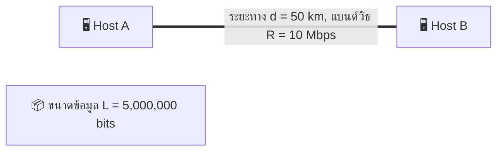
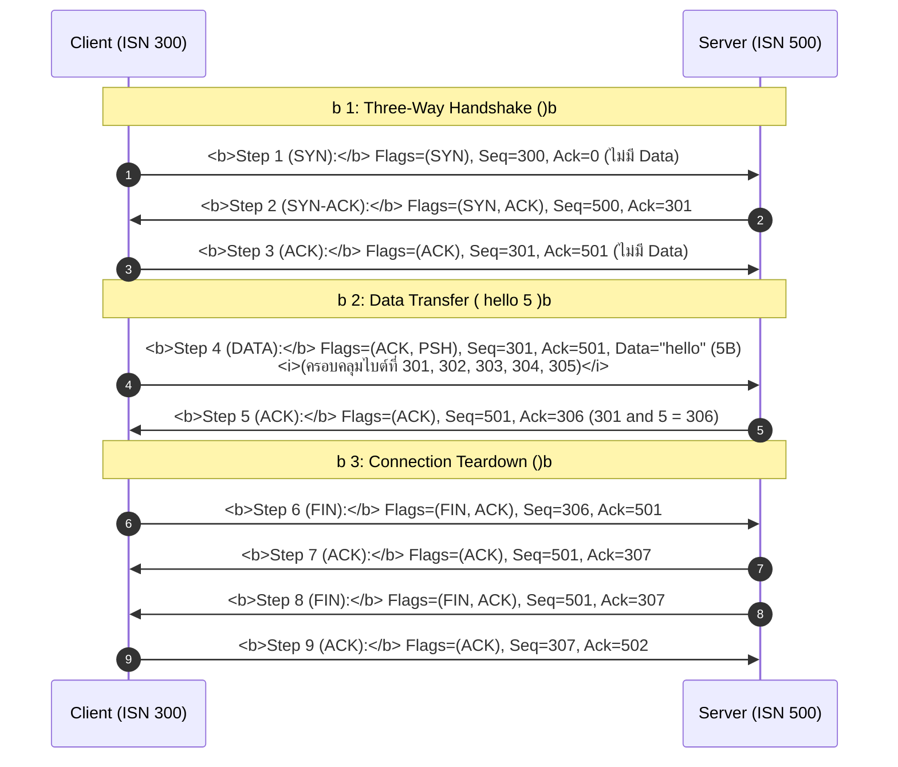
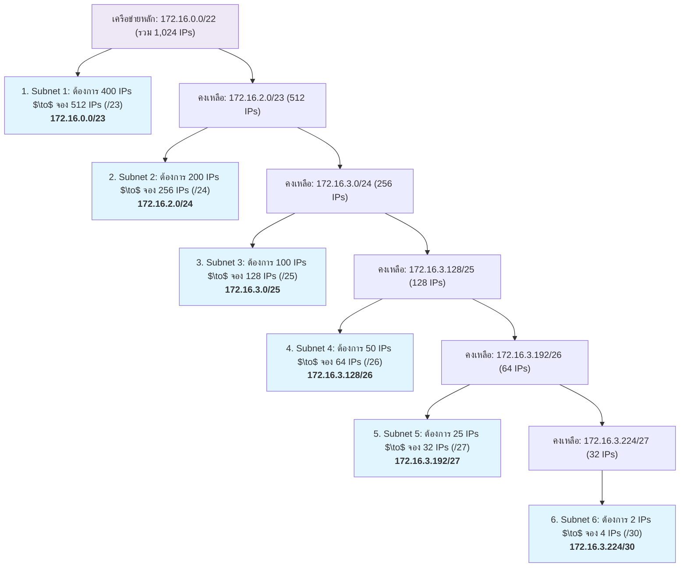
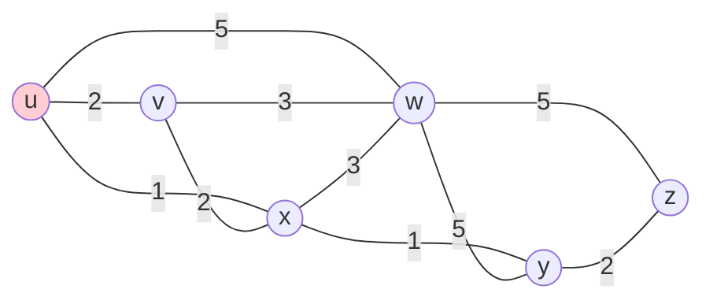

---
tags:
  - networking
  - calculations
  - trace-workbook
  - formulas
  - homework-solutions
  - exam-prep
created: 2026-08-17
updated: 2026-08-17
type: workbook
---

# Calculations and Trace Workbook - Master Step-by-Step Guide

> [!INFO] 📂 แหล่งไฟล์อ้างอิงต้นฉบับของอาจารย์ผู้สอน (Source Documents)
> - **การบ้านและสไลด์คำนวณ:** [Assignments.pptx](file:///c:/Project/computer-network-&-Internet/Assignments.pptx) *(TCP Handshake & Internet Checksum)*
> - **สไลด์บทเรียนหลัก:** [Chapter_1_Fundamental-Network_models_1-89.html](file:///c:/Project/computer-network-&-Internet/New/Chapter_1_Fundamental-Network_models_1-89.html) และ [Chapter_3_ Transport_Layer_1-154.html](file:///c:/Project/computer-network-&-Internet/New/Chapter_3_%20Transport_Layer_1-154.html)
> - **แบบทดสอบจริงจาก Classroom:** [exam.md](file:///c:/Project/computer-network-&-Internet/New/exam.md)

> [!SUMMARY] รวมสูตรคำนวณ ตาราง Trace และวิธีทำแบบละเอียดทุกขั้นตอน
> คู่มือนี้รวบรวมแบบฝึกหัดการคำนวณที่สำคัญทั้งหมดในวิชา Computer Networks & Internet โดยแสดงวิธีทำทีละขั้นตอนอย่างประณีต ครอบคลุม **6 การคำนวณหลัก**:
> 1. [[#1. Delay Calculations: Transmission vs Propagation Delay]] - การคำนวณ $d_{\text{trans}} = L/R$ และ $d_{\text{prop}} = d/s$ (Homework 1)
> 2. [[#2. Internet Checksum 16-Bit Calculation]] - วิธีคำนวณผลรวม 1's Complement และ Carry Wraparound (Homework 2 & Assignment 1)
> 3. [[#3. TCP Handshake & Byte Stream Sequence / ACK Traces]] - การคำนวณลำดับไบต์ การตอบรับ ACK และการส่งข้อมูล "hello" (Assignment 2)
> 4. [[#4. Subnetting & Variable Length Subnet Masking (VLSM)]] - การจัดสรร IP และ Subnet 172.16.0.0/22 สำหรับ 6 ซับเน็ต (Homework 3)
> 5. [[#5. Dijkstra's Shortest Path Algorithm Step-by-Step Trace]] - การสร้างตารางเส้นทางที่มีค่าใช้จ่ายต่ำสุด (Homework 4)
> 6. [[#6. Cyclic Redundancy Check (CRC) Polynomial Division]] - การหารยาวพหุนามด้วยการ XOR (Homework 5)

---

# 1. การคำนวณความล่าช้าในเครือข่าย (Transmission vs Propagation Delay)

*📌 อ้างอิงโจทย์: Homework 1*

### 📝 โจทย์ (Problem Statement)
เครื่องคอมพิวเตอร์ 2 เครื่องเชื่อมต่อถึงกันโดยตรงผ่านทางอินเทอร์เน็ต โดยลิงก์ที่เชื่อมระหว่างเครื่องคอมพิวเตอร์ทั้งสองมีแบนด์วิธ $R = 10\text{ Mbps}$ จงหา **Transmission Delay** และ **Propagation Delay** ที่เกิดขึ้นเมื่อส่งข้อมูลขนาด $L = 5,000,000\text{ bits}$ โดยเครื่องทั้งสองอยู่ห่างกัน $d = 50\text{ กิโลเมตร}$ (กำหนดให้อัตราเร็วของสัญญาณไฟฟ้า $s = 2 \times 10^8\text{ เมตร/วินาที}$)



---

### 🔍 วิธีทำทีละขั้นตอน (Step-by-Step Solution)

#### ตอนที่ 1: คำนวณ Transmission Delay ($d_{\text{trans}}$)

> [!DEFINITION] Transmission Delay (เวลาในการผลักบิตลงสาย)
> $$d_{\text{trans}} = \frac{L}{R}$$

- **ข้อมูลที่กำหนด:**
  - ขนาดของแพ็กเก็ต ($L$) $= 5,000,000\text{ bits}$
  - แบนด์วิธ ($R$) $= 10\text{ Mbps} = 10 \times 10^6\text{ bps} = 10,000,000\text{ bits/second}$
- **แทนค่าในสูตร:**
  $$d_{\text{trans}} = \frac{5,000,000\text{ bits}}{10,000,000\text{ bits/sec}} = 0.5\text{ วินาที (Seconds)}$$

---

#### ตอนที่ 2: คำนวณ Propagation Delay ($d_{\text{prop}}$)

> [!DEFINITION] Propagation Delay (เวลาที่สัญญาณเดินทางในตัวกลาง)
> $$d_{\text{prop}} = \frac{d}{s}$$

- **ข้อมูลที่กำหนด:**
  - ระยะทาง ($d$) $= 50\text{ km} = 50 \times 10^3\text{ m} = 50,000\text{ เมตร}$
  - ความเร็วการเดินทางของสัญญาณ ($s$) $= 2 \times 10^8\text{ m/s} = 200,000,000\text{ เมตร/วินาที}$
- **แทนค่าในสูตร:**
  $$d_{\text{prop}} = \frac{50,000\text{ m}}{200,000,000\text{ m/s}} = \frac{5}{20,000} = 0.00025\text{ วินาที} = 0.25\text{ ms (Milliseconds)}$$

---

#### 🎯 สรุปคำตอบ (Final Answer)
- **Transmission Delay ($d_{\text{trans}}$)** $= \mathbf{0.5\text{ วินาที}}$
- **Propagation Delay ($d_{\text{prop}}$)** $= \mathbf{0.00025\text{ วินาที}}\ (0.25\text{ ms})$

---

# 2. การคำนวณ Internet Checksum ขนาด 16 บิต

*📌 อ้างอิงโจทย์: Homework 2 & Assignments.pptx*

---

### 📝 กรณีศึกษาที่ 1 (Homework 2)
กำหนดเลขฐานสองความยาว 16 บิต จำนวน 2 ชุด:
- **ชุดที่ 1:** `1101 1011 0110 0101`
- **ชุดที่ 2:** `1110 1110 0101 1010`

#### ขั้นตอนการคำนวณ (Calculation Steps):
1. **บวกเลขฐานสอง 16 บิต:**
   ```
     1 1 0 1  1 0 1 1  0 1 1 0  0 1 0 1
   + 1 1 1 0  1 1 1 0  0 1 0 1  1 0 1 0
   -------------------------------------
   1 1 1 0 0  1 0 0 1  1 1 0 0  0 0 0 0  <-- เกิด Carry bit = 1 หลุดที่หลักที่ 17
   ```
2. **ทำการบวกทบ (Carry Wraparound):** นำตัวทด `1` ไปบวกเพิ่มที่หลักขวาสุด (LSB)
   ```
     1 1 0 0  1 0 0 1  1 1 0 0  0 0 0 0
   +                                   1
   -------------------------------------
     1 1 0 0  1 0 0 1  1 1 0 0  0 0 0 1  <-- ผลรวม (Sum)
   ```
3. **กลับบิตผลลัพธ์ (1's Complement Inversion):**
   ```
     Sum:      1 1 0 0  1 0 0 1  1 1 0 0  0 0 0 1
     Checksum: 0 0 1 1  0 1 1 0  0 0 1 1  1 1 1 0
   ```
- **ตอบ Checksum:** `0011 0110 0011 1110`

---

### 📝 กรณีศึกษาที่ 2 (Assignments.pptx ข้อ 1.1)
- ข้อมูล: `0001 0010 0011 0100` และ `0101 0110 0111 1000`

1. **บวกเลขฐานสอง:**
   ```
     0 0 0 1  0 0 1 0  0 0 1 1  0 1 0 0
   + 0 1 0 1  0 1 1 0  0 1 1 1  1 0 0 0
   -------------------------------------
     0 1 1 0  1 0 0 0  1 0 1 0  1 1 0 0  (ไม่มี Carry bit หลุดออก)
   ```
2. **กลับบิตผลลัพธ์:**
   - **Checksum:** `1001 0111 0101 0011`

---

### 📝 กรณีศึกษาที่ 3 (Assignments.pptx ข้อ 1.2)
- ข้อมูล: `1010 1011 1100 1101` และ `0101 0110 0111 1000`

1. **บวกเลขฐานสอง:**
   ```
     1 0 1 0  1 0 1 1  1 1 0 0  1 1 0 1
   + 0 1 0 1  0 1 1 0  0 1 1 1  1 0 0 0
   -------------------------------------
   1 0 0 0 0  0 0 1 0  0 1 0 0  0 1 0 1  (มี Carry = 1)
   ```
2. **Wraparound บวก 1:**
   ```
     0 0 0 0  0 0 1 0  0 1 0 0  0 1 0 1
   +                                   1
   -------------------------------------
     0 0 0 0  0 0 1 0  0 1 0 0  0 1 1 0
   ```
3. **กลับบิตผลลัพธ์:**
   - **Checksum:** `1111 1101 1011 1001`

---

# 3. ลำดับ TCP Handshake และการส่งข้อมูล Byte Stream

*📌 อ้างอิงโจทย์: Assignments.pptx ข้อ 2*

### 📝 โจทย์ (Problem Statement)
จงวาดไดอะแกรม **TCP Three-Way Handshake** พร้อมแสดงขั้นตอนการส่งข้อมูลข้อความ `"hello"` (ขนาด 5 Bytes) โดยระบุค่า Sequence Number (Seq), Acknowledgment Number (Ack) และ Control Flags ให้ครบถ้วน ใน 2 กรณี:
- **กรณีที่ 1:** กำหนด Client ISN = 300, Server ISN = 500
- **กรณีที่ 2:** กำหนด Client ISN = 1000, Server ISN = 2000

---

### 🔍 กรณีที่ 1: Client ISN = 300, Server ISN = 500



---

### 🔍 กรณีที่ 2: Client ISN = 1000, Server ISN = 2000

| ขั้นตอน (Step) | ทิศทาง (Direction) | Flags | Seq Number | Ack Number | Payload (Data) | คำอธิบายกลไก |
| :---: | :---: | :---: | :---: | :---: | :---: | :--- |
| **1 (SYN)** | Client $\to$ Server | `[SYN]` | **1000** | 0 | 0 Bytes | Client ขอเปิดการเชื่อมต่อ เริ่มที่ ISN 1000 (กิน Seq 1 แต้ม) |
| **2 (SYN-ACK)** | Server $\to$ Client | `[SYN, ACK]` | **2000** | **1001** | 0 Bytes | Server ตอบรับและเริ่มที่ ISN 2000, ตอบรับ Ack 1001 |
| **3 (ACK)** | Client $\to$ Server | `[ACK]` | **1001** | **2001** | 0 Bytes | Handshake สำเร็จ สมบูรณ์ทั้งสองฝั่ง |
| **4 (Data "hello")**| Client $\to$ Server | `[ACK, PSH]`| **1001** | **2001** | 5 Bytes | ส่งข้อความ "hello" 5 ไบต์ (ไบต์ 1001 ถึง 1005) |
| **5 (ACK Data)** | Server $\to$ Client | `[ACK]` | **2001** | **1006** | 0 Bytes | Server ยืนยันได้รับครบ โดยระบุ Ack = $1001 + 5 = \mathbf{1006}$ |

---

# 4. การแบ่งซับเน็ตแบบ VLSM (Variable Length Subnet Masking)

*📌 อ้างอิงโจทย์: Homework 3*

### 📝 โจทย์ (Problem Statement)
กำหนดบล็อกเครือข่าย **`172.16.0.0/22`** จงทำการแบ่งซับเน็ตตามจำนวน Host IP Address ที่ต้องการดังต่อไปนี้ โดยให้เลือกใช้ซับเน็ตที่มีขนาดประหยัดที่สุด (น้อยที่สุดที่เป็นไปได้):
1. **Subnet 1:** ต้องการ **400 IP Addresses**
2. **Subnet 2:** ต้องการ **200 IP Addresses**
3. **Subnet 3:** ต้องการ **100 IP Addresses**
4. **Subnet 4:** ต้องการ **50 IP Addresses**
5. **Subnet 5:** ต้องการ **25 IP Addresses**
6. **Subnet 6:** ต้องการ **2 IP Addresses**

---

### 🔍 วิธีการคำนวณตามหลักการ VLSM (Step-by-Step VLSM Calculation)

> [!RULE] กฎเหล็กของ VLSM
> 1. **ต้องเรียงลำดับความต้องการจากขนาดใหญ่ที่สุด $\to$ ขนาดเล็กที่สุดเสมอ** (Subnet 1 $\to$ Subnet 6)
> 2. จำนวน IP ในบล็อก $= 2^h$ โดยที่ $2^h \ge \text{จำนวน IP ที่ต้องการ}$
> 3. ขนาดของ Prefix $= 32 - h$ บิต



---

### 📊 ตารางสรุปคำตอบ VLSM (Master Subnet Table)

| Subnet | ความต้องการ IP | บิต Host ($h$) | ขนาดบล็อก ($2^h$) | Prefix | Network Address | Usable Host IP Range | Broadcast Address | Subnet Mask |
| :--- | :---: | :---: | :---: | :---: | :--- | :--- | :--- | :--- |
| **Subnet 1** | 400 | 9 บิต | 512 | **/23** | **172.16.0.0** | 172.16.0.1 – 172.16.1.254 | **172.16.1.255** | 255.255.254.0 |
| **Subnet 2** | 200 | 8 บิต | 256 | **/24** | **172.16.2.0** | 172.16.2.1 – 172.16.2.254 | **172.16.2.255** | 255.255.255.0 |
| **Subnet 3** | 100 | 7 บิต | 128 | **/25** | **172.16.3.0** | 172.16.3.1 – 172.16.3.126 | **172.16.3.127** | 255.255.255.128 |
| **Subnet 4** | 50 | 6 บิต | 64 | **/26** | **172.16.3.128** | 172.16.3.129 – 172.16.3.190 | **172.16.3.191** | 255.255.255.192 |
| **Subnet 5** | 25 | 5 บิต | 32 | **/27** | **172.16.3.192** | 172.16.3.193 – 172.16.3.222 | **172.16.3.223** | 255.255.255.224 |
| **Subnet 6** | 2 | 2 บิต | 4 | **/30** | **172.16.3.224** | 172.16.3.225 – 172.16.3.226 | **172.16.3.227** | 255.255.255.252 |

---

# 5. การคำนวณ Dijkstra's Algorithm Step-by-Step Trace

*📌 อ้างอิงโจทย์: Homework 4*

### 📝 โจทย์ (Problem Statement)
จงแสดงการคำนวณเส้นทางที่มีค่าใช้จ่ายน้อยที่สุด (Least-Cost Path) จาก **โหนดต้นทาง $u$** ไปยังโหนดอื่นๆ ในเครือข่าย ($v, w, x, y, z$) โดยใช้ **Dijkstra's Algorithm**:



---

### 📊 ตารางการคำนวณแบบ Trace Table (Dijkstra Execution Trace)

- **สัญลักษณ์:** $D(v), p(v)$ = ค่าใช้จ่ายรวมต่ำสุดจาก $u$ ไปยัง $v$ และโหนดก่อนหน้า (predecessor)
- $N'$ = เซตของโหนดที่หาเส้นทางต่ำสุดที่แน่นอนแล้ว

| รอบที่ (Step) | เซต $N'$ | $D(v), p(v)$ | $D(w), p(w)$ | $D(x), p(x)$ | $D(y), p(y)$ | $D(z), p(z)$ | โหนดที่ถูกเลือกเพิ่มเข้า $N'$ |
| :---: | :--- | :---: | :---: | :---: | :---: | :---: | :---: |
| **0 (Init)** | $\{u\}$ | $2, u$ | $5, u$ | **$1, u$** | $\infty$ | $\infty$ | **เลือก $x$ (Cost = 1)** |
| **1** | $\{u, x\}$ | **$2, u$** | $\min(5, 1+3) = 4, x$ | - | $1+1 = 2, x$ | $\infty$ | **เลือก $v$ (Cost = 2)** |
| **2** | $\{u, x, v\}$ | - | $\min(4, 2+3) = 4, x$ | - | **$2, x$** | $\infty$ | **เลือก $y$ (Cost = 2)** |
| **3** | $\{u, x, v, y\}$ | - | **$4, x$** | - | - | $2+2 = 4, y$ | **เลือก $w$ (Cost = 4)** |
| **4** | $\{u, x, v, y, w\}$ | - | - | - | - | **$4, y$** | **เลือก $z$ (Cost = 4)** |
| **5** | $\{u, x, v, y, w, z\}$ | ครบทุกโหนด | - | - | - | - | สิ้นสุดการทำงาน |

---

### 🌳 ต้นไม้เส้นทางต่ำสุด (Least-Cost Path Tree from $u$)
- **ไปยัง $x$:** $u \to x$ (Cost = 1)
- **ไปยัง $v$:** $u \to v$ (Cost = 2)
- **ไปยัง $y$:** $u \to x \to y$ (Cost = 2)
- **ไปยัง $w$:** $u \to x \to w$ (Cost = 4)
- **ไปยัง $z$:** $u \to x \to y \to z$ (Cost = 4)

---

# 6. การคำนวณ Cyclic Redundancy Check (CRC)

*📌 อ้างอิงโจทย์: Homework 5*

### 📝 โจทย์ (Problem Statement)
จงคำนวณหาค่าของ Cyclic Redundancy Check ($R$) เมื่อกำหนดให้:
- **ข้อมูล Data ($D$):** `101011` (6 บิต)
- **Generator Polynomial ($G$):** `1101` (4 บิต, ระดับ $r = 4 - 1 = 3$ บิต)

---

### 🔍 วิธีทำทีละขั้นตอน (Step-by-Step XOR Long Division)

1. **เตรียมตัวตั้ง ($D \cdot 2^r$):** เติมบิต `0` จำนวน $r = 3$ บิต ต่อท้ายข้อมูล $D$:
   $$\text{ตัวตั้ง} = 101011000$$
2. **ทำการหารยาวด้วยการ XOR (Modulo-2 Arithmetic):**
   - กฎ: $0 \oplus 0 = 0$, $1 \oplus 1 = 0$, $0 \oplus 1 = 1$, $1 \oplus 0 = 1$

```

             1 1 0 1 0 1
       ------------------
1 1 0 1 ) 1 0 1 0 1 1 0 0 0
          1 1 0 1
          -------
            1 1 1 1
            1 1 0 1
            -------
              0 1 0 1
              0 0 0 0
              -------
                1 0 1 0
                1 1 0 1
                -------
                  1 1 1 0
                  1 1 0 1
                  -------
                    0 1 1 0
                    0 0 0 0
                    -------
                      1 1 0  <-- เศษเหลือ (Remainder R) ขนาด 3 บิต

```

#### 🎯 สรุปคำตอบ (Final Answer)
- ค่า CRC ($R$) ที่ได้ $= \mathbf{110}$
- ข้อมูลที่ถูกส่งออกสู่สายสัญญาณจริง ($D + R$) $= \mathbf{101011110}$
