---
tags:
  - networking
  - exam-prep
  - close-book-80q
  - obsidian-vault
  - comprehensive-summary
created: 2026-08-18
updated: 2026-08-18
type: master-exam-summary
---

# 📚 Master Exam Study Guide: Computer Network & Internet (Chapters 1 – 4)

> [!IMPORTANT] 🎯 ข้อมูลการสอบ (Exam Scope & Format)
> - **รูปแบบข้อสอบ:** Multiple Choice จำนวน **80 ข้อ** (Close Book — ไม่อนุญาตให้นำเอกสารเข้าห้องสอบ)
> - **วัตถุประสงค์การวัดผล:** เน้น **ความเข้าใจในแนวคิด (Concepts), หลักการทำงาน (Mechanisms), นิยามคำศัพท์เทคนิค (Terminology) และโฟลว์การแลกเปลี่ยนข้อมูล (Protocol Flows)**
> - **ขอบเขต 4 บทหลัก:**
>   1. [[#บทที่ 1 Fundamental of Computer Network|1. Fundamental of Computer Network (พื้นฐานเครือข่าย)]]
>   2. [[#บทที่ 2 Network Models|2. Network Models (แบบจำลองเครือข่าย & สถาปัตยกรรม)]]
>   3. [[#บทที่ 3 Application Layer|3. Application Layer (โพรโทคอลระดับแอปพลิเคชัน)]]
>   4. [[#บทที่ 4 Transport Layer|4. Transport Layer (กลไกการส่งข้อมูลระดับโพรเซส)]]

---

# บทที่ 1: Fundamental of Computer Network

## 1.1 องค์ประกอบการสื่อสารข้อมูล (5 Components of Data Communication)

การสื่อสารข้อมูล (Data Communication) คือกระบวนการแลกเปลี่ยนสารสนเทศระหว่างอุปกรณ์สองฝั่งผ่านตัวกลางการส่งข้อมูล ประกอบด้วย 5 องค์ประกอบสำคัญ:

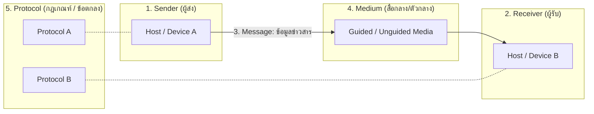

| องค์ประกอบ | คำศัพท์ภาษาอังกฤษ | หน้าที่และความหมาย |
| :--- | :--- | :--- |
| **1. ข้อมูล/ข่าวสาร** | **Message** | สารสนเทศที่ต้องการส่ง เช่น ข้อความ (Text), รูปภาพ (Image), เสียง (Audio), วิดีโอ (Video) ในรูปแบบรหัสบิต (0s และ 1s) |
| **2. ผู้ส่ง** | **Sender / Transmitter** | อุปกรณ์ที่เป็นแหล่งกำเนิดข้อมูล เช่น Computer, Smartphone, Server, IP Camera |
| **3. ผู้รับ** | **Receiver** | อุปกรณ์เป้าหมายที่รับข้อมูล เช่น Computer, Smartphone, Printer, Smart TV |
| **4. สื่อกลางนำสัญญาณ** | **Medium / Transmission Channel** | เส้นทางทางกายภาพที่ข้อมูลเดินทางผ่าน แบ่งเป็นแบบมีสาย (Guided) และไร้สาย (Unguided) |
| **5. โพรโทคอล** | **Protocol** | ชุดของกฎเกณฑ์ (Set of Rules) และข้อตกลงที่ทั้งสองฝั่งต้องปฏิบัติตามเพื่อให้เข้าใจข้อมูลตรงกัน ("If there is no protocol, devices may connect but cannot communicate") |

---

## 1.2 ทิศทางการส่งข้อมูล (Transmission Mode)

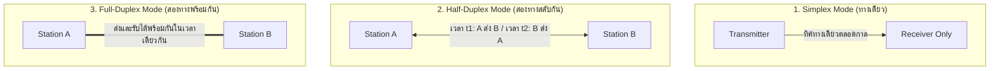

| Transmission Mode | ทิศทางการไหลของข้อมูล | การแชร์ช่องสัญญาณ (Channel Capacity) | ตัวอย่างในชีวิตจริง |
| :--- | :--- | :--- | :--- |
| **Simplex** | **ทิศทางเดียว (Unidirectional)** ไม่สามารถส่งย้อนกลับได้ | ฝ่ายหนึ่งใช้ Capacity ทั้งหมดเพื่อส่ง อีกฝ่ายเพื่อรับเท่านั้น | คีย์บอร์ด $\to$ CPU, จอมอนิเตอร์, วิทยุกระจายเสียง (FM/AM), โทรทัศน์ |
| **Half-Duplex** | **สองทิศทางแต่สลับเวลากัน (Bidirectional, not simultaneous)** | ทั้งช่องสัญญาณถูกใช้ส่งในทิศทางเดียว ณ ขณะใดขณะหนึ่ง | วิทยุสื่อสาร Walkie-Talkie ("เปลี่ยน/Over"), ระบบ Ethernet ยุคดั้งเดิม (CSMA/CD บน Hub) |
| **Full-Duplex (Duplex)** | **สองทิศทางพร้อมกัน (Bidirectional, simultaneous)** | ช่องสัญญาณแบ่ง Bandwidth หรือแยกสายส่ง/รับคนละคู่สัญญาณ | โทรศัพท์มือถือ/สมาร์ตโฟน, Full-Duplex Switched Ethernet, การสนทนาผ่าน Voice Call |

---

## 1.3 ชนิดของการเชื่อมต่อ (Connection Types / Line Configuration)

1. **Point-to-Point (จุดต่อจุด):**
   - มีช่องสัญญาณเฉพาะ (Dedicated Link) ระหว่างอุปกรณ์ 2 เครื่องเท่านั้น
   - ความจุของช่องสัญญาณทั้งหมด (Entire Capacity) สงวนไว้สำหรับการสื่อสารของ 2 จุดนี้
   - *ตัวอย่าง:* การต่อคอมพิวเตอร์เข้ากับ Switch โดยตรง, การเชื่อมต่อสาย Fiber ข้ามเมืองแบบ Leased Line
2. **Multipoint / Multi-drop (หลายจุดร่วม):**
   - อุปกรณ์มากกว่า 2 เครื่องแชร์ช่องสัญญาณทางกายภาพเดียวกัน (Shared Link)
   - มีการแบ่งความจุช่องสัญญาณ: **Spatially Shared** (แชร์พื้นที่/พิกัดพร้อมกัน) หรือ **Time Shared** (สลับช่วงเวลาการใช้)
   - *ตัวอย่าง:* สถาปัตยกรรม Bus Topology, โครงข่าย Wi-Fi Access Point (Wireless Shared Medium)

---

## 1.4 โครงสร้างเครือข่าย (Network Topology)

Topology คือรูปแบบการเชื่อมโยงทางกายภาพหรือเชิงตรรกะของโหนดและลิงก์ในเครือข่าย:

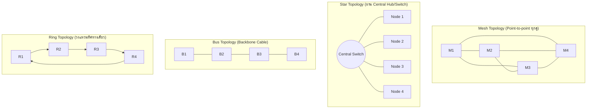

### ตารางเปรียบเทียบ Network Topologies และสูตรคำนวณที่ออกสอบบ่อย

| Topology                   | โครงสร้างหลัก                                                      | ข้อดี (Advantages)                                                                                                           | ข้อจำกัด (Disadvantages)                                                                                                          | สูตรคำนวณจำนวนสายและพอร์ต ($N$ โหนด)                                                                                             |
| :------------------------- | :----------------------------------------------------------------- | :--------------------------------------------------------------------------------------------------------------------------- | :-------------------------------------------------------------------------------------------------------------------------------- | :------------------------------------------------------------------------------------------------------------------------------- |
| **Mesh (Fully Connected)** | ทุกโหนดมีลิงก์ Point-to-Point เฉพาะถึงทุกโหนด                      | - ปลอดภัยสูง ข้อมูลไม่ถูกดักฟัง<br>- Robustness: สายใดสายหนึ่งขาด ระบบอื่นยังทำงานได้ปกติ<br>- ไม่มีปัญหา Traffic Contention | - ต้นทุนสายส่งสูงมาก<br>- ติดตั้งยากและเปลือง I/O Port มหาศาล                                                                     | **จำนวนสายสัญญาณ:** $\frac{N(N-1)}{2}$<br>**จำนวน Port ต่อโหนด:** $N-1$<br>*ตัวอย่าง: $N=6 \implies 15$ เส้น, $5$ พอร์ต/เครื่อง* |
| **Star**                   | ทุกโหนดต่อเข้า **Central Device** (Switch/Hub)                     | - ติดตั้งง่าย ดูแลง่าย<br>- หากสายของโหนดใดขาด โหนดอื่นไม่ได้รับผลกระทบ                                                      | - หาก Central Device พัง เครือข่ายล่มทั้งหมด (**Single Point of Failure**)                                                        | **จำนวนสายสัญญาณ:** $N$ เส้น<br>**จำนวน Port ต่อโหนด:** 1 พอร์ต                                                                  |
| **Bus**                    | ใช้สายแกนหลักเส้นเดียว (**Backbone Cable**) และใช้ Tap / Drop line | - ใช้สายน้อย ประหยัดต้นทุน<br>- ติดตั้งง่ายสำหรับเครือข่ายขนาดเล็ก                                                           | - หากสายแกนหลักขาด เครือข่ายล่มทั้งหมด<br>- ตรวจหาจุดเสียยาก (Difficult fault isolation)<br>- เกิดสัญญาณสะท้อนหากไม่มี Terminator | **จำนวนสายสัญญาณ:** 1 Backbone + $N$ Drop lines                                                                                  |
| **Ring**                   | เชื่อมต่อแบบวงกลม ข้อมูลส่งแบบ Unidirectional ผ่าน Repeater        | - ป้องกันการชนกันของข้อมูลได้ดี (ใช้ Token Ring)<br>- โครงสร้างเป็นระเบียบ                                                   | - หากสายขาดจุดเดียวหรือโหนดใดดับ ระบบล่มทั้งวงแหวน (เว้นแต่ใช้ Dual Ring)                                                         | **จำนวนสายสัญญาณ:** $N$ เส้น                                                                                                     |
| **Hybrid**                 | การผสมผสาน Topology หลายแบบ เช่น **Star-Bus, Star-Ring**           | - ยืดหยุ่นสูง ปรับขนาดได้ดีตามพื้นที่อาคาร                                                                                   | - อุปกรณ์ควบคุมมีความซับซ้อน                                                                                                      | ขึ้นกับรูปแบบการรวม                                                                                                              |

---

## 1.5 ขอบเขตทางภูมิศาสตร์ของเครือข่าย (Network Types by Geographic Scope)

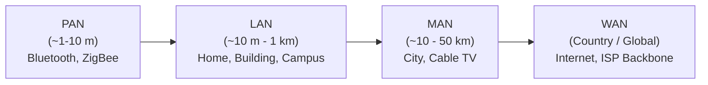

1. **PAN (Personal Area Network):** ระยะไม่เกิน 10 เมตร ใช้งานส่วนบุคคล เช่น Bluetooth หูฟังไร้สาย, Smartwatch, เครือข่ายไร้สายระยะสั้น (Zigbee/UWB)
2. **LAN (Local Area Network):** ครอบคลุมพื้นที่จำกัด เช่น ห้องเรียน, สำนักงาน, ตึกเดี่ยว หรือวิทยาเขต (Campus) ความเร็วสูง (1 Gbps - 10 Gbps) ดูแลโดยองค์กรเดียว (Privately Owned)
3. **MAN (Metropolitan Area Network):** ครอบคลุมระดับเมืองหรือจังหวัด เช่น โครงข่ายเคเบิลทีวีของเมือง, เครือข่ายเชื่อมต่อสำนักงานสาขาทั่ว กทม.
4. **WAN (Wide Area Network):** ครอบคลุมระดับประเทศ ทวีป หรือทั่วโลก มีการเชื่อมต่อผ่าน Router ข้ามผู้ให้บริการ เช่น เครือข่ายโครงข่ายโทรคมนาคม, **Internet** ซึ่งเป็น WAN ที่ใหญ่ที่สุดในโลก

---

## 1.6 สื่อกลางส่งข้อมูล (Transmission Media)

### 1. Guided Media (สื่อกลางแบบมีสาย / สื่อกลางนำทาง)
*ส่งสัญญาณคลื่นแม่เหล็กไฟฟ้าไปตามตัวนำทางกายภาพ:*
- **Twisted Pair Cable (สายคู่บิดเกลียว):**
  - ลวดทองแดงหุ้มฉนวนตีเกลียวคู่เพื่อ **ลดสัญญาณรบกวนข้ามสาย (Crosstalk) และสัญญาณรบกวนแม่เหล็กไฟฟ้า (EMI)**
  - **UTP (Unshielded Twisted Pair):** ราคาประหยัด นิยมสูงสุดใน LAN (Cat5e, Cat6, Cat6a) ใช้หัวต่อ **RJ-45**
  - **STP (Shielded Twisted Pair):** มีแผ่นฟอยล์โลหะหุ้มป้องกันสัญญาณรบกวนได้ดีกว่า นิยมในโรงงานอุตสาหกรรม
- **Coaxial Cable (สายโคแอกเชียล):**
  - แกนทองแดงเดี่ยวตรงกลาง หุ้มด้วยฉนวนตาข่ายโลหะถัก ป้องกัน EMI ได้ดี นิยมในระบบ Cable TV, จานดาวเทียม
- **Fiber Optic Cable (สายใยแก้วนำแสง):**
  - ส่งข้อมูลในรูปของ **คลื่นแสง (Light pulses)** โดยอาศัยหลักการ **การสะท้อนกลับหมด (Total Internal Reflection)**
  - **ข้อดีเด่น:** Bandwidth สูงมหาศาล, ส่งได้ระยะทางไกลมาก, **ไม่ได้รับผลกระทบจากคลื่นรบกวนทางแม่เหล็กไฟฟ้า (Immune to EMI)** ปลอดภัยจากการดักฟัง
  - **Single-Mode Fiber (SMF):** แกนแก้วเล็กมาก (~9 $\mu$m) แสงวิ่งตรงทางเดียว ใช้ Laser เหมาะสำหรับระยะไกลระดับกิโลเมตร/ข้ามเมือง
  - **Multi-Mode Fiber (MMF):** แกนแก้วใหญ่กว่า (~50–62.5 $\mu$m) แสงสะท้อนหลายมุม ใช้ LED เหมาะสำหรับระยะสั้นใน Data Center/อาคาร

### 2. Unguided Media (สื่อกลางแบบไร้สาย / สื่อกลางไร้ทิศทาง)
*ส่งคลื่นแม่เหล็กไฟฟ้าผ่านอากาศหรือสุญญากาศ (Electromagnetic Waves):*
- **Radio Waves (คลื่นวิทยุ):** ย่านความถี่ 3 kHz – 1 GHz ส่งสัญญาณแบบ **Omnidirectional** (กระจายรอบทิศทาง) ทะลุกำแพงได้ดี เช่น Wi-Fi, วิทยุ FM/AM, เครือข่ายเซลลูลาร์
- **Microwaves (คลื่นไมโครเวฟ):** ย่านความถี่ 1 GHz – 300 GHz ส่งสัญญาณแบบ **Line-of-Sight / Unidirectional** (เส้นตรงแนวสายตา) เสาส่งต้องเล็งตรงกัน เช่น สัญญาณดาวเทียม, จานส่งสัญญาณไมโครเวฟข้ามยอดเขา
- **Infrared (คลื่นอินฟราเรด):** ความถี่ 300 GHz – 400 THz ระยะสั้นมาก ไม่สามารถทะลุกำแพงได้ ปลอดภัยจากการรบกวนห้องข้างเคียง เช่น รีโมททีวี

---

## 1.7 โพรโทคอลและมาตรฐาน RFC (Protocol & RFC)

> [!DEFINITION] องค์ประกอบหลัก 3 ประการของ Protocol (The Key Elements of a Protocol)
> 1. **Syntax (ไวยากรณ์/รูปแบบ):** โครงสร้างหรือรูปแบบของข้อมูล (Data format), ขนาดบิต, และตำแหน่งของ Header/Data 
> 2. **Semantics (ความหมาย):** ความหมายของแต่ละบิตหรือคำสั่ง และการระบุว่าเมื่อได้รับบิตนั้นจะต้องดำเนินการ (Action) อย่างไร
> 3. **Timing (จังหวะเวลา/ความเร็ว):** กำหนดว่าเมื่อใดควรส่งข้อมูล และความเร็วในการส่งข้อมูลต้องสอดคล้องกับความสามารถในการรับข้อมูล (Speed matching / Sequencing)

- **Standards Organizations:** ISO, IEEE (เช่น 802.3 Ethernet, 802.11 Wi-Fi), ITU-T, IETF
- **RFC (Request for Comments):** เอกสารมาตรฐานอย่างเป็นทางการของอินเทอร์เน็ต ดูแลโดย **IETF (Internet Engineering Task Force)** โดยมาตรฐานโปรโตคอลหลักเช่น IP (RFC 791), TCP (RFC 793), HTTP/1.1 (RFC 2616) ล้วนถูกบันทึกเป็น RFC

---

## 1.8 ประวัติและวิวัฒนาการของอินเทอร์เน็ต (Internet Milestones)

| ปี ค.ศ. | เหตุการณ์สำคัญ (Key Milestones) | ความสำคัญ |
| :--- | :--- | :--- |
| **1969** | **ARPANET** ถือกำเนิดขึ้น | โครงการวิจัยของกระทรวงกลาโหมสหรัฐฯ (DARPA) เชื่อมต่อคอมพิวเตอร์ 4 โหนดแรก (UCLA, Stanford SRI, UC Santa Barbara, Utah) โดยใช้เทคโนโลยี Packet Switching |
| **1972** | **Ray Tomlinson** คิดค้น Email | กำหนดการใช้สัญลักษณ์ `@` เพื่อระบุผู้ใช้และโฮสต์ |
| **1983** | **เปลี่ยนผ่านสู่ TCP/IP (Flag Day)** | วันที่ 1 มกราคม 1983 ARPANET เปลี่ยนจากโปรโตคอล NCP (Network Control Protocol) มาเป็น **TCP/IP อย่างเป็นทางการ** ถือเป็นวันเกิดของอินเทอร์เน็ตสมัยใหม่ |
| **1983** | **DNS (Domain Name System)** | คิดค้นโดย Paul Mockapetris เพื่อแปลงชื่อโดเมนเป็น IP Address แทนไฟล์ `hosts.txt` |
| **1989–1991** | **World Wide Web (WWW)** | **Tim Berners-Lee** คิดค้น HTML, HTTP, URL และเว็บเบราว์เซอร์ตัวแรกที่ CERN สวิตเซอร์แลนด์ |
| **1990s** | **Commercialization & ISP** | การยกเลิกข้อจำกัดเชิงพาณิชย์ของ NSFNET และเปิดให้เอกชนเข้าให้บริการ Internet Service Providers (ISPs) |

---

# บทที่ 2: Network Models

## 2.1 สถาปัตยกรรมการสื่อสาร: Logical vs Physical Communication

- **Physical Communication:** การส่งสัญญาณไฟฟ้า แสง หรือคลื่นวิทยุจริงผ่านตัวกลางทางกายภาพ โดยข้อมูลต้องวิ่งลงมาที่ Physical Layer ของโฮสต์ ผ่านลิงก์ทางกายภาพ ข้ามอุปกรณ์กลาง (Switches/Routers) แล้ววิ่งขึ้นไปยัง Physical Layer ของปลายทาง
- **Logical Communication (การสื่อสารเชิงตรรกะ):** มุมมองเสมือนว่า Layer เดียวกันของสองโฮสต์กำลังสื่อสารกันโดยตรงแบบ Peer-to-Peer ผ่านโปรโตคอลของ Layer นั้น (เช่น Transport Layer รู้สึกเหมือนคุยกับ Transport Layer ของอีกฝั่งตรงๆ โดยมองข้าม Network Core ที่อยู่ตรงกลาง)

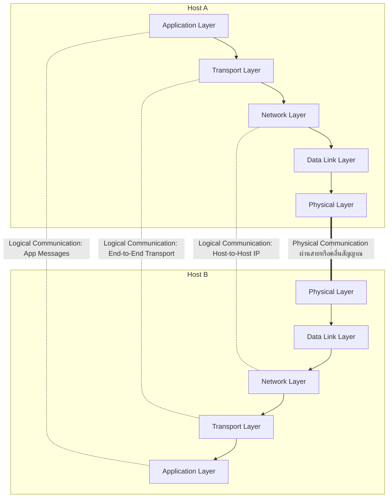

---

## 2.2 โครงสร้างเครือข่ายอินเทอร์เน็ต: Network Edge vs Network Core

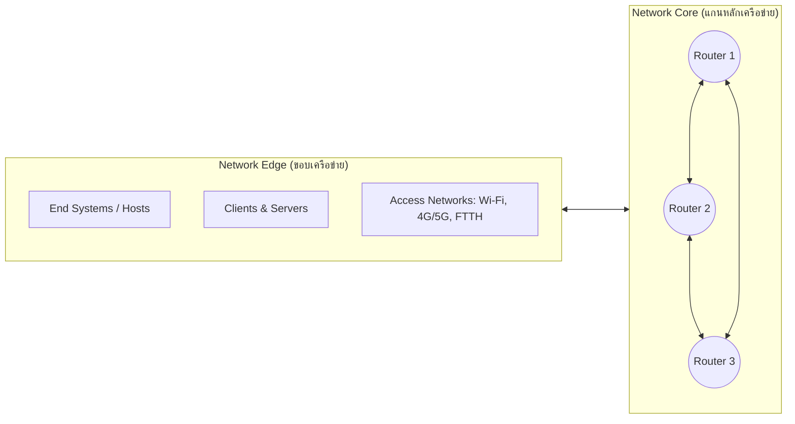

1. **Network Edge (ขอบระบบเครือข่าย):**
   - ประกอบด้วย **End Systems (Hosts):** เช่น คอมพิวเตอร์, เซิร์ฟเวอร์, สมาร์ตโฟน, IoT
   - รันโปรแกรมระดับ Application Layer
   - เชื่อมต่อเข้าสู่เครือข่ายผ่าน **Access Networks** (เช่น DSL, Cable, FTTH ใยแก้ว, Wi-Fi, 4G/5G)
2. **Network Core (แกนกลางเครือข่าย):**
   - โครงข่ายของ **Routers และ Switches** ที่เชื่อมต่อกันเป็น Mesh
   - ทำหน้าที่ Forward ข้อมูลจากต้นทางไปปลายทางผ่านกระบวนการ **Packet Switching (Store-and-Forward)**
   - *เปรียบเทียบการสวิตชิ่ง:*
     - **Packet Switching:** ข้อมูลถูกแบ่งเป็นชิ้นเล็กๆ (Packets) แย่งใช้ช่องสัญญาณตามความต้องการ (Statistical Multiplexing) ไม่จอง Bandwidth ล่วงหน้า
     - **Circuit Switching:** ต้องสร้างวงจรเฉพาะ (Dedicated circuit) ก่อนส่ง เช่น ระบบโทรศัพท์พื้นฐานดั้งเดิม มีการจอง Bandwidth ตลอดสาย

---

## 2.3 การเปรียบเทียบ Internet Protocol Stack (5 Layers) vs OSI Model (7 Layers)

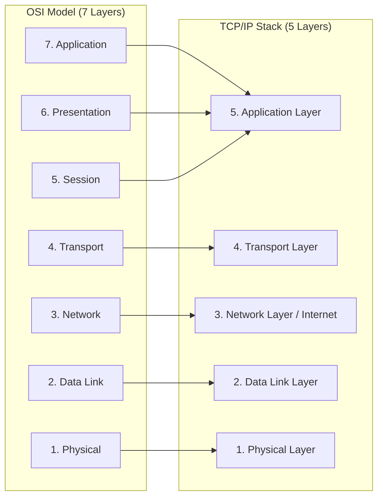

### หน้าที่และ PDU ของแต่ละ Layer อย่างละเอียด

| Layer (TCP/IP) | OSI Equivalent | PDU (หน่วยข้อมูล) | หน้าที่สำคัญ (Key Functions) | อุปกรณ์ / โปรโตคอลหลัก |
| :--- | :--- | :--- | :--- | :--- |
| **5. Application** | Application, Presentation, Session | **Data / Message** | ให้บริการเครือข่ายแก่ผู้ใช้และแอปพลิเคชัน (รวมหน้าที่แปลงรหัสข้อมูล, การเข้ารหัส Encryption, การบีบอัดข้อมูล, และ Session Control) | HTTP, HTTPS, DNS, SMTP, FTP, SSH, DHCP |
| **4. Transport** | Transport | **Segment** (TCP) / **Datagram** (UDP) | ส่งข้อมูลแบบ **Process-to-Process (End-to-End)**, จัดการ Multiplexing/Demultiplexing โดยใช้ Port Number, Flow Control, Congestion Control, Error Recovery | TCP, UDP |
| **3. Network** | Network | **Packet / Datagram** | ส่งข้อมูลแบบ **Host-to-Host (Source-to-Destination)** ข้ามเครือข่าย, การกำหนดหมายเลข Logical Addressing (IP Address), การเลือกเส้นทาง (Routing) | IP (IPv4, IPv6), ICMP, OSPF, BGP, **Routers** |
| **2. Data Link** | Data Link | **Frame** | ส่งข้อมูลแบบ **Node-to-Node (Hop-to-Hop)** ภายในเครือข่ายเดียวกัน, การกำหนดหมายเลข Physical Addressing (**MAC Address**), การควบคุมการเข้าถึงสื่อกลาง (MAC), Error Detection (CRC/FCS) | Ethernet (802.3), Wi-Fi (802.11), **Switches, Bridges** |
| **1. Physical** | Physical | **Bit (0s and 1s)** | แปลงบิตดิจิทัลเป็นสัญญาณไฟฟ้า, คลื่นแสง หรือคลื่นวิทยุ ส่งผ่านตัวกลางกายภาพ, กำหนดสเปกของสายและหัวต่อ | สาย UTP, Fiber, หัว RJ-45, **Hubs, Repeaters** |

---

## 2.4 กลไก Encapsulation และ De-encapsulation

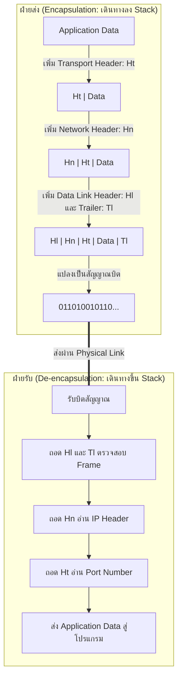

- **Encapsulation (การห่อหุ้มข้อมูล):** ข้อมูลเดินทางจาก Layer บนลง Layer ล่าง โดยแต่ละ Layer จะเพิ่มข้อมูลควบคุมของตนเองที่เรียกว่า **Header** (และ Data Link Layer จะเพิ่ม **Trailer** ที่บรรจุ Checksum/FCS ด้วย) เพื่อบอกวิธีจัดการข้อมูลแก่ Layer เดียวกันที่ฝั่งรับ
- **De-encapsulation (การถอดรหัสข้อมูล):** ฝั่งรับอ่านข้อมูลจาก Layer ล่างขึ้น Layer บน โดยแกะ Header ของแต่ละ Layer ออกตามลำดับ แล้วส่งต่อเฉพาะ Payload ข้อมูลบริสุทธิ์ให้แก่ Layer ถัดไป

---

## 2.5 ความสัมพันธ์ระหว่าง Protocol และ Service

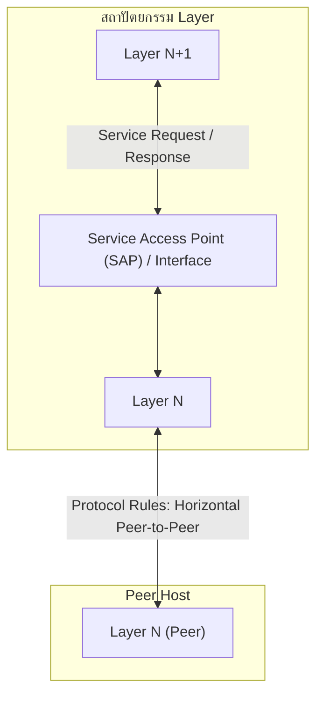

- **Service (บริการ):** การทำงานที่ Layer ด้านล่างจัดเตรียมและส่งมอบให้กับ Layer ที่อยู่ติดกันด้านบน (Vertical communication) ผ่านทาง **Service Access Point (SAP) / Interface**
- **Protocol (โพรโทคอล):** กฎเกณฑ์และข้อตกลงที่ Layer เดียวกันของสองเครื่อง (Peer Entities) ใช้สื่อสารแลกเปลี่ยนข้อมูลกันในแนวระนาบ (Horizontal communication)

---

# บทที่ 3: Application Layer

## 3.1 สถาปัตยกรรมแอปพลิเคชันเครือข่าย (Network Application Architecture)

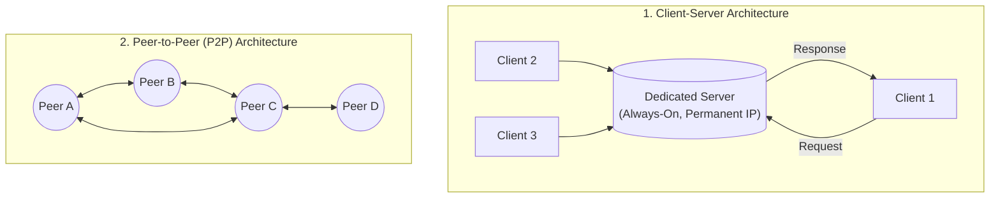

| สถาปัตยกรรม | ลักษณะการทำงาน | ข้อดี | ข้อเสีย / ความท้าทาย | ตัวอย่าง |
| :--- | :--- | :--- | :--- | :--- |
| **Client-Server** | - **Server:** เปิดทำงานตลอดเวลา (Always-on host), มี IP Address ถาวร/คงที่ (Fixed/Permanent IP), รองรับ Client จำนวนมาก<br>- **Client:** ติดต่อ Server เมื่อต้องการข้อมูล, ไม่ได้คุยกันเอง, IP เปลี่ยนแปลงได้ | จัดการความปลอดภัยง่าย ศูนย์กลางข้อมูลแน่นอน (Centralized Management) | - Server เป็นคอขวด (Bottleneck)<br>- ไม่มีความสามารถ Self-scalability (ยิ่งผู้ใช้เยอะ ต้นทุน Server ยิ่งสูง) | เว็บ (HTTP/HTTPS), อีเมล (SMTP/POP3/IMAP), DNS |
| **Peer-to-Peer (P2P)** | - ไม่มีเซิร์ฟเวอร์ศูนย์กลางถาวร<br>- เครื่องผู้ใช้แต่ละเครื่อง (**Peers**) ทำหน้าที่เป็นทั้ง Client และ Server พร้อมกัน (ส่งและดาวน์โหลดพร้อมกัน) | **Self-Scalability:** ยิ่งมีโหนดเข้ามาใช้งานมาก ยิ่งเพิ่ม Service Capacity รวมในระบบ | - ซับซ้อนในการบริหารจัดการ<br>- มีความเสี่ยงด้านความปลอดภัยและ IP เปลี่ยนแปลงตลอดเวลา (Churn) | BitTorrent, BitCoin, Blockchain |
| **Hybrid (ลูกผสม)** | ผสมทั้ง Server และ P2P เช่น ใช้เซิร์ฟเวอร์ช่วยค้นหาโหนดและจับคู่ จากนั้นคุยตรงแบบ P2P | รวมข้อดีของทั้งสองแบบ | สถาปัตยกรรมมีความซับซ้อน | Skype ยุคแรก, ระบบค้นหา Instant Messaging |

---

## 3.2 Process, Socket, IP Address และ Port Number

- **Process:** โปรแกรมที่กำลังทำงานอยู่บน Host (ถ้าอยู่บนเครื่องเดียวกัน สื่อสารกันผ่าน Inter-Process Communication: IPC)
- **Socket:** เสมือน **"ประตู (Doorway)"** หรือ Interface ที่อยู่ตรงกลางระหว่าง Process (Application Layer) กับโครงข่ายของระบบปฏิบัติการ (Transport Layer) โดย Application ส่งและรับข้อมูลผ่าน Socket
- **Addressing Mechanism:** ในการระบุเป้าหมายอย่างสมบูรณ์ ต้องใช้ทั้ง:
  1. **IP Address (32 บิต IPv4 / 128 บิต IPv6):** ระบุ **เครื่องปลายทาง (Host)** ในเครือข่าย
  2. **Port Number (16 บิต: 0–65535):** ระบุ **โปรเซส/บริการเฉพาะ (Specific Process)** บนเครื่องนั้น

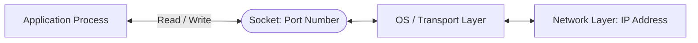

---

## 3.3 ความต้องการของ Application (Application Requirements)

| บริการ / มิติความต้องการ | การยอมรับการสูญหาย (Data Loss) | ความไวต่อเวลา (Delay / Latency) | ความต้องการ Bandwidth | ตัวอย่างแอปพลิเคชัน | Transport Protocol ที่เลือกใช้ |
| :--- | :--- | :--- | :--- | :--- | :--- |
| **File Transfer / Web** | **Loss-intolerant (ห้ามสูญหายเด็ดขาด 100%)** | Elastic (ยืดหยุ่นได้ รอได้) | ยืดหยุ่นตามสภาพเครือข่าย | HTTP, FTP, SSH, อีเมล | **TCP** |
| **Real-time Audio / Video** | **Loss-tolerant (ยอมรับการสูญหายบางแพ็กเก็ตได้)** | **Time-sensitive (ต้องตอบสนองทันที ดีเลย์ต่ำ)** | ต้องการ Bandwidth ขั้นต่ำคงที่ | VoIP, Video Conferencing (Zoom, Teams) | **UDP** (หรือ TCP ปรับแต่ง) |
| **Online Gaming** | **Loss-tolerant** เล็กน้อย | **Very Time-sensitive (< 100 ms)** | ต่ำ แต่ต้องการความถี่สูง | Real-time Multiplayer Games | **UDP** |

---

## 3.4 HTTP (Hypertext Transfer Protocol) และ HTTPS

- **HTTP:** โพรโทคอลหลักของ Web ใช้สถาปัตยกรรม Client-Server บน **TCP พอร์ต 80**
- **HTTPS:** HTTP over **SSL/TLS** เพิ่มการเข้ารหัสลับ (Encryption) และการยืนยันตัวตน บน **TCP พอร์ต 443**
- **Stateless Protocol:** HTTP Server **ไม่เก็บสถานะ (State)** หรือประวัติการร้องขอในอดีตของ Client ไว้เลย หาก Client ร้องขอไฟล์เดิมซ้ำ Server จะส่งใหม่ทั้งหมด
- **การจัดการสถานะ (State Management):** ใช้เทคโนโลยีเสริมคือ **Cookies** (เซิร์ฟเวอร์ส่ง Header `Set-Cookie: ID` $\to$ ฝั่ง Client บันทึกและส่ง `Cookie: ID` กลับไปทุกครั้ง) ควบคู่กับ Session บน Database

### โครงสร้างข้อความ HTTP Request Message

```http
GET /index.html HTTP/1.1\r\n           <--- Request Line (Method, URL, Version)
Host: www.example.com\r\n              <--- Header Lines
User-Agent: Mozilla/5.0\r\n
Accept-Language: th,en\r\n
Connection: keep-alive\r\n
\r\n                                   <--- Blank Line (\r\n บรรทัดว่างคั่นส่วนหัวและเนื้อหา)
[Entity Body - ข้อมูลเพิ่มเติม เช่น ข้อมูล Form เมื่อใช้ Method POST]
```

### HTTP Request Methods สำคัญ
- **`GET`:** ร้องขอข้อมูล/ดึง Resource จากเซิร์ฟเวอร์ (ไม่มี Entity Body, พารามิเตอร์แนบใน URL Query string)
- **`POST`:** ส่งข้อมูลไปให้เซิร์ฟเวอร์ประมวลผล เช่น ส่งแบบฟอร์ม (Form Data), อัปโหลดไฟล์ (ข้อมูลอยู่ใน Entity Body)
- **`PUT`:** อัปโหลดหรือแทนที่ Resource ที่ระบุด้วยไฟล์/ข้อมูลใหม่ทั้งหมดตาม URL นั้น
- **`DELETE`:** ขอลบ Resource ที่ระบุบนเซิร์ฟเวอร์
- **`HEAD`:** คล้าย GET แต่เซิร์ฟเวอร์จะตอบกลับเฉพาะ **Header Lines** เท่านั้น (ไม่ส่ง Entity Body) ใช้สำหรับตรวจสอบขนาดไฟล์หรือการแก้ไขล่าสุด

---

## 3.5 Non-Persistent HTTP vs Persistent HTTP

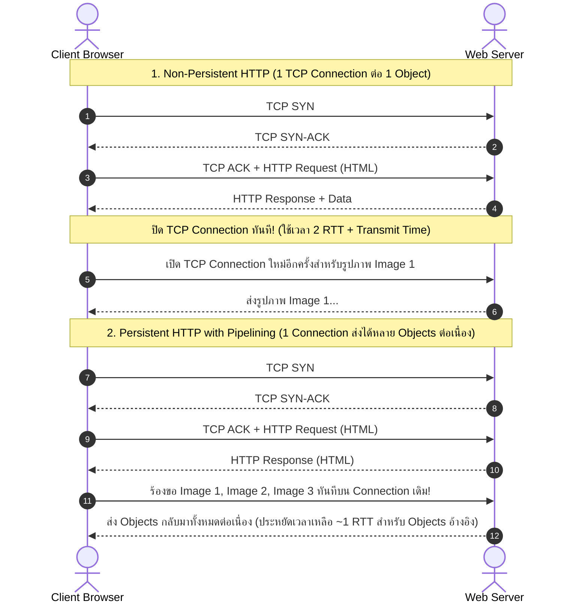

- **Non-Persistent HTTP (HTTP/1.0):** 
  - สร้าง 1 TCP Connection ต่อการดึง 1 อ็อบเจกต์ แล้วปิดทันที
  - ดึง 1 ไฟล์ใช้เวลา $= 2 \text{ RTT} + \text{Transmission time}$
  - หากเว็บเพจมี HTML 1 ไฟล์และรูป 10 รูป ต้องเปิด-ปิด TCP ถึง 11 ครั้ง
- **Persistent HTTP (HTTP/1.1 เป็นต้นมา):**
  - คง TCP Connection ไว้เปิดค้างไว้หลังจากส่งการตอบกลับแล้ว สามารถใช้ Connection เดิมดึง Objects อ้างอิงอื่นๆ ต่อได้ทันที
  - **Persistent with Pipelining:** Client ส่งคำขอไฟล์ถัดๆ ไปได้ทันทีโดยไม่ต้องรอให้ไฟล์ก่อนหน้าตอบกลับมา ประหยัด RTT อย่างมหาศาล

---

## 3.6 DNS (Domain Name System) และ DNS Cache

> [!DEFINITION] DNS หน้าที่หลัก
> ทำหน้าที่เป็นสมุดโทรศัพท์ของอินเทอร์เน็ต แปลงชื่อที่มนุษย์จำง่าย (**Hostname/Domain name**) เช่น `www.google.com` ให้เป็นหมายเลขที่เครื่องใช้สื่อสาร (**IP Address**) เช่น `142.250.190.46` ทำงานบน **UDP พอร์ต 53** (และใช้ TCP พอร์ต 53 สำหรับ Zone Transfer)

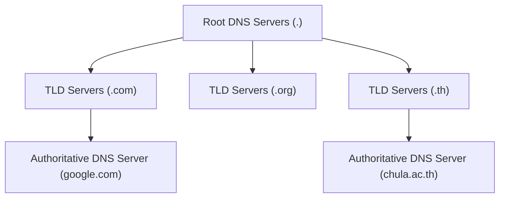

### รูปแบบการสอบถาม DNS (DNS Query Resolution)
1. **Iterative Query (แบบวนซ้ำ):** Local DNS Server วิ่งไปถาม Root DNS $\to$ ได้คำตอบเป็น IP ของ TLD $\to$ วิ่งไปถาม TLD $\to$ ได้ IP ของ Authoritative Server $\to$ วิ่งไปถาม Authoritative จนได้ IP จริง (ภาระการค้นหาอยู่ที่ Local DNS)
2. **Recursive Query (แบบเรียกซ้ำ):** โฮสต์ส่งถาม Local DNS $\to$ Local DNS ส่งต่อให้ Root $\to$ Root ส่งต่อให้ TLD $\to$ TLD ส่งต่อให้ Auth $\to$ ผลลัพธ์ส่งย้อนกลับมาตามสายทอด

### ประเภทของ DNS Resource Records (RR)
- **Type `A`:** เก็บค่า Name = Hostname, Value = **IPv4 Address**
- **Type `AAAA`:** เก็บค่า Name = Hostname, Value = **IPv6 Address**
- **Type `CNAME`:** เก็บชื่อจริง (Canonical Name) ของ Hostname ที่เป็น Alias/ชื่อเล่น
- **Type `NS`:** ระบุ Domain name ของ **Authoritative Name Server** สำหรับโซนนั้น
- **Type `MX`:** ระบุชื่อเครื่อง **Mail Server** สำหรับการส่งอีเมลของโดเมนนั้น

> [!TIP] DNS Caching & TTL (Time-to-Live)
> เมื่อ DNS Server ได้รับคำตอบจะบันทึก Mapping ไว้ใน Local Cache ชั่วคราวตามเวลา **TTL** หากมีการสอบถามชื่อเดิมซ้ำ จะตอบกลับทันทีโดยไม่ต้องไปสืบค้นลำดับชั้นใหม่ ช่วยลด Delay และ Traffic ในอินเทอร์เน็ต

---

## 3.7 ระบบอีเมลและโปรโตคอล (Email Protocols)

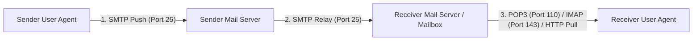

- **SMTP (Simple Mail Transfer Protocol):** 
  - ทำงานบน **TCP พอร์ต 25** (หรือ 587 สำหรับ Submission)
  - เป็น **Push Protocol** ใช้ส่งอีเมลจากโปรแกรมผู้ส่งไปยัง Mail Server และส่งต่อระหว่าง Mail Server ถึง Mail Server
  - เดิมรองรับเฉพาะ 7-bit ASCII จึงต้องใช้ **MIME (Multipurpose Internet Mail Extensions)** ในการแปลงไฟล์รูปภาพและภาษาอื่นๆ
- **Mail Access Protocols (Pull Protocols - สำหรับดึงอีเมลจาก Mailbox มาอ่าน):**
  - **POP3 (Post Office Protocol v3 - Port 110):** โหมด "Download-and-Delete" หรือ "Download-and-Keep" ดึงอีเมลมาไว้บนเครื่อง ไม่ซิงค์โฟลเดอร์ข้ามอุปกรณ์
  - **IMAP (Internet Message Access Protocol - Port 143):** เก็บอีเมลทั้งหมดไว้บน Server สร้างโฟลเดอร์ ซิงค์สถานะ (Read/Unread) ตรงกันทุกอุปกรณ์
  - **HTTP/Webmail (Port 80/443):** อ่านและส่งอีเมลผ่านเว็บเบราว์เซอร์

---

## 3.8 สรุปตารางหมายเลขพอร์ตมาตรฐานที่สำคัญ (Well-Known Ports 0–1023)

| Port Number | Protocol | Transport Protocol | หน้าที่และคำอธิบาย |
| :--- | :--- | :--- | :--- |
| **20 / 21** | **FTP** | TCP | File Transfer Protocol (Port 21: Control Connection, Port 20: Data Connection) |
| **22** | **SSH** | TCP | Secure Shell (รีโมตคอนโซลแบบเข้ารหัส ปลอดภัย) |
| **23** | **Telnet** | TCP | Remote Terminal แบบข้อความธรรมดา (ไม่ปลอดภัย/Unencrypted) |
| **25** | **SMTP** | TCP | Simple Mail Transfer Protocol (การส่งและส่งต่ออีเมล) |
| **53** | **DNS** | UDP / TCP | Domain Name System (แปลงชื่อโดเมนเป็น IP) |
| **67 / 68** | **DHCP** | UDP | Dynamic Host Configuration Protocol (Port 67: Server, Port 68: Client) |
| **80** | **HTTP** | TCP | Hypertext Transfer Protocol (การเข้าชมเว็บแบบทั่วไป) |
| **110** | **POP3** | TCP | Post Office Protocol Version 3 (ดึงอีเมล) |
| **143** | **IMAP** | TCP | Internet Message Access Protocol (ดึงและซิงค์อีเมลบนเซิร์ฟเวอร์) |
| **443** | **HTTPS** | TCP | HTTP Secure (การเข้าชมเว็บแบบเข้ารหัสด้วย SSL/TLS) |

---

# บทที่ 4: Transport Layer

## 4.1 หน้าที่หลักและกลไก Multiplexing / Demultiplexing

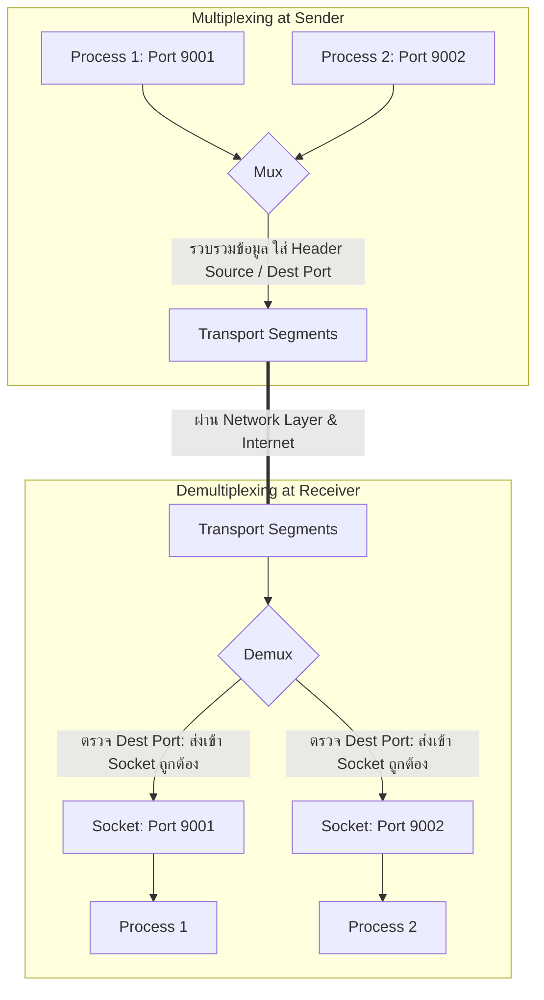

- **หน้าที่หลัก:** ให้บริการ **Logical Communication แบบ Process-to-Process (End-to-End)** ระหว่างโฮสต์ที่ต่างกัน
- **Multiplexing (ฝ่ายส่ง):** การรวบรวมชิ้นส่วนข้อมูล (Data Chunks) จากหลายๆ Socket ภายในเครื่อง ห่อหุ้มด้วย Header (ระบุ Port Numbers) แล้วสร้างเป็น Segment ส่งลงสู่ Network Layer
- **Demultiplexing (ฝ่ายรับ):** การตรวจสอบ Header ของ Segment ที่ได้รับ แล้วส่งมอบ Payload ของข้อมูลไปยัง **Socket ที่ถูกต้อง** ของ Process ปลายทาง

---

## 4.2 กลไกการแยกแยะ Socket (Demultiplexing Mechanics): Connectionless vs Connection-Oriented

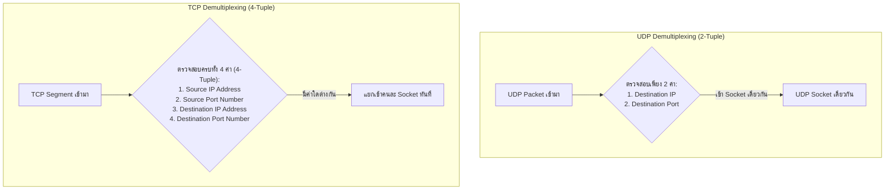

> [!IMPORTANT] กฎการแยกแยะ Socket (ข้อสอบออกแน่นอน)
> 1. **UDP Socket ระบุด้วย 2-Tuple:** `(Destination IP, Destination Port)`
>    - ไม่ว่าแพ็กเก็ตจะมาจาก Source IP หรือ Source Port ใด หากส่งมายัง Dest IP และ Dest Port เดียวกัน จะวิ่งเข้าสู่ Socket เดียวกันเสมอ!
> 2. **TCP Socket ระบุด้วย 4-Tuple:** `(Source IP, Source Port, Destination IP, Destination Port)`
>    - เซิร์ฟเวอร์ Web/HTTP (Port 80) จะสร้าง **Socket เฉพาะ (Dedicated Connection Socket)** แยกให้กับ Client แต่ละราย ถึงแม้ Client จะเชื่อมต่อไปที่ Port 80 เหมือนกัน แต่หาก Source IP หรือ Source Port ต่างกัน จะถูก Demux ไปยังคนละ Socket ทันที

---

## 4.3 ตารางเปรียบเทียบ TCP vs UDP

| คุณสมบัติ (Features) | TCP (Transmission Control Protocol) | UDP (User Datagram Protocol) |
| :--- | :--- | :--- |
| **การเชื่อมต่อ (Connection)** | **Connection-oriented** (ต้องทำ 3-Way Handshake ก่อนส่งข้อมูล) | **Connectionless** (ไม่มี Handshake ส่งได้ทันที) |
| **ความน่าเชื่อถือ (Reliability)** | **Reliable Data Transfer** (การันตีข้อมูลครบถ้วน ถูกต้อง เรียงลำดับ ไม่สูญหาย) | **Unreliable / Best-effort** (ไม่การันตี อาจสูญหาย ซ้ำซ้อน หรือสลับลำดับได้) |
| **ขนาด Header** | **20 Bytes** (ต่ำสุดเมื่อไม่มี Options) | **8 Bytes** (คงที่เสมอ) |
| **ลักษณะข้อมูล (Data Stream)** | **Byte Stream** (มองข้อมูลเป็นสายธารของไบต์ต่อเนื่อง) | **Datagram / Message Boundary** (คงขอบเขตของข้อความแต่ละชิ้น) |
| **Flow Control** | **มี** (ใช้ฟิลด์ `rwnd` ป้องกัน Receiver Buffer ล้น) | **ไม่มี** |
| **Congestion Control** | **มี** (ชะลอการส่งเมื่อเน็ตหนาแน่น เช่น AIMD, Slow Start) | **ไม่มี** (ส่งด้วยอัตราที่แอปพลิเคชันสร้างได้ทันที) |
| **ตัวอย่างการใช้งาน** | Web (HTTP/HTTPS), Email (SMTP), File Transfer (FTP), SSH | DNS, VoIP, Video Streaming, DHCP, Real-time Online Games |

---

## 4.4 โครงสร้าง UDP Header และ Internet Checksum

### โครงสร้าง UDP Header (ขนาดคงที่ 8 Bytes / 64 Bits)
```
 0                   1                   2                   3
 0 1 2 3 4 5 6 7 8 9 0 1 2 3 4 5 6 7 8 9 0 1 2 3 4 5 6 7 8 9 0 1
+-+-+-+-+-+-+-+-+-+-+-+-+-+-+-+-+-+-+-+-+-+-+-+-+-+-+-+-+-+-+-+-+
|          Source Port (16 bits)         |       Destination Port (16 bits)      |
+-+-+-+-+-+-+-+-+-+-+-+-+-+-+-+-+-+-+-+-+-+-+-+-+-+-+-+-+-+-+-+-+
|             Length (16 bits)           |            Checksum (16 bits)         |
+-+-+-+-+-+-+-+-+-+-+-+-+-+-+-+-+-+-+-+-+-+-+-+-+-+-+-+-+-+-+-+-+
|                            Application Data                           |
+-+-+-+-+-+-+-+-+-+-+-+-+-+-+-+-+-+-+-+-+-+-+-+-+-+-+-+-+-+-+-+-+
```

### การคำนวณ Internet Checksum (1's Complement Sum)
1. นำข้อมูลในส่วน Header และ Data มาตัดแบ่งเป็นคำขนาด **16 บิต (2 ไบต์)**
2. นำคำขนาด 16 บิตทั้งหมดมา **บวกกันทางคณิตศาสตร์ฐานสอง**
3. หากเกิดตัวทด (Carry bit) เกินหลักที่ 16 (Wrap around) ให้นำตัวทดนั้น **วนกลับมาบวกเพิ่มที่หลักขวาสุด (LSB)**
4. ทำการ **กลับบิต (1's complement)** คือ เปลี่ยน 0 เป็น 1 และเปลี่ยน 1 เป็น 0 ได้เป็นค่า Checksum
5. **การตรวจสอบฝั่งรับ (Receiver Verification):** ฝั่งรับนำคำ 16 บิตทั้งหมดรวมถึงค่า Checksum มาบวกกัน ถ้าบิตทุกตำแหน่ง **ได้ผลลัพธ์เป็น 1 ทั้งหมด (0xFFFF หรือ 1111111111111111)** แสดงว่าไม่มีข้อผิดพลาด (No error detected)

---

## 4.5 หลักการส่งข้อมูลที่เชื่อถือได้ (Reliable Data Transfer: rdt Protocols)

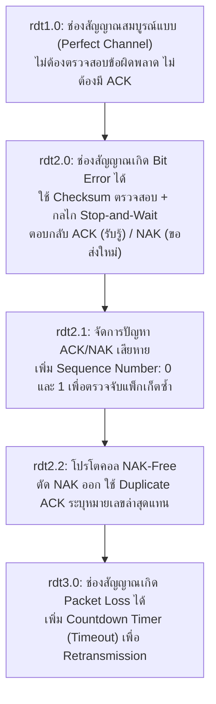

- **rdt1.0:** ทำงานบนช่องทางที่เชื่อถือได้ 100% (No bit errors, no loss) ฝ่ายส่งส่ง ฝ่ายรับรับ
- **rdt2.0 (Stop-and-Wait with ACK/NAK):** ตรวจจับ Bit error ด้วย Checksum ถ้าข้อมูลถูกต้องตอบ **ACK (Positive Acknowledgment)** ถ้าพบข้อผิดพลาดตอบ **NAK (Negative Acknowledgment)** เพื่อให้ส่งซ้ำ
- **rdt2.1:** แก้จุดบกพร่องของ rdt2.0 กรณีตัว ACK/NAK เองเสียหาย โดยการใส่ **Sequence Number (0 หรือ 1)** ทำให้ผู้รับรู้ว่าข้อมูลที่มาเป็นแพ็กเก็ตใหม่หรือของเดิมที่ส่งซ้ำ
- **rdt2.2 (NAK-Free):** ไม่ต้องใช้ NAK โดยผู้รับจะส่ง ACK พร้อมระบุ Sequence Number ของแพ็กเก็ตที่ได้รับถูกต้องล่าสุด (เช่น ACK 0 หรือ ACK 1) หากผู้ส่งได้รับ **Duplicate ACK** จะรู้ทันทีว่าแพ็กเก็ตถัดไปเสียหายและทำการส่งใหม่
- **rdt3.0 (Alternating-Bit Protocol):** ช่องสัญญาณสามารถทำ **Packet Loss (แพ็กเก็ตสูญหาย)** ได้ จึงเพิ่ม **Retransmission Timer (Countdown Timer)** หากผู้ส่งไม่ได้รับ ACK ภายในเวลา Timeout จะส่งแพ็กเก็ตนั้นซ้ำทันที

---

## 4.6 TCP Three-Way Handshake และ Connection Teardown

### 1. ลำดับการสร้างการเชื่อมต่อ (Three-Way Handshake)

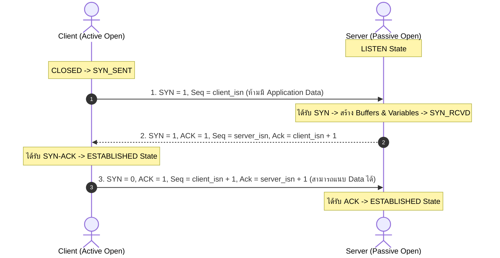

> [!NOTE] ทำไมต้องใช้ Three-Way Handshake?
> 1. เพื่อให้ทั้งสองฝ่าย **ทราบและตกลงค่า Initial Sequence Number (ISN)** ของกันและกัน
> 2. เพื่อยืนยันว่า **ช่องทางการสื่อสารทั้งขาไปและขากลับ (Full-Duplex) ใช้งานได้สมบูรณ์จริง**
> 3. ป้องกันปัญหา Old/Duplicate Connection Request ที่ตกค้างอยู่ในเครือข่าย

### 2. ลำดับการปิดการเชื่อมต่อ (Four-Way Connection Teardown)

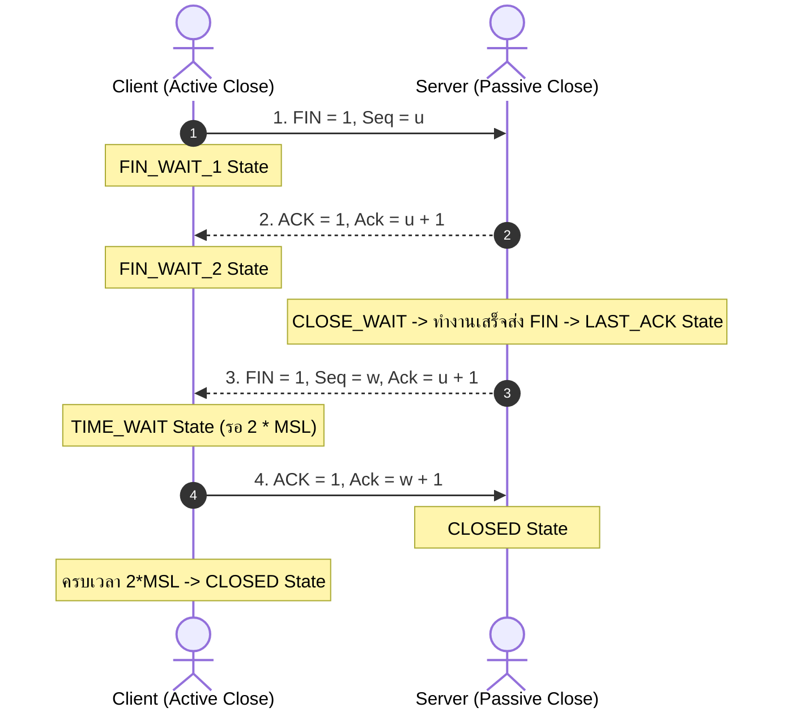

- **TIME_WAIT State (2 * MSL):** Client ต้องรอเป็นเวลา $2 \times \text{Maximum Segment Lifetime}$ (ปกติ 1–2 นาที) ก่อนจะปิดสนิท เพื่อให้มั่นใจว่า ACK สุดท้ายส่งไปถึง Server จริง (หาก ACK หาย Server จะส่ง FIN ซ้ำ Client จะได้ส่ง ACK ซ้ำได้)

---

## 4.7 Sequence Number, Acknowledgment Number และการคำนวณไบต์

> [!DEFINITION] นิยาม Sequence และ Acknowledgment Number ใน TCP
> - **Sequence Number (Seq):** หมายเลขไบต์ลำดับแรกของข้อมูลที่อยู่ใน Segment นั้น (Byte-stream offset)
> - **Acknowledgment Number (ACK):** หมายเลขของ **ไบต์ถัดไปที่ผู้รับกำลังรอรับ (Next Expected Byte)** และเป็นระบบ **Cumulative ACK** (ยืนยันว่าได้รับข้อมูลทุกไบต์ก่อนหน้านั้นครบถ้วนสมบูรณ์แล้ว)

### 📊 ตัวอย่างโจทย์คำนวณยอดฮิตในห้องสอบ

**โจทย์:** Host A ส่งข้อมูลให้ Host B โดยเริ่มต้นที่ Sequence Number = **500** และส่ง Payload ขนาด **100 Bytes**
1. Segment นี้บรรจุไบต์ลำดับที่เท่าใดถึงเท่าใด?
   - **ตอบ:** ไบต์ลำดับที่ **500 ถึง 599** (รวม 100 ไบต์)
2. เมื่อ Host B ได้รับข้อมูลนี้ถูกต้องสมบูรณ์ Host B จะส่ง ACK Number กลับมาเป็นค่าใด?
   - **ตอบ:** **ACK = 600** *(เพราะได้รับถึง 599 แล้ว จึงรอรับไบต์ที่ 600 ถัดไป)*
3. หาก Host B ได้รับ Segment ถัดไปขนาด 200 Bytes (Seq 600 ถึง 799) แต่ปรากฏว่าเกิดสูญหายกลางทาง Host B ได้รับเฉพาะ Segment Seq 800 (ขนาด 100 Bytes) Host B จะตอบ ACK ใด?
   - **ตอบ:** **ACK = 600** เท่าเดิม *(ส่ง Duplicate ACK 600 ซ้ำ เพราะ TCP ใช้ Cumulative ACK ไม่สามารถข้ามไบต์ 600–799 ที่ยังขาดหายไปได้)*

---

## 4.8 Flow Control และฟิลด์ Receive Window (`rwnd`)

- **วัตถุประสงค์:** ป้องกันไม่ให้ **ผู้ส่ง (Sender) ส่งข้อมูลเร็วเกินไปจนทำให้บัฟเฟอร์ของผู้รับ (Receiver Buffer) ล้น (Buffer Overflow)**
- **กลไกการทำงาน:** 
  - ฝ่ายรับจะคำนวณพื้นที่ว่างในบัฟเฟอร์ของตนเอง: 
    $$\text{rwnd} = \text{RcvBuffer} - (\text{LastByteRcvd} - \text{LastByteRead})$$
  - ฝ่ายรับจะแนบค่า `rwnd` (Receive Window) ไปใน TCP Header ทุกครั้ง
  - ฝ่ายส่งจะต้องควบคุมปริมาณข้อมูลที่ส่งออกไปแต่ยังไม่ได้รับ ACK ไม่ให้เกินค่านี้:
    $$\text{LastByteSent} - \text{LastByteAcked} \le \text{rwnd}$$
  - **กรณี `rwnd = 0`:** ฝ่ายส่งจะหยุดส่งข้อมูลหลัก แต่จะส่ง **Segment ขนาด 1 ไบต์ (Probe Packet)** ไปเป็นระยะๆ เพื่อกระตุ้นให้ฝ่ายรับตอบกลับค่า `rwnd` ใหม่เมื่ออ่านบัฟเฟอร์ว่างแล้ว

---

## 4.9 Congestion Control และหลักการ AIMD

- **วัตถุประสงค์:** ป้องกันไม่ให้ **ผู้ส่งส่งข้อมูลเข้าสู่เครือข่ายมากเกินไปจนเกินความสามารถในการประมวลผลของ Routers และลิงก์ใน Network Core** (ป้องกัน Congestion Collapse)
- มีตัวแปรควบคุมสำคัญคือ **`cwnd` (Congestion Window)** โดยขนาดข้อมูลที่ส่งได้จริงคือ $\min(\text{cwnd}, \text{rwnd})$

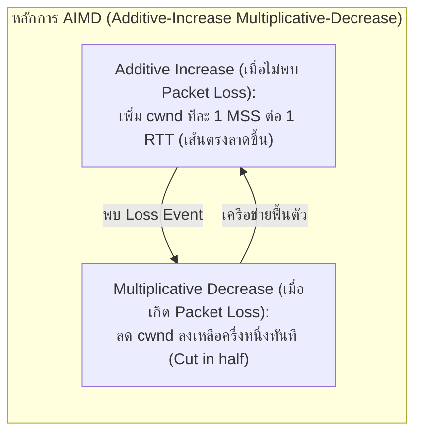

```
 cwnd
  ^
  |                   /\
  |                  /  \              /\
  |                 /    \            /  \
  |   /\           /      \          /    \
  |  /  \  AIMD   /        \  AIMD  /      \
  | /    \_______/          \______/        \
  +---------------------------------------------> Time (Sawtooth Pattern)
```

### รูปแบบการเกิด Loss Event และพฤติกรรมของ TCP
1. **Timeout Event (หมดเวลา Retransmission Timer):** สัญญาณของความหนาแน่นขั้นวิกฤต $\implies$ ปรับ `cwnd` ลงเหลือ **1 MSS** ทันที และเริ่มเข้าสู่ Slow Start
2. **Triple Duplicate ACKs (ได้รับ ACK หมายเลขเดิมซ้ำ 3 ครั้ง = รวมเป็น 4 ACKs):** แสดงว่าแพ็กเก็ตสูญหายเพียงตัวเดียวแต่แพ็กเก็ตหลังๆ ยังเดินทางไปถึงผู้รับ $\implies$ ทำ **Fast Retransmit** ส่งแพ็กเก็ตที่ขาดทันทีโดยไม่ต้องรอ Timeout และเข้าสู่ **Fast Recovery** โดยลด `cwnd` ลงเหลือครึ่งหนึ่ง ($cwnd = cwnd / 2$) ตามกฎ Multiplicative Decrease

---

# 🧠 สรุปสาระสำคัญเทียบตารางสรุปเร็ว (Quick Exam Cheat-Sheet)

| หัวข้อหลัก | คีย์เวิร์ดสำคัญ (Must-Know Terms) | ประเด็นคำถามที่พบบ่อยในข้อสอบ |
| :--- | :--- | :--- |
| **Ch 1: Fundamentals** | Simplex, Half/Full Duplex, Mesh Link Formula, Guided/Unguided, 5 Components, Syntax/Semantics/Timing | - คำนวณสาย Mesh: $N(N-1)/2$<br>- ข้อดีของ Fiber (Immune to EMI, High BW)<br>- องค์ประกอบ Protocol 3 อย่าง |
| **Ch 2: Models** | Physical vs Logical, 5 Layers vs 7 Layers, PDU Names, Encapsulation/De-encapsulation, Header, SAP | - PDU แต่ละชั้น (App=Data, Trans=Segment, Net=Packet, Link=Frame, Phy=Bit)<br>- ลำดับการเพิ่ม/ถอด Header<br>- Protocol ทำงานแนวนอน Service ทำงานแนวตั้ง |
| **Ch 3: Application** | Client-Server vs P2P, Socket, Stateless HTTP, Persistent vs Non-Persistent, DNS RR Types, SMTP/IMAP/POP3, Ports | - HTTP เป็น Stateless ใช้ Cookie จัดการ Session<br>- DNS Query แบบ Iterative vs Recursive<br>- พอร์ตสำคัญ: HTTP (80), HTTPS (443), DNS (53), SMTP (25), SSH (22) |
| **Ch 4: Transport** | Mux/Demux, 2-Tuple vs 4-Tuple, TCP vs UDP Header, rdt Evolution, 3-Way Handshake, Cumulative ACK, AIMD | - UDP Demux ดู 2 ตัว / TCP Demux ดู 4-Tuple<br>- UDP Header ขนาดคงที่ 8 Bytes<br>- การคำนวณ ACK = ไบต์ที่คาดหวังถัดไป<br>- 3 Duplicate ACKs ทำ Fast Retransmit |

---
