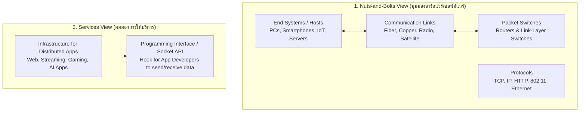
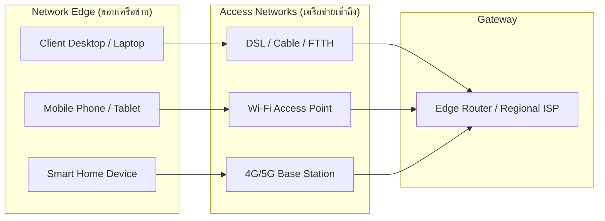
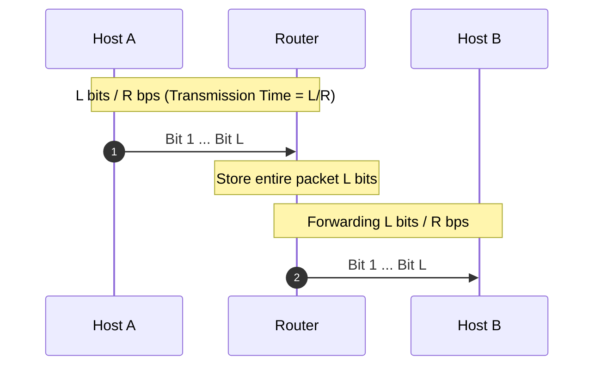
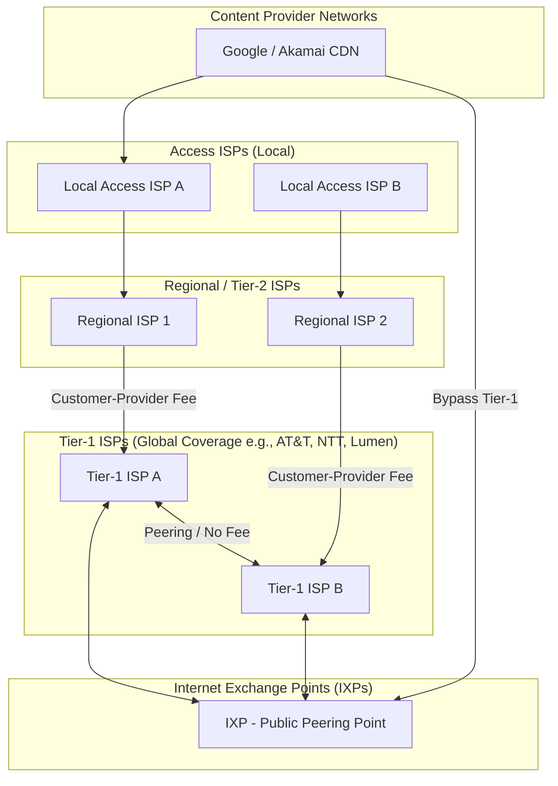
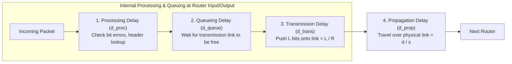
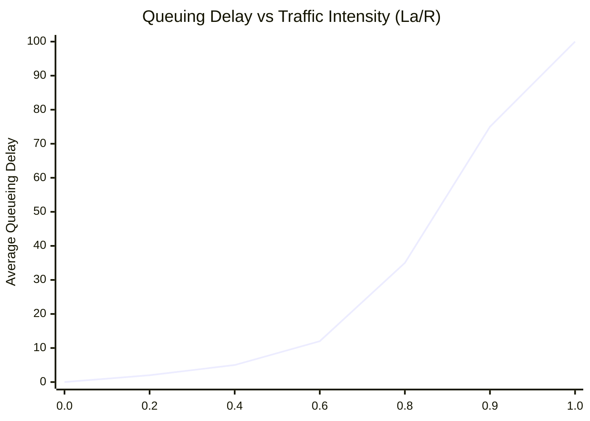
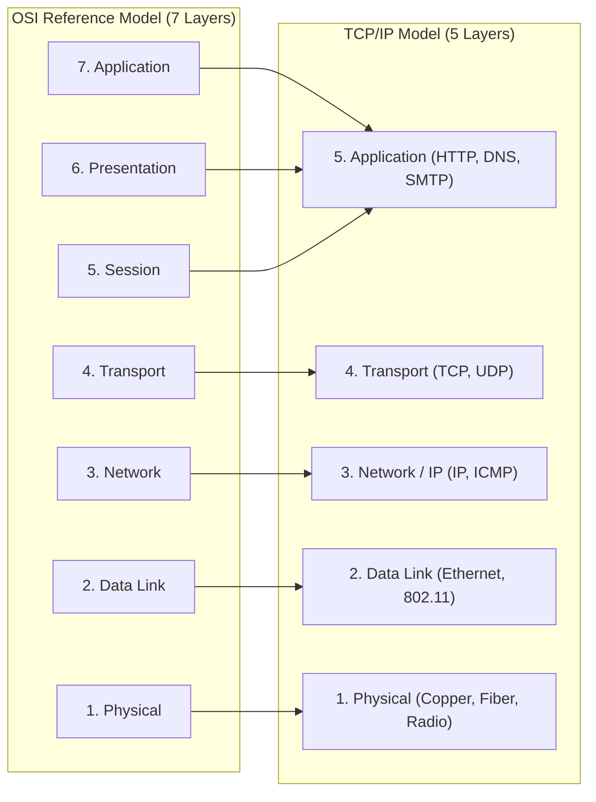
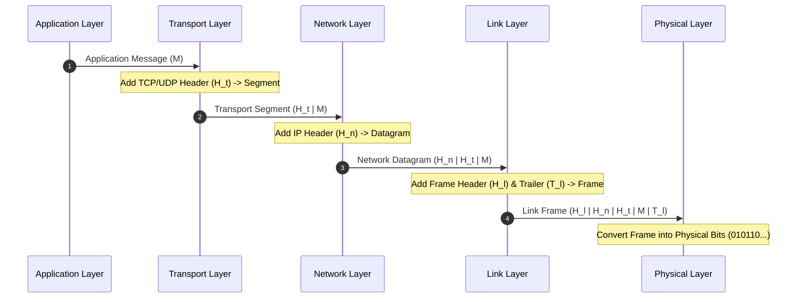

---
tags:
  - networking
  - chapter1
  - introduction
  - delay
  - packet-switching
created: 2026-08-03
updated: 2026-08-03
type: wiki-note
---

# Chapter 1: Computer Networks and the Internet

> [!SUMMARY] ภาพรวมประจำบท
> โน้ตความรู้บทที่ 1 ครอบคลุมพื้นฐานของระบบเครือข่ายคอมพิวเตอร์และอินเทอร์เน็ต ตั้งแต่นิยามของอินเทอร์เน็ตใน 2 มุมมอง (Nuts-and-Bolts View และ Service View), สถาปัตยกรรมบริเวณขอบเครือข่าย (Network Edge), แกนกลางเครือข่าย (Network Core) เปรียบเทียบระหว่าง Packet Switching และ Circuit Switching, โครงสร้างลำดับชั้นของ ISPs, การคำนวณประสิทธิภาพเครือข่าย (Delay Decomposition, Throughput, Packet Loss), โมเดลแบบสถาปัตยกรรมแบ่งชั้น (Layering Architecture: OSI vs TCP/IP), กระบวนการ Encapsulation/Decapsulation และภาพรวมความปลอดภัยเครือข่าย (Network Security)

---

## 1. นิยามของอินเทอร์เน็ต (What is the Internet?)

อินเทอร์เน็ต (Internet) สามารถมองได้ใน 2 มุมมองหลัก ได้แก่ มุมมองเชิงองค์ประกอบฮาร์ดแวร์/ซอฟต์แวร์ (Nuts-and-bolts view) และมุมมองเชิงการให้บริการแก่อุบลัดซอฟต์แวร์ (Services view)



### 1.1 มุมมองเชิงองค์ประกอบ (Nuts-and-Bolts View)
- **Hosts / End Systems:** อุปกรณ์ปลายทางทั้งหมดที่เชื่อมต่อกับอินเทอร์เน็ต เช่น เครื่องคอมพิวเตอร์, สมาร์ตโฟน, เซิร์ฟเวอร์, อุปกรณ์ IoT
- **Communication Links:** ลิงก์สื่อสารที่ทำหน้าที่ส่งผ่านข้อมูลด้วยอัตราความเร็ว (Transmission Rate / Bandwidth) ต่างๆ เช่น สายโคแอ็กเชียล (Coaxial), สายคู่ตีเกลียว (Twisted Pair), เส้นใยนำแสง (Fiber Optics), และคลื่นวิทยุ (Radio Spectrum)
- **Packet Switches:** อุปกรณ์ที่ทำหน้าที่รับแพ็กเก็ตข้อมูลจากลิงก์ทางเข้า (Incoming Link) และส่งต่อไปยังลิงก์ทางออก (Outgoing Link) ที่เหมาะสม ได้แก่ **Routers** (ทำงานใน Network Layer) และ **Link-Layer Switches** (ทำงานใน Link Layer)
- **Protocols:** กฎและมาตรฐานที่ควบคุมการรับ-ส่งข้อมูลระหว่างเอนทิตีในเครือข่าย เช่น HTTP, TCP, IP, WiFi (802.11), Ethernet

> [!DEFINITION] นิยามของ Protocol
> **Protocol (โปรโตคอล)** คือตัวกำหนด รูปแบบ (Format) และ ลำดับ (Order) ของข้อความที่รับส่งระหว่างเอนทิตีทางเครือข่ายตั้งแต่สองฝั่งขึ้นไป รวมถึงกำหนดการกระทำ (Actions) ที่ต้องดำเนินการเมื่อมีการส่งหรือรับข้อความ หรือเมื่อเกิดเหตุการณ์บางอย่างขึ้น

### 1.2 มุมมองเชิงบริการ (Services View)
- อินเทอร์เน็ตคือ โครงสร้างพื้นฐาน (Infrastructure) ที่ให้บริการแก่แอปพลิเคชันแบบกระจายศูนย์ (Distributed Applications) เช่น Web browsing, Video streaming, Online gaming, E-mail, Peer-to-Peer file sharing
- อินเทอร์เน็ตจัดเตรียม **Application Programming Interface (API)** หรือ **Socket Interface** เพื่อให้โปรแกรมเมอร์สร้างแอปพลิเคชันที่สามารถเรียกใช้บริการรับส่งข้อมูลของเครือข่ายได้

---

## 2. ขอบเครือข่าย (Network Edge)

Network Edge ประกอบด้วย **End Systems (Hosts)** และ **Access Networks** ที่เชื่อมต่ออุปกรณ์ปลายทางเข้ากับเราเตอร์ตัวแรก (Edge Router)



### 2.1 เทคโนโลยี Access Networks
1. **Digital Subscriber Line (DSL):**
   - ใช้สายโทรศัพท์ทองแดงที่มีอยู่เดิม (Copper Phone Line)
   - ใช้เทคโนโลยี FDM ในการแบ่งความถี่: Voice channel (0-4 kHz), Upstream channel (4-50 kHz), Downstream channel (50 kHz - 1 MHz)
   - เป็นการเชื่อมต่อแบบ **Asymmetric** (อัตราการดาวน์โหลดสูงกว่าอัปโหลด) เช่น Downstream 24-52 Mbps, Upstream 1-3.5 Mbps
2. **Cable Network (Cable Modem):**
   - ใช้สาย Hybrid Fiber-Coaxial (HFC) ร่วมกับสายสัญญาณเคเบิลทีวี
   - ใช้สถาปัตยกรรมแบบ **Shared Medium** (แบนด์วิดท์ถูกแชร์ระหว่างบ้านในบริเวณใกล้เคียง)
   - มาตรฐาน **DOCSIS** (Data Over Cable Service Interface Specification)
3. **Fiber to the Home (FTTH):**
   - เดินสายไฟเบอร์ออพติกตรงจาก Central Office (CO) ถึงบ้านผู้ใช้
   - มี 2 สถาปัตยกรรมหลัก: Direct Fiber และ **PON (Passive Optical Network)** ซึ่งใช้ Optical Splitter ในการแบ่งสัญญาณจาก CO 1 เส้นไปยังหลายบ้าน (สูงสุด 64 บ้าน)
4. **Wireless Access Networks:**
   - **Wireless LAN (Wi-Fi / IEEE 802.11):** ครอบคลุมรัศมีประมาณ 10-100 เมตร (เช่น 802.11ac/ax ให้ความเร็วระดับหลายร้อย Mbps ถึง Gbps)
   - **Wide-Area Wireless Access (4G LTE / 5G NR):** เชื่อมต่อผ่านเสาสัญญาณ (Base Station / eNodeB / gNodeB) รัศมีทำการหลายกิโลเมตร

### 2.2 สื่อนำสัญญาณกายภาพ (Physical Media)
- **Guided Media:** สื่อนำสัญญาณแบบมีสาย สัญญาณคลื่นแม่เหล็กไฟฟ้าจะถูกบีบให้อยู่ภายในตัวนำสัญญาณ
  - *Twisted Pair (TP):* สายทองแดงคู่ตีเกลียวเพื่อลดสัญญาณรบกวน เช่น Cat 5e, Cat 6 (1 Gbps), Cat 6a (10 Gbps)
  - *Coaxial Cable:* ทองแดงแกนกลางหุ้มด้วยฉนวนและตาข่ายโลหะ ป้องกันสัญญาณรบกวนได้ดี
  - *Fiber Optic Cable:* แท่งแก้วนำแสง ส่งข้อมูลในรูปของพัลส์แสง (Light Pulses) มีอัตราความผิดพลาดต่ำมาก (Bit Error Rate ต่ำ) และมีแบนด์วิดท์สูงมาก (ระดับ Tbps)
- **Unguided Media:** สื่อนำสัญญาณแบบไร้สาย สัญญาณแพร่กระจายผ่านชั้นบรรยากาศหรืออวกาศ เช่น Terrestrial Radio, Satellite (GEO/LEO เช่น Starlink)

---

## 3. แกนกลางเครือข่าย (Network Core)

Network Core คือโครงข่ายของ Interconnected Routers ที่ทำหน้าที่สวิตช์แพ็กเก็ตข้อมูลจากต้นทางไปยังปลายทาง

### 3.1 การสวิตช์ข้อมูล: Packet Switching vs Circuit Switching

```mermaid
gantt
    title เปรียบเทียบการแชร์ทรัพยากร: FDM vs TDM ใน Circuit Switching
    dateFormat X
    axisFormat %s
    section Frequency (FDM)
    Bandwidth 1 (User 1) : 0, 10
    Bandwidth 2 (User 2) : 0, 10
    Bandwidth 3 (User 3) : 0, 10
    section Time (TDM)
    Slot 1 User 1 : 0, 2
    Slot 2 User 2 : 2, 4
    Slot 3 User 3 : 4, 6
    Slot 1 User 1 : 6, 8
```



| คุณลักษณะ (Property) | Circuit Switching | Packet Switching |
| :--- | :--- | :--- |
| **การจองทรัพยากร (Resource Reservation)** | จองทรัพยากรล่วงหน้าแบบ Dedicated (FDM หรือ TDM) | ไม่มีการจองทรัพยากรล่วงหน้า (Statistical Multiplexing) |
| **ประสิทธิภาพการใช้ลิงก์ (Link Efficiency)** | ต่ำ เมื่อผู้ใช้หยุดส่งข้อมูล ทรัพยากรจะถูกปล่อยว่าง (Idle) | สูง สามารถใช้ทรัพยากรได้เต็มประสิทธิภาพเมื่อมีข้อมูลส่ง |
| **ความล่าช้า (Delay)** | การรันไทม์มีความเสถียร (Guaranteed Bandwidth) | อาจเกิด Queuing Delay และ Packet Loss เมื่อเกิด Congestion |
| **การรองรับจำนวนผู้ใช้** | จำกัดตามจำนวน ช่องสัญญาณ (Circuit Slots) | รองรับผู้ใช้ได้จำนวนมากเกินขีดความสามารถสูงสุดชั่วคราว (Overbooking) |

> [!EXAMPLE] ตัวอย่างเปรียบเทียบ Statistical Multiplexing
> สมมติลิงก์มีขนาด $1\text{ Mbps}$ ผู้ใช้แต่ละคนต้องการแบนด์วิดท์ $100\text{ kbps}$ เมื่อส่งข้อมูล แต่นิสัยผู้ใช้จะส่งข้อมูลเพียง $10\%$ ของเวลาทั้งหมด ($p = 0.1$)
> - **Circuit Switching:** รองรับได้สูงสุดเพียง $1\text{ Mbps} / 100\text{ kbps} = 10\text{ Users}$ เท่านั้น
> - **Packet Switching:** หากมีผู้ใช้ 35 คน โอกาสที่ผู้ใช้มากกว่า 10 คนจะส่งข้อมูลพร้อมกันสามารถคำนวณด้วย Binomial Distribution:
>   $$P(\text{Users} > 10) = \sum_{k=11}^{35} \binom{35}{k} (0.1)^k (0.9)^{35-k} < 0.0004 \quad (0.04\%)$$
>   สรุปคือ Packet Switching สามารถรองรับผู้ใช้ได้ถึง 35 คนโดยมีความเสี่ยงที่เน็ตจะช้าเพียง $0.04\%$ เท่านั้น!

### 3.2 หลักการ Store-and-Forward ใน Packet Switching
ในการส่งแพ็กเก็ตขนาด $L\text{ bits}$ ผ่านลิงก์ความเร็ว $R\text{ bps}$ เราเตอร์จะต้องได้รับแพ็กเก็ต **ครบทุกบิต** (Store) ก่อน จึงจะสามารถเริ่มส่งแพ็กเก็ตนั้นไปยังลิงก์ถัดไปได้ (Forward)



- **Transmission Delay สำหรับ 1 Hop:** $d_{trans} = \frac{L}{R}$
- **End-to-End Delay สำหรับ $N$ Links (โดยไม่คิด propagation/queuing delay):**
  $$d_{end-to-end} = N \times \frac{L}{R}$$
  *(เช่น หากมี 3 ลิงก์ และส่ง $P$ แพ็กเก็ต เวลาทั้งหมดคือ $(N + P - 1) \frac{L}{R}$)*

---

## 4. โครงสร้างและลำดับชั้นของ ISPs (Internet Structure)

อินเทอร์เน็ตไม่ได้เชื่อมต่อเราเตอร์แบบสุ่ม แต่มีสถาปัตยกรรมลำดับชั้น (Hierarchical Structure) เพื่อสเกลการเชื่อมต่อระดับโลก



- **Tier-1 ISPs:** ผู้ให้บริการโครงข่ายแกนหลักระดับโลก เชื่อมต่อระหว่างกันแบบ **Peering Agreement** (ไม่เสียค่าธรรมเนียมระหว่างกัน)
- **Internet Exchange Points (IXP):** จุดเชื่อมต่อแลกเปลี่ยนข้อมูลสาธารณะที่อนุญาตให้ ISPs และ Content Providers สลับข้อมูลกันได้โดยตรง
- **Regional / Access ISPs:** ผู้ให้บริการระดับภูมิภาคและระดับท้องถิ่นที่จ่ายค่าธรรมเนียม (Transit Fee) ให้กับ Tier-1 หรือ Tier-2 ISPs
- **Content Provider Networks:** เครือข่ายส่วนตัวของยักษ์ใหญ่คอนเทนต์ (เช่น Google, Microsoft, Netflix) ที่สร้าง Data Center และ PoP (Points of Presence) เพื่อบายพาส Tier-1 ISP และส่งคอนเทนต์ตรงเข้าสู่ Access ISPs

---

## 5. การคำนวณ ประสิทธิภาพของเครือข่าย (Performance Metrics)

เมื่อแพ็กเก็ตเดินทางผ่านเราเตอร์ แพ็กเก็ตจะเผชิญกับ **Nodal Delay** ทั้งหมด 4 ส่วนประกอบ

### 5.1 การย่อยสลายความล่าช้า (Nodal Delay Decomposition)

$$d_{nodal} = d_{proc} + d_{queue} + d_{trans} + d_{prop}$$



1. **Processing Delay ($d_{proc}$):** เวลาที่เร้าเตอร์ใช้ตรวจสอบ Header, ตรวจสอบ Bit Errors, และค้นหา Forwarding Table (โดยทั่วไป < ไมโครวินาที)
2. **Queueing Delay ($d_{queue}$):** เวลาที่แพ็กเก็ตต้องจอดรอในคิว (Buffer) เพื่อรอให้ลิงก์ทางออกว่าง
   - ขึ้นอยู่กับความคับคั่งของเครือข่ายและค่า **Traffic Intensity** ($\frac{L \cdot a}{R}$)
   - โดยที่ $L = \text{Packet Length (bits)}$, $a = \text{Average Packet Arrival Rate (packets/sec)}$, $R = \text{Link Rate (bps)}$

> [!IMPORTANT] กราฟพฤติกรรม Queueing Delay ตามค่า Traffic Intensity ($La/R$)
> - หาก $La/R \to 0$: Queuing Delay มีค่าเกือบเป็น 0
> - หาก $La/R \to 1$: Queuing Delay จะเพิ่มขึ้นแบบ Exponential และเข้าสู่ค่าอนันต์ ($\infty$)
> - หาก $La/R > 1$: ปริมาณข้อมูลเข้ามากกว่าความสามารถในการส่งออก จะเกิด **Buffer Overflow** ส่งผลให้เกิด **Packet Loss**



3. **Transmission Delay ($d_{trans}$):** เวลาที่ใช้ในการผลักดันบิตทั้งหมดของแพ็กเก็ตลงสู่ลิงก์สื่อสาร
   $$d_{trans} = \frac{L}{R} \quad (\text{seconds})$$
4. **Propagation Delay ($d_{prop}$):** เวลาที่บิตใช้ในการเดินทางผ่านสื่อนำสัญญาณกายภาพจากต้นทางไปปลายทาง
   $$d_{prop} = \frac{d}{s} \quad (\text{seconds})$$
   *(โดยที่ $d = \text{Distance (meters)}$, $s = \text{Propagation Speed in medium} \approx 2 \times 10^8 - 3 \times 10^8 \text{ m/s}$)*

> [!WARNING] ข้อแตกต่างที่มักสับสนระหว่าง Transmission Delay และ Propagation Delay
> - **Transmission Delay ($L/R$):** ขึ้นอยู่กับขนาดแพ็กเก็ต $L$ และความเร็วลิงก์ $R$ (ไม่เกี่ยวกับระยะทาง!)
> - **Propagation Delay ($d/s$):** ขึ้นอยู่กับระยะทางกายภาพ $d$ และความเร็วแสงในสื่อ $s$ (ไม่เกี่ยวกับขนาดแพ็กเก็ต!)

---

### 5.2 การคำนวณปริมาณข้อมูลผ่านจริง (Throughput)
**Throughput** คืออัตราการส่งข้อมูลสำเร็จจากต้นทางไปยังปลายทาง ณ ช่วงเวลาหนึ่ง (มีหน่วยเป็น bits/sec)

- **Instantaneous Throughput:** อัตราความเร็ว ณ วินาทีใดวินาทีหนึ่ง
- **Average Throughput:** ปริมาณข้อมูลทั้งหมดที่ส่งสำเร็จ $F\text{ bits}$ หารด้วยเวลาทั้งหมด $T\text{ seconds}$
- **Bottleneck Link:** อัตรา Throughput ของเส้นทางสื่อสารจะถูกจำกัดโดย **ลิงก์ที่มีแบนด์วิดท์ต่ำที่สุด** บนเส้นทางนั้น

```mermaid
graph LR
    Server((Server)) == Rs = 10 Mbps ==> Router((Router)) == Rc = 1.5 Mbps ==> Client((Client))
    style Router fill:#f9f,stroke:#333,stroke-width:2px
```
*ในไดอะแกรมด้านบน ลิงก์ $R_c = 1.5\text{ Mbps}$ คือ Bottleneck Link ดังนั้น Throughput สุทธิสูงสุดที่ Client จะได้รับคือ $1.5\text{ Mbps}$*

---

## 6. สถาปัตยกรรมแบบแบ่งชั้น (Protocol Layers & Service Models)

เพื่อจัดการกับความซับซ้อนของระบบเครือข่าย วิศวกรได้ใช้หลักการ **Layering Design** ซึ่งแต่ละชั้นจะมีบทบาทหน้าที่ชัดเจน และให้บริการแก่ชั้นที่อยู่เหนือกว่า

### 6.1 เปรียบเทียบ OSI 7-Layer Model และ TCP/IP 5-Layer Model



- **Presentation Layer (OSI Layer 6):** จัดการการเข้ารหัส/ถอดรหัสข้อมูล (Encryption), การบีบอัดข้อมูล (Compression), และการแปลงรูปแบบข้อมูล
- **Session Layer (OSI Layer 5):** จัดการการสร้าง, 유지, และการจบเซสชันการสื่อสาร (Checkpointing, Synchronization)
- *หมายเหตุ:* ในสถาปัตยกรรม TCP/IP หน้าที่ของ Presentation และ Session จะถูกรวบไปให้แอปพลิเคชันจัดการเองใน Application Layer

---

### 6.2 กระบวนการ Encapsulation และ Decapsulation

เมื่อข้อมูลถูกส่งลงมาจากชั้นบนสุด ข้อมูลจะถูกห่อหุ้มด้วย **Header** (และ Trailer ในบางชั้น) เกิดเป็น Protocol Data Unit (PDU) ประจำชั้นนั้นๆ



| Layer | PDU Name (ชื่อเรียกชุดข้อมูล) | ตัวอย่าง Header Information |
| :--- | :--- | :--- |
| **Application Layer** | **Message** | HTTP Headers, Host, User-Agent |
| **Transport Layer** | **Segment** (TCP) / **Datagram** (UDP) | Source/Destination Port, Sequence Number |
| **Network Layer** | **Datagram** / **Packet** | Source/Destination IP Address, TTL |
| **Link Layer** | **Frame** | Source/Destination MAC Address, CRC Checksum |
| **Physical Layer** | **Bits** | Signal Levels, Clock Synchronization Bits |

---

## 7. ความปลอดภัยของระบบเครือข่าย (Network Security)

เครือข่ายอินเทอร์เน็ตดั้งเดิมถูกออกแบบมาโดยเน้นความน่าเชื่อถือของการส่งข้อมูล แต่ไม่ได้เน้นความปลอดภัย ดังนั้นแฮกเกอร์จึงสามารถโจมตีในรูปแบบต่างๆ ได้:

1. **Malware (ซอฟต์แวร์ประสงค์ร้าย):**
   - **Virus:** มัลแวร์ที่ต้องอาศัยการรันไฟล์โฮสต์ฝั่งผู้ใช้เพื่อแผ่ขยาย
   - **Worm:** มัลแวร์ที่สแกนและแผ่กระจายข้ามเครือข่ายได้เองโดยไม่อาศัยการกระทำของผู้ใช้
   - **Trojan Horse:** โปรแกรมที่แฝงมาในคราบซอฟต์แวร์ที่มีประโยชน์
   - **Botnet:** เครือข่ายของเครื่องคอมพิวเตอร์ที่ติดมัลแวร์และถูกควบคุมโดยผู้โจมตี (Botmaster)
2. **Denial of Service (DoS / DDoS):**
   - การยิงแพ็กเก็ตขยะปริมาณมหาศาลจากหลายแหล่งกำเนิด (Distributed DoS) เพื่อให้เซิร์ฟเวอร์เป้าหมายทำงานจนทรัพยากรหมด (Bandwidth, CPU, Memory)
3. **Packet Sniffing:**
   - การดักจับแพ็กเก็ตที่วิ่งผ่านสื่อแบบ Shared Medium (เช่น Promiscuous mode ใน Wi-Fi หรือ Ethernet) เพื่อแอบดูข้อมูลที่ไม่ผ่านการเข้ารหัส (เช่น Wireshark)
4. **IP Spoofing:**
   - การปลอมแปลงหมายเลข IP ต้นทาง (Source IP Address) ใน IP Header เพื่อแอบอ้างเป็นเครื่องอื่น

---

## 📚 อ้างอิงและโน้ตที่เกี่ยวข้อง
- 🔹 **[[Chapter 2 - Application Layer]]** - เจาะลึกโปรโตคอลระดับแอปพลิเคชัน
- 🔹 **[[Chapter 3 - Transport Layer]]** - เจาะลึกโปรโตคอล TCP/UDP และ RDT
- 🔹 **[[Chapter 9 - TCP IP Model and Architecture]]** - เปรียบเทียบสถาปัตยกรรมแบบจำลองเลเยอร์
- 🔹 **[[Chapter 10 - Homework and Quiz Solution Guide]]** - โจทย์การคำนวณ Delay & Throughput พร้อมเฉลย
