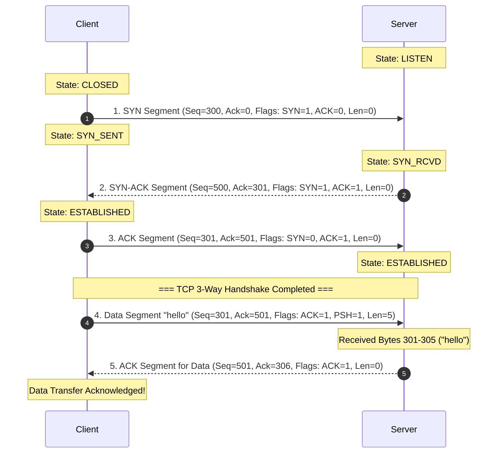
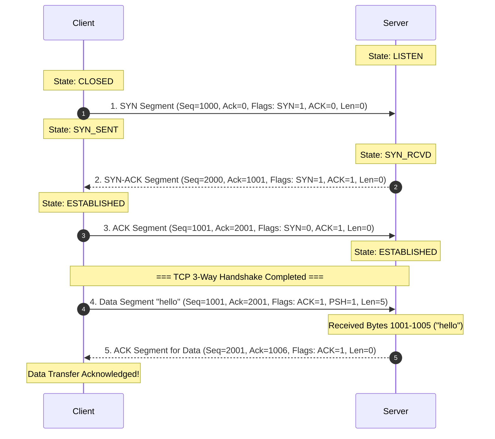

---
tags:
  - networking
  - chapter10
  - homework
  - quiz
  - solutions
  - exercises
  - assignments
created: 2026-08-03
updated: 2026-08-03
type: wiki-note
---

# Chapter 10: Homework and Quiz Solution Guide

> [!SUMMARY] ภาพรวมประจำบท
> โน้ตความรู้บทที่ 10 รวบรวมแนวทางการแก้โจทย์แบบฝึกหัด การบ้านประจำคอร์ส (Homework 1 - 5), แบบทดสอบทบทวนพิเศษ (Assignments.pptx) และเฉลยคลังข้อสอบทดสอบความรู้ (Quiz Bank) พร้อมการแสดงวิธีทำแบบ Step-by-Step ครอบคลุมการคำนวณ ความล่าช้า (Delay), HTTP RTT, P2P File Distribution, Internet Checksum, TCP 3-Way Handshake & Data Trace, RDT/TCP Congestion Control Tracing, IP Fragmentation, Subnetting VLSM, Dijkstra Shortest Path, CRC Division, และ Switch Self-Learning

---

## 1. เฉลยการบ้านชุดที่ 1: พื้นฐานเครือข่ายและความล่าช้า (Homework 1: Network Delay & Basics)

> [!EXAMPLE] โจทย์ HW1-Q1: การคำนวณ End-to-End Delay
> **โจทย์:** ส่งไฟล์ขนาด $1\text{ MB} = 8 \times 10^6\text{ bits}$ ผ่านเราเตอร์ 2 ตัว (มี 3 ลิงก์) ความเร็วแต่ละลิงก์ $R = 10\text{ Mbps} = 10 \times 10^6\text{ bps}$ ระยะทางรวม $d = 1,000\text{ km}$ ความเร็วสัญญาณ $s = 2 \times 10^8\text{ m/s}$ ไม่คิด Queuing และ Processing Delay
>
> **วิธีทำ:**
> 1. คำนวณ Transmission Delay ต่อ 1 ลิงก์:
>    $$d_{trans} = \frac{L}{R} = \frac{8 \times 10^6}{10 \times 10^6} = 0.8\text{ seconds} = 800\text{ ms}$$
> 2. คำนวณ Propagation Delay รวมตลอดระยะทาง:
>    $$d_{prop} = \frac{1,000 \times 10^3\text{ m}}{2 \times 10^8\text{ m/s}} = 0.005\text{ seconds} = 5\text{ ms}$$
> 3. คำนวณ End-to-End Delay (เนื่องจากมี 3 ลิงก์แบบ Store-and-Forward):
>    $$d_{end-to-end} = 3 \times d_{trans} + d_{prop} = (3 \times 800\text{ ms}) + 5\text{ ms} = \mathbf{2,405\text{ ms}} = \mathbf{2.405\text{ seconds}}$$

---

## 2. เฉลยการบ้านชุดที่ 2: เลเยอร์ประยุกต์ใช้งาน (Homework 2: Application Layer)

> [!EXAMPLE] โจทย์ HW2-Q1: การคำนวณเวลาโหลดเว็บ HTTP Persistent vs Non-Persistent
> **โจทย์:** หน้าเว็บประกอบด้วย 1 HTML Base File และ 5 รูปภาพขนาดเล็ก RTT ระหว่าง Client และ Server เท่ากับ $50\text{ ms}$ เวลาส่งไฟล์ HTML $= 10\text{ ms}$ และเวลาส่งรูปภาพแต่ละรูป $= 5\text{ ms}$
>
> **วิธีทำ:**
> 1. **กรณี Non-Persistent HTTP (1 Connection per Object):**
>    - โหลด HTML: $2 \times \text{RTT} + \text{HTML Transmission} = 2(50) + 10 = 110\text{ ms}$
>    - โหลด 5 รูปภาพ (เปิด 5 connections ใหม่): $5 \times [2(50) + 5] = 5 \times 105 = 525\text{ ms}$
>    - **รวมเวลาทั้งหมด:** $110 + 525 = \mathbf{635\text{ ms}}$
> 2. **กรณี Persistent HTTP (Non-pipelined):**
>    - สร้าง Connection ครั้งแรก + HTML: $2(50) + 10 = 110\text{ ms}$
>    - โหลด 5 รูปภาพบน Connection เดิม: $5 \times [1(50) + 5] = 5 \times 55 = 275\text{ ms}$
>    - **รวมเวลาทั้งหมด:** $110 + 275 = \mathbf{385\text{ ms}}$

---

## 3. เฉลยการบ้านชุดที่ 3: เลเยอร์นำส่งข้อมูล (Homework 3: Transport Layer & TCP)

> [!EXAMPLE] โจทย์ HW3-Q1: การคำนวณ RTT Estimation และ Timeout Interval
> **โจทย์:** กำหนดค่าเริ่มต้น $\text{EstimatedRTT} = 100\text{ ms}$, $\text{DevRTT} = 5\text{ ms}$, $\alpha = 0.125$, $\beta = 0.25$ ได้รับ SampleRTT ใหม่ $= 120\text{ ms}$ จงหาค่า TimeoutInterval ใหม่
>
> **วิธีทำ:**
> 1. คำนวณ $\text{EstimatedRTT}$ ใหม่:
>    $$\text{EstimatedRTT} = (1 - 0.125)(100) + 0.125(120) = 87.5 + 15 = \mathbf{102.5\text{ ms}}$$
> 2. คำนวณ $\text{DevRTT}$ ใหม่:
>    $$\text{DevRTT} = (1 - 0.25)(5) + 0.25(|120 - 102.5|) = 3.75 + 0.25(17.5) = 3.75 + 4.375 = \mathbf{8.125\text{ ms}}$$
> 3. คำนวณ $\text{TimeoutInterval}$:
>    $$\text{TimeoutInterval} = 102.5 + 4(8.125) = 102.5 + 32.5 = \mathbf{135\text{ ms}}$$

---

> [!EXAMPLE] โจทย์ HW3-Q2: Trace Table ของ TCP Congestion Window (Tahoe vs Reno)
> **โจทย์:** TCP ทำงานที่ $cwnd = 16\text{ MSS}$, $\text{ssthresh} = 8\text{ MSS}$ เกิด 3 Duplicate ACKs ที่ RTT รอบที่ 10 จงหาค่า $cwnd$ และ $\text{ssthresh}$ ในรอบที่ 11
>
> **เฉลยละเอียด:**
> - **TCP Tahoe:**
>   - $\text{ssthresh} = cwnd / 2 = 16 / 2 = \mathbf{8\text{ MSS}}$
>   - $cwnd$ รีเซ็ตกลับไปเป็น **$1\text{ MSS}$** (เข้าสู่ Slow Start)
> - **TCP Reno:**
>   - $\text{ssthresh} = cwnd / 2 = 16 / 2 = \mathbf{8\text{ MSS}}$
>   - $cwnd = \text{ssthresh} + 3 = \mathbf{11\text{ MSS}}$ (เข้าสู่ Fast Recovery)

---

## 4. เฉลยการบ้านชุดที่ 4: เลเยอร์เครือข่าย (Homework 4: Network Layer & Subnetting)

> [!EXAMPLE] โจทย์ HW4-Q1: การคำนวณ IP Fragmentation
> **โจทย์:** IP Datagram ขนาด **3,000 Bytes** (Header 20 Bytes) ถูกส่งลงลิงก์ที่มี **MTU = 1,000 Bytes**
>
> **วิธีทำ:**
> - Payload ข้อมูล $= 3000 - 20 = 2,980\text{ Bytes}$
> - Max Data per Fragment $= 1000 - 20 = 980\text{ Bytes}$ $\to$ ปรับให้หาร 8 ลงตัว $= 976\text{ Bytes}$ ($976 / 8 = 122$)
> - **Fragment 1:** Data $= 976$ Bytes, `Total Length` $= 996$, `MF` $= 1$, `Offset` $= 0 / 8 = \mathbf{0}$
> - **Fragment 2:** Data $= 976$ Bytes, `Total Length` $= 996$, `MF` $= 1$, `Offset` $= 976 / 8 = \mathbf{122}$
> - **Fragment 3:** Data $= 976$ Bytes, `Total Length` $= 996$, `MF` $= 1$, `Offset` $= 1952 / 8 = \mathbf{244}$
> - **Fragment 4:** Data ข้อมูลที่เหลือ $= 2980 - (976 \times 3) = 52\text{ Bytes}$, `Total Length` $= 52 + 20 = 72$, `MF` $= 0$, `Offset` $= 2928 / 8 = \mathbf{366}$

---

## 5. เฉลยการบ้านชุดที่ 5: เลเยอร์เชื่อมโยงข้อมูล (Homework 5: Link Layer & CRC)

> [!EXAMPLE] โจทย์ HW5-Q1: การคำนวณ CRC Remainder
> **โจทย์:** ข้อมูล $D = \mathbf{1101011111}$, Generator $G = \mathbf{10011}$ (ขนาด 5 บิต $\implies r = 4$)
>
> **วิธีทำ:**
> 1. เติม 0 จำนวน 4 บิต ท้าย $D$: `11010111110000`
> 2. ตั้งหาร Modulo-2 (XOR):
>    $$\begin{array}{r@{\quad}l}
>    10011 \overline{) 11010111110000} & \\
>    \underline{10011\phantom{00000000}} & (\text{XOR}) \\
>    01001111110000 & \\
>    \underline{\phantom{0}10011\phantom{0000000}} & (\text{XOR}) \\
>    00000011110000 & \\
>    \underline{\phantom{000000}10011\phantom{0}} & (\text{XOR}) \\
>    0000000110100 & \\
>    \underline{\phantom{0000000}10011} & (\text{XOR}) \\
>    \mathbf{0101} & \leftarrow \text{Remainder } R = \mathbf{0101}
>    \end{array}$$
> 3. **เฟรมส่งจริงคือ:** **`11010111110101`**

---

## 6. เฉลยโจทย์แบบทดสอบทบทวนพิเศษ (Assignments.pptx Solution Guide)

> [!IMPORTANT] เอกสารชุดนี้สกัดเฉลยและวิธีทำอย่างละเอียดจากสไลด์ `Assignments.pptx`

### 6.1 โจทย์ข้อที่ 1: การคำนวณ Internet Checksum (1's Complement Sum)

#### **ข้อ 1.1) คำนวณ Checksum ของ: `0001 0010 0011 0100` และ `0101 0110 0111 1000`**

**ขั้นตอนการคำนวณแบบ Step-by-Step:**

1. **ตั้งบวกคำขนาด 16-bit ทั้งสองคำ:**
   $$\begin{array}{r@{\quad}l@{\quad}l}
     & 0001 \; 0010 \; 0011 \; 0100 & \text{(Hex: 0x1234)} \\
   + & 0101 \; 0110 \; 0111 \; 1000 & \text{(Hex: 0x5678)} \\
   \hline
     & \mathbf{0110 \; 1000 \; 1010 \; 1100} & \text{(Hex: 0x68AC)}
   \end{array}$$

2. **ตรวจสอบ Carry Out:**
   ไม่มี Carry Bit เกินออกมาในตำแหน่งที่ 17 ($\text{Carry} = 0$)

3. **ทำ 1's Complement Negation (กลับบิต 0 เป็น 1 และ 1 เป็น 0):**
   $$\begin{array}{r@{\quad}l}
   \text{Sum} & = 0110 \; 1000 \; 1010 \; 1100 \quad (0x68AC) \\
   \mathbf{\text{Checksum}} & = \mathbf{1001 \; 0111 \; 0101 \; 0011} \quad (\text{Hex: } \mathbf{0x9753})
   \end{array}$$

4. **การตรวจสอบความถูกต้องฝั่งรับ (Receiver Verification):**
   นำข้อมูลทั้งสองคำบวกกับ Checksum:
   $$0x1234 + 0x5678 + 0x9753 = 0x68AC + 0x9753 = 0xFFFF \quad (\mathbf{1111 \; 1111 \; 1111 \; 1111})$$
   เมื่อทำ 1's Complement ได้ `0000 0000 0000 0000` $\implies$ **ถูกต้อง ไม่พบ error!**

---

#### **ข้อ 1.2) คำนวณ Checksum ของ: `1010 1011 1100 1101` และ `0101 0110 0111 1000`**

**ขั้นตอนการคำนวณแบบ Step-by-Step:**

1. **ตั้งบวกคำขนาด 16-bit ทั้งสองคำ:**
   $$\begin{array}{r@{\quad}l@{\quad}l}
     & 1010 \; 1011 \; 1100 \; 1101 & \text{(Hex: 0xABCD)} \\
   + & 0101 \; 0110 \; 0111 \; 1000 & \text{(Hex: 0x5678)} \\
   \hline
   1 & 0000 \; 0010 \; 0100 \; 0101 & \text{(เกิด Carry Bit 1 ในตำแหน่งที่ 17)}
   \end{array}$$

2. **ทำ End-Around Carry (นำ Carry Bit 1 มาบวกทบเข้าหลักหน่วย):**
   $$\begin{array}{r@{\quad}l@{\quad}l}
     & 0000 \; 0010 \; 0100 \; 0101 & \text{(0x0245)} \\
   + & 0000 \; 0000 \; 0000 \; 0001 & \text{(Carry 1)} \\
   \hline
     & \mathbf{0000 \; 0010 \; 0100 \; 0110} & \text{(Hex: 0x0246)}
   \end{array}$$

3. **ทำ 1's Complement Negation (กลับบิต 0 เป็น 1 และ 1 เป็น 0):**
   $$\begin{array}{r@{\quad}l}
   \text{Sum (after carry)} & = 0000 \; 0010 \; 0100 \; 0110 \quad (0x0246) \\
   \mathbf{\text{Checksum}} & = \mathbf{1111 \; 1101 \; 1011 \; 1009} \quad (\text{Hex: } \mathbf{0xFD89})
   \end{array}$$

4. **การตรวจสอบความถูกต้องฝั่งรับ (Receiver Verification):**
   $$\text{Sum} = 0x0246 + 0xFD89 = 0xFFFF \quad (\mathbf{1111 \; 1111 \; 1111 \; 1111})$$
   เมื่อทำ 1's Complement ได้ `0000 0000 0000 0000` $\implies$ **ถูกต้อง ไม่พบ error!**

---

### 6.2 โจทย์ข้อที่ 2: การวาด TCP 3-Way Handshake พร้อมการส่งข้อมูล "hello"

> [!INFO] รายละเอียดข้อความ "hello"
> ข้อความ `"hello"` ประกอบด้วยตัวอักษร ASCII 5 ตัว $= \mathbf{5\text{ Bytes}}$
> ดังนั้น การส่ง Payload นี้จะใช้ Sequence Number จำนวน 5 บิต/ไบต์ (เช่น ส่งจากไบต์ $N$ ถึง $N+4$ ฝั่งรับจะตอบ ACK $= N+5$)

---

#### **ข้อ 2.1) กำหนด ISN: Client = 300, Server = 500**

**ตารางบันทึกสถานะการส่งแพ็กเก็ต (Packet Trace Table):**

| ขั้นตอน (Step) | ทิศทาง (Direction) | Flags | Seq Number | Ack Number | Payload / Length | สถานะ Client | สถานะ Server | คำอธิบายรายละเอียด |
| :---: | :---: | :---: | :---: | :---: | :---: | :---: | :---: | :--- |
| **1** | Client $\to$ Server | `SYN` | **300** | - | 0 Bytes | `SYN_SENT` | `SYN_RCVD` | Client ส่ง SYN ขอสถาปนาเซสชันที่ ISN = 300 |
| **2** | Server $\to$ Client | `SYN, ACK` | **500** | **301** | 0 Bytes | `ESTABLISHED` | `SYN_RCVD` | Server ตอบรับ `Ack=301` (300+1) พร้อมส่ง SYN ของตนเอง ISN = 500 |
| **3** | Client $\to$ Server | `ACK` | **301** | **501** | 0 Bytes | `ESTABLISHED` | `ESTABLISHED` | Client ตอบรับ `Ack=501` (500+1) เซสชันพร้อมส่งข้อมูล |
| **4** | Client $\to$ Server | `ACK, PSH` | **301** | **501** | `"hello"` (5B) | `ESTABLISHED` | `ESTABLISHED` | Client ส่งข้อมูล "hello" ครอบคลุมไบต์ 301, 302, 303, 304, 305 |
| **5** | Server $\to$ Client | `ACK` | **501** | **306** | 0 Bytes | `ESTABLISHED` | `ESTABLISHED` | Server ตอบรับ `Ack=306` (301+5) แสดงว่ารับไบต์ 301-305 เรียบร้อย |

---

#### **ข้อ 2.2) กำหนด ISN: Client = 1000, Server = 2000**

**ตารางบันทึกสถานะการส่งแพ็กเก็ต (Packet Trace Table):**

| ขั้นตอน (Step) | ทิศทาง (Direction) | Flags | Seq Number | Ack Number | Payload / Length | สถานะ Client | สถานะ Server | คำอธิบายรายละเอียด |
| :---: | :---: | :---: | :---: | :---: | :---: | :---: | :---: | :--- |
| **1** | Client $\to$ Server | `SYN` | **1000** | - | 0 Bytes | `SYN_SENT` | `SYN_RCVD` | Client ส่ง SYN ที่ ISN = 1000 |
| **2** | Server $\to$ Client | `SYN, ACK` | **2000** | **1001** | 0 Bytes | `ESTABLISHED` | `SYN_RCVD` | Server ตอบรับ `Ack=1001` (1000+1) พร้อมส่ง SYN ที่ ISN = 2000 |
| **3** | Client $\to$ Server | `ACK` | **1001** | **2001** | 0 Bytes | `ESTABLISHED` | `ESTABLISHED` | Client ตอบรับ `Ack=2001` (2000+1) |
| **4** | Client $\to$ Server | `ACK, PSH` | **1001** | **2001** | `"hello"` (5B) | `ESTABLISHED` | `ESTABLISHED` | Client ส่งข้อมูล "hello" ครอบคลุมไบต์ 1001 ถึง 1005 |
| **5** | Server $\to$ Client | `ACK` | **2001** | **1006** | 0 Bytes | `ESTABLISHED` | `ESTABLISHED` | Server ตอบรับ `Ack=1006` (1001+5) ยืนยันการรับไบต์ 1001-1005 |

---

## 7. คลังเฉลยข้อสอบ Quiz (Quiz Screenshot Bank Solutions)

### Quiz Question 1: การจำแนกประเภทอุปกรณ์ L2 vs L3
- **คำถาม:** อุปกรณ์ใดที่ทำการแยก Collision Domain แต่ไม่แยก Broadcast Domain?
- **คำตอบ:** **Layer 2 Switch (หรือ Bridge)**
- **คำอธิบาย:** สวิตช์ L2 แยก Collision Domain ในทุกๆ พอร์ตของสวิตช์ แต่ทุกพอร์ตยังคงอยู่ใน Broadcast Domain เดียวกัน เว้นแต่จะมีการตั้งค่า VLAN

---

### Quiz Question 2: การคำนวณจำนวน Host ของ CIDR Prefix
- **คำถาม:** สับเน็ตที่มี Prefix `/27` สามารถรองรับเครื่องโฮสต์ที่ใช้งานได้จริง (Usable Hosts) สูงสุดกี่เครื่อง?
- **คำตอบ:** **30 เครื่อง**
- **คำอธิบาย:** $h = 32 - 27 = 5$ bits $\implies$ Usable Hosts $= 2^5 - 2 = 32 - 2 = 30$ เครื่อง

---

### Quiz Question 3: พอร์ตมาตรฐานของโปรโตคอล HTTPS
- **คำถาม:** โปรโตคอล HTTPS ทำงานบนพอร์ตมาตรฐานหมายเลขใด และใช้ Transport Protocol ใด?
- **คำตอบ:** **Port 443 บน TCP Protocol**

---

## 📚 อ้างอิงและโน้ตที่เกี่ยวข้อง
- 🔹 **[[Chapter 1 - Computer Networks and the Internet]]** - ทฤษฎีและสูตรคำนวณ Delay
- 🔹 **[[Chapter 3 - Transport Layer]]** - กลไก TCP Checksum, 3-Way Handshake และ Congestion Control
- 🔹 **[[Chapter 8 - IP Addressing, Subnetting and VLSM]]** - ขั้นตอนการทำ Subnetting VLSM
- 🔹 **[[Chapter 6 - Link Layer and LANs]]** - ทฤษฎีการคำนวณ CRC Modulo-2
