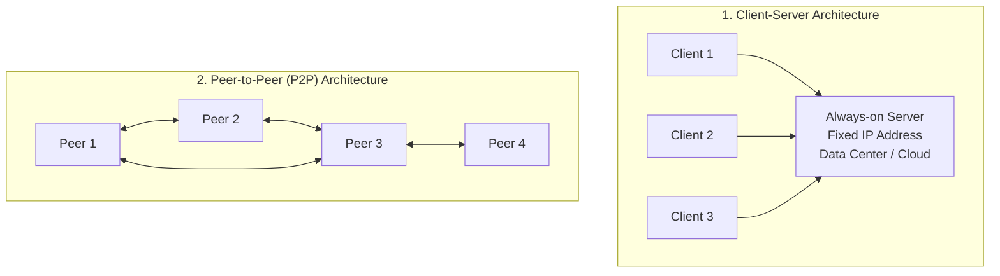
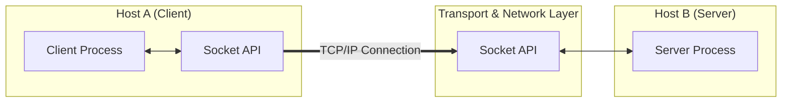
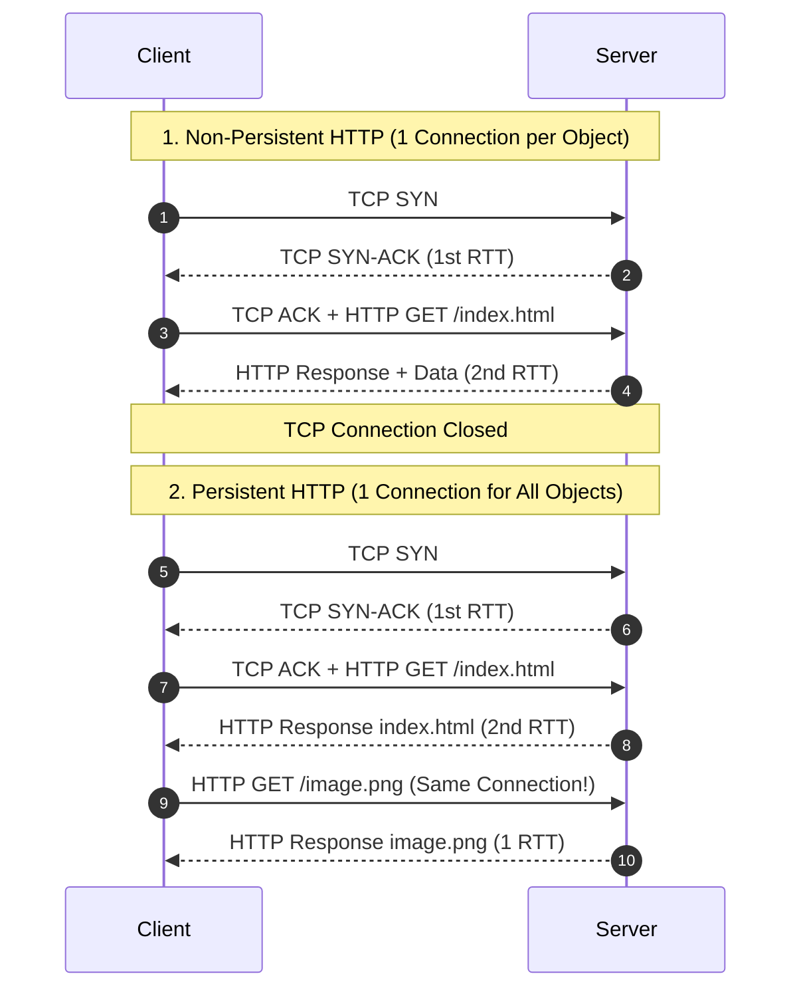
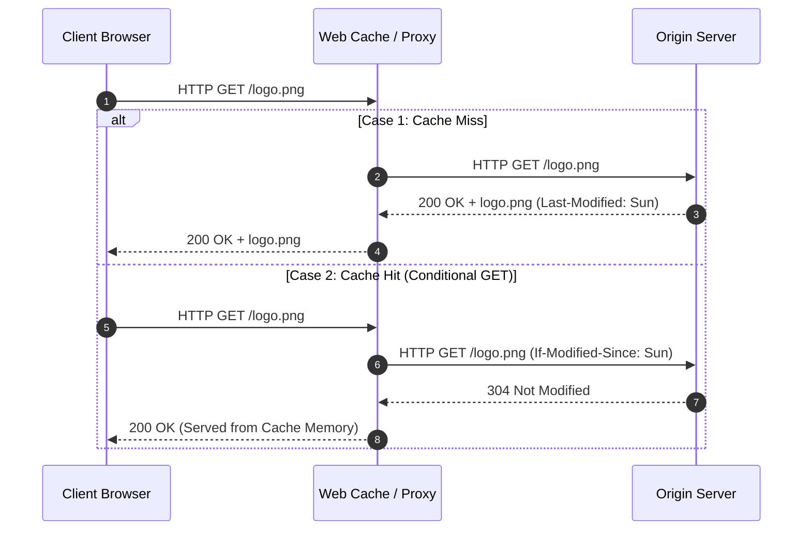
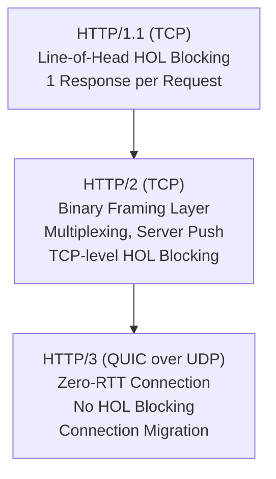
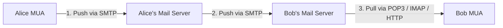
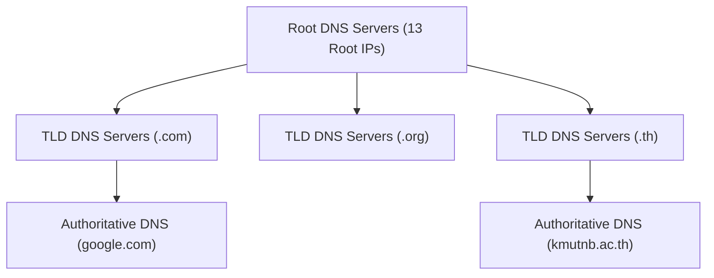
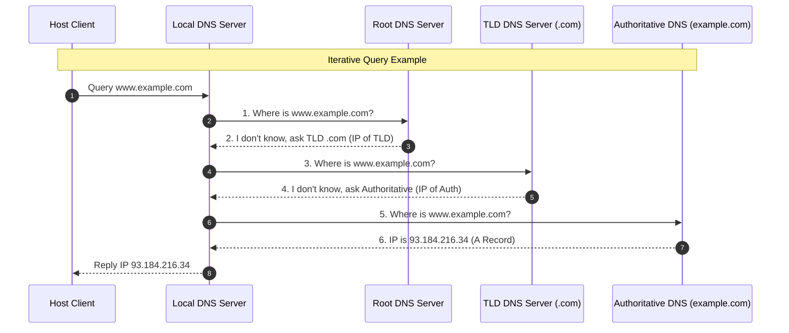
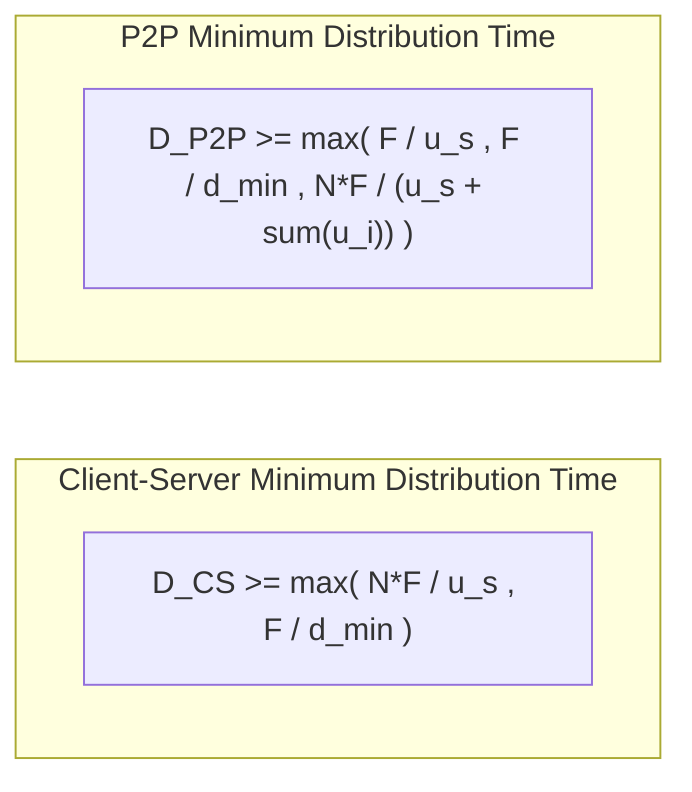
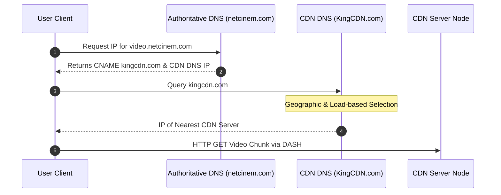

---
tags:
  - networking
  - chapter2
  - application-layer
  - http
  - dns
  - socket-programming
created: 2026-08-03
updated: 2026-08-03
type: wiki-note
---

# Chapter 2: Application Layer

> [!SUMMARY] ภาพรวมประจำบท
> โน้ตความรู้บทที่ 2 เจาะลึกเลเยอร์ประยุกต์ใช้งาน (Application Layer) ซึ่งเป็นเลเยอร์บนสุดของสถาปัตยกรรมเครือข่าย ครอบคลุมรูปแบบสถาปัตยกรรมแอปพลิเคชัน (Client-Server vs P2P), โปรโตคอลเว็บ HTTP (HTTP/1.0, 1.1, 2, 3), โครงสร้าง HTTP Request/Response, Cookies, Web Cache/Proxy Server, ระบบอีเมล (SMTP, POP3, IMAP), ระบบ DNS (Domain Name System, Hierarchical Structure, Iterative/Recursive Queries, Resource Records), ระบบสตรีมมิ่งวิดีโอ DASH & CDNs, การคำนวณเวลาแจกจ่ายไฟล์ P2P vs Client-Server, และเวิร์กช็อปการเขียนโปรแกรมซ็อกเก็ต (Socket Programming) ด้วยภาษา Python

---

## 1. หลักการของแอปพลิเคชันบนเครือข่าย (Principles of Network Applications)

การพัฒนาแอปพลิเคชันเครือข่ายทำได้โดยเขียนโปรแกรมให้อุปกรณ์ปลายทาง (End Systems) คุยกัน โดยไม่ต้องเขียนโค้ดสั่งงานเราเตอร์หรือสวิตช์ใน Network Core



### 1.1 เปรียบเทียบสถาปัตยกรรมแอปพลิเคชัน
1. **Client-Server Architecture:**
   - **Server:** เครื่องโฮสต์ที่เปิดทำงานตลอดเวลา (Always-on), มี IP Address แบบคงที่ (Static IP), รองรับคำขอจาก Clients จำนวนมาก
   - **Client:** เครื่องผู้ใช้ที่ส่งคำขอไปยังเซิร์ฟเวอร์ อาจมี Dynamic IP Address และไม่จำเป็นต้องเปิดตลอดเวลา
   - *ตัวอย่าง:* Web (HTTP), E-mail (SMTP/IMAP), File Transfer (FTP)
2. **Peer-to-Peer (P2P) Architecture:**
   - ไม่จำเป็นต้องมี Central Server เสมอไป
   - อุปกรณ์ปลายทาง (Peers) สื่อสารกันโดยตรง และทำหน้าที่เป็นทั้ง Client และ Server ในเวลาเดียวกัน
   - **Self-scalability:** ยิ่งมี Peers เข้ามาในระบบมาก ความสามารถในการส่งมอบข้อมูลของระบบจะยิ่งเพิ่มขึ้น
   - *ตัวอย่าง:* BitTorrent, VoIP (Skype ยุคแรก), Blockchain

---

### 1.2 กระบวนการสื่อสารระหว่าง Process ผ่าน Socket
- กระบวนการ (Process) สื่อสารข้ามเครือข่ายผ่าน **Socket** ซึ่งเปรียบเสมือน "ประตู" (Door) ระหว่าง Application Layer และ Transport Layer
- การระบุตัวตนของ Process บนเครือข่ายต้องใช้ 2 ส่วนประกอบ:
  1. **IP Address (32-bit/128-bit):** ระบุเครื่องโฮสต์บนเครือข่าย
  2. **Port Number (16-bit):** ระบุโปรเซสเฉพาะบนเครื่องโฮสต์นั้น (เช่น HTTP Port 80, HTTPS Port 443, DNS Port 53)



---

## 2. เว็บและโปรโตคอล HTTP (Web and HTTP)

**HTTP (HyperText Transfer Protocol)** คือโปรโตคอลหลักของ World Wide Web ทำงานบนสถาปัตยกรรม Client-Server และใช้ TCP เป็น Transport Protocol (Port 80 / 443)

> [!DEFINITION] HTTP Stateless Property
> HTTP เป็น **Stateless Protocol** คือ เซิร์ฟเวอร์จะไม่บันทึกสถานะ (State) หรือประวัติการร้องขอในอดีตของ Client ไว้เลย หาก Client ส่งคำขอเดิมมา 2 ครั้ง เซิร์ฟเวอร์จะประมวลผลเสมือนเป็นคำขอใหม่เสมอ

---

### 2.1 ประเภทการเชื่อมต่อ: Non-Persistent vs Persistent Connections



1. **Non-Persistent HTTP (HTTP/1.0):**
   - 1 TCP Connection ส่งได้เพียง **1 Object** เท่านั้น แล้วปิดการเชื่อมต่อทันที
   - การดึงข้อมูล 1 เว็บไซต์ที่มี $N$ รูปภาพ ต้องเปิด-ปิด TCP Connection ถึง $N+1$ ครั้ง!
   - **Response Time สำหรับ 1 Object:**
     $$\text{Total Time} = 2 \times \text{RTT} + \text{File Transmission Time}$$
2. **Persistent HTTP (HTTP/1.1):**
   - เปิด TCP Connection ทิ้งไว้ และส่งได้หลาย Objects ผ่าน Connection เดิม
   - ช่วยลด Overhead ของ 3-Way Handshake และลดปัญหา TCP Slow Start

---

### 2.2 โครงสร้างข้อความ HTTP (HTTP Message Format)

#### HTTP Request Message
```http
GET /index.html HTTP/1.1
Host: www.example.com
User-Agent: Mozilla/5.0 (Windows NT 10.0; Win64; x64)
Accept: text/html,application/xhtml+xml
Accept-Language: en-US,en;q=0.9
Connection: keep-alive

[Entity Body - ว่างเปล่าสำหรับ GET]
```

- **HTTP Request Methods:**
  - `GET`: ร้องขอข้อมูลจากเซิร์ฟเวอร์ (ไม่มี data ใน body)
  - `POST`: ส่งข้อมูลจากฟอร์มผู้ใช้ไปประมวลผลที่เซิร์ฟเวอร์ (ใส่ข้อมูลใน body)
  - `HEAD`: ร้องขอเฉพาะ Header ไม่เอาตัวเนื้อหา (ใช้ทดสอบลิงก์)
  - `PUT`: อัปโหลดไฟล์ขึ้นไปแทนที่ไฟล์เดิมบนเซิร์ฟเวอร์
  - `DELETE`: ลบไฟล์เป้าหมายบนเซิร์ฟเวอร์

#### HTTP Response Message
```http
HTTP/1.1 200 OK
Date: Mon, 03 Aug 2026 09:00:00 GMT
Server: Apache/2.4.41 (Ubuntu)
Last-Modified: Sun, 02 Aug 2026 12:00:00 GMT
Content-Length: 4096
Content-Type: text/html; charset=UTF-8

<!DOCTYPE html><html><body><h1>Hello World</h1></body></html>
```

- **HTTP Response Status Codes:**
  - `200 OK`: ดำเนินการสำเร็จ
  - `301 Moved Permanently`: ย้าย URL ถาวร (Redirection)
  - `304 Not Modified`: ข้อมูลในแคชยังใหม่อยู่ ไม่ต้องส่งข้อมูลมาใหม่
  - `400 Bad Request`: รูปแบบคำขอจาก Client ไม่ถูกต้อง
  - `404 Not Found`: ไม่พบไฟล์ที่ร้องขอบนเซิร์ฟเวอร์
  - `500 Internal Server Error`: เกิดข้อผิดพลาดในฝั่งเซิร์ฟเวอร์
  - `505 HTTP Version Not Supported`: เซิร์ฟเวอร์ไม่รองรับเวอร์ชัน HTTP นี้

---

### 2.3 การจัดการสถานะด้วย Cookies และ Web Caching



- **Cookies (4 องค์ประกอบ):**
  1) Header line ใน HTTP Response (`Set-Cookie: 1678`)
  2) Header line ใน HTTP Request ครั้งถัดไป (`Cookie: 1678`)
  3) ไฟล์คุกกี้ที่เก็บบนเครื่องผู้ใช้ (Client-side)
  4) ฐานข้อมูลแบ็กเอนด์ของเว็บไซต์เพื่อแมป Cookie ID เข้ากับ Session ข้อมูลผู้ใช้
- **Web Cache / Proxy Server:**
  - ช่วยลด Response Time ของผู้ใช้ และลดปริมาณ Traffic บนลิงก์เชื่อมต่ออินเทอร์เน็ตขององค์กร
  - **Conditional GET:** เครื่อง Proxy ส่ง HTTP GET พร้อม header `If-Modified-Since: <date>` เพื่อเช็กว่าไฟล์บน Origin Server มีการแก้ไขหรือไม่ หากยังไม่มี เซิร์ฟเวอร์จะตอบกลับ `304 Not Modified` โดยไม่ส่งไฟล์ซ้ำซ้อน

---

### 2.4 วิวัฒนาการของ HTTP: HTTP/1.1 vs HTTP/2 vs HTTP/3



---

## 3. ระบบอีเมล (Electronic Mail: SMTP, POP3, IMAP)

สถาปัตยกรรมอีเมลประกอบด้วย 3 ส่วนหลัก: **Mail User Agents (MUA)**, **Mail Servers**, และ **Protocols**



- **SMTP (Simple Mail Transfer Protocol - Port 25):**
  - เป็น **Push Protocol** ใช้ส่งอีเมลจาก MUA ไปยัง Mail Server และส่งระหว่าง Mail Server ถึงกัน
  - ข้อความต้องอยู่ในรูปแบบ ASCII 7-bit เท่านั้น (หากเป็นไฟล์แนบ ต้องแปลงผ่าน **MIME**)
- **POP3 vs IMAP (Pull Protocols):**
  - **POP3 (Port 110):** โหลดอีเมลลงมาเครื่อง Client แล้วลบทิ้งจากเซิร์ฟเวอร์ ( Stateless ข้ามอุปกรณ์)
  - **IMAP (Port 143):** เก็บอีเมลทั้งหมดไว้บนเซิร์ฟเวอร์ อนุญาตให้จัดโฟลเดอร์ ค้นหา และซิงก์สถานะเปิดอ่านข้ามหลายอุปกรณ์ได้

---

## 4. ระบบชื่อโดเมน (Domain Name System: DNS)

**DNS** ทำหน้าที่เป็น "สมุดโทรศัพท์ของอินเทอร์เน็ต" แปลงชื่อโดเมนอ่านง่าย (Hostname) เป็นหมายเลข IP Address (32-bit หรือ 128-bit)

### 4.1 สถาปัตยกรรมลำดับชั้นของ DNS (Hierarchical DNS Database)



1. **Root DNS Servers:** เซิร์ฟเวอร์รากฐานระดับโลก (มี 13 IP root server clusters)
2. **Top-Level Domain (TLD) Servers:** ดูแลโดเมนระดับบนสุด เช่น `.com`, `.org`, `.edu`, `.th`, `.cn`
3. **Authoritative DNS Servers:** เซิร์ฟเวอร์ขององค์กรหรือผู้ให้บริการโฮสติ้งที่เก็บบันทึก IP ที่แท้จริงของโดเมนนั้นๆ
4. **Local DNS Server (Default Name Server):** เซิร์ฟเวอร์ DNS ของ ISP หรือองค์กร ทำหน้าที่เป็น Proxy คอยรับคำขอจาก Client แล้วไปไล่ถามเซิร์ฟเวอร์อื่นให้

---

### 4.2 การค้นหาข้อมูล DNS: Iterative vs Recursive Query



---

### 4.3 DNS Resource Records (RR)
ระเบียนข้อมูลใน DNS มีรูปแบบ 4-Tuple: `(Name, Value, Type, TTL)`

| Type | Name | Value | ความหมาย |
| :--- | :--- | :--- | :--- |
| **A** | `hostname` | `IPv4 Address` | แมปชื่อโฮสต์เป็น IPv4 (เช่น `google.com` $\to$ `142.250.198.46`) |
| **AAAA** | `hostname` | `IPv6 Address` | แมปชื่อโฮสต์เป็น IPv6 |
| **NS** | `domain` | `Authoritative Hostname` | ระบุชื่อ DNS Server ที่ดูแลโดเมนนั้น |
| **CNAME**| `alias name` | `canonical name` | แมปชื่ออักขระนามแฝง ไปยังชื่อจริง (Canonical Name) |
| **MX** | `domain` | `Mail Server Name` | ระบุชื่อ Mail Server ของโดเมนนั้น |

---

## 5. แอปพลิเคชัน P2P และ BitTorrent (Peer-to-Peer File Distribution)

### 5.1 การวิเคราะห์เวลาแจกจ่ายไฟล์: Client-Server vs P2P
สมมติต้องแจกจ่ายไฟล์ขนาด $F\text{ bits}$ ไปยัง Clients จำนวน $N$ เครื่อง
- $u_s = \text{Server Upload Rate}$
- $d_{min} = \text{Minimum Client Download Rate}$
- $u_i = \text{Upload Rate of Client } i$



> [!EXAMPLE] การเปรียบเทียบการเพิ่มขึ้นของเวลาตามจำนวน $N$
> ในสถาปัตยกรรม **Client-Server** เวลาจะเพิ่มขึ้นเป็นเส้นตรงตาม $N$ ($N \cdot F / u_s$)
> ในขณะที่ **P2P** เมื่อ $N$ เพิ่มขึ้น ตัวหาร $(u_s + \sum u_i)$ จะเพิ่มขึ้นตามด้วย ทำให้เวลาการกระจายไฟล์คงที่และช้าลงน้อยมากเมื่อผู้ใช้เพิ่มขึ้น!

---

### 5.2 กลไกการทำงานของ BitTorrent
- **Torrent:** กลุ่มของ Peers ที่ร่วมกันแลกเปลี่ยนชิ้นส่วนไฟล์ (Chunks ขนาด $256\text{ KB}$)
- **Tracker:** โครงสร้างพื้นฐานคอยบันทึกรายชื่อ Peers ที่อยู่ใน Torrent
- **Choke / Unchoke Algorithm (Tit-for-Tat):**
  - แต่ละ Peer จะเลือกส่งข้อมูลให้ **Top 4 Peers** ที่ส่งข้อมูลมาให้ตนเองด้วยความเร็วสูงสุด (Unchoked) โดยวัดความเร็วใหม่ทุกๆ 10 วินาที
  - ทุกๆ 30 วินาที จะสุ่มเลือก 1 Peer ใหม่แบบ Optimistically Unchoked เพื่อหาเพื่อนใหม่ที่อาจมีความเร็วสูงกว่าเดิม

---

## 6. ระบบสตรีมมิ่งวิดีโอและ CDNs (Video Streaming & CDNs)

### 6.1 DASH (Dynamic Adaptive Streaming over HTTP)
- วิดีโอจะถูกตัดแบ่งเป็นไฟล์ชิ้นเล็กๆ (Chunks) ความยาว 2-10 วินาที และเข้ารหัสไว้หลายระดับ Bitrate (ความคมชัด)
- **Manifest File:** ไฟล์ดัชนีระบุ URL ของชิ้นส่วนวิดีโอในทุกระดับ Bitrate
- **Client Decision Algorithm:** Client จะคอยวัดแบนด์วิดท์ ณ ขณะนั้น และสลับร้องขอระดับ Bitrate ที่เหมาะสมที่สุดโดยอัตโนมัติ

### 6.2 กลไกของ Content Distribution Networks (CDNs)
CDNs กระจายสำเนาวิดีโอไปเก็บบน Server Nodes ทั่วโลก โดยมี 2 สถาปัตยกรรม:
1. **Enter Deep:** ตั้งเครื่อง CDN Server แทรกเข้าไปใน Access ISP Networks ทั่วโลก (ใกล้ชิดผู้ใช้มากที่สุด)
2. **Bring Home:** ตั้งเครื่อง CDN Server ขนาดใหญ่ใน PoP ใกล้กับ Tier-1 ISPs



---

## 7. เวิร์กช็อปการเขียนโปรแกรมซ็อกเก็ต (Socket Programming Workshop)

### 7.1 TCP Socket Programming (Python 3)

#### TCP Server (`tcp_server.py`)
```python
import socket

SERVER_PORT = 12000
serverSocket = socket.socket(socket.AF_INET, socket.SOCK_STREAM)
serverSocket.bind(('', SERVER_PORT))
serverSocket.listen(1)
print("The TCP Server is ready to receive...")

while True:
    connectionSocket, addr = serverSocket.accept()
    sentence = connectionSocket.recv(1024).decode()
    capitalizedSentence = sentence.upper()
    connectionSocket.send(capitalizedSentence.encode())
    connectionSocket.close()
```

#### TCP Client (`tcp_client.py`)
```python
import socket

SERVER_NAME = '127.0.0.1'
SERVER_PORT = 12000
clientSocket = socket.socket(socket.AF_INET, socket.SOCK_STREAM)
clientSocket.connect((SERVER_NAME, SERVER_PORT))

message = input('Input lowercase sentence: ')
clientSocket.send(message.encode())
modifiedMessage = clientSocket.recv(1024)
print('From Server:', modifiedMessage.decode())
clientSocket.close()
```

---

### 7.2 UDP Socket Programming (Python 3)

#### UDP Server (`udp_server.py`)
```python
import socket

SERVER_PORT = 12000
serverSocket = socket.socket(socket.AF_INET, socket.SOCK_DGRAM)
serverSocket.bind(('', SERVER_PORT))
print("The UDP Server is ready to receive...")

while True:
    message, clientAddress = serverSocket.recvfrom(2048)
    modifiedMessage = message.decode().upper()
    serverSocket.sendto(modifiedMessage.encode(), clientAddress)
```

---

## 📚 อ้างอิงและโน้ตที่เกี่ยวข้อง
- 🔹 **[[Chapter 1 - Computer Networks and the Internet]]** - พื้นฐาน Delay และโครงสร้างเครือข่าย
- 🔹 **[[Chapter 3 - Transport Layer]]** - กลไก TCP และ UDP ในการสนับสนุน Socket
- 🔹 **[[Chapter 9 - TCP IP Model and Architecture]]** - สรุปการแมป Port Number และ IP Address
- 🔹 **[[Chapter 10 - Homework and Quiz Solution Guide]]** - แบบฝึกหัดคำนวณเวลาแจกจ่ายไฟล์ P2P และ HTTP RTT
