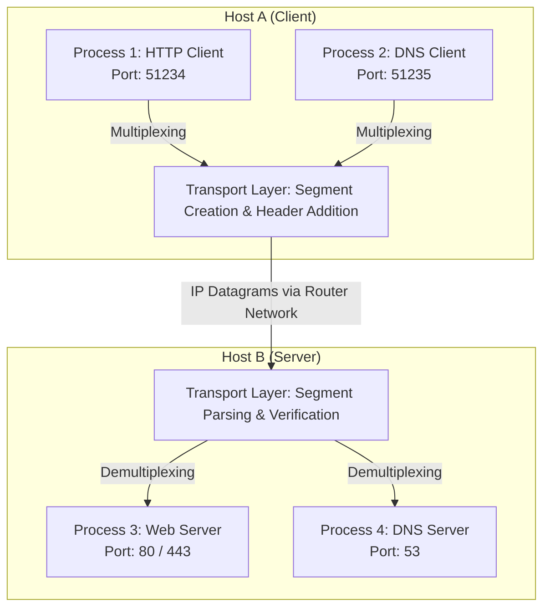
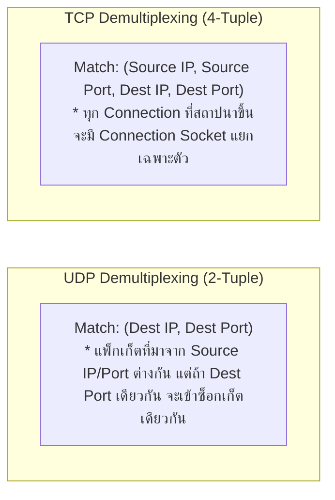
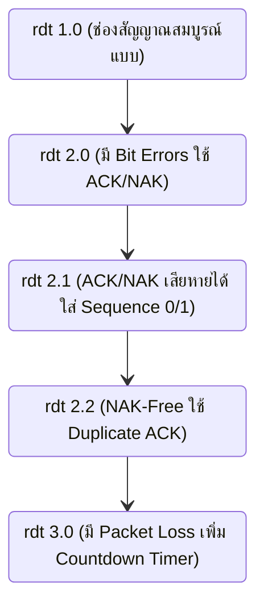
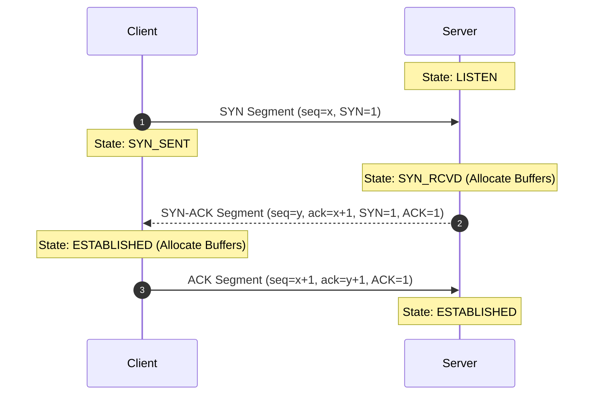
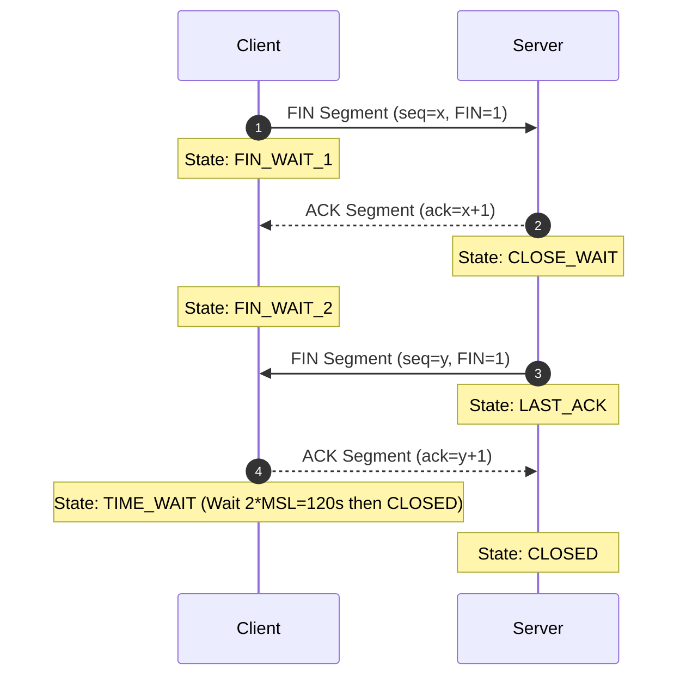
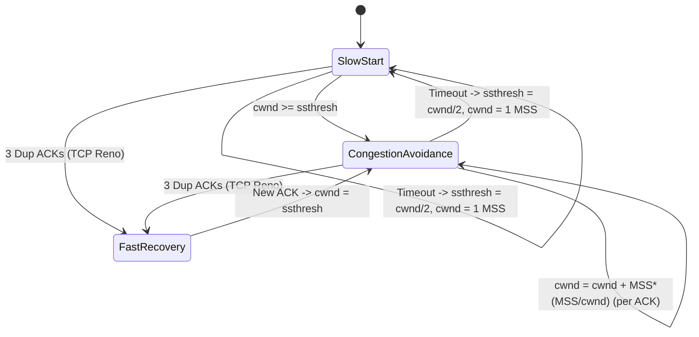
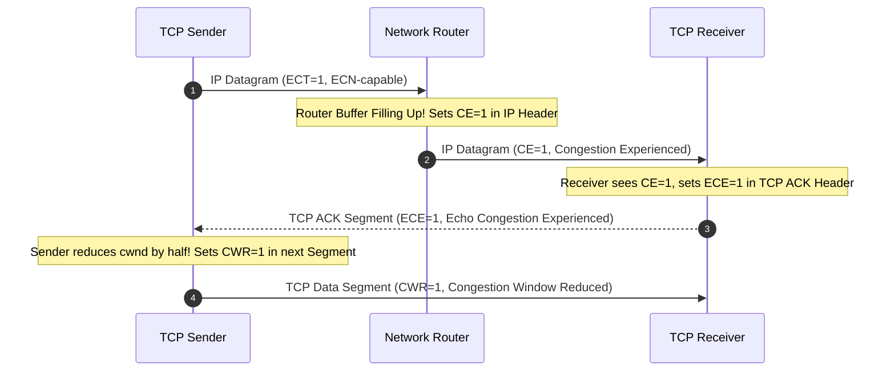
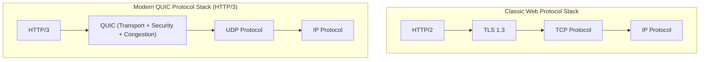

---
tags:
  - networking
  - chapter3
  - transport-layer
  - tcp
  - udp
  - rdt
  - congestion-control
  - quic
  - ecn
  - cubic
  - bbr
created: 2026-08-03
updated: 2026-08-10
type: wiki-note
---

# Chapter 3: Transport Layer (เลเยอร์นำส่งข้อมูล - Kurose & Ross 9th Edition Complete Master Note)

> [!SUMMARY] ภาพรวมประจำบท (Kurose & Ross 9th Edition Complete Coverage: Slides 1–154)
> โน้ตความรู้บทที่ 3 เจาะลึกเลเยอร์นำส่งข้อมูล (Transport Layer) ซึ่งทำหน้าที่เป็นสะพานเชื่อมการสื่อสารแบบโปรเซสถึงโปรเซส (Process-to-Process Logical Communication) ครอบคลุม:
> - **บริการพื้นฐาน:** อุปมาอุปไมย Ann & Bill, Encapsulation/Decapsulation, Multiplexing และ Demultiplexing (2-Tuple UDP vs 4-Tuple TCP), พอร์ตหมายเลข และประเภทของ Web Server Sockets (Welcoming vs Connection Sockets)
> - **UDP (User Datagram Protocol - RFC 768):** Header ขนาด 8 ไบต์, การคำนวณ Checksum พร้อม IP Pseudo-Header แบบ 1's Complement Sum
> - **ทฤษฎีการส่งข้อมูลอย่างน่าเชื่อถือ (RDT 1.0 - 3.0):** Finite State Machines (FSMs) ละเอียดทุกสถานการณ์, การจัดการ Bit Error และ Packet Loss, การวิเคราะห์ Utilization ของ Stop-and-Wait Protocol
> - **โปรโตคอลท่อส่ง (Pipelined Protocols):** เปรียบเทียบ Go-Back-N (GBN) vs Selective Repeat (SR), Extended FSMs ฝั่งส่งและฝั่งรับ, และ SR Sequence Number Dilemma ($N \le 2^{k-1}$)
> - **TCP (Transmission Control Protocol):** โครงสร้าง Header, Sequence & Cumulative ACK, ตัวอย่าง Interactive Telnet Piggybacking, การประมาณค่า RTT/Timeout (EWMA, DevRTT, Karn's Algorithm & Exponential Timer Backoff), TCP Sender FSM, กฎการส่ง ACK ของ Receiver (RFC 5681), Fast Retransmit (3 Duplicate ACKs)
> - **การควบคุมการไหลและการจัดการเซสชัน:** Flow Control (`rwnd` & Probe Segment), ข้อผิดพลาดของ 2-Way Handshake, 3-Way Handshake FSM, SYN Flood Attack & SYN Cookies Defense, 4-Way Teardown FSM & TIME_WAIT state ($2 \times \text{MSL}$)
> - **สาเหตุและต้นทุนความคับคั่ง (Congestion Scenarios 1–3):** Queuing Delay อนันต์, Retransmission Cost, Premature Timeout Cost, และ Wasted Upstream Capacity (Congestion Collapse)
> - **การควบคุมความคับคั่ง (TCP Congestion Control):** AIMD Vector Proof of Fairness Line, Congestion Control FSM (Slow Start, Congestion Avoidance, Fast Recovery, TCP Tahoe vs Reno), สูตรคำนวณ Throughput ($\approx \frac{3}{4}\frac{W}{\text{RTT}}$ และ $\frac{1.22 \cdot \text{MSS}}{\text{RTT}\sqrt{L}}$)
> - **เทคโนโลยีสมัยใหม่:** ECN (Explicit Congestion Notification: IP ECT/CE & TCP ECE/CWR), TCP CUBIC ($W(t) = C(t-K)^3 + W_{max}$), BDP & Google BBR (Model-based Rate Control vs Loss-based TCP), Long Fat Pipes (LFP analysis: 10 Gbps, RTT 100ms, 83,333 In-flight segments), และ QUIC over UDP (RFC 9000: 0-RTT/1-RTT, No HoL Blocking, Connection Migration via CID)

---

## 1. บริการของ Transport Layer และการ Demultiplexing

Transport Layer ทำหน้าที่สร้าง **Logical Communication** ระหว่างแอปพลิเคชันโปรเซส (Application Processes) ที่รันอยู่บนโฮสต์ต่างเครื่องกัน โดยอาศัยบริการ Best-Effort ของ Network Layer (IP Protocol) ซึ่งทำหน้าที่ส่งแพ็กเก็ตแบบ Host-to-Host

### 1.1 การเปรียบเทียบ Transport Layer กับ Network Layer
- **Network Layer:** รับผิดชอบการนำส่งข้อมูลระหว่าง **Host กับ Host** (เปรียบเสมือนบุรุษไปรษณีย์ที่นำส่งจดหมายระหว่างบ้านสองหลัง)
- **Transport Layer:** รับผิดชอบการนำส่งข้อมูลระหว่าง **Process กับ Process** (เปรียบเสมือนคนในบ้านที่คอยแจกจ่ายจดหมายให้เด็กๆ แต่ละคนในบ้าน)

> [!DEFINITION] อุปมาอุปไมยบ้าน Ann & Bill (Ann & Bill Household Analogy)
> - **บ้าน A (Host A):** มีเด็ก 12 คน เขียนจดหมายหาเด็ก 12 คนใน **บ้าน B (Host B)**
> - **Ann (Transport Layer ฝั่งส่ง):** รวบรวมจดหมายจากเด็กๆ ในบ้าน A ใส่ซองและนำไปส่งให้บุรุษไปรษณีย์ (Multiplexing)
> - **Postal Service (Network Layer / IP):** ขนส่งซองจดหมายระหว่างบ้าน A และบ้าน B
> - **Bill (Transport Layer ฝั่งรับ):** รับซองจดหมายจากบุรุษไปรษณีย์ เปิดดูชื่อผู้รับและเดินเอาไปแจกให้เด็กถูกคนในบ้าน B (Demultiplexing)

---

### 1.2 ขั้นตอนการทำงานที่ฝั่งส่งและฝั่งรับ (Sender & Receiver Actions)
1. **ฝั่งส่ง (Sender Actions):**
   - รับข้อความจาก Application Layer (Application-Layer Message: `app msg`)
   - คำนวณฟิลด์ต่างๆ ใน Header (เช่น Port, Sequence Number, Checksum)
   - รวม Header (`T_h`) เข้ากับ `app msg` กลายเป็น **Transport-Layer Segment** (`T_h + app msg`)
   - ส่ง Segment ลงไปให้ Network Layer ทำการ Encapsulation เป็น IP Datagram
2. **ฝั่งรับ (Receiver Actions):**
   - รับ IP Datagram จาก Network Layer และสกัดเอา Transport Segment ออกมา
   - ตรวจสอบความถูกต้องของ Header (เช่น Checksum, Sequence Number)
   - สกัดเอา `app msg` ออกจาก Header
   - ทำ **Demultiplexing** ส่งมอบข้อความผ่าน Socket ไปยัง Process ที่ถูกต้อง

---

### 1.3 Multiplexing และ Demultiplexing
- **Multiplexing (ฝั่งส่ง):** การรวบรวมชิ้นส่วนข้อมูลจากหลายๆ ซ็อกเก็ต (Sockets) ใส่ Header ข้อมูลพอร์ต (Source & Destination Port Numbers) แล้วส่งลงไปยัง Network Layer
- **Demultiplexing (ฝั่งรับ):** การตรวจสอบ Header ของ Transport Segment เพื่อส่งมอบ Segment นั้นไปยังซ็อกเก็ตที่ถูกต้อง

> [!INFO] พอร์ตหมายเลข (Port Numbers) และประเภทของ Web Server Socket
> Port Number มีขนาด 16 บิต ($0 - 65,535$) แบ่งออกเป็น 3 ช่วง:
> 1. **Well-Known Ports ($0 - 1,023$):** สงวนไว้สำหรับบริการมาตรฐาน (เช่น HTTP: 80, HTTPS: 443, SSH: 22, DNS: 53)
> 2. **Registered Ports ($1,024 - 49,151$):** สำหรับแอปพลิเคชันที่จดทะเบียน (เช่น MySQL: 3306, Redis: 6379)
> 3. **Dynamic / Private / Ephemeral Ports ($49,152 - 65,535$):** พอร์ตชั่วคราวที่ OS สุ่มให้ฝั่ง Client
>
> *หมายเหตุ:* เว็บเซิร์ฟเวอร์สมัยใหม่ (Multi-threaded Web Server) จะมี **Welcoming Socket** อยู่ที่ Port 80/443 เมื่อมี Client เชื่อมต่อเข้ามา OS จะสร้าง **Connection Socket** ใหม่พร้อม Thread หรือ Process แยกเฉพาะในการประมวลผล โดยอ้างอิงจาก 4-Tuple แบบเต็ม (`Source IP, Source Port, Dest IP, Dest Port`)

---

## 2. โปรโตคอล UDP (User Datagram Protocol - RFC 768)

UDP เป็นโปรโตคอลนำส่งข้อมูลแบบ **Connectionless** (ไม่มีการสร้างการเชื่อมต่อก่อนส่ง) เป็นโปรโตคอลที่เรียบง่ายที่สุด โดยแทบไม่เพิ่มภาระ (Overhead) ใดๆ ครอบ IP Header

### 2.1 ข้อดีและคุณลักษณะของ UDP
1. **ไม่มี Connection Delay:** ไม่ต้องเสียเวลา 1 RTT ในการทำ Handshake (ส่งข้อมูลได้ทันที เหมาะกับ DNS, HTTP/3 QUIC)
2. **ไม่มี Connection State:** ไม่ต้องเก็บ State ในหน่วยความจำของเซิร์ฟเวอร์ (รองรับ Active Clients ได้จำนวนมหาศาล)
3. **Header ขนาดเล็กมาก:** มีขนาดเพียง **8 Bytes** (เทียบกับ TCP ที่มีขนาดอย่างน้อย 20 Bytes)
4. **ไม่มี Congestion Control:** แอปพลิเคชันส่งข้อมูลออกไปได้ด้วยอัตราความเร็วตามที่ต้องการ โดยไม่ถูกชะลอความเร็วจากเครือข่าย

---

### 2.2 โครงสร้าง Header และการคำนวณ Checksum พร้อม IP Pseudo-Header

| Bits 0–15 | Bits 16–31 |
| :--- | :--- |
| **Source Port Number (16 bits)** | **Destination Port Number (16 bits)** |
| **Length (16 bits)** | **Checksum (16 bits)** |
| **Payload Data (Application Message)** | ... |

> [!IMPORTANT] IP Pseudo-Header ในการคำนวณ UDP Checksum
> ในทางปฏิบัติ UDP Checksum ไม่ได้คำนวณเฉพาะ UDP Header และ Data เท่านั้น แต่จะรวมเอา **IP Pseudo-Header (12 Bytes)** มาร่วมคำนวณด้วย เพื่อป้องกันไม่ให้แพ็กเก็ตส่งไปผิดเครื่องหากเกิด Bit Error ใน IP Header:
> - Source IP Address (32 บิต)
> - Destination IP Address (32 บิต)
> - Zeroes (8 บิต) + Protocol Field (8 บิต: UDP = 17 หรือ `0x11`)
> - UDP Length (16 บิต)

> [!EXAMPLE] ขั้นตอนการคำนวณ UDP Checksum (1's Complement Sum)
> สมมติมีข้อมูล 16-bit 3 คำ ดังนี้:
> - คำที่ 1: `11100110 01100110` (0xE666)
> - คำที่ 2: `11010101 01010101` (0xD555)
> - คำที่ 3: `00000001 00000001` (0x0101)
>
> **ขั้นตอนการคำนวณ:**
> 1. บวกคำที่ 1 + คำที่ 2:
>    $$\begin{array}{r@{\quad}l}
>      11100110 & 01100110 \\
>    + 11010101 & 01010101 \\
>    \hline
>    1\,10111011 & 10111011 \quad (\text{เกิด Carry Bit ในตำแหน่ง 17}) \\
>    \to 10111011 & 10111100 \quad (\text{นำ Carry 1 มาบวกทบเข้าหลักหน่วย: End-Around Carry})
>    \end{array}$$
> 2. บวกผลลัพธ์กับคำที่ 3:
>    $$\begin{array}{r@{\quad}l}
>      10111011 & 10111100 \\
>    + 00000001 & 00000001 \\
>    \hline
>      10111100 & 10111101
>    \end{array}$$
> 3. ทำ **1's Complement (กลับบิต 0 เป็น 1 และ 1 เป็น 0):**
>    $$\text{Checksum} = \mathbf{01000011 \; 01000010} \quad (0x4342)$$
> *ฝั่งรับจะนำทุกคำรวมถึง Checksum มาบวกกัน หากได้ผลลัพธ์เป็น `11111111 11111111` (0xFFFF) แสดงว่าข้อมูลถูกต้องสมบูรณ์!*

---

## 3. ทฤษฎีการส่งข้อมูลอย่างน่าเชื่อถือ (Reliable Data Transfer: RDT)

การออกแบบกลไกส่งข้อมูลที่น่าเชื่อถือ (Reliable) บนเลเยอร์ล่างที่ไม่น่าเชื่อถือ (Unreliable IP Layer) มีวิวัฒนาการเชิงทฤษฎีตามลำดับ:

### 3.1 สรุปกลไกและ FSM ของแต่ละเวอร์ชัน
1. **rdt 1.0:** ช่องสัญญาณสมบูรณ์แบบ (Reliable Channel) ไม่มีข้อผิดพลาดของบิต และไม่มีแพ็กเก็ตสูญหาย
2. **rdt 2.0:** รองรับช่องสัญญาณที่มี **Bit Errors** ใช้กลไก **ARQ (Automatic Repeat reQuest)** ประกอบด้วย Checksum, Positive ACK, และ Negative NAK
   - *ข้อผิดพลาด (Fatal Flaw):* หากตัว ACK หรือ NAK เกิดความเสียหาย (Corrupted) ฝั่งส่งจะไม่สามารถแยกแยะได้ว่าฝั่งรับได้รับข้อมูลถูกต้องหรือไม่!
3. **rdt 2.1:** แก้ปัญหากรณี ACK/NAK เสียหาย โดยฝั่งส่งใส่ **Sequence Number (0 หรือ 1)** กำกับในทุกแพ็กเก็ต
   - ทำให้ FSM ฝั่งส่งเพิ่มเป็น 4 สถานะ (`Wait for Call 0`, `Wait for ACK/NAK 0`, `Wait for Call 1`, `Wait for ACK/NAK 1`) และฝั่งรับเพิ่มเป็น 2 สถานะ (`Wait for 0`, `Wait for 1`)
4. **rdt 2.2:** **NAK-Free Protocol** ยกเลิกการใช้ NAK โดยส่ง ACK พร้อมกำกับ Sequence Number ล่าสุดที่รับสำเร็จ หากฝั่งส่งได้รับ ACK ซ้ำ (Duplicate ACK) จะถือว่าเป็น NAK สำหรับแพ็กเก็ตถัดไป
5. **rdt 3.0 (Stop-and-Wait):** รองรับทั้ง Bit Errors และ **Packet Loss** โดยเพิ่ม **Countdown Timer** ฝั่งส่ง หากไทม์เอาต์จะ retransmit แพ็กเก็ตนั้นใหม่ทันที
   - จัดการสถานการณ์ 4 กรณี: (1) Normal Operation, (2) Packet Loss, (3) ACK Loss, (4) Premature Timeout / Delayed ACK (เกิด Duplicate Packet ซึ่งจัดการได้ด้วย Sequence Number)

---

### 3.2 ประสิทธิภาพของ Stop-and-Wait Protocol
ใน rdt 3.0 การทำงานแบบ Stop-and-Wait ทำให้ประสิทธิภาพการใช้ลิงก์ (Sender Utilization: $U_{sender}$) ต่ำมาก

$$U_{sender} = \frac{\frac{L}{R}}{RTT + \frac{L}{R}}$$

> [!EXAMPLE] คำนวณ Stop-and-Wait Utilization
> ลิงก์ความเร็ว $R = 1\text{ Gbps}$, RTT = $30\text{ ms}$, ขนาดแพ็กเก็ต $L = 1,000\text{ bytes} = 8,000\text{ bits}$
> - Transmission Delay ($d_{trans}$) $= \frac{8,000}{10^9} = 0.008\text{ ms}$
> - $U_{sender} = \frac{0.008}{30 + 0.008} = \frac{0.008}{30.008} \approx 0.00027 \quad (0.027\%)$
> *สรุป: ท่อความเร็ว 1 Gbps ถูกใช้งานจริงเพียง 270 kbps เท่านั้น! จึงต้องนำระบบ Pipelining มาใช้*

---

### 3.3 โปรโตคอลท่อส่งข้อมูล (Pipelined Protocols: GBN vs SR)

**Pipelining** ยอมให้ฝั่งส่งสามารถส่งแพ็กเก็ตออกไปได้หลายแพ็กเก็ตล่วงหน้า (In-flight Unacknowledged Packets) ภายในขนาดของ Window ($N$)

| คุณลักษณะ (Property) | Go-Back-N (GBN) | Selective Repeat (SR) |
| :--- | :--- | :--- |
| **ลักษณะของ ACK** | **Cumulative ACK** (ACK $n$ หมายถึงได้รับแพ็กเก็ตถึง $n$ สมบูรณ์แล้ว) | **Individual ACK** (ACK แต่ละแพ็กเก็ตแยกกันอิสระ) |
| **Timer ฝั่งส่ง** | มี **Single Timer** สำหรับแพ็กเก็ตเก่าสุดที่ยังไม่ได้ ACK (`send_base`) | มี **Timer แยกอิสระ** สำหรับทุกๆ แพ็กเก็ตที่ยังไม่ได้ ACK |
| **การ Retransmit เมื่อ Timeout** | ส่งใหม่ **ยกชุด** ตั้งแต่แพ็กเก็ตที่หายไปจนถึงแพ็กเก็ตล่าสุดใน Window | ส่งใหม่ **เฉพาะแพ็กเก็ตที่สูญหาย** เท่านั้น |
| **Buffer ฝั่งรับ** | **ไม่มี Buffer** ฝั่งรับ (หากรับแพ็กเก็ตข้ามลำดับจะทิ้งทันที) | **มี Buffer** สำหรับเก็บแพ็กเก็ตที่มาข้ามลำดับไว้รอเรียง |
| **ข้อจำกัด Window Size ($N$)** | $N \le 2^k - 1$ ($k$ คือจำนวนบิต Sequence) | $N \le 2^{k-1}$ (ป้องกันความสับสนของ Sequence Number Space) |

> [!WARNING] ข้อจำกัดขนาด Window ของ Selective Repeat (SR Dilemma)
> หากกำหนดขนาด Window $N$ ของ SR ใหญ่เกินไปเทียบกับจำนวนบิต Sequence ($k$) ฝั่งรับจะไม่สามารถแยกแยะได้ว่าแพ็กเก็ตที่ได้รับมาใหม่นั้นเป็น **แพ็กเก็ตใหม่ (New Packet)** หรือเป็น **แพ็กเก็ตเก่าที่ส่งซ้ำ (Retransmission)**!
> - สมมติ $k=2$ (Sequence: 0, 1, 2, 3) ถ้าตั้ง $N=3$ (ซึ่งเกิน $2^{2-1} = 2$):
>   1. Sender ส่ง Pkt 0, 1, 2
>   2. Receiver ได้รับครบ ส่ง ACK 0, 1, 2 แต่ ACK ทั้งหมดสูญหายในเครือข่าย!
>   3. Sender เกิด Timeout จึงส่ง Pkt 0 ซ้ำ
>   4. Receiver ซึ่งเขยิบ Window ไปรอรับ Pkt 3, 0, 1 แล้ว จะเข้าใจว่า Pkt 0 ที่ส่งมาใหม่นี้คือ Pkt 0 ตัวใหม่ของรอบถัดไป! เกิดข้อมูลผิดพลาดทันที
> - **ดังนั้น Selective Repeat ต้องกำหนด $N \le 2^{k-1}$ เสมอ**

---

## 4. โปรโตคอล TCP (Transmission Control Protocol)

TCP (RFC 793, 1122, 2018, 5681) เป็นโปรโตคอลแบบ **Point-to-Point**, **Connection-Oriented**, **Reliable**, **In-order Byte Stream**, และรองรับ **Full Duplex Data**

### 4.1 โครงสร้าง Header ของ TCP (TCP Segment Format)

| Bits 0–15 | Bits 16–31 |
| :--- | :--- |
| **Source Port Number (16 bits)** | **Destination Port Number (16 bits)** |
| **Sequence Number (32 bits)** | |
| **Acknowledgment Number (32 bits)** | |
| **Header Length (4b) \| Reserved (6b) \| Flags (6b)** | **Receive Window (16 bits)** |
| **Checksum (16 bits)** | **Urgent Pointer (16 bits)** |
| **Options (Variable 0–40 bytes)** | |
| **Payload Data (Application Layer Message)** | |

- **Sequence Number (32-bit):** หมายเลขไบต์แรกของข้อมูลใน Segment นั้นในลำดับ Byte Stream
- **Acknowledgment Number (32-bit):** หมายเลขไบต์ถัดไปที่ฝั่งรับ **กำลังรอคอย** จากฝั่งส่ง (Cumulative ACK)
- **Control Flags (8-bit):**
  - `CWR`: Congestion Window Reduced
  - `ECE`: ECN-Echo (แจ้งเตือนความคับคั่ง)
  - `URG`: ข้อมูลด่วนพิเศษ (Urgent Pointer valid)
  - `ACK`: ยืนยันว่าฟิลด์ Acknowledgment Number มีผลใช้งาน
  - `PSH`: สั่งให้ส่งข้อมูลเข้าสู่ Application ทันที
  - `RST`: ยกเลิกการเชื่อมต่อทันที (Reset Connection)
  - `SYN`: เริ่มต้นสถาปนาการเชื่อมต่อ (Handshake)
  - `FIN`: ขอปิดการเชื่อมต่อ (Teardown)

> [!EXAMPLE] ตัวอย่าง Sequence Number และ Cumulative ACK ในเซสชัน Telnet Interactive
> - **Client ส่งตัวอักษร 'C':** `Seq = 42`, `ACK = 79`, `Data = 'C'` (1 Byte)
> - **Server สะท้อนกลับ (Piggybacked Echo):** `Seq = 79`, `ACK = 43` ($42 + 1$), `Data = 'C'`
> - **Client ยืนยัน:** `Seq = 43`, `ACK = 80` ($79 + 1$), `Data = None`

---

### 4.2 การประมาณค่า RTT และการกำหนด Timeout (Karn's Algorithm & Exponential Backoff)

TCP คำนวณหาค่า Timeout จากการวัดค่า **SampleRTT** (เวลาส่ง Segment จนได้ ACK กลับมา)

1. **EstimatedRTT (Exponential Weighted Moving Average - EWMA):**
   $$\text{EstimatedRTT} = (1 - \alpha) \cdot \text{EstimatedRTT} + \alpha \cdot \text{SampleRTT} \quad (\alpha = 0.125)$$
2. **DevRTT (ความผันผวนของ RTT):**
   $$\text{DevRTT} = (1 - \beta) \cdot \text{DevRTT} + \beta \cdot |\text{SampleRTT} - \text{EstimatedRTT}| \quad (\beta = 0.25)$$
3. **TimeoutInterval:**
   $$\text{TimeoutInterval} = \text{EstimatedRTT} + 4 \cdot \text{DevRTT}$$

> [!INFO] Karn's Algorithm และ Exponential Timer Backoff
> - **Karn's Algorithm:** TCP จะไม่คำนวณค่า SampleRTT สำหรับ Segment ที่มีการส่งซ้ำ (Retransmitted Segments) เนื่องจากไม่สามารถแยกแยะได้ว่า ACK ที่ตอบกลับมาจาก Segment รอบแรกหรือรอบส่งซ้ำ
> - **Exponential Timer Backoff:** เมื่อเกิด Timeout และต้องส่ง Segment ซ้ำ TCP จะปรับเพิ่มค่า TimeoutInterval ขึ้นเป็น **2 เท่าเสมอ** จนกว่าจะได้รับ ACK ใหม่ที่ถูกต้อง เพื่อป้องกันการโหลดเครือข่าย

---

### 4.3 กฎการส่ง ACK ของ TCP Receiver (RFC 5681) และ Fast Retransmit

| เหตุการณ์ฝั่งรับ (Receiver Event) | การดำเนินการของ TCP Receiver |
| :--- | :--- |
| **ได้รับ In-order Segment ตามลำดับ** และ Segment ก่อนหน้าถูก ACK ไปแล้ว | **Delayed ACK:** ชะลอการส่ง ACK ไว้ไม่เกิน 500 ms เพื่อรอ Segment ถัดไป |
| **ได้รับ In-order Segment** และมีอีก Segment กำลังรอ ACK อยู่ | **Immediate ACK:** ส่ง Cumulative ACK 1 ตัวทันทีเพื่อ ACK ทั้งสอง Segment |
| **ได้รับ Out-of-order Segment ที่มี Gap** (Seq สูงกว่าคาดหวัง) | **Immediate Duplicate ACK:** ส่ง ACK ระบุ `ack_num` ที่กำลังรอคอยทันที |
| **ได้รับ Segment ที่มาเติมเต็มหรือปิด Gap บางส่วน/ทั้งหมด** | **Immediate ACK:** ส่ง ACK ระบุ `ack_num` ล่าสุดที่ต่อเนื่องกันทันที |

> [!TIP] กลไก Fast Retransmit
> หาก Timeout มีระยะยาวเกินไป TCP มีกลไก **Fast Retransmit**: เมื่อฝั่งส่งได้รับ **ACK ซ้ำกัน 3 ครั้ง (3 Duplicate ACKs / รวมเป็น 4 ACKs เดียวกัน)** สำหรับแพ็กเก็ตเดิม TCP จะถือว่าแพ็กเก็ตถัดไปสูญหายแน่นอน และจะส่งแพ็กเก็ตนั้นใหม่ทันทีโดย **ไม่ต้องรอ Timeout!**

---

### 4.4 การควบคุมการไหลของข้อมูล (TCP Flow Control)

Flow Control ปรับความเร็วฝั่งส่งให้สอดคล้องกับความเร็วในการอ่านข้อมูลของแอปพลิเคชันฝั่งรับ เพื่อป้องกันไม่ให้ **Receive Buffer ล้น**

$$\text{rwnd} = \text{RcvBuffer} - [\text{LastByteRcvd} - \text{LastByteRead}]$$

- ฝั่งรับจะแนบค่า `rwnd` กลับไปใน Header ของทุกๆ ACK Segment
- ฝั่งส่งต้องควบคุมปริมาณข้อมูล In-flight ให้ไม่เกิน `rwnd`: ($\text{LastByteSent} - \text{LastByteAcked} \le \text{rwnd}$)
- **กรณีพิเศษ $\text{rwnd} = 0$:** ฝั่งส่งจะยังคงส่ง Segment ขนาด **1 Byte** ออกไปเป็นระยะๆ (Probe Segment) เพื่อกระตุ้นให้ฝั่งรับตอบ ACK กลับมาพร้อมค่า `rwnd` อัปเดตใหม่

---

### 4.5 การจัดการเซสชัน (TCP Connection Management & Extended FSM)

#### 2-Way Handshake Failure Scenarios
การทำ 2-Way Handshake ไม่เพียงพอในเครือข่ายจริง เนื่องจาก:
1. **Half-Open Connection:** Request ล่าช้าหลงอยู่ในระบบ เมื่อส่งมาถึง Server ภายหลัง Server จะเปิด Connection รอเก้อ
2. **Duplicate Data Acceptance:** ข้อมูลซ้ำจากเซสชันเก่าที่ตกค้างถูกตอบรับเข้าสู่เซสชันใหม่

#### 3-Way Handshake (การสร้างการเชื่อมต่อ) และ FSM State Transitions

> [!CAUTION] การป้องกัน SYN Flood Attack ด้วย SYN Cookies (9th Edition Security Update)
> ในระบบดั้งเดิม เมื่อเซิร์ฟเวอร์ได้รับ SYN จะทำการจอง Buffer/State ทันที (State: `SYN_RCVD`) ทำให้ผู้โจมตีสามารถยิง SYN จำนวนมากเพื่อทำลายหน่วยความจำเซิร์ฟเวอร์ได้ (**SYN Flood Attack**)
> - **กลไก SYN Cookies:** เซิร์ฟเวอร์จะไม่จอง Buffer ในขั้นตอนรับ SYN แต่จะสร้าง **Initial Sequence Number ($y$)** พิเศษเรียกว่า **SYN Cookie**:
>   $$y = \text{Hash}(\text{ClientIP}, \text{ClientPort}, \text{ServerIP}, \text{ServerPort}, \text{SecretKey}) + \text{MSS} + \text{Timestamp}$$
> - เมื่อ Client ตอบ ACK กลับมาพร้อม `ack=y+1` เซิร์ฟเวอร์จะนำค่า ACK-1 มาถอดรหัส Hash ตรวจสอบ หากถูกต้องจึงค่อยทำการจอง Buffer สถาปนาการเชื่อมต่ออย่างปลอดภัย!

#### 4-Way Connection Teardown (การปิดการเชื่อมต่อ)

*เหตุผลที่ฝั่งเริ่มต้นปิดต้องรอในสถานะ **TIME_WAIT** เป็นเวลา $2 \times \text{MSL}$ (Maximum Segment Lifetime $\approx 120$ วินาที) เพื่อยืนยันว่า ACK สุดท้ายส่งไปถึงเซิร์ฟเวอร์เรียบร้อย และป้องกันแพ็กเก็ตที่หลงอยู่ในเครือข่ายเข้ามารบกวนเซสชันใหม่*

---

## 5. สาเหตุและต้นทุนความคับคั่ง (Causes & Costs of Congestion Scenarios)

**Congestion** เกิดขึ้นเมื่อมีปริมาณแพ็กเก็ตส่งเข้าสู่เครือข่ายมากเกินกว่าที่ Router Buffers จะรองรับได้ Kurose & Ross ได้สรุปฉากทัศน์ (Scenarios) สาเหตุและต้นทุนความคับคั่งไว้ 3 ระดับ:

1. **Scenario 1: Infinite Buffers (2 Senders, 1 Router ความจุ $R$):**
   - เมื่ออัตราการส่งข้อมูลสูงขึ้น ความล่าช้าในการต่อคิว (Queuing Delay) จะพุ่งสูงขึ้นอย่างก้าวกระโดดเข้าสู่อนันต์เมื่อ Throughput เข้าใกล้ความจุ $R/2$
2. **Scenario 2: Finite Buffers & Retransmissions:**
   - เมื่อคิวในเราเตอร์เต็ม แพ็กเก็ตจะถูกทิ้ง (Buffer Overflow) ทำให้ฝั่งส่งต้อง Retransmit
   - **ต้นทุน (Cost):** ฝั่งส่งต้องส่งข้อมูลซ้ำ ทำให้ **Goodput (อัตราข้อมูลจริงที่แอปพลิเคชันได้รับ)** ต่ำกว่า Throughput รวมเสมอ และการไทม์เอาต์เร็วเกินไป (Premature Timeout) ทำให้ส่งแพ็กเก็ตซ้ำโดยไม่จำเป็น
3. **Scenario 3: Multi-hop Paths (Multiple Routers & Competitors):**
   - หากแพ็กเก็ตเดินทางผ่านเราเตอร์หลายตัว แล้วไปถูกทิ้งที่เราเตอร์ปลายทาง
   - **ต้นทุน (Cost):** แบนด์วิดท์และความสามารถในการประมวลผลของเร้าเตอร์ต้นทางทั้งหมดที่แพ็กเก็ตนั้นเคยเดินทางผ่านถือเป็น **สิ่งสูญเปล่า (Wasted Transmission Capacity / Congestion Collapse)!**

---

## 6. การควบคุมความคับคั่งของ TCP (TCP Congestion Control - Classic & Modern)

**Congestion Control** ควบคุมปริมาณแพ็กเก็ตไม่ให้ล้น Network Core Router Buffers

### 6.1 กลไกหลักของ TCP Congestion Control (AIMD & Vector Proof of Fairness)
TCP ปรับขนาดท่อส่งข้อมูลเรียกว่า **Congestion Window ($cwnd$)**
- **Additive Increase:** เพิ่มขนาด $cwnd$ ขึ้นทีละ $1\text{ MSS}$ ทุกๆ RTT เมื่อไม่มีแพ็กเก็ตสูญหาย
  - สูตรปรับปรุง per ACK: $cwnd = cwnd + \text{MSS} \cdot \left(\frac{\text{MSS}}{cwnd}\right)$
- **Multiplicative Decrease:** ลดขนาด $cwnd$ ลง **ครึ่งหนึ่ง** ($cwnd = cwnd / 2$) เมื่อตรวจพบแพ็กเก็ตสูญหาย

#### การพิสูจน์ความเท่าเทียมเชิงเรขาคณิต (AIMD Fairness Line $x=y$)
เมื่อ connection 2 สายแย่งชิง bottleneck capacity:
- Additive Increase ดันจุดทำงานขนานไปตามเส้นความชัน $+1$
- Multiplicative Decrease ดึงจุดทำงานกลับเข้าหาจุดกำเนิด $(0,0)$
- ผลลัพธ์รวมลู่เข้าสู่ **Fairness Line ($x=y$)** เสมอ!

---

### 6.2 สถานะการทำงาน: Slow Start, Congestion Avoidance, และ Fast Recovery

| เหตุการณ์ Loss Event | พฤติกรรมของ TCP Tahoe | พฤติกรรมของ TCP Reno |
| :--- | :--- | :--- |
| **เกิด Timeout** | - $\text{ssthresh} = cwnd / 2$ - $cwnd = 1\text{ MSS}$ - เข้าสู่ **Slow Start** | - $\text{ssthresh} = cwnd / 2$ - $cwnd = 1\text{ MSS}$ - เข้าสู่ **Slow Start** |
| **เกิด 3 Duplicate ACKs** | - $\text{ssthresh} = cwnd / 2$ - $cwnd = 1\text{ MSS}$ - เข้าสู่ **Slow Start** | - $\text{ssthresh} = cwnd / 2$ - $cwnd = \text{ssthresh} + 3\text{ MSS}$ - เข้าสู่ **Fast Recovery** (ไม่ต้องเริ่มจาก 1) |

---

### 6.3 การวิเคราะห์ Throughput และสูตรคำนวณ
- **Average Window Size:** $cwnd$ แกว่งระหว่าง $W/2$ ถึง $W$ มีค่าเฉลี่ยคือ $\frac{3}{4}W$
- **Average Throughput (ฟันเลื่อย AIMD):**
  $$\text{Average Throughput} = \frac{3}{4} \cdot \frac{W}{\text{RTT}} \quad (\text{Bytes/sec})$$
- **สูตรประมาณการ Throughput ตาม Loss Probability ($L$):**
  $$\text{TCP Average Throughput} \approx \frac{1.22 \times \text{MSS}}{\text{RTT} \sqrt{L}}$$

---

### 6.4 เครือข่ายช่วยแจ้งเตือนความคับคั่ง (Explicit Congestion Notification: ECN - RFC 3168)

ในระบบดั้งเดิม TCP รับรู้ความคับคั่งเมื่อเกิด **Packet Loss** เท่านั้น แต่ **ECN** ยอมให้เราเตอร์แจ้งเตือนก่อนที่แพ็กเก็ตจะถูกทิ้ง!

- **IP Header Bits (2-bit ECN field):** `ECT` (ECN-Capable Transport), `CE` (Congestion Experienced)
- **TCP Header Flags:** `ECE` (ECN-Echo), `CWR` (Congestion Window Reduced)

---

### 6.5 อัลกอริทึมควบคุมความคับคั่งยุคใหม่ (TCP CUBIC & Google BBR)

#### 1) TCP CUBIC (RFC 8312 - Default ใน Linux/Windows/macOS)
TCP CUBIC แก้ปัญหา RTT Unfairness โดยใช้ **ฟังก์ชันกำลังสามของเวลา (Cubic Time Function)**:

$$W(t) = C \cdot (t - K)^3 + W_{max}$$

โดยที่ $K = \sqrt[3]{\frac{W_{max} - W_{last\_max}}{C}}$ (ระยะเวลาที่ใช้ในการเติบโตกลับไปสู่ $W_{max}$)

- **Plateau Behavior:** เพิ่ม $cwnd$ อย่างรวดเร็วในช่วงแรก แล้วชะลอความเร็วเมื่อเข้าใกล้ $W_{max}$ (รักษาเสถียรภาพ)
- **Bandwidth Probing:** หากผ่าน $W_{max}$ ไปแล้วไม่มี Loss จะเพิ่ม $cwnd$ ขึ้นอย่างก้าวกระโดดเพื่อค้นหาแบนด์วิดท์ใหม่
- **RTT Independence:** การเติบโตของ Window ขึ้นกับเวลาจริง $t$ ไม่ขึ้นกับค่า RTT

#### 2) Google BBR (Bottleneck Bandwidth and RTT)
BBR เปลี่ยนแนวคิดจาก **Loss-based Congestion Control** มาเป็น **Model-based Rate Control**:
- วัดค่าความจุคอขวดสูงสุด ($BtlBw$) และ Round-Trip Propagation Time ต่ำสุด ($RTprop$)
- คำนวณ **Pacing Rate** $= BtlBw$ และจำกัดแพ็กเก็ต In-flight $= BtlBw \times RTprop$
- **ข้อดี:** ช่วยขจัดปัญหา **Bufferbloat** (คิวเราเตอร์เต็มส่งผลให้ Delay สูง) โดยไม่จำเป็นต้องรอให้แพ็กเก็ตสูญหาย

---

### 6.6 TCP over Long, Fat Pipes (LFP)

> [!EXAMPLE] การวิเคราะห์ Long, Fat Pipe
> - **เงื่อนไข:** ลิงก์ความเร็ว $10\text{ Gbps}$, RTT $= 100\text{ ms}$, ขนาด Segment $\text{MSS} = 1,500\text{ bytes} = 12,000\text{ bits}$
> - **Bandwidth-Delay Product (BDP):**
>   $$\text{BDP} = 10\text{ Gbps} \times 0.1\text{ s} = 1\text{ Gbit} = 125\text{ MB}$$
> - **จำนวน In-flight Segments ที่ต้องใช้:**
>   $$W = \frac{10^9 \text{ bits}}{12,000 \text{ bits/segment}} \approx 83,333 \text{ segments}$$
> - **Loss Rate สูงสุดที่ยอมรับได้ ($L$):**
>   $$\text{Throughput} = \frac{1.22 \cdot \text{MSS}}{\text{RTT}\sqrt{L}} \implies L \approx 2 \times 10^{-10}$$
> *สรุป: TCP แบบ Loss-based ในท่อความเร็วสูงยาวมากๆ ไม่สามารถทำงานได้ดีหากเกิด Loss แม้เพียง 1 ใน 5 พันล้านแพ็กเก็ต! จึงต้องปรับใช้ High-Speed TCP / CUBIC / BBR*

---

## 7. โปรโตคอลขนส่งยุคใหม่: QUIC (Quick UDP Internet Connections - RFC 9000)

QUIC เป็นโปรโตคอลเลเยอร์ขนส่งที่ทำงานอยู่บน **UDP** ออกแบบโดย Google และเป็นมาตรฐานหลักของ **HTTP/3**

### 7.1 ฟีเจอร์สำคัญของ QUIC
1. **0-RTT / 1-RTT Connection Establishment:** รวมการ Handshake ของ Transport Layer และ TLS 1.3 ไว้ในขั้นตอนเดียว ช่วยลด Latency ในการเชื่อมต่อเซิร์ฟเวอร์
2. **แก้ปัญหา Head-of-Line (HOL) Blocking ในระดับ Stream:**
   - ใน TCP หากแพ็กเก็ตหนึ่งสูญหาย ท่อ TCP Byte Stream ทั้งหมดจะถูกระงับเพื่อรอ Retransmit
   - ใน QUIC ข้อมูลถูกแยกเป็น **Independent Streams** หาก Stream หนึ่งสูญหาย Stream อื่นๆ สามารถรับส่งต่อได้ทันทีโดยไม่ถูกบล็อก!
3. **Connection Migration (รองรับ Mobility):**
   - TCP อ้างอิง Connection ด้วย 4-Tuple เมื่อผู้ใช้สลับจาก Wi-Fi ไป 4G/5G เซสชันจะหลุดทันที
   - QUIC ใช้ **Connection ID (CID)** แบบสุ่มความยาว 64-bit แม้ IP/Port จะเปลี่ยนไป แต่ Connection ยังสามารถดำเนินต่อได้ราบรื่น

---

## 📚 อ้างอิงและโน้ตที่เกี่ยวข้อง
- 🔹 **[[Chapter 1 - Computer Networks and the Internet]]** - นิยาม Delay, Packet Loss และ Throughput
- 🔹 **[[Chapter 2 - Application Layer]]** - การใช้งาน Socket Interface ผ่าน TCP/UDP และ HTTP/3
- 🔹 **[[Chapter 4 - Network Data Plane]]** - การส่งมอบ Datagram ผ่าน IP Protocol
- 🔹 **[[Chapter 5 - Network Control Plane]]** - อัลกอริทึมการจัดเส้นทางและ ICMP/SNMP
- 🔹 **[[Chapter 8 - IP Addressing, Subnetting and VLSM]]** - สรุปภาคปฏิบัติ IP Address และ Subnetting
- 🔹 **[[Chapter 9 - TCP IP Model and Architecture]]** - เปรียบเทียบ OSI 7 Layers vs TCP/IP 4 Layers
- 🔹 **[[Chapter 10 - Homework and Quiz Solution Guide]]** - เฉลยแบบฝึกหัด Assignments.pptx, การคำนวณ RTT Timeout, GBN/SR Trace Table, และ TCP Congestion Window
