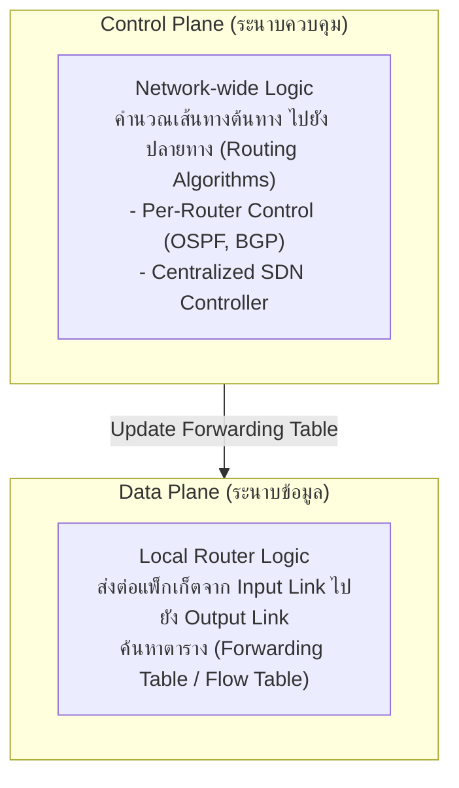
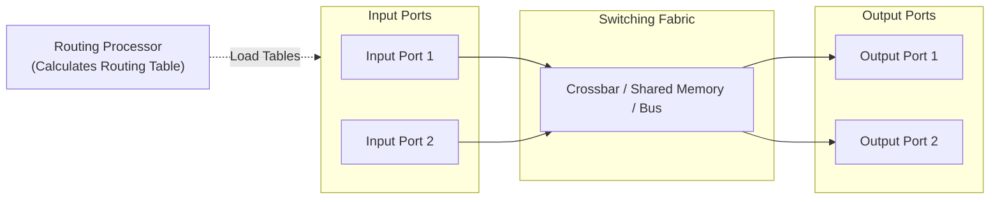
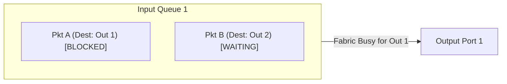
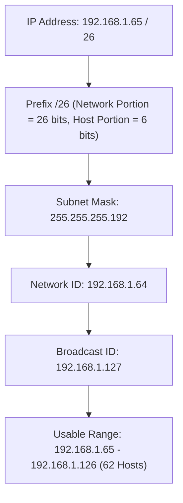
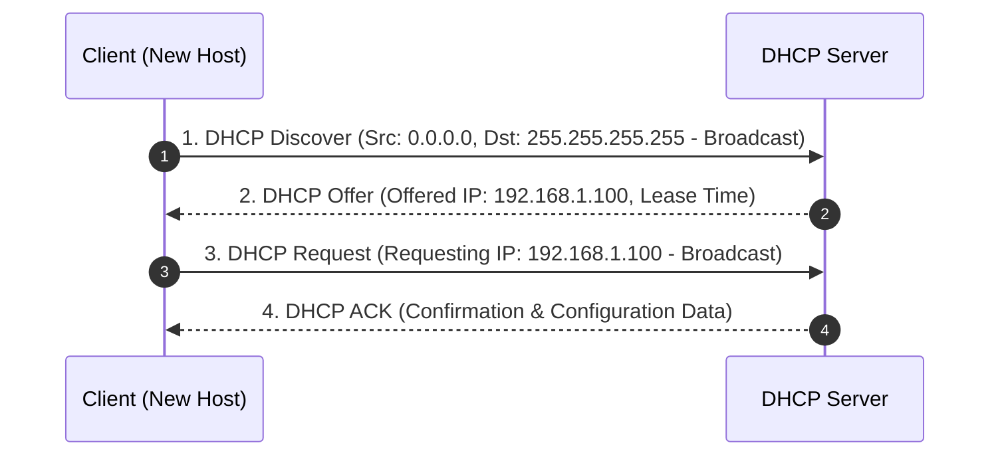
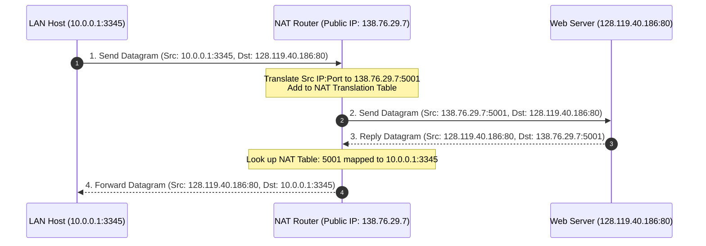
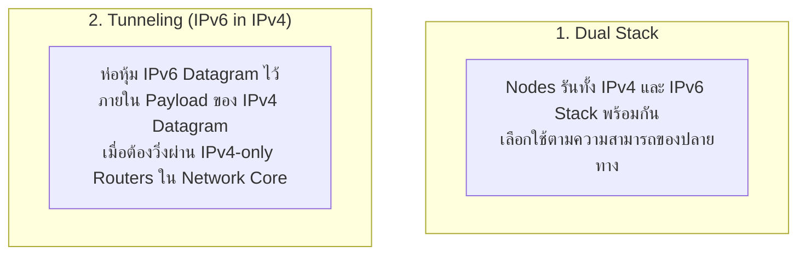
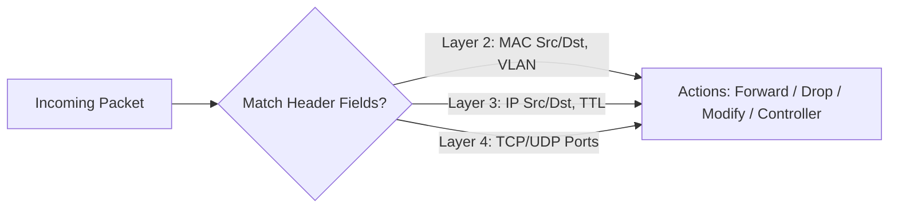

---
tags:
  - networking
  - chapter4
  - network-layer
  - data-plane
  - ipv4
  - ipv6
  - subnetting
  - sdn
created: 2026-08-03
updated: 2026-08-03
type: wiki-note
---

# Chapter 4: Network Layer - Data Plane

> [!SUMMARY] ภาพรวมประจำบท
> โน้ตความรู้บทที่ 4 เจาะลึกเลเยอร์เครือข่ายส่วน Data Plane (ระนาบข้อมูล) ทำหน้าที่ส่งต่อแพ็กเก็ตภายในเราเตอร์ (Per-router Forwarding) ครอบคลุมการเปรียบเทียบระหว่าง Data Plane และ Control Plane, สถาปัตยกรรมภายในเราเตอร์ (Input Ports, Switching Fabrics, Output Ports, HOL Blocking), โครงสร้าง IPv4 Header, กลไก IP Fragmentation & Reassembly, ที่อยู่ IPv4 และแนวคิด CIDR/Subnetting, การแจก IP ด้วย DHCP, การแปลงที่อยู่ด้วย NAT, สถาปัตยกรรม IPv6 และกลไกการเปลี่ยนผ่าน (Dual Stack/Tunneling), รวมถึง Generalized Forwarding ด้วย OpenFlow (SDN Match-Action)

---

## 1. ภาพรวมของ Network Layer: Data Plane vs Control Plane

Network Layer มีบทบาทสำคัญในการส่งแพ็กเก็ตจากโฮสต์ต้นทางไปยังโฮสต์ปลายทาง ผ่านเราเตอร์หลายตัว โดยแบ่งการทำงานออกเป็น 2 ระนาบ (Planes):



- **Forwarding (Data Plane):** การกระทำในระดับท้องถิ่น (Local Action) ของเราเตอร์แต่ละตัว ในการย้ายแพ็กเก็ตจากอินพุตพอร์ตไปยังเอาต์พุตพอร์ต โดยใช้เวลาในระดับ **Nanoseconds**
- **Routing (Control Plane):** กระบวนการในระดับภาพรวมเครือข่าย (Network-wide Process) เพื่อเลือกเส้นทางที่เหมาะสมที่สุดที่แพ็กเก็ตจะวิ่งผ่าน โดยใช้เวลาในระดับ **Milliseconds**

---

## 2. สถาปัตยกรรมภายในเราเตอร์ (Router Architecture)

องค์ประกอบหลัก 4 ส่วนภายในเราเตอร์สมรรถนะสูง:



1. **Input Ports:**
   - **Physical & Data Link Layer Processing:** แปลงสัญญาณกายภาพและถอดรหัสเฟรม (Decapsulation)
   - **Lookup Function:** ค้นหาตารางเพื่อตัดสินใจว่าแพ็กเก็ตจะถูกส่งไปที่ Output Port ใด โดยใช้หลักการ **Longest Prefix Matching**
2. **Switching Fabric:** โครงข่ายสวิตชิ่งย้ายแพ็กเก็ตจาก Input Port ไปยัง Output Port มี 3 รูปแบบหลัก:
   - *Memory:* ย้ายแพ็กเก็ตผ่าน CPU และ System Memory (ความเร็วจำกัดโดย Memory Bandwidth)
   - *Bus:* ย้ายแพ็กเก็ตผ่าน Shared Bus (เกิดการแย่งชิง Bus)
   - *Crossbar (Interconnection Network):* โครงข่ายตาข่ายที่สวิตช์แพ็กเก็ตแบบขนานได้หลายคู่พร้อมกัน
3. **Output Ports:** จัดเก็บบัฟเฟอร์แพ็กเก็ต (Queuing) ทำการคัดเลือกคิว (Scheduling เช่น FIFO, Priority Queue, Weighted Fair Queueing WFQ) และใส่ Frame Header ส่งออกไป
4. **Routing Processor:** ทำหน้าที่ประมวลผลโปรโตคอลการเลือกเส้นทาง (Control Plane) และสร้างตาราง Forwarding Table

---

> [!WARNING] ปัญหา Head-of-Line (HOL) Blocking
> **HOL Blocking** เกิดขึ้นที่ Input Queue เมื่อแพ็กเก็ตที่อยู่ **หัวคิว** กำลังรอส่งไปยัง Output Port ที่ติดภารกิจ (Blocked) ส่งผลให้แพ็กเก็ตตัวถัดๆ ไปในคิวเดียวกันต้องถูกบล็อกตามไปด้วย แม้ว่า Output Port ของแพ็กเก็ตเหล่านั้นจะว่างอยู่ก็ตาม!



---

## 3. อินเทอร์เน็ตโปรโตคอล IPv4 (Internet Protocol v4)

### 3.1 โครงสร้าง IPv4 Datagram Header

```bitfield
0                   15 16                   31
+----+----+--------+---+---------------------+
|Ver |HLEN|  TOS   |    Total Length (16)    |
+----+----+--------+---+---------------------+
|   Identification (16)|Flg| Fragment Offset(13)|
+---------+--------+---+---------------------+
| TTL (8) |Protocol|   Header Checksum (16)  |
+---------+--------+-------------------------+
|             Source IP Address (32)         |
+--------------------------------------------+
|           Destination IP Address (32)      |
+--------------------------------------------+
|             Options (If any)               |
+--------------------------------------------+
|                 Payload Data               |
+--------------------------------------------+
```

- **HLEN (Header Length):** ขนาดของ Header (มีหน่วยเป็นคำ 4-byte โดยทั่วไปมีค่า 5 = 20 Bytes)
- **TTL (Time to Live):** ตัวนับอายุแพ็กเก็ต จะถูกลดค่าลง 1 ทุกครั้งที่ผ่านเราเตอร์ 1 ตัว (หาก TTL = 0 แพ็กเก็ตจะถูกทิ้งและส่ง ICMP Time Exceeded กลับ)
- **Protocol:** ระบุโปรโตคอลเลเยอร์บน (เช่น `6` = TCP, `17` = UDP, `1` = ICMP)

---

### 3.2 กลไกการย่อยแพ็กเก็ต (IPv4 Fragmentation and Reassembly)
เมื่อขนาด IP Datagram ใหญ่กว่าค่า **MTU (Maximum Transmission Unit)** ของลิงก์ถัดไป เราเตอร์จะทำการย่อยแพ็กเก็ตออกเป็นชิ้นเล็กๆ (Fragments) และจะถูกนำมารวมกลับคืน (Reassembly) **เฉพาะที่เครื่องโฮสต์ปลายทางเท่านั้น!**

- **Identification (16-bit):** ระบุว่าซอยมาจากแพ็กเก็ตดั้งเดิมเดียวกัน
- **Flags:**
  - `DF` (Don't Fragment): หากตั้งเป็น 1 ห้ามย่อยแพ็กเก็ต (ถ้าเกิน MTU ให้ทิ้งและตอบ ICMP)
  - `MF` (More Fragments): หากเป็น 1 แสดงว่ายังมีชิ้นส่วนถัดไป หากเป็น 0 แสดงว่าเป็นชิ้นส่วนสุดท้าย
- **Fragment Offset (13-bit):** ตำแหน่งเริ่มต้นของข้อมูลในชิ้นส่วนนั้น **มีหน่วยเป็น 8-byte units** (Offset = Byte Start / 8)

---

> [!EXAMPLE] ตัวอย่างการคำนวณ IP Fragmentation Step-by-Step
> **โจทย์:** แพ็กเก็ตขนาด **4,000 Bytes** (Header 20 Bytes, Data 3,980 Bytes) ต้องส่งผ่านลิงก์ที่มี **MTU = 1,500 Bytes**
>
> **วิธีทำ:**
> 1. แต่ละ Fragment ใส่ข้อมูลสูงสุดได้ = $1500 - 20 = 1,480\text{ Bytes}$ (ต้องหารด้วย 8 ลงตัว: $1,480 / 8 = 185$)
> 2. **Frag 1:** Data 1,480 Bytes (Bytes 0 - 1479)
>    - `Total Length` = 1500, `ID` = x, `MF` = 1, `Offset` = $0 / 8 = \mathbf{0}$
> 3. **Frag 2:** Data 1,480 Bytes (Bytes 1480 - 2959)
>    - `Total Length` = 1500, `ID` = x, `MF` = 1, `Offset` = $1480 / 8 = \mathbf{185}$
> 4. **Frag 3:** Data ข้อมูลที่เหลือ $= 3980 - (1480 + 1480) = 1,020\text{ Bytes}$ (Bytes 2960 - 3979)
>    - `Total Length` = $1020 + 20 = 1040$, `ID` = x, `MF` = 0, `Offset` = $2960 / 8 = \mathbf{370}$

---

## 4. การจัดสรรที่อยู่ IPv4 (IPv4 Addressing & CIDR)

IPv4 มีขนาด 32 บิต (4 Bytes) เขียนในรูปแบบ Dotted-Decimal Notation (เช่น `192.168.1.1`)

### 4.1 แนวคิด CIDR (Classless Inter-Domain Routing)
CIDR ยกเลิกการแบ่งคลาส A, B, C แบบเดิม แล้วใช้สัญลักษณ์ Prefix `/y` ระบุว่า **$y$ บิตแรกคือ Network Portion** ส่วนที่เหลือคือ Host Portion

- **Subnet Mask:** บิต 1 จำนวน $y$ บิต ตามด้วยบิต 0
- **Network Address (Subnet ID):** บิตฝั่ง Host ทั้งหมดเป็น `0`
- **Broadcast Address:** บิตฝั่ง Host ทั้งหมดเป็น `1`
- **Usable Host IP Range:** ตั้งแต่ `Subnet ID + 1` ถึง `Broadcast ID - 1`
- **จำนวน Usable Hosts สุทธิ:** $2^{(32 - y)} - 2$



---

### 4.2 โปรโตคอล DHCP (Dynamic Host Configuration Protocol)
DHCP ทำหน้าที่แจกจ่าย IP Address, Subnet Mask, Default Gateway, และ DNS Server ให้กับเครื่อง Client แบบอัตโนมัติ (Plug-and-Play) ผ่านกระบวนการ **DDI (4-Step Process)** บน UDP Port 67 (Server) / 68 (Client)



---

### 4.3 การแปลงที่อยู่ NAT (Network Address Translation)
NAT ช่วยแก้ปัญหา IPv4 ขาดแคลน โดยยอมให้เครื่องในเครือข่ายส่วนบุคคล (Private Network) หลายเครื่องแชร์การใช้ออกอินเทอร์เน็ตด้วย **Public IP Address เพียงหมายเลขเดียว**

- **ช่วง Private IP Address (RFC 1918):**
  - `10.0.0.0` ถึง `10.255.255.255` (`10.0.0.0/8`)
  - `172.16.0.0` ถึง `172.31.255.255` (`172.16.0.0/12`)
  - `192.168.0.0` ถึง `192.168.255.255` (`192.168.0.0/16`)



---

## 5. อินเทอร์เน็ตโปรโตคอล IPv6 (IPv6 Protocol)

IPv6 ถูกออกแบบขึ้นเพื่อแก้ปัญหาที่อยู่อิเล็กทรอนิกส์ IPv4 หมดลง โดยเพิ่มขนาด IP Address เป็น **128 บิต**

### 5.1 จุดเด่นและโครงสร้าง Header ของ IPv6
- **Fixed Header Length 40 Bytes:** ขนาดคงที่ช่วยให้เราเตอร์ประมวลผลได้รวดเร็วขึ้น
- **ไม่มี Header Checksum:** ตัดออกเพื่อความเร็วในการส่งต่อ (ให้ L2/L4 ตรวจแทน)
- **ไม่มี Hop-by-Hop Fragmentation:** เครื่องฝั่งส่งต้องทำ Path MTU Discovery เอง

```bitfield
0                   15 16                   31
+----+--------+------------------------------+
|Ver | Traffic C |         Flow Label (20)     |
+----+--------+------------------------------+
|  Payload Length (16)  | NextHdr(8)|HopLmt(8)|
+-----------------------+-----------+--------+
|                                            |
|          Source IP Address (128-bit)       |
|                                            |
+--------------------------------------------+
|                                            |
|       Destination IP Address (128-bit)     |
|                                            |
+--------------------------------------------+
```

---

### 5.2 กลไกการเปลี่ยนผ่านจาก IPv4 ไปยัง IPv6



---

## 6. Generalized Forwarding และ SDN (OpenFlow Match-Action)

ในสถาปัตยกรรม **Software-Defined Networking (SDN)** การส่งต่อข้อมูลไม่ได้จำกัดอยู่แค่การดู Destination IP เท่านั้น แต่ใช้หลักการ **Generalized Forwarding** ผ่านตาราง **Flow Table (Match-Action Table)**



- **Pattern Matching:** สามารถจับคู่ Header Fields ข้ามหลายเลเยอร์ (MAC, IP, Port, VLAN)
- **Counters:** บันทึกจำนวนแพ็กเก็ตและไบต์ที่จับคู่ตรง
- **Actions:**
  - `Forward`: ส่งออกไปตามพอร์ตที่กำหนด
  - `Drop`: ทิ้งแพ็กเก็ต (ทำหน้าที่เป็น Firewall)
  - `Modify-Field`: แก้ไขค่าใน Header (ทำหน้าที่เป็น NAT หรือ Rewrite VLAN)
  - `Send-to-Controller`: ส่งแพ็กเก็ตไปให้ SDN Controller ประมวลผล

---

## 📚 อ้างอิงและโน้ตที่เกี่ยวข้อง
- 🔹 **[[Chapter 1 - Computer Networks and the Internet]]** - โครงสร้าง Network Core และ Packet Switching
- 🔹 **[[Chapter 5 - Network Control Plane]]** - อัลกอริทึม Routing และ SDN Controller
- 🔹 **[[Chapter 8 - IP Addressing, Subnetting and VLSM]]** - เวิร์กช็อปคำนวณ Subnetting เชิงลึก
- 🔹 **[[Chapter 10 - Homework and Quiz Solution Guide]]** - แบบฝึกหัดคำนวณ IP Fragmentation และ NAT Table
