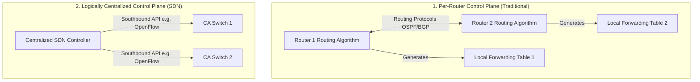
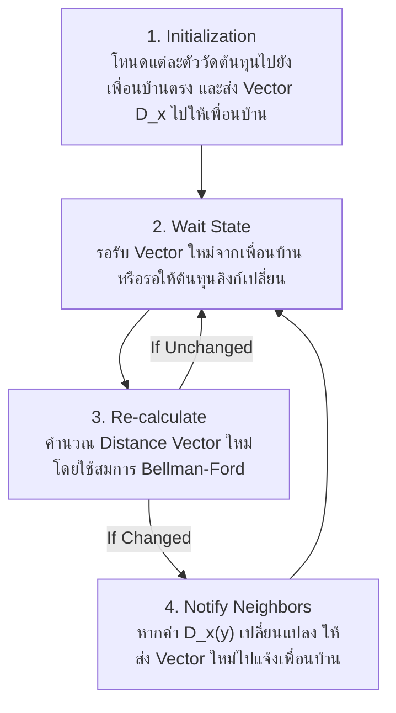
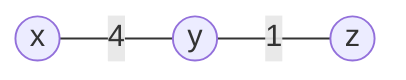
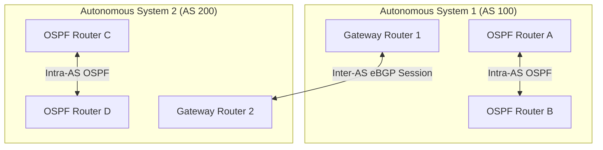
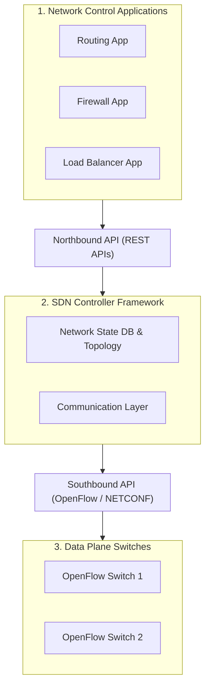

---
tags:
  - networking
  - chapter5
  - network-layer
  - control-plane
  - routing-algorithms
  - dijkstra
  - distance-vector
  - bgp
  - ospf
  - icmp
created: 2026-08-03
updated: 2026-08-03
type: wiki-note
---

# Chapter 5: Network Control Plane

> [!SUMMARY] ภาพรวมประจำบท
> โน้ตความรู้บทที่ 5 เจาะลึกเลเยอร์เครือข่ายส่วน Control Plane (ระนาบควบคุม) ซึ่งรับผิดชอบในการคำนวณและเลือกเส้นทาง (Routing Algorithms) ครอบคลุมการแบ่งประเภทอัลกอริทึม, อัลกอริทึม Link-State (Dijkstra's Algorithm) พร้อม Trace Table, อัลกอริทึม Distance-Vector (Bellman-Ford Equation) ปัญหา Count-to-Infinity และวิธีแก้ด้วย Poisoned Reverse, โปรโตคอลภายในเขตปกครอง Intra-AS (OSPF), โปรโตคอลระหว่างเขตปกครอง Inter-AS (BGP-4), สถาปัตยกรรม SDN Controller, โปรโตคอล ICMP (Ping/Traceroute), และระบบบริหารจัดการเครือข่าย SNMP

---

## 1. ภาพรวมของ Network Control Plane

Control Plane ทำหน้าที่ตัดสินใจว่าแพ็กเก็ตจะถูกส่งผ่านเส้นทางใด (Route Discovery) จากต้นทางไปยังปลายทางทั่วทั้งเครือข่าย โดยแบ่งออกเป็น 2 สถาปัตยกรรมหลัก:



1. **Per-Router Control (Traditional):** องค์ประกอบการเลือกเส้นทางรันอยู่บนเราเตอร์ทุกตัว และแลกเปลี่ยนข้อมูลผ่านโปรโตคอลการเลือกเส้นทาง (เช่น OSPF, BGP) เพื่อสร้างตาราง Forwarding Table ของตนเอง
2. **Logically Centralized Control (SDN):** มี **SDN Controller** ส่วนกลางคอยคำนวณตาราง Flow Table และติดตั้งลงในสวิตช์แต่ละตัวผ่าน Southbound API (เช่น OpenFlow)

---

## 2. ประเภทของอัลกอริทึมการเลือกเส้นทาง (Routing Algorithms Classification)

1. **Global vs Decentralized:**
   - **Global (Link-State - LS):** เราเตอร์ทุกตัวมีข้อมูลโครงสร้างและต้นทุนลิงก์ของทั้งเครือข่าย (Complete Topology Info)
   - **Decentralized (Distance-Vector - DV):** เราเตอร์แต่ละตัวรู้เฉพาะต้นทุนลิงก์ของเพื่อนบ้านที่เชื่อมตรง (Neighbors) และแลกเปลี่ยนข้อมูลเฉพาะกับเพื่อนบ้านเพื่อประมวลผลแบบกระจาย
2. **Static vs Dynamic:**
   - **Static:** เปลี่ยนแปลงเส้นทางตามการตั้งค่าด้วยมือของผู้ดูแลระบบ (Manual Configuration)
   - **Dynamic:** ปรับเปลี่ยนเส้นทางโดยอัตโนมัติตามการเปลี่ยนแปลงของโทโพโลยีหรือสภาวะความคับคั่งในเครือข่าย

---

## 3. อัลกอริทึม Link-State (Dijkstra's Algorithm)

**Dijkstra's Algorithm** คำนวณหาเส้นทางที่มีต้นทุนต่ำที่สุด (Least-Cost Path) จากโฮสต์ต้นทาง $u$ ไปยังโฮสต์อื่นๆ ทั้งหมดในเครือข่าย

### 3.1 สัญลักษณ์และสูตรคำนวณ
- $c(x,y)$: ต้นทุนลิงก์ตรงจาก $x$ ไป $y$ (ถ้าไม่เชื่อมตรงกัน $c(x,y) = \infty$)
- $D(v)$: ค่าต้นทุนปัจจุบันของเส้นทางจากโฮสต์ต้นทาง $u$ ไปยังปลายทาง $v$
- $p(v)$: โหนดก่อนหน้า (Predecessor) บนเส้นทางจากต้นทางไปยัง $v$
- $N'$: เซตของโหนดที่ทราบเส้นทางที่มีต้นทุนต่ำที่สุดอย่างแน่นอนแล้ว

---

> [!EXAMPLE] ตัวอย่างการคำนวณ Dijkstra's Algorithm Step-by-Step
> **กราฟเครือข่าย:** โหนดต้นทางคือ **$u$**
> - ลิงก์ $u-v=2$, $u-w=5$, $u-x=1$
> - ลิงก์ $x-v=2$, $x-w=3$, $x-y=1$
> - ลิงก์ $v-w=3$, $v-y=1$
> - ลิงก์ $w-y=1$, $w-z=5$, $y-z=2$

```mermaid
graph LR
    u ((u)) ---|2| v ((v))
    u ---|5| w ((w))
    u ---|1| x ((x))
    x ---|2| v
    x ---|3| w
    x ---|1| y ((y))
    v ---|3| w
    v ---|1| y
    w ---|1| y
    w ---|5| z ((z))
    y ---|2| z
```

#### Trace Table แสดงการทำงานทีละขั้นตอน:

| Step | $N'$ (Visited Set) | $D(v), p(v)$ | $D(w), p(w)$ | $D(x), p(x)$ | $D(y), p(y)$ | $D(z), p(z)$ |
| :---: | :--- | :---: | :---: | :---: | :---: | :---: |
| **0** | $\{u\}$ | $2, u$ | $5, u$ | **$1, u$** | $\infty$ | $\infty$ |
| **1** | $\{u, x\}$ | $2, u$ | $4, x$ | - | **$2, x$** | $\infty$ |
| **2** | $\{u, x, y\}$ | **$2, u$** | $3, y$ | - | - | $4, y$ |
| **3** | $\{u, x, y, v\}$ | - | **$3, y$** | - | - | $4, y$ |
| **4** | $\{u, x, y, v, w\}$ | - | - | - | - | **$4, y$** |
| **5** | $\{u, x, y, v, w, z\}$ | - | - | - | - | - |

**ผลลัพธ์เส้นทางสั้นที่สุดจาก $u$ ไปยังทุกโหนด:**
- ไปยัง $x$: $u \to x$ (Cost 1)
- ไปยัง $v$: $u \to v$ (Cost 2)
- ไปยัง $y$: $u \to x \to y$ (Cost 2)
- ไปยัง $w$: $u \to x \to y \to w$ (Cost 3)
- ไปยัง $z$: $u \to x \to y \to z$ (Cost 4)

- **ความซับซ้อน (Complexity):** $O(N^2)$ หรือ $O(N \log N)$ เมื่อใช้ Min-Heap

---

## 4. อัลกอริทึม Distance-Vector (DV Routing Algorithm)

Distance-Vector เป็นอัลกอริทึมแบบ **Iterative**, **Asynchronous**, และ **Distributed** อาศัยสมการของ **Bellman-Ford Optimality Principle**

### 4.1 สมการ Bellman-Ford
$$d_x(y) = \min_v \{ c(x,v) + d_v(y) \}$$
*โดยที่ $\min_v$ คำนวณครอบคลุมทุกโหนดเพื่อนบ้าน $v$ ที่เชื่อมต่อตรงกับ $x$*



---

### 4.2 ปัญหา Count-to-Infinity และวิธีแก้ด้วย Poisoned Reverse
เมื่อต้นทุนลิงก์แย่ลง (Link Cost Increases) อัลกอริทึม DV อาจเกิดวนลูปคำนวณผิดพลาดเรียกว่าปัญหา **Count-to-Infinity**



- **เหตุการณ์:** หากลิงก์ระหว่าง $x$ และ $y$ เพิ่มต้นทุนจาก 4 เป็น 60
- $y$ จะคิดว่า $z$ มีเส้นทางไป $x$ ด้วย cost 5 ($y \to z \to y \to x$) ทำให้ $y$ อัปเดต cost ไป $x = 1 + 5 = 6$
- $z$ ก็จะอัปเดตตามเป็น $7 \dots$ วนรอบเพิ่มขึ้นเรื่อยๆ จนถึง 60!
- **Poisoned Reverse Solution:**
  - หากโหนด $z$ ส่งข้อมูลไปยัง $x$ โดยพึ่งพาการวิ่งผ่าน $y$ โหนด $z$ จะหลอกแจ้ง $y$ ว่า $D_z(x) = \infty$ (เพื่อไม่ให้ $y$ แอบเลือกเส้นทางย้อนกลับมาที่ $z$)

---

### 4.3 เปรียบเทียบ Link-State (LS) และ Distance-Vector (DV)

| ประเด็นเปรียบเทียบ | Link-State (LS) | Distance-Vector (DV) |
| :--- | :--- | :--- |
| **ความซับซ้อนของข้อความ** | สูง ($O(N \cdot E)$ messages) กระจายข้อมูลทั้งเครือข่าย | ต่ำ ส่งข้อความแลกเปลี่ยนเฉพาะกับเพื่อนบ้านตรงเท่านั้น |
| **ความเร็วในการลู่เข้า (Convergence)** | รวดเร็ว ($O(N^2)$ time) ไม่มีปัญหาลูป | ช้า อาจเกิดปัญหา Count-to-Infinity เมื่อลิงก์เสีย |
| **ความทนทานต่อข้อผิดพลาด (Robustness)** | สูง หากโหนดประกาศผิดพลาด จะส่งผลเฉพาะโหนดนั้น | ต่ำ หากโหนดประกาศ $D_x(y)$ ผิด จะส่งผลลบกระจายไปทั่ว |

---

## 5. โปรโตคอลการเลือกเส้นทางระดับองค์กร (Intra-AS & Inter-AS Routing)

อินเทอร์เน็ตแบ่งโครงข่ายออกเป็น **Autonomous Systems (AS)** หรือเขตปกครองเพื่อความสะดวกในการบริหารจัดการ



### 5.1 Intra-AS Routing: OSPF (Open Shortest Path First)
- ใช้รันภายใน AS เดียวกัน
- ใช้เปิดทำงานบนอัลกอริทึม **Link-State (Dijkstra)**
- มีความปลอดภัยด้วยการรับรองรหัสผ่าน (Authentication) และรองรับ **Hierarchical OSPF** (แบ่งเป็น Area 0 Backbone และ Local Areas)

---

### 5.2 Inter-AS Routing: BGP-4 (Border Gateway Protocol)
BGP คือ "กาวเชื่อมอินเทอร์เน็ต" ทำหน้าที่ส่งผ่านข้อมูลเส้นทางระหว่างต่าง AS กัน โดยเป็นโปรโตคอลประเภท **Path Vector**

- **eBGP (External BGP):** แลกเปลี่ยนข้อมูลเส้นทางระหว่าง Gateway Routers ต่าง AS กัน
- **iBGP (Internal BGP):** กระจายข้อมูลเส้นทาง BGP ที่ได้รับมาให้เราเตอร์ภายใน AS เดียวกัน
- **BGP Attributes:**
  - `AS-PATH`: รายชื่อเลข AS ที่แพ็กเก็ตต้องวิ่งผ่าน (ใช้ป้องกันการเกิด Loop)
  - `NEXT-HOP`: หมายเลข IP ของเราเตอร์อินเทอร์เฟซที่จะต้องส่งต่อออกไป
- **BGP Route Selection Rules (ลำดับการเลือกเส้นทาง):**
  1. ค่า **Local Preference** สูงสุด (ตั้งค่าโดยผู้ดูแลระบบตามนโยบายธุรกิจ)
  2. สั้นที่สุดใน **AS-PATH** (ผ่านจำนวน AS น้อยที่สุด)
  3. ค่า **MED (Multi-Exit Discriminator)** ต่ำสุด
  4. ใกล้ที่สุดผ่าน **Hot Potato Routing** (ส่งออกผ่านประตู Gateway ที่ใกล้ที่สุดใน Intra-AS)

---

## 6. สถาปัตยกรรม SDN Control Plane (Software-Defined Networking)

SDN แยกส่วนสมอง (Control Plane) ออกจากตัวอุปกรณ์กายภาพ (Data Plane Switches)



---

## 7. โปรโตคอล ICMP (Internet Control Message Protocol)

ICMP (RFC 792) ทำหน้าที่รายงานข้อผิดพลาดและส่งข้อมูลวินิจฉัยในระดับ Network Layer โดยถูกห่อหุ้มอยู่ภายใน IP Datagram

| ICMP Type | Code | ความหมาย (Description) | ตัวอย่างการใช้งาน |
| :---: | :---: | :--- | :--- |
| **0** | 0 | Echo Reply (ตอบกลับ Ping) | `ping` command |
| **3** | 0 | Destination Network Unreachable | ไม่พบเครือข่ายปลายทาง |
| **3** | 3 | Destination Port Unreachable | ไม่พบพอร์ตปลายทาง |
| **8** | 0 | Echo Request (คำขอ Ping) | `ping` command |
| **11** | 0 | TTL Expired in Transit | แพ็กเก็ตหมดอายุ (`traceroute`) |

> [!EXAMPLE] กลไกการทำงานของ Traceroute ผ่าน ICMP
> 1. เครื่องต้นทางส่ง IP Datagram ไปยังปลายทางโดยเริ่มตั้งค่า **TTL = 1**
> 2. เมื่อเราเตอร์ตัวแรก ($R_1$) รับแพ็กเก็ต จะลด TTL เหลือ 0 จึงทิ้งแพ็กเก็ตและส่ง **ICMP Type 11 Code 0 (Time Exceeded)** กลับมา ต้นทางจึงบันทึก RTT ของ $R_1$
> 3. ต้นทางส่งแพ็กเก็ตใหม่โดยเพิ่ม **TTL = 2** เพื่อรับการตอบกลับจาก $R_2 \dots$ ทำซ้ำเรื่อยๆ จนกระทั่งถึงปลายทาง ซึ่งจะตอบกลับด้วย **ICMP Type 3 Code 3 (Port Unreachable)** แสดงว่าถึงปลายทางแล้ว!

---

## 8. ระบบบริหารจัดการเครือข่าย และ SNMP (Network Management & SNMP)

**SNMP (Simple Network Management Protocol)** เป็นโปรโตคอลประยุกต์ใช้งานสำหรับติดตามและควบคุมอุปกรณ์เครือข่าย (Routers, Switches, Servers)

- **Managing Server:** เครื่องศูนย์ควบคุมที่รันซอฟต์แวร์บริหารจัดการ (NMS)
- **Managed Device & Agent:** อุปกรณ์ในเครือข่ายที่รันซอฟต์แวร์ Agent คอยเก็บบันทึกข้อมูลลงใน **MIB (Management Information Base)**
- **คำสั่ง SNMP:** `GetRequest`, `SetRequest`, `GetNextRequest`, และ `Trap` (ส่งการแจ้งเตือนฉุกเฉินจาก Agent ไปยัง Managing Server)

---

## 📚 อ้างอิงและโน้ตที่เกี่ยวข้อง
- 🔹 **[[Chapter 1 - Computer Networks and the Internet]]** - ภาพรวมโครงสร้าง ISPs และ Delay
- 🔹 **[[Chapter 4 - Network Data Plane]]** - สถาปัตยกรรมเราเตอร์ และ IPv4 Header (TTL)
- 🔹 **[[Chapter 10 - Homework and Quiz Solution Guide]]** - โจทย์คำนวณ Dijkstra Trace Table, Bellman-Ford, และ BGP Route Selection
