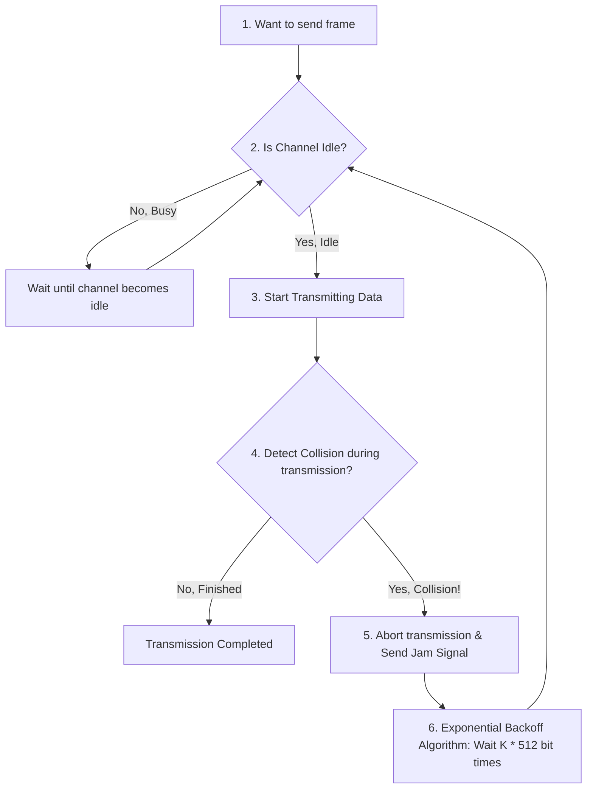
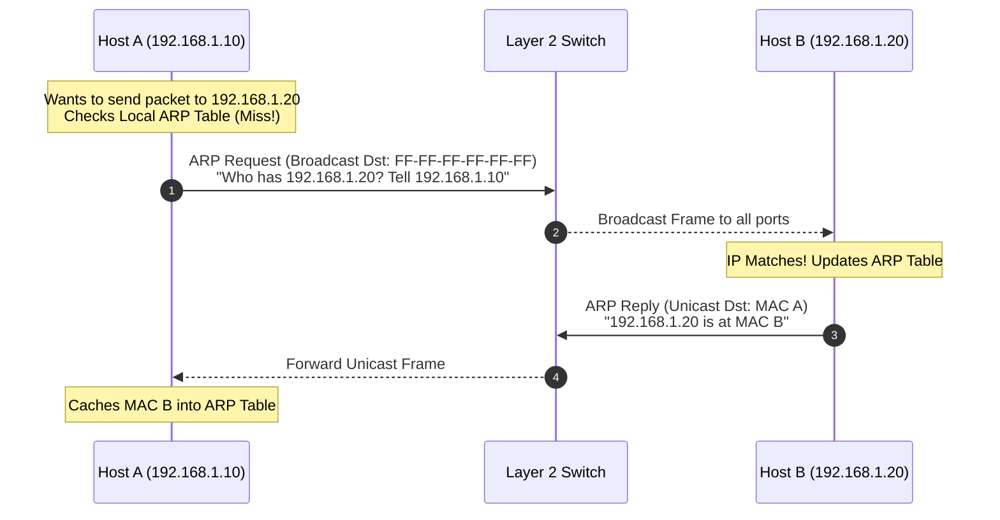
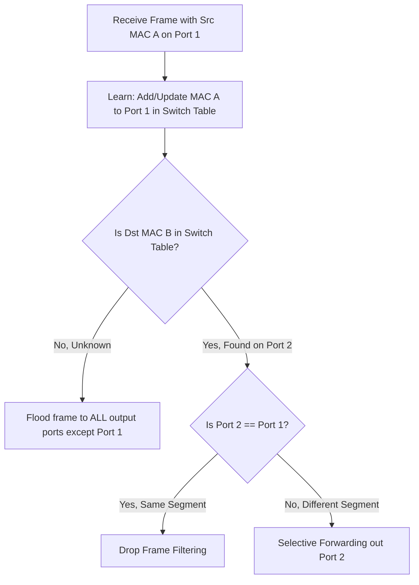
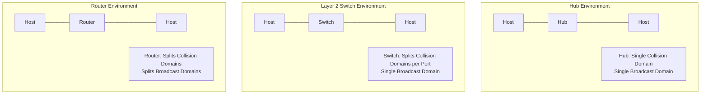
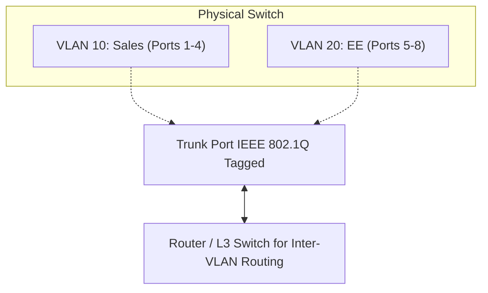

---
tags:
  - networking
  - chapter6
  - link-layer
  - ethernet
  - mac-address
  - arp
  - crc
  - csma-cd
  - switch
  - vlan
created: 2026-08-03
updated: 2026-08-03
type: wiki-note
---

# Chapter 6: Link Layer and LANs

> [!SUMMARY] ภาพรวมประจำบท
> โน้ตความรู้บทที่ 6 เจาะลึกเลเยอร์เชื่อมโยงข้อมูล (Link Layer) และเครือข่ายท้องถิ่น (LANs) ครอบคลุมการให้บริการ Framing, เทคนิคการตรวจจับและแก้ไขข้อผิดพลาด (Parity, Checksum, CRC Modulo-2 Division), โปรโตคอลการเข้าถึงสื่อร่วม (Multiple Access Protocols: ALOHA, CSMA/CD และ Binary Exponential Backoff), ที่อยู่ระดับกายภาพ (MAC Address), โปรโตคอล ARP, โครงสร้างเฟรม Ethernet (IEEE 802.3), สถาปัตยกรรมและการเรียนรู้ด้วยตนเองของ Layer 2 Switch, การแบ่ง Collision/Broadcast Domains, การตั้งค่า Virtual LANs (VLANs 802.1Q), และการสวิตช์ลาเบล MPLS

---

## 1. บริการของ Link Layer (Link Layer Services)

Link Layer ทำหน้าที่ส่งมอบเฟรมข้อมูล (Frames) ข้าม **Single Communication Link** ที่เชื่อมต่อโดยตรงระหว่าง 2 โหนดข้างเคียง (Node-to-Node Transfer)


- **Framing:** ห่อหุ้ม Network Datagram เข้าไปใน **Link Frame** โดยใส่ Header และ Trailer (MAC Addresses, Control Bits)
- **Link Access:** ควบคุมโปรโตคอล Medium Access Control (MAC) ในการส่งข้อมูลผ่านสื่อนำสัญญาณที่เป็นแบบ Shared Medium
- **Reliable Delivery:** การส่งข้อมูลอย่างน่าเชื่อถือในระดับลิงก์ (นิยมใช้ในลิงก์ที่มี Bit Error Rate สูง เช่น ไร้สาย Wi-Fi แต่ไม่นิยมใช้บนสายไฟเบอร์)
- **Error Detection & Correction:** ตรวจจับและแก้ไขบิตที่ผิดพลาดจากการรบกวนของสัญญาณ

---

## 2. เทคนิคการตรวจจับและแก้ไขข้อผิดพลาด (Error Detection & Correction)

### 2.1 Parity Bits และ 2D Parity
- **Single Parity Bit:** เพิ่มบิต Parity 1 บิต ไว้ท้ายคำข้อมูล สามารถตรวจจับ Bit Error จำนวน **คี่บิต** ได้เท่านั้น (หากผิดพร้อมกัน 2 บิตจะตรวจไม่ออก)
- **Two-Dimensional (2D) Parity:** จัดข้อมูลเป็นตารางแถวและคอลัมน์ สามารถ **ตรวจจับและแก้ไข (Detect & Correct)** ข้อผิดพลาดขนาด 1 บิต ได้โดยตรงที่จุดตัดของแถวและคอลัมน์ที่ผิดพลาด

```bitfield
Row Parity
1 0 1 0 1 | 1
1 1 1 1 0 | 0
0 1 1 1 0 | 1  <- Row with Error
-----------+--
0 0 1 0 1 | 0  <- Column with Error (Bit Correction at Intersection!)
```

---

### 2.2 Cyclic Redundancy Check (CRC)
CRC เป็นเทคนิคการตรวจจับข้อผิดพลาดที่มีประสิทธิภาพสูงมาก อาศัยการหารพหุนามด้วย **Modulo-2 Arithmetic** (ใช้การ XOR แทนการลบ)

#### ขั้นตอนการคำนวณ CRC:
1. กำหนดข้อมูล $D$ ขนาด $d$ บิต และพหุนามตัวหาร **Generator $G$** ขนาด $r+1$ บิต
2. ฝั่งส่งทำการเติมบิต 0 จำนวน $r$ บิต เข้าไปท้ายข้อมูล $D$ (กลายเป็น $D \cdot 2^r$)
3. นำ $D \cdot 2^r$ ไปหารด้วย $G$ ด้วยการตั้งหารแบบ Modulo-2 (XOR) เศษที่เหลือจากการหารคือ **Remainder $R$** (ขนาด $r$ บิต)
4. นำ $R$ ไปต่อท้ายข้อมูล $D$ กลายเป็นเฟรมที่จะส่งออกไป: $D \cdot 2^r + R$
5. ฝั่งรับนำเฟรมที่ได้รับมาหารด้วย $G$ หากเศษที่ได้เป็น **0 ทั้งหมด** แสดงว่าข้อมูลถูกต้อง!

---

> [!EXAMPLE] ตัวอย่างการคำนวณ CRC Modulo-2 Division Step-by-Step
> - **ข้อมูล $D$:** `101110` (6 บิต)
> - **Generator $G$:** `1001` (4 บิต $\implies r = 3$)
> - เติม `000` ท้าย $D$ ได้ตัวตั้ง: `101110000`
>
> **ตั้งหาร Modulo-2 (XOR):**
> $$\begin{array}{r@{\quad}l}
> 1001 \overline{) 101110000} & \\
> \underline{1001\phantom{00000}} & (\text{XOR}) \\
> 001010000 & \\
> \underline{\phantom{00}1001\phantom{000}} & (\text{XOR}) \\
> 000011000 & \\
> \underline{\phantom{00001}1001\phantom{0}} & (\text{XOR}) \\
> 000001010 & \\
> \underline{\phantom{000000}1001} & (\text{XOR}) \\
> \mathbf{011} & \leftarrow \text{Remainder } R = \mathbf{011}
> \end{array}$$
>
> **เฟรมที่ส่งออกไปจริงคือ:** `101110` + `011` = **`101110011`**

---

## 3. โปรโตคอลการเข้าถึงสื่อร่วม (Multiple Access Protocols)

เมื่ออุปกรณ์หลายตัวแชร์การใช้สื่อสัญญาณเดียวกัน (Shared Broadcast Channel) จำเป็นต้องมีโปรโตคอลเพื่อป้องกันสัญญาณชนกัน (Collisions)

```mermaid
mindmap
  root((Multiple Access<br/>Protocols))
    "1. Channel Partitioning"
      "TDMA (Time Division)"
      "FDMA (Frequency Division)"
      "CDMA (Code Division)"
    "2. Random Access"
      "Slotted ALOHA (Efficiency 37%)"
      "Pure ALOHA (Efficiency 18%)"
      "CSMA (Listen Before Talk)"
      "CSMA/CD (Ethernet - Collision Detect)"
      "CSMA/CA (Wi-Fi - Collision Avoidance)"
    "3. Taking-Turns"
      "Polling Protocol"
      "Token Passing Protocol"
```

---

### 3.1 CSMA/CD (Carrier Sense Multiple Access with Collision Detection)
ใช้ในสายสื่อสาร Ethernet แบบดั้งเดิม (Half-Duplex)



> [!DEFINITION] อัลกอริทึม Binary Exponential Backoff
> เมื่อเกิดการชนกันครั้งที่ $m$ อุปกรณ์จะสุ่มเลือกค่าคงที่ $K$ จากเซต:
> $$K \in \{0, 1, 2, \dots, 2^m - 1\} \quad (\text{โดยกำหนดค่า } m \le 10 \text{ สูงสุดไม่เกิน } 1023)$$
> แล้วรอเป็นเวลา $K \times 512 \text{ bit times}$ ก่อนจะพยายามส่งใหม่อีกครั้ง (การสุ่มช่วงกว้างขึ้นแบบ Exponential ช่วยลดโอกาสชนซ้ำ)

---

## 4. ที่อยู่ระดับกายภาพ และ ARP (MAC Address & ARP)

### 4.1 MAC Address (Media Access Control Address)
- มีขนาด **48 บิต** (6 Bytes) เขียนในรูปเลขฐานสิบหก 12 ตัว (เช่น `1A-2B-3C-4D-5E-6F`)
- ถูกฝังคงที่มาจากโรงงานใน ROM ของการ์ดเครือข่าย (NIC)
- **OUI (Organizationally Unique Identifier):** 24 บิตแรก ระบุรหัสประจำตัวผู้ผลิตอุปกรณ์

---

### 4.2 โปรโตคอล ARP (Address Resolution Protocol)
ARP ทำหน้าที่แปลงหมายเลข **IP Address (L3) ให้เป็น MAC Address (L2)** ภายใน Local Subnet เดียวกัน



---

## 5. อีเทอร์เน็ต (Ethernet - IEEE 802.3)

Ethernet เป็นเทคโนโลยี LAN แบบมีสายที่แพร่หลายที่สุด ให้บริการแบบ **Connectionless** และ **Unreliable** (ไม่มี ACK ใน Link Layer)

### 5.1 โครงสร้างเฟรม Ethernet (Ethernet Frame Layout)

```bitfield
0                   7 8                  15
+---------------------+---------------------+
|      Preamble (7 Bytes: 10101010...)      |
+-------------------------------------------+
| SFD (1 Byte:10101011)| Dst MAC (6 Bytes)  |
+-------------------------------------------+
|  Src MAC (6 Bytes)  | Type/Len (2 Bytes)  |
+-------------------------------------------+
|          Data Payload (46 - 1500 Bytes)   |
+-------------------------------------------+
|               CRC FCS (4 Bytes)           |
+-------------------------------------------+
```

- **Preamble (7 Bytes) + SFD (1 Byte):** ลำดับบิตสลับ 1/0 สำหรับซิงโครไนซ์นาฬิกา (Clock Alignment)
- **Type (2 Bytes):** ระบุโปรโตคอลเลเยอร์บน (เช่น `0x0800` = IPv4, `0x0806` = ARP, `0x86DD` = IPv6)
- **Padding:** หาก Data Payload เล็กกว่า 46 Bytes จะต้องเติมบิตขยะให้ได้ขนาดเฟรมขั้นต่ำ 64 Bytes

---

## 6. การทำงานของ Layer 2 Switch (Switches vs Routers)

**Layer 2 Switch** เป็นอุปกรณ์จัดเก็บและส่งต่อเฟรมข้อมูลแบบ Full-Duplex โดยใช้ **Self-Learning (Backward Learning) Algorithm** ในการสร้าง **Switch Table** `(MAC Address, Interface, Timestamp)`



---

### 6.2 เปรียบเทียบ Collision Domain และ Broadcast Domain



| อุปกรณ์ (Device) | แยก Collision Domain? | แยก Broadcast Domain? | Layer ที่ทำงาน |
| :--- | :---: | :---: | :---: |
| **Hub / Repeater** | ❌ No (1 Domain) | ❌ No (1 Domain) | Layer 1 (Physical) |
| **L2 Switch / Bridge** | ✅ Yes (ทุกพอร์ตแยกกัน) | ❌ No (ทั้งสวิตช์เป็น 1 Broadcast Domain)| Layer 2 (Data Link) |
| **Router / L3 Switch**| ✅ Yes | ✅ Yes (ทุกอินเทอร์เฟซแยกกัน)| Layer 3 (Network) |

---

## 7. เครือข่ายเสมือน VLANs (Virtual Local Area Networks)

VLAN ช่วยจำกัดขอบเขตของ Broadcast Domain ภายในสวิตช์กายภาพตัวเดียวกัน โดยแบ่งออกเป็นหลายๆ เครือข่ายตรรกะ



- **IEEE 802.1Q Frame Tagging:** แทรก **Tag Header ขนาด 4 Bytes** (ประกอบด้วย 12-bit VLAN ID) เข้าไปในเฟรม Ethernet เมื่อต้องส่งผ่านลิงก์ **Trunk Port** ระหว่างสวิตช์
- **Inter-VLAN Routing:** เฟรมข้าม VLAN จะต้องส่งขึ้นไปให้เราเตอร์หรือ Layer 3 Switch ทำการเลือกเส้นทางเสมอ

---

## 📚 อ้างอิงและโน้ตที่เกี่ยวข้อง
- 🔹 **[[Chapter 1 - Computer Networks and the Internet]]** - สื่อนำสัญญาณกายภาพ Physical Media
- 🔹 **[[Chapter 4 - Network Data Plane]]** - โครงสร้าง IPv4 และที่อยู่ IP
- 🔹 **[[Chapter 7 - Wireless and Mobile Networks]]** - โปรโตคอลไร้สาย CSMA/CA และ 802.11
- 🔹 **[[Chapter 10 - Homework and Quiz Solution Guide]]** - แบบฝึกหัดคำนวณ CRC Division และ Switch Self-Learning Trace
