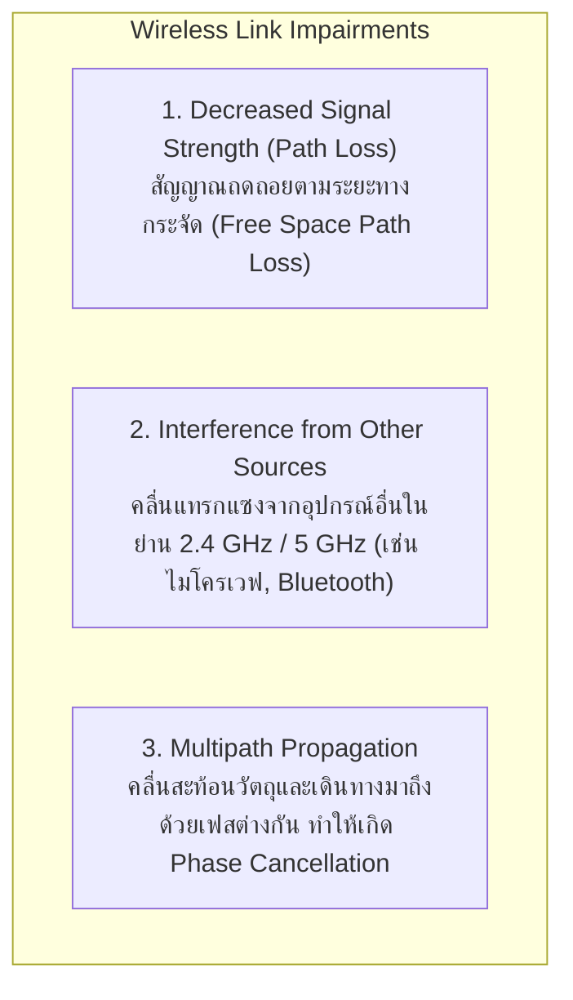
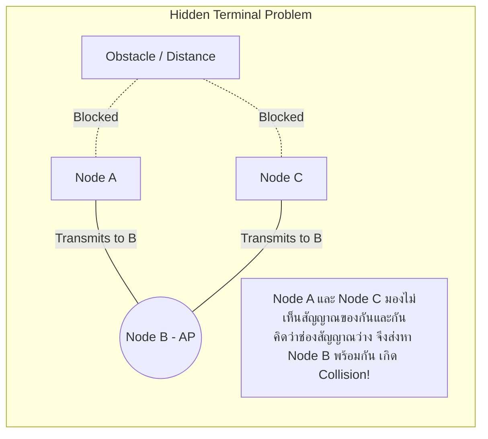
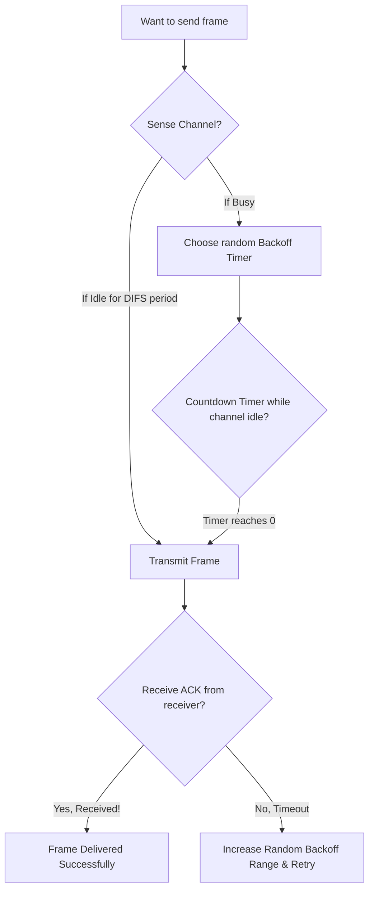
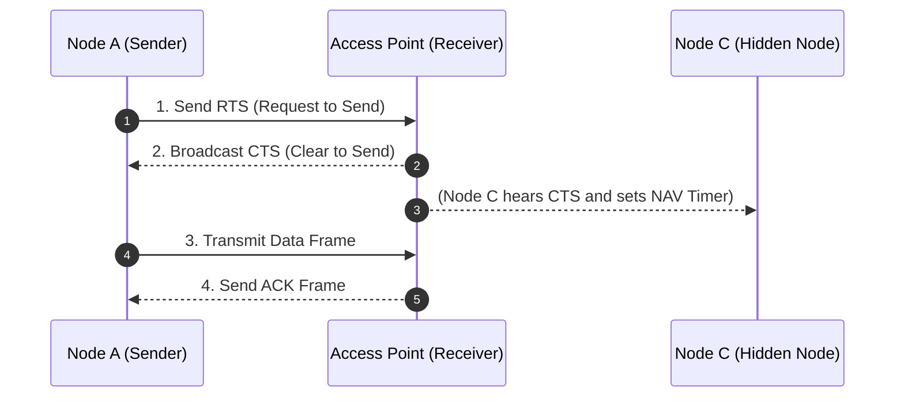
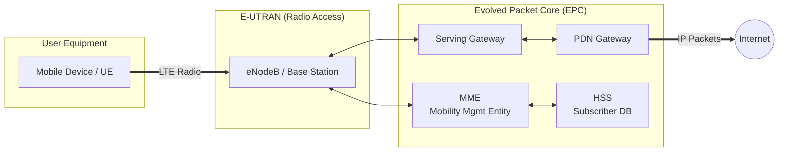
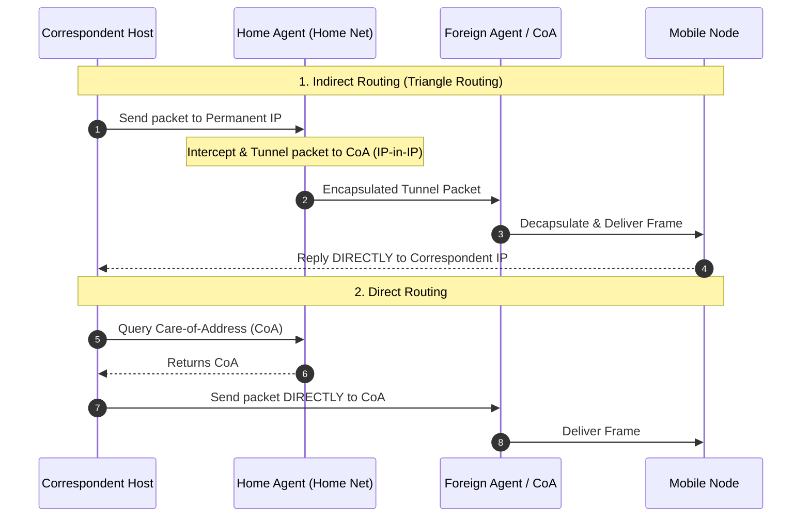

---
tags:
  - networking
  - chapter7
  - wireless
  - wifi
  - 802-11
  - csma-ca
  - rts-cts
  - cellular
  - 4g-lte
  - 5g
  - mobility
created: 2026-08-03
updated: 2026-08-03
type: wiki-note
---

# Chapter 7: Wireless and Mobile Networks

> [!SUMMARY] ภาพรวมประจำบท
> โน้ตความรู้บทที่ 7 เจาะลึกระบบเครือข่ายไร้สาย (Wireless Networks) และเครือข่ายเคลื่อนที่ (Mobile Networks) ครอบคลุมคุณลักษณะพิเศษของสื่อไร้สาย (Signal Attenuation, Interference, Multipath Propagation, Hidden/Exposed Terminal Problems), มาตรฐาน Wi-Fi (IEEE 802.11) และโปรโตคอล CSMA/CA (RTS/CTS Handshake), สถาปัตยกรรมโครงข่ายโทรศัพท์เคลื่อนที่ 4G LTE (EPC: eNodeB, MME, SGW, PGW) และ 5G NR (Network Slicing), รวมถึงการจัดการความคล่องตัวในการลงทะเบียนตำแหน่งและการส่งมอบสัญญาณ (Mobility Management, Mobile IP, Handoff)

---

## 1. คุณลักษณะพิเศษของสื่อนำสัญญาณไร้สาย (Wireless Link Characteristics)

แตกต่างจากสายสัญญาณกายภาพ สื่อไร้สายต้องเผชิญกับความท้าทายในระดับ Physical Layer หลายประการ:



### 1.1 ความสัมพันธ์ระหว่าง SNR และ BER (SNR vs BER Trade-off)
- **SNR (Signal-to-Noise Ratio):** อัตราส่วนความแรงสัญญาณต่อสัญญาณรบกวน (ยิ่ง SNR สูง สัญญาณยิ่งชัดเจน)
- **BER (Bit Error Rate):** อัตราความผิดพลาดของบิต
- **Adaptive Modulation:** อุปกรณ์ไร้สายจะปรับเปลี่ยนเทคนิคการมอดูเลตแบบไดนามิก:
  - เมื่อ SNR ต่ำ (อยู่ห่างจาก AP): เลือกใช้ **BPSK / QPSK** (ส่งข้อมูลได้ช้า แต่ BER ต่ำ ทนรบกวนได้ดี)
  - เมื่อ SNR สูง (อยู่ใกล้ AP): เลือกใช้ **64-QAM / 256-QAM** (ส่งข้อมูลได้รวดเร็วระดับหลายร้อย Mbps)

---

### 1.2 ปัญหา Hidden Terminal และ Exposed Terminal



---

## 2. เครือข่ายไร้สาย IEEE 802.11 (Wi-Fi)

### 2.1 สถาปัตยกรรม 802.11 LAN
- **BSS (Basic Service Set):** เซลล์การสื่อสารประกอบด้วย **Access Point (AP)** 1 ตัว และเครื่องลูกข่าย (Stations)
- **SSID (Service Set Identifier):** ชื่อระบุเครือข่ายไร้สาย (เช่น `KMUTNB_WiFi`)
- **Passive vs Active Scanning:**
  - *Passive Scanning:* เครื่อง Client คอยฟัง **Beacon Frames** ที่ AP กระจายออกมาตลอดเวลา
  - *Active Scanning:* เครื่อง Client กระจาย **Probe Request** ออกไป และรอคำตอบ **Probe Response** จาก AP

---

### 2.2 โปรโตคอล CSMA/CA (Collision Avoidance)
ทำไม Wi-Fi ถึงใช้ **CSMA/CD** แบบ Ethernet ไม่ได้?
1. การตรวจจับการชนกันขณะส่ง (Collision Detection) ทำได้ยากมากเพราะสัญญาณส่งออกของการ์ดไร้สายมีพลังงานสูงข่มสัญญาณรับเข้าที่แผ่วเบา
2. ปัญหา **Hidden Terminal** ทำให้ตรวจจับการชนกันฝั่งตรงข้ามไม่ได้



---

> [!DEFINITION] กลไก RTS/CTS Handshake (แก้ปัญหา Hidden Terminal)
> เพื่อป้องกันการชนกันของเฟรมข้อมูลขนาดใหญ่ เครื่องส่งจะขอจองช่องสัญญาณล่วงหน้าด้วยแพ็กเก็ตขนาดเล็ก:
> 1. **Sender $\to$ Receiver:** ส่ง **RTS (Request to Send)** ระบุระยะเวลาจอง
> 2. **Receiver $\to$ Broadcast:** ส่ง **CTS (Clear to Send)** ออกไปหาทุกคน
> 3. โหนดข้างเคียงทั้งหมดเมื่อยิน CTS จะยอมหยุดส่งข้อมูล (Virtual Carrier Sense ผ่านค่า NAV - Network Allocation Vector)



---

### 2.3 โครงสร้างเฟรม 802.11 (4 MAC Addresses)

```bitfield
0                   15 16                   31
+---------------------+---------------------+
| Frame Control (16)  |    Duration (16)    |
+---------------------+---------------------+
|         Address 1 (Receiver MAC)          |
+-------------------------------------------+
|        Address 2 (Transmitter MAC)        |
+-------------------------------------------+
|          Address 3 (Router MAC)           |
+---------------------+---------------------+
| Sequence Control(16)| Address 4 (Opt MESH)|
+---------------------+---------------------+
|                  Payload                  |
+-------------------------------------------+
```

- **Address 1:** MAC Address ของเครื่องรับสัญญาณไร้สาย (Wireless Receiver e.g., AP MAC)
- **Address 2:** MAC Address ของเครื่องส่งสัญญาณไร้สาย (Wireless Transmitter e.g., Client MAC)
- **Address 3:** MAC Address ของเราเตอร์ปลายทางในสาย LAN (Router Interface MAC)

---

## 3. เครือข่ายโทรศัพท์เคลื่อนที่ (Cellular Networks: 4G LTE & 5G NR)

### 3.1 สถาปัตยกรรม 4G LTE (Evolved Packet System: EPS)



- **eNodeB:** เสาสัญญาณเบสสเตชันควบคุมการส่งคลื่นวิทยุกับ UE
- **MME (Mobility Management Entity):** ดูแลเรื่องการยืนยันตัวตน (Authentication) และการลงทะเบียนตำแหน่งของผู้ใช้
- **SGW (Serving Gateway):** เราเตอร์ทางผ่านของแพ็กเก็ตข้อมูลผู้ใช้ ทำหน้าที่เป็นจุดยึดสัญญาณเมื่อมีการเคลื่อนที่ข้ามเสา
- **PGW (PDN Gateway):** เราเตอร์เกตเวย์เชื่อมต่อไปยังเครือข่ายอินเทอร์เน็ตภายนอก (ทำหน้าที่แจก IP Address)

---

### 3.2 ฟีเจอร์สำคัญของ 5G NR (New Radio)
1. **gNodeB & 5G Core:** แยกส่วนประมวลผล Control Plane (AMF) และ Data Plane (UPF) ออกจากกันตามแนวคิด SDN/NFV
2. **Network Slicing:** แบ่งซอยโครงสร้างเครือข่ายกายภาพออกเป็นหลายๆ Slice เสมือนที่มี QoS ต่างกัน (เช่น eMBB สำหรับวิดีโอ 8K, URLLC สำหรับรถยนต์ไร้คนขับ, mMTC สำหรับอุปกรณ์ IoT นับล้านตัว)
3. **mmWave & Massive MIMO:** ใช้คลื่นความถี่สูงระดับมิลลิเมตร (24-100 GHz) ร่วมกับสายอากาศนับร้อยต้นเพื่อเพิ่มความเร็วระดับ Gbps

---

## 4. การจัดการความคล่องตัวในการลงทะเบียนตำแหน่ง (Mobility Management)

ทำอย่างไรให้โฮสต์เคลื่อนที่ (Mobile Node) สามารถรักษาสภาพการเชื่อมต่อ TCP เซสชันเดิมเอาไว้ได้แม้จะย้าย Subnet ไปตามสถานที่ต่างๆ?

### 4.1 องค์ประกอบของ Mobile IP
- **Home Network & Home Agent (HA):** เครือข่ายหลักและเราเตอร์ตัวแทนประจำบ้านของผู้ใช้ ซึ่งเป็นเจ้าของ **Permanent IP Address**
- **Visited Network & Foreign Agent (FA):** เครือข่ายปลายทางที่ผู้ใช้เดินทางไปเยือน ซึ่งจะออก **Care-of-Address (CoA)** ให้ผู้ใช้

---

### 4.2 เปรียบเทียบ Indirect Routing และ Direct Routing



---

### 4.3 การส่งมอบสัญญาณในเครือข่ายมือถือ (Handoff / Handover)
เมื่อผู้ใช้เคลื่อนที่จากครอบเขตของเสาสัญญาณหนึ่งไปยังอีกเสาหนึ่ง:
- **Hard Handoff ("Break-before-make"):** ตัดการเชื่อมต่อกับเสาเดิมก่อน แล้วค่อยสร้างการเชื่อมต่อกับเสาใหม่ (อาจเกิดการสะดุดสั้นๆ)
- **Soft Handoff ("Make-before-break"):** เชื่อมต่อและรับส่งข้อมูลกับเสาใหม่พร้อมๆ กับเสาเดิมก่อนจะปล่อยเสาเดิมทิ้ง (ราบรื่นไม่มีสะดุด ใช้ใน CDMA/3G/4G)

---

## 📚 อ้างอิงและโน้ตที่เกี่ยวข้อง
- 🔹 **[[Chapter 1 - Computer Networks and the Internet]]** - ขอบเครือข่าย Wireless Access Networks
- 🔹 **[[Chapter 4 - Network Data Plane]]** - การห่อหุ้ม IP-in-IP Tunneling
- 🔹 **[[Chapter 6 - Link Layer and LANs]]** - โครงสร้างเฟรม Ethernet และโปรโตคอล CSMA/CD
- 🔹 **[[Chapter 10 - Homework and Quiz Solution Guide]]** - แบบฝึกหัดคำนวณ 802.11 Frame Fields และ Mobile IP Routing
