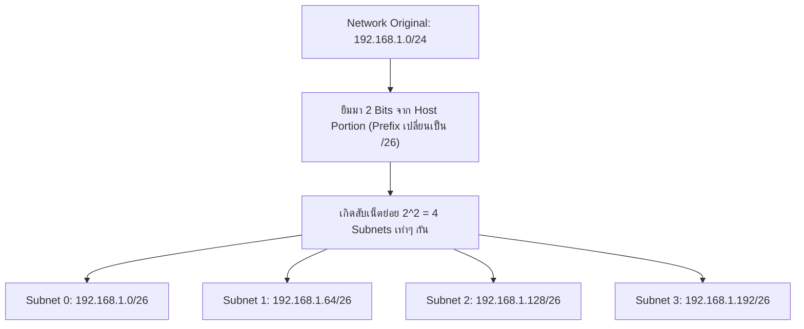
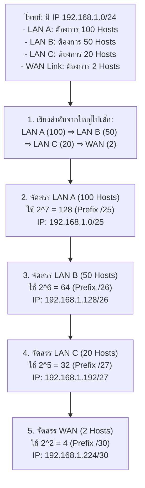
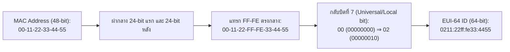

---
tags:
  - networking
  - chapter8
  - ip-addressing
  - subnetting
  - vlsm
  - ipv6
  - ccna
  - workshop
created: 2026-08-03
updated: 2026-08-03
type: wiki-note
---

# Chapter 8: IP Addressing, Subnetting and VLSM

> [!SUMMARY] ภาพรวมประจำบท
> โน้ตความรู้บทที่ 8 เป็นคู่มือภาคปฏิบัติสำหรับการจัดสรรหมายเลข IP (IP Addressing), การทำ Subnetting แบบขนาดเท่ากัน (FLSM - Fixed Length Subnet Mask), การทำ Subnetting แบบประหยัดตามความต้องการใช้งานจริง (VLSM - Variable Length Subnet Mask), โครงสร้างและการย่อที่อยู่ IPv6 (Compression Rules, SLAAC, EUI-64), พร้อมคลังโจทย์และเฉลยคำนวณอย่างละเอียดตามแนวทางมาตรฐานการสอบใบรับรอง CCNA (Cisco Certified Network Associate)

---

## 1. พื้นฐานที่อยู่ IPv4 และระบบเลขฐานสอง (IPv4 Binary Fundamentals)

IPv4 Address ประกอบด้วยข้อมูลขนาด 32 บิต แบ่งออกเป็น 4 อ็อกเทต (Octets) อ็อกเทตละ 8 บิต คั่นด้วยจุด Decimal-Dotted Notation

```bitfield
0                   7 8                  15 16                  23 24                  31
+---------------------+---------------------+---------------------+---------------------+
|  1st Octet (8 bits) |  2nd Octet (8 bits) |  3rd Octet (8 bits) |  4th Octet (8 bits) |
+---------------------+---------------------+---------------------+---------------------+
| 128 | 64 | 32 | 16  |  8  |  4  |  2  |  1  | (น้ำหนักบิตประจำตำแหน่งในแต่ละ Octet)
```

> [!DEFINITION] องค์ประกอบใน 1 สับเน็ต (Subnet Components)
> 1. **Network Address (Subnet ID):** หมายเลขตัวแทนสับเน็ต (บิตฝั่ง Host เป็น 0 ทั้งหมด) *ไม่สามารถตั้งให้เครื่องโฮสต์ได้*
> 2. **Broadcast Address:** หมายเลขกระจายข้อมูลประจำสับเน็ต (บิตฝั่ง Host เป็น 1 ทั้งหมด) *ไม่สามารถตั้งให้เครื่องโฮสต์ได้*
> 3. **Usable Host IP Range:** ช่วงหมายเลข IP ที่ใช้งานได้จริง ตั้งแต่ `Network ID + 1` ถึง `Broadcast ID - 1`
> 4. **Total Hosts ($2^h$):** จำนวนโฮสต์ทั้งหมดรวม Network/Broadcast ID
> 5. **Usable Hosts ($2^h - 2$):** จำนวนโฮสต์ที่สามารถนำไปใช้งานจริงกับอุปกรณ์ได้

---

### 1.1 ตารางแปลง Subnet Mask และ CIDR Prefix (`/8` ถึง `/30`)

| Prefix | Subnet Mask | Binary (4th Octet) | Block Size (Increment) | Usable Hosts ($2^h - 2$) |
| :---: | :--- | :---: | :---: | :---: |
| **/24** | `255.255.255.0` | `0000 0000` | 256 | 254 |
| **/25** | `255.255.255.128` | `1000 0000` | 128 | 126 |
| **/26** | `255.255.255.192` | `1100 0000` | 64 | 62 |
| **/27** | `255.255.255.224` | `1110 0000` | 32 | 30 |
| **/28** | `255.255.255.240` | `1111 0000` | 16 | 14 |
| **/29** | `255.255.255.248` | `1111 1000` | 8 | 6 |
| **/30** | `255.255.255.252` | `1111 1100` | 4 | **2** (ใช้ทำ Point-to-Point WAN) |

---

## 2. การทำ Subnetting แบบ FLSM (Fixed Length Subnet Mask)

FLSM คือการแบ่งเครือข่ายใหญ่ออกเป็นสับเน็ตย่อยที่มี **ขนาดเท่ากันทุกสับเน็ต**



### 2.1 อัลกอริทึมขั้นตอนการคำนวณ FLSM
1. คำนวณจำนวนบิตที่ต้องยืม ($b$): สับเน็ตที่ต้องการ $\le 2^b$
2. คำนวณ Prefix ใหม่: $\text{New Prefix} = \text{Old Prefix} + b$
3. คำนวณจำนวนบิตฝั่ง Host ที่เหลือ ($h$): $h = 32 - \text{New Prefix}$
4. คำนวณ Block Size (Increment): $\text{Block Size} = 2^h$
5. สร้างตารางแจกแจงสับเน็ตโดยบวกเพิ่มค่า Block Size ในอ็อกเทตที่ถูกแบ่ง

---

> [!EXAMPLE] ตัวอย่างการทำ FLSM แบบครบถ้วน
> **โจทย์:** แบ่งเครือข่าย `192.168.10.0/24` ออกเป็น **4 สับเน็ตเท่าๆ กัน**
> - ต้องยืมบิต $b = 2$ bits ($2^2 = 4$ subnets)
> - Prefix ใหม่ $= 24 + 2 = \mathbf{/26}$ (Subnet Mask: `255.255.255.192`)
> - บิต Host เหลือ $h = 32 - 26 = 6$ bits
> - Block Size $= 2^6 = \mathbf{64}$

#### ตารางผลลัพธ์การแบ่ง FLSM:

| Subnet # | Network ID | First Usable Host IP | Last Usable Host IP | Broadcast ID | Subnet Mask |
| :---: | :--- | :--- | :--- | :--- | :--- |
| **Subnet 0** | `192.168.10.0` | `192.168.10.1` | `192.168.10.62` | `192.168.10.63` | `255.255.255.192` |
| **Subnet 1** | `192.168.10.64` | `192.168.10.65` | `192.168.10.126` | `192.168.10.127` | `255.255.255.192` |
| **Subnet 2** | `192.168.10.128` | `192.168.10.129` | `192.168.10.190` | `192.168.10.191` | `255.255.255.192` |
| **Subnet 3** | `192.168.10.192` | `192.168.10.193` | `192.168.10.254` | `192.168.10.255` | `255.255.255.192` |

---

## 3. การทำ Subnetting แบบ VLSM (Variable Length Subnet Mask)

VLSM ช่วยลดการสูญเสียหมายเลข IP โดยจัดสรรขนาดสับเน็ตตามความต้องการใช้งานจริงของแต่ละกลุ่ม

> [!IMPORTANT] กฎเหล็กของ VLSM (CRITICAL RULE)
> ในการทำ VLSM คุณ **ต้องจัดเรียงลำดับความต้องการจำนวน Host จากใหญ่ที่สุดไปหาเล็กที่สุดเสมอ!** (Sort from Largest to Smallest) หากไม่จัดเรียง จะเกิดปัญหาหมายเลข IP ทับซ้อนกัน (Overlap)



---

### 3.2 ตารางสรุปผลลัพธ์การทำ VLSM แบบสมบูรณ์

| ชื่อสับเน็ต | จำนวน Host ที่ต้องการ | บิต Host ($h$) | Block Size | Prefix | Network ID | First Host IP | Last Host IP | Broadcast ID | Subnet Mask |
| :--- | :---: | :---: | :---: | :---: | :--- | :--- | :--- | :--- | :--- |
| **LAN A** | 100 | 7 | 128 | **/25** | `192.168.1.0` | `192.168.1.1` | `192.168.1.126` | `192.168.1.127` | `255.255.255.128` |
| **LAN B** | 50 | 6 | 64 | **/26** | `192.168.1.128` | `192.168.1.129` | `192.168.1.186` | `192.168.1.187` | `255.255.255.192` |
| **LAN C** | 20 | 5 | 32 | **/27** | `192.168.1.192` | `192.168.1.193` | `192.168.1.222` | `192.168.1.223` | `255.255.255.224` |
| **WAN Link**| 2 | 2 | 4 | **/30** | `192.168.1.224` | `192.168.1.225` | `192.168.1.226` | `192.168.1.227` | `255.255.255.252` |
| *สำรอง* | - | - | - | - | `192.168.1.228` | - | - | `192.168.1.255` | - |

---

## 4. โครงสร้างและการย่อที่อยู่ IPv6 (IPv6 Addressing Mechanics)

IPv6 มีขนาด 128 บิต เขียนในรูปเลขฐานสิบหก 8 กลุ่ม กลุ่มละ 4 ตัว (Hextets) คั่นด้วย `:`

```text
รูปแบบเต็ม: 2001:0db8:0000:0000:0000:ff00:0042:8329
```

### 4.1 กฎการย่อที่อยู่ IPv6 (2 Compression Rules)
1. **ตัด 0 ด้านหน้า Hextet ออก (Omit Leading Zeros):**
   - `0db8` $\to$ `db8`
   - `0000` $\to$ `0`
   - `0042` $\to$ `42`
2. **ละชุด 0 ที่ต่อเนื่องกันด้วยเครื่องหมาย Double Colon (`::`) ได้เพียงครั้งเดียวใน 1 IP:**
   - `2001:db8:0:0:0:ff00:42:8329` $\to$ **`2001:db8::ff00:42:8329`**

---

### 4.2 ประเภทของ IPv6 Unicast Addresses
- **Global Unicast Address (GUA):** IP สาธารณะที่ใช้วิ่งบนอินเทอร์เน็ต ขึ้นต้นด้วย **`2000::/3`**
- **Link-Local Address (LLA):** IP ภายในลิงก์เดียวกัน ไม่ข้ามเราเตอร์ ขึ้นต้นด้วย **`fe80::/10`**
- **Unique Local Address (ULA):** IP ส่วนบุคคล (เทียบเท่า Private IP ใน IPv4) ขึ้นต้นด้วย **`fc00::/7`**

---

### 4.3 กลไก SLAAC และการสร้าง EUI-64
**SLAAC (Stateless Address Autoconfiguration)** ยอมให้เครื่องโฮสต์สร้าง IPv6 ของตนเองได้โดยไม่ต้องพึ่ง DHCP Server โดยใช้ค่า Prefix จากเราเตอร์ ร่วมกับ **Interface ID** ที่สร้างจาก **EUI-64**



---

## 5. คลังโจทย์ฝึกฝนข้อสอบ CCNA (CCNA Practice Exercises)

> [!EXAMPLE] โจทย์ CCNA #1: การหา Network ID และ Broadcast ID
> **โจทย์:** เครื่องคอมพิวเตอร์มี IP `172.16.45.100/22` จงหา Network ID, Broadcast ID และ Usable Range
>
> **เฉลยละเอียด:**
> 1. Prefix `/22` $\to$ Subnet Mask: `255.255.252.0` (อ็อกเทตที่ 3 มีค่า 252)
> 2. Block Size ใน Octet 3 $= 256 - 252 = \mathbf{4}$
> 3. หาพหุคูณของ 4 ที่ใกล้เคียงแต่ไม่เกิน 45: $4 \times 11 = \mathbf{44}$
> 4. **Network ID:** `172.16.44.0`
> 5. **Broadcast ID:** `172.16.47.255` (ก่อนหน้า $44 + 4 = 48$)
> 6. **Usable Range:** `172.16.44.1` ถึง `172.16.47.254`

---

> [!EXAMPLE] โจทย์ CCNA #2: การคำนวณสับเน็ตสำหรับเชื่อมต่อเราเตอร์
> **โจทย์:** ต้องกำหนด IP ให้กับลิงก์ไฟเบอร์เชื่อมต่อระหว่างเราเตอร์ 2 ตัว โดยประหยัด IP มากที่สุด
>
> **เฉลยละเอียด:**
> - ลิงก์ระหว่างเราเตอร์ 2 ตัวต้องการ Usable IP เพียง **2 หมายเลข**
> - ใช้ Prefix **`/30`** (Subnet Mask: `255.255.255.252`) ซึ่งมี Usable Hosts $= 2^2 - 2 = 2$ หมายเลขพอดี!

---

## 📚 อ้างอิงและโน้ตที่เกี่ยวข้อง
- 🔹 **[[Chapter 4 - Network Data Plane]]** - โครงสร้าง IPv4/IPv6 และ DHCP
- 🔹 **[[Chapter 6 - Link Layer and LANs]]** - MAC Address และโครงสร้าง 48-bit
- 🔹 **[[Chapter 10 - Homework and Quiz Solution Guide]]** - โจทย์การคำนวณ Subnetting FLSM/VLSM จากการบ้านและ Quiz
