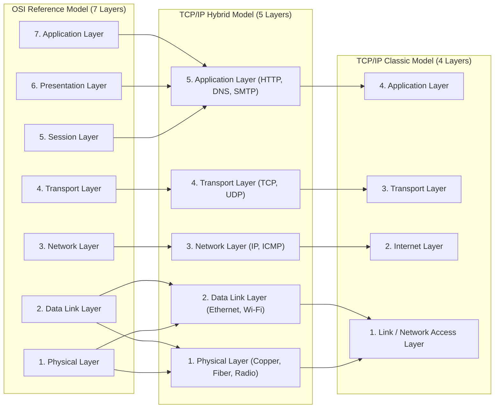
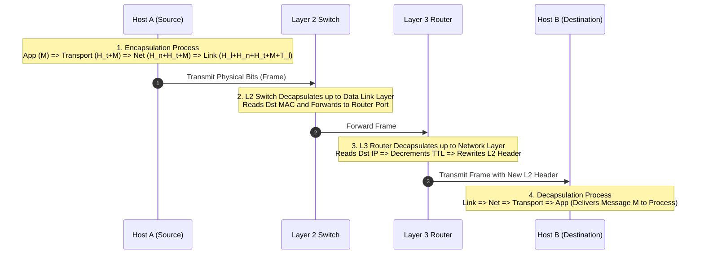
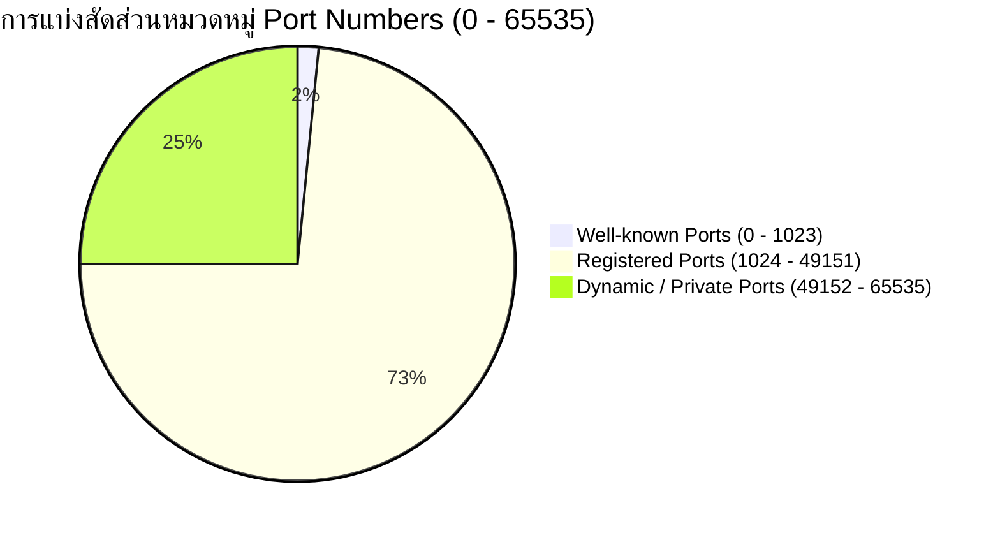

---
tags:
  - networking
  - chapter9
  - tcp-ip
  - osi-model
  - encapsulation
  - layering
  - port-numbers
created: 2026-08-03
updated: 2026-08-03
type: wiki-note
---

# Chapter 9: TCP IP Model and Architecture

> [!SUMMARY] ภาพรวมประจำบท
> โน้ตความรู้บทที่ 9 เป็นคู่มือเปรียบเทียบสถาปัตยกรรมแบบจำลองเครือข่ายระหว่าง **OSI 7-Layer Reference Model** และ **TCP/IP 4/5-Layer Architecture** ครอบคลุมการทำงานของแต่ละชั้น, กระบวนการ Encapsulation และ Decapsulation แบบครบวงจรตั้งแต่อุปกรณ์ต้นทาง ผ่านสวิตช์ เราเตอร์ จนถึงปลายทาง, การแมปหมายเลขระบุตัวตน (Addressing) ในแต่ละชั้น, และสรุปจัดหมวดหมู่หมายเลขพอร์ต (Port Numbers Classification)

---

## 1. การเปรียบเทียบ OSI 7-Layer และ TCP/IP Model

เพื่อความเข้าใจที่เป็นมาตรฐานสากล วิศวกรเครือข่ายได้ออกแบบสถาปัตยกรรมเครือข่ายเป็นชั้นๆ (Layering Architecture)



### 1.1 ตารางสรุปหน้าที่และความรับผิดชอบของแต่ละเลเยอร์

| Layer (5-Layer) | PDU Name | หมายเลขระบุตัวตน (Addressing) | หน้าที่หลัก (Primary Functions) |
| :--- | :--- | :--- | :--- |
| **5. Application** | **Message** | Process Name / URL | ให้บริการอินเทอร์เฟซแก่ผู้ใช้และแอปพลิเคชัน (HTTP, DNS, SMTP) |
| **4. Transport** | **Segment / Datagram** | Port Number (16-bit) | ควบคุมการส่งข้อมูลระหว่างโปรเซส (End-to-End), Multiplexing, Flow/Congestion Control |
| **3. Network** | **Datagram / Packet** | IP Address (32/128-bit) | นำส่งแพ็กเก็ตข้ามเครือข่าย (Host-to-Host Routing), Addressing, Fragmentation |
| **2. Data Link** | **Frame** | MAC Address (48-bit) | นำส่งเฟรมข้อมูลข้ามลิงก์กายภาพข้างเคียง (Node-to-Node), Framing, Error Detection |
| **1. Physical** | **Bits** | Voltages, Frequencies | แปลงข้อมูลบิตเป็นสัญญาณกายภาพ (สายทองแดง, แสง, คลื่นวิทยุ) |

---

## 2. กระบวนการ Encapsulation และ Decapsulation แบบครบวงจร

เมื่อข้อมูลเคลื่อนที่จากโปรเซสต้นทางไปยังปลายทาง ข้อมูลจะผ่านกระบวนการห่อหุ้ม (Encapsulation) ลงมาทีละชั้น และถูกถอดเปลือกออก (Decapsulation) เมื่อถึงปลายทาง



---

### 2.1 โครงสร้างซ้อนกันของ Headers (Nested Encapsulation Layout)

```bitfield
0                                                                             31
+------------------------------------------------------------------------------+
| Ethernet Header (Dst MAC: 6B, Src MAC: 6B, Type: 2B)                         |
+------------------------------------------------------------------------------+
| IPv4 Header (Src IP: 4B, Dst IP: 4B, Protocol: 1B, TTL: 1B...)               |
+------------------------------------------------------------------------------+
| TCP Header (Src Port: 2B, Dst Port: 2B, Seq: 4B, Ack: 4B...)                 |
+------------------------------------------------------------------------------+
| Application Data Payload (e.g. HTTP GET /index.html)                         |
+------------------------------------------------------------------------------+
| Ethernet Trailer (CRC / FCS Checksum: 4B)                                    |
+------------------------------------------------------------------------------+
```

---

## 3. การจัดหมวดหมู่หมายเลขพอร์ต (Port Numbers Classification)

หมายเลขพอร์ตเป็นตัวเลขขนาด 16 บิต (มีค่าตั้งแต่ `0` ถึง `65,35`) จัดสรรโดยองค์กร **IANA (Internet Assigned Numbers Authority)**



1. **Well-Known Ports (`0` - `1023`):** สงวนไว้สำหรับบริการมาตรฐานที่แพร่หลาย (ต้องใช้สิทธิ์ Admin/Root ในการเปิดใช้งาน)
2. **Registered Ports (`1024` - `49151`):** ใช้สำหรับซอฟต์แวร์ประยุกต์เฉพาะของผู้พัฒนา (เช่น ฐานข้อมูล, เว็บเฟรมเวิร์ก)
3. **Dynamic / Private / Ephemeral Ports (`49152` - `65535`):** พอร์ตชั่วคราวที่ระบบปฏิบัติการฝั่ง Client สุ่มขึ้นมาใช้งานเมื่อเปิดเซสชันออกไป

---

### 3.1 ตารางรวมหมายเลขพอร์ตที่สำคัญในข้อสอบและการใช้งานจริง

| Port Number | Protocol | Transport Protocol | คำอธิบายการใช้งาน (Service Description) |
| :---: | :--- | :---: | :--- |
| **20 / 21** | **FTP** | TCP | File Transfer Protocol (Data / Control) |
| **22** | **SSH / SFTP** | TCP | Secure Shell (การรีโมตแบบเข้ารหัส) |
| **23** | **Telnet** | TCP | Remote Terminal (ไม่เข้ารหัส - ข้อความธรรมดา) |
| **25** | **SMTP** | TCP | Simple Mail Transfer Protocol (ส่งอีเมล) |
| **53** | **DNS** | UDP / TCP | Domain Name System (แปลโฮสต์เป็น IP) |
| **67 / 68** | **DHCP** | UDP | Dynamic Host Configuration Protocol (Server/Client) |
| **80** | **HTTP** | TCP | HyperText Transfer Protocol (เว็บไม่เข้ารหัส) |
| **110** | **POP3** | TCP | Post Office Protocol v3 (ดึงอีเมลลงเครื่อง) |
| **143** | **IMAP** | TCP | Internet Message Access Protocol (ซิงก์อีเมล) |
| **161 / 162**| **SNMP** | UDP | Simple Network Management Protocol (Poll/Trap) |
| **443** | **HTTPS** | TCP | HTTP Secure (HTTP over TLS/SSL) |
| **3306** | **MySQL** | TCP | ฐานข้อมูล MySQL Database Server |
| **5432** | **PostgreSQL**| TCP | ฐานข้อมูล PostgreSQL Database Server |
| **6379** | **Redis** | TCP | In-memory Cache Redis |
| **8080** | **HTTP-Proxy**| TCP | พอร์ตสำรองสำหรับ Web Proxy / Dev Server |

---

## 📚 อ้างอิงและโน้ตที่เกี่ยวข้อง
- 🔹 **[[Chapter 1 - Computer Networks and the Internet]]** - ภาพรวม Layering Architecture
- 🔹 **[[Chapter 2 - Application Layer]]** - การทำงานของ Socket และ HTTP/DNS Ports
- 🔹 **[[Chapter 3 - Transport Layer]]** - โครงสร้าง TCP และ UDP Segment Headers
- 🔹 **[[Chapter 4 - Network Data Plane]]** - โครงสร้าง IPv4 Header และการส่งต่อแพ็กเก็ต
- 🔹 **[[Chapter 6 - Link Layer and LANs]]** - โครงสร้าง Ethernet Frame Header
