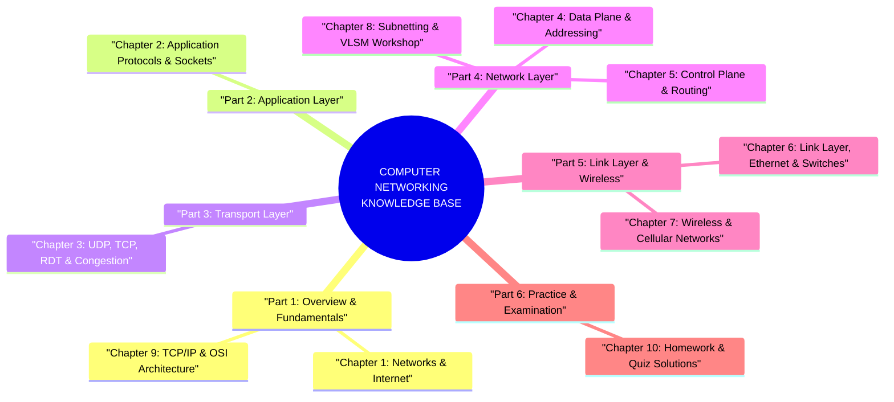

---
tags:
  - networking
  - index
  - master-guide
created: 2026-08-03
updated: 2026-08-03
type: index
---

# 🌐 Computer Networking & Internet - Comprehensive Master Index

> [!SUMMARY] คลังความรู้ Computer Networking & Internet Architecture ระดับสมบูรณ์แบบ
> สารบัญดัชนี (Master Index) นี้รวบรวม **"Mega Guides"** สำหรับวิชาคอมพิวเตอร์เน็ตเวิร์กและอินเทอร์เน็ต อ้างอิงเนื้อหาหลักจากคอร์สเรียน `computer-network-course`, สไลด์ประจำบทเรียน Chapter 1 - 7, CCNA IP Subnetting, โจทย์การบ้าน/ข้อสอบ Quiz และหนังสือระดับคลาสสิก *Computer Networking: A Top-Down Approach (8th Edition)* โดย James F. Kurose และ Keith W. Ross

---

# 📚 Part 1: Fundamentals & Architecture (พื้นฐานและสถาปัตยกรรมระบบเครือข่าย)

ทำความเข้าใจภาพรวมของระบบเครือข่ายคอมพิวเตอร์และอินเทอร์เน็ต โครงสร้างการเชื่อมต่อ เลเยอร์ของโปรโตคอล ประสิทธิภาพของเครือข่าย และความปลอดภัย

- 🔹 **[[Chapter 1 - Computer Networks and the Internet]]**
  - What is the Internet? (Nuts-and-Bolts view vs Service view, Protocols)
  - Network Edge (End Systems, Clients, Servers, Access Networks: DSL, Cable, FTTH, Wi-Fi, 4G/5G, Physical Media)
  - Network Core (Packet Switching vs Circuit Switching, FDM/TDM, Store-and-Forward, Queuing & Packet Loss, Forwarding Tables)
  - Internet Structure & ISP Hierarchy (Tier 1 ISPs, IXPs, Regional ISPs, Access ISPs, Content Provider Networks)
  - Performance Metrics (Nodal Delay Decomposition: $d_{nodal} = d_{proc} + d_{queue} + d_{trans} + d_{prop}$, Traffic Intensity $La/R$, Packet Loss, Throughput)
  - Protocol Layers & Service Models (OSI 7-Layer vs TCP/IP 5-Layer, Encapsulation & Decapsulation, PDU Names)
  - Network Security (Malware, Viruses, Worms, Botnets, DoS/DDoS, Packet Sniffing, IP Spoofing)
- 🔹 **[[Chapter 9 - TCP IP Model and Architecture]]**
  - Comparative Analysis: OSI 7-Layer Model vs TCP/IP 4-Layer Architecture
  - Data Encapsulation & Decapsulation Walkthrough (Headers & Trailers)
  - Address Mapping Across Layers (Port Number, IP Address, MAC Address)
  - Port Number Range Classifications (Well-known 0-1023, Registered 1024-49151, Dynamic 49152-65535)

---

# 💻 Part 2: Application Layer (เลเยอร์ประยุกต์ใช้งาน)

เจาะลึกกระบวนการทำงานของซอฟต์แวร์ประยุกต์บนเครือข่าย โปรโตคอลมาตรฐานโลก และการเขียนโปรแกรมซ็อกเก็ต

- 🔹 **[[Chapter 2 - Application Layer]]**
  - Principles of Network Applications (Client-Server vs Peer-to-Peer P2P Architecture, Process Communication & Sockets)
  - Web and HTTP (HTTP/1.0, HTTP/1.1, HTTP/2, HTTP/3 over QUIC, Persistent vs Non-Persistent, RTT Calculations, Request/Response Format, Status Codes, Cookies, Web Caching & Conditional GET)
  - Electronic Mail (SMTP, IMAP, POP3, Mail User Agents, Mail Servers, MIME)
  - Domain Name System (DNS) (Hierarchical Database: Root, TLD, Authoritative, Local DNS, Iterative vs Recursive Queries, Resource Records: A, AAAA, NS, CNAME, MX, DNS Security)
  - Peer-to-Peer Applications (BitTorrent, File Distribution Analysis: Client-Server vs P2P Distribution Time Equations, Choke/Unchoke Algorithm)
  - Video Streaming & CDNs (DASH - Dynamic Adaptive Streaming over HTTP, CDN Strategies: Enter Deep vs Bring Home, Manifest Files)
  - Socket Programming Workshop (Python TCP Client/Server, Python UDP Client/Server, Socket API Lifecycle)

---

# 🚚 Part 3: Transport Layer (เลเยอร์นำส่งข้อมูล)

การให้บริการการสื่อสารแบบ Logical Communication ระหว่างกระบวนการ (Processes) ด้วย UDP และ TCP, การส่งข้อมูลที่น่าเชื่อถือ (RDT), การควบคุมการไหล และการควบคุมความคับคั่ง

- 🔹 **[[Chapter 3 - Transport Layer]]**
  - Transport-Layer Services & Relationship to Network Layer
  - Multiplexing & Demultiplexing (Connectionless Demux vs Connection-Oriented 4-Tuple Demux)
  - Connectionless Transport: UDP (Segment Structure, Checksum Calculation in 1's Complement)
  - Principles of Reliable Data Transfer (RDT 1.0, 2.0, 2.1, 2.2, 3.0, Extended FSMs, Stop-and-Wait Utilization $U_{sender}$)
  - Pipelined Protocols (Go-Back-N GBN vs Selective Repeat SR, Extended Sender/Receiver FSMs, Window Sizes)
  - Connection-Oriented Transport: TCP (Segment Format, Sequence & ACK Numbers, SYN/FIN/RST/PSH/URG Flags)
  - TCP Reliable Data Transfer (Fast Retransmit with 3 Duplicate ACKs, RTT Estimation: EstimatedRTT, DevRTT, TimeoutInterval)
  - TCP Flow Control (Receive Window $rwnd = RcvBuffer - [LastByteRcvd - LastByteRead]$)
  - TCP Connection Management & Extended FSM (3-Way Handshake, 4-Way Teardown, TIME_WAIT, CLOSE_WAIT, LAST_ACK States)
  - Principles of Congestion Control (Causes & Costs of Congestion, AIMD Dynamics)
  - TCP Congestion Control Mechanisms (Slow Start, Congestion Avoidance, Fast Recovery, TCP Tahoe vs Reno FSM)
  - Explicit Congestion Notification (ECN - RFC 3168: ECT, CE, ECE, CWR Header Bits)
  - Modern Congestion Control (TCP CUBIC - RFC 8312 cubic time growth & plateau probing, Google BBR rate/pacing control)
  - TCP Performance on Long Fat Pipes (LFP) & Bandwidth-Delay Product (BDP) Analysis ($Throughput \le \frac{1.22 \times MSS}{RTT \sqrt{p}}$)
  - Next-Gen Transport Protocol: QUIC over UDP (RFC 9000: 0-RTT/1-RTT Handshake, Stream Parallelism without HOL Blocking, Connection Migration via CID)

---

# 🗺️ Part 4: Network Layer & IP Subnetting (เลเยอร์เครือข่ายและการจัดสรรที่อยู่ IP)

แยกแยะระหว่าง Data Plane (การส่งต่อแพ็กเก็ตภายในเราเตอร์) และ Control Plane (อัลกอริทึมการเลือกเส้นทาง) พร้อมการคำนวณ Subnetting เชิงลึก

- 🔹 **[[Chapter 4 - Network Data Plane]]**
  - Overview of Data Plane vs Control Plane (Per-router Forwarding vs Centralized SDN)
  - Router Architecture (Input Ports, Switching Fabrics: Memory, Bus, Crossbar, Output Ports, HOL Blocking, Buffer Sizing Rules)
  - Internet Protocol IPv4 (Header Format, ID, Flags, Fragment Offset, TTL, Protocol, Header Checksum)
  - IPv4 Fragmentation & Reassembly Mechanics (MTU Calculations, Offset Units)
  - IPv4 Addressing & Subnetting Basics (CIDR Notation, Network/Broadcast Address, Host Range)
  - Dynamic Host Configuration Protocol (DHCP) (DDI Process: Discover, Offer, Request, ACK)
  - Network Address Translation (NAT) (NAT Translation Tables, Private IP Ranges, STUN/UPnP)
  - IPv6 Protocol (128-bit Address, Fixed 40-byte Header, Transition Strategies: Dual Stack & Tunneling)
  - Generalized Forwarding & SDN (OpenFlow Match-Action Tables, Flow Table Matching Rules & Actions)
- 🔹 **[[Chapter 5 - Network Control Plane]]**
  - Routing Algorithm Classification (Global vs Decentralized, Static vs Dynamic, LS vs DV)
  - Link-State Routing Algorithm (Dijkstra's Algorithm, Step-by-Step Trace Tables, Complexity $O(N^2)$, Oscillations)
  - Distance-Vector Routing Algorithm (Bellman-Ford Equation $d_x(y) = \min_v \{c(x,v) + d_v(y)\}$, Count-to-Infinity Problem, Poisoned Reverse)
  - Intra-AS Routing Protocols (OSPF Hierarchical Architecture, Link-State Advertisements)
  - Inter-AS Routing Protocols (BGP-4, eBGP vs iBGP, Path Vectors, BGP Route Selection Rules: Local Pref, AS-PATH, MED, Hot Potato)
  - SDN Control Plane (SDN Controller Architecture, Southbound vs Northbound APIs, Control Applications)
  - Internet Control Message Protocol (ICMP) (ICMP Types/Codes, Ping & Traceroute Mechanics)
  - Network Management & SNMP (MIB, SMI, SNMP Requests & Traps)
- 🔹 **[[Chapter 8 - IP Addressing, Subnetting and VLSM]]**
  - Binary/Decimal Conversions & Subnet Mask Fundamentals
  - Fixed Length Subnet Mask (FLSM) Calculation Steps
  - Variable Length Subnet Mask (VLSM) Algorithm & Practical Allocation Tables
  - IPv6 Addressing Structure, Compression Rules (`::`), Global Unicast, Link-Local & SLAAC/EUI-64
  - CCNA Certification Practice Exercises & Detailed Solutions

---

# 🔗 Part 5: Link Layer, Switches & Wireless Networks (เลเยอร์เชื่อมโยงข้อมูลและระบบไร้สาย)

การส่งข้อมูลระดับเฟรมผ่านสื่อนำสัญญาณ (Link), การตรวจจับและแก้ไขข้อผิดพลาด, โปรโตคอลแชร์สื่อสัญญาณ, การทำงานของ สวิตช์ L2, VLANs และการสื่อสารไร้สาย 802.11/Cellular

- 🔹 **[[Chapter 6 - Link Layer and LANs]]**
  - Link Layer Services (Framing, Link Access, Reliable Delivery, Error Detection/Correction)
  - Error Detection & Correction (Parity Bits, Internet Checksum, Cyclic Redundancy Check CRC Modulo-2 Division)
  - Multiple Access Protocols (Channel Partitioning: TDMA/FDMA/CDMA; Random Access: Slotted ALOHA, CSMA, CSMA/CD & Exponential Backoff; Taking-Turns: Polling/Token)
  - Link-Layer Addressing & ARP (MAC Address Structure, ARP Protocol, ARP Table, ARP Spoofing)
  - Ethernet (IEEE 802.3 Frame Layout, Preamble, Manchester Encoding, Unreliable Service)
  - Switches vs Routers (Layer 2 Switch Self-Learning Algorithm, Switch Table Forwarding/Filtering, Collision vs Broadcast Domains)
  - Virtual LANs (VLANs) (IEEE 802.1Q Frame Tagging, Trunk Ports, Inter-VLAN Routing)
  - Multiprotocol Label Switching (MPLS) (Label Switching Routers, Forwarding Equivalence Class)
- 🔹 **[[Chapter 7 - Wireless and Mobile Networks]]**
  - Wireless Link Characteristics (Signal Attenuation, Multipath Fading, Interference, Hidden/Exposed Terminal Problems)
  - IEEE 802.11 Wireless LANs (Wi-Fi) (Architecture: BSS, AP, SSID, CSMA/CA Mechanism, DIFS/SIFS, RTS/CTS Handshake, 802.11 Frame Fields)
  - Bluetooth & Zigbee (PAN 802.15.1 & 802.15.4)
  - Cellular Networks (Evolution: 2G/3G/4G LTE EPC Architecture - eNodeB, MME, SGW, PGW, 5G NR & Network Slicing)
  - Mobility Management (Addressing Challenges, Home Agent, Foreign Agent, Care-of-Address, Mobile IP Routing, Handover Mechanics)

---

# 📝 Part 6: Practice & Solutions (แบบฝึกหัดและการบ้าน)

- 🔹 **[[Chapter 10 - Homework and Quiz Solution Guide]]**
  - Complete Step-by-Step Solutions for Homework 1 - 5 (Delay calculations, RTT, Subnetting, TCP Congestion Control Trace, Dijkstra Trace, CRC Polynomial Division)
  - Assignments.pptx Special Exercise Solutions (Internet Checksum 16-bit binary/hex calculations with carry-around addition & TCP 3-Way Handshake + "hello" payload trace tables for ISN 300/500 and ISN 1000/2000)
  - Quiz Question Bank & Explanations
