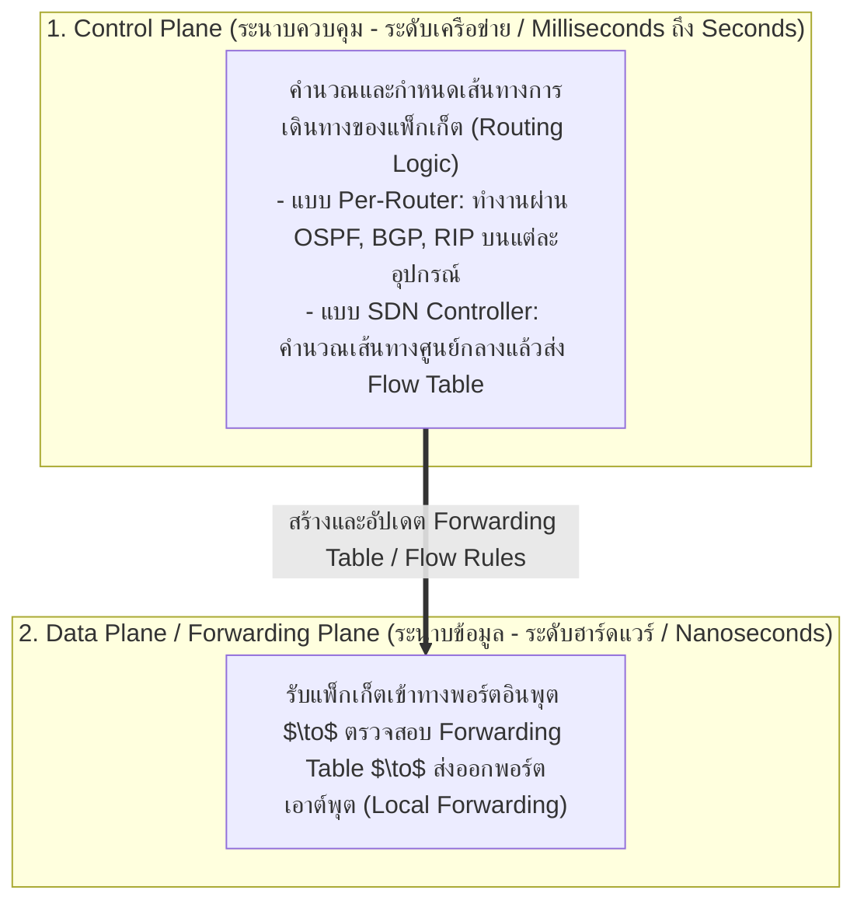
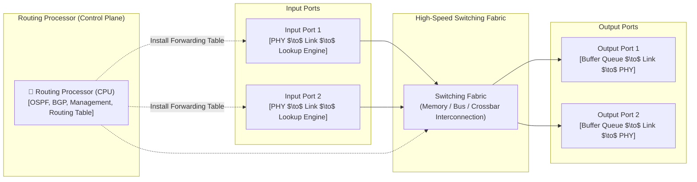
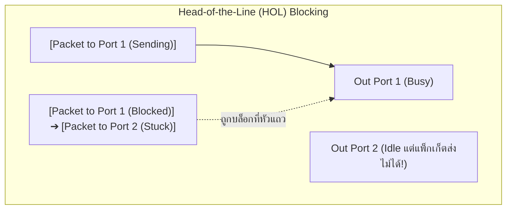
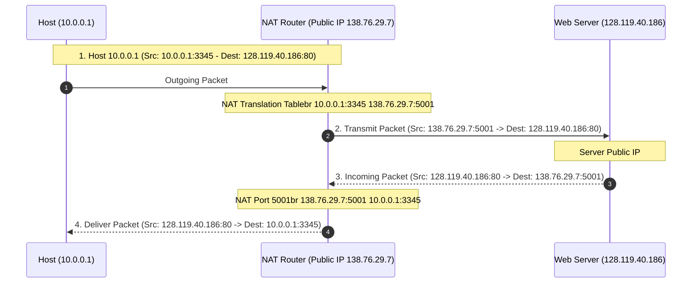
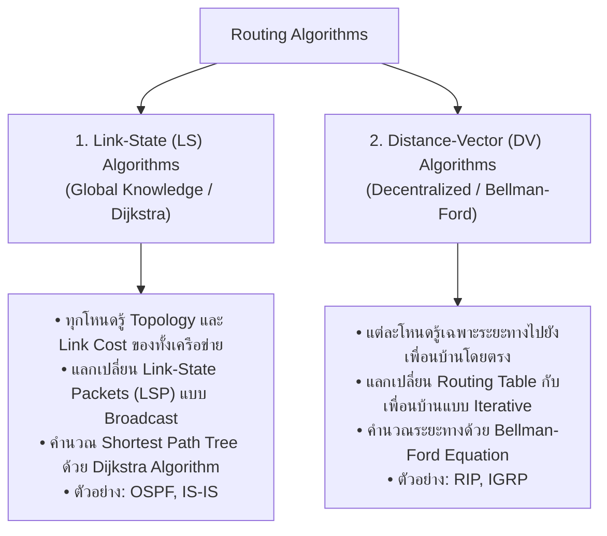
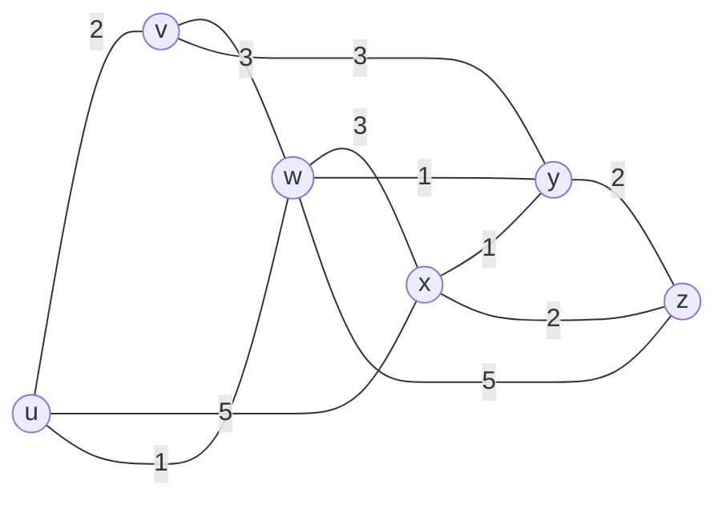
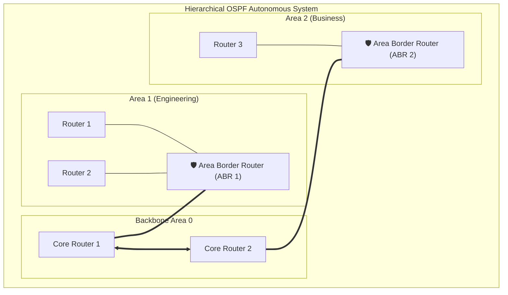
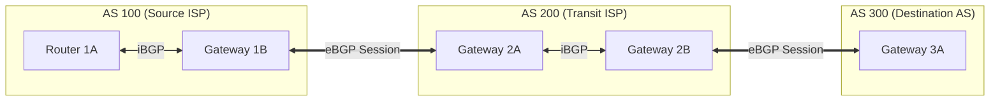
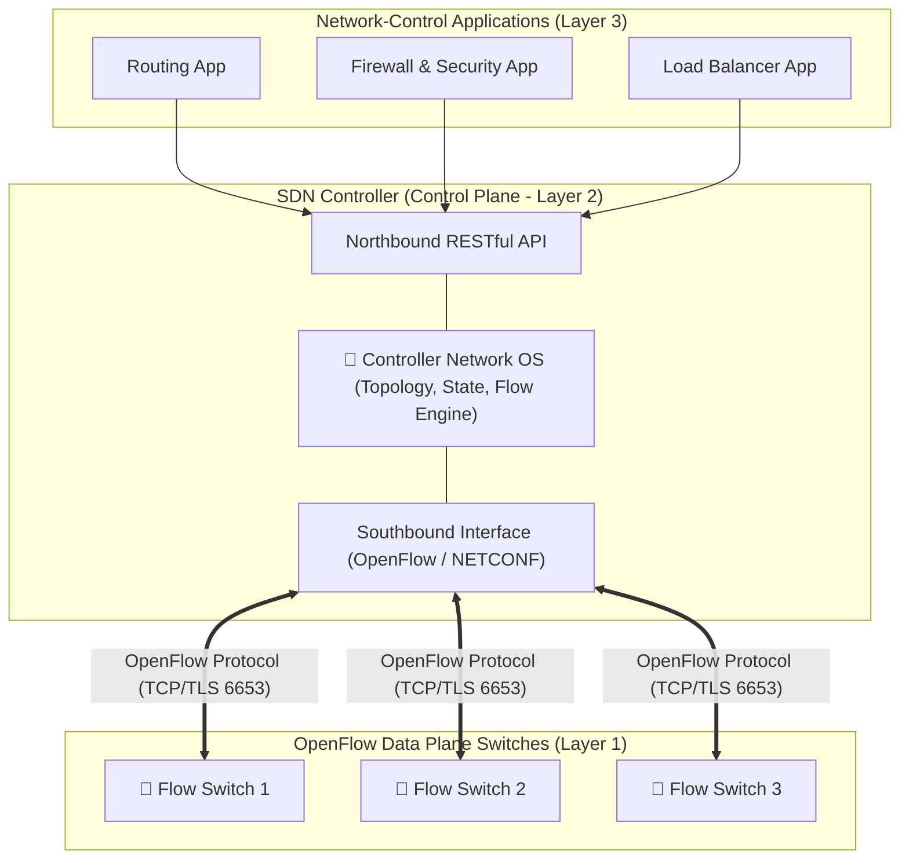

---
tags:
  - networking
  - lecture
  - network-layer
  - routing
  - ip-addressing
  - subnetting
  - vlsm
  - bgp
  - ospf
  - sdn
created: 2026-08-03
updated: 2026-08-17
type: lecture-note
---

# Lecture 5: Network Layer, Routing, and IP Addressing — Master Comprehensive Guide

> [!SUMMARY]
> บันทึกวิกิความรู้ระดับสมบูรณ์ 100% สรุปเนื้อหาเจาะลึกทุกองค์ประกอบจากสไลด์ Chapter 4 (Data Plane), Chapter 5 (Control Plane), CCNA Chapter 7 (IP Addressing), CCNA Chapter 8 (Subnetting) และหนังสือเรียน Kurose & Ross 8th Edition โดยไม่มีการข้ามหัวข้อ พร้อม Trace Table, สูตรคำนวณแบบ Step-by-step, Packet Formats, และ Mermaid Diagrams

---

## สารบัญโครงสร้างเนื้อหา (Master Table of Contents)
1. [[#1. สถาปัตยกรรม Network Layer: Data Plane vs Control Plane]]
2. [[#2. โครงสร้างภายในของเร้าเตอร์ (Router Architecture & Hardware Internals)]]
3. [[#3. โครงสร้างแพ็กเก็ต IPv4 และกลไกการแบ่งส่วน (IPv4 Header & Fragmentation)]]
4. [[#4. การกำหนดหมายเลข IP, ซับเน็ต และการคำนวณ VLSM (Subnetting & VLSM Master Guide)]]
5. [[#5. การแปลงที่อยู่เครือข่าย (Network Address Translation - NAT / NAPT)]]
6. [[#6. โปรโตคอลควบคุมและแจ้งข้อผิดพลาด (ICMP & Traceroute Mechanics)]]
7. [[#7. สถาปัตยกรรม IPv6 และการเปลี่ยนผ่าน (IPv6 Addressing, Header & Transition)]]
8. [[#8. อัลกอริทึมการเลือกเส้นทาง (Routing Algorithms: Link-State Dijkstra vs Distance Vector Bellman-Ford)]]
9. [[#9. โปรโตคอลเลือกเส้นทางภายในเขตปกครอง (Intra-AS Routing: OSPF & RIP)]]
10. [[#10. โปรโตคอลเลือกเส้นทางระหว่างเขตปกครอง (Inter-AS Routing: BGP-4)]]
11. [[#11. สถาปัตยกรรมเครือข่ายที่ควบคุมด้วยซอฟต์แวร์ (Software-Defined Networking - SDN & OpenFlow)]]

---

# 1. สถาปัตยกรรม Network Layer: Data Plane vs Control Plane

หน้าที่หลักของ Network Layer คือการส่งผ่านแพ็กเก็ตจากโฮสต์ต้นทางไปยังโฮสต์ปลายทาง (Host-to-Host Delivery) ข้ามโครงข่ายอินเทอร์เน็ต โดยแบ่งการทำงานออกเป็น 2 ระนาบที่ชัดเจน:



### การเปรียบเทียบคำศัพท์หลัก:
- **Forwarding (การส่งต่อแพ็กเก็ต - Data Plane):** การย้ายแพ็กเก็ตจากอินพุตลิงก์ของเร้าเตอร์ไปยังเอาต์พุตลิงก์ที่เหมาะสม เกิดขึ้นในระดับ **ฮาร์ดแวร์ความเร็วสูง (Hardware Switching Fabric)** ใช้เวลาเพียงไม่กี่ Nanoseconds
- **Routing (การเลือกเส้นทาง - Control Plane):** กระบวนการระดับเครือข่ายในการคำนวณและวางแผนเส้นทางตั้งแต่ต้นทางจนถึงปลายทาง (End-to-End Path Determination) ผ่านอัลกอริทึมการหาเส้นทาง

---

# 2. โครงสร้างภายในของเร้าเตอร์ (Router Architecture & Hardware Internals)

เร้าเตอร์ระดับ Enterprise และ Core Router ประกอบด้วย 4 องค์ประกอบหลัก:



### รายละเอียดองค์ประกอบภายใน:
1. **Input Ports:**
   - *Physical Layer:* แปลงสัญญาณทางกายภาพเป็นบิต
   - *Data Link Layer:* ถอดรหัสเฟรมและตรวจสอบความถูกต้อง (FCS)
   - *Lookup / Forwarding Engine:* ตรวจสอบ Destination IP และค้นหาเอาต์พุตพอร์ตจาก Forwarding Table แบบฮาร์ดแวร์โดยใช้ **Ternary Content Addressable Memory (TCAM)** หรือ Longest Prefix Matching (LPM)
   - *Head-of-the-Line (HOL) Blocking:* ภาวะที่แพ็กเก็ตหัวแถวในคิวอินพุตถูกบล็อกโดยเอาต์พุตพอร์ตที่กำลังไม่ว่าง ทำให้แพ็กเก็ตตัวหลังในคิวเดียวกันต้องติดค้างไปด้วย แม้เอาต์พุตพอร์ตของมันจะว่างอยู่ก็ตาม



2. **Switching Fabrics (โครงข่ายการสลับสัญญาณ):**
   - **Switching via Memory:** สวิตช์ผ่านหน่วยความจำหลักภายใต้การควบคุมของ CPU (ความเร็วจำกัดที่แบนด์วิดท์บัสหน่วยความจำ)
   - **Switching via a Shared Bus:** แพ็กเก็ตวิ่งผ่านบัสร่วมโดยตรง (แบนด์วิดท์จำกัดที่ความเร็วบัส สวิตช์ได้ทีละแพ็กเก็ต)
   - **Switching via an Interconnection Network (Crossbar Fabric):** เมทริกซ์สวิตช์แบบ $N \times N$ จุดตัด สามารถส่งแพ็กเก็ตหลายคู่พร้อมกันได้แบบคู่ขนาน (Parallel Switching) ให้ Throughput สูงสุด

3. **Output Ports & Queue Management:**
   - **Buffer Management:** พักแพ็กเก็ตที่รอการส่งออก หากคิวเต็มจะเกิด **Packet Loss**
   - **สูตรขนาด Buffer มาตรฐาน (RFC 3439):**
     $$B = \text{RTT} \times C$$
     *(เมื่อมี TCP Flows จำนวนมาก $N$ โฟลว์: $B = \frac{\text{RTT} \times C}{\sqrt{N}}$)*
   - **Packet Scheduling Disciplines:**
     - *FIFO (First-In-First-Out):* ส่งตามลำดับที่มาถึง หากคิวเต็มใช้ Tail Drop หรือ Random Early Detection (RED)
     - *Priority Queuing:* แพ็กเก็ตที่มีความสำคัญสูง (เช่น Voice/Video) จะถูกส่งก่อนเสมอ
     - *Round Robin (RR):* สลับส่งแพ็กเก็ตจากคิวแต่ละคลาสอย่างเท่าเทียม
     - *Weighted Fair Queuing (WFQ):* ให้บริการแต่ละคลาสตามสัดส่วนน้ำหนักแบนด์วิดท์ที่กำหนด

---

# 3. โครงสร้างแพ็กเก็ต IPv4 และกลไกการแบ่งส่วน (IPv4 Header & Fragmentation)

### โครงสร้าง IPv4 Header (ขนาด 20 – 60 Bytes):

```

 0                   1                   2                   3
 0 1 2 3 4 5 6 7 8 9 0 1 2 3 4 5 6 7 8 9 0 1 2 3 4 5 6 7 8 9 0 1
+-+-+-+-+-+-+-+-+-+-+-+-+-+-+-+-+-+-+-+-+-+-+-+-+-+-+-+-+-+-+-+-+
|Version|  IHL  |Type of Service|          Total Length         |

+-+-+-+-+-+-+-+-+-+-+-+-+-+-+-+-+-+-+-+-+-+-+-+-+-+-+-+-+-+-+-+-+
|         Identification        |Flags|      Fragment Offset    |

+-+-+-+-+-+-+-+-+-+-+-+-+-+-+-+-+-+-+-+-+-+-+-+-+-+-+-+-+-+-+-+-+
|  Time to Live |    Protocol   |        Header Checksum        |

+-+-+-+-+-+-+-+-+-+-+-+-+-+-+-+-+-+-+-+-+-+-+-+-+-+-+-+-+-+-+-+-+
|                       Source IP Address                       |

+-+-+-+-+-+-+-+-+-+-+-+-+-+-+-+-+-+-+-+-+-+-+-+-+-+-+-+-+-+-+-+-+
|                    Destination IP Address                     |

+-+-+-+-+-+-+-+-+-+-+-+-+-+-+-+-+-+-+-+-+-+-+-+-+-+-+-+-+-+-+-+-+
|                    Options (if IHL > 5) ...                   |

+-+-+-+-+-+-+-+-+-+-+-+-+-+-+-+-+-+-+-+-+-+-+-+-+-+-+-+-+-+-+-+-+

```

### เจาะลึกความหมายของแต่ละฟิลด์:
- **Version (4 bits):** ระบุเวอร์ชัน IP (IPv4 = `4` หรือไบนารี `0100`)
- **IHL (Internet Header Length - 4 bits):** ความยาวของ Header ในหน่วยของ 4-byte words (ค่าปกติ 5 words = 20 Bytes)
- **Type of Service / DSCP / ECN (8 bits):** กำหนดระดับความสำคัญของแพ็กเก็ต (QoS) และแจ้งเตือนความคับคั่ง (Explicit Congestion Notification)
- **Total Length (16 bits):** ขนาดรวมของแพ็กเก็ต (Header + Data) ในหน่วยไบต์ ขนาดสูงสุด $2^{16}-1 = 65,535$ ไบต์
- **Identification (16 bits):** หมายเลขประจำตัวของแพ็กเก็ต ใช้จับคู่ชิ้นส่วนเมื่อเกิด Fragmentation
- **Flags (3 bits):**
  - Bit 0: Reserved (ต้องเป็น `0`)
  - Bit 1: **DF (Don't Fragment):** ถ้าเป็น `1` ห้ามตัดแบ่งแพ็กเก็ต หากเกิน MTU ให้ดรอปทิ้งแล้วตอบ ICMP Type 3 Code 4
  - Bit 2: **MF (More Fragments):** ถ้าเป็น `1` แสดงว่ายังมีชิ้นส่วนย่อยตามมาอีก ถ้าเป็น `0` แสดงว่าเป็นชิ้นส่วนสุดท้าย
- **Fragment Offset (13 bits):** ระบุตำแหน่งเริ่มต้นของข้อมูลชิ้นนี้เทียบกับข้อมูลเดิม โดยมีหน่วยเป็น **8 ไบต์ (8-byte units)**
- **Time to Live (TTL - 8 bits):** จำนวน Hop สูงสุดที่แพ็กเก็ตสามารถเดินทางได้ แต่ละเร้าเตอร์ที่ผ่านจะลดค่า TTL ลง 1 หากเหลือ `0` แพ็กเก็ตจะถูกทำลายทิ้งและส่ง ICMP Time Exceeded (Type 11 Code 0) กลับ เพื่อป้องกันแพ็กเก็ตวนลูปไม่รู้จบ (Routing Loops)
- **Protocol (8 bits):** ระบุโปรโตคอลชั้นบนที่บรรจุอยู่ใน Payload (เช่น `6` = TCP, `17` = UDP, `1` = ICMP, `89` = OSPF)
- **Header Checksum (16 bits):** ตรวจสอบความถูกต้องของ Header (คำนวณใหม่ทุก Hop เพราะ TTL เปลี่ยน)
- **Source & Destination IP Address (32 bits แต่ละฟิลด์):** หมายเลข IP ต้นทางและปลายทาง

---

### กลไกการตัดแบ่งชิ้นส่วนข้อมูล (IPv4 Fragmentation & Reassembly):

> [!EXAMPLE]
> **โจทย์ตัวอย่างการคำนวณ Fragmentation:**
> แพ็กเก็ต IPv4 ขนาดรวม **4,000 ไบต์** (Header 20 ไบต์ + Data Payload 3,980 ไบต์) มีค่า $\text{ID} = 777$ ต้องเดินทางผ่านลิงก์ที่มีค่า $\text{MTU} = 1,500\text{ ไบต์}$

1. **คำนวณขนาด Payload สูงสุดต่อชิ้นส่วน:**
   - $\text{Max Payload} = \text{MTU} - \text{IP Header} = 1,500 - 20 = 1,480\text{ ไบต์}$
   - ตรวจสอบการหารลงตัวด้วย 8: $1,480 / 8 = 185$ (ลงตัวพอดี!)
2. **แบ่งชิ้นส่วน (Fragmentation Breakdown):**
   - **ชิ้นที่ 1:** ขนาด 1,500 ไบต์ (Header 20 + Data 1,480 ไบต์) $\to \text{Offset} = 0 / 8 = \mathbf{0}$, $\mathbf{MF = 1}$, $\text{ID} = 777$
   - **ชิ้นที่ 2:** ขนาด 1,500 ไบต์ (Header 20 + Data 1,480 ไบต์) $\to \text{Offset} = 1,480 / 8 = \mathbf{185}$, $\mathbf{MF = 1}$, $\text{ID} = 777$
   - **ชิ้นที่ 3:** ขนาดที่เหลือ Data $= 3,980 - 1,480 - 1,480 = 1,020\text{ ไบต์}$ ขนาดรวม $1,020 + 20 = 1,040$ ไบต์ $\to \text{Offset} = 2,960 / 8 = \mathbf{370}$, $\mathbf{MF = 0}$, $\text{ID} = 777$

| Fragment | Total Length | Data Size | Data Range | Identification | Flags (MF) | Fragment Offset |
| :--- | :--- | :--- | :--- | :--- | :--- | :--- |
| **ชิ้นที่ 1** | 1,500 Bytes | 1,480 Bytes | Bytes 0 – 1,479 | 777 | `1` (More) | **0** |
| **ชิ้นที่ 2** | 1,500 Bytes | 1,480 Bytes | Bytes 1,480 – 2,959 | 777 | `1` (More) | **185** |
| **ชิ้นที่ 3** | 1,040 Bytes | 1,020 Bytes | Bytes 2,960 – 3,979 | 777 | `0` (Last) | **370** |

> [!WARNING]
> การประกอบชิ้นส่วนคืน (Reassembly) จะเกิดขึ้นที่ **เครื่องปลายทาง (Destination Host) เท่านั้น** เร้าเตอร์กลางทางจะไม่ประกอบชิ้นส่วนคืนเพื่อรักษาความเร็วในการ Forwarding

---

# 4. การกำหนดหมายเลข IP, ซับเน็ต และการคำนวณ VLSM (Subnetting & VLSM Master Guide)

### โครงสร้างของ IPv4 Address (32 Bits):
$$\text{IPv4 Address} = \text{Network Portion (Prefix)} + \text{Host Portion}$$

```

+------------------------------------+----------------------------------+
|      Network Portion (n bits)      |       Host Portion (h bits)      |

+------------------------------------+----------------------------------+
|<------------------------------ 32 bits ------------------------------>|

```

### การจำแนก Class ดั้งเดิม (Classful Addressing) และ Private IP (RFC 1918):
- **Class A:** `0.0.0.0` – `127.255.255.255` (Default Prefix: `/8` หรือ `255.0.0.0`)
  - *Private IP Range:* `10.0.0.0/8` (`10.0.0.0` ถึง `10.255.255.255`)
- **Class B:** `128.0.0.0` – `191.255.255.255` (Default Prefix: `/16` หรือ `255.255.0.0`)
  - *Private IP Range:* `172.16.0.0/12` (`172.16.0.0` ถึง `172.31.255.255`)
- **Class C:** `192.0.0.0` – `223.255.255.255` (Default Prefix: `/24` หรือ `255.255.255.0`)
  - *Private IP Range:* `192.168.0.0/16` (`192.168.0.0` ถึง `192.168.255.255`)
- **Class D (Multicast):** `224.0.0.0` – `239.255.255.255`
- **Class E (Experimental):** `240.0.0.0` – `255.255.255.255`
- **ช่วง IP พิเศษ:**
  - `127.0.0.0/8`: Loopback Address (ทดสอบสแต็กภายในเครื่อง เช่น `127.0.0.1`)
  - `169.254.0.0/16`: APIPA (Automatic Private IP Addressing เมื่อขอ DHCP ไม่สำเร็จ)

---

### สูตรคำนวณการแบ่งซับเน็ต (Subnetting Formulas):
1. **จำนวนซับเน็ตที่ได้จากการยืมบิต ($s$ บิต):**
   $$\text{Number of Subnets} = 2^s$$
2. **จำนวนหมายเลข IP ทั้งหมดต่อซับเน็ต ($h$ บิต):**
   $$\text{Total IPs} = 2^h$$
3. **จำนวน Host IP ที่ใช้งานได้จริง (Usable Hosts):**
   $$\text{Usable Hosts} = 2^h - 2$$
   *(หักออก 2 หมายเลข คือ Network Address ที่ Host Bits ทั้งหมดเป็น `0` และ Broadcast Address ที่ Host Bits ทั้งหมดเป็น `1`)*

---

### แม่แบบการออกแบบ VLSM (Variable Length Subnet Masking Step-by-Step):

> [!EXAMPLE]
> **โจทย์ออกแบบเครือข่ายองค์กร:**
> ได้รับ Network Block: `192.168.10.0/24` ต้องการจัดสรรให้ 4 แผนก:
> 1. แผนกวิจัย (R&D): ต้องการ **60 Hosts**
> 2. แผนกการตลาด (Sales): ต้องการ **28 Hosts**
> 3. แผนกการเงิน (Finance): ต้องการ **12 Hosts**
> 4. ลิงก์เชื่อมต่อ WAN Router-to-Router: ต้องการ **2 Hosts**

#### ขั้นตอนที่ 1: เรียงลำดับความต้องการใช้งานจากมากไปหาน้อย
1. R&D (60 Hosts)
2. Sales (28 Hosts)
3. Finance (12 Hosts)
4. WAN Link (2 Hosts)

#### ขั้นตอนที่ 2: คำนวณบิต Host ($h$) และ Subnet Mask แต่ละแผนก
1. **R&D (60 Hosts):**
   - $2^h - 2 \ge 60 \implies 2^6 - 2 = 62 \ge 60 \implies h = 6$
   - Prefix: $/32 - 6 = \mathbf{/26}$ (Block size $= 2^6 = 64$)
   - Subnet Mask: `255.255.255.192`
2. **Sales (28 Hosts):**
   - $2^h - 2 \ge 28 \implies 2^5 - 2 = 30 \ge 28 \implies h = 5$
   - Prefix: $/32 - 5 = \mathbf{/27}$ (Block size $= 2^5 = 32$)
   - Subnet Mask: `255.255.255.224`
3. **Finance (12 Hosts):**
   - $2^h - 2 \ge 12 \implies 2^4 - 2 = 14 \ge 12 \implies h = 4$
   - Prefix: $/32 - 4 = \mathbf{/28}$ (Block size $= 2^4 = 16$)
   - Subnet Mask: `255.255.255.240`
4. **WAN Link (2 Hosts):**
   - $2^h - 2 \ge 2 \implies 2^2 - 2 = 2 \ge 2 \implies h = 2$
   - Prefix: $/32 - 2 = \mathbf{/30}$ (Block size $= 2^2 = 4$)
   - Subnet Mask: `255.255.255.252`

#### ขั้นตอนที่ 3: ตารางสรุปการจัดสรร IP แผนผัง VLSM (Complete VLSM Allocation Table):

| แผนก / โซน | ความต้องการ | Network Address | Subnet Mask | Usable Host Range | Broadcast Address | Prefix |
| :--- | :--- | :--- | :--- | :--- | :--- | :--- |
| **R&D** | 60 Hosts | `192.168.10.0` | `255.255.255.192` | `192.168.10.1` – `192.168.10.62` | `192.168.10.63` | `/26` |
| **Sales** | 28 Hosts | `192.168.10.64` | `255.255.255.224` | `192.168.10.65` – `192.168.10.94` | `192.168.10.95` | `/27` |
| **Finance** | 12 Hosts | `192.168.10.96` | `255.255.255.240` | `192.168.10.97` – `192.168.10.110` | `192.168.10.111` | `/28` |
| **WAN Link**| 2 Hosts | `192.168.10.112`| `255.255.255.252` | `192.168.10.113` – `192.168.10.114` | `192.168.10.115` | `/30` |
| *Unallocated*| ว่าง 140 IPs | `192.168.10.116`| — | สำหรับการขยายเครือข่ายในอนาคต | `192.168.10.255` | — |

---

# 5. การแปลงที่อยู่เครือข่าย (Network Address Translation - NAT / NAPT)

> [!DEFINITION]
> **NAT / NAPT (Network Address Port Translation):** กลไกที่เร้าเตอร์ใช้แปลงหมายเลข Private IP Address และ Port Number ภายในเครือข่าย ให้กลายเป็น Public IP Address ชุดเดียวที่ใช้สื่อสารบนอินเทอร์เน็ต เพื่อแก้ปัญหาการขาดแคลน IPv4 และเพิ่มความปลอดภัย



### ตารางการแปลงที่อยู่ (NAT Translation Table):

| WAN Side (Public Interface) | LAN Side (Private Interface) |
| :--- | :--- |
| `138.76.29.7 : 5001` | `10.0.0.1 : 3345` |
| `138.76.29.7 : 5002` | `10.0.0.2 : 3345` |
| `138.76.29.7 : 5003` | `10.0.0.3 : 4020` |

---

# 6. โปรโตคอลควบคุมและแจ้งข้อผิดพลาด (ICMP & Traceroute Mechanics)

> [!DEFINITION]
> **ICMP (Internet Control Message Protocol - RFC 792):** โปรโตคอลที่ทำงานเคียงข้าง IP (บรรจุอยู่ใน IP Payload โดยใช้ Protocol ID = `1`) ทำหน้าที่รายงานข้อผิดพลาดและส่งข้อมูลควบคุมการทำงานของเครือข่าย

### ตารางรหัสข้อความ ICMP ที่สำคัญ (ICMP Types & Codes):

| Type | Code | ความหมายของข้อความ (Description) | สาเหตุที่เกิดขึ้นจริง |
| :--- | :--- | :--- | :--- |
| **0** | `0` | **Echo Reply** (ตอบกลับการทดสอบ Ping) | ได้รับการตอบสนองจากปลายทาง |
| **3** | `0` | Destination Network Unreachable | เร้าเตอร์ไม่มี Route ในตารางสำหรับปลายทางนี้ |
| **3** | `1` | Destination Host Unreachable | ส่ง ARP ขอ MAC ของเครื่องปลายทางไม่สำเร็จ |
| **3** | `2` | Destination Protocol Unreachable | โฮสต์ปลายทางไม่รองรับโปรโตคอล L4 นั้น |
| **3** | `3` | Destination Port Unreachable | ไม่มีโปรเซสใดเปิดฟังที่ Port ปลายทางนั้น |
| **3** | `4` | Fragmentation Needed and DF set | แพ็กเก็ตเกิน MTU แต่ถูกตั้งค่าบิต Don't Fragment |
| **8** | `0` | **Echo Request** (คำสั่ง Ping) | เครื่องส่งส่งคำขอทดสอบการเชื่อมต่อ |
| **11** | `0` | **Time Exceeded (TTL expired in transit)** | ค่า TTL ในแพ็กเก็ตลดลงจนเหลือ `0` ระหว่างทาง |

---

### กลไกการทำงานของคำสั่ง Traceroute:
1. เครื่องต้นทางส่งแพ็กเก็ต UDP/ICMP โดยตั้งค่า **$\text{TTL} = 1$**
2. เร้าเตอร์ตัวแรก (Hop 1) ลดค่า TTL เหลือ 0 แล้วดรอปแพ็กเก็ตทิ้ง พร้อมส่งข้อความ **ICMP Time Exceeded (Type 11 Code 0)** กลับมา $\to$ ต้นทางบันทึก IP ของ Hop 1 และวัดค่า RTT
3. ต้นทางส่งแพ็กเก็ตชุดถัดไปโดยตั้งค่า **$\text{TTL} = 2$** $\to$ เร้าเตอร์ตัวที่สอง (Hop 2) ดรอปแพ็กเก็ตและตอบ ICMP Type 11 กลับมา
4. ทำซ้ำโดยเพิ่ม TTL ขึ้นทีละ 1 จนกระทั่งแพ็กเก็ตไปถึงเครื่องปลายทาง ซึ่งจะตอบกลับด้วย **ICMP Port Unreachable (Type 3 Code 3)** หรือ Echo Reply ทำให้ Traceroute ทราบว่าการค้นหาเส้นทางเสร็จสิ้น

---

# 7. สถาปัตยกรรม IPv6 และการเปลี่ยนผ่าน (IPv6 Addressing, Header & Transition)

### โครงสร้างที่อยู่ IPv6 (128 Bits / 16 Bytes):
- เขียนในรูปเลขฐานสิบหก 8 กลุ่ม คั่นด้วยเครื่องหมายโคลอน (`:`) เช่น:
  `2001:0db8:85a3:0000:0000:8a2e:0370:7334`

### กฎการย่อที่อยู่ IPv6 (Compression Rules):
1. **Rule 1 (ตัดเลข 0 นำหน้า):** เลขศูนย์ที่อยู่หน้ากลุ่มตัวเลขสามารถละได้ เช่น `:0db8:` $\to$ `:db8:`, `:0000:` $\to$ `:0:`
2. **Rule 2 (บีบอัดกลุ่มศูนย์ต่อเนื่องด้วย `::`):** กลุ่มของ `:0000:0000:` ที่ติดกันสามารถยุบเป็นเครื่องหมาย `::` ได้ **เพียงครั้งเดียวในหนึ่งแอดเดรส**
   - *ตัวอย่าง:* `2001:0db8:0000:0000:0000:0000:0000:0001` $\to$ `2001:db8::1`

---

### โครงสร้าง IPv6 Fixed Header (ขนาดคงที่ 40 Bytes):

```

 0                   1                   2                   3
 0 1 2 3 4 5 6 7 8 9 0 1 2 3 4 5 6 7 8 9 0 1 2 3 4 5 6 7 8 9 0 1
+-+-+-+-+-+-+-+-+-+-+-+-+-+-+-+-+-+-+-+-+-+-+-+-+-+-+-+-+-+-+-+-+
|Version| Traffic Class |           Flow Label                  |

+-+-+-+-+-+-+-+-+-+-+-+-+-+-+-+-+-+-+-+-+-+-+-+-+-+-+-+-+-+-+-+-+
|         Payload Length        |  Next Header  |   Hop Limit   |

+-+-+-+-+-+-+-+-+-+-+-+-+-+-+-+-+-+-+-+-+-+-+-+-+-+-+-+-+-+-+-+-+
|                                                               |

+                                                               +
|                                                               |

+                     Source IPv6 Address                       +
|                          (128 bits)                           |

+                                                               +
|                                                               |

+-+-+-+-+-+-+-+-+-+-+-+-+-+-+-+-+-+-+-+-+-+-+-+-+-+-+-+-+-+-+-+-+
|                                                               |

+                                                               +
|                                                               |

+                  Destination IPv6 Address                     +
|                          (128 bits)                           |

+                                                               +
|                                                               |

+-+-+-+-+-+-+-+-+-+-+-+-+-+-+-+-+-+-+-+-+-+-+-+-+-+-+-+-+-+-+-+-+

```

### การเปลี่ยนแปลงสำคัญเทียบกับ IPv4:
- **ขนาด Header คงที่ 40 ไบต์:** ทำให้เร้าเตอร์ประมวลผล Header ได้เร็วขึ้นด้วยฮาร์ดแวร์
- **ตัดฟิลด์ Checksum ออก:** ลดภาระการคำนวณ Checksum ซ้ำๆ ทุก Hop (ปล่อยให้ Layer 2 และ Layer 4 ตรวจสอบ)
- **ตัดฟิลด์ Fragmentation ใน Base Header ออก:** หากจำเป็นต้องตัดแบ่ง จะใช้ **Extension Header** และทำที่ต้นทางเท่านั้น
- **Hop Limit แทน TTL** และ **Next Header แทน Protocol**

---

### กลไกการเปลี่ยนผ่านจาก IPv4 สู่ IPv6 (Transition Mechanisms):
1. **Dual-Stack:** อุปกรณ์เปิดใช้งานทั้ง IPv4 และ IPv6 สแต็กพร้อมกันบนอินเทอร์เฟซเดียว
2. **Tunneling (6in4, 6to4, Teredo):** นำแพ็กเก็ต IPv6 มา Encapsulate บรรจุเป็น Payload ภายในแพ็กเก็ต IPv4 เพื่อส่งข้ามโครงข่าย IPv4 ที่ยังไม่อัปเกรด
3. **Translation (NAT64 / DNS64):** แปลง Header ระหว่าง IPv6 และ IPv4 โดยตรง เพื่อให้เครื่องลูกข่ายที่เป็น IPv6-only สามารถคุยกับ IPv4-only เซิร์ฟเวอร์ได้

---

# 8. อัลกอริทึมการเลือกเส้นทาง (Routing Algorithms: Link-State Dijkstra vs Distance Vector Bellman-Ford)



---

### เจาะลึก Link-State (Dijkstra's Algorithm Trace):



#### ตารางบันทึกการคำนวณของ Dijkstra จากโหนดต้นทาง $u$ (Dijkstra Trace Table):

| Step | $N'$ (Visited Nodes) | $D(v), p(v)$ | $D(w), p(w)$ | $D(x), p(x)$ | $D(y), p(y)$ | $D(z), p(z)$ | โหนดที่ถูกเลือกเพิ่มเข้า $N'$ |
| :--- | :--- | :--- | :--- | :--- | :--- | :--- | :--- |
| **0 (Init)** | $\{u\}$ | $2, u$ | $\mathbf{1, u}$ | $5, u$ | $\infty$ | $\infty$ | เลือก $w$ (ค่าน้อยสุด = 1) |
| **1** | $\{u, w\}$ | $\mathbf{2, u}$ | $1, u$ | $\min(5, 1+3) = 4, w$ | $\min(\infty, 1+1) = 2, w$ | $\min(\infty, 1+5) = 6, w$ | เลือก $v$ หรือ $y$ (เลือก $v$) |
| **2** | $\{u, w, v\}$ | $2, u$ | $1, u$ | $4, w$ | $\mathbf{2, w}$ | $6, w$ | เลือก $y$ (ค่าน้อยสุด = 2) |
| **3** | $\{u, w, v, y\}$ | $2, u$ | $1, u$ | $\min(4, 2+1) = \mathbf{3, y}$ | $2, w$ | $\min(6, 2+2) = 4, y$ | เลือก $x$ (ค่าน้อยสุด = 3) |
| **4** | $\{u, w, v, y, x\}$ | $2, u$ | $1, u$ | $3, y$ | $2, w$ | $\min(4, 3+2) = \mathbf{4, y}$ | เลือก $z$ (ค่าน้อยสุด = 4) |
| **5 (Done)**| $\{u, w, v, y, x, z\}$| $2, u$ | $1, u$ | $3, y$ | $2, w$ | $4, y$ | ครบทุกโหนด! |

#### Forwarding Table ที่โหนด $u$:
- ไปโหนด $v \implies$ ลิงก์ตรง $(u, v)$
- ไปโหนด $w \implies$ ลิงก์ตรง $(u, w)$
- ไปโหนด $x \implies$ ส่งผ่านทางโหนด $w$ (Next Hop: $w$)
- ไปโหนด $y \implies$ ส่งผ่านทางโหนด $w$ (Next Hop: $w$)
- ไปโหนด $z \implies$ ส่งผ่านทางโหนด $w$ (Next Hop: $w$)

---

### เจาะลึก Distance Vector (Bellman-Ford Algorithm):

$$\mathbf{d_x(y) = \min_v \{ c(x,v) + d_v(y) \}}$$

- **ปัญหา Count-to-Infinity:** เมื่อเกิดลิงก์ขาด ข้อมูลเส้นทางเท็จจะวนเวียนส่งต่อระหว่างเพื่อนบ้าน ทำให้ค่า Cost เพิ่มขึ้นทีละ 1 เรื่อยๆ จนถึงอนันต์
- **วิธีแก้ปัญหา:**
  - *Split Horizon:* ห้ามส่งข้อมูลเส้นทางย้อนกลับไปยังอินเทอร์เฟซที่เรียนรู้เส้นทางนั้นมา
  - *Poisoned Reverse:* หากโหนด $Z$ เดินทางไป $X$ ผ่านทาง $Y$ โหนด $Z$ จะส่งโฆษณาบอก $Y$ ว่าระยะทาง $d_Z(X) = \infty$ เพื่อไม่ให้ $Y$ หลงคิดว่าสามารถเดินผ่าน $Z$ ไปหา $X$ ได้

---

# 9. โปรโตคอลเลือกเส้นทางภายในเขตปกครอง (Intra-AS Routing: OSPF & RIP)

> [!DEFINITION]
> **Autonomous System (AS):** กลุ่มของเครือข่ายและเร้าเตอร์ที่อยู่ภายใต้การบริหารจัดการขององค์กรเดียวกัน (เช่น ISP รายหนึ่ง หรือมหาวิทยาลัยหนึ่งแห่ง)



### การเปรียบเทียบ OSPF vs RIP:

| คุณลักษณะ | OSPF (Open Shortest Path First) | RIP (Routing Information Protocol) |
| :--- | :--- | :--- |
| **ประเภทอัลกอริทึม** | **Link-State** (Dijkstra) | **Distance Vector** (Bellman-Ford) |
| **ค่า Metric** | **Cost** (แปรผกผันกับ Bandwidth: $\frac{10^8}{\text{Bandwidth}}$) | **Hop Count** (นับจำนวนเร้าเตอร์ สูงสุด 15 Hops, 16 = Unreachable) |
| **ความเร็วในการลู่เข้า (Convergence)** | เร็วมาก (Triggered Updates ทันทีที่ลิงก์เปลี่ยน) | ช้า (ส่งตารางทั้งหมดทุกๆ 30 วินาที) |
| **การแบ่งโครงสร้าง** | รองรับการแบ่งเป็น **Hierarchical Areas** (Area 0 Backbone) | เป็น Flat Topology ไม่รองรับ Area |
| **การรับรองความปลอดภัย** | รองรับ MD5 / SHA Authentication | รองรับเฉพาะข้อความธรรมดาหรือ MD5 เบื้องต้น |

---

# 10. โปรโตคอลเลือกเส้นทางระหว่างเขตปกครอง (Inter-AS Routing: BGP-4)

> [!DEFINITION]
> **BGP (Border Gateway Protocol - RFC 4271):** โปรโตคอลเลือกเส้นทางระหว่าง Autonomous Systems ต่างๆ ที่เปรียบเสมือน "กาวเชื่อมต่ออินเทอร์เน็ตทั้งโลก" ทำงานบนพอร์ต **TCP 179** จัดเป็นประเภท **Path-Vector Protocol**



### การจำแนกประเภทเซสชัน BGP:
1. **eBGP (External BGP):** เซสชันระหว่างเร้าเตอร์ที่อยู่ **คนละ AS** เพื่อโฆษณาเส้นทางข้ามองค์กร
2. **iBGP (Internal BGP):** เซสชันระหว่างเร้าเตอร์ที่อยู่ **ภายใน AS เดียวกัน** เพื่อกระจายข้อมูลเส้นทางภายนอกที่เรียนรู้มาให้เร้าเตอร์ทุกตัวใน AS ทราบ

### แอตทริบิวต์สำคัญของเส้นทาง BGP (Key BGP Attributes):
- **AS-PATH:** บันทึกรายชื่อหมายเลข AS ทั้งหมดที่เส้นทางนี้เดินทางผ่านมา (ใช้ป้องกัน Routing Loops: หากเร้าเตอร์พบหมายเลข AS ตนเองอยู่ใน AS-PATH จะดรอปเส้นทางนั้นทิ้งทันที)
- **NEXT-HOP:** หมายเลข IP ของอินเทอร์เฟซเร้าเตอร์ตัวถัดไปที่ต้องส่งแพ็กเก็ตไป
- **LOCAL-PREF:** ค่าความต้องการเส้นทางภายใน AS (ค่ามากยิ่งถูกเลือกก่อน)
- **MED (Multi-Exit Discriminator):** แจ้ง AS เพื่อนบ้านว่าควรเข้าสู่ AS ของเราผ่านทางเกตเวย์ใด

---

# 11. สถาปัตยกรรมเครือข่ายที่ควบคุมด้วยซอฟต์แวร์ (Software-Defined Networking - SDN & OpenFlow)



### โครงสร้างตาราง Flow Table ใน OpenFlow (Match + Action Paradigm):
แต่ละแถวใน Flow Table ประกอบด้วย 3 องค์ประกอบ:
1. **Header Fields (Match Criteria):** ตรวจสอบฟิลด์ตั้งแต่ L2 ถึง L4 (เช่น Ingress Port, Source/Dest MAC, VLAN ID, Source/Dest IP, TCP/UDP Port)
2. **Counters:** นับจำนวนแพ็กเก็ตและไบต์ที่ตรงกับเงื่อนไข
3. **Actions:** คำสั่งที่สวิตช์ต้องปฏิบัติต่อแพ็กเก็ต:
   - `Forward`: ส่งต่อออกพอร์ตที่ระบุ
   - `Drop`: ทำลายแพ็กเก็ตทิ้ง (ทำหน้าที่เป็น Firewall)
   - `Modify-Field`: แก้ไขฟิลด์ใน Header (ทำหน้าที่เป็น NAT หรือ VLAN Tagging)
   - `Send-to-Controller`: ส่งแพ็กเก็ตไปให้ SDN Controller ประมวลผล

---

## เอกสารเชื่อมโยงที่เกี่ยวข้อง (Cross-References)
- [[Lecture 4 - Transport Layer Protocols and Mechanics]] — สรุปกลไก Transport Layer (TCP/UDP)
- [[Lecture 6 - Link Layer, Local Area Networks, and Wireless]] — สรุปกลไก Link Layer, Ethernet Switch, Wi-Fi
- [[Calculations and Trace Workbook]] — แบบฝึกหัดคำนวณ VLSM, Dijkstra Trace, และ Fragmentation
- [[Computer Network and Internet Master Index]] — ดัชนีรวมสารบัญวิชาเครือข่ายคอมพิวเตอร์
