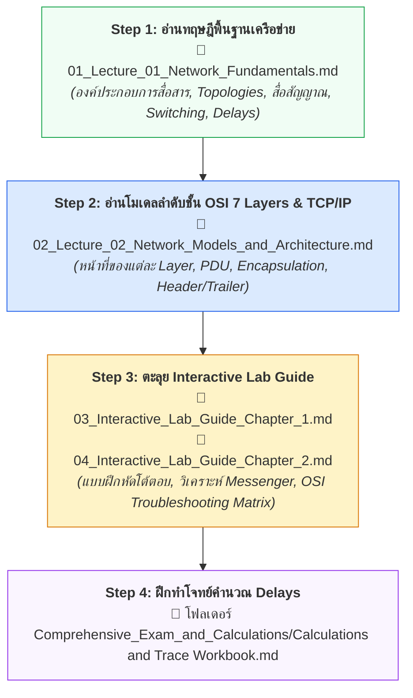

---
tags:
  - networking
  - chapter-01
  - reading-guide
  - fundamentals
  - osi-model
  - tcp-ip
created: 2026-09-05
updated: 2026-09-05
type: reading-guide
---

# 📖 Chapter 01: Fundamentals & Network Models (Study & Reading Guide)

> [!IMPORTANT]
> **เป้าหมายของบทนี้:** ปูพื้นฐานการสื่อสารข้อมูล 5 องค์ประกอบ, ทิศทางการส่งสัญญาณ (Simplex/Half/Full-Duplex), โทโพโลยีเครือข่าย, สื่อสัญญาณ (UTP, Fiber, Wireless), การสลับแพ็กเก็ต vs วงจร (Packet vs Circuit Switching), การคำนวณ Delays ($d_{\text{trans}}, d_{\text{prop}}$), และสถาปัตยกรรมแบ่งชั้น **OSI 7 Layers vs TCP/IP 5 Layers** พร้อมกลไก Encapsulation

---

## 🚦 ลำดับการอ่านบทที่ 1 ให้เข้าใจเร็วที่สุด (Recommended Reading Flow)

---

## 📂 รายชื่อเอกสารในโฟลเดอร์นี้

1. **[[01_Lecture_01_Network_Fundamentals]]** — สรุปเนื้อหาพื้นฐานการสื่อสาร, Topologies, สายสัญญาณ UTP/Fiber, Circuit vs Packet Switching, และ 4 Network Delays
2. **[[02_Lecture_02_Network_Models_and_Architecture]]** — สรุปโมเดล OSI 7 ชั้น vs TCP/IP 5 ชั้น, Flight Booking Analogy, PDU แต่ละชั้น, Bit-by-bit Encapsulation Trace
3. **[[03_Interactive_Lab_Guide_Chapter_1]]** — คู่มือถอดรหัสสื่อการสอนโต้ตอบ Chapter 1 (25 Sections)
4. **[[04_Interactive_Lab_Guide_Chapter_2]]** — คู่มือถอดรหัสสื่อการสอนโต้ตอบ Chapter 2 (23 Sections) พร้อม Troubleshooting Matrix
