---
tags:
  - networking
  - interactive-course
  - chapter1
  - fundamentals
  - topologies
  - transmission-media
created: 2026-08-17
updated: 2026-08-17
type: interactive-lab-guide
---

# Interactive Lab Guide: Chapter 1 — Fundamentals of Computer Networks

> [!INFO] 📂 แหล่งไฟล์อ้างอิงต้นฉบับ (Source Documents in New/ & Root)
> - **บทเรียนแบบโต้ตอบหลัก:** [ch1.html](file:///c:/Project/computer-network-&-Internet/New/ch1.html) *(Chapter 1 Fundamentals: ครบทั้ง 25 Interactive Sections & Widget Data)*
> - **สไลด์บรรยายหลักของอาจารย์:** [Chapter_1_Fundamental-Network_models_1-89.html](file:///c:/Project/computer-network-&-Internet/New/Chapter_1_Fundamental-Network_models_1-89.html) *(สไลด์ 1–89)*
> - **ไฟล์สไลด์ PDF:** [Chapter_1_Introduction.pdf](file:///c:/Project/computer-network-&-Internet/Chapter_1_Introduction.pdf) & [Chapter_1_Introduction_TH.pdf](file:///c:/Project/computer-network-&-Internet/Chapter_1_Introduction_TH.pdf)
> - **หนังสือเรียนอ้างอิง:** *Computer Networking: A Top-Down Approach (8th Edition)* โดย Kurose & Ross — Chapter 1: Computer Networks and the Internet
> - **คอร์สเรียนเว็บแอปพลิเคชัน:** [computer-network-course/ch1/index.html](file:///c:/Project/computer-network-&-Internet/computer-network-course/ch1/index.html)

คู่มือสรุปบทเรียนเชิงปฏิบัติการและเนื้อหาแบบละเอียดสมบูรณ์ 100% จากเอกสารการสอนแบบโต้ตอบ `New/ch1.html` ครอบคลุมทั้ง 25 ส่วนการเรียนรู้ ไดอะแกรมการทำงาน กลไกเชิงลึก การออกแบบระบบเครือข่าย และคลังแบบฝึกหัด/ข้อสอบพร้อมเฉลยละเอียด

---

## สารบัญโครงสร้างเนื้อหา (Interactive Course Roadmap)
1. [[#1. บทนำและความสำคัญของระบบเครือข่ายคอมพิวเตอร์ (What & Why of Computer Networks)]]
2. [[#2. องค์ประกอบ 5 ประการของการสื่อสารข้อมูล (The 5 Components of Data Communication)]]
3. [[#3. ตัวอย่างการสื่อสารจริง: Trace การทำงานของแอป Messenger (Messenger Message Flow Trace)]]
4. [[#4. ทิศทางการไหลของข้อมูล (Data Flow Modes: Simplex, Half Duplex, Full Duplex)]]
5. [[#5. โครงสร้างการเชื่อมต่อทางกายภาพ (Point-to-Point vs Multipoint)]]
6. [[#6. โทโปโลยีของเครือข่าย (Network Topologies) และการวิเคราะห์ความล้มเหลว (Failure Analysis)]]
7. [[#7. การจัดระดับขนาดและขอบเขตพื้นที่เครือข่าย (Network Scales: PAN, LAN, WLAN, SAN, MAN, WAN, Internet)]]
8. [[#8. สถาปัตยกรรมเครือข่ายแบบลำดับชั้น 3 ระดับ (Three-Tier Hierarchical Network Architecture)]]
9. [[#9. สื่อกลางนำสัญญาณ (Transmission Media: Guided & Unguided Media)]]
10. [[#10. เกณฑ์การคัดเลือกสื่อกลางและกรณีศึกษา (Transmission Media Selection Framework & Scenarios)]]
11. [[#11. วิวัฒนาการและประวัติศาสตร์ของระบบอินเทอร์เน็ต (Internet History & Architectural Evolution)]]
12. [[#12. กิจกรรมภาคปฏิบัติ ออกแบบระบบ และคลังแบบทดสอบทบทวน (Interactive Labs, Design Scenarios & Quiz Bank)]]

---

# 1. บทนำและความสำคัญของระบบเครือข่ายคอมพิวเตอร์ (What & Why of Computer Networks)

> [!DEFINITION]
> **Computer Network (เครือข่ายคอมพิวเตอร์):** คือระบบที่ประกอบด้วยอุปกรณ์ประมวลผล (Nodes/Hosts) ตั้งแต่ 2 เครื่องขึ้นไป เชื่อมต่อเข้าด้วยกันผ่านสื่อกลางนำสัญญาณ (Transmission Media) และทำงานร่วมกันโดยอาศัยชุดกฎเกณฑ์ข้อตกลงร่วม (Protocols) เพื่อให้สามารถแลกเปลี่ยนข้อมูลและใช้งานทรัพยากรร่วมกันได้อย่างมีประสิทธิภาพ

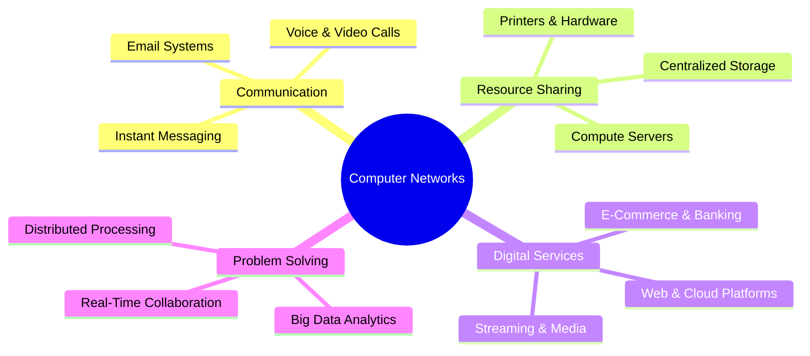

### คุณประโยชน์หลัก 4 มิติ (Why Networks Matter):
1. **Communication (การติดต่อสื่อสาร):** ส่งผ่านข้อความ เสียง ภาพ และวิดีโอระหว่างผู้ใช้งานทั่วโลกแบบ Real-time
2. **Resource Sharing (การแบ่งปันทรัพยากร):** ใช้งานฮาร์ดแวร์ (เช่น เครื่องพิมพ์, อุปกรณ์จัดเก็บ SAN/NAS) และซอฟต์แวร์/ฐานข้อมูลร่วมกัน ลดต้นทุนความซ้ำซ้อน
3. **Digital Services (การให้บริการดิจิทัล):** โครงสร้างพื้นฐานสำหรับ Cloud Computing, ระบบธนาคารออนไลน์, สตรีมมิง และแอปพลิเคชันยุคใหม่
4. **Collaborative Problem Solving (การแก้ปัญหาและการประมวลผลร่วมกัน):** รองรับระบบกระจายงาน (Distributed Computing) และการประมวลผลข้อมูลขนาดใหญ่ข้ามสาขา

---

# 2. องค์ประกอบ 5 ประการของการสื่อสารข้อมูล (The 5 Components of Data Communication)

การสื่อสารข้อมูล (Data Communication) จะเกิดขึ้นได้อย่างสมบูรณ์ ต้องประกอบด้วย 5 องค์ประกอบพื้นฐานที่ทำงานประสานกัน:

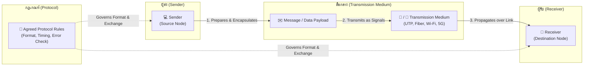

### เจาะลึกหน้าที่ของแต่ละองค์ประกอบ:
1. **Sender (ผู้ส่ง):** อุปกรณ์ต้นทางที่สร้างและเตรียมข้อมูล (Data Source) เช่น เครื่องคอมพิวเตอร์, สมาร์ตโฟน, กล้องวงจรปิด IP Camera, หรือ Sensor Node
2. **Receiver (ผู้รับ):** อุปกรณ์ปลายทาง (Destination) ที่รับสัญญาณเข้ามา แปลงสัญญาณกลับเป็นข้อมูลดิจิทัล (Decoding), ตรวจสอบความถูกต้อง (Error Checking) และนำข้อมูลไปประมวลผลในระดับแอปพลิเคชัน
3. **Message (สารสนเทศ / ข้อมูล):** ข้อมูลที่ต้องการส่งผ่านเครือข่าย อาจอยู่ในรูปแบบ ข้อความตัวอักษร (Text), ตัวเลข (Numbers), ไฟล์เสียง (Audio), รูปภาพ (Images), วิดีโอสตรีม (Video) หรือคำสั่งควบคุม
4. **Transmission Medium (สื่อกลางนำสัญญาณ):** ช่องทางกายภาพที่คลื่นสัญญาณ (Signal) เดินทางผ่าน เช่น สายทองแดงคู่บิดเกลียว (UTP), สายเคเบิลใยแก้วนำแสง (Optical Fiber), หรือคลื่นวิทยุไร้สาย (Wi-Fi, 4G/5G, Microwave)
5. **Protocol (โปรโตคอล):** ชุดของกฎ ข้อบังคับ และรูปแบบมาตรฐานที่ทั้งผู้ส่งและผู้รับตกลงร่วมกัน เพื่อกำหนดไวยากรณ์ (Syntax), ความหมาย (Semantics), ลำดับเวลาการส่ง (Timing), และการตรวจจับข้อผิดพลาด

> [!WARNING]
> หากขาด **Protocol** แม้จะมีฮาร์ดแวร์ ผู้ส่ง ผู้รับ และสายสัญญาณครบถ้วน อุปกรณ์ทั้งสองจะไม่สามารถเข้าใจข้อมูลที่ส่งหากันได้ เสมือนคนที่พูดคนละภาษาและไม่มีล่ามแปล

---

# 3. ตัวอย่างการสื่อสารจริง: Trace การทำงานของแอป Messenger (Messenger Message Flow Trace)

เพื่อทำความเข้าใจการทำงานร่วมกันของทั้ง 5 องค์ประกอบในระบบจริง สื่อการสอนจำลองสถานการณ์การส่งข้อความแชตผ่านแอปพลิเคชัน Messenger:

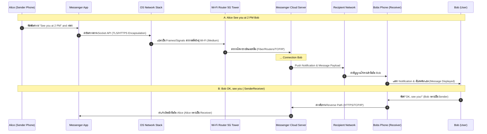

### การวิเคราะห์บทบาทตามสถานการณ์ (Role Dynamic Analysis):
- **Dynamic Role Assignment:** บทบาทของ Sender และ Receiver ไม่ได้ผูกขาดถาวร แต่จะสลับกันตามทิศทางของข้อความในแต่ละจังหวะเวลา (Turn-based communication)
- **Protocol Hierarchy in Action:**
  - *Application Level:* Messenger Protocol (JSON payload, Chat message types, Read receipts)
  - *Security Level:* TLS 1.3 Encryption (ปกป้องข้อความจากการดักฟัง)
  - *Transport Level:* TCP (ควบคุมการส่งข้อมูลให้ครบถ้วน ไม่สูญหาย)
  - *Network Level:* IP (ค้นหาเส้นทางข้ามเครือข่ายอินเทอร์เน็ต)
  - *Physical/Data Link:* Wi-Fi (IEEE 802.11) หรือ 5G NR และสาย Optical Fiber ระหว่าง ISP

---

# 4. ทิศทางการไหลของข้อมูล (Data Flow Modes: Simplex, Half Duplex, Full Duplex)

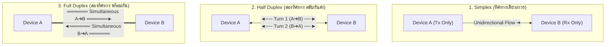

### ตารางเปรียบเทียบโหมดการส่งข้อมูลเชิงลึก:

| คุณลักษณะ | Simplex | Half Duplex | Full Duplex |
| :--- | :--- | :--- | :--- |
| **ทิศทางการส่ง** | ทิศทางเดียว (Unidirectional) ตลอดเวลา | สองทิศทาง (Bidirectional) แต่ต้องสลับกันส่งทีละฝั่ง | สองทิศทาง (Bidirectional) ส่งและรับได้พร้อมกันในเวลาเดียวกัน |
| **การใช้แบนด์วิดท์** | ใช้ช่องสัญญาณทิศทางเดียว 100% | ใช้ช่องสัญญาณร่วมกัน จำเป็นต้องมีกลไก Turn-around | แยกช่องสัญญาณส่ง-รับอิสระ (Tx/Rx pairs) หรือใช้ความถี่คนละย่าน |
| **ความเสี่ยงเกิด Collision** | ไม่มี | มีสูง หากทั้งสองฝั่งส่งพร้อมกัน (ต้องใช้ CSMA/CD หรือ Token) | ไม่มี Collision บนลิงก์เฉพาะ (Switched Dedicated Link) |
| **ตัวอย่างการใช้งาน** | - คีย์บอร์ด $\to$ คอมพิวเตอร์ - เซนเซอร์ IoT $\to$ หน้าจอมอนิเตอร์ - สถานีวิทยุกระจายเสียง / ทีวีดิจิทัล | - วิทยุสื่อสาร Walkie-Talkie (Push-to-Talk) - ระบบ Wi-Fi (IEEE 802.11 แบบ Half-duplex RF) - Traditional Shared Bus Ethernet (Hub) | - โทรศัพท์พื้นฐาน / สมาร์ตโฟน (สนทนาสองทาง) - Switched Full-Duplex Ethernet (100Base-TX/1000Base-T) - ระบบ Video Conference (Zoom/Teams) |

---

# 5. โครงสร้างการเชื่อมต่อทางกายภาพ (Point-to-Point vs Multipoint)

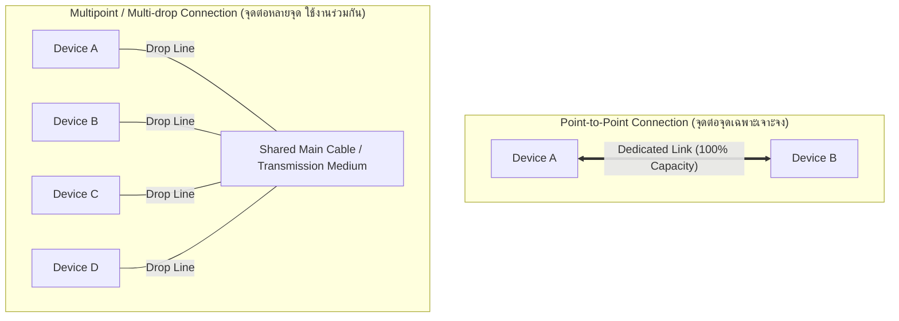

### รายละเอียดเปรียบเทียบโครงสร้างการเชื่อมต่อ:
1. **Point-to-Point (PTP):**
   - มีสายสัญญาณหรือช่องสัญญาณเฉพาะเจาะจง (Dedicated Link) ระหว่างอุปกรณ์ 2 เครื่องเท่านั้น
   - แบนด์วิดท์ทั้งหมดของสายถูกสงวนไว้สำหรับการสื่อสารระหว่างคู่นี้ 100%
   - *ตัวอย่าง:* การเชื่อมต่อระหว่างเครื่องเซิร์ฟเวอร์กับสวิตช์ผ่านสาย LAN ตรง, การเชื่อมต่อ Router-to-Router ข้ามเมืองผ่าน Leased Line
2. **Multipoint (Multi-drop / Broadcast):**
   - อุปกรณ์ตั้งแต่ 3 เครื่องขึ้นไปใช้สายสัญญาณหรือช่องสัญญาณทางกายภาพร่วมกัน (Shared Medium)
   - แบนด์วิดท์จะถูกแบ่งปัน (Shared Capacity) ตามเวลา (Time-shared) หรือตามการใช้งาน
   - จำเป็นต้องมีกลไก Addressing (MAC Address) เพื่อระบุว่าเฟรมข้อมูลนี้ส่งถึงใคร และกลไก Media Access Control เพื่อป้องกันสัญญาณชนกัน
   - *ตัวอย่าง:* สายโคแอกเชียลใน Bus Topology ยุคเดิม, สัญญาณคลื่นวิทยุ Wi-Fi ในห้องเรียนรวม

---

# 6. โทโปโลยีของเครือข่าย (Network Topologies) และการวิเคราะห์ความล้มเหลว (Failure Analysis)

รูปแบบการจัดวางและเชื่อมต่อทางกายภาพของโหนดในเครือข่าย:

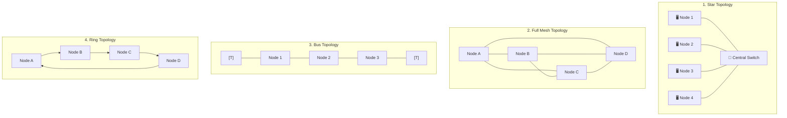

### สูตรคำนวณและคุณลักษณะของโทโปโลยี (Deep-Dive Analysis):

#### 1. Full Mesh Topology (ตาข่ายสมบูรณ์)
- **สูตรคำนวณจำนวนลิงก์ (Number of Physical Links):**
  $$\text{Links} = \frac{N(N - 1)}{2}$$
- **สูตรจำนวนพอร์ต I/O ต่อโหนด:**
  $$\text{Ports per node} = N - 1$$
- *ตัวอย่าง:* เครือข่าย 10 โหนด $\to \text{Links} = \frac{10 \times 9}{2} = 45$ ลิงก์, แต่ละโหนดต้องมี 9 พอร์ต
- **ความทนทานต่อความล้มเหลว (Fault Tolerance):** สูงสุด (ไม่มี Single Point of Failure) หากลิงก์ใดขาด ข้อมูลจะวิ่งอ้อมเส้นทางอื่นได้ทันที
- **ข้อจำกัด:** สิ้นเปลืองสายสัญญาณ ต้นทุนการติดตั้งและการจัดการพอร์ตสูงมาก เหมาะกับ Core Network และ Backbone ศูนย์ข้อมูล

#### 2. Star Topology (ดาว)
- ทุกโหนดเชื่อมต่อไปยังอุปกรณ์ศูนย์กลาง (Central Hub หรือ Switch)
- **จำนวนลิงก์:** $N$ ลิงก์
- **ข้อดี:** ติดตั้งง่าย ขยายโหนดสะดวก ตรวจสอบหาจุดเสีย (Troubleshooting) ง่ายมาก หากสายเส้นใดขาด โหนดอื่นยังทำงานได้ตามปกติ
- **จุดอ่อนวิกฤต:** Central Device เป็น **Single Point of Failure (SPOF)** หากสวิตช์ศูนย์กลางเสีย ทั้งเครือข่ายจะหยุดทำงานทันที

#### 3. Bus Topology (บัส)
- ทุกโหนดเชื่อมต่อเข้ากับสายแกนหลักเส้นเดียว (Backbone Cable) โดยใช้ตัวแยก Drop Line / T-Connector และมีตัวต้านทานปิดหัวท้าย (Terminator เช่น 50 Ohm) เพื่อดูดซับสัญญาณ ป้องกันคลื่นสะท้อน (Signal Reflection)
- **ข้อเสีย:** หากสาย Backbone ขาดที่จุดใดจุดหนึ่ง สัญญาณจะสะท้อนกลับ ทำให้เครือข่ายทั้งระบบล่มทันที และประสิทธิภาพลดฮวบเมื่อจำนวนเครื่องเพิ่มขึ้น

#### 4. Ring Topology (วงแหวน)
- ข้อมูลส่งต่อเป็นทอดๆ จากโหนดสู่โหนดในทิศทางเดียว (Unidirectional Loop) แบบ Token Ring
- **ข้อเสีย:** หากโหนดใดโหนดหนึ่งดับ หรือสายขาด วงแหวนจะขาดตอน ทำให้ระบบล่ม (แก้ปัญหาด้วย Dual-Ring เช่น FDDI)

#### 5. Tree / Hierarchical Topology (ต้นไม้)
- แตกแขนงโหนดลดหลั่นเป็นชั้นๆ จาก Root Hub ไปยัง Secondary Hubs
- **ข้อดี:** รองรับการจัดโซนและการขยายระบบขนาดใหญ่ (Scalable)

#### 6. Hybrid Topology (ไฮบริด)
- การผสมผสานตั้งแต่ 2 โทโปโลยีขึ้นไป เช่น Star-Bus หรือ Star-Ring ในระบบเครือข่ายของมหาวิทยาลัยและองค์กรขนาดใหญ่

---

### ตารางวิเคราะห์ความล้มเหลว (Topology Failure Analysis Matrix):

| โทโปโลยี | ผลกระทบเมื่อโหนดเดี่ยวเสีย (Node Failure) | ผลกระทบเมื่อลิงก์สายสัญญาณขาด (Link Failure) | ระดับค่าใช้จ่าย (Cost) | ความสะดวกในการแก้ไขปัญหา (Troubleshooting) |
| :--- | :--- | :--- | :--- | :--- |
| **Star** | เฉพาะโหนดนั้นดับ โหนดอื่นใช้งานได้ 100% | เฉพาะโหนดนั้นดับ โหนดอื่นใช้งานได้ 100% | ปานกลาง | ง่ายมาก (ดูไฟสถานะพอร์ตสวิตช์) |
| **Mesh** | เฉพาะโหนดนั้นดับ เส้นทางอื่นส่งต่อได้ | ไม่มีผลกระทบ ข้อมูลวิ่งผ่านลิงก์สำรองทันที | สูงมาก ($O(N^2)$) | ซับซ้อน เนื่องจากมีลิงก์จำนวนมาก |
| **Bus** | โหนดอื่นยังทำงานได้ (ถ้า NIC ไม่ลัดวงจร) | **ระบบล่มทั้งเครือข่าย** (สัญญาณสะท้อน) | ต่ำมาก | ยากมาก ต้องไล่ตรวจสายทีละเมตร |
| **Ring** | **ระบบล่มทั้งวง** (ขาดวงจรถ่ายทอดสัญญาณ) | **ระบบล่มทั้งวง** | ปานกลาง | ปานกลาง |
| **Tree** | ดับเฉพาะกิ่งย่อยใต้โหนดนั้น | ดับเฉพาะกิ่งย่อยใต้สายเส้นนั้น | ปานกลาง-สูง | แบ่งตรวจตามชั้นสวิตช์ได้ง่าย |

---

# 7. การจัดระดับขนาดและขอบเขตพื้นที่เครือข่าย (Network Scales: PAN, LAN, WLAN, SAN, MAN, WAN, Internet)

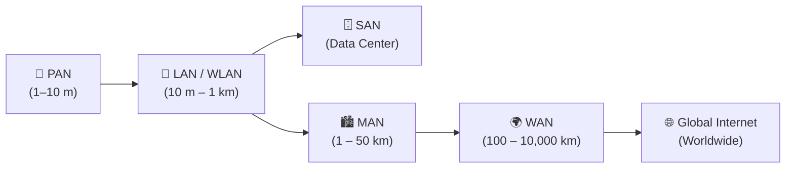

### รายละเอียดจำแนกประเภทเครือข่าย:
1. **PAN (Personal Area Network):**
   - รัศมี: 1–10 เมตร ล้อมรอบตัวบุคคล
   - เทคโนโลยี: Bluetooth, Zigbee, NFC, Ultra-Wideband (UWB)
   - ตัวอย่าง: หูฟังไร้สายเชื่อมกับสมาร์ตโฟน, Smartwatch ซิงค์ข้อมูลสุขภาพ
2. **LAN (Local Area Network):**
   - รัศมี: ภายในห้อง อาคาร หรือกลุ่มอาคารใกล้เคียง (สูงสุด ~1 กม.)
   - เทคโนโลยี: Fast/Gigabit/10G Ethernet (IEEE 802.3), สาย UTP Cat6/Fiber
   - ตัวอย่าง: เครือข่ายห้องปฏิบัติการคอมพิวเตอร์, สำนักงานบริษัท
3. **WLAN (Wireless Local Area Network):**
   - ระบบ LAN แบบไร้สาย ครอบคลุมพื้นที่เฉพาะผ่าน Access Point (AP)
   - เทคโนโลยี: Wi-Fi 4/5/6/6E/7 (IEEE 802.11a/b/g/n/ac/ax/be)
4. **SAN (Storage Area Network):**
   - เครือข่ายความเร็วสูงเฉพาะทางสำหรับเชื่อมต่อเซิร์ฟเวอร์เข้ากับ Disk Arrays และ Storage Devices ระดับ Enterprise
   - เทคโนโลยี: Fibre Channel (FC), iSCSI, NVMe-over-Fabrics (NVMe-oF)
5. **MAN (Metropolitan Area Network):**
   - รัศมี: ระดับเมืองหรือเขตเทศบาล (1–50 กม.)
   - เทคโนโลยี: Metro Ethernet, CWDM/DWDM Optical Rings
   - ตัวอย่าง: เครือข่ายกล้องวงจรปิดจราจรทั่วกรุงเทพฯ, เครือข่ายเคเบิลทีวีเมือง
6. **WAN (Wide Area Network):**
   - รัศมี: ข้ามจังหวัด ข้ามประเทศ หรือข้ามทวีป (100–10,000 กม.)
   - เทคโนโลยี: MPLS, Leased Lines, SD-WAN, ดาวเทียม, สายเคเบิลใต้น้ำ (Submarine Fiber)
   - ตัวอย่าง: เครือข่ายเชื่อมโยงสาขาธนาคารทั่วประเทศ
7. **Internet (Global Network of Networks):**
   - โครงข่ายอภิมหาเครือข่ายที่เชื่อมต่อ WAN, ISP, และ Autonomous Systems (AS) นับหมื่นเข้าด้วยกันทั่วโลกผ่านโปรโตคอล TCP/IP และ BGP

---

# 8. สถาปัตยกรรมเครือข่ายแบบลำดับชั้น 3 ระดับ (Three-Tier Hierarchical Network Architecture)

มาตรฐานการออกแบบเครือข่ายองค์กร (Cisco Enterprise 3-Tier Model) เพื่อความเสถียร ประสิทธิภาพ และการขยายระบบ:

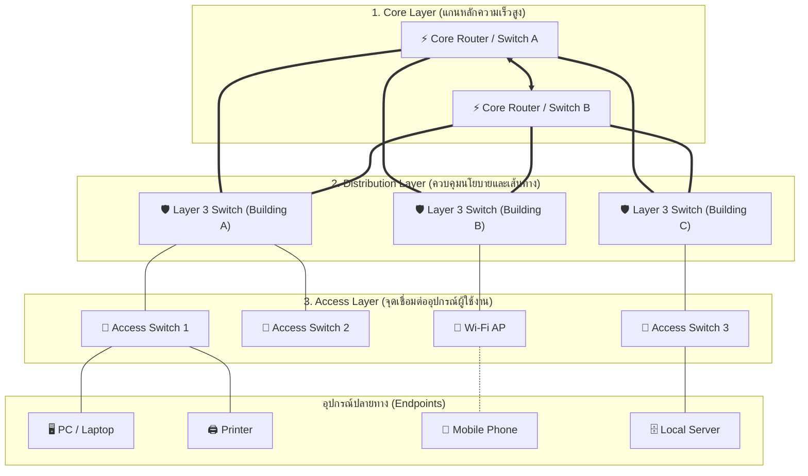

### หน้าที่เชิงลึกของแต่ละ Layer:
1. **Access Layer (ชั้นเข้าถึง):**
   - หน้าที่: เป็นจุดเชื่อมต่อด่านแรกให้อุปกรณ์ End-users (PCs, Laptops, IP Phones, APs) เข้าสู่เครือข่าย
   - ฟังก์ชันหลัก: Port Security (MAC filtering), 802.1X Authentication, VLAN Membership, Quality of Service (QoS Marking), PoE (Power over Ethernet)
2. **Distribution Layer (ชั้นกระจายสัญญาณและควบคุมนโยบาย):**
   - หน้าที่: รวบรวมทราฟฟิก (Aggregation) จาก Access Switches หลายตัว และเป็นจุดเชื่อมต่อไปยัง Core Layer
   - ฟังก์ชันหลัก: Inter-VLAN Routing (Layer 3 Switching), นโยบายความปลอดภัย (Access Control Lists - ACLs), Packet Filtering, ควบคุม Broadcast Domains, และทำ Redundancy Gateway (HSRP/VRRP)
3. **Core Layer (ชั้นแกนหลัก):**
   - หน้าที่: สวิตช์และส่งต่อแพ็กเก็ตด้วยความเร็วสูงสุด (High-speed Backbone Switching) ระหว่าง Distribution Blocks และ Data Center
   - ฟังก์ชันหลัก: Low Latency, High Throughput, Redundant Paths ห้ามทำ Packet Filtering หรือ ACL ซับซ้อนในชั้นนี้เพื่อไม่ให้ความเร็วตก

---

# 9. สื่อกลางนำสัญญาณ (Transmission Media: Guided & Unguided Media)

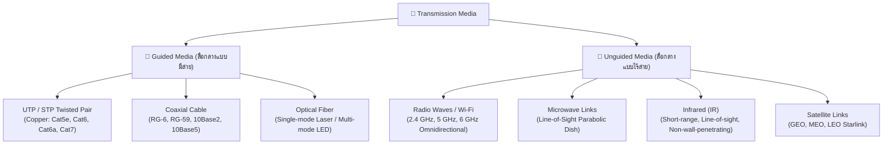

### 1. Guided Media (สื่อกลางแบบใช้สายกายภาพ):
- **UTP (Unshielded Twisted Pair):**
  - โครงสร้าง: ลวดทองแดง 4 คู่ ตีเกลียวเพื่อหักล้างสัญญาณรบกวนแม่เหล็กไฟฟ้าข้ามคู่สาย (Crosstalk Cancellation)
  - ความยาวสูงสุดต่อ Segment: **100 เมตร** (ตามมาตรฐาน TIA/EIA-568)
  - มาตรฐาน: Cat5e (1 Gbps @ 100MHz), Cat6 (1 Gbps @ 250MHz หรือ 10 Gbps ที่ระยะ $\le 55$m), Cat6a (10 Gbps @ 500MHz ที่ระยะเต็ม 100m)
- **Coaxial Cable (สายโคแอกเชียล):**
  - โครงสร้าง: แกนทองแดงเดี่ยว $\to$ ฉนวน Dielectric $\to$ ตะแกรงโลหะชีลด์ป้องกันคลื่นรบกวน $\to$ เปลือกนอก
  - การใช้งาน: เคเบิลโมเด็ม DOCSIS, สายอากาศทีวี, อดีตเคยใช้ทำ 10Base2 (Thinnet) และ 10Base5 (Thicknet)
- **Optical Fiber (สายเคเบิลใยแก้วนำแสง):**
  - ส่งข้อมูลในรูปของพัลส์แสง (Light Pulses) โดยใช้หลักการ **การสะท้อนกลับหมด (Total Internal Reflection)** ระหว่าง Core และ Cladding
  - **Single-Mode Fiber (SMF):** แกน Core ขนาดเล็กมาก (~9 µm), แหล่งกำเนิดแสงเป็น Laser Diode, แสงเดินทางเป็นลำแสงเส้นตรงเดียว ไร้ปัญหา Modal Dispersion ส่งได้ไกลระดับ **10–80+ กิโลเมตร** แบนด์วิดท์มหาศาล (เหมาะกับ Campus Backbone, WAN, Subsea)
  - **Multi-Mode Fiber (MMF):** แกน Core ขนาดใหญ่ (50 หรือ 62.5 µm), แหล่งกำเนิดแสงเป็น LED หรือ VCSEL, ลำแสงสะท้อนไปมาหลายมุม ทำให้เกิดการกระจายของสัญญาณตามเวลา (Modal Dispersion) ระยะส่งจำกัดที่ **300–550 เมตร** (เหมาะกับ Data Center และ LAN ภายในอาคาร)

### 2. Unguided Media (สื่อกลางแบบไร้สาย):
- **Radio Waves (คลื่นวิทยุ / Wi-Fi & Cellular):**
  - คุณสมบัติ: ส่งสัญญาณแบบรอบทิศทาง (Omnidirectional), ทะลุสิ่งกีดขวางและผนังได้ปานกลาง
  - ความถี่: 2.4 GHz (ทะลุได้ดีกว่า แต่สัญญาณชนกันเยอะ แบนด์วิดท์ต่ำ), 5 GHz และ 6 GHz (ความเร็วสูง แบนด์วิดท์กว้าง แต่ทะลุสิ่งกีดขวางได้น้อย)
- **Microwaves (ไมโครเวฟภาคพื้นดิน):**
  - คุณสมบัติ: ลำคลื่นทิศทางตรงแบบจุดต่อจุด (Unidirectional Line-of-Sight), ใช้จานพาราโบลาขนาดใหญ่
  - ข้อจำกัด: สภาพอากาศ ฝนตกหนัก (Rain Fade) และสิ่งกีดขวาง (ต้นไม้/อาคาร) บดบังสัญญาณ
- **Infrared (อินฟราเรด):**
  - คุณสมบัติ: คลื่นความถี่สูง ไม่สามารถทะลุผ่านกำแพงทึบได้ ปลอดภัยจากการดักฟังสัญญาณภายนอกห้อง ระยะสั้น 1–5 เมตร
- **Satellite (ดาวเทียม):**
  - **GEO (Geostationary):** วงโคจร 35,786 กม. ครอบคลุมพื้นที่กว้าง แต่มีค่าความหน่วงการเดินทางสัญญาณสูง ($\text{RTT} \ge 500\text{ ms}$)
  - **LEO (Low Earth Orbit เช่น Starlink):** วงโคจรต่ำ 500–1,200 กม. ความหน่วงต่ำ ($\text{RTT} \approx 20\text{--}40\text{ ms}$)

---

# 10. เกณฑ์การคัดเลือกสื่อกลางและกรณีศึกษา (Transmission Media Selection Framework & Scenarios)

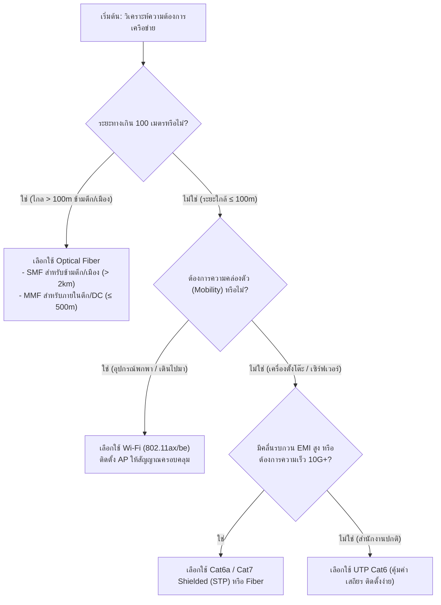

### สรุปคำแนะนำการเลือกใช้งานตามสถานการณ์จริง:

| สถานการณ์การใช้งาน | สื่อกลางที่แนะนำ | เหตุผลทางวิศวกรรม |
| :--- | :--- | :--- |
| **1. เชื่อมโยงระหว่างอาคารห่างกัน 2 กม. เข้าสู่ Data Center** | **Single-Mode Optical Fiber (SMF)** | ระยะทางเกินขีดจำกัด 100m ของทองแดง, ทนต่อฟ้าผ่า/สัญญาณรบกวนภายนอกอาคาร, แบนด์วิดท์ระดับ 10G/40G/100G |
| **2. ห้องปฏิบัติการคอมพิวเตอร์ 40 เครื่องตั้งโต๊ะ** | **UTP Cat6** | อุปกรณ์อยู่กับที่, ระยะสายไม่เกิน 100m, ให้ความเร็ว 1 Gbps คงที่ เสถียร ไร้ปัญหาคลื่นแย่งช่องสัญญาณ, ต้นทุนประหยัด |
| **3. โถงรวมนักศึกษา / ลานกิจกรรม (High-Density Users)** | **Wi-Fi 6 / 6E (IEEE 802.11ax)** | รองรับอุปกรณ์เคลื่อนที่จำนวนมาก (Smartphones, Laptops) โดยไม่ต้องเดินสายไปยังโต๊ะ |
| **4. รีโมตควบคุมเครื่องจักรในห้องแล็บปิดเฉพาะทาง** | **Infrared (IR) หรือ Bluetooth Low Energy** | ระยะใกล้ Line-of-sight, ไม่ทะลุออกนอกห้อง ปลอดภัยต่อการควบคุม |

---

# 11. วิวัฒนาการและประวัติศาสตร์ของระบบอินเทอร์เน็ต (Internet History & Architectural Evolution)

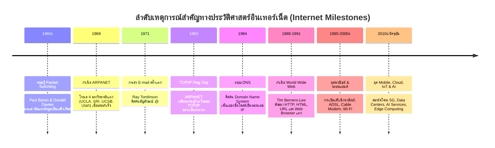

> [!INFO]
> **แก่นความคิดสำคัญของ Packet Switching:**
> ในยุคโทรศัพท์ดั้งเดิม (Circuit Switching) จะต้องจองสายสื่อสารเฉพาะค้างไว้ตลอดการสนทนา แต่ **Packet Switching** จะแบ่งสารสนเทศออกเป็นชิ้นเล็กๆ เรียกว่า "Packets" และส่งผ่านโครงข่ายแบบแบ่งปันทรัพยากร (Statistical Multiplexing) ทำให้สามารถรองรับผู้ใช้งานพร้อมกันได้นับล้านคนอย่างมีประสิทธิภาพและทนทานต่อความเสียหายของเส้นทาง

---

# 12. กิจกรรมภาคปฏิบัติ ออกแบบระบบ และคลังแบบทดสอบทบทวน (Interactive Labs, Design Scenarios & Quiz Bank)

### กิจกรรมที่ 1: การจับคู่คำศัพท์เครือข่าย (Term Matching)
- **Data Communication Components:** `Sender`, `Receiver`, `Message`, `Medium`, `Protocol`
- **Data Flow Modes:** `Simplex`, `Half Duplex`, `Full Duplex`
- **Network Topologies:** `Star`, `Mesh`, `Bus`, `Ring`, `Tree`, `Hybrid`
- **Network Types (Scale):** `PAN`, `LAN`, `WLAN`, `SAN`, `MAN`, `WAN`, `Internet`
- **Transmission Media:** `UTP Cable`, `Coaxial Cable`, `Optical Fiber`, `Wi-Fi`, `Microwave`, `Infrared`

---

### กิจกรรมที่ 2: กรณีศึกษาการออกแบบระบบเครือข่าย (Design Scenarios)

#### Scenario A: ออกแบบห้องแล็บคอมพิวเตอร์ 40 เครื่อง (40-PC Computer Lab)
- **โทโปโลยีที่เลือก:** Star Topology
- **สื่อกลางนำสัญญาณ:** สาย UTP Cat6 ต่อเข้ากับ Access Switch 48 พอร์ตแบบ 1000Base-T
- **เหตุผลประกอบ:** สวิตช์ศูนย์กลางรองรับความเร็ว Full Duplex 1 Gbps ทุกพอร์ต ไม่มีการแย่งแบนด์วิดท์ หากสายเครื่องใดชำรุด เครื่องอื่นยังสอบหรือเรียนได้ตามปกติ

#### Scenario B: ออกแบบเครือข่ายพื้นที่เรียนรู้ร่วม (Shared Learning Center with 200 Mobile Devices)
- **โทโปโลยีที่เลือก:** Star Topology (เชื่อมต่อ AP เข้ากับ PoE Switch)
- **สื่อกลางนำสัญญาณ:** Wi-Fi 6 Access Points (Multi-SSID, Dual-Band 2.4/5 GHz พร้อม MU-MIMO) และใช้สาย UTP Cat6a สำหรับ Uplink จาก AP ไปยัง Distribution Switch
- **เหตุผลประกอบ:** ความยืดหยุ่นสำหรับผู้ใช้อุปกรณ์พกพา และเทคโนโลยี OFDMA/MU-MIMO ใน Wi-Fi 6 ช่วยจัดการปัญหาการชนกันของสัญญาณในพื้นที่ผู้ใช้งานหนาแน่น

---

### คลังข้อสอบทบทวนประจำบท (Interactive Quiz Bank with Explanations):

#### ข้อ 1: อุปกรณ์ที่ทำหน้าที่กำหนดกฎเกณฑ์ ไวยากรณ์ และลำดับเวลาในการสื่อสารข้อมูลตรงกับข้อใด?
- A) Transmission Medium
- B) Protocol *(คำตอบที่ถูกต้อง)*
- C) Receiver
- D) Data Flow
> **คำอธิบาย:** Protocol คือชุดกฎระเบียบ (Set of rules) ที่ควบคุมไวยากรณ์ (Syntax), ความหมาย (Semantics), และการประสานเวลา (Timing) ของการสื่อสาร

#### ข้อ 2: โหมดการส่งข้อมูลที่สามารถส่งและรับข้อมูลได้ทั้งสองทิศทางพร้อมกันในเวลาเดียวกันคือข้อใด?
- A) Simplex
- B) Half Duplex
- C) Full Duplex *(คำตอบที่ถูกต้อง)*
- D) Point-to-Point
> **คำอธิบาย:** Full Duplex ยอมให้ทั้งสองฝั่งส่งและรับข้อมูลได้พร้อมกัน เช่น โทรศัพท์ หรือระบบ Switched Full-Duplex Ethernet

#### ข้อ 3: หากระบบเครือข่ายมีคอมพิวเตอร์ 6 เครื่อง และต้องการเชื่อมต่อแบบ Full Mesh Topology จะต้องใช้สายสัญญาณทั้งหมดกี่เส้น?
- A) 6 เส้น
- B) 12 เส้น
- C) 15 เส้น *(คำตอบที่ถูกต้อง)*
- D) 30 เส้น
> **คำอธิบาย:** คำนวณจากสูตร $\text{Links} = \frac{N(N-1)}{2} = \frac{6 \times 5}{2} = 15$ เส้น

#### ข้อ 4: สื่อกลางนำสัญญาณประเภทใดที่ทนทานต่อการรบกวนของสนามแม่เหล็กไฟฟ้า (EMI) ได้ดีที่สุด และส่งข้อมูลได้ไกลที่สุด?
- A) UTP Cat6
- B) Coaxial Cable
- C) Optical Fiber *(คำตอบที่ถูกต้อง)*
- D) Radio Waves
> **คำอธิบาย:** Optical Fiber ใช้สัญญาณแสงในการนำข้อมูล จึงไม่เหนี่ยวนำสัญญาณรบกวนแม่เหล็กไฟฟ้า (Immune to EMI) และมีการลดทอนสัญญาณต่ำมาก ส่งได้ไกลหลายสิบกิโลเมตร

#### ข้อ 5: ในโครงสร้างเครือข่ายแบบ 3-Tier Layer ใดทำหน้าที่รวบรวมทราฟฟิก กำหนดเส้นทางข้าม VLAN (Inter-VLAN Routing) และบังคับใช้นโยบายความปลอดภัย (ACL)?
- A) Access Layer
- B) Distribution Layer *(คำตอบที่ถูกต้อง)*
- C) Core Layer
- D) Physical Layer
> **คำอธิบาย:** Distribution Layer ทำหน้าที่เป็นสะพานเชื่อมระหว่าง Access Layer และ Core Layer โดยจัดการเรื่อง Routing, ACL, QoS, และ Aggregate Traffic

---

## เอกสารเชื่อมโยงที่เกี่ยวข้อง (Cross-References)
- [[Lecture 1 - Fundamental of Computer Network]] — สรุปเนื้อหาบทที่ 1 ฉบับมาตรฐาน
- [[Interactive Lab Guide - Chapter 2 Network Models & Layered Stack]] — บทเรียนจำลองแบบจำลองเครือข่าย OSI & TCP/IP
- [[Calculations and Trace Workbook]] — แบบฝึกหัดคำนวณลิงก์ Mesh Topology และ Propagation Delay
- [[Computer Network and Internet Master Index]] — ดัชนีรวมสารบัญวิชาเครือข่ายคอมพิวเตอร์
