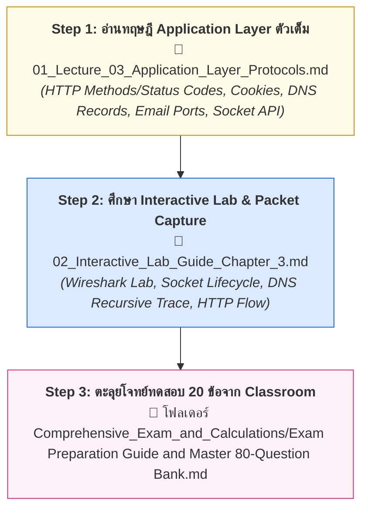

---
tags:
  - networking
  - chapter-02
  - reading-guide
  - application-layer
  - http
  - dns
created: 2026-09-05
updated: 2026-09-05
type: reading-guide
---

# 📖 Chapter 02: Application Layer (Study & Reading Guide)

> [!IMPORTANT]
> **เป้าหมายของบทนี้:** ทำความเข้าใจการทำงานของโพรโทคอลระดับ Application Layer (ชั้นบนสุดที่ติดต่อกับผู้ใช้), สถาปัตยกรรม Client-Server vs P2P, วิวัฒนาการของ HTTP/1.0 ถึง HTTP/3, ระบบชื่อโดเมน (DNS Hierarchy & Query Trace), ระบบอีเมล (SMTP, POP3, IMAP), FTP Dual-Channel, และการเขียนโปรแกรมเครือข่ายด้วย Socket API

---

## 🚦 ลำดับการอ่านบทที่ 2 ให้เข้าใจเร็วที่สุด (Recommended Reading Flow)

---

## 📂 รายชื่อเอกสารในโฟลเดอร์นี้

1. **[[01_Lecture_03_Application_Layer_Protocols]]** — บันทึกการสอนหลักครอบคลุมสไลด์บทที่ 2 (1–119): สถาปัตยกรรม Client-Server, HTTP/1.0-HTTP/3, DNS (A, AAAA, CNAME, MX), SMTP/POP3/IMAP, CDN และ Socket Lifecycle
2. **[[02_Interactive_Lab_Guide_Chapter_3]]** — คู่มือถอดรหัสบทเรียนโต้ตอบ 36 Sections พร้อม Wireshark Trace และ Packet Analysis
