---
tags:
  - networking
  - interactive-course
  - chapter3
  - application-layer
  - http
  - dns
  - dhcp
  - ftp
  - email
  - wireshark
created: 2026-08-17
updated: 2026-08-17
type: interactive-lab-guide
---

# Interactive Lab Guide: Chapter 3 — Application Layer Protocols & Network Services

> [!INFO] 📂 แหล่งไฟล์อ้างอิงต้นฉบับ (Source Documents in New/ & Root)
> - **บทเรียนแบบโต้ตอบหลัก:** [ch3.html](file:///c:/Project/computer-network-&-Internet/New/ch3.html) *(Chapter 3 Application Layer: ครบทั้ง 36 Interactive Sections & Wireshark Data)*
> - **สไลด์บรรยายหลักของอาจารย์:** [Chapter_2_Application_Layer_1-119.html](file:///c:/Project/computer-network-&-Internet/New/Chapter_2_Application_Layer_1-119.html) *(สไลด์ 1–119)*
> - **ไฟล์สไลด์ PDF:** [Chapter_2_Application_Layer.pdf](file:///c:/Project/computer-network-&-Internet/Chapter_2_Application_Layer.pdf)
> - **หนังสือเรียนอ้างอิง:** *Computer Networking: A Top-Down Approach (8th Edition)* โดย Kurose & Ross — Chapter 2: Application Layer
> - **บทเรียนเว็บโต้ตอบ:** [brosing-msg.html](file:///c:/Project/computer-network-&-Internet/New/brosing-msg.html), [email.html](file:///c:/Project/computer-network-&-Internet/New/email.html) & [computer-network-course/ch3/index.html](file:///c:/Project/computer-network-&-Internet/computer-network-course/ch3/index.html)
> - **แบบทดสอบจริงจาก Classroom:** [exam.md](file:///c:/Project/computer-network-&-Internet/New/exam.md)

คู่มือสรุปบทเรียนเชิงปฏิบัติการและเนื้อหาแบบละเอียดสมบูรณ์ 100% จากเอกสารการสอนแบบโต้ตอบ `New/ch3.html` ครอบคลุมทั้ง 36 ส่วนการเรียนรู้ สถาปัตยกรรม Client-Server vs P2P, กลไก Socket Interface API, ระบบ DNS แบบกระจายศูนย์, วิวัฒนาการ HTTP/1.0 ถึง HTTP/3, การจัดการสถานะ Cookies & Session, ระบบ Caching และ Proxies, ความปลอดภัย HTTPS/TLS, โปรโตคอลคอนฟิก DHCP (DORA & Relay Agent), การถ่ายโอนไฟล์ FTP แบบ 2 แชนเนล, ระบบอีเมล (SMTP, POP3, IMAP, MIME), และห้องปฏิบัติการวิเคราะห์ Packet Capture (Wireshark) พร้อมเฉลยข้อสอบละเอียด

---

## สารบัญโครงสร้างเนื้อหา (Interactive Course Roadmap)
1. [[#1. ตำแหน่งและบทบาทของ Application Layer (Where the Application Layer Sits)]]
2. [[#2. ความแตกต่างระหว่าง Application Software กับ Application-Layer Protocol]]
3. [[#3. สถาปัตยกรรมของแอปพลิเคชันเครือข่าย (Network Application Architectures: Client-Server vs P2P vs Hybrid/CDN)]]
4. [[#4. การสื่อสารแบบคู่โปรเซสและอินเทอร์เฟซ Socket (Process Pairs & Socket Interface API)]]
5. [[#5. ระบบชื่อโดเมน (Domain Name System - DNS): โครงสร้าง, ลำดับชั้น และระเบียนทรัพยากร (Resource Records)]]
6. [[#6. กลไกการสืบค้น DNS แบบ Recursive vs Iterative (DNS Resolution Step-by-Step Trace)]]
7. [[#7. โปรโตคอลเว็บ HTTP / HTTPS: หลักการ, โครงสร้างข้อความ และรหัสสถานะ (Status Codes)]]
8. [[#8. วิวัฒนาการของโปรโตคอลเว็บ (HTTP Evolution: HTTP/0.9 $\to$ HTTP/1.0 $\to$ HTTP/1.1 $\to$ HTTP/2 $\to$ HTTP/3)]]
9. [[#9. การจัดการสถานะบนเว็บ (Web State Management: Stateless HTTP, Cookies, Session, LocalStorage & JWT)]]
10. [[#10. ประสิทธิภาพการโหลดเว็บ: ระบบ Caching, Conditional GET และตัวกลาง Proxies]]
11. [[#11. การสื่อสารเว็บแบบเข้ารหัสปลอดภัย (HTTPS & TLS 1.3 Architecture)]]
12. [[#12. โปรโตคอลกำหนดค่า IP อัตโนมัติ (DHCP Lifecycle: DORA Process & DHCP Relay Agent)]]
13. [[#13. โปรโตคอลถ่ายโอนไฟล์ FTP: สถาปัตยกรรม 2 แชนเนล (Control vs Data) และ Active/Passive Mode]]
14. [[#14. สถาปัตยกรรมและโปรโตคอลระบบอีเมล (Email Suite: SMTP, POP3, IMAP, และ MIME)]]
15. [[#15. ห้องปฏิบัติการวิเคราะห์แพ็กเก็ต (Packet Capture & Wireshark Traffic Analysis Lab)]]
16. [[#16. สรุปภาพรวมความสัมพันธ์ระหว่างโปรโตคอล (End-to-End Application Story & Quiz Bank)]]

---

# 1. ตำแหน่งและบทบาทของ Application Layer (Where the Application Layer Sits)

> [!DEFINITION]
> **Application Layer (Layer 5 ในโมเดล TCP/IP):** คือชั้นบนสุดของโครงสร้างเครือข่ายที่ทำหน้าที่เป็นตัวกลางเชื่อมต่อระหว่างผู้ใช้งาน (User Interface / Software) กับบริการเครือข่าย โดยกำหนดกฎเกณฑ์ ไวยากรณ์ และความหมายของข้อความ (Application Messages) ที่โปรแกรมประยุกต์ใช้ในการสนทนาข้ามเครือข่าย

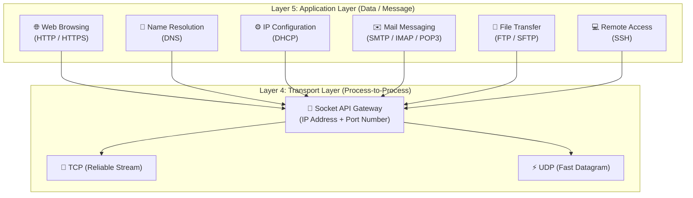

---

# 2. ความแตกต่างระหว่าง Application Software กับ Application-Layer Protocol

| มิติเปรียบเทียบ | Application Software (โปรแกรมประยุกต์) | Application-Layer Protocol (โปรโตคอลระดับแอปพลิเคชัน) |
| :--- | :--- | :--- |
| **นิยาม** | ซอฟต์แวร์ที่ติดตั้งบนเครื่องของ User หรือ Server ที่ผู้ใช้เปิดใช้งานโดยตรง | ข้อกำหนดมาตรฐาน (RFC Specification) ที่กำหนดรูปแบบและกฎการแลกเปลี่ยนข้อความ |
| **สิ่งที่จัดการ** | User Interface (UI), หน้าต่างโปรแกรม, ปุ่มกด, การเรนเดอร์กราฟิก, การจัดการไฟล์ในเครื่อง | โครงสร้างฟิลด์ข้อความ (Request/Response Syntax), ลำดับการส่ง (Timing), และความหมายของคำสั่ง (Semantics) |
| **ตัวอย่าง** | Google Chrome, Mozilla Firefox, Microsoft Outlook, Discord, FileZilla | **HTTP/1.1, HTTP/2, HTTP/3, DNS, SMTP, IMAP, FTP** |
| **ความเป็นอิสระ** | เบราว์เซอร์ต่างค่าย (Chrome vs Safari) เขียนโค้ด UI ต่างกันสิ้นเชิง | แต่ทั้งคู่ใช้โปรโตคอล **HTTP/HTTPS** เดียวกัน จึงเปิดดูหน้าเว็บเดียวกันจาก Web Server เดียวกันได้ 100% |

---

# 3. สถาปัตยกรรมของแอปพลิเคชันเครือข่าย (Network Application Architectures: Client-Server vs P2P vs Hybrid/CDN)

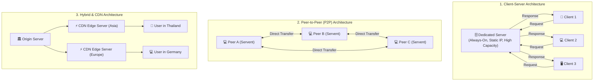

### ตารางเปรียบเทียบข้อดีและข้อจำกัดของแต่ละสถาปัตยกรรม:

| คุณลักษณะ | Client-Server | Peer-to-Peer (P2P) | Hybrid / CDN |
| :--- | :--- | :--- | :--- |
| **โครงสร้าง** | มีเซิร์ฟเวอร์ศูนย์กลางที่เปิดทำงานตลอดเวลา (Always-on host) และมีหมายเลข IP คงที่ | ไม่มีเซิร์ฟเวอร์ศูนย์กลางถาวร โหนดผู้ใช้ (Peers) ทำหน้าที่เป็นทั้ง Client และ Server (Servent) | เซิร์ฟเวอร์ต้นทาง (Origin) กระจายคอนเทนต์ไปยัง Edge Caches ทั่วโลก |
| **ความสามารถในการขยายตัว (Scalability)** | จำกัดที่ขีดความสามารถของ Server (Server Bottleneck) หากผู้ใช้เพิ่มขึ้นมหาศาล ระบบจะล่ม | **Self-Scalability:** ยิ่งมี Peers เข้ามามาก ความสามารถในการอัปโหลดแบ่งปันข้อมูลยิ่งสูงขึ้น | ขยายตัวได้มหาศาล รองรับผู้ใช้หลักสิบล้านคนพร้อมกันได้สบาย |
| **การบริหารจัดการและความปลอดภัย** | ง่าย ควบคุมข้อมูลและนโยบายความปลอดภัยได้จากจุดเดียว | ยากต่อการควบคุมความถูกต้อง ปัญหาลิขสิทธิ์ และความปลอดภัย | บริหารจัดการผ่านระบบคลาวด์และ DNS Anycast |
| **ตัวอย่างการใช้งาน** | เว็บไซต์ทั่วไป, เว็บเมล, ระบบฐานข้อมูลองค์กร | BitTorrent, IPFS, Blockchain/Bitcoin, VoIP ในยุคแรก | Netflix, YouTube, Cloudflare, Akamai, Facebook Video CDN |

---

# 4. การสื่อสารแบบคู่โปรเซสและอินเทอร์เฟซ Socket (Process Pairs & Socket Interface API)

> [!DEFINITION]
> **Socket (ซ็อกเก็ต):** คืออินเทอร์เฟซโปรแกรม (Application Programming Interface - API) ที่ทำหน้าที่เป็น "ประตู (Doorway)" เชื่อมต่อระหว่างโปรเซสของแอปพลิเคชัน (ใน Layer 5) กับสแต็กเครือข่ายของระบบปฏิบัติการ (ใน Layer 4 Transport Layer)

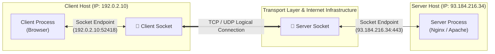

### การระบุตำแหน่ง Socket Endpoint:
$$\text{Socket Address} = \text{IP Address} + \text{Port Number}$$
- **IP Address:** ใช้ระบุโฮสต์ต้นทางและโฮสต์ปลายทางในเครือข่ายระดับโลก (Host-to-Host)
- **Port Number:** ใช้ระบุโปรเซสหรือเซอร์วิสที่กำลังทำงานอยู่ภายในโฮสต์เครื่องนั้น (Process-to-Process)

### ช่วงหมายเลขพอร์ตมาตรฐาน (Port Number Ranges):
1. **Well-Known Ports (0 – 1,023):** สงวนไว้สำหรับบริการมาตรฐานสากลที่กำหนดโดย IANA (เช่น Port 80 HTTP, 443 HTTPS, 53 DNS, 22 SSH, 25 SMTP)
2. **Registered Ports (1,024 – 49,151):** สำหรับบริการของบริษัทและแอปพลิเคชันเฉพาะ (เช่น Port 3306 MySQL, 5432 PostgreSQL, 8080 HTTP-Alt)
3. **Dynamic / Private / Ephemeral Ports (49,152 – 65,535):** สุ่มสร้างโดยระบบปฏิบัติการของ Client สำหรับใช้เป็น Source Port ชั่วคราวในแต่ละรอบการติดต่อ

---

### วงจรชีวิตของ Socket API ในการเชื่อมต่อแบบ TCP (Socket API State Lifecycle):

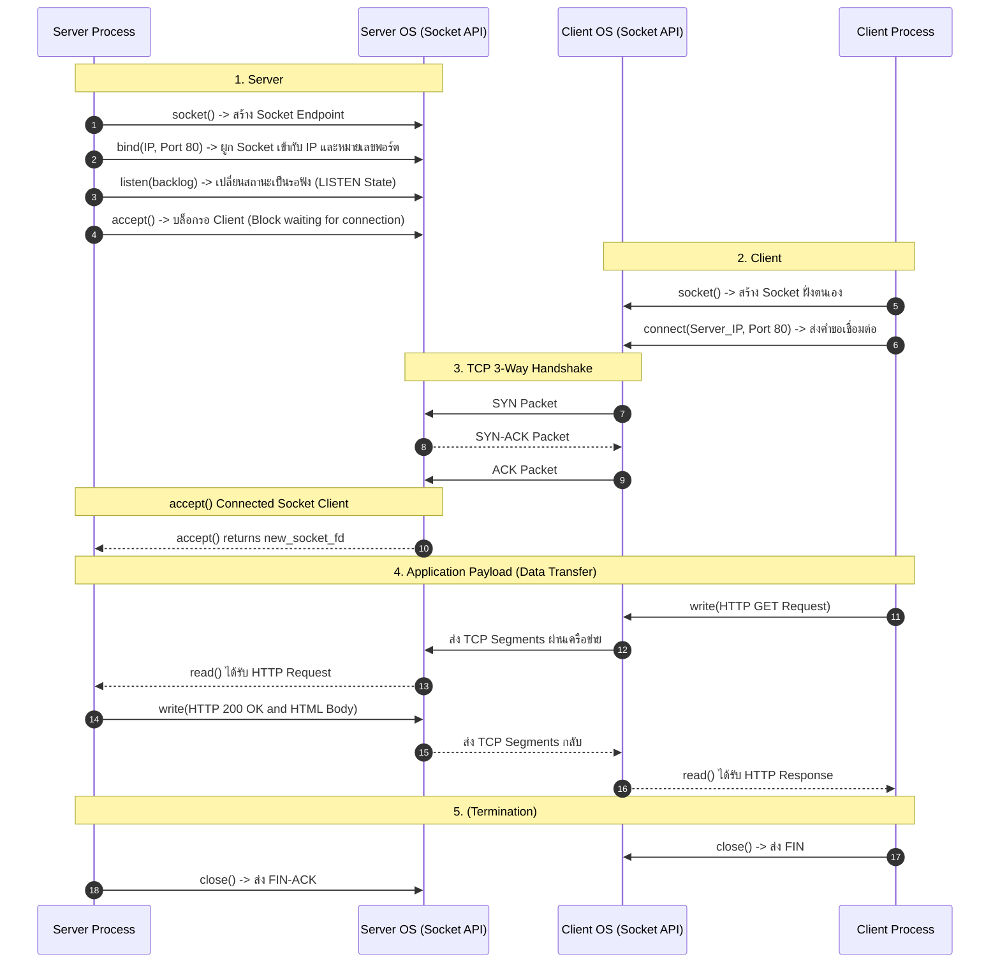

---

# 5. ระบบชื่อโดเมน (Domain Name System - DNS): โครงสร้าง, ลำดับชั้น และระเบียนทรัพยากร (Resource Records)

> [!DEFINITION]
> **Domain Name System (DNS):** คือฐานข้อมูลแบบกระจายศูนย์และมีลำดับชั้น (Hierarchical Distributed Database) ทำหน้าที่หลักในการแปลงชื่อโฮสต์ที่เป็นข้อความ (เช่น `www.example.com`) ให้เป็นหมายเลข IP Address (เช่น `93.184.216.34`) ทำงานบนพอร์ต **UDP 53** (และใช้ TCP 53 สำหรับ Zone Transfer หรือคำขอที่มีขนาดข้อมูลเกิน 512 ไบต์)

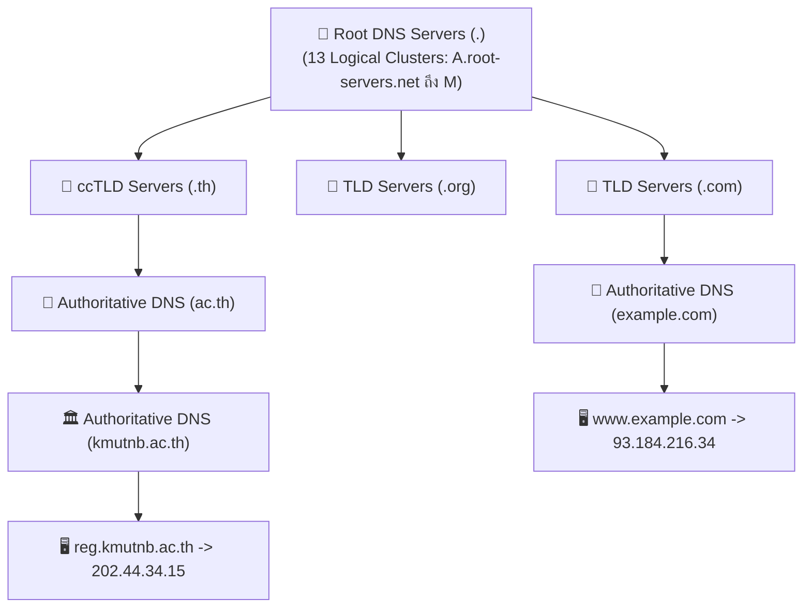

### โครงสร้างระเบียนทรัพยากร DNS (Resource Record - RR Format):
รูปแบบของ RR คือ `(Name, Value, Type, TTL)` โดยที่ **TTL (Time to Live)** คือระยะเวลาที่คำตอบนี้สามารถถูกเก็บใน Cache ได้ก่อนต้องสืบค้นใหม่

| Record Type | ฟังก์ชันการทำงาน | ตัวอย่างระเบียน DNS (RR Syntax) |
| :--- | :--- | :--- |
| **A** | แปลงชื่อโฮสต์เป็นหมายเลข **IPv4 Address** (32-bit) | `www.example.com.  3600  IN  A  93.184.216.34` |
| **AAAA** | แปลงชื่อโฮสต์เป็นหมายเลข **IPv6 Address** (128-bit) | `www.example.com.  3600  IN  AAAA  2606:2800:220:1:248:1893:25c8:1946` |
| **CNAME** | กำหนดชื่อเสมือน (Canonical Name / Alias) ชี้ไปยังชื่อจริง | `blog.example.com. 3600  IN  CNAME  example.netlify.app.` |
| **MX** | ระบุชื่อ Mail Server ที่รับผิดชอบการรับอีเมลของโดเมน | `example.com.      3600  IN  MX  10  mail.example.com.` |
| **NS** | ระบุชื่อ Authoritative Name Server ที่ดูแลโซนโดเมนนั้น | `example.com.      86400 IN  NS  ns1.example.com.` |
| **PTR** | Reverse DNS Lookup: แปลงหมายเลข IP กลับเป็นชื่อโฮสต์ | `34.216.184.93.in-addr.arpa. 3600 IN PTR www.example.com.` |
| **TXT** | เก็บข้อความทั่วไป ใช้สำหรับยืนยันตัวตนเจ้าของโดเมน, SPF, DKIM | `example.com.      3600  IN  TXT  "v=spf1 include:_spf.google.com ~all"` |
| **SOA** | Start of Authority: ระบุข้อมูลการบริหารจัดการโซน, Serial, Refresh timer | `example.com.      86400 IN  SOA  ns1.example.com. admin.example.com. (...)` |

---

# 6. กลไกการสืบค้น DNS แบบ Recursive vs Iterative (DNS Resolution Step-by-Step Trace)

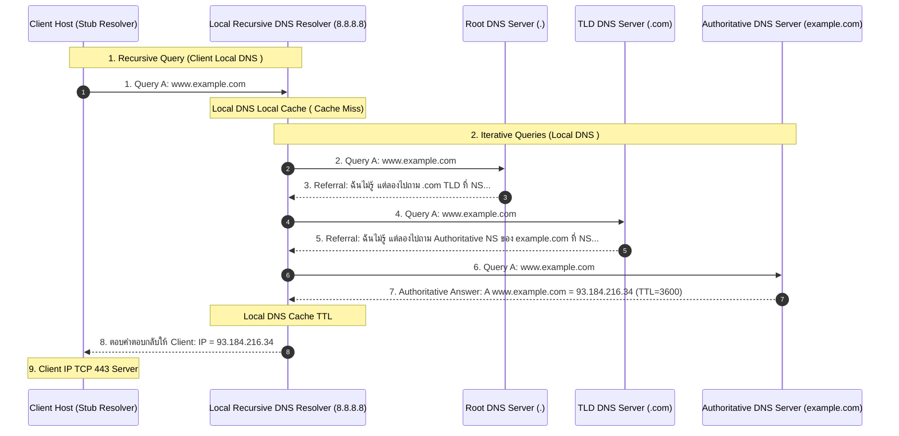

---

# 7. โปรโตคอลเว็บ HTTP / HTTPS: หลักการ, โครงสร้างข้อความ และรหัสสถานะ (Status Codes)

> [!DEFINITION]
> **HTTP (Hypertext Transfer Protocol):** คือโปรโตคอลการสื่อสารใน Application Layer ที่ทำงานตามรูปแบบ **Request–Response Model** แบบไร้สถานะ (Stateless) ระหว่าง Web Client (เบราว์เซอร์) กับ Web Server

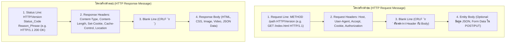

### การวิเคราะห์โครงสร้าง URL (URL Anatomy Breakdown):

```

  https://  www.example.com  :443  /courses/ch3  ?week=4&topic=http  #quiz
  |______|  |______________|  |___|  |___________|  |________________|  |___|

   Scheme      Host / FQDN    Port       Path         Query String     Fragment

```

---

### ตารางหมวดหมู่รหัสสถานะ HTTP (HTTP Status Code Taxonomy):

| รหัสสถานะ | หมวดหมู่ | ความหมายและกรณีการใช้งานจริง | ตัวอย่างสำคัญ |
| :--- | :--- | :--- | :--- |
| **1xx** | Informational | แจ้งสถานะเบื้องต้นว่าได้รับ Request แล้วและกำลังดำเนินการ | `100 Continue`, `101 Switching Protocols` (อัปเกรดเป็น WebSocket) |
| **2xx** | Success | เซิร์ฟเวอร์ได้รับ เข้าใจ และประมวลผลคำขอสำเร็จสมบูรณ์ | `200 OK` (สำเร็จ มี Body ส่งกลับ), `201 Created` (สร้าง Resource ใหม่สำเร็จ), `204 No Content` (สำเร็จแต่ไม่มีเนื้อหา Body ส่งกลับ) |
| **3xx** | Redirection | แจ้งให้ Client ต้องส่ง Request ใหม่ไปยัง URL ปลายทางอื่น | `301 Moved Permanently` (ย้ายถาวร เบราว์เซอร์จะจำ URL ใหม่), `302 Found` (ย้ายชั่วคราว), `304 Not Modified` (ไฟล์ไม่เปลี่ยนแปลง ใช้ข้อมูลใน Cache ได้ทันที) |
| **4xx** | Client Error | เกิดข้อผิดพลาดจากฝั่งผู้ส่ง เช่น Syntax ผิด หรือไม่มีสิทธิ์ | `400 Bad Request` (คำขอมีไวยากรณ์ผิดพลาด), `401 Unauthorized` (ต้องยืนยันตัวตน), `403 Forbidden` (เซิร์ฟเวอร์ปฏิเสธการเข้าถึง), `404 Not Found` (ไม่พบไฟล์), `429 Too Many Requests` (ส่งคำขอถี่เกินขีดจำกัด Rate Limit) |
| **5xx** | Server Error | เซิร์ฟเวอร์เกิดข้อผิดพลาดในการประมวลผลคำขอที่ถูกต้อง | `500 Internal Server Error` (โค้ดเซิร์ฟเวอร์ Crash), `502 Bad Gateway` (พร็อกซีได้รับคำตอบผิดพลาดจากเซิร์ฟเวอร์หลังบ้าน), `503 Service Unavailable` (เซิร์ฟเวอร์ทำงานหนักเกินไปหรือกำลังปรับปรุง), `504 Gateway Timeout` (รอคำตอบจากหลังบ้านนานเกินเวลา) |

---

# 8. วิวัฒนาการของโปรโตคอลเว็บ (HTTP Evolution: HTTP/0.9 $\to$ HTTP/1.0 $\to$ HTTP/1.1 $\to$ HTTP/2 $\to$ HTTP/3)

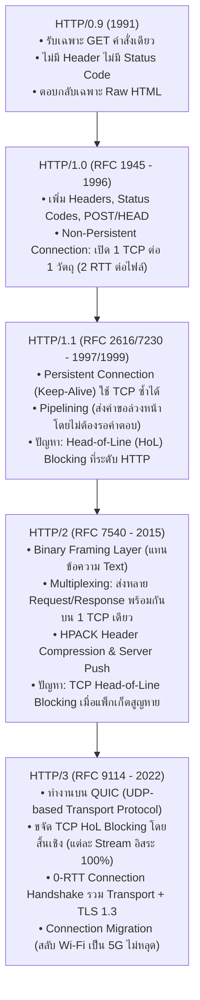

### การวิเคราะห์เวลาหน่วงของการเชื่อมต่อ (Connection Delay Comparison):
1. **Non-Persistent HTTP (HTTP/1.0):**
   - การดึงข้อมูล 1 วัตถุ ต้องใช้เวลา:
     $$\text{Total Time} = 2 \times \text{RTT} + \text{Transmission Time}$$
   - (1 RTT สำหรับ TCP 3-Way Handshake + 1 RTT สำหรับ HTTP Request/Response)
   - หากหน้าเว็บมีรูปภาพ 10 รูป ต้องเปิด-ปิด TCP 10 ครั้ง สิ้นเปลืองแบนด์วิดท์และเวลาอย่างมหาศาล
2. **Persistent HTTP (HTTP/1.1):**
   - เปิด TCP ครั้งแรก ($1\text{ RTT}$) จากนั้นส่งคำขอวัตถุต่อๆ ไปได้บนการเชื่อมต่อเดิม ($1\text{ RTT}$ ต่อนัด)
3. **HTTP/3 over QUIC:**
   - รวมการเชื่อมต่อ Transport และการแลกเปลี่ยนกุญแจ TLS 1.3 ไว้ใน Handshake เดียว ($1\text{ RTT}$ หรือ $0\text{ RTT}$ สำหรับการเชื่อมต่อซ้ำ)

---

# 9. การจัดการสถานะบนเว็บ (Web State Management: Stateless HTTP, Cookies, Session, LocalStorage & JWT)

เนื่องจากแกนกลางของโปรโตคอล HTTP มีคุณสมบัติเป็น **Stateless (ไร้สถานะ)** คือเซิร์ฟเวอร์จะไม่จดจำความเชื่อมโยงระหว่าง Request ก่อนหน้ากับ Request ถัดไป เว็บแอปพลิเคชันจึงต้องใช้กลไกเสริมเพื่อรักษาเซสชันการล็อกอินและตะกร้าสินค้า:

```mermaid
sequenceDiagram
    autonumber
    participant User as User Browser
    participant Server as Web Server
    participant DB as Database  Session Store

    Note over User,Server: 1.
    User->>Server: POST /login (Username & Password)
    Note over Server,DB: Session ID xyz789
    Server->>DB: บันทึก Session ID "xyz789" (User: Alice, Role: Admin)
    Server-->>User: 200 OK and Header: Set-Cookie: session_id=xyz789; Secure; HttpOnly; SameSite=Strict

    Note over User: Cookie

    Note over User,Server: 2. (Request )
    User->>Server: GET /profile and Header: Cookie: session_id=xyz789
    Note over Server,DB: Cookie Database
    Server->>DB: ตรวจสอบ Session "xyz789" -> พบว่าเป็น Alice
    Server-->>User: 200 OK (แสดงหน้าข้อมูลส่วนตัวของ Alice อย่างถูกต้อง)

```

### เปรียบเทียบเทคโนโลยีการจัดเก็บสถานะบน Web Client:

| เทคโนโลยี | ขนาดความจุ | การส่งไปกับ HTTP Request | ความปลอดภัย / ข้อควรระวัง |
| :--- | :--- | :--- | :--- |
| **Cookies** | ~4 KB | **ส่งแนบไปกับ Header ทุก Request อัตโนมัติ** | ป้องกัน XSS ด้วยแฟล็ก `HttpOnly`, ป้องกัน Sniffing ด้วย `Secure`, ป้องกัน CSRF ด้วย `SameSite` |
| **LocalStorage** | 5 – 10 MB | ไม่ส่งไปกับ Request (อ่านผ่าน JavaScript) | เก็บข้อมูลถาวรจนกว่าจะถูกล้างเสี่ยงต่อการโดนโจมตีแบบ XSS |
| **SessionStorage** | 5 MB | ไม่ส่งไปกับ Request | ข้อมูลจะถูกลบอัตโนมัติทันทีที่ปิดแท็บเบราว์เซอร์ |
| **JWT (JSON Web Token)**| ไม่จำกัด | ส่งผ่าน Header `Authorization: Bearer <Token>` | Stateless Token บรรจุ Signature และ Payload ไม่ต้องค้นฐานข้อมูลฝั่ง Server |

---

# 10. ประสิทธิภาพการโหลดเว็บ: ระบบ Caching, Conditional GET และตัวกลาง Proxies

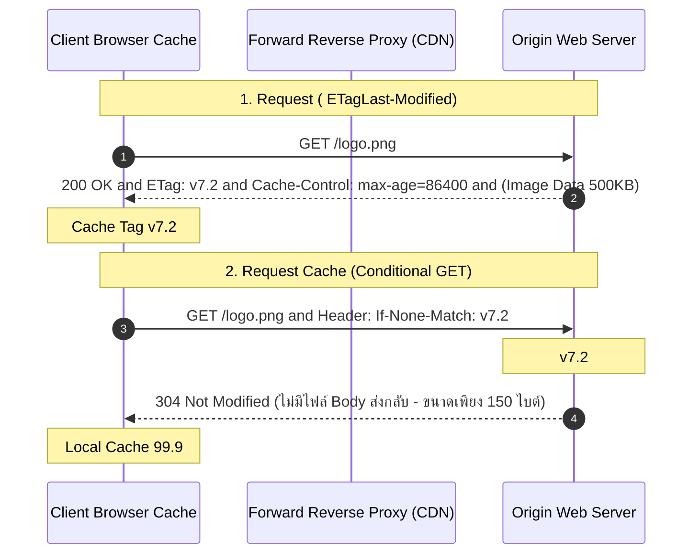

### การจำแนกประเภทของ Web Intermediaries:
1. **Forward Proxy:** ติดตั้งอยู่ฝั่ง Client เพื่อทำหน้าที่ควบคุมนโยบายการออกเน็ตของพนักงาน กรองเว็บไซต์อันตราย (Content Filtering) และปกปิด IP จริงของ Client
2. **Reverse Proxy (เช่น Nginx, HAProxy, Cloudflare Edge):** ติดตั้งอยู่หน้า Origin Server เพื่อทำหน้าที่กระจายโหลด (Load Balancing), ทำ SSL/TLS Offloading, ป้องกันการโจมตี DDoS, และทำ Web Cache กระจายคอนเทนต์ให้ผู้ใช้ทั่วโลก

---

# 11. การสื่อสารเว็บแบบเข้ารหัสปลอดภัย (HTTPS & TLS 1.3 Architecture)

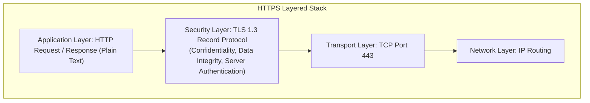

### เสาหลักความปลอดภัย 3 ประการของ TLS (CIA Model in TLS):
1. **Confidentiality (การรักษาความลับ):** เข้ารหัสข้อมูลด้วยอัลกอริทึม Symmetric Encryption (เช่น AES-GCM, ChaCha20) ทำให้บุคคลภายนอกที่ดักจับแพ็กเก็ตมองเห็นเป็นเพียงตัวเลขสุ่ม
2. **Integrity (ความถูกต้องสมบูรณ์):** ตรวจสอบว่าข้อมูลไม่ถูกแอบแก้ไขหรือดัดแปลงระหว่างทางด้วย Message Authentication Code (HMAC)
3. **Authentication (การยืนยันตัวตน):** ตรวจสอบความถูกต้องของใบรับรองดิจิทัล (X.509 Digital Certificate) ของเซิร์ฟเวอร์ที่ลงนามโดย Certificate Authority (CA) ที่น่าเชื่อถือ ป้องกันการปลอมตัวแบบ Man-in-the-Middle (MitM)

---

# 12. โปรโตคอลกำหนดค่า IP อัตโนมัติ (DHCP Lifecycle: DORA Process & DHCP Relay Agent)

> [!DEFINITION]
> **DHCP (Dynamic Host Configuration Protocol):** คือโปรโตคอลในระดับ Application Layer ที่ช่วยแจกจ่ายการตั้งค่าเครือข่ายให้แก่โฮสต์โดยอัตโนมัติ ได้แก่ หมายเลข IP Address, Subnet Mask, Default Gateway, และ DNS Server IP ทำงานบน **UDP Port 67 (Server)** และ **UDP Port 68 (Client)**

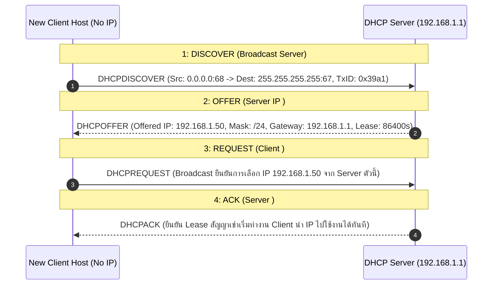

### กลไก DHCP Relay Agent (การข้ามเขต Broadcast Domain):
เนื่องจากแพ็กเก็ต `DHCPDISCOVER` เป็น Broadcast (L2 `FF:FF:FF:FF:FF:FF` และ L3 `255.255.255.255`) ซึ่งโดยธรรมชาติ **Router จะไม่ส่งต่อ Broadcast ข้าม Interface** ดังนั้น หาก DHCP Server ตั้งอยู่คนละ Subnet จึงจำเป็นต้องเปิดใช้งาน **DHCP Relay Agent** (เช่น คำสั่ง `ip helper-address` บน Cisco Router) เพื่อดักจับ Broadcast แล้วแปลงเป็น Unicast ส่งตรงไปยัง IP ของเซิร์ฟเวอร์ศูนย์กลาง

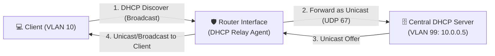

---

# 13. โปรโตคอลถ่ายโอนไฟล์ FTP: สถาปัตยกรรม 2 แชนเนล (Control vs Data) และ Active/Passive Mode

> [!DEFINITION]
> **FTP (File Transfer Protocol - RFC 959):** คือโปรโตคอลถ่ายโอนไฟล์ที่ใช้สถาปัตยกรรมแยก 2 การเชื่อมต่อ (Dual-Connection Architecture) ระหว่างคำสั่งควบคุมกับข้อมูลไฟล์จริง

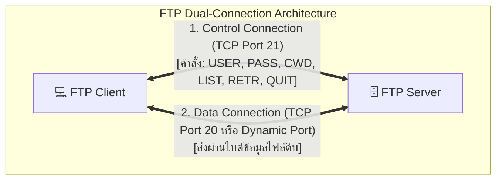

### การเปรียบเทียบ Active Mode vs Passive Mode ใน FTP:
1. **Active Mode:**
   - Client เปิด Control Connection ไปยัง Server Port 21
   - Client ส่งคำสั่ง `PORT IP,Port_N` เพื่อแจ้งให้ Server ทราบ
   - **Server เป็นฝ่ายเปิด Data Connection จาก Port 20 ย้อนกลับมาหา Client Port N**
   - *ปัญหา:* ไฟร์วอลล์ฝั่ง Client หรือเราเตอร์ NAT จะบล็อกการเชื่อมต่อขาเข้านี้ ทำให้ส่งไฟล์ไม่ผ่าน
2. **Passive Mode (PASV):**
   - Client ส่งคำสั่ง `PASV` บน Control Channel
   - Server สุ่มเปิดพอร์ตว่างขนาดใหญ่ (Dynamic High Port เช่น Port 50021) แล้วตอบกลับให้ Client ทราบ
   - **Client เป็นฝ่ายเปิด Data Connection ออกไปหา Server เอง**
   - *ข้อดี:* ใช้งานผ่านไฟร์วอลล์และ NAT ได้อย่างราบรื่น (เป็นโหมดมาตรฐานที่ใช้งานในปัจจุบัน)

---

# 14. สถาปัตยกรรมและโปรโตคอลระบบอีเมล (Email Suite: SMTP, POP3, IMAP, และ MIME)

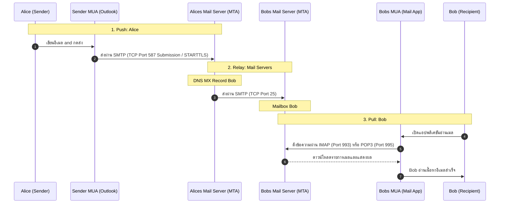

### การเปรียบเทียบโปรโตคอลในระบบอีเมล:

| โปรโตคอล | ทิศทางการทำงาน | พอร์ตมาตรฐาน (Plain / Encrypted) | คุณลักษณะเด่น |
| :--- | :--- | :--- | :--- |
| **SMTP** | **Push (ส่งออก)** | Port 25 (Server-to-Server Relay)<br/>Port 587 (Client Submission / TLS) | ใช้คำสั่ง ASCII Text (`HELO/EHLO`, `MAIL FROM`, `RCPT TO`, `DATA`, `QUIT`) |
| **POP3** | **Pull (ดึงเข้า)** | Port 110 (Plain)<br/>Port 995 (POP3S over TLS) | ดาวน์โหลดอีเมลมาไว้ในเครื่อง และลบออกจากเซิร์ฟเวอร์ (ไม่รองรับการซิงค์โฟลเดอร์หลายอุปกรณ์) |
| **IMAP** | **Pull (ดึงและซิงค์)** | Port 143 (Plain)<br/>Port 993 (IMAPS over TLS) | ซิงค์สถานะ (Read, Flag, Folder) บนเซิร์ฟเวอร์แบบ Real-time เปิดอ่านจากมือถือและคอมพิวเตอร์ได้ตรงกัน |
| **MIME** | **Data Format Extension** | — | ส่วนขยายมาตรฐาน RFC 2045 ช่วยให้อีเมลสามารถส่งข้อความที่ไม่ใช่ 7-bit ASCII เช่น ภาษาไทย รูปภาพ เสียง ไฟล์แนบ (Base64 Encoding) |

---

# 15. ห้องปฏิบัติการวิเคราะห์แพ็กเก็ต (Packet Capture & Wireshark Traffic Analysis Lab)

หลักการอ่านไฟล์บันทึกทราฟฟิก (Packet Capture / PCAP) ให้เสมือนการอ่านบทสนทนาที่ต่อเนื่อง ไม่ใช่อ่านแพ็กเก็ตแยกเดี่ยว:

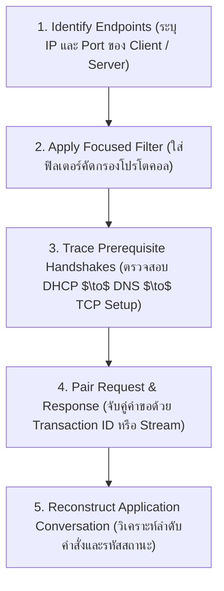

### รายการตัวกรอง Wireshark ที่ต้องใช้งานบ่อย (Essential Display Filters):
- กรองคำขอเว็บ: `http` หรือ `http.request.method == "GET"`
- กรองการแปลงชื่อโดเมน: `dns` หรือ `dns.qry.name contains "example"`
- กรองการขอรับหมายเลข IP: `dhcp || bootp`
- กรองระบบอีเมล: `smtp || imap || pop`
- กรองการเชื่อมต่อไปยัง IP เฉพาะ: `ip.addr == 192.0.2.10 && tcp.port == 443`

---

### การวิเคราะห์กรณีศึกษาจากหลักฐาน Frame ในสื่อการสอน (Case Study Trace):

```

+-----------+---------+--------------------+---------------------+---------------------------------------------------------+
| Frame No. | Protocol| Source -> Dest     | HTTP Method / Code  | การวิเคราะห์หลักฐานเชิงเทคนิค (Technical Evidence)       |

+-----------+---------+--------------------+---------------------+---------------------------------------------------------+
| Frame 73  | HTTP    | Client -> Server   | GET /protected/doc  | Client ส่งคำขอไฟล์เอกสาร แต่ยังไม่มีสิทธิ์ล็อกอิน        |
| Frame 78  | HTTP    | Server -> Client   | 403 Forbidden       | เซิร์ฟเวอร์ปฏิเสธการเข้าถึงเนื่องจากไม่มีสิทธิ์           |
| Frame 2669| HTTP    | Server -> Client   | 301 Moved Permanently| เซิร์ฟเวอร์แจ้งย้าย URL ไปยัง Location: /new-doc        |
| Frame 2673| HTTP    | Server -> Client   | 200 OK              | เบราว์เซอร์ส่ง GET ไปยัง URL ใหม่ และได้รับไฟล์สำเร็จ    |

+-----------+---------+--------------------+---------------------+---------------------------------------------------------+

```

---

# 16. สรุปภาพรวมความสัมพันธ์ระหว่างโปรโตคอล (End-to-End Application Story & Quiz Bank)

เมื่ออุปกรณ์เปิดเครื่องใหม่จนถึงการเข้าถึงบริการเว็บ จะต้องผ่าน 5 ขั้นตอนสำคัญที่เป็นลูกโซ่:
1. **DHCP:** โฮสต์ขอรับการตั้งค่าเครือข่าย (IP, Gateway, DNS Server) ผ่าน DORA Process
2. **DNS:** โฮสต์ส่งคำขอแปลงชื่อเว็บไซต์เป้าหมายเป็นหมายเลข IP ปลายทาง
3. **Socket Interface:** โปรเซสแอปพลิเคชันเรียกใช้ Socket API เพื่อขอเปิด TCP Connection ไปยัง Server IP:443
4. **TLS / HTTP:** สร้างการเข้ารหัสปลอดภัย และแลกเปลี่ยน HTTP GET Request / Response Payload
5. **Render:** เบราว์เซอร์ประมวลผล HTML/CSS/JS และแสดงผลลัพธ์เป็นหน้าเว็บสมบูรณ์แก่ผู้ใช้

---

### คลังข้อสอบทบทวนประจำบท (Interactive Quiz Bank with Explanations):

#### ข้อ 1: ข้อใดคือพอร์ตมาตรฐานของโปรโตคอล DNS ในการสืบค้นข้อมูลปกติ?
- A) TCP Port 80
- B) UDP Port 53 *(คำตอบที่ถูกต้อง)*
- C) TCP Port 25
- D) UDP Port 67
> **คำอธิบาย:** DNS ใช้ UDP พอร์ต 53 สำหรับการสืบค้นชื่อโฮสต์ทั่วไปเนื่องจากความรวดเร็วและใช้ Overhead ต่ำ

#### ข้อ 2: รหัสสถานะ HTTP ใดหมายถึงการเปลี่ยนเส้นทางถาวร (Permanent Redirect)?
- A) 200 OK
- B) 301 Moved Permanently *(คำตอบที่ถูกต้อง)*
- C) 403 Forbidden
- D) 500 Internal Server Error
> **คำอธิบาย:** 301 หมายถึงทรัพยากรถูกย้ายไปยัง URL ใหม่อย่างถาวร เบราว์เซอร์จะจำและอัปเดตแคชเพื่อส่งคำขอไปยัง URL ใหม่ทันที

#### ข้อ 3: การทำงานของ DHCP ในขั้นตอนใดที่เครื่อง Client ตอบรับเลือก IP Address ที่เซิร์ฟเวอร์เสนอมา?
- A) DHCPDISCOVER
- B) DHCPOFFER
- C) DHCPREQUEST *(คำตอบที่ถูกต้อง)*
- D) DHCPACK
> **คำอธิบาย:** ในขั้นตอนที่ 3 Client จะส่ง `DHCPREQUEST` แบบ Broadcast เพื่อยืนยันว่าเลือกรับ IP จาก Server ตัวใด

#### ข้อ 4: ทำไม FTP จึงต้องแยกการเชื่อมต่อเป็น Control Connection และ Data Connection?
- A) เพื่อเข้ารหัสไฟล์
- B) เพื่อให้สามารถส่งคำสั่งควบคุมระหว่างที่กำลังส่งไฟล์ขนาดใหญ่ได้ต่อเนื่อง *(คำตอบที่ถูกต้อง)*
- C) เพื่อลดการใช้งาน CPU
- D) เพื่อป้องกันไวรัส
> **คำอธิบาย:** การแยก Control Connection (พอร์ต 21) ช่วยให้ Client สามารถส่งคำสั่งตรวจสอบสถานะหรือยกเลิกการดาวน์โหลด (ABORT) ได้ในขณะที่ Data Connection กำลังส่งไฟล์

#### ข้อ 5: ความแตกต่างสำคัญระหว่างโปรโตคอล POP3 และ IMAP ในการอ่านอีเมลคือข้อใด?
- A) POP3 เข้ารหัส แต่ IMAP ไม่เข้ารหัส
- B) POP3 ซิงค์โฟลเดอร์บนเซิร์ฟเวอร์ แต่ IMAP ไม่ซิงค์
- C) IMAP ซิงค์สถานะและโครงสร้างโฟลเดอร์บนเซิร์ฟเวอร์ ทำให้เปิดจากหลายอุปกรณ์พร้อมกันได้ *(คำตอบที่ถูกต้อง)*
- D) IMAP ใช้ส่งอีเมล แต่ POP3 ใช้รับอีเมล
> **คำอธิบาย:** IMAP เป็นโปรโตคอลแบบสองทางที่ซิงค์กล่องจดหมายบนเซิร์ฟเวอร์ ทำให้ผู้ใช้เห็นสถานะการอ่านและโฟลเดอร์ตรงกันในทุกอุปกรณ์ ต่างจาก POP3 ที่มักดาวน์โหลดไฟล์มาเก็บไว้ในเครื่องเดียว

---

## เอกสารเชื่อมโยงที่เกี่ยวข้อง (Cross-References)
- [[Lecture 3 - Application Layer Protocols and Architectures]] — สรุปเนื้อหาบทที่ 3 ฉบับทางการ
- [[Lecture 4 - Transport Layer Protocols and Mechanics]] — สรุปกลไก Transport Layer (TCP/UDP, Handshake, Congestion)
- [[Interactive Lab Guide - Chapter 1 Network Fundamentals]] — บทเรียนจำลองพื้นฐานและการเชื่อมต่อ
- [[Interactive Lab Guide - Chapter 2 Network Models & Layered Stack]] — บทเรียนจำลองแบบจำลองเครือข่าย OSI & TCP/IP
- [[Computer Network and Internet Master Index]] — ดัชนีรวมสารบัญวิชาเครือข่ายคอมพิวเตอร์
