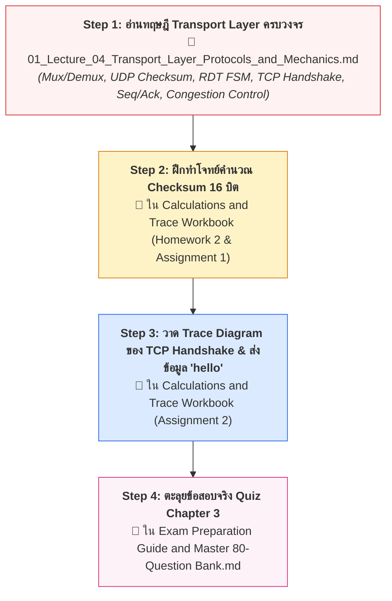

---
tags:
  - networking
  - chapter-03
  - reading-guide
  - transport-layer
  - tcp
  - udp
created: 2026-09-05
updated: 2026-09-05
type: reading-guide
---

# 📖 Chapter 03: Transport Layer (Study & Reading Guide)

> [!IMPORTANT]
> **เป้าหมายของบทนี้:** ทำความเข้าใจการส่งข้อมูลแบบ Process-to-Process, กลไก Multiplexing / Demultiplexing (2-tuple vs 4-tuple), การทำงานของ UDP (Header 8 ไบต์ และ Checksum), ทฤษฎีการส่งข้อมูลที่เชื่อถือได้ (Principles of RDT 1.0–3.0, Go-Back-N vs Selective Repeat), และเจาะลึก TCP (Three-Way Handshake, Sequence/ACK Byte Stream, Flow Control `rwnd`, Congestion Control `cwnd`, AIMD, Slow Start)

---

## 🚦 ลำดับการอ่านบทที่ 3 ให้เข้าใจเร็วที่สุด (Recommended Reading Flow)

---

## 📂 รายชื่อเอกสารในโฟลเดอร์นี้

1. **[[01_Lecture_04_Transport_Layer_Protocols_and_Mechanics]]** — บันทึกการสอนหลักครอบคลุมสไลด์บทที่ 3 สไลด์ 1–154 และชีต DATACOM 2026 อย่างละเอียดสมบูรณ์ 100%
2. **โจทย์คำนวณและเฉลยที่เกี่ยวข้อง:** ดูในโฟลเดอร์ `Comprehensive_Exam_and_Calculations/Calculations and Trace Workbook.md` (หัวข้อ Checksum และ TCP Handshake)
