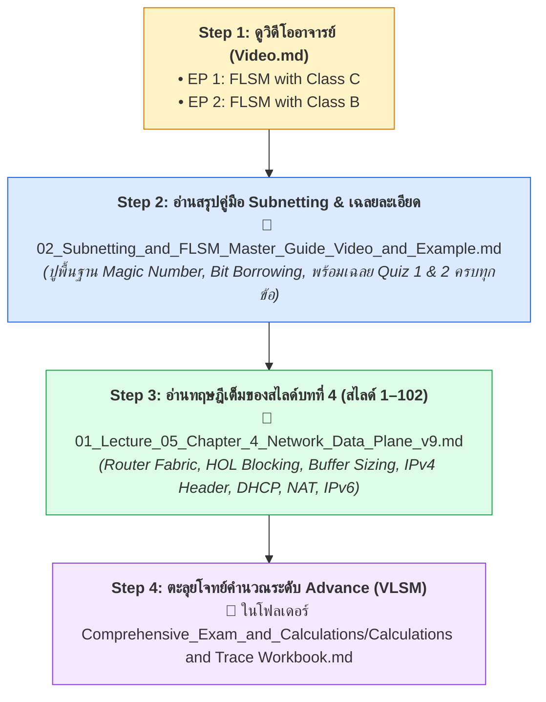

---
tags:
  - networking
  - chapter-04
  - reading-guide
  - data-plane
  - subnetting
created: 2026-09-05
updated: 2026-09-05
type: reading-guide
---

# 📖 Chapter 04: Network Layer — Data Plane (Study & Reading Guide)

> [!IMPORTANT]
> **เป้าหมายของบทนี้:** ทำความเข้าใจหน้าที่ของ **Network Layer (Data Plane)** ซึ่งรับผิดชอบการส่งต่อแพ็กเก็ตจากพอร์ตขาเข้าไปยังพอร์ตขาออก (Forwarding), โครงสร้างฮาร์ดแวร์เร้าเตอร์, โครงสร้าง Datagram Header ของ IPv4/IPv6, การแปลง IP (NAT) และที่สำคัญที่สุดคือ **การคำนวณแบ่งเครือข่ายย่อย (Subnetting: FLSM & CIDR)**

---

## 🚦 ลำดับการอ่านบทที่ 4 ให้เข้าใจเร็วที่สุด (Recommended Reading Flow)

หากต้องการทำแบบฝึกหัดใน [Example.md](file:///c:/Project/computer-network-&-Internet/02_Slides/Chapter_04_Network_Data_Plane/Current_Year_Course_v9.0/Example.md) ได้คล่องแคล่ว แนะนำให้อ่านตามลำดับนี้:

---

## 📂 รายชื่อเอกสารในโฟลเดอร์นี้และหน้าที่ของแต่ละไฟล์

1. **[[02_Subnetting_and_FLSM_Master_Guide_Video_and_Example]]** ⭐ **(แนะนำให้อ่านเป็นไฟล์แรกหากต้องการทำแบบฝึกหัด/การบ้าน)**
   - **สิ่งที่ได้:** 
     - ถอดรหัสคลิปสอน [Video.md](file:///c:/Project/computer-network-&-Internet/02_Slides/Chapter_04_Network_Data_Plane/Current_Year_Course_v9.0/Video.md) (EP 1 Class C และ EP 2 Class B)
     - เทคนิคการหา **Magic Number (Block Size)** เพื่อหา Subnet ID, First IP, Last IP, Broadcast IP ภายใน 10 วินาที
     - เฉลยละเอียดระดับ Step-by-Step ของ **Quiz 1 (CIDR & Subnet Addressing 6 ข้อ)** และ **Quiz 2 (Subnetting Calculation 3 ข้อใหญ่)** ใน [Example.md](file:///c:/Project/computer-network-&-Internet/02_Slides/Chapter_04_Network_Data_Plane/Current_Year_Course_v9.0/Example.md)

2. **[[01_Lecture_05_Chapter_4_Network_Data_Plane_v9]]**
   - **สิ่งที่ได้:**
     - ครอบคลุมสไลด์บทที่ 4 ฉบับทางการปีปัจจุบัน (v9.0 สไลด์ 1–102) ครบ 100%
     - เจาะลึก Router Architecture (Input Port, Switching Fabrics, Output Port, HOL Blocking)
     - สูตรคำนวณขนาดบัฟเฟอร์ ($B = \text{RTT} \times C$ และ $B = \frac{\text{RTT} \times C}{\sqrt{N}}$)
     - IPv4 Header Bitfield 20 ไบต์, การแตกแพ็กเก็ต (IP Fragmentation)
     - กลไก DHCP (DORA Process) และ NAT (Network Address Translation)
     - สถาปัตยกรรม IPv6 และวิธีการเปลี่ยนผ่าน (Dual-Stack vs Tunneling)

---

## ⚠️ จุดที่มักผิดบ่อยในข้อสอบ (Exam Trap Highlights)

1. **ลืมลบ 2 ในการหา Usable Hosts:**
   - สูตรหา Host ที่ใช้งานได้คือ $2^h - 2$ เสมอ เพราะต้องหัก **Network ID** (Host bits เป็น 0 หมด) และ **Broadcast Address** (Host bits เป็น 1 หมด)
2. **จำสับสนระหว่าง "ยืมบิต ($s$)" กับ "บิต Host ที่เหลือ ($h$)":**
   - ถ้าโจทย์สั่งหา Subnet $\to$ คิดจากบิตที่ยืม $s$ โดย $2^s \ge N_{\text{subnets}}$
   - ถ้าโจทย์สั่งหาเครื่องลูกข่าย (Hosts) $\to$ คิดจากบิต Host ที่เหลือ $h$ โดย $2^h - 2 \ge N_{\text{hosts}}$
3. **Interesting Octet ใน Class B:**
   - เมื่อทำ Subnetting ใน Class B อย่าลืมว่าถ้า Prefix อยู่ระหว่าง `/17` ถึง `/24` บิตจะเปลี่ยนที่ **Octet ที่ 3** ส่วน Octet ที่ 4 จะวิ่งจาก $0$ ถึง $255$
