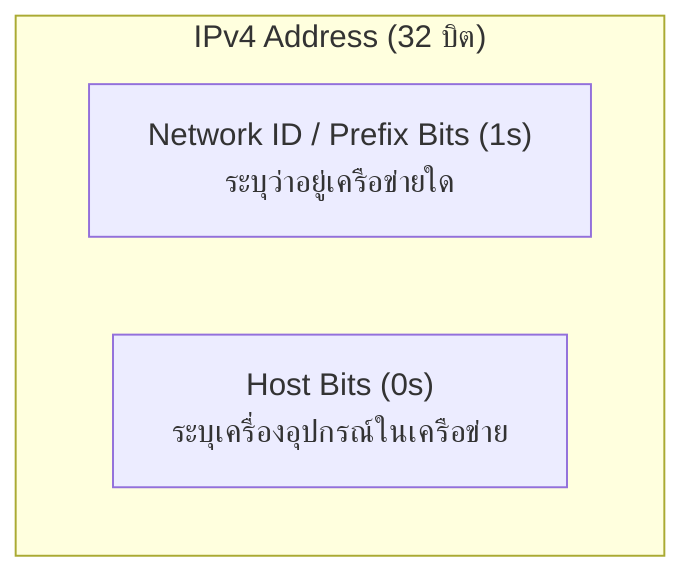
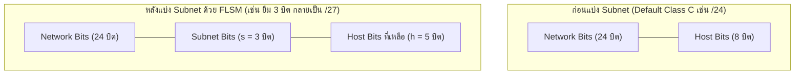

---
tags:
  - networking
  - subnetting
  - flsm
  - cidr
  - ipv4
  - ip-addressing
  - chapter-04
  - quiz-solutions
  - exam-prep
created: 2026-09-05
updated: 2026-09-05
type: lecture-guide
---

# Subnetting and FLSM Master Guide — Video Explanation & Chapter 4 Example Solutions

> [!SUMMARY]
> **เอกสารคู่มือคลังความรู้ Master Guide: ถอดรหัสคลิปสอน Subnet Mask (Video.md) และเฉลยแบบฝึกหัดอย่างละเอียด (Example.md)**
> เอกสารฉบับนี้จัดทำขึ้นเพื่ออธิบายหลักการคำนวณ **IPv4 Subnetting**, การทำงานของ **FLSM (Fixed Length Subnet Masking)** ใน Class C และ Class B จากคลิปวิดีโอของอาจารย์ พร้อมปูพื้นฐานกลไก **Bit Borrowing**, **Magic Number (Block Size)**, **Bitwise AND Operation** และเฉลยโจทย์ข้อสอบ **Quiz 1 (CIDR & Subnet Addressing)** และ **Quiz 2 (Subnetting Calculation)** ทุกข้อแบบ Step-by-Step พร้อมตารางสรุปสมบูรณ์ 100%

---

## 📑 สารบัญเนื้อหาหลัก (Table of Contents)

1. [[#1. พื้นฐานและการถอดรหัสเนื้อหาจาก Video.md (EP 1 & EP 2)]]
   - [[#1.1 โครงสร้างของ IPv4 Address และ Subnet Mask]]
   - [[#1.2 คลาสของเครือข่ายดั้งเดิม (Classful Addressing) vs ไร้คลาส (CIDR)]]
   - [[#1.3 กลไกการทำงานของ FLSM (Fixed Length Subnet Masking)]]
   - [[#1.4 กฎ 2 สูตรหัวใจหลักของการแบ่ง Subnet]]
   - [[#1.5 เทคนิค Magic Number / Block Size (ทางลัดคำนวณเร็วระดับเทพ)]]
   - [[#1.6 ความแตกต่างระหว่างการทำ FLSM บน Class C (EP 1) vs Class B (EP 2)]]
2. [[#2. เฉลยละเอียด Quiz 1: CIDR & Subnet Addressing]]
   - [[#ข้อ 1) IP: 192.168.15.72, Subnet Mask: 255.255.255.128]]
   - [[#ข้อ 2) IP: 172.16.20.35, Subnet Mask: 255.255.255.224]]
   - [[#ข้อ 3) IP: 10.0.50.200, Subnet Mask: 255.255.254.0]]
   - [[#ข้อ 4) 10.0.0.0/16]]
   - [[#ข้อ 5) 172.16.0.0/20]]
   - [[#ข้อ 6) 192.168.5.10/23]]
   - [[#ตารางสรุปผลลัพธ์ Master Table ของ Quiz 1]]
3. [[#3. เฉลยละเอียด Quiz 2: Subnetting Calculation]]
   - [[#ข้อ 1: 10.0.0.0/8 แบ่ง 8 แผนก (แบ่งตามจำนวน Subnet)]]
   - [[#ข้อ 2: 10.0.0.0/8 แบ่ง 1,000 เครื่องต่อ Subnet (แบ่งตามจำนวน Host)]]
   - [[#ข้อ 3: เปรียบเทียบการแบ่ง 4 Subnets ด้วย Class A, Class B, Class C]]
   - [[#บทวิเคราะห์เชิงลึก: ทำไม Class C จึงเหมาะสมที่สุด?]]
4. [[#4. ตารางคัมภีร์ Subnet Mask & Magic Number Cheatsheet]]

---

# 1. พื้นฐานและการถอดรหัสเนื้อหาจาก Video.md (EP 1 & EP 2)

ในไฟล์ [Video.md](file:///c:/Project/computer-network-&-Internet/02_Slides/Chapter_04_Network_Data_Plane/Current_Year_Course_v9.0/Video.md) อาจารย์ได้มอบหมายให้ศึกษา 2 คลิปวิดีโอสำคัญ:
- **EP 1: Subnet Mask EP 1 — FLSM with IPv4 CLASS C**
- **EP 2: Subnet Mask EP 2 — FLSM with IPv4 CLASS B**

ทั้งสองคลิปนี้เป็นหัวใจสำคัญในการทำความเข้าใจการจัดสรร IP Address ใน **Network Layer (Data Plane)** ดังมีรายละเอียดทฤษฎีและกลไกเชิงลึกดังต่อไปนี้:

---

### 1.1 โครงสร้างของ IPv4 Address และ Subnet Mask

> [!DEFINITION] IPv4 Address & Subnet Mask
> - **IPv4 Address:** มีขนาดความยาว **32 บิต (4 ไบต์)** แบ่งออกเป็น 4 ส่วนย่อยเรียกว่า **Octet** (Octet ละ 8 บิต) คั่นด้วยเครื่องหมายจุด (Dotted-Decimal Notation) เช่น `192.168.1.1`
> - **Subnet Mask:** เลข 32 บิตที่มีหน้าที่ระบุว่า **บิตไหนเป็นส่วนของ Network (เครือข่าย)** และ **บิตไหนเป็นส่วนของ Host (เครื่องลูกข่าย)** โดยบิตฝั่ง Network จะเป็น `1` เรียงติดกันจากซ้ายไปขวาเสมอ และบิตฝั่ง Host จะเป็น `0` ทั้งหมดที่เหลือ

#### ค่าประจำหลักของเลขฐานสองใน 1 Octet (8 บิต):
ในแต่ละ Octet จะมี 8 บิต ซึ่งมีค่าน้ำหนัก (Weights) ตามลำดับดังนี้:
| ลำดับบิต (จากซ้ายไปขวา) | บิต 1 | บิต 2 | บิต 3 | บิต 4 | บิต 5 | บิต 6 | บิต 7 | บิต 8 |
| :--- | :---: | :---: | :---: | :---: | :---: | :---: | :---: | :---: |
| **ค่าน้ำหนัก ($2^k$)** | $2^7 = \mathbf{128}$ | $2^6 = \mathbf{64}$ | $2^5 = \mathbf{32}$ | $2^4 = \mathbf{16}$ | $2^3 = \mathbf{8}$ | $2^2 = \mathbf{4}$ | $2^1 = \mathbf{2}$ | $2^0 = \mathbf{1}$ |

เมื่อนำบิต `1` มารวมกันจากซ้ายไปขวา จะได้ค่า Subnet Mask ยอดนิยม:
- `10000000` = **128** (ยืม 1 บิต)
- `11000000` = 128 + 64 = **192** (ยืม 2 บิต)
- `11100000` = 128 + 64 + 32 = **224** (ยืม 3 บิต)
- `11110000` = 128 + 64 + 32 + 16 = **240** (ยืม 4 บิต)
- `11111000` = 128 + 64 + 32 + 16 + 8 = **248** (ยืม 5 บิต)
- `11111100` = 128 + 64 + 32 + 16 + 8 + 4 = **252** (ยืม 6 บิต)
- `11111110` = 128 + 64 + 32 + 16 + 8 + 4 + 2 = **254** (ยืม 7 บิต)
- `11111111` = **255** (เต็ม 8 บิต)

---

### 1.2 คลาสของเครือข่ายดั้งเดิม (Classful Addressing) vs ไร้คลาส (CIDR)

ในอดีต (RFC 791) มีการแบ่ง Class ตามบิตเริ่มต้น:

| Class | บิตนำหน้า | ช่วง IP ใน Octet แรก | Default Subnet Mask | Prefix | จำนวน Network | จำนวน Hosts / Net |
| :---: | :---: | :---: | :---: | :---: | :---: | :---: |
| **A** | `0...` | `1.0.0.0` – `126.255.255.255` | `255.0.0.0` | `/8` | 128 (126 ใช้งานได้) | $2^{24}-2 = 16,777,214$ |
| **B** | `10...` | `128.0.0.0` – `191.255.255.255` | `255.255.0.0` | `/16` | 16,384 | $2^{16}-2 = 65,534$ |
| **C** | `110...` | `192.0.0.0` – `223.255.255.255` | `255.255.255.0` | `/24` | 2,097,152 | $2^8-2 = 254$ |
| **D** | `1110...` | `224.0.0.0` – `239.255.255.255` | N/A (Multicast) | N/A | สำรองสำหรับ Multicast | N/A |
| **E** | `1111...` | `240.0.0.0` – `255.255.255.255` | N/A (Experimental)| N/A | สำรองสำหรับการวิจัย | N/A |

> [!NOTE] ปัญหาของ Classful Addressing
> การแจกจ่าย Classful ก่อให้เกิดการสิ้นเปลือง IP Address มหาศาล เช่น องค์กรต้องการใช้งาน 500 เครื่อง แต่ Class C ให้ได้แค่ 254 จึงต้องขอ Class B ซึ่งให้ถึง 65,534 เครื่อง ทำให้สูญเปล่าไปกว่า 65,000 หมายเลข
> จึงเกิดระบบ **CIDR (Classless Inter-Domain Routing)** และการทำ **Subnetting** ขึ้นมาเพื่อแบ่งซอยเครือข่ายตามความต้องการจริง

---

### 1.3 กลไกการทำงานของ FLSM (Fixed Length Subnet Masking)

> [!DEFINITION] FLSM (Fixed Length Subnet Masking)
> คือการแบ่งเครือข่ายหลัก (Major Network) ออกเป็นเครือข่ายย่อย (Subnets) หลาย ๆ วง โดยที่ **ทุก ๆ Subnet มีขนาดเท่ากันทั้งหมด** และใช้ **Subnet Mask เดียวกันทั้งหมด**

กระบวนการนี้เรียกว่า **"การยืมบิต (Bit Borrowing)"** โดยยืมบิตจากฝั่ง **Host Bits** (ทางซ้ายสุดของโซน Host) มาเป็น **Subnet Bits ($s$)**:

---

### 1.4 กฎ 2 สูตรหัวใจหลักของการแบ่ง Subnet

ไม่ว่าโจทย์จะให้ความต้องการมาในรูปแบบใด จะมีเพียง 2 สูตรนี้เสมอ:

#### สูตรที่ 1: เมื่อโจทย์ต้องการแบ่งตาม "จำนวน Subnets"
$$2^s \ge N_{\text{subnets}}$$
- $s$ = จำนวนบิตที่ต้อง **"ยืม"** จาก Host part
- ผลลัพธ์: จะได้จำนวน Subnets ที่เกิดขึ้นจริง $= 2^s$ วง
- Prefix ใหม่ $= \text{Prefix เดิม} + s$

#### สูตรที่ 2: เมื่อโจทย์ต้องการแบ่งตาม "จำนวนเครื่อง (Hosts)"
$$2^h - 2 \ge N_{\text{hosts}}$$
- $h$ = จำนวนบิตของ Host ที่ต้อง **"คงเหลือไว้"**
- ทำไมต้องลบออก 2 เสมอ?
  1. **หัก Network ID (หมายเลขเครือข่าย):** เมื่อบิต Host ทุกตัวเป็น `0` ทั้งหมด (All-0s Host)
  2. **หัก Broadcast IP (หมายเลขกระจายสัญญาณ):** เมื่อบิต Host ทุกตัวเป็น `1` ทั้งหมด (All-1s Host)
- Prefix ใหม่ $= 32 - h$

---

### 1.5 เทคนิค Magic Number / Block Size (ทางลัดคำนวณเร็วระดับเทพ)

ในวิดีโอทั้งสอง EP อาจารย์ได้เน้นย้ำวิธีการหา **Block Size (Magic Number)** เพื่อช่วยให้เราหาช่วงของ IP ในแต่ละ Subnet ได้โดยไม่ต้องแปลงเลขฐานสองทั้ง 32 บิต:

> [!TIP] วิธีการหา Magic Number (Block Size)
> 1. หา **Interesting Octet** (Octet ที่มีการยืมบิต หรือ Octet ที่ Subnet Mask ไม่ใช่ 255 และไม่ใช่ 0)
> 2. นำค่า **256** ไปลบด้วยค่า Subnet Mask ใน Interesting Octet นั้น:
>    $$\text{Magic Number (Block Size)} = 256 - \text{Subnet Mask}_{\text{Interesting Octet}}$$
>    หรือเท่ากับ $2^{h_{\text{octet}}}$ (โดยที่ $h_{\text{octet}}$ คือจำนวนบิต 0 ใน Octet นั้น)
> 3. ค่า Magic Number นี้คือ **"ระยะห่าง (Increment)"** ของ Network ID ในแต่ละ Subnet เริ่มตั้งแต่ 0, Magic Number, 2×Magic Number, ...

เมื่อได้ Network ID แล้ว โครงสร้างของแต่ละ Subnet จะเป็นดังนี้เสมอ:
- **Network ID:** จุดเริ่มต้นของ Subnet ($X$)
- **First Usable IP:** $\text{Network ID} + 1$ ($X + 1$)
- **Broadcast IP:** $\text{Network ID ถัดไป} - 1$ ($X + \text{Magic Number} - 1$)
- **Last Usable IP:** $\text{Broadcast IP} - 1$ ($X + \text{Magic Number} - 2$)

---

### 1.6 ความแตกต่างระหว่างการทำ FLSM บน Class C (EP 1) vs Class B (EP 2)

| มิติการเปรียบเทียบ | Class C FLSM (Video EP 1) | Class B FLSM (Video EP 2) |
| :--- | :--- | :--- |
| **Default Prefix** | `/24` (Subnet Mask `255.255.255.0`) | `/16` (Subnet Mask `255.255.0.0`) |
| **พื้นที่ Host เริ่มต้น** | 8 บิต (เฉพาะ Octet ที่ 4) | 16 บิต (ครอบคลุมทั้ง Octet ที่ 3 และ 4) |
| **การยืมบิต (Bit Borrowing)** | ยืมบิตใน **Octet ที่ 4** เท่านั้น | ยืมบิตได้ทั้งใน **Octet ที่ 3** หรือทะลุไปถึง **Octet ที่ 4** |
| **Interesting Octet** | มักเป็น **Octet ที่ 4** เสมอ (/25 ถึง /30) | • ถ้า prefix อยู่ระหว่าง `/17` ถึง `/24` $\to$ Interesting Octet คือ **Octet ที่ 3** • ถ้า prefix อยู่ระหว่าง `/25` ถึง `/30` $\to$ Interesting Octet คือ **Octet ที่ 4** |
| **การนับก้าว (Increment)** | ตัวเลขเปลี่ยนที่ Octet 4 เช่น `192.168.1.0`, `192.168.1.64`, `192.168.1.128` | ถ้าเปลี่ยนที่ Octet 3: `172.16.0.0`, `172.16.16.0`, `172.16.32.0` โดย Octet 4 จะวิ่งจาก `0` ถึง `255` ภายในแต่ละ Subnet |

---

# 2. เฉลยละเอียด Quiz 1: CIDR & Subnet Addressing

*📌 อ้างอิงโจทย์จาก [Example.md](file:///c:/Project/computer-network-&-Internet/02_Slides/Chapter_04_Network_Data_Plane/Current_Year_Course_v9.0/Example.md) ตอนที่ 1*

**คำสั่ง:** เขียน Network ID, First IP Addr., Last IP Addr., Broadcast IP Addr. ในรูปแบบตาราง

---

### ข้อ 1) IP: 192.168.15.72, Subnet Mask: 255.255.255.128

#### 🔍 ขั้นตอนการวิเคราะห์และคำนวณ:
1. **วิเคราะห์ Subnet Mask และ Prefix:**
   - Subnet Mask: `255.255.255.128`
   - แปลง Octet ที่ 4: $128 = 10000000_2$ (มีบิต 1 เพิ่มขึ้นมา 1 บิต)
   - Prefix คือ $/24 + 1 = \mathbf{/25}$
2. **หา Interesting Octet และ Magic Number:**
   - Interesting Octet คือ **Octet ที่ 4**
   - $\text{Magic Number (Block Size)} = 256 - 128 = \mathbf{128}$
3. **หา Subnet Range:**
   - จุดแบ่ง Subnet ใน Octet ที่ 4 จะเริ่มทีละ 128:
     - Subnet 0: `192.168.15.0` ถึง `192.168.15.127`
     - Subnet 1: `192.168.15.128` ถึง `192.168.15.255`
4. **ตรวจสอบตำแหน่งของ IP `192.168.15.72`:**
   - ค่า 72 อยู่ในช่วง $0 \le 72 \le 127$
   - ดังนั้น IP นี้อยู่ใน **Subnet 0**
5. **สรุปผลลัพธ์ของ Subnet นี้:**
   - **Network ID:** `192.168.15.0`
   - **First IP Addr.:** `192.168.15.1`
   - **Last IP Addr.:** `192.168.15.126`
   - **Broadcast IP Addr.:** `192.168.15.127`

---

### ข้อ 2) IP: 172.16.20.35, Subnet Mask: 255.255.255.224

#### 🔍 ขั้นตอนการวิเคราะห์และคำนวณ:
1. **วิเคราะห์ Subnet Mask และ Prefix:**
   - Subnet Mask: `255.255.255.224`
   - แปลง Octet ที่ 4: $224 = 128 + 64 + 32 = 11100000_2$ (มีบิต 1 เพิ่ม 3 บิต)
   - Prefix คือ $/24 + 3 = \mathbf{/27}$
2. **หา Interesting Octet และ Magic Number:**
   - Interesting Octet คือ **Octet ที่ 4**
   - $\text{Magic Number (Block Size)} = 256 - 224 = \mathbf{32}$
3. **หา Subnet Range:**
   - ก้าวเดินของ Octet ที่ 4 คือเท่าทวีคูณของ 32:
     - Subnet 0: `0` – `31`
     - Subnet 1: `32` – `63`
     - Subnet 2: `64` – `95`
4. **ตรวจสอบตำแหน่งของ IP `172.16.20.35`:**
   - ค่า 35 อยู่ในช่วง $32 \le 35 \le 63$
   - ดังนั้น IP นี้อยู่ใน Subnet ที่มี Network ID ขึ้นต้นด้วย 32
5. **สรุปผลลัพธ์ของ Subnet นี้:**
   - **Network ID:** `172.16.20.32`
   - **First IP Addr.:** `172.16.20.33`
   - **Last IP Addr.:** `172.16.20.62`
   - **Broadcast IP Addr.:** `172.16.20.63`

---

### ข้อ 3) IP: 10.0.50.200, Subnet Mask: 255.255.254.0

#### 🔍 ขั้นตอนการวิเคราะห์และคำนวณ:
1. **วิเคราะห์ Subnet Mask และ Prefix:**
   - Subnet Mask: `255.255.254.0`
   - แปลง Octet ที่ 3: $254 = 11111110_2$ (มีบิต 1 ทั้งหมด $8 + 8 + 7 = 23$ บิต)
   - Prefix คือ $\mathbf{/23}$
2. **หา Interesting Octet และ Magic Number:**
   - Interesting Octet คือ **Octet ที่ 3** (เพราะ Octet 4 เป็น 0 ทั้งหมด)
   - $\text{Magic Number (Block Size)} = 256 - 254 = \mathbf{2}$ (ใน Octet ที่ 3)
3. **หา Subnet Range:**
   - ก้าวเดินของ Octet ที่ 3 เพิ่มขึ้นทีละ 2:
     - Subnet: `10.0.0.0`, `10.0.2.0`, `10.0.4.0`, ..., `10.0.48.0`, `10.0.50.0`, `10.0.52.0`
4. **ตรวจสอบตำแหน่งของ IP `10.0.50.200`:**
   - Octet ที่ 3 คือ `50` ซึ่งหารด้วย 2 ลงตัวพอดี
   - ช่วงของ Subnet นี้ใน Octet 3 และ 4 คือ:
     - เริ่มตั้งแต่ `10.0.50.0` ถึง `10.0.51.255`
   - IP `10.0.50.200` จึงเป็น Host ภายใน Subnet นี้
5. **สรุปผลลัพธ์ของ Subnet นี้:**
   - **Network ID:** `10.0.50.0`
   - **First IP Addr.:** `10.0.50.1`
   - **Last IP Addr.:** `10.0.51.254`
   - **Broadcast IP Addr.:** `10.0.51.255`

---

### ข้อ 4) 10.0.0.0/16

#### 🔍 ขั้นตอนการวิเคราะห์และคำนวณ:
1. **วิเคราะห์ Prefix และ Subnet Mask:**
   - Prefix `/16` $\implies$ มี Network bits 16 บิตแรก
   - Subnet Mask: `255.255.0.0`
   - Host bits: $h = 32 - 16 = 16$ บิต (กินพื้นที่ Octet ที่ 3 และ 4)
2. **หาขอบเขตเครือข่าย:**
   - โจทย์กำหนด Network Address มาให้โดยตรงคือ `10.0.0.0/16`
   - Octet 1 และ 2 คงที่คือ `10.0`
   - Octet 3 และ 4 วิ่งได้ตั้งแต่ `0.0` ถึง `255.255`
3. **สรุปผลลัพธ์ของ Subnet นี้:**
   - **Network ID:** `10.0.0.0`
   - **First IP Addr.:** `10.0.0.1`
   - **Last IP Addr.:** `10.0.255.254`
   - **Broadcast IP Addr.:** `10.0.255.255`

---

### ข้อ 5) 172.16.0.0/20

#### 🔍 ขั้นตอนการวิเคราะห์และคำนวณ:
1. **วิเคราะห์ Prefix และ Subnet Mask:**
   - Prefix `/20` $\implies$ Network bits 20 บิต
   - กระจายลง Octet: $8 + 8 + 4 + 0$
   - Octet ที่ 3 มีบิต 1 จำนวน 4 บิต: $11110000_2 = 128 + 64 + 32 + 16 = \mathbf{240}$
   - Subnet Mask: `255.255.240.0`
2. **หา Interesting Octet และ Magic Number:**
   - Interesting Octet คือ **Octet ที่ 3**
   - $\text{Magic Number (Block Size)} = 256 - 240 = \mathbf{16}$
3. **หาขอบเขตเครือข่าย:**
   - โจทย์กำหนดจุดเริ่มต้นมาที่ `172.16.0.0`
   - Octet ที่ 3 จะครอบคลุมจาก $0$ ถึง $0 + 16 - 1 = \mathbf{15}$
   - และ Octet ที่ 4 วิ่งเต็มพิกัดจาก $0$ ถึง $255$
   - ช่วง IP ทั้งหมดคือ `172.16.0.0` ถึง `172.16.15.255`
4. **สรุปผลลัพธ์ของ Subnet นี้:**
   - **Network ID:** `172.16.0.0`
   - **First IP Addr.:** `172.16.0.1`
   - **Last IP Addr.:** `172.16.15.254`
   - **Broadcast IP Addr.:** `172.16.15.255`

---

### ข้อ 6) 192.168.5.10/23

#### 🔍 ขั้นตอนการวิเคราะห์และคำนวณ:
1. **วิเคราะห์ Prefix และ Subnet Mask:**
   - Prefix `/23` $\implies$ บิต 1 รวม 23 บิต ($8 + 8 + 7 + 0$)
   - Octet ที่ 3: $11111110_2 = \mathbf{254}$
   - Subnet Mask: `255.255.254.0`
2. **หา Interesting Octet และ Magic Number:**
   - Interesting Octet คือ **Octet ที่ 3**
   - $\text{Magic Number (Block Size)} = 256 - 254 = \mathbf{2}$
3. **หาขอบเขต Subnet ของ IP `192.168.5.10`:**
   - ค่าใน Octet ที่ 3 คือ `5`
   - ก้าวเดินของ Octet ที่ 3 คือเลขคู่: $0, 2, 4, 6, 8, \dots$
   - ค่า 5 อยู่ระหว่าง $4$ ถึง $5.255$ (สิ้นสุดก่อน 6)
   - ดังนั้น Subnet เริ่มต้นที่ `192.168.4.0` และสิ้นสุดที่ `192.168.5.255`
4. **สรุปผลลัพธ์ของ Subnet นี้:**
   - **Network ID:** `192.168.4.0`
   - **First IP Addr.:** `192.168.4.1`
   - **Last IP Addr.:** `192.168.5.254`
   - **Broadcast IP Addr.:** `192.168.5.255`

---

### ตารางสรุปผลลัพธ์ Master Table ของ Quiz 1

> [!SUMMARY] ตารางสรุปคำตอบ Quiz 1 ครบทุกข้อตามฟอร์แมตที่โจทย์ต้องการ

| ข้อที่ | ข้อมูลที่โจทย์กำหนด | Subnet Mask / Prefix | Network ID | First Usable IP Addr. | Last Usable IP Addr. | Broadcast IP Addr. |
| :---: | :--- | :---: | :---: | :---: | :---: | :---: |
| **1** | `192.168.15.72` (Mask `255.255.255.128`) | `255.255.255.128` (`/25`) | **192.168.15.0** | **192.168.15.1** | **192.168.15.126** | **192.168.15.127** |
| **2** | `172.16.20.35` (Mask `255.255.255.224`) | `255.255.255.224` (`/27`) | **172.16.20.32** | **172.16.20.33** | **172.16.20.62** | **172.16.20.63** |
| **3** | `10.0.50.200` (Mask `255.255.254.0`) | `255.255.254.0` (`/23`) | **10.0.50.0** | **10.0.50.1** | **10.0.51.254** | **10.0.51.255** |
| **4** | `10.0.0.0/16` | `255.255.0.0` (`/16`) | **10.0.0.0** | **10.0.0.1** | **10.0.255.254** | **10.0.255.255** |
| **5** | `172.16.0.0/20` | `255.255.240.0` (`/20`) | **172.16.0.0** | **172.16.0.1** | **172.16.15.254** | **172.16.15.255** |
| **6** | `192.168.5.10/23` | `255.255.254.0` (`/23`) | **192.168.4.0** | **192.168.4.1** | **192.168.5.254** | **192.168.5.255** |

---

# 3. เฉลยละเอียด Quiz 2: Subnetting Calculation

*📌 อ้างอิงโจทย์จาก [Example.md](file:///c:/Project/computer-network-&-Internet/02_Slides/Chapter_04_Network_Data_Plane/Current_Year_Course_v9.0/Example.md) ตอนที่ 2*

**ข้อกำหนดสำหรับแต่ละข้อ:**
1. Prefix (/n)
2. Subnet Mask
3. จำนวนเครื่อง (Hosts)
4. จำนวน Subnets ที่ได้
5. เขียน Network ID, First IP Addr., Last IP Addr., Broadcast IP Addr. ในรูปแบบตาราง

---

### ข้อ 1: 10.0.0.0/8 แบ่ง 8 แผนก (แบ่งตามจำนวน Subnet)

> **โจทย์:** บริษัทได้รับเครือข่าย `10.0.0.0/8` ต้องการแบ่งเครือข่ายย่อยให้กับ **8 แผนก**

#### 🔍 วิธีทำและกระบวนการคิดทีละสเต็ป:

1. **ระบุสิ่งที่โจทย์ต้องการ:**
   - เครือข่ายหลัก: `10.0.0.0/8` (มี Network bits เดิม = 8 บิต, Host bits เดิม = 24 บิต)
   - ต้องการแบ่งให้ 8 แผนก $\implies$ ต้องสร้างเครือข่ายย่อยอย่างน้อย $N_{\text{subnets}} = 8$ Subnets
2. **คำนวณจำนวนบิตที่ต้องยืม ($s$):**
   - ใช้สูตร: $2^s \ge 8$
   - $2^3 = 8$ พอดี $\implies$ **ยืมบิต $s = 3$ บิต**
3. **คำนวณ Prefix ใหม่ (/n):**
   - $\text{Prefix ใหม่} = \text{Prefix เดิม} + s = 8 + 3 = \mathbf{/11}$
4. **คำนวณ Subnet Mask ใหม่:**
   - เดิมมี 8 บิต (`11111111.00000000.00000000.00000000`)
   - ยืมเพิ่ม 3 บิตใน Octet ที่ 2: `11111111.11100000.00000000.00000000`
   - Octet ที่ 2: $128 + 64 + 32 = \mathbf{224}$
   - ดังนั้น Subnet Mask = $\mathbf{255.224.0.0}$
5. **คำนวณจำนวนบิต Host ที่เหลือ ($h$):**
   - $h = 32 - 11 = \mathbf{21}$ บิต
6. **คำนวณจำนวนเครื่อง (Hosts):**
   - **จำนวน IP ทั้งหมดต่อ Subnet:** $2^{21} = \mathbf{2,097,152}$ IPs
   - **จำนวน Hosts ที่ใช้งานได้จริง (Usable Hosts):** $2^{21} - 2 = \mathbf{2,097,150}$ เครื่อง/Subnet
7. **คำนวณจำนวน Subnets ที่ได้:**
   - $2^s = 2^3 = \mathbf{8}$ Subnets
8. **คำนวณ Magic Number (Block Size):**
   - Interesting Octet คือ Octet ที่ 2
   - $\text{Block Size} = 256 - 224 = \mathbf{32}$
   - ดังนั้น Network ID ใน Octet ที่ 2 จะเพิ่มขึ้นทีละ 32: `0, 32, 64, 96, 128, 160, 192, 224`

#### 🎯 สรุปคำตอบ 5 ข้อ (ข้อ 1):
1. **Prefix:** $\mathbf{/11}$
2. **Subnet Mask:** $\mathbf{255.224.0.0}$
3. **จำนวนเครื่อง (Hosts):**
   - ทั้งหมด $2,097,152$ หมายเลข
   - **ใช้งานได้จริง (Usable Hosts):** $\mathbf{2,097,150}$ เครื่องต่อ Subnet
4. **จำนวน Subnets ที่ได้:** $\mathbf{8}$ Subnets
5. **ตารางแสดง 8 Subnets สมบูรณ์:**

| แผนก / Subnet | Network ID | First Usable IP Addr. | Last Usable IP Addr. | Broadcast IP Addr. |
| :---: | :---: | :---: | :---: | :---: |
| **แผนก 1 (Subnet 1)** | `10.0.0.0/11` | `10.0.0.1` | `10.31.255.254` | `10.31.255.255` |
| **แผนก 2 (Subnet 2)** | `10.32.0.0/11` | `10.32.0.1` | `10.63.255.254` | `10.63.255.255` |
| **แผนก 3 (Subnet 3)** | `10.64.0.0/11` | `10.64.0.1` | `10.95.255.254` | `10.95.255.255` |
| **แผนก 4 (Subnet 4)** | `10.96.0.0/11` | `10.96.0.1` | `10.127.255.254` | `10.127.255.255` |
| **แผนก 5 (Subnet 5)** | `10.128.0.0/11` | `10.128.0.1` | `10.159.255.254` | `10.159.255.255` |
| **แผนก 6 (Subnet 6)** | `10.160.0.0/11` | `10.160.0.1` | `10.191.255.254` | `10.191.255.255` |
| **แผนก 7 (Subnet 7)** | `10.192.0.0/11` | `10.192.0.1` | `10.223.255.254` | `10.223.255.255` |
| **แผนก 8 (Subnet 8)** | `10.224.0.0/11` | `10.224.0.1` | `10.255.255.254` | `10.255.255.255` |

---

### ข้อ 2: 10.0.0.0/8 แบ่ง 1,000 เครื่องต่อ Subnet (แบ่งตามจำนวน Host)

> **โจทย์:** บริษัทได้รับเครือข่าย `10.0.0.0/8` ต้องการแบ่ง **1,000 เครื่องต่อ subnets** *(หมายเหตุ: แสดง 4 Subnets แรก)*

#### 🔍 วิธีทำและกระบวนการคิดทีละสเต็ป:

1. **ระบุสิ่งที่โจทย์ต้องการ:**
   - เครือข่ายหลัก: `10.0.0.0/8`
   - ต้องการจำนวน Host ที่ใช้งานได้จริง $\ge 1,000$ เครื่องต่อ Subnet
2. **คำนวณจำนวนบิต Host ที่ต้องสำรองไว้ ($h$):**
   - ใช้สูตร: $2^h - 2 \ge 1,000$
     - ถ้า $h = 9 \implies 2^9 - 2 = 512 - 2 = 510$ (ไม่พอ)
     - ถ้า $h = 10 \implies 2^{10} - 2 = 1,024 - 2 = \mathbf{1,022}$ เครื่อง (เพียงพอและประหยัดที่สุด)
   - ดังนั้น **สำรอง Host bits $h = 10$ บิต**
3. **คำนวณ Prefix ใหม่ (/n):**
   - $\text{Prefix ใหม่} = 32 - h = 32 - 10 = \mathbf{/22}$
4. **คำนวณ Subnet Mask ใหม่:**
   - บิต 1 มีทั้งหมด 22 ตัว: `11111111.11111111.11111100.00000000`
   - Octet ที่ 3 มีบิต 1 จำนวน 6 ตัว: $128 + 64 + 32 + 16 + 8 + 4 = \mathbf{252}$
   - ดังนั้น Subnet Mask = $\mathbf{255.255.252.0}$
5. **คำนวณจำนวนบิตที่ยืม ($s$) และจำนวน Subnets ที่ได้:**
   - เดิมคือ `/8` กลายเป็น `/22` $\implies$ ยืมบิต $s = 22 - 8 = \mathbf{14}$ บิต
   - จำนวน Subnets ทั้งหมด $= 2^{14} = \mathbf{16,384}$ Subnets
6. **คำนวณจำนวนเครื่อง (Hosts):**
   - **จำนวน IP ทั้งหมดต่อ Subnet:** $2^{10} = \mathbf{1,024}$ IPs
   - **จำนวน Hosts ที่ใช้งานได้จริง (Usable Hosts):** $2^{10} - 2 = \mathbf{1,022}$ เครื่อง/Subnet
7. **คำนวณ Magic Number (Block Size):**
   - Interesting Octet คือ **Octet ที่ 3**
   - $\text{Block Size} = 256 - 252 = \mathbf{4}$
   - ดังนั้น Network ID ใน Octet ที่ 3 จะเพิ่มขึ้นทีละ 4: `0, 4, 8, 12, 16, ...`

#### 🎯 สรุปคำตอบ 5 ข้อ (ข้อ 2):
1. **Prefix:** $\mathbf{/22}$
2. **Subnet Mask:** $\mathbf{255.255.252.0}$
3. **จำนวนเครื่อง (Hosts):**
   - ทั้งหมด $1,024$ หมายเลข
   - **ใช้งานได้จริง (Usable Hosts):** $\mathbf{1,022}$ เครื่องต่อ Subnet (ตอบโจทย์ 1,000 เครื่อง)
4. **จำนวน Subnets ที่ได้:** $\mathbf{16,384}$ Subnets
5. **ตารางแสดง 4 Subnets แรกตามที่โจทย์กำหนด:**

| ลำดับ Subnet | Network ID | First Usable IP Addr. | Last Usable IP Addr. | Broadcast IP Addr. |
| :---: | :---: | :---: | :---: | :---: |
| **Subnet 1** | `10.0.0.0/22` | `10.0.0.1` | `10.0.3.254` | `10.0.3.255` |
| **Subnet 2** | `10.0.4.0/22` | `10.0.4.1` | `10.0.7.254` | `10.0.7.255` |
| **Subnet 3** | `10.0.8.0/22` | `10.0.8.1` | `10.0.11.254` | `10.0.11.255` |
| **Subnet 4** | `10.0.12.0/22` | `10.0.12.1` | `10.0.15.254` | `10.0.15.255` |

*(คำอธิบายเพิ่มเติม: แต่ละ Subnet กินพื้นที่ Octet 3 จำนวน 4 ค่า เช่น Subnet 1 คือ 0, 1, 2, 3 จึงจบ Broadcast ที่ `10.0.3.255`)*

---

### ข้อ 3: เปรียบเทียบการแบ่ง 4 Subnets ด้วย Class A, Class B, Class C

> **โจทย์:** ให้แสดงการแบ่งเครือข่ายออกเป็น **4 Subnets** โดยใช้ Class ต่อไปนี้:
> - **2.1) Class A: 10.0.0.0/8**
> - **2.2) Class B: 172.16.0.0/12**
> - **2.3) Class C: 192.168.0.0/16**
> 
> พร้อมวิเคราะห์ว่า **ใช้แบ่งจากคลาสอะไรเหมาะสมที่สุดเพราะเหตุใด**

#### 💡 กฎร่วมสำหรับการแบ่งเป็น 4 Subnets:
- ต้องการ $N_{\text{subnets}} = 4$
- ใช้สูตร: $2^s \ge 4 \implies 2^2 = 4 \implies$ **ยืมบิต $s = 2$ บิตเสมอ** ในทุกกรณี!

---

#### 2.1) กรณี Class A: `10.0.0.0/8`
1. **Prefix ใหม่:** $/8 + 2 = \mathbf{/10}$
2. **Subnet Mask ใหม่:**
   - ยืม 2 บิตใน Octet 2: `11000000` = $128 + 64 = \mathbf{192}$
   - Subnet Mask = $\mathbf{255.192.0.0}$
3. **จำนวนเครื่อง (Hosts):**
   - Host bits ที่เหลือ: $h = 32 - 10 = 22$ บิต
   - จำนวน IP ทั้งหมด $= 2^{22} = 4,194,304$ IPs
   - **Usable Hosts:** $2^{22} - 2 = \mathbf{4,194,302}$ เครื่องต่อ Subnet
4. **จำนวน Subnets ที่ได้:** $2^2 = \mathbf{4}$ Subnets
5. **Magic Number (Block Size):** $256 - 192 = \mathbf{64}$ (ใน Octet ที่ 2)
6. **ตาราง 4 Subnets ของ Class A:**

| ลำดับ Subnet | Network ID | First Usable IP Addr. | Last Usable IP Addr. | Broadcast IP Addr. |
| :---: | :---: | :---: | :---: | :---: |
| **Subnet 1** | `10.0.0.0/10` | `10.0.0.1` | `10.63.255.254` | `10.63.255.255` |
| **Subnet 2** | `10.64.0.0/10` | `10.64.0.1` | `10.127.255.254` | `10.127.255.255` |
| **Subnet 3** | `10.128.0.0/10` | `10.128.0.1` | `10.191.255.254` | `10.191.255.255` |
| **Subnet 4** | `10.192.0.0/10` | `10.192.0.1` | `10.255.255.254` | `10.255.255.255` |

---

#### 2.2) กรณี Class B: `172.16.0.0/12`
*(หมายเหตุ: โจทย์ระบุฐานเป็น `/12` ตามบล็อก Private Address RFC 1918)*
1. **Prefix ใหม่:** $/12 + 2 = \mathbf{/14}$
2. **Subnet Mask ใหม่:**
   - 14 บิต $\implies$ Octet 1 เต็ม (255), Octet 2 มี 6 บิต (`11111100` = $128+64+32+16+8+4 = \mathbf{252}$)
   - Subnet Mask = $\mathbf{255.252.0.0}$
3. **จำนวนเครื่อง (Hosts):**
   - Host bits ที่เหลือ: $h = 32 - 14 = 18$ บิต
   - จำนวน IP ทั้งหมด $= 2^{18} = 262,144$ IPs
   - **Usable Hosts:** $2^{18} - 2 = \mathbf{262,142}$ เครื่องต่อ Subnet
4. **จำนวน Subnets ที่ได้:** $2^2 = \mathbf{4}$ Subnets
5. **Magic Number (Block Size):** $256 - 252 = \mathbf{4}$ (ใน Octet ที่ 2)
   - ค่าใน Octet 2 เริ่มจาก 16 และเพิ่มทีละ 4: `16, 20, 24, 28`
6. **ตาราง 4 Subnets ของ Class B (/12):**

| ลำดับ Subnet | Network ID | First Usable IP Addr. | Last Usable IP Addr. | Broadcast IP Addr. |
| :---: | :---: | :---: | :---: | :---: |
| **Subnet 1** | `172.16.0.0/14` | `172.16.0.1` | `172.19.255.254` | `172.19.255.255` |
| **Subnet 2** | `172.20.0.0/14` | `172.20.0.1` | `172.23.255.254` | `172.23.255.255` |
| **Subnet 3** | `172.24.0.0/14` | `172.24.0.1` | `172.27.255.254` | `172.27.255.255` |
| **Subnet 4** | `172.28.0.0/14` | `172.28.0.1` | `172.31.255.254` | `172.31.255.255` |

> [!NOTE] ข้อสังเกตเพิ่มเติมกรณี Class B แบบดั้งเดิม (Default /16)
> หากผู้สอนพิจารณาตาม Default Class B แบบเดิมคือ `172.16.0.0/16`:
> - ยืม 2 บิต $\to$ Prefix `/18` (Subnet Mask `255.255.192.0`)
> - Block size = 64 ใน Octet ที่ 3
> - Hosts ที่ใช้งานได้ $= 2^{14} - 2 = 16,382$ เครื่อง/Subnet
> - Subnets: `172.16.0.0/18`, `172.16.64.0/18`, `172.16.128.0/18`, `172.16.192.0/18`

---

#### 2.3) กรณี Class C: `192.168.0.0/16`
*(หมายเหตุ: โจทย์ระบุฐานเป็น `192.168.0.0/16` ตามบล็อก Private Address RFC 1918)*
1. **Prefix ใหม่:** $/16 + 2 = \mathbf{/18}$
2. **Subnet Mask ใหม่:**
   - 18 บิต $\implies$ Octet 1 และ 2 เต็ม (255.255), Octet 3 มี 2 บิต (`11000000` = $\mathbf{192}$)
   - Subnet Mask = $\mathbf{255.255.192.0}$
3. **จำนวนเครื่อง (Hosts):**
   - Host bits ที่เหลือ: $h = 32 - 18 = 14$ บิต
   - จำนวน IP ทั้งหมด $= 2^{14} = 16,384$ IPs
   - **Usable Hosts:** $2^{14} - 2 = \mathbf{16,382}$ เครื่องต่อ Subnet
4. **จำนวน Subnets ที่ได้:** $2^2 = \mathbf{4}$ Subnets
5. **Magic Number (Block Size):** $256 - 192 = \mathbf{64}$ (ใน Octet ที่ 3)
   - ค่าใน Octet 3 เริ่มจาก 0 และเพิ่มทีละ 64: `0, 64, 128, 192`
6. **ตาราง 4 Subnets ของ Class C (/16):**

| ลำดับ Subnet | Network ID | First Usable IP Addr. | Last Usable IP Addr. | Broadcast IP Addr. |
| :---: | :---: | :---: | :---: | :---: |
| **Subnet 1** | `192.168.0.0/18` | `192.168.0.1` | `192.168.63.254` | `192.168.63.255` |
| **Subnet 2** | `192.168.64.0/18` | `192.168.64.1` | `192.168.127.254` | `192.168.127.255` |
| **Subnet 3** | `192.168.128.0/18` | `192.168.128.1` | `192.168.191.254` | `192.168.191.255` |
| **Subnet 4** | `192.168.192.0/18` | `192.168.192.1` | `192.168.255.254` | `192.168.255.255` |

> [!NOTE] ข้อสังเกตเพิ่มเติมกรณี Class C เดี่ยวแบบดั้งเดิม (Default /24)
> หากมองเป็น Class C ก้อนเดี่ยว เช่น `192.168.1.0/24`:
> - ยืม 2 บิต $\to$ Prefix `/26` (Subnet Mask `255.255.255.192`)
> - Block size = 64 ใน Octet ที่ 4
> - Hosts ที่ใช้งานได้ $= 2^6 - 2 = 62$ เครื่อง/Subnet
> - Subnets: `.0/26` (1-62), `.64/26` (65-126), `.128/26` (129-190), `.192/26` (193-254)

---

### บทวิเคราะห์เชิงลึก: ทำไม Class C จึงเหมาะสมที่สุด?

> [!IMPORTANT] คำตอบสำหรับคำถาม: "ใช้แบ่งจากคลาสอะไรเหมาะสมที่สุดเพราะเหตุใด"
> 
> **คำตอบฟันธง:** การแบ่งจาก **Class C (192.168.0.0/16)** มีความ **เหมาะสมที่สุด** สำหรับการใช้งานในองค์กรทั่วไป โดยมีเหตุผลทางวิศวกรรมเครือข่าย 3 ประการหลักดังนี้:
> 
> 1. **ป้องกันปัญหา Broadcast Storm และขนาดของ Broadcast Domain ที่ใหญ่เกินไป:**
>    - ใน Layer 2/3 สวิตช์และโฮสต์ต้องส่งแพ็กเก็ต Broadcast (เช่น ARP Requests, DHCP Discovers) หากใช้ **Class A** ซึ่งมีขนาดถึง **4,194,302 เครื่องต่อ Subnet** หรือ **Class B** ที่มี **262,142 เครื่องต่อ Subnet** หากเกิด Broadcast ปริมาณแพ็กเก็ตจะมหาศาลจนทำให้เกิดภาวะเครือข่ายล่ม (Broadcast Storm) และสูญเสีย CPU ประมวลผลของทุกอุปกรณ์ในเครือข่าย
>    - ในขณะที่ **Class C** มีขนาดพื้นที่โฮสต์ที่กำลังพอเหมาะ (16,382 เครื่อง หรือ 62 เครื่องใน /24) ทำให้ Broadcast Domain อยู่ในเกณฑ์ที่อุปกรณ์ Network รองรับได้อย่างมีเสถียรภาพ
> 
> 2. **ลดการสูญเสียหมายเลขไอพี (Address Space Wastage):**
>    - องค์กรทั่วไปมีคอมพิวเตอร์และอุปกรณ์รวมกันหลักร้อยหรือหลักพันเครื่อง การจัดสรร Class A หรือ Class B จะทำให้มี IP Address ที่เหลือว่างโดยไม่ได้ใช้งานนับล้านหมายเลข ซึ่งผิดหลักการจัดสรรทรัพยากรอย่างมีประสิทธิภาพ
> 
> 3. **ความเป็นสากลและความปลอดภัยในการบริหารจัดการ (Manageability & RFC 1918):**
>    - ช่วง IP `192.168.x.x` เป็นช่วง Private IPv4 ที่นิยมใช้งานมากที่สุดสำหรับเครือข่ายภายในระดับ Enterprise/Campus และ SME การจัดสรรจึงสอดคล้องกับมาตรฐานความคุ้นเคยของผู้ดูแลระบบ (Network Administrators) และง่ายต่อการเขียน Access Control List (ACL) และ Firewall Rules

---

# 4. ตารางคัมภีร์ Subnet Mask & Magic Number Cheatsheet

ตารางนี้เป็นสูตรลัดที่สามารถใช้เปิดดูเพื่อตอบคำถามทุกข้อสอบ Subnetting ได้ภายใน 5 วินาที:

| Prefix | Subnet Mask | บิตที่ยืม ($s$) | Magic Number (Block Size) | Host bits ($h$) | Total IPs | Usable Hosts ($2^h - 2$) | Interesting Octet |
| :---: | :---: | :---: | :---: | :---: | :---: | :---: | :---: |
| **/24** | `255.255.255.0` | 0 | 256 (เต็ม) | 8 | 256 | **254** | Octet 4 |
| **/25** | `255.255.255.128` | 1 | **128** | 7 | 128 | **126** | Octet 4 |
| **/26** | `255.255.255.192` | 2 | **64** | 6 | 64 | **62** | Octet 4 |
| **/27** | `255.255.255.224` | 3 | **32** | 5 | 32 | **30** | Octet 4 |
| **/28** | `255.255.255.240` | 4 | **16** | 4 | 16 | **14** | Octet 4 |
| **/29** | `255.255.255.248` | 5 | **8** | 3 | 8 | **6** | Octet 4 |
| **/30** | `255.255.255.252` | 6 | **4** | 2 | 4 | **2** (Point-to-Point) | Octet 4 |
| | | | | | | | |
| **/16** | `255.255.0.0` | 0 | 256 (เต็ม) | 16 | 65,536 | **65,534** | Octet 3 |
| **/17** | `255.255.128.0` | 1 | **128** | 15 | 32,768 | **32,766** | Octet 3 |
| **/18** | `255.255.192.0` | 2 | **64** | 14 | 16,384 | **16,382** | Octet 3 |
| **/19** | `255.255.224.0` | 3 | **32** | 13 | 8,192 | **8,190** | Octet 3 |
| **/20** | `255.255.240.0` | 4 | **16** | 12 | 4,096 | **4,094** | Octet 3 |
| **/21** | `255.255.248.0` | 5 | **8** | 11 | 2,048 | **2,046** | Octet 3 |
| **/22** | `255.255.252.0` | 6 | **4** | 10 | 1,024 | **1,022** | Octet 3 |
| **/23** | `255.255.254.0` | 7 | **2** | 9 | 512 | **510** | Octet 3 |
