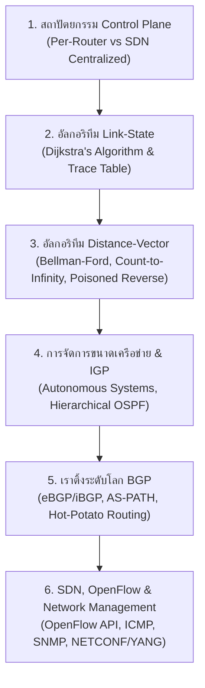

---
tags:
  - networking
  - chapter-05
  - reading-guide
  - control-plane
  - routing
  - dijkstra
created: 2026-09-05
updated: 2026-09-07
type: reading-guide
---

# 📖 Chapter 05: Network Layer — Control Plane (Study & Reading Guide)

> [!IMPORTANT]
> **เป้าหมายของบทนี้:** ทำความเข้าใจตรรกะการหาเส้นทาง (Routing Logic), ความแตกต่างระหว่าง Per-Router Control Plane vs SDN Centralized Control, อัลกอริทึม Link-State (Dijkstra's Algorithm) vs Distance-Vector (Bellman-Ford Algorithm, Count-to-Infinity Problem, Poisoned Reverse), โพรโทคอลเราติ้งภายใน AS (OSPF, RIP) และเราติ้งข้าม AS (BGP: eBGP/iBGP), สถาปัตยกรรม SDN และโปรโตคอล OpenFlow, โปรโตคอล ICMP และการทำงานของ Traceroute, รวมถึงระบบบริหารจัดการเครือข่าย SNMP และ NETCONF/YANG

---

## 📚 เอกสารและโน้ตหลักในโมดูลนี้

1. **โน้ตบรรยายสรุปหลักสูตรฉบับสมบูรณ์ (Master Lecture Guide):**
   - 👉 [[01_Lecture_06_Chapter_5_Network_Control_Plane_v9]] — สรุปเนื้อหาเจาะลึกครบถ้วน 100% จากสไลด์ 1–121 พร้อมไดอะแกรม Mermaid, Trace Table, และกลไก Low-level
2. **คลังแบบฝึกหัดและการบ้านคำนวณ:**
   - 👉 [[Calculations and Trace Workbook#5. การคำนวณ Dijkstra's Algorithm Step-by-Step Trace]] — เฉลยและขั้นตอนการสร้างตาราง Trace Table สำหรับการบ้าน Homework 4
3. **ไฟล์สไลด์ต้นฉบับ:**
   - สไลด์บทเรียนหลักสูตรปัจจุบัน v9.0: `02_Slides/Chapter_05_Network_Control_Plane/Current_Year_Course_v9.0/Chapter_5_v9.0_Network_Layer_Control_Plane.pptx`
   - บทอ่านสไลด์ฉบับเต็ม: `02_Slides/Chapter_05_Network_Control_Plane/Current_Year_Course_v9.0/Chapter_5_Network_Layer_Control_Plane_1-121.html`

---

## 🚦 ลำดับขั้นตอนการเรียนรู้บทที่ 5 (Recommended Study Roadmap)

1. **Step 1:** ทำความเข้าใจบทบาทของ Control Plane ในการกำหนดเส้นทาง End-to-End และเปรียบเทียบสถาปัตยกรรมแบบดั้งเดิมกับ SDN
2. **Step 2:** ฝึกทำโจทย์ตาราง Trace ตารางเส้นทางด้วย **Dijkstra's Shortest Path Algorithm** จากการบ้าน Homework 4 ให้คล่องแคล่ว
3. **Step 3:** ทำความเข้าใจสมการ Bellman-Ford, ปัญหานับวนไม่รู้จบ (Count-to-Infinity) และการแก้ปัญหาด้วย Poisoned Reverse
4. **Step 4:** ศึกษาการแบ่ง Autonomous System (AS) และโครงสร้าง OSPF Area 0
5. **Step 5:** ทำความเข้าใจกลไก BGP Attributes (`AS-PATH`, `NEXT-HOP`), การคัดเลือกเส้นทางตามนโยบายธุรกิจ และ Hot-Potato Routing
6. **Step 6:** ศึกษากลไก Match-plus-Action ของ OpenFlow, ICMP และสถาปัตยกรรมบริหารจัดการเครือข่ายยุคใหม่ NETCONF/YANG

---

## ✅ ตรวจสอบความเข้าใจก่อนสอบ (Chapter 5 Checklist)

- [ ] อธิบายความแตกต่างระหว่าง Data Plane (Forwarding) และ Control Plane (Routing) ได้
- [ ] สามารถคำนวณและเติมตาราง Dijkstra Trace Table จากโหนดต้นทางใด ๆ ได้อย่างถูกต้อง
- [ ] อธิบายสมการ Bellman-Ford และกระบวนการแลกเปลี่ยนตาราง Distance-Vector ได้
- [ ] อธิบายได้ว่าทำไม Count-to-Infinity จึงเกิดขึ้น และทำไม Poisoned Reverse จึงแก้ Loop ที่มี 3 โหนดขึ้นไปไม่ได้
- [ ] เข้าใจความแตกต่างและเหตุผลของการแยก Intra-AS (OSPF) และ Inter-AS (BGP)
- [ ] ทราบลำดับการคัดเลือกเส้นทางของ BGP (Local Preference $\rightarrow$ Shortest AS-PATH $\rightarrow$ Closest NEXT-HOP)
- [ ] อธิบายบทบาทของ SDN Controller, Southbound API (OpenFlow) และ Northbound API ได้
- [ ] อธิบายกลไกที่ `traceroute` ใช้หาเราเตอร์ทุกตัวตลอดเส้นทางผ่าน ICMP ได้
- [ ] เข้าใจความแตกต่างระหว่าง SNMP และ NETCONF/YANG ในการตั้งค่าอุปกรณ์เครือข่าย
