---
tags:
  - networking
  - lecture
  - control-plane
  - routing
  - dijkstra
  - bellman-ford
  - distance-vector
  - link-state
  - ospf
  - bgp
  - sdn
  - openflow
  - icmp
  - snmp
  - netconf
  - yang
  - v9-current
created: 2026-09-07
updated: 2026-09-07
curriculum: Current v9.0 (Slides 1-121)
type: lecture-note
---

# Lecture 6: Network Layer — Control Plane (Current v9.0 Complete Master Guide)

> [!SUMMARY]
> **เอกสารสรุปคลังความรู้วิชา Computer Networks: Chapter 5 Network Layer — Control Plane (ฉบับหลักสูตรปัจจุบัน v9.0 สไลด์ 1–121 ครบถ้วน 100%)**
> รวบรวมและเรียบเรียงเนื้อหาทุกสไลด์ ทุกหัวข้อ ทุกสมการ และทุกโปรโตคอลอย่างละเอียด ไม่มีการตัดทอนหรือรวบรัดหัวข้อ พร้อมแผนภาพสถาปัตยกรรม Mermaid, แผนผัง Sequence Diagram, State Transitions, ตาราง Trace Table แบบ Step-by-step (Dijkstra's Algorithm, Bellman-Ford Distance Vector, Count-to-Infinity & Poisoned Reverse, BGP Path Selection, Hot-Potato Routing, SDN OpenFlow Control Plane Orchestration, ICMP Message Formats, Traceroute Mechanics, SNMP MIB/SMI และ Modern Network Configuration NETCONF/YANG) พร้อมเชื่อมโยงการบ้าน Homework 4 และแนวข้อสอบจริง

---

## 📑 สารบัญเนื้อหาหลัก (Master Table of Contents)

1. [[#1. ภาพรวมของ Control Plane และรูปแบบสถาปัตยกรรม (Slides 1–7)]]
   - [[#1.1 สถาปัตยกรรมและบทบาทของ Control Plane]]
   - [[#1.2 สถาปัตยกรรมแบบกระจายศูนย์ดั้งเดิม (Per-Router Control Plane)]]
   - [[#1.3 สถาปัตยกรรมศูนย์กลางควบคุมด้วยซอฟต์แวร์ (SDN Centralized Control Plane)]]
   - [[#1.4 การเปรียบเทียบเชิงลึก: Per-Router Control Plane vs. SDN Control Plane]]
2. [[#2. พื้นฐานการเลือกเส้นทางและการจัดหมวดหมู่อัลกอริทึม (Routing Fundamentals & Algorithm Classification) (Slides 8–11)]]
   - [[#2.1 นิยามของเส้นทางที่ดี (What is a "Good" Path?)]]
   - [[#2.2 แบบจำลองนามธรรมเชิงกราฟ (Graph Abstraction & Link Costs)]]
   - [[#2.3 การจำแนกประเภทอัลกอริทึมการเลือกเส้นทาง (Routing Algorithm Classification)]]
3. [[#3. อัลกอริทึมแบบ Link-State และ Dijkstra’s Algorithm (Slides 12–30)]]
   - [[#3.1 คุณลักษณะและกลไกของ Link-State (LS) Routing]]
   - [[#3.2 รายละเอียดคณิตศาสตร์และนิยามสัญลักษณ์ของ Dijkstra's Algorithm]]
   - [[#3.3 ลำดับขั้นตอนการทำงานของ Dijkstra's Algorithm (Formal Algorithm Specification)]]
   - [[#3.4 ตัวอย่างการประมวลผลและตาราง Trace Table แบบ Step-by-Step (Slides 16–22)]]
   - [[#3.5 การสร้าง Forwarding Table จาก Shortest-Path Tree]]
   - [[#3.6 การวิเคราะห์ความซับซ้อนเชิงคำนวณ (Computational Complexity)]]
   - [[#3.7 ปัญหาการแกว่งของเส้นทางเมื่อ Cost ขึ้นกับปริมาณทราฟฟิก (Route Oscillations)]]
4. [[#4. อัลกอริทึมแบบ Distance-Vector และ Bellman-Ford Equation (Slides 31–52)]]
   - [[#4.1 หลักการของ Distance-Vector (DV) และสมการ Bellman-Ford]]
   - [[#4.2 การแลกเปลี่ยนเวกเตอร์และสภาวะการทำงานแบบกระจายศูนย์ (Distributed Asynchronous Mechanics)]]
   - [[#4.3 ตัวอย่างการคำนวณตาราง Distance Vector แบบ Step-by-Step (Slides 37–42)]]
   - [[#4.4 การเปรียบเทียบเชิงลึกระหว่าง Link-State vs. Distance-Vector]]
   - [[#4.5 ผลกระทบเมื่อค่า Link Cost มีการเปลี่ยนแปลง (Link-Cost Changes & Failures)]]
   - [[#4.6 ปัญหานับวนไม่รู้จบ (Count-to-Infinity Problem)]]
   - [[#4.7 การแก้ไขปัญหาด้วย Poisoned Reverse และข้อจำกัดเชิงโครงสร้าง]]
5. [[#5. การเลือกเส้นทางระดับอินเทอร์เน็ตที่ขยายขนาดได้และโปรโตคอล OSPF (Slides 53–60)]]
   - [[#5.1 ความท้าทายด้านการขยายขนาดและอิสระในการบริหารจัดการ (Scalability & Administrative Autonomy)]]
   - [[#5.2 แนวคิดระบบอัตโนมัติ (Autonomous Systems: AS)]]
   - [[#5.3 โปรโตคอลเลือกเส้นทางภายใน AS (Intra-AS Routing / IGP)]]
   - [[#5.4 เจาะลึกโปรโตคอล OSPF (Open Shortest Path First)]]
   - [[#5.5 สถาปัตยกรรม OSPF แบบลำดับขั้นสองระดับ (Hierarchical OSPF)]]
6. [[#6. การเลือกเส้นทางระหว่างระบบอัตโนมัติ: โปรโตคอล BGP (Slides 61–76)]]
   - [[#6.1 บทบาทสำคัญของ Border Gateway Protocol (BGP: The Glue of the Internet)]]
   - [[#6.2 ประเภทของการเชื่อมต่อ: eBGP vs. iBGP Connections]]
   - [[#6.3 แอตทริบิวต์หลักของ BGP (BGP Attributes: AS-PATH และ NEXT-HOP)]]
   - [[#6.4 นโยบายการเลือกเส้นทางของ BGP (Policy-Based Routing)]]
   - [[#6.5 ลำดับขั้นการตัดสินใจเลือกเส้นทางของเร้าเตอร์ BGP (BGP Route Selection Criteria)]]
   - [[#6.6 กลไก Hot-Potato Routing]]
   - [[#6.7 การแลกเปลี่ยนเส้นทางเชิงนโยบายพาณิชย์ (Customer-Provider vs. Peer-Peer Relationships)]]
   - [[#6.8 เหตุผลที่ต้องแยก Intra-AS และ Inter-AS Routing Protocols ออกจากกัน]]
7. [[#7. สถาปัตยกรรมเครือข่ายที่ควบคุมด้วยซอฟต์แวร์ (Software-Defined Networking - SDN) (Slides 77–100)]]
   - [[#7.1 ทำไมต้องเปลี่ยนผ่านสู่สถาปัตยกรรม SDN?]]
   - [[#7.2 องค์ประกอบเชิงโครงสร้าง 3 ชั้นของสถาปัตยกรรม SDN]]
   - [[#7.3 องค์ประกอบภายในและบทบาทของ SDN Controller (Network Operating System)]]
   - [[#7.4 Southbound API และโปรโตคอล OpenFlow]]
   - [[#7.5 ข้อความสื่อสารหลักในโปรโตคอล OpenFlow (Controller-to-Switch vs. Switch-to-Controller)]]
   - [[#7.6 ตัวอย่างการทำงานจริงของ SDN Control Plane ในการจัดการเส้นทางและรับมือกับ Link Failure]]
   - [[#7.7 ระบบ SDN Controller ในโลกจริง: การเปรียบเทียบ OpenDaylight (ODL) vs. ONOS]]
8. [[#8. โปรโตคอลรายงานข้อผิดพลาดและข้อมูลควบคุม: ICMP (Slides 101–103)]]
   - [[#8.1 บทบาทและการวางตัวของ ICMP ใน Internet Protocol Stack]]
   - [[#8.2 โครงสร้างของแพ็กเก็ตข้อความ ICMP (Header & Error Payload)]]
   - [[#8.3 ตารางประเภทและรหัสข้อความสำคัญ (Standard ICMP Message Types & Codes)]]
   - [[#8.4 กลไกการทำงานของเครื่องมือ Traceroute เชิงลึก (TTL Exceeded & Port Unreachable)]]
9. [[#9. การบริหารจัดการและตั้งค่าระบบเครือข่าย (Network Management & Configuration) (Slides 104–116)]]
   - [[#9.1 กรอบโครงสร้างการบริหารจัดการเครือข่ายและสถาปัตยกรรม FCAPS]]
   - [[#9.2 สถาปัตยกรรมโปรโตคอล SNMP แบบดั้งเดิม (Managing Server, Managed Device, Agent, MIB, SMI)]]
   - [[#9.3 ประเภทของ SNMP PDU และความแตกต่างระหว่าง SNMPv1/v2 กับ SNMPv3]]
   - [[#9.4 ข้อจำกัดของ SNMP สำหรับการตั้งค่าเครือข่ายในยุคใหม่]]
   - [[#9.5 สถาปัตยกรรมการตั้งค่าเครือข่ายสมัยใหม่: ภาษาโมเดล YANG]]
   - [[#9.6 โปรโตคอลส่งคำสั่งตั้งค่าเครือข่าย: NETCONF]]
10. [[#10. บทสรุป Network Layer: Data Plane vs. Control Plane (Slides 117–118)]]
11. [[#11. ภาคผนวก: ตัวอย่างการคำนวณ Distance-Vector แบบละเอียด 3 โหนด (Slides 119–121)]]
12. [[#12. เชื่อมโยงโจทย์การคำนวณและการบ้าน (Homework 4 Connection & Exam Review)]]

---

# 1. ภาพรวมของ Control Plane และรูปแบบสถาปัตยกรรม (Slides 1–7)

## 1.1 สถาปัตยกรรมและบทบาทของ Control Plane

ในระบบเครือข่าย Network Layer แบ่งการทำงานออกเป็น 2 มิติที่ทำงานประสานกันอย่างใกล้ชิด:
- **Data Plane (ระนาบข้อมูล - ศึกษาใน Chapter 4):** ทำหน้าที่ระดับ Local ทำงานบนแต่ละเราเตอร์เพื่อส่งต่อแพ็กเก็ต (Forwarding) จาก Input Port ไปยัง Output Port ที่ถูกต้องตามตาราง Forwarding Table ภายในเสี้ยวของนาโนวินาที (ระดับ Hardware)
- **Control Plane (ระนาบควบคุม - เนื้อหาหลักของ Chapter 5):** ทำหน้าที่ระดับ Network-wide คือการประสานงานเพื่อกำหนดเส้นทางตั้งแต่ต้นทางจนถึงปลายทาง (End-to-End Routing) ว่าแพ็กเก็ตควรเดินทางผ่านโหนดหรือลิงก์ใดบ้าง เพื่อนำผลลัพธ์มาเติมลงใน Forwarding Table หรือ Flow Table ของเราเตอร์

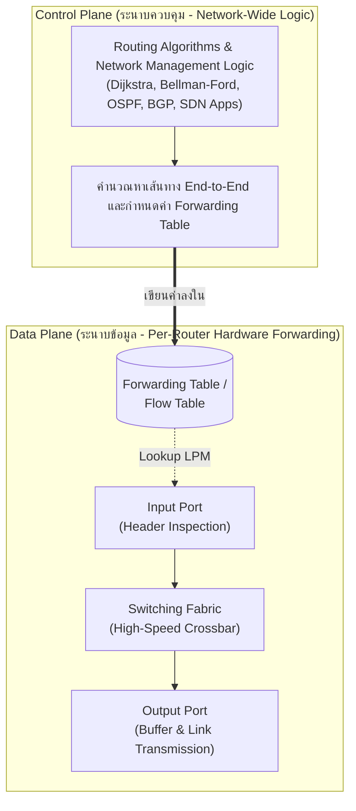

> [!DEFINITION]
> **Forwarding vs. Routing (เปรียบเทียบเชิงอุปมา):**
> - **Routing (Control Plane):** เปรียบเหมือนการวางแผนการเดินทาง (Trip Planning) คำนวณว่าจะขับรถจากเชียงใหม่ไปภูเก็ตผ่านเส้นทางจังหวัดใดบ้าง โดยคำนึงถึงระยะทาง ค่าผ่านทาง หรือสภาพการจราจร
> - **Forwarding (Data Plane):** เปรียบเหมือนจังหวะที่รถขับมาถึงสี่แยกไฟแดง (Intersection) แล้วคนขับเลี้ยวรถออกจากแยกไปตามป้ายบอกทางที่ตั้งไว้

---

## 1.2 สถาปัตยกรรมแบบกระจายศูนย์ดั้งเดิม (Per-Router Control Plane)

ในเครือข่ายอินเทอร์เน็ตแบบดั้งเดิม ฟังก์ชัน Control Plane จะทำงานแบบ **กระจายศูนย์ (Distributed)** อยู่บนตัวเราเตอร์ทุกตัวในเครือข่าย:
- เราเตอร์แต่ละตัวจะมีโมดูล **Routing Algorithm Component** ทำงานอยู่บนหน่วยประมวลผล (Routing Processor) ภายในระบบปฏิบัติการของเราเตอร์
- เราเตอร์จะส่งข้อความสื่อสารแลกเปลี่ยนข้อมูลสถานะของเครือข่าย (เช่น Link State หรือ Distance Vectors) กับเราเตอร์ข้างเคียงหรือเราเตอร์อื่น ๆ ในเครือข่าย
- จากนั้นอัลกอริทึมบนแต่ละตัวจะประมวลผลเพื่อสร้างตาราง Local Forwarding Table ของตัวเอง

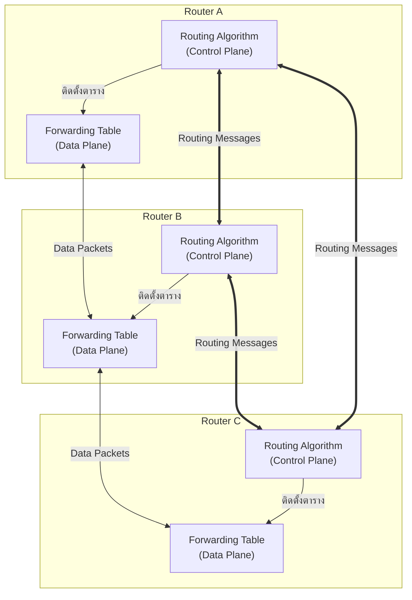

---

## 1.3 สถาปัตยกรรมศูนย์กลางควบคุมด้วยซอฟต์แวร์ (SDN Centralized Control Plane)

ในสถาปัตยกรรม **Software-Defined Networking (SDN)** จะทำการแยก (Decouple) ตรรกะการควบคุมออกจากตัวอุปกรณ์ฮาร์ดแวร์:
- อุปกรณ์เครือข่าย (เราเตอร์/สวิตช์) จะทำหน้าที่เพียงระนาบข้อมูลอย่างเดียว (Dumb Data Plane Switches) โดยส่งต่อแพ็กเก็ตตามกฎที่ได้รับ
- ตรรกะของ Control Plane ทั้งหมดถูกย้ายขึ้นไปรันอยู่บน **Remote Centralized Controller** (ที่เป็นศูนย์กลางเชิงตรรกะ หรือ Logically Centralized)
- โปรแกรมควบคุม (Control Application) คำนวณตาราง Flow Table / Forwarding Table และส่งลงมาติดตั้งบนสวิตช์ผ่านโปรโตคอลมาตรฐาน เช่น **OpenFlow** ผ่าน Southbound API

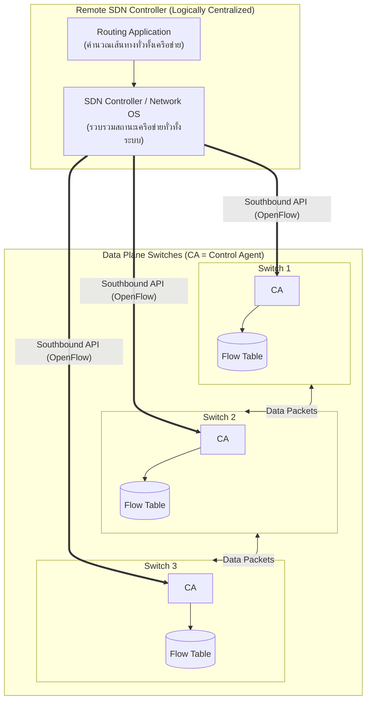

---

## 1.4 การเปรียบเทียบเชิงลึก: Per-Router Control Plane vs. SDN Control Plane

| มิติการเปรียบเทียบ | Per-Router Control Plane (แบบดั้งเดิม) | SDN Centralized Control Plane (แบบซอฟต์แวร์) |
| :--- | :--- | :--- |
| **ตำแหน่งของตรรกะควบคุม** | กระจายตัวอยู่บนตัวเราเตอร์ทุกตัว (Distributed on every router) | รวมศูนย์เชิงตรรกะอยู่บน Controller ภายนอก (Logically Centralized) |
| **ความสัมพันธ์ของ Hardware & Logic** | ผูกติดกันอย่างแนบแน่น (Tightly Coupled ในตู้เดียวกันจากผู้ผลิตเดียว) | แยกขาดจากกัน (Decoupled Data Plane & Control Plane) |
| **ความยืดหยุ่นในการเขียนโปรแกรม** | ต่ำมาก ถูกจำกัดด้วยเฟิร์มแวร์ของผู้ผลิตอุปกรณ์ (Vendor Proprietary) | สูงมาก สามารถเขียนโปรแกรมภาษาชั้นสูง (Python, Java) สั่งการได้ |
| **มุมมองต่อโทโปโลยีเครือข่าย** | รู้เฉพาะที่ตนเองแลกเปลี่ยน (Local view ค่อย ๆ ขยายผ่านการแลกเปลี่ยน) | มีมุมมองทั่วทั้งเครือข่ายแบบเรียลไทม์ (Global Network View) |
| **โปรโตคอลที่เกี่ยวข้อง** | OSPF, IS-IS, RIP, BGP | OpenFlow, NETCONF, RESTful Northbound APIs |
| **จุดล้มเหลวเดี่ยว (SPOF)** | ไม่มี ล้มเหลวเป็นรายโหนด แต่ Converge ช้าเมื่อเกิดปัญหาซับซ้อน | มีในเชิงกายภาพ หากไม่ทำ Controller Cluster แบบสำรองข้ามเครื่อง |

---

# 2. พื้นฐานการเลือกเส้นทางและการจัดหมวดหมู่อัลกอริทึม (Routing Fundamentals & Algorithm Classification) (Slides 8–11)

## 2.1 นิยามของเส้นทางที่ดี (What is a "Good" Path?)

เป้าหมายสูงสุดของ Routing Protocol คือการค้นหา **"เส้นทางที่ดี (Good Path)"** จากโฮสต์ส่งผ่านเราเตอร์ในเครือข่ายไปยังโฮสต์รับ คำว่า "ดี" ขึ้นอยู่กับเมตริก (Metric) ของเครือข่าย:
1. **Least Cost Path:** เส้นทางที่มีผลรวมของค่าใช้จ่าย (Cost) ต่ำที่สุด
2. **Fastest Path:** เส้นทางที่มีค่าความหน่วงเวลารวม (Delay / Latency) ต่ำที่สุด
3. **Least Congested Path:** เส้นทางที่ผ่านลิงก์ที่มีความหนาแน่นของการใช้งานต่ำที่สุด หลีกเลี่ยงการเกิดคอขวด (Congestion avoidance)

---

## 2.2 แบบจำลองนามธรรมเชิงกราฟ (Graph Abstraction & Link Costs)

ในการสร้างแบบจำลองคณิตศาสตร์ เราแปลงเครือข่ายให้อยู่ในรูปของ **กราฟ $G = (V, E)$**:
- $V$ (Vertices / Nodes): เซตของโหนด ซึ่งแทนอุปกรณ์ **เราเตอร์ (Routers)** เช่น $V = \{u, v, w, x, y, z\}$
- $E$ (Edges / Links): เซตของเส้นเชื่อม ซึ่งแทน **ลิงก์ทางกายภาพ (Physical Links)** ระหว่างเราเตอร์ เช่น $(u, v) \in E$
- $c(x, y)$: ฟังก์ชันต้นทุนของลิงก์ (Link Cost) ระหว่างโหนด $x$ และ $y$ โดยกำหนดว่า:
  - หาก $(x, y) \notin E$ ค่าต้นทุนจะเป็นอนันต์ ($c(x, y) = \infty$)
  - สำหรับกราฟแบบไม่มีทิศทาง (Undirected Graph) ทั่วไป: $c(x, y) = c(y, x)$

$$Cost(Path(x_1, x_2, \dots, x_p)) = \sum_{i=1}^{p-1} c(x_i, x_{i+1})$$

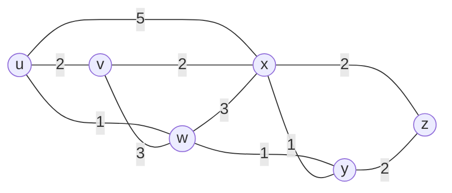

> [!INFO]
> **ค่า Link Cost ในทางปฏิบัติมาจากไหน?**
> 1. ผู้ดูแลระบบกำหนดเองตามนโยบาย (Monetary cost หรือค่าคงที่ = 1 เพื่อนับ Hop Count)
> 2. ผกผันกับ Bandwidth ของลิงก์ (เช่น ใน OSPF กำหนด $Cost = \frac{10^8 \text{ bps}}{\text{Bandwidth}}$ ลิงก์เร็วกว่าจะมี Cost ต่ำกว่า)
> 3. แปรผันตามความหน่วงเวลาและระดับความหนาแน่นของการรอคิว (Congestion / Delay)

---

## 2.3 การจำแนกประเภทอัลกอริทึมการเลือกเส้นทาง (Routing Algorithm Classification)

อัลกอริทึมการเลือกเส้นทางสามารถจัดหมวดหมู่ได้ตามเกณฑ์ 2 ด้าน:

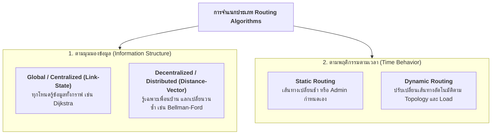

1. **จำแนกตามโครงสร้างข้อมูล (Information Structure):**
   - **Global (Link-State):** เราเตอร์ทุกตัวมีข้อมูลครบถ้วนสมบูรณ์เกี่ยวกับโครงข่ายและค่าใช้จ่ายของทุกลิงก์ (Complete Topology & Costs) ก่อนที่จะเริ่มคำนวณ เช่น **Dijkstra's Algorithm**
   - **Decentralized (Distance-Vector):** แต่ละโหนดรู้เพียงค่าใช้จ่ายไปยังเพื่อนบ้านที่เชื่อมต่อโดยตรง จากนั้นทำการแลกเปลี่ยนตารางเวกเตอร์ระยะทางกับเพื่อนบ้านเป็นรอบ ๆ ค่อย ๆ ประมวลผลแบบวนซ้ำจนเข้าสู่จุดสมดุล เช่น **Bellman-Ford Algorithm**
2. **จำแนกตามพฤติกรรมตามเวลา (Time Behavior):**
   - **Static:** เส้นทางไม่เปลี่ยนแปลงไปตามเวลา นอกเสียจากผู้ดูแลระบบจะเข้าแก้ไขด้วยตนเอง
   - **Dynamic:** เส้นทางปรับเปลี่ยนแบบเรียลไทม์เมื่อมีลิงก์ขาด หรือเมื่อความหนาแน่นของข้อมูลเปลี่ยนแปลงไป

---

# 3. อัลกอริทึมแบบ Link-State และ Dijkstra’s Algorithm (Slides 12–30)

## 3.1 คุณลักษณะและกลไกของ Link-State (LS) Routing

ในสถาปัตยกรรม Link-State:
1. แต่ละโหนดจะสำรวจและตรวจสอบสถานะของลิงก์ที่เชื่อมต่อกับตนเอง (ค่า Cost และสถานะ Up/Down)
2. สร้างแพ็กเก็ตพิเศษที่เรียกว่า **Link-State Packet (LSP)** หรือ LSA
3. ทำการกระจายแพ็กเก็ตนี้ไปยังเราเตอร์ **ทุกตัวในเครือข่าย** ผ่านกลไก **Link-State Broadcast / Flooding**
4. ทำให้เราเตอร์ทุกตัวมีสำเนาฐานข้อมูลโครงสร้างเครือข่าย (Link-State Database - LSDB) ที่เหมือนกันทุกประการ
5. แต่ละโหนดรันอัลกอริทึมหาเส้นทางสั้นที่สุด เช่น **Dijkstra's Algorithm** โดยเอาตัวเองเป็นโหนดราก (Root) เพื่อสร้างตาราง Forwarding Table

---

## 3.2 รายละเอียดคณิตศาสตร์และนิยามสัญลักษณ์ของ Dijkstra's Algorithm

กำหนดสัญลักษณ์มาตรฐานในการคำนวณ:
- $u$: โหนดต้นทางที่ทำการคำนวณ (Source Node)
- $c(x, y)$: ค่าต้นทุนของลิงก์โดยตรงระหว่างโหนด $x$ และ $y$ (หากไม่เชื่อมต่อกันโดยตรง กำหนดให้เป็น $\infty$)
- $D(v)$: ค่าใช้จ่ายรวมสะสมที่ต่ำที่สุดในปัจจุบันของเส้นทางจากโหนดต้นทาง $u$ ไปยังโหนดปลายทาง $v$
- $p(v)$: โหนดก่อนหน้าตัวสุดท้าย (Predecessor Node) บนเส้นทางที่มีต้นทุนต่ำสุดปัจจุบันจาก $u$ ไปยัง $v$
- $N'$: เซตของโหนดที่อัลกอริทึมได้ค้นพบและยืนยันเส้นทางที่มีต้นทุนต่ำสุดอย่างสมบูรณ์แล้ว (Permanently Settled Nodes)

---

## 3.3 ลำดับขั้นตอนการทำงานของ Dijkstra's Algorithm (Formal Algorithm Specification)

```text
Initialization:
  N' = {u}                                  // นำโหนดต้นทางเข้าสู่เซต N'
  for all nodes v:
    if v is a neighbor of u:
      D(v) = c(u, v)
      p(v) = u
    else:
      D(v) = infinity

Loop:
  find w not in N' such that D(w) is a minimum
  add w to N'
  update D(v) for each neighbor v of w and not in N':
    if D(w) + c(w, v) < D(v):
      D(v) = D(w) + c(w, v)
      p(v) = w
  until all nodes are in N'
```

---

## 3.4 ตัวอย่างการประมวลผลและตาราง Trace Table แบบ Step-by-Step (Slides 16–22)

พิจารณาเครือข่าย 6 โหนดมาตรฐานจากสไลด์: $u, v, w, x, y, z$ ที่มีค่า Link Cost ดังนี้:
- $c(u,v)=2, c(u,x)=1, c(u,w)=5$
- $c(v,w)=3, c(v,x)=2$
- $c(x,w)=3, c(x,y)=1$
- $c(w,y)=1, c(w,z)=5$
- $c(y,z)=2$

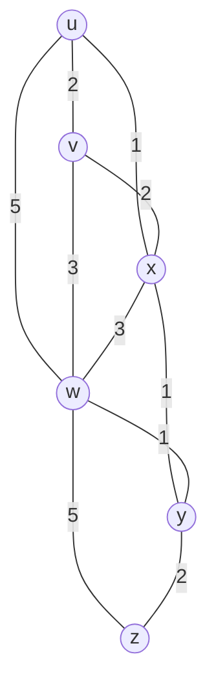

### 📊 ตาราง Trace Table การทำงานของ Dijkstra จากโหนดต้นทาง $u$:

| Step | $N'$ | $D(v), p(v)$ | $D(w), p(w)$ | $D(x), p(x)$ | $D(y), p(y)$ | $D(z), p(z)$ | <span style="white-space:nowrap">โหนดที่เลือก</span> |
| :---: | :--- | :---: | :---: | :---: | :---: | :---: | :---: |
| **0** | $\{u\}$ | $2, u$ | $5, u$ | $\mathbf{1, u}$ | $\infty$ | $\infty$ | <span style="white-space:nowrap">**$x$** ($D=1$)</span> |
| **1** | $\{u, x\}$ | $\mathbf{2, u}$ | $4, x$ | — | $\mathbf{2, x}$ | $\infty$ | <span style="white-space:nowrap">**$y$** ($D=2$)</span> |
| **2** | $\{u, x, y\}$ | $\mathbf{2, u}$ | $3, y$ | — | — | $4, y$ | <span style="white-space:nowrap">**$v$** ($D=2$)</span> |
| **3** | $\{u, x, y, v\}$ | — | $\mathbf{3, y}$ | — | — | $4, y$ | <span style="white-space:nowrap">**$w$** ($D=3$)</span> |
| **4** | $\{u, x, y, v, w\}$ | — | — | — | — | $\mathbf{4, y}$ | <span style="white-space:nowrap">**$z$** ($D=4$)</span> |
| **5** | $\{u, x, y, v, w, z\}$ | — | — | — | — | — | <span style="white-space:nowrap">ครบทุกโหนด</span> |

**คำอธิบายการคำนวณแต่ละ Step (Step-by-Step Breakdown):**
- **Step 0 (Initialization):** เริ่มที่โหนด $u$ ลิงก์ที่เชื่อมตรงคือ $v(2), x(1), w(5)$ ส่วน $y, z$ ยังไปไม่ถึง ($\infty$) โหนดที่มีค่า $D$ น้อยที่สุดคือ **$x$** ($D=1$) $\rightarrow$ ดึง $x$ เข้าสู่ $N'$
- **Step 1:** ตรวจสอบผ่าน $x$: $D(w) = \min(5, 1+3) = 4, x$ และ $D(y) = \min(\infty, 1+1) = 2, x$ ค่าน้อยสุดระหว่างโหนดที่เหลือคือ 2 (โหนด $y$ และ $v$) $\rightarrow$ เลือกลำดับถัดไปคือ **$y$** ($D=2$) เข้าสู่ $N'$
- **Step 2:** ตรวจสอบผ่าน $y$: $D(w) = \min(4, 2+1) = 3, y$ และ $D(z) = \min(\infty, 2+2) = 4, y$ ค่าน้อยสุดในรอบนี้คือ $D(v)=2$ $\rightarrow$ ดึง **$v$** เข้าสู่ $N'$
- **Step 3:** อัปเดตจาก $v$ ไม่มีเส้นทางที่ดีกว่าเดิม ค่าต่ำสุดคือ $D(w)=3$ $\rightarrow$ ดึง **$w$** เข้าสู่ $N'$
- **Step 4:** ตรวจสอบผ่าน $w$: $D(z) = \min(4, 3+5) = 4, y$ (ทางเดิมผ่าน $y$ ยังคงดีกว่า) $\rightarrow$ ดึง **$z$** ($D=4$) เข้าสู่ $N'$
- **Step 5:** ทุกโหนดถูกเพิ่มลงใน $N'$ ครบถ้วน $\rightarrow$ สิ้นสุดการคำนวณ Shortest-Path Tree สำเร็จ

---

## 3.5 การสร้าง Forwarding Table จาก Shortest-Path Tree

เมื่อสร้าง Shortest-Path Tree จากโหนด $u$ เป็นจุดศูนย์กลาง:
- เส้นทางไปยัง $x$: ลิงก์ตรง $(u, x)$ มีต้นทุน = 1 $\rightarrow$ Next-Hop interface คือลิงก์ไปหา $x$
- เส้นทางไปยัง $y$: เส้นทางคือ $u \rightarrow x \rightarrow y$ มีต้นทุน = 2 $\rightarrow$ Next-Hop interface คือ $(u, x)$
- เส้นทางไปยัง $v$: ลิงก์ตรง $(u, v)$ มีต้นทุน = 2 $\rightarrow$ Next-Hop interface คือ $(u, v)$
- เส้นทางไปยัง $w$: เส้นทางคือ $u \rightarrow x \rightarrow y \rightarrow w$ มีต้นทุน = 3 $\rightarrow$ Next-Hop interface คือ $(u, x)$
- เส้นทางไปยัง $z$: เส้นทางคือ $u \rightarrow x \rightarrow y \rightarrow z$ มีต้นทุน = 4 $\rightarrow$ Next-Hop interface คือ $(u, x)$

### ตาราง Forwarding Table ของโหนด $u$:

| Destination (ปลายทาง) | Next Hop Link / Outgoing Interface | Path Cost รวม |
| :---: | :---: | :---: |
| **$v$** | $(u, v)$ | 2 |
| **$x$** | $(u, x)$ | 1 |
| **$y$** | $(u, x)$ | 2 |
| **$w$** | $(u, x)$ | 3 |
| **$z$** | $(u, x)$ | 4 |

---

## 3.6 การวิเคราะห์ความซับซ้อนเชิงคำนวณ (Computational Complexity)

สมมติว่าเครือข่ายมีจำนวนเราเตอร์ $n$ โหนด:
1. ในรอบที่ 1 ต้องค้นหาโหนดที่มีค่า $D$ ต่ำสุดจาก $n$ โหนด
2. ในรอบที่ 2 ต้องค้นหาจาก $n-1$ โหนด ... ไปเรื่อย ๆ จนถึงรอบสุดท้าย
3. จำนวนครั้งของการเปรียบเทียบคือ:
   $$\sum_{i=1}^{n} i = \frac{n(n+1)}{2} = O(n^2)$$
4. หากนำโครงสร้างข้อมูลขั้นสูงเช่น **Min-Heap / Priority Queue** มาช่วยในการดึงค่าโหนดต่ำสุด ความซับซ้อนจะลดลงเหลือ **$O(n \log n)$** หรือ $O(|E| + |V| \log |V|)$ เมื่อใช้ Fibonacci Heap

---

## 3.7 ปัญหาการแกว่งของเส้นทางเมื่อ Cost ขึ้นกับปริมาณทราฟฟิก (Route Oscillations)

เมื่อมีการกำหนดให้ Link Cost แปรผันตามปริมาณทราฟฟิกจริง (Traffic Volume / Congestion) จะเกิดปรากฏการณ์ที่เส้นทางสลับไปมาอย่างรุนแรงและไม่มีวันนิ่ง เรียกว่า **Route Oscillations**:

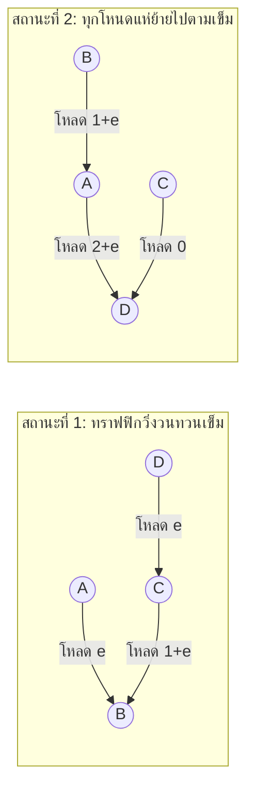

> [!WARNING]
> **กลไกการเกิด Oscillations:**
> 1. เมื่อทราฟฟิกเดินทางผ่านเส้นทางหนึ่ง เส้นทางนั้นจะมี Cost สูงขึ้นเพราะความหนาแน่นเพิ่มขึ้น
> 2. ในรอบการรัน Link-State ถัดไป เราเตอร์ทุกตัวจะคำนวณพบว่าอีกเส้นทางหนึ่งมี Cost ต่ำกว่า จึง "พร้อมใจกันเปลี่ยน" ไปใช้อีกเส้นทางพร้อมกัน
> 3. ส่งผลให้อีกเส้นทางเกิดความหนาแน่นขึ้นทันที และเส้นทางเดิมกลับมาว่าง วนซ้ำไปมาตลอดเวลา
> 
> **วิธีป้องกันและแก้ไขในทางปฏิบัติ:**
> - อย่าให้ Link Cost อิงกับความหนาแน่นของการรับส่งข้อมูลเพียงอย่างเดียว (ใช้ Bandwidth คงที่)
> - ไม่รันอัลกอริทึม Link-State พร้อมกันในเวลาเดียวกัน โดยการเพิ่มความสุ่มของเวลา (Randomize / Jittering Execution Timer)

---

# 4. อัลกอริทึมแบบ Distance-Vector และ Bellman-Ford Equation (Slides 31–52)

## 4.1 หลักการของ Distance-Vector (DV) และสมการ Bellman-Ford

Distance-Vector ทำงานบนหลักการของ **Dynamic Programming** โดยมีหัวใจสำคัญอยู่ที่ **สมการ Bellman-Ford (Bellman-Ford Equation)**:

$$d_x(y) = \min_v \{ c(x, v) + d_v(y) \}$$

โดยที่:
- $d_x(y)$: ค่าใช้จ่ายของเส้นทางที่มีต้นทุนต่ำสุดจากโหนด $x$ ไปยังโหนดปลายทาง $y$
- $c(x, v)$: ค่าต้นทุนของลิงก์จากโหนด $x$ ไปยังโหนดเพื่อนบ้าน $v$ ที่ติดกันโดยตรง
- $d_v(y)$: ค่าใช้จ่ายของเส้นทางที่มีต้นทุนต่ำสุดจากเพื่อนบ้าน $v$ ไปยังโหนดปลายทาง $y$
- $\min_v$: การเลือกค่าที่ต่ำที่สุดผ่านเพื่อนบ้าน $v$ ทุกตัวของโหนด $x$

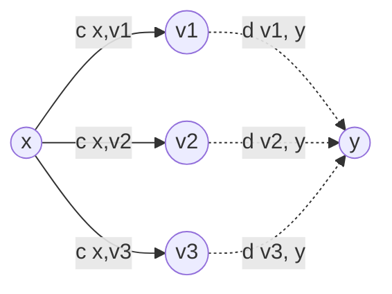

---

## 4.2 การแลกเปลี่ยนเวกเตอร์และสภาวะการทำงานแบบกระจายศูนย์ (Distributed Asynchronous Mechanics)

ในอัลกอริทึม Distance-Vector:
1. **Iterative (วนซ้ำ):** การทำงานจะดำเนินต่อไปเรื่อย ๆ จนกระทั่งไม่มีโหนดใดส่งข้อมูลเวกเตอร์ชุดใหม่มาให้ (No news is good news)
2. **Asynchronous (ไม่ประสานเวลา):** แต่ละโหนดไม่จำเป็นต้องรันพร้อมกัน โหนดจะเริ่มคำนวณใหม่เมื่อเกิด 2 เหตุการณ์นี้เท่านั้น:
   - ตรวจพบว่าค่า Link Cost ของลิงก์ที่เชื่อมกับเพื่อนบ้านโดยตรงเปลี่ยนแปลงไป
   - ได้รับเวกเตอร์อัปเดตระยะทางใหม่จากเพื่อนบ้านที่เชื่อมต่ออยู่
3. **Distributed (กระจายศูนย์):** แต่ละโหนดแลกเปลี่ยนข้อมูล **เฉพาะกับเพื่อนบ้านโดยตรง (Direct Neighbors)** เท่านั้น ไม่มีการบรอดแคสต์ท่วมทั้งเครือข่ายเหมือน Link-State

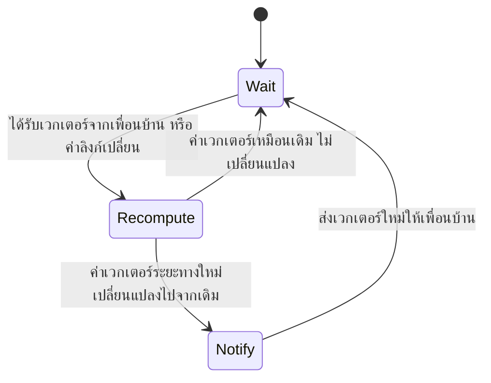

---

## 4.3 ตัวอย่างการคำนวณตาราง Distance Vector แบบ Step-by-Step (Slides 37–42)

พิจารณาเครือข่ายอย่างง่าย 3 โหนด: $x, y, z$ ที่เชื่อมต่อกันเป็นสามเหลี่ยม:
- $c(x, y) = 2$
- $c(x, z) = 7$
- $c(y, z) = 1$

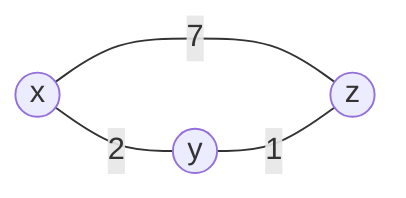

### รอบที่ 1 (Initialization):
แต่ละโหนดรู้จักเฉพาะระยะทางไปยังตัวเอง (Cost = 0) และระยะทางไปยังเพื่อนบ้านโดยตรง:
- เวกเตอร์ของ $x$: $D_x = [x:0, y:2, z:7]$
- เวกเตอร์ของ $y$: $D_y = [x:2, y:0, z:1]$
- เวกเตอร์ของ $z$: $D_z = [x:7, y:1, z:0]$

### รอบที่ 2 (แลกเปลี่ยนเวกเตอร์และคำนวณใหม่ตามสมการ Bellman-Ford):
- โหนด $x$ คำนวณระยะทางไปยัง $z$:
  $$D_x(z) = \min \{ c(x, y) + D_y(z), c(x, z) + D_z(z) \} = \min \{ 2 + 1, 7 + 0 \} = \min \{ 3, 7 \} = \mathbf{3}$$
  (เลือกเดินทางผ่านโหนด $y$) $\rightarrow$ เวกเตอร์ของ $x$ อัปเดตเป็น $[0, 2, \mathbf{3}]$
- โหนด $z$ คำนวณระยะทางไปยัง $x$:
  $$D_z(x) = \min \{ c(z, y) + D_y(x), c(z, x) + D_x(x) \} = \min \{ 1 + 2, 7 + 0 \} = \min \{ 3, 7 \} = \mathbf{3}$$
  (เลือกเดินทางผ่านโหนด $y$) $\rightarrow$ เวกเตอร์ของ $z$ อัปเดตเป็น $[\mathbf{3}, 1, 0]$
- โหนด $y$ คำนวณ:
  $$D_y(x) = 2, D_y(z) = 1$$ (ไม่มีการเปลี่ยนแปลง)

### รอบที่ 3 (สภาวะนิ่ง - Quiescent State):
ทุกโหนดแลกเปลี่ยนเวกเตอร์และตรวจสอบพบว่าค่าไม่มีการเปลี่ยนแปลง อัลกอริทึมหยุดทำงาน เข้าสู่สภาวะสมดุล (Convergence)

---

## 4.4 การเปรียบเทียบเชิงลึกระหว่าง Link-State vs. Distance-Vector

| คุณสมบัติ | Link-State (Dijkstra) | Distance-Vector (Bellman-Ford) |
| :--- | :--- | :--- |
| **การส่งผ่านข้อความ (Message Complexity)** | ส่งข้อมูลให้ทุกโหนดในระบบ ($O(n \cdot E)$ ข้อความ) ผ่าน Flooding | ส่งข้อมูลเฉพาะระหว่างเพื่อนบ้านที่เชื่อมต่อโดยตรงเท่านั้น |
| **ความเร็วในการลู่เข้า (Speed of Convergence)** | **เร็วมาก:** รัน $O(n^2)$ หรือ $O(n \log n)$ และไม่พบปัญหา Routing Loop | **ช้ากว่า:** อาจเกิด Routing Loop ชั่วคราว และมีปัญหา Count-to-Infinity |
| **ความทนทานต่อข้อผิดพลาด (Robustness)** | **สูงกว่ามาก:** หากเราเตอร์ตัวหนึ่งประมวลผลผิดพลาด จะส่งผลต่อตารางของตนเองเท่านั้น ไม่แพร่กระจายความเสียหาย | **ต่ำกว่า:** หากมีเราเตอร์ตัวใดคำนวณผิดหรือประกาศค่าเพี้ยน (Incorrect Cost) จะทำให้ข้อผิดพลาดลามไปทั่วทั้งระบบเครือข่าย |
| **ความต้องการหน่วยความจำ** | สูง ต้องเก็บ Topology ทั้งหมดใน LSDB | ต่ำ เก็บเพียงตารางระยะทางของตนเองและเพื่อนบ้าน |
| **โปรโตคอลตัวแทนในโลกจริง** | **OSPF, IS-IS** | **RIP, BGP** (Path Vector ซึ่งประยุกต์มาจาก DV) |

---

## 4.5 ผลกระทบเมื่อค่า Link Cost มีการเปลี่ยนแปลง (Link-Cost Changes & Failures)

พฤติกรรมของ Distance-Vector มีความแตกต่างกันอย่างยิ่งระหว่างข่าวดีและข่าวร้าย:
- **"Good news travels fast" (ข่าวดีแพร่กระจายเร็วมาก):**
  หากค่า Link Cost ลดลง (เช่น ลิงก์เร็วขึ้น) ข้อมูลจะส่งต่อไปยังเพื่อนบ้าน และทุกโหนดจะอัปเดตเส้นทางที่สั้นลงได้ในทันทีภายใน 1–2 รอบการแลกเปลี่ยน
- **"Bad news travels slow" (ข่าวร้ายแพร่กระจายช้ามาก):**
  หากค่า Link Cost เพิ่มขึ้นอย่างมาก หรือลิงก์ขาดออกจากกัน จะเกิดความเข้าใจผิดระหว่างโหนดข้างเคียงจนนำไปสู่ปัญหา **Count-to-Infinity**

---

## 4.6 ปัญหานับวนไม่รู้จบ (Count-to-Infinity Problem)

สมมติว่าลิงก์ระหว่างโหนด $x$ และ $y$ ที่เดิมมีค่าเท่ากับ 4 เกิดขาดหรือต้นทุนพุ่งขึ้นเป็น 60:

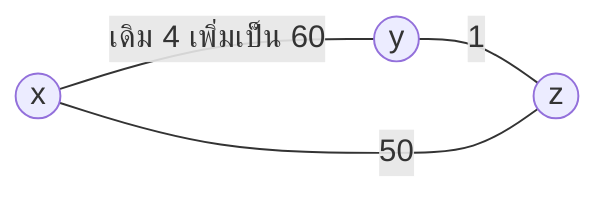

```text
1. ก่อนลิงก์เปลี่ยน: y วิ่งไป x ด้วยต้นทุน 4; z รู้ว่า y วิ่งไป x ได้ด้วยต้นทุน 4 ดังนั้น z จึงวิ่งไป x ผ่าน y ด้วยต้นทุน 1 + 4 = 5
2. เมื่อลิงก์ (x, y) ขาด/พุ่งเป็น 60:
   - y ตรวจพบว่าต้นทุนตรงไปหา x เพิ่มขึ้น จึงมองหาเพื่อนบ้าน
   - แต่ y เห็นว่า z เคยประกาศว่า "z มีทางไปหา x ด้วยต้นทุน 5"
   - y จึงคิดผิดว่า: "ถ้าอย่างนั้น เราวิ่งอ้อมไปหา z ดีกว่า ต้นทุนจะเป็น c(y,z) + Dz(x) = 1 + 5 = 6"
   - y จึงอัปเดตเวกเตอร์ของตนเป็น 6 แล้วส่งบอก z
3. เมื่อ z ได้รับเวกเตอร์จาก y:
   - z คำนวณใหม่: "y บอกว่าไป x ใช้ 6 ดังนั้นเราไป x ผ่าน y จะใช้ 1 + 6 = 7"
   - z อัปเดตเวกเตอร์เป็น 7 แล้วส่งกลับไปบอก y
4. เกิดการนับวนกลับไปกลับมา: 6 -> 7 -> 8 -> 9 -> ...
   จนกระทั่งค่าพุ่งทะลุ 50 (ต้นทุนของลิงก์ตรง x-z) จึงจะหยุด
```

---

## 4.7 การแก้ไขปัญหาด้วย Poisoned Reverse และข้อจำกัดเชิงโครงสร้าง

เพื่อแก้ไขปัญหานี้ จึงมีการกำหนดกฎ **Poisoned Reverse (การวางยาพิษเส้นทางย้อนกลับ)**:
> [!DEFINITION]
> **หลักการของ Poisoned Reverse:**
> หากโหนด $z$ ส่งข้อมูลไปยังปลายทาง $x$ โดยอาศัยเส้นทางผ่านโหนด $y$ ($z \rightarrow y \rightarrow x$) โหนด $z$ จะต้อง **โกหกโหนด $y$** ด้วยการประกาศว่าระยะทางของตนไปยัง $x$ มีค่าเป็นอนันต์ ($D_z(x) = \infty$) เพื่อป้องกันไม่ให้ $y$ แอบวกกลับมาเลือกใช้ตนเองในการเดินทางไปหา $x$

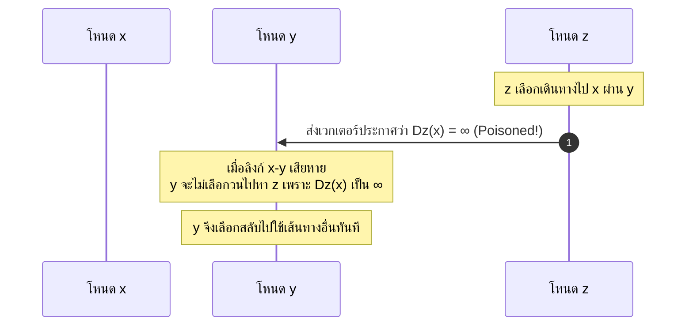

> [!WARNING]
> **ข้อจำกัดของ Poisoned Reverse (ทำไมจึงไม่สามารถแก้ปัญหาได้ 100%):**
> Poisoned Reverse สามารถแก้ปัญหา Routing Loop ระหว่างโหนดที่อยู่ติดกัน **2 โหนด (2-Node Loops)** ได้อย่างสมบูรณ์แบบ แต่ **ไม่สามารถแก้ไข Loop ที่มีตั้งแต่ 3 โหนดขึ้นไป (Loops involving 3 or more nodes)** ได้ เพราะการวางยาพิษเกิดขึ้นเฉพาะลิงก์สองตัวที่ติดกัน ไม่สามารถครอบคลุมทั้งวงจรของกราฟได้

---

# 5. การเลือกเส้นทางระดับอินเทอร์เน็ตที่ขยายขนาดได้และโปรโตคอล OSPF (Slides 53–60)

## 5.1 ความท้าทายด้านการขยายขนาดและอิสระในการบริหารจัดการ (Scalability & Administrative Autonomy)

ในเครือข่ายอุดมคติ เราเตอร์ทุกตัวมองเห็นซึ่งกันและกันในลักษณะแบนราบ (Flat Routing) แต่ในเครือข่ายอินเทอร์เน็ตจริงไม่สามารถทำเช่นนั้นได้เนื่องจากข้อจำกัด 2 ประการ:
1. **การขยายขนาด (Scale):** อินเทอร์เน็ตมีโฮสต์และเครือข่ายปลายทางนับพันล้าน หากเราเตอร์ทุกตัวต้องเก็บตารางและส่งข้อมูลหาทุกจุด หน่วยความจำของตาราง Forwarding Table จะระเบิด (Table Explosion) และการส่งข้อความ Link-State Broadcast ทั่วโลกจะกินแบนด์วิธจนเครือข่ายล่ม
2. **อิสระในการบริหารจัดการ (Administrative Autonomy):** อินเทอร์เน็ตประกอบด้วยองค์กร, ISP, และมหาวิทยาลัยจำนวนมาก ซึ่งแต่ละแห่งต้องการมีอำนาจเบ็ดเสร็จในการตั้งค่านโยบายของตนเอง โดยไม่ต้องการให้บุคคลภายนอกล่วงรู้โครงสร้างภายใน

---

## 5.2 แนวคิดระบบอัตโนมัติ (Autonomous Systems: AS)

อินเทอร์เน็ตจึงแก้ปัญหาโดยการรวมกลุ่มเราเตอร์ออกเป็นเขตการปกครองที่เรียกว่า **Autonomous System (AS)** หรือ Routing Domain:
- เราเตอร์ที่อยู่ภายใน AS เดียวกันจะรันโปรโตคอลเลือกเส้นทางเดียวกัน เรียกว่า **Intra-AS Routing Protocol** (หรือ Interior Gateway Protocol - **IGP**)
- เราเตอร์ที่อยู่ตรงขอบของ AS ซึ่งเชื่อมต่อกับ AS อื่น จะมีหน้าที่รันโปรโตคอลเลือกเส้นทางระหว่าง AS เรียกว่า **Inter-AS Routing Protocol** (หรือ Exterior Gateway Protocol - **EGP**)

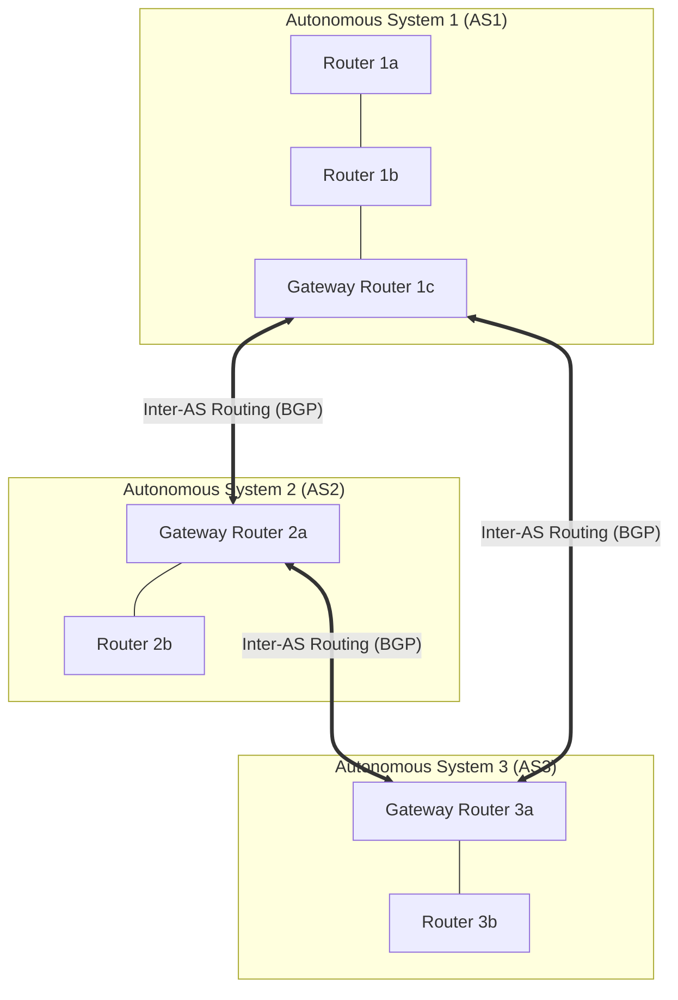

---

## 5.3 โปรโตคอลเลือกเส้นทางภายใน AS (Intra-AS Routing / IGP)

โปรโตคอล IGP ที่นิยมใช้งานในอดีตและปัจจุบัน:
- **RIP (Routing Information Protocol):** ใช้ Distance-Vector แบบดั้งเดิม, จำกัดระยะทางสูงสุด 15 Hops (Hop 16 = Infinity), แลกเปลี่ยนตารางทุก 30 วินาทีผ่าน UDP (ปัจจุบันไม่นิยมในระบบใหญ่)
- **OSPF (Open Shortest Path First):** ใช้ Link-State เป็นมาตรฐานเปิดของ IETF นิยมใช้งานมากที่สุดในระดับ Enterprise และ Campus Network
- **IS-IS (Intermediate System to Intermediate System):** ใช้ Link-State นิยมใช้งานในโครงข่ายแกนหลักของ ISP ขนาดยักษ์
- **EIGRP:** โปรโตคอล Advanced Distance-Vector ของค่าย Cisco

---

## 5.4 เจาะลึกโปรโตคอล OSPF (Open Shortest Path First)

OSPF เป็นโปรโตคอลแบบ **Link-State** ที่พัฒนาขึ้นมาแทนที่ RIP โดยมีจุดเด่นทางวิศวกรรม:
1. **Open Standard:** เป็นมาตรฐานเปิดตามข้อกำหนด RFC ไม่ผูกขาดกับฮาร์ดแวร์ยี่ห้อใดยี่ห้อหนึ่ง
2. **Dijkstra’s Algorithm:** เราเตอร์ทุกตัวรันอัลกอริทึม Dijkstra เพื่อสร้าง Shortest-Path Tree
3. **ความปลอดภัย (Security):** รองรับการยืนยันตัวตน (Authentication) ของข้อความ OSPF ด้วย MD5 หรือ Cryptographic Hashes เพื่อป้องกันเราเตอร์ปลอมแปลงส่งข้อมูลเท็จ
4. **Equal-Cost Multi-Path (ECMP):** หากมีหลายเส้นทางที่มีค่าใช้จ่ายต่ำสุดเท่ากัน OSPF อนุญาตให้กระจายโหลดการส่งข้อมูลไปพร้อม ๆ กันได้ (Load Balancing) โดยไม่ต้องเลือกเพียงเส้นทางเดียว
5. **Direct Encapsulation:** ข้อความ OSPF ถูกนำไปบรรจุลงใน **IP Datagram โดยตรง (IP Protocol Number = 89)** ไม่ต้องพึ่งพา TCP หรือ UDP

---

## 5.5 สถาปัตยกรรม OSPF แบบลำดับขั้นสองระดับ (Hierarchical OSPF)

เมื่อเครือข่ายภายในองค์กรมีขนาดใหญ่มาก OSPF รองรับการแบ่งโครงข่ายออกเป็นโครงสร้างลำดับชั้น 2 ระดับ:
- **Backbone Area (Area 0):** ทำหน้าที่เป็นแกนกลางหลักในการส่งต่อทราฟฟิกระหว่าง Area อื่น ๆ
- **Local Areas (Area 1, 2, ...):** พื้นที่ย่อยที่แยกการบรอดแคสต์ Link-State ของตนเอง ทำให้เราเตอร์ใน Area ทราบเฉพาะ Topology ละเอียดภายใน Area ของตนเท่านั้น ช่วยประหยัด CPU และ Memory อย่างมหาศาล

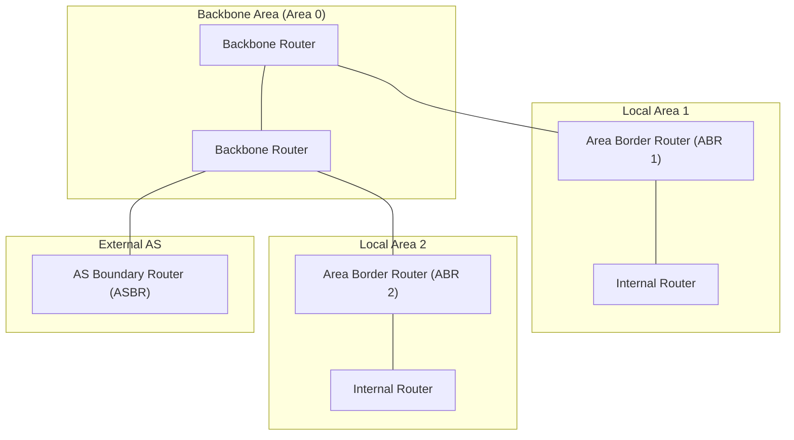

### การจัดหมวดหมู่ประเภทของเราเตอร์ใน Hierarchical OSPF:
1. **Internal Routers:** เราเตอร์ที่พอร์ตทั้งหมดเชื่อมต่ออยู่ภายใน Local Area เดียวกันเท่านั้น
2. **Area Border Routers (ABR):** เราเตอร์ที่เชื่อมต่อระหว่าง Local Area กับ Backbone Area (Area 0) ทำหน้าที่สรุปเส้นทาง (Route Summarization)
3. **Backbone Routers:** เราเตอร์ที่ทำหน้าที่ส่งต่อข้อมูลอยู่ภายใน Backbone Area 0
4. **Autonomous System Boundary Routers (ASBR):** เราเตอร์ที่ทำหน้าที่เชื่อมต่อและแลกเปลี่ยนเส้นทางกับเครือข่ายภายนอก (AS อื่น ๆ)

---

# 6. การเลือกเส้นทางระหว่างระบบอัตโนมัติ: โปรโตคอล BGP (Slides 61–76)

## 6.1 บทบาทสำคัญของ Border Gateway Protocol (BGP: The Glue of the Internet)

**BGP (Border Gateway Protocol)** หรือเวอร์ชันปัจจุบัน BGP-4 ถือเป็น **"กาวเชื่อมโยงอินเทอร์เน็ตเข้าด้วยกัน (The Glue of the Internet)"**:
- ทำหน้าที่เป็น Inter-AS Routing Protocol มาตรฐานหนึ่งเดียวของโลก
- มอบกลไกให้แต่ละ Autonomous System สามารถ:
  1. ได้รับข้อมูลการเข้าถึงซับเน็ตปลายทาง (Subnet Reachability Information) จาก AS ข้างเคียง
  2. กระจายข้อมูลเส้นทางเหล่านี้ไปยังเราเตอร์ทุกตัวภายใน AS ของตนเอง
  3. กำหนดเส้นทางที่ดีที่สุดไปยังซับเน็ตปลายทางโดยอิงตาม **นโยบายทางการค้า (Policy) และความสามารถในการเข้าถึง**

---

## 6.2 ประเภทของการเชื่อมต่อ: eBGP vs. iBGP Connections

BGP แบ่งการทำงานของการเชื่อมต่อ (BGP Sessions) ออกเป็น 2 ประเภทหลัก โดยรันอยู่บน **TCP Connection (Port 179)**:
- **eBGP (External BGP):** เซสชันระหว่างเราเตอร์เกตเวย์ของ 2 AS ที่อยู่ติดกัน เพื่อแลกเปลี่ยนเส้นทางข้ามพรมแดน
- **iBGP (Internal BGP):** เซสชันระหว่างเราเตอร์ที่อยู่ **ภายใน AS เดียวกัน** เพื่อกระจายข้อมูลเส้นทางภายนอกที่ได้รับจาก eBGP ไปให้เราเตอร์ตัวอื่น ๆ ในองค์กรได้รับทราบอย่างทั่วถึง

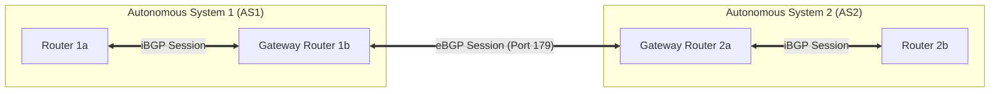

---

## 6.3 แอตทริบิวต์หลักของ BGP (BGP Attributes: AS-PATH และ NEXT-HOP)

เมื่อเราเตอร์ BGP ประกาศการเข้าถึงซับเน็ตปลายทาง (เช่น `138.16.64.0/24`) ข้อมูลจะถูกประกาศไปพร้อมกับ **BGP Attributes** สองแอตทริบิวต์ที่สำคัญที่สุดคือ:
1. **`AS-PATH`:** รายชื่อลำดับของ Autonomous System ที่ข้อความประกาศเส้นทางนี้เดินทางผ่านมา (เช่น `AS-PATH: AS67, AS17`)
   - **การป้องกัน Routing Loop:** หากเราเตอร์ได้รับประกาศเส้นทางที่มีหมายเลข AS ของตัวเองปรากฏอยู่ในรายการ `AS-PATH` เราเตอร์จะ **ปฏิเสธและทิ้งเส้นทางนั้นทันที**
2. **`NEXT-HOP`:** IP Address ของ Router Interface ของ AS ข้างเคียงที่เริ่มต้นข้อความ `AS-PATH` นั้น (จุดเชื่อมต่อแรกที่จะต้องส่งแพ็กเก็ตข้ามไป)

---

## 6.4 นโยบายการเลือกเส้นทางของ BGP (Policy-Based Routing)

ความแตกต่างสำคัญที่สุดระหว่าง Intra-AS และ Inter-AS คือ: **BGP ไม่ได้เลือกเส้นทางที่เร็วที่สุด แต่เลือกตาม "นโยบายทางการค้าและข้อตกลงทางธุรกิจ (Business Policy)"**:
- **Import Policy:** เกตเวย์เราเตอร์สามารถเลือกที่จะยอมรับ (Accept) หรือปฏิเสธ (Drop) การประกาศเส้นทางที่ได้รับมาจาก AS อื่นตามนโยบายความปลอดภัยและการเมือง
- **Export Policy:** กำหนดว่าจะโฆษณาเส้นทางไปยัง AS อื่นหรือไม่ (เช่น จะไม่โฆษณาเส้นทางของคู่แข่ง หรือจะไม่ยอมทำตัวเป็น Transit ให้กับผู้ที่ไม่ได้จ่ายเงิน)

---

## 6.5 ลำดับขั้นการตัดสินใจเลือกเส้นทางของเร้าเตอร์ BGP (BGP Route Selection Criteria)

หากเราเตอร์ BGP ได้รับข้อมูลเส้นทางไปยังปลายทางเดียวกันมากกว่าหนึ่งเส้นทาง เราเตอร์จะตัดสินใจเลือกเส้นทางตามลำดับความสำคัญ (Elimination Process) ดังนี้:
1. **Local Preference (ค่าความพึงพอใจเฉพาะที่):** เลือกเส้นทางที่มีค่า Local Preference สูงที่สุด (ตั้งค่าตามนโยบายขององค์กร)
2. **Shortest `AS-PATH`:** หากค่า Local Preference เท่ากัน ให้เลือกเส้นทางที่ผ่านจำนวน AS น้อยที่สุด (ความยาวของ `AS-PATH` สั้นที่สุด)
3. **Closest `NEXT-HOP` Router (Hot-Potato Routing):** เลือกเส้นทางที่มีเกตเวย์ NEXT-HOP ที่อยู่ใกล้กับเราเตอร์ตัวนั้นมากที่สุดภายใน IGP ของตนเอง
4. **BGP Identifier:** หากยังเสมอกัน ให้เลือกเส้นทางที่มีค่า IP/Router ID ของเราเตอร์ต้นทางต่ำที่สุดเป็นเกณฑ์ตัดสินสุดท้าย

---

## 6.6 กลไก Hot-Potato Routing

> [!DEFINITION]
> **Hot-Potato Routing (การโยนเผือกร้อน):**
> คือกลยุทธ์ที่เร้าเตอร์ต้องการกำจัดแพ็กเก็ตออกจากเขต AS ของตัวเองให้เร็วที่สุดเท่าที่จะทำได้ โดยเลือกลิงก์เกตเวย์ขาออกที่มีค่า Intra-AS Cost ต่ำที่สุด โดย **ไม่สนใจ** ว่าเมื่อแพ็กเก็ตข้ามไปอยู่นอก AS แล้ว จะต้องเดินทางไกลอีกเท่าใด

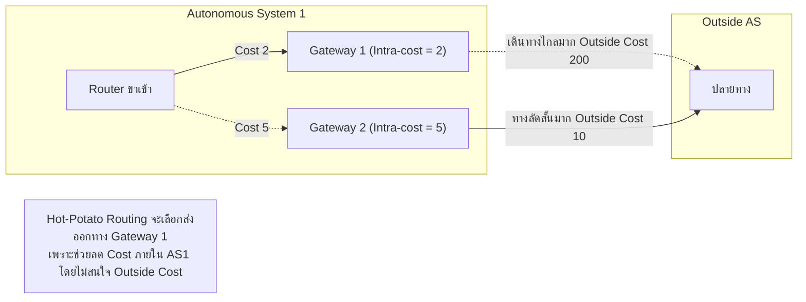

---

## 6.7 การแลกเปลี่ยนเส้นทางเชิงนโยบายพาณิชย์ (Customer-Provider vs. Peer-Peer Relationships)

ในเชิงธุรกิจ ความสัมพันธ์ระหว่างสอง AS แบ่งออกเป็น 2 โมเดลหลัก:

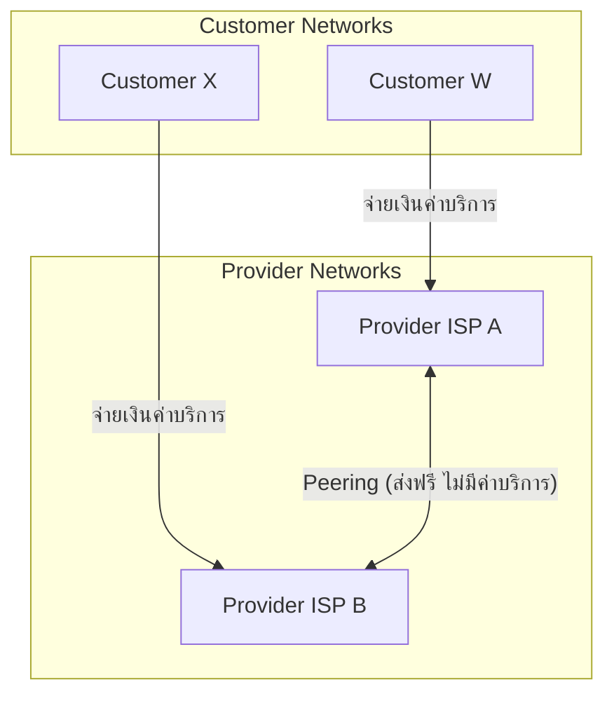

1. **Customer-Provider Relationship:** ลูกค้า (Customer) จ่ายเงินให้ผู้ให้บริการ (Provider) เพื่อเข้าถึงอินเทอร์เน็ต ดังนั้น Provider จะยอมส่งต่อทราฟฟิกให้ลูกค้าทุกกรณี
2. **Peer-to-Peer Relationship:** ISP สองแห่งตกลงแลกเปลี่ยนทราฟฟิกระหว่างลูกค้าของตนเองแบบเสมอกันโดยไม่คิดค่าบริการ (Free-peering) แต่ **จะไม่ยอมส่งต่อทราฟฟิกที่เป็นการ Transit ข้ามไปยัง ISP คู่แข่งอื่น** เพราะไม่ได้ผลประโยชน์ทางการเงิน

---

## 6.8 เหตุผลที่ต้องแยก Intra-AS และ Inter-AS Routing Protocols ออกจากกัน

| มิติการเปรียบเทียบ | Intra-AS Routing (OSPF, RIP, IS-IS) | Inter-AS Routing (BGP) |
| :--- | :--- | :--- |
| **นโยบาย (Policy)** | ควบคุมโดยองค์กรเดียว มุ่งเน้นประสิทธิภาพการทำงาน ไม่กังวลเรื่องผลประโยชน์ทางธุรกิจ | **นโยบายเป็นหัวใจสูงสุด:** ต้องควบคุมได้ว่าจะให้ใครผ่านเครือข่ายตนเอง และเลือกตามข้อตกลงทางการค้า |
| **การขยายขนาด (Scale)** | ขอบเขตจำกัดภายในองค์กรเดียว ไม่จำเป็นต้องรองรับเครือข่ายระดับโลก | **ต้องรองรับขนาดมหาศาล:** ต้องย่อข้อมูลและจัดการกับเครือข่ายนับแสนซับเน็ตทั่วโลก |
| **ประสิทธิภาพ (Performance)** | มุ่งเน้นการหาเส้นทางที่มี Cost ต่ำสุด ความหน่วงน้อยสุด (Performance-focused) | ยอมสูญเสียประสิทธิภาพบางส่วน เพื่อแลกกับการรักษาผลประโยชน์เชิงนโยบาย |

---

# 7. สถาปัตยกรรมเครือข่ายที่ควบคุมด้วยซอฟต์แวร์ (Software-Defined Networking - SDN) (Slides 77–100)

## 7.1 ทำไมต้องเปลี่ยนผ่านสู่สถาปัตยกรรม SDN?

สถาปัตยกรรมเครือข่ายแบบเดิม (Per-Router Control Plane) มีข้อจำกัดร้ายแรงหลายประการ:
1. **ยากต่อการบริหารจัดการ (Complex Management):** ผู้ดูแลระบบต้องล็อกอินเข้าไปตั้งค่าทีละอุปกรณ์ (Box-by-Box Configuration) ซึ่งเสี่ยงต่อการตั้งค่าผิดพลาด (Human Error)
2. **ผูกขาดกับผู้ผลิต (Vendor Lock-in):** อุปกรณ์ฮาร์ดแวร์และซอฟต์แวร์ผูกติดกัน ไม่สามารถแก้ไขหรือเขียนโค้ดเพิ่มเติมนอกเหนือจากฟีเจอร์ที่ผู้ผลิตกำหนดมาให้
3. **การส่งต่อถูกจำกัดอยู่เพียง IP ปลายทาง (Destination-based Forwarding):** เร้าเตอร์แบบเดิมส่งต่อข้อมูลโดยดูเพียง Destination IP Address เท่านั้น ไม่สามารถส่งต่อตาม Source IP, Port, หรือแอปพลิเคชันได้อย่างยืดหยุ่น

**SDN แก้ไขปัญหาเหล่านี้ด้วยการ:**
- แยก Control Plane ออกจาก Data Plane
- นำการควบคุมมารวมไว้ที่ศูนย์กลางเชิงตรรกะ (Centralized Network OS)
- เปิดโอกาสให้นักพัฒนาสามารถเขียนโปรแกรมควบคุมพฤติกรรมเครือข่ายผ่าน Open API (Programmable Network)

---

## 7.2 องค์ประกอบเชิงโครงสร้าง 3 ชั้นของสถาปัตยกรรม SDN

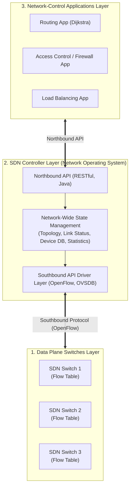

---

## 7.3 องค์ประกอบภายในและบทบาทของ SDN Controller (Network Operating System)

SDN Controller ทำหน้าที่เสมือนระบบปฏิบัติการของเครือข่าย โดยแบ่งโมดูลภายในเป็น 3 ชั้น:
1. **Interface Layer to Network-Control Applications (Northbound API):** เปิด Interface เช่น REST APIs เพื่อให้แอปพลิเคชันภายนอกสามารถอ่านสถานะเครือข่ายและส่งคำสั่งลงมาควบคุม
2. **Network-Wide State Management Layer:** เก็บฐานข้อมูลสถานะทั่วทั้งระบบ (Distributed State Database) เช่น โทโปโลยีปัจจุบัน สถานะของลิงก์ สถิติการใช้งาน และตาราง Flow Rules
3. **Communication Layer (Southbound API):** จัดการโปรโตคอลการสื่อสารสองทางไปยังอุปกรณ์สวิตช์กายภาพ เช่น โปรโตคอล OpenFlow

---

## 7.4 Southbound API และโปรโตคอล OpenFlow

**OpenFlow** เป็นโปรโตคอล Southbound API มาตรฐานแรกที่ได้รับความนิยมสูงสุด:
- ทำงานบนการเชื่อมต่อ **TCP หรือ TLS แบบเข้ารหัส**
- ใช้โมเดลการทำงานแบบ **Match-plus-Action**:
  - **Match:** ตรวจสอบ Header ข้ามเลเยอร์ (Switch Port, MAC src/dst, IP src/dst, Protocol, TCP/UDP port)
  - **Counters:** นับจำนวนแพ็กเก็ตและไบต์ที่ตรงกับเงื่อนไข
  - **Actions:** คำสั่งจัดการ (Forward ออกพอร์ต, Drop ทิ้ง, Modify Header, ส่งขึ้น Controller)

---

## 7.5 ข้อความสื่อสารหลักในโปรโตคอล OpenFlow (Controller-to-Switch vs. Switch-to-Controller)

### 1. ข้อความจาก Controller ส่งไปยัง Switch (Controller-to-Switch):
- **`Features`:** Controller สอบถามขีดความสามารถและคุณสมบัติของสวิตช์
- **`Configure`:** สอบถามหรือกำหนดค่าพารามิเตอร์การทำงานของสวิตช์
- **`Modify-State`:** คำสั่งเพิ่ม, ลบ, หรือแก้ไข Flow Entry ใน Flow Table ของสวิตช์
- **`Packet-Out`:** Controller นำแพ็กเก็ตที่ตนเองสร้างขึ้นหรือดักจับไว้ ส่งออกไปยังพอร์ตที่กำหนดของสวิตช์

### 2. ข้อความจาก Switch ส่งไปยัง Controller (Switch-to-Controller):
- **`Packet-In`:** สวิตช์ได้รับแพ็กเก็ตที่ไม่ตรงกับ Flow Entry ใด ๆ ในตาราง (Table-miss) จึงส่งแพ็กเก็ตนั้นขึ้นไปให้ Controller พิจารณา
- **`Flow-Removed`:** แจ้ง Controller ว่า Flow Entry นั้นหมดอายุเวลา (Timeout) หรือถูกลบออกแล้ว
- **`Port-Status`:** แจ้งเตือนเมื่อสถานะพอร์ตทางกายภาพเปลี่ยนไป (เช่น ลิงก์ Down หรือสายหลุด)

---

## 7.6 ตัวอย่างการทำงานจริงของ SDN Control Plane ในการจัดการเส้นทางและรับมือกับ Link Failure

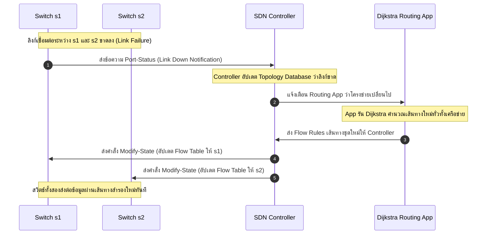

---

## 7.7 ระบบ SDN Controller ในโลกจริง: การเปรียบเทียบ OpenDaylight (ODL) vs. ONOS

| คุณลักษณะ | OpenDaylight (ODL) | Open Network Operating System (ONOS) |
| :--- | :--- | :--- |
| **กลุ่มเป้าหมายหลัก** | Enterprise Networks และ Data Center ขนาดใหญ่ | ผู้ให้บริการเครือข่ายโทรคมนาคม (Service Providers / Telcos) |
| **สถาปัตยกรรมแกนกลาง** | ขับเคลื่อนด้วย Model-Driven Service Abstraction Layer (MD-SAL) | มุ่งเน้นประสิทธิภาพสูง ความพร้อมใช้งานสูง (HA) และ Scale-out Clustering |
| **ความหน่วงและการตอบสนอง** | ปานกลาง เหมาะกับฟีเจอร์ที่หลากหลาย | ต่ำมาก ออกแบบมาเพื่อรับมือกับทราฟฟิกระดับ Carrier-Grade |

---

# 8. โปรโตคอลรายงานข้อผิดพลาดและข้อมูลควบคุม: ICMP (Slides 101–103)

## 8.1 บทบาทและการวางตัวของ ICMP ใน Internet Protocol Stack

**Internet Control Message Protocol (ICMP - RFC 792):**
- ทำหน้าที่รายงานข้อผิดพลาดในการส่งข้อมูล (Error Reporting) และแลกเปลี่ยนข้อมูลวินิจฉัยการทำงานของเครือข่าย
- ในเชิงสถาปัตยกรรม ICMP จัดเป็นส่วนหนึ่งของ **Network Layer** แต่ข้อความ ICMP จะถูกนำไปห่อหุ้มอยู่ภายใน **IP Datagram โดยตรง (IP Protocol Number = 1)**

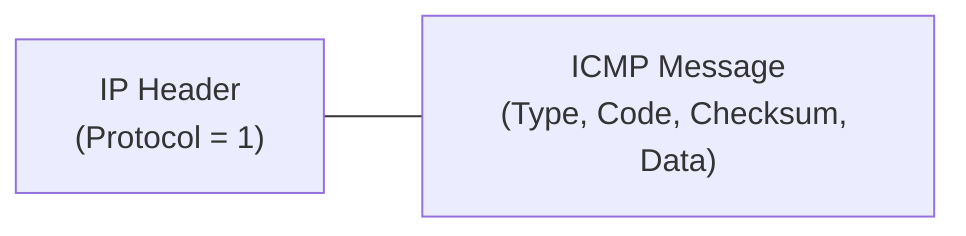

---

## 8.2 โครงสร้างของแพ็กเก็ตข้อความ ICMP (Header & Error Payload)

ข้อความ ICMP ประกอบด้วย:
- **Type (8 bits):** ประเภทของข้อความ
- **Code (8 bits):** รหัสระบุรายละเอียดเฉพาะของปัญหานั้น
- **Checksum (16 bits):** ค่าตรวจสอบความถูกต้องของข้อความ
- **Internet Header + 64 bits of Original Data Datagram:** เมื่อเกิดข้อผิดพลาด ICMP จะแนบ IP Header เดิมและข้อมูล 8 ไบต์แรกของดาตาแกรมที่มีปัญหา เพื่อให้โฮสต์ต้นทางทราบว่าโปรโตคอลใด (TCP/UDP) และพอร์ตใดเป็นผู้ก่อปัญหา

---

## 8.3 ตารางประเภทและรหัสข้อความสำคัญ (Standard ICMP Message Types & Codes)

| Type | Code | ความหมาย (Description) | การใช้งาน / เครื่องมือ |
| :---: | :---: | :--- | :--- |
| **0** | 0 | **Echo Reply** (การตอบกลับคำขอ Echo) | คำสั่ง `ping` |
| **3** | 0 | **Destination Network Unreachable** (ไม่พบเครือข่ายปลายทาง) | Error Reporting |
| **3** | 1 | **Destination Host Unreachable** (ไม่พบโฮสต์ปลายทาง) | Error Reporting |
| **3** | 2 | **Destination Protocol Unreachable** (โฮสต์ปลายทางไม่รองรับโปรโตคอลนี้) | Error Reporting |
| **3** | 3 | **Destination Port Unreachable** (ไม่มีแอปพลิเคชันรอฟังที่พอร์ตปลายทาง) | สิ้นสุดกระบวนการ `traceroute` |
| **3** | 6 | **Destination Network Unknown** (เครือข่ายปลายทางไม่เป็นที่รู้จัก) | Error Reporting |
| **3** | 7 | **Destination Host Unknown** (โฮสต์ปลายทางไม่เป็นที่รู้จัก) | Error Reporting |
| **8** | 0 | **Echo Request** (การส่งคำขอทดสอบ Echo) | คำสั่ง `ping` |
| **11** | 0 | **TTL Expired in Transit** (แพ็กเก็ตหมดอายุระหว่างทางเนื่องจาก TTL = 0) | กลไกหลักของ `traceroute` |
| **12** | 0 | **Bad IP Header** (ส่วนหัว IP มีพารามิเตอร์ผิดพลาด) | Error Reporting |

---

## 8.4 กลไกการทำงานของเครื่องมือ Traceroute เชิงลึก (TTL Exceeded & Port Unreachable)

คำสั่ง `traceroute` (หรือ `tracert` ใน Windows) ใช้ประโยชน์จากกลไกของ ICMP และฟิลด์ TTL ใน IP Header ในการทำแผนที่ระบุเราเตอร์ตลอดเส้นทาง:

```mermaid
sequenceDiagram
    autonumber
    participant Source as โฮสต์ต้นทาง
    participant R1 as Router 1
    participant R2 as Router 2
    participant Dest as โฮสต์ปลายทาง

    Source->>R1: ส่ง UDP Packet (TTL = 1, Port ที่ไม่มีใครใช้)
    Note over R1: R1 ลดค่า TTL เหลือ 0!<br/>ทิ้งแพ็กเก็ตและแจ้งเตือน
    R1-->>Source: ส่งกลับ ICMP Type 11 Code 0 (TTL Expired)
    Note over Source: คำนวณ RTT1 และบันทึก IP ของ Router 1

    Source->>R2: ส่ง UDP Packet (TTL = 2, Port ที่ไม่มีใครใช้)
    Note over R1: R1 ลด TTL เหลือ 1 แล้วส่งต่อ
    Note over R2: R2 ลดค่า TTL เหลือ 0!<br/>ทิ้งแพ็กเก็ตและแจ้งเตือน
    R2-->>Source: ส่งกลับ ICMP Type 11 Code 0 (TTL Expired)
    Note over Source: คำนวณ RTT2 และบันทึก IP ของ Router 2

    Source->>Dest: ส่ง UDP Packet (TTL = 3, Port ที่ไม่มีใครใช้)
    Note over Dest: แพ็กเก็ตถึงปลายทาง แต่ไม่มีแอปเปิดฟังพอร์ตนี้!
    Dest-->>Source: ส่งกลับ ICMP Type 3 Code 3 (Port Unreachable)
    Note over Source: ต้นทางได้รับ Type 3 Code 3 จึงทราบว่าถึงปลายทางแล้วและหยุดทำงาน!
```

---

# 9. การบริหารจัดการและตั้งค่าระบบเครือข่าย (Network Management & Configuration) (Slides 104–116)

## 9.1 กรอบโครงสร้างการบริหารจัดการเครือข่ายและสถาปัตยกรรม FCAPS

นิยามของ ISO ได้กำหนดพื้นที่ความรับผิดชอบในการบริหารจัดการเครือข่ายไว้ 5 ด้าน เรียกว่า **FCAPS Framework**:
- **F - Fault Management:** การตรวจจับ, บันทึก, แยกแยะ, และแก้ไขข้อผิดพลาดในเครือข่าย
- **C - Configuration Management:** การบันทึกและตั้งค่าการทำงานของอุปกรณ์ในเครือข่าย
- **A - Accounting Management:** การติดตามและคิดค่าใช้จ่ายตามปริมาณการใช้งานทรัพยากร
- **P - Performance Management:** การตรวจวัดและประเมินประสิทธิภาพ เช่น Throughput, Latency, และ Packet Loss
- **S - Security Management:** การควบคุมการเข้าถึงและปกป้องข้อมูลเครือข่ายจากการโจมตี

---

## 9.2 สถาปัตยกรรมโปรโตคอล SNMP แบบดั้งเดิม (Managing Server, Managed Device, Agent, MIB, SMI)

**Simple Network Management Protocol (SNMP)** ประกอบด้วยองค์ประกอบหลัก:
1. **Managing Entity (Managing Server):** เครื่องเซิร์ฟเวอร์ส่วนกลางของผู้ดูแลระบบเครือข่าย รันซอฟต์แวร์ Network Management System (NMS)
2. **Managed Device:** อุปกรณ์ในเครือข่ายที่ถูกดูแล เช่น เราเตอร์, สวิตช์, เซิร์ฟเวอร์
3. **SNMP Agent:** ซอฟต์แวร์ตัวแทนที่ฝังตัวทำงานอยู่ภายใน Managed Device เพื่อคอยสื่อสารกับ Managing Entity
4. **Management Information Base (MIB):** ฐานข้อมูลข้อมูลสถานะและพารามิเตอร์ภายในอุปกรณ์ จัดเก็บเป็นโครงสร้างต้นไม้ (Hierarchical Tree)
5. **Structure of Management Information (SMI):** ภาษาที่ใช้กำหนดไวยากรณ์และประเภทของข้อมูลที่จัดเก็บใน MIB

```mermaid
flowchart LR
    subgraph Manager ["Managing Server (NMS)"]
        App["Management Application"]
    end

    subgraph Device ["Managed Device (Router / Switch)"]
        Agent["SNMP Agent"]
        MIB[("MIB Database")]
        Agent <---> MIB
    end

    App ===>|"Request / Poll (UDP 161)"| Agent
    Agent ===>|"Response (UDP 161)"| App
    Agent -.->|"Unsolicited Trap (UDP 162)"| App
```

---

## 9.3 ประเภทของ SNMP PDU และความแตกต่างระหว่าง SNMPv1/v2 กับ SNMPv3

### ประเภทของ Protocol Data Unit (PDU) ใน SNMP:
- **`GetRequest` / `GetNextRequest` / `GetBulkRequest`:** ผู้จัดการส่งคำขออ่านค่าตัวแปรใน MIB
- **`SetRequest`:** ผู้จัดการส่งคำสั่งเขียนค่าลงในตัวแปร MIB ของอุปกรณ์
- **`Response`:** Agent ส่งข้อมูลค่าตัวแปรตอบกลับมาให้ผู้จัดการ
- **`Trap`:** Agent ส่งข้อความแจ้งเตือนเหตุการณ์ผิดปกติไปยังผู้จัดการ **โดยไม่ต้องรอให้ถาม (Unsolicited Alert)** ส่งผ่าน **UDP Port 162**
- **`InformRequest`:** คล้าย Trap แต่ผู้จัดการต้องส่งข้อความตอบรับกลับมาเพื่อยืนยันว่าได้รับแล้ว

### วิวัฒนาการด้านความปลอดภัย:
- **SNMPv1 & SNMPv2c:** ใช้รหัสผ่านข้อความธรรมดาที่เรียกว่า **Community String** (เช่น `public`, `private`) ไม่มีการเข้ารหัสข้อมูล ดักจับและปลอมแปลงได้ง่ายมาก
- **SNMPv3:** ปรับปรุงความปลอดภัยอย่างสมบูรณ์แบบ โดยเพิ่มการเข้ารหัสข้อมูล (Encryption), การยืนยันตัวตนผู้ใช้ (Authentication), และการตรวจสอบความถูกต้องของข้อความ (Message Integrity)

---

## 9.4 ข้อจำกัดของ SNMP สำหรับการตั้งค่าเครือข่ายในยุคใหม่

แม้ SNMP จะได้รับความนิยมสูง แต่ในทางปฏิบัติมักถูกใช้เพื่อ **การตรวจวัด (Monitoring / Read-only)** เท่านั้น และไม่เหมาะกับการตั้งค่าเครือข่ายขนาดใหญ่ (Configuration) เนื่องจาก:
1. การตั้งค่าผ่าน `SetRequest` เป็นแบบตัวแปรเดี่ยว ขาดการรองรับกระบวนการแบบ **Transaction (Commit / Rollback)** หากตั้งค่าล้มเหลวระหว่างทาง อุปกรณ์จะตกอยู่ในสถานะครึ่ง ๆ กลาง ๆ
2. MIB ไม่มีโครงสร้างที่สอดคล้องกับลักษณะการทำงานจริงของเครือข่ายแบบองค์รวม (Device-centric ไม่ใช่ Network-centric)

---

## 9.5 สถาปัตยกรรมการตั้งค่าเครือข่ายสมัยใหม่: ภาษาโมเดล YANG

เพื่อแก้ปัญหาของ SNMP วงการเครือข่ายจึงพัฒนา **YANG (RFC 6020)**:
- **YANG (Yet Another Next Generation):** เป็นภาษาสำหรับสร้างแบบจำลองข้อมูล (Data Modeling Language)
- กำหนดโครงสร้างข้อมูลแบบลำดับชั้น (Hierarchical Data Model) ทั้ง State Data และ Configuration Data
- สามารถแปลงข้อมูลไปมาระหว่างรูปแบบ **XML** และ **JSON** ได้อย่างง่ายดาย

```text
module simple-interface {
  prefix "if";
  container interface {
    leaf name { type string; }
    leaf speed { type uint32; }
    leaf status { type enumeration { enum up; enum down; } }
  }
}
```

---

## 9.6 โปรโตคอลส่งคำสั่งตั้งค่าเครือข่าย: NETCONF

**NETCONF (Network Configuration Protocol - RFC 6241):**
- ทำงานบนพื้นฐานของ **Remote Procedure Call (RPC)** โดยส่งข้อความที่เข้ารหัสในรูปแบบ XML
- สื่อสารผ่านโปรโตคอลที่มีความปลอดภัยสูง เช่น **SSH (Secure Shell)**
- มีคุณสมบัติระดับ Enterprise ที่ SNMP ทำไม่ได้:
  - **Transaction Support:** รองรับการ Commit การตั้งค่าพร้อมกัน หรือ Rollback กลับสู่สถานะเดิมทันทีหากพบข้อผิดพลาด
  - **Multiple Configuration Datastores:** รองรับการแยก Datastore ชัดเจน เช่น `running-config` (ค่าที่ใช้งานอยู่จริง), `startup-config` (ค่าที่บูตขึ้นมา), และ `candidate-config` (ค่าที่กำลังแก้ไขแต่ยังไม่เริ่มใช้งาน)

```mermaid
sequenceDiagram
    autonumber
    participant Client as Managing Controller / Admin
    participant Device as Network Device (Switch / Router)

    Note over Client,Device: เชื่อมต่อผ่าน SSH Session ปลอดภัย (Port 830)
    Client->>Device: <rpc message-id="101"><edit-config> (แก้ไข candidate-config)
    Device-->>Client: <rpc-reply message-id="101"><ok/>
    Client->>Device: <rpc message-id="102"><commit/> (ยืนยันการใช้งานจริง)
    Device-->>Client: <rpc-reply message-id="102"><ok/>
    Note over Device: อุปกรณ์เริ่มใช้งานการตั้งค่าใหม่โดยสมบูรณ์
```

---

# 10. บทสรุป Network Layer: Data Plane vs. Control Plane (Slides 117–118)

| มิติการทำงาน | Data Plane (Chapter 4) | Control Plane (Chapter 5) |
| :--- | :--- | :--- |
| **ฟังก์ชันหลัก** | **Forwarding:** ส่งแพ็กเก็ตข้ามสวิตช์แฟบริกจากพอร์ตขาเข้าไปยังพอร์ตขาออก | **Routing:** กำหนดเส้นทางแบบหัวจรดท้าย (End-to-End Path) ของการเดินทาง |
| **ขอบเขตการทำงาน** | แต่ละเราเตอร์แบบแยกส่วน (Local per-router function) | ทั่วทั้งเครือข่าย (Network-wide coordination) |
| **ระดับฮาร์ดแวร์ / ซอฟต์แวร์** | ทำงานบนฮาร์ดแวร์เฉพาะทางความเร็วสูง (ASIC, TCAM, Nanoseconds) | ทำงานบนซอฟต์แวร์ประมวลผล (Routing Processors / SDN Controller, Milliseconds) |
| **โปรโตคอลและกลไก** | IPv4/IPv6 Datagram, Header Inspection, Longest Prefix Matching, NAT, Buffer Management (Tail Drop, RED, WFQ) | Dijkstra (OSPF), Bellman-Ford (RIP), BGP, OpenFlow (SDN), ICMP, SNMP, NETCONF/YANG |

---

# 11. ภาคผนวก: ตัวอย่างการคำนวณ Distance-Vector แบบละเอียด 3 โหนด (Slides 119–121)

พิจารณาเครือข่าย 3 โหนด $u, v, x$ ที่มีลิงก์เชื่อมโยง:
- $c(u, v) = 1$
- $c(u, x) = 2$
- $c(v, x) = 3$

```mermaid
graph LR
    u((u)) ---|1| v((v))
    u ---|2| x((x))
    v ---|3| x((x))
```

### การคำนวณแบบจำลอง Iteration:
1. **รอบที่ 0:**
   - $D_u = [u:0, v:1, x:2]$
   - $D_v = [u:1, v:0, x:3]$
   - $D_x = [u:2, v:3, x:0]$
2. **การอัปเดตของ $v$ เมื่อได้รับเวกเตอร์จาก $u$:**
   $$D_v(x) = \min \{ c(v, u) + D_u(x), c(v, x) + D_x(x) \} = \min \{ 1 + 2, 3 + 0 \} = \min \{ 3, 3 \} = 3$$
   (ค่าเท่าเดิม เส้นทางตรงหรือผ่าน $u$ มีต้นทุน 3 เท่ากัน)
3. ระบบเข้าสู่จุดสมดุลทันทีเนื่องจากไม่มีโหนดใดค้นพบเส้นทางที่สั้นกว่าเดิม

---

# 12. เชื่อมโยงโจทย์การคำนวณและการบ้าน (Homework 4 Connection & Exam Review)

> [!TIP]
> **การฝึกทำโจทย์คำนวณเพิ่มเติม:**
> สำหรับโจทย์การคำนวณตาราง Dijkstra Step-by-Step แบบเต็มรูปแบบที่ใช้ในการบ้าน **Homework 4** สามารถดูวิธีทำและขั้นตอนการเติมตารางอย่างละเอียดได้ใน:
> 👉 [[Calculations and Trace Workbook#5. การคำนวณ Dijkstra's Algorithm Step-by-Step Trace]]
> 
> **หัวข้อที่มักออกข้อสอบบ่อยใน Chapter 5:**
> 1. **Dijkstra Trace Table:** เติมตาราง $N', D(v), p(v)$ ในแต่ละขั้นตอนให้ถูกต้องแม่นยำ
> 2. **Count-to-Infinity & Poisoned Reverse:** อธิบายเหตุผลที่เกิดปัญหานับวนไม่รู้จบ และกลไกที่ Poisoned Reverse ใช้แก้ปัญหา (พร้อมบอกข้อจำกัดเมื่อ Loop มี $\ge 3$ โหนด)
> 3. **eBGP vs. iBGP:** ความแตกต่างและหน้าที่ของการนำเข้าและส่งต่อเส้นทางภายนอก
> 4. **Traceroute Mechanics:** อธิบายทีละขั้นตอนว่าทำไม Traceroute จึงสามารถระบุ IP ของเราเตอร์ทุกตัวได้ (การใช้ TTL หมดอายุเพื่อกระตุ้น ICMP Type 11 Code 0 และการใช้ Port ปลายทางที่ไม่มีเพื่อกระตุ้น ICMP Type 3 Code 3)
> 5. **SNMP vs. NETCONF/YANG:** เปรียบเทียบข้อจำกัดของ SNMP ด้าน Configuration และข้อดีของ NETCONF ในการทำ Transaction Commit/Rollback
