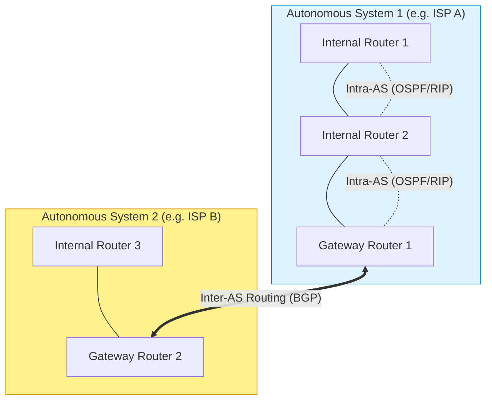

# Lecture Notes: Distance Vector Routing & Hierarchical BGP Architecture

- **วันที่บรรยาย:** วันจันทร์ที่ 14 กันยายน 2569
- **ผู้สอน:** ดร.วรลักษณ์ (Dr. Woralak)
- **ไฟล์เสียงอ้างอิง:** [Transcripts/20260914_132959.txt](file:///C:/Project/computer-network-&-Internet/Transcripts/20260914_132959.txt)
- **หมวดหมู่วิชา:** บทที่ 5: Network Control Plane (Kurose & Ross 8th Ed.)

---

## 1. ทฤษฎี Distance Vector (DV) Routing Algorithm

Distance Vector เป็นอัลกอริทึมการหาเส้นทางแบบกระจายศูนย์ (Distributed Algorithm) ที่แต่ละเราเตอร์จะรับส่งข้อมูลเวกเตอร์ระยะทางเฉพาะกับโหนดที่เป็นเพื่อนบ้านโดยตรง (Direct Neighbors) เท่านั้น

### 1.1 สมการ Bellman-Ford
$$d_x(y) = \min_v \{ c(x, v) + d_v(y) \}$$
- $d_x(y)$: ค่าใช้จ่ายต่ำสุด (Least Cost) จากโหนด $x$ ไปยังปลายทาง $y$
- $c(x, v)$: ค่าใช้จ่ายบนลิงก์ตรงจาก $x$ ไปยังเพื่อนบ้าน $v$
- $d_v(y)$: ค่าประมาณระยะทางจากเพื่อนบ้าน $v$ ไปยังปลายทาง $y$
- $\min_v$: การเลือกเส้นทางผ่านเพื่อนบ้าน $v$ ที่ให้ผลรวมค่าใช้จ่ายต่ำที่สุด

---

### 1.2 ตัวอย่างการคำนวณจริงจากห้องเรียน
กำหนดโหนด $u$ ต้องการส่งข้อมูลไปยังปลายทาง $z$ โดยมีเพื่อนบ้าน 3 โหนด ได้แก่ $v, x, w$:
- ค่าลิงก์ตรง: $c(u, v) = 2,\quad c(u, x) = 1,\quad c(u, w) = 5$
- เวกเตอร์จากเพื่อนบ้าน: $d_v(z) = 5,\quad d_x(z) = 3,\quad d_w(z) = 3$

#### การคำนวณเปรียบเทียบ:
$$\text{ผ่าน } v: c(u, v) + d_v(z) = 2 + 5 = 7$$
$$\text{ผ่าน } x: c(u, x) + d_x(z) = 1 + 3 = \mathbf{4}$$
$$\text{ผ่าน } w: c(u, w) + d_w(z) = 5 + 3 = 8$$

$$\min \{7, 4, 8\} = \mathbf{4} \implies \text{Next Hop} = x$$
**ผลลัพธ์ใน Forwarding Table:** ปลายทาง $z$ ให้ส่งออกทางอินเทอร์เฟซที่เชื่อมต่อกับโหนด $x$ ด้วย Cost = 4

---

### 1.3 ปัญหา Count-to-Infinity Problem
- **จุดแข็ง:** "Good news travels fast" เมื่อมีลิงก์ใหม่หรือค่า Cost ลดลง เครือข่ายจะปรับปรุงข้อมูลได้อย่างรวดเร็ว
- **จุดอ่อน:** "Bad news travels slow" เมื่อลิงก์ขาดหรือมีค่า Cost สูงขึ้น จะเกิด Routing Loop ระหว่างโหนดข้างเคียงที่ยังใช้ข้อมูลเก่า ทำให้ค่านับวนเพิ่มขึ้นทีละ 1 จนถึงค่าอนันต์ (Infinity = 16 ใน RIP)
- **แนวทางแก้ไข:** การใช้เทคนิค **Split Horizon** (ห้ามส่งข้อมูลเส้นทางกลับไปยังโหนดที่เป็นคนบอกเส้นทางนั้น) และ **Poisoned Reverse** (ส่งค่า Cost = $\infty$ กลับไป)

---

## 2. การจัดโครงสร้างเราติงแบบลำดับชั้น (Hierarchical Routing & Autonomous Systems)

เนื่องจากอินเทอร์เน็ตมีเราเตอร์จำนวนมหาศาล จึงไม่สามารถใช้ Flat Routing แบบระนาบเดียวได้ โครงสร้างเครือข่ายจึงถูกแบ่งออกเป็น **Autonomous Systems (AS)**:

### ตารางเปรียบเทียบ Intra-AS vs Inter-AS
| คุณสมบัติ | Intra-AS Routing (IGP) | Inter-AS Routing (EGP) |
| :--- | :--- | :--- |
| **ขอบเขต** | ทำงานภายใน AS เดียวกัน | ทำงานเชื่อมต่อระหว่าง AS ต่างกัน |
| **เป้าหมายหลัก** | ประสิทธิภาพและความเร็ว (Performance) | นโยบายทางธุรกิจและการเมือง (Policy-driven) |
| **โปรโตคอลหลัก** | **OSPF** (Link State), **RIP** (Distance Vector) | **BGP-4** (Border Gateway Protocol) |
| **ผู้ดูแล** | ผู้ดูแลระบบเครือข่ายองค์กรคนเดียว (Single Admin) | องค์กร/ISP อิสระหลายรายตกลงร่วมกัน |
