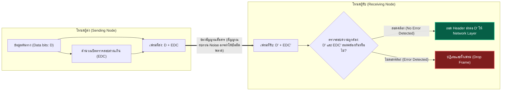
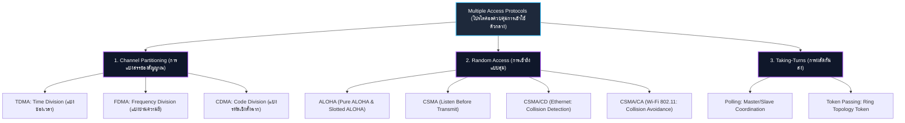
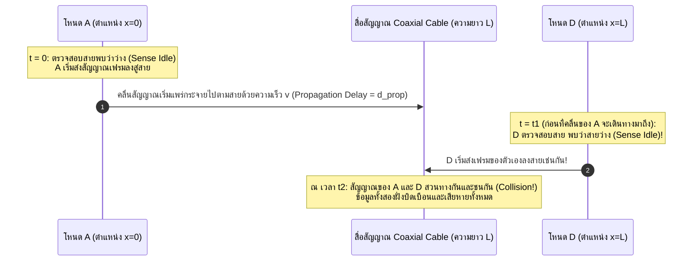
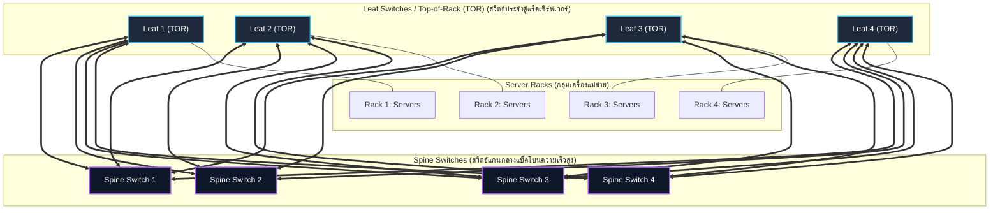

---
tags:
  - networking
  - lecture
  - link-layer
  - lan
  - ethernet
  - mac-address
  - arp
  - switch
  - vlan
  - vxlan
  - mpls
  - datacenter
  - crc
  - aloha
  - csma-cd
  - v9-current
created: 2026-09-21
updated: 2026-09-21
curriculum: Current v9.0 (Slides 1–111 Complete Slide-by-Slide Master Guide) & Kurose-Ross 8th Ed
type: lecture-note
---

# Lecture 6: Link Layer and Local Area Networks (Current v9.0 Complete Master Guide)

> [!SUMMARY]
> **เอกสารสรุปคลังความรู้วิชา Computer Networks: Chapter 6 Link Layer and LANs (ฉบับสมบูรณ์แบบเรียงลำดับครบ 111 สไลด์ 100%)**
> รวบรวม เรียบเรียง และวิเคราะห์เนื้อหาอย่างละเอียดลึกซึ้งจากสไลด์อาจารย์ผู้สอน สไลด์เจาะลึก CRC ของภาควิชา และหนังสือเรียน *Computer Networking: A Top-Down Approach (Kurose & Ross 8th Edition)* ครอบคลุมเนื้อหาทั้ง 111 สไลด์แบบเรียงหน้าอย่างเป็นระบบ พร้อมภาพและไดอะแกรมประกอบ ตัวอย่างการคำนวณ ตาราง Trace Table และข้อสังเกตความถูกต้องในทุกสไลด์

---

## 📑 สารบัญสไลด์ตามลำดับหน้า (Master Table of Contents: Slides 1–111)


### 01. Chapter Overview & Learning Roadmap (สไลด์ 1–3)
- [[#Slide 1: Chapter 6: The Link Layer and LANs|สไลด์ที่ 1: Chapter 6: The Link Layer and LANs]]
- [[#Slide 2: Link Layer and LANs: Our Goals|สไลด์ที่ 2: Link Layer and LANs: Our Goals]]
- [[#Slide 3: Link Layer, LANs: Roadmap|สไลด์ที่ 3: Link Layer, LANs: Roadmap]]

### 02. Link Layer Fundamentals, Services & Host Implementation (สไลด์ 4–10)
- [[#Slide 4: Link Layer: Introduction|สไลด์ที่ 4: Link Layer: Introduction]]
- [[#Slide 5: Link Layer: Context|สไลด์ที่ 5: Link Layer: Context]]
- [[#Slide 6: Transportation Analogy|สไลด์ที่ 6: Transportation Analogy]]
- [[#Slide 7: Link Layer: Services|สไลด์ที่ 7: Link Layer: Services]]
- [[#Slide 8: Link Layer: Services (More)|สไลด์ที่ 8: Link Layer: Services (More)]]
- [[#Slide 9: Host Link-Layer Implementation|สไลด์ที่ 9: Host Link-Layer Implementation]]
- [[#Slide 10: Interfaces Communicating|สไลด์ที่ 10: Interfaces Communicating]]

### 03. Error Detection and Correction (สไลด์ 11–16)
- [[#Slide 11: Link Layer, LANs: Roadmap|สไลด์ที่ 11: Link Layer, LANs: Roadmap]]
- [[#Slide 12: Error Detection|สไลด์ที่ 12: Error Detection]]
- [[#Slide 13: Parity Checking|สไลด์ที่ 13: Parity Checking]]
- [[#Slide 14: Internet Checksum (Review)|สไลด์ที่ 14: Internet Checksum (Review)]]
- [[#Slide 15: Cyclic Redundancy Check (CRC)|สไลด์ที่ 15: Cyclic Redundancy Check (CRC)]]
- [[#Slide 16: Cyclic Redundancy Check (CRC): Example|สไลด์ที่ 16: Cyclic Redundancy Check (CRC): Example]]

### 04. Multiple Access Protocols (สไลด์ 17–39)
- [[#Slide 17: Link Layer, LANs: Roadmap|สไลด์ที่ 17: Link Layer, LANs: Roadmap]]
- [[#Slide 18: Multiple Access Links, Protocols|สไลด์ที่ 18: Multiple Access Links, Protocols]]
- [[#Slide 19: Multiple Access Protocols|สไลด์ที่ 19: Multiple Access Protocols]]
- [[#Slide 20: An Ideal Multiple Access Protocol|สไลด์ที่ 20: An Ideal Multiple Access Protocol]]
- [[#Slide 21: MAC Protocols: Taxonomy|สไลด์ที่ 21: MAC Protocols: Taxonomy]]
- [[#Slide 22: Channel Partitioning MAC Protocols: TDMA|สไลด์ที่ 22: Channel Partitioning MAC Protocols: TDMA]]
- [[#Slide 23: Channel Partitioning MAC Protocols: FDMA|สไลด์ที่ 23: Channel Partitioning MAC Protocols: FDMA]]
- [[#Slide 24: Random Access Protocols|สไลด์ที่ 24: Random Access Protocols]]
- [[#Slide 25: Slotted ALOHA|สไลด์ที่ 25: Slotted ALOHA]]
- [[#Slide 26: Slotted ALOHA: Pros and Cons|สไลด์ที่ 26: Slotted ALOHA: Pros and Cons]]
- [[#Slide 27: Slotted ALOHA: Efficiency|สไลด์ที่ 27: Slotted ALOHA: Efficiency]]
- [[#Slide 28: Pure ALOHA|สไลด์ที่ 28: Pure ALOHA]]
- [[#Slide 29: CSMA (Carrier Sense Multiple Access)|สไลด์ที่ 29: CSMA (Carrier Sense Multiple Access)]]
- [[#Slide 30: CSMA: Collisions|สไลด์ที่ 30: CSMA: Collisions]]
- [[#Slide 31: CSMA/CD|สไลด์ที่ 31: CSMA/CD]]
- [[#Slide 32: Ethernet CSMA/CD Algorithm|สไลด์ที่ 32: Ethernet CSMA/CD Algorithm]]
- [[#Slide 33: CSMA/CD Efficiency|สไลด์ที่ 33: CSMA/CD Efficiency]]
- [[#Slide 34: “Taking Turns” MAC Protocols|สไลด์ที่ 34: “Taking Turns” MAC Protocols]]
- [[#Slide 35: “Taking Turns” MAC Protocols: Polling|สไลด์ที่ 35: “Taking Turns” MAC Protocols: Polling]]
- [[#Slide 36: “Taking Turns” MAC Protocols: Token Passing|สไลด์ที่ 36: “Taking Turns” MAC Protocols: Token Passing]]
- [[#Slide 37: Cable Access Network: FDM, TDM and Random Access|สไลด์ที่ 37: Cable Access Network: FDM, TDM and Random Access]]
- [[#Slide 38: Cable Access Network: DOCSIS|สไลด์ที่ 38: Cable Access Network: DOCSIS]]
- [[#Slide 39: Summary of MAC Protocols|สไลด์ที่ 39: Summary of MAC Protocols]]

### 05. LANs: MAC Addressing & ARP (สไลด์ 40–53)
- [[#Slide 40: Link Layer, LANs: Roadmap — Entering LANs|สไลด์ที่ 40: Link Layer, LANs: Roadmap — Entering LANs]]
- [[#Slide 41: MAC Addresses|สไลด์ที่ 41: MAC Addresses]]
- [[#Slide 42: MAC Addresses on a LAN|สไลด์ที่ 42: MAC Addresses on a LAN]]
- [[#Slide 43: MAC Address Allocation and Portability|สไลด์ที่ 43: MAC Address Allocation and Portability]]
- [[#Slide 44: ARP: Address Resolution Protocol|สไลด์ที่ 44: ARP: Address Resolution Protocol]]
- [[#Slide 45: ARP Protocol in Action — Step 1: Broadcast Query|สไลด์ที่ 45: ARP Protocol in Action — Step 1: Broadcast Query]]
- [[#Slide 46: ARP Protocol in Action — Step 2: ARP Reply|สไลด์ที่ 46: ARP Protocol in Action — Step 2: ARP Reply]]
- [[#Slide 47: ARP Protocol in Action — Step 3: Update ARP Table|สไลด์ที่ 47: ARP Protocol in Action — Step 3: Update ARP Table]]
- [[#Slide 48: Routing to Another Subnet: Addressing|สไลด์ที่ 48: Routing to Another Subnet: Addressing]]
- [[#Slide 49: Routing to Another Subnet — A Creates the Datagram and Frame|สไลด์ที่ 49: Routing to Another Subnet — A Creates the Datagram and Frame]]
- [[#Slide 50: Routing to Another Subnet — Frame Arrives at Router R|สไลด์ที่ 50: Routing to Another Subnet — Frame Arrives at Router R]]
- [[#Slide 51: Routing to Another Subnet — Router Creates the Next-Hop Frame|สไลด์ที่ 51: Routing to Another Subnet — Router Creates the Next-Hop Frame]]
- [[#Slide 52: Routing to Another Subnet — Router Transmits the Frame|สไลด์ที่ 52: Routing to Another Subnet — Router Transmits the Frame]]
- [[#Slide 53: Routing to Another Subnet — B Receives the Datagram|สไลด์ที่ 53: Routing to Another Subnet — B Receives the Datagram]]

### 06. Ethernet (สไลด์ 54–60)
- [[#Slide 54: Link Layer, LANs: Roadmap — Ethernet|สไลด์ที่ 54: Link Layer, LANs: Roadmap — Ethernet]]
- [[#Slide 55: Ethernet|สไลด์ที่ 55: Ethernet]]
- [[#Slide 56: Ethernet: Physical Topology|สไลด์ที่ 56: Ethernet: Physical Topology]]
- [[#Slide 57: Ethernet Frame Structure|สไลด์ที่ 57: Ethernet Frame Structure]]
- [[#Slide 58: Ethernet Frame Structure — Addresses, Type and CRC|สไลด์ที่ 58: Ethernet Frame Structure — Addresses, Type and CRC]]
- [[#Slide 59: Ethernet: Unreliable, Connectionless|สไลด์ที่ 59: Ethernet: Unreliable, Connectionless]]
- [[#Slide 60: 802.3 Ethernet Standards: Link & Physical Layers|สไลด์ที่ 60: 802.3 Ethernet Standards: Link & Physical Layers]]

### 07. Ethernet Switches & Self-Learning (สไลด์ 61–73)
- [[#Slide 61: Link Layer, LANs: Roadmap — Switches|สไลด์ที่ 61: Link Layer, LANs: Roadmap — Switches]]
- [[#Slide 62: Ethernet Switch|สไลด์ที่ 62: Ethernet Switch]]
- [[#Slide 63: Switch: Multiple Simultaneous Transmissions|สไลด์ที่ 63: Switch: Multiple Simultaneous Transmissions]]
- [[#Slide 64: Switch: When Simultaneous Transmission Is Not Possible|สไลด์ที่ 64: Switch: When Simultaneous Transmission Is Not Possible]]
- [[#Slide 65: Switch Forwarding Table|สไลด์ที่ 65: Switch Forwarding Table]]
- [[#Slide 66: Switch: Self-Learning|สไลด์ที่ 66: Switch: Self-Learning]]
- [[#Slide 67: Switch: Frame Filtering and Forwarding|สไลด์ที่ 67: Switch: Frame Filtering and Forwarding]]
- [[#Slide 68: Self-Learning and Forwarding: Example|สไลด์ที่ 68: Self-Learning and Forwarding: Example]]
- [[#Slide 69: Interconnecting Switches|สไลด์ที่ 69: Interconnecting Switches]]
- [[#Slide 70: Self-Learning Multi-Switch Example|สไลด์ที่ 70: Self-Learning Multi-Switch Example]]
- [[#Slide 71: UMass Campus Network — Detail|สไลด์ที่ 71: UMass Campus Network — Detail]]
- [[#Slide 72: UMass Campus Network — Protocols and Link Speeds|สไลด์ที่ 72: UMass Campus Network — Protocols and Link Speeds]]
- [[#Slide 73: Switches vs. Routers|สไลด์ที่ 73: Switches vs. Routers]]

### 08. Virtual LANs (VLANs), VXLAN & EVPN Context (สไลด์ 74–82)
- [[#Slide 74: Link Layer, LANs: Roadmap — VLANs|สไลด์ที่ 74: Link Layer, LANs: Roadmap — VLANs]]
- [[#Slide 75: Virtual LANs (VLANs): Motivation — Scaling|สไลด์ที่ 75: Virtual LANs (VLANs): Motivation — Scaling]]
- [[#Slide 76: Virtual LANs (VLANs): Motivation — Administrative Issues|สไลด์ที่ 76: Virtual LANs (VLANs): Motivation — Administrative Issues]]
- [[#Slide 77: Port-Based VLANs|สไลด์ที่ 77: Port-Based VLANs]]
- [[#Slide 78: Port-Based VLANs — Isolation and Membership|สไลด์ที่ 78: Port-Based VLANs — Isolation and Membership]]
- [[#Slide 79: VLANs Spanning Multiple Switches|สไลด์ที่ 79: VLANs Spanning Multiple Switches]]
- [[#Slide 80: 802.1Q VLAN Frame Format|สไลด์ที่ 80: 802.1Q VLAN Frame Format]]
- [[#Slide 81: VXLAN Overlay and EVPN Context|สไลด์ที่ 81: VXLAN Overlay and EVPN Context]]
- [[#Slide 82: VXLAN Tunnel and VTEPs|สไลด์ที่ 82: VXLAN Tunnel and VTEPs]]

### 09. Link Virtualization: MPLS (สไลด์ 83–89)
- [[#Slide 83: Link Layer, LANs: Roadmap — Link Virtualization: MPLS|สไลด์ที่ 83: Link Layer, LANs: Roadmap — Link Virtualization: MPLS]]
- [[#Slide 84: Multiprotocol Label Switching (MPLS)|สไลด์ที่ 84: Multiprotocol Label Switching (MPLS)]]
- [[#Slide 85: MPLS-Capable Routers|สไลด์ที่ 85: MPLS-Capable Routers]]
- [[#Slide 86: MPLS versus IP Paths — IP Routing|สไลด์ที่ 86: MPLS versus IP Paths — IP Routing]]
- [[#Slide 87: MPLS versus IP Paths — Flexible MPLS Routing|สไลด์ที่ 87: MPLS versus IP Paths — Flexible MPLS Routing]]
- [[#Slide 88: MPLS Signaling|สไลด์ที่ 88: MPLS Signaling]]
- [[#Slide 89: MPLS Forwarding Tables|สไลด์ที่ 89: MPLS Forwarding Tables]]

### 10. Data Center Networking (สไลด์ 90–98)
- [[#Slide 90: Link Layer, LANs: Roadmap — Data Center Networking|สไลด์ที่ 90: Link Layer, LANs: Roadmap — Data Center Networking]]
- [[#Slide 91: Datacenter Networks|สไลด์ที่ 91: Datacenter Networks]]
- [[#Slide 92: Datacenter Networks: Network Elements|สไลด์ที่ 92: Datacenter Networks: Network Elements]]
- [[#Slide 93: Datacenter Networks: Two-Layer Leaf/Spine Structure|สไลด์ที่ 93: Datacenter Networks: Two-Layer Leaf/Spine Structure]]
- [[#Slide 94: Facebook F16 Data Center Network Topology|สไลด์ที่ 94: Facebook F16 Data Center Network Topology]]
- [[#Slide 95: Datacenter Networks: Multipath|สไลด์ที่ 95: Datacenter Networks: Multipath]]
- [[#Slide 96: Datacenter Networks: Application-Layer Routing|สไลด์ที่ 96: Datacenter Networks: Application-Layer Routing]]
- [[#Slide 97: Datacenter Networks: Protocol Innovations|สไลด์ที่ 97: Datacenter Networks: Protocol Innovations]]
- [[#Slide 98: ORION: Google’s SDN Control Plane|สไลด์ที่ 98: ORION: Google’s SDN Control Plane]]

### 11. Synthesis: A Day in the Life of a Web Request (สไลด์ 99–107)
- [[#Slide 99: Link Layer, LANs: Roadmap — A Day in the Life of a Web Request|สไลด์ที่ 99: Link Layer, LANs: Roadmap — A Day in the Life of a Web Request]]
- [[#Slide 100: Synthesis: A Day in the Life of a Web Request|สไลด์ที่ 100: Synthesis: A Day in the Life of a Web Request]]
- [[#Slide 101: A Day in the Life: Scenario|สไลด์ที่ 101: A Day in the Life: Scenario]]
- [[#Slide 102: A Day in the Life: Connecting to the Internet — DHCP Request|สไลด์ที่ 102: A Day in the Life: Connecting to the Internet — DHCP Request]]
- [[#Slide 103: A Day in the Life: Connecting to the Internet — DHCP ACK|สไลด์ที่ 103: A Day in the Life: Connecting to the Internet — DHCP ACK]]
- [[#Slide 104: A Day in the Life: ARP — Before DNS, Before HTTP|สไลด์ที่ 104: A Day in the Life: ARP — Before DNS, Before HTTP]]
- [[#Slide 105: A Day in the Life: Using DNS|สไลด์ที่ 105: A Day in the Life: Using DNS]]
- [[#Slide 106: A Day in the Life: TCP Connection Carrying HTTP|สไลด์ที่ 106: A Day in the Life: TCP Connection Carrying HTTP]]
- [[#Slide 107: A Day in the Life: HTTP Request/Reply|สไลด์ที่ 107: A Day in the Life: HTTP Request/Reply]]

### 12. Chapter 6 Summary & Additional Slides (สไลด์ 108–111)
- [[#Slide 108: Chapter 6: Summary|สไลด์ที่ 108: Chapter 6: Summary]]
- [[#Slide 109: Chapter 6: Looking Beyond the Protocol Stack|สไลด์ที่ 109: Chapter 6: Looking Beyond the Protocol Stack]]
- [[#Slide 110: Additional Chapter 6 Slides|สไลด์ที่ 110: Additional Chapter 6 Slides]]
- [[#Slide 111: Pure ALOHA Efficiency — Derivation|สไลด์ที่ 111: Pure ALOHA Efficiency — Derivation]]

---


# 01. Chapter Overview & Learning Roadmap (สไลด์ 1–3)

## Slide 1: Chapter 6: The Link Layer and LANs

> [!NOTE] **สไลด์ที่ 1 จาก 111 สไลด์ (Slide 1 of 111)**
>
> **ชื่อหัวข้อสไลด์:** Chapter 6: The Link Layer and LANs

บทที่ 6 ศึกษา **Link Layer** หรือชั้นเชื่อมโยงข้อมูล ซึ่งทำหน้าที่นำข้อมูลจาก Network Layer ไปส่งต่อระหว่าง **โหนดที่อยู่ติดกัน (adjacent nodes)** ผ่านลิงก์หนึ่งช่วง ในบทนี้หน่วยข้อมูลสำคัญของชั้นนี้คือ **frame** ซึ่งใช้ห่อหุ้ม network-layer datagram ก่อนส่งผ่านสื่อจริง

เนื้อหาจะเชื่อมจากหลักการพื้นฐาน เช่น framing, error detection/correction และ multiple access ไปสู่เทคโนโลยี LAN ที่ใช้จริง เช่น Ethernet, switches และ VLANs รวมถึงการมองภาพของ data center networking

> [!TIP] **การอ่านภาพและไดอะแกรมประจำสไลด์ (Visual Reading & Diagram Analysis)**
> สไลด์แรกเป็นหน้าชื่อบทจาก *Computer Networking: A Top-Down Approach, 9th edition* ของ Kurose และ Ross จุดสำคัญคือชื่อบท **The Link Layer and LANs** ซึ่งบอกว่าบทนี้จะลงมาศึกษาการสื่อสารในระดับลิงก์และเครือข่ายท้องถิ่น หลังจากที่บทก่อนหน้าเน้นการส่ง packet ในระดับ Network Layer


> [!SUMMARY] **ประเด็นสำคัญประจำสไลด์ที่ควรจำ (Key Takeaways)**
> - Link Layer ทำงานระหว่างโหนดที่อยู่ติดกัน
>
> - หน่วยข้อมูลของ Link Layer คือ frame
>
> - LAN technologies เป็นหัวใจสำคัญของบทนี้


---

## Slide 2: Link Layer and LANs: Our Goals

> [!NOTE] **สไลด์ที่ 2 จาก 111 สไลด์ (Slide 2 of 111)**
>
> **ชื่อหัวข้อสไลด์:** Link Layer and LANs: Our Goals

เป้าหมายของบทคือเข้าใจทั้ง **หลักการ** และ **การนำไปใช้จริง** ของ Link Layer โดยเริ่มจากบริการพื้นฐานที่ชั้นนี้ต้องจัดให้ เช่น การตรวจจับ/แก้ไขข้อผิดพลาด การแบ่งใช้ช่องสัญญาณร่วม และการระบุที่อยู่ของอุปกรณ์ในระดับลิงก์

จากนั้นจะนำแนวคิดเหล่านี้ไปเชื่อมกับเครือข่าย LAN จริง ได้แก่ **Ethernet** และ **VLANs** รวมถึงเครือข่ายศูนย์ข้อมูล (datacenter networks) และตัวอย่างการ implementation ของเทคโนโลยี Link Layer แบบต่าง ๆ

> [!TIP] **การอ่านภาพและไดอะแกรมประจำสไลด์ (Visual Reading & Diagram Analysis)**
> รายการทางซ้ายคือหลักการที่ต้องเข้าใจ ส่วนข้อความทางขวาเน้นว่าไม่ได้เรียนเพียงแนวคิดเชิงทฤษฎี แต่ต้องเห็นว่าแนวคิดเดียวกันถูกสร้างเป็นเทคโนโลยีจริงได้อย่างไร เช่น error detection ใน frame หรือการใช้ Ethernet ใน LAN


> [!SUMMARY] **ประเด็นสำคัญประจำสไลด์ที่ควรจำ (Key Takeaways)**
> - error detection/correction
>
> - multiple access
>
> - link-layer addressing
>
> - Ethernet และ VLANs
>
> - datacenter networks


---

## Slide 3: Link Layer, LANs: Roadmap

> [!NOTE] **สไลด์ที่ 3 จาก 111 สไลด์ (Slide 3 of 111)**
>
> **ชื่อหัวข้อสไลด์:** Link Layer, LANs: Roadmap

Roadmap แสดงลำดับหัวข้อของบท เริ่มจาก **introduction** แล้วเข้าสู่ error detection/correction และ multiple access protocols จากนั้นจึงศึกษากลุ่มหัวข้อ LAN ได้แก่ addressing และ ARP, Ethernet, switches และ VLANs

ช่วงท้ายของบทครอบคลุม **link virtualization: MPLS**, **data center networking** และกรณีศึกษา “a day in the life of a web request” ซึ่งใช้เชื่อมองค์ความรู้หลายชั้นเข้าด้วยกันเพื่อมองการทำงานของเครือข่ายแบบ end-to-end

> [!TIP] **การอ่านภาพและไดอะแกรมประจำสไลด์ (Visual Reading & Diagram Analysis)**
> คำว่า **introduction** ถูกเน้นเพื่อบอกตำแหน่งปัจจุบันของเนื้อหา ส่วนหัวข้ออื่นเป็นแผนที่ของทั้งบท นักศึกษาควรใช้ roadmap นี้เชื่อมว่าเรื่องใดเป็นหลักการทั่วไป และเรื่องใดเป็นเทคโนโลยีหรือ protocol ที่นำหลักการนั้นไปใช้


> [!SUMMARY] **ประเด็นสำคัญประจำสไลด์ที่ควรจำ (Key Takeaways)**
> - หลักการพื้นฐานมาก่อนเทคโนโลยี LAN
>
> - ARP, Ethernet, switches และ VLANs เชื่อมโยงกัน
>
> - บทจบด้วยการมองภาพการใช้งานจริงของการสื่อสาร


---


# 02. Link Layer Fundamentals, Services & Host Implementation (สไลด์ 4–10)

## Slide 4: Link Layer: Introduction

> [!NOTE] **สไลด์ที่ 4 จาก 111 สไลด์ (Slide 4 of 111)**
>
> **ชื่อหัวข้อสไลด์:** Link Layer: Introduction

ในบริบทของ Link Layer คำว่า **node** หมายถึงอุปกรณ์ที่มีส่วนร่วมในการส่งข้อมูล เช่น host หรือ router ส่วน **link** คือช่องทางสื่อสารที่เชื่อมโหนดสองฝั่งที่อยู่ติดกัน อาจเป็นลิงก์แบบมีสาย แบบไร้สาย หรือส่วนหนึ่งของ LAN

Network-layer datagram จะถูกนำมาห่อหุ้มเป็น **frame** ก่อนส่งบนลิงก์ ดังนั้นหน้าที่หลักของ Link Layer คือ **ส่ง datagram จากโหนดหนึ่งไปยังโหนดถัดไปที่อยู่ติดกันทางกายภาพผ่านลิงก์หนึ่งช่วง** ไม่ได้มีหน้าที่เลือกเส้นทางจากต้นทางไปยังปลายทางทั้งเส้นทาง

```mermaid
flowchart LR
    subgraph HostA ["โฮสต์ต้นทาง (Sending Host A)"]
        AppA["Application"] --> TransA["Transport"]
        TransA --> NetA["Network (IP Datagram)"]
        NetA --> LinkA["Data Link (Frame 1)"]
    end

    subgraph PhysicalHops ["การส่งต่อข้อมูลแบบ Hop-by-Hop ผ่านสื่อสัญญาณต่างๆ"]
        LinkA ==>|"Hop 1: Ethernet Cable"| R1["Router R1"]
        R1 ==>|"Hop 2: Optical Fiber / MPLS"| R2["Router R2"]
        R2 ==>|"Hop 3: Wi-Fi 802.11"| HostB["โฮสต์ปลายทาง (Host B)"]
    end

    classDef host fill:#1e293b,stroke:#38bdf8,stroke-width:2px,color:#fff;
    classDef router fill:#0f172a,stroke:#a855f7,stroke-width:2px,color:#fff;
    class HostA,HostB host;
    class R1,R2 router;
```



> [!TIP] **การอ่านภาพและไดอะแกรมประจำสไลด์ (Visual Reading & Diagram Analysis)**
> ภาพด้านขวาแสดงเครือข่ายหลายประเภท เช่น mobile network, enterprise network, ISP และ datacenter network ที่เชื่อมต่อกันเป็นเส้นทางยาว แต่ Link Layer มองทีละช่วง เช่น host → access point หรือ router → router การส่ง end-to-end จึงประกอบจากการส่งแบบ hop-by-hop หลายครั้ง


> [!SUMMARY] **ประเด็นสำคัญประจำสไลด์ที่ควรจำ (Key Takeaways)**
> - host และ router เป็น nodes
>
> - link เชื่อม adjacent nodes
>
> - datagram ถูก encapsulate เป็น frame
>
> - Link Layer ทำงานแบบ hop-by-hop


---

## Slide 5: Link Layer: Context

> [!NOTE] **สไลด์ที่ 5 จาก 111 สไลด์ (Slide 5 of 111)**
>
> **ชื่อหัวข้อสไลด์:** Link Layer: Context

datagram หนึ่งก้อนที่เดินทางจากต้นทางไปยังปลายทางอาจผ่านลิงก์หลายชนิด และแต่ละลิงก์สามารถใช้ **link-layer protocol คนละแบบ** ได้ ตัวอย่างเช่น ช่วงแรกจาก laptop ไปยัง wireless router อาจใช้ Wi‑Fi แต่ช่วงถัดไปอาจใช้ Ethernet

เพราะแต่ละ link protocol ถูกออกแบบมาให้เหมาะกับสื่อและสภาพแวดล้อมต่างกัน บริการที่ได้รับในแต่ละช่วงจึงไม่จำเป็นต้องเหมือนกัน เช่น บางลิงก์อาจมี reliable data transfer ในระดับลิงก์ ขณะที่บางลิงก์อาจไม่มี

> [!TIP] **การอ่านภาพและไดอะแกรมประจำสไลด์ (Visual Reading & Diagram Analysis)**
> ภาพแสดงเส้นทางจากอุปกรณ์ปลายทางผ่านหลาย router ไปยังปลายทางอีกฝั่ง ให้สังเกตว่า **datagram ระดับ Network Layer ยังคงเป็นข้อมูลที่ต้องส่งต่อ** แต่ frame ที่ใช้ห่อหุ้ม datagram สามารถเปลี่ยนรูปแบบใหม่ทุกครั้งเมื่อข้ามจากลิงก์หนึ่งไปยังอีกลิงก์หนึ่ง


> [!SUMMARY] **ประเด็นสำคัญประจำสไลด์ที่ควรจำ (Key Takeaways)**
> - หนึ่งเส้นทางอาจใช้หลาย link protocols
>
> - frame เป็นของแต่ละลิงก์ ไม่ได้คงเดิมตลอดเส้นทาง
>
> - บริการของแต่ละ link protocol อาจแตกต่างกัน


---

## Slide 6: Transportation Analogy

> [!NOTE] **สไลด์ที่ 6 จาก 111 สไลด์ (Slide 6 of 111)**
>
> **ชื่อหัวข้อสไลด์:** Transportation Analogy

สไลด์ใช้การเดินทางจาก **Princeton → JFK → Geneva → Lausanne** เพื่ออธิบายความสัมพันธ์ระหว่าง routing กับ Link Layer ผู้เดินทางหนึ่งคนต้องใช้พาหนะหลายชนิด ได้แก่ รถ เครื่องบิน และรถไฟ แม้จุดหมายปลายทางของผู้เดินทางจะเหมือนเดิมตลอดการเดินทาง

ในการเปรียบเทียบนี้ **tourist = datagram**, การเดินทางแต่ละช่วง = communication link, วิธีเดินทางในแต่ละช่วง = link-layer protocol และ **travel agent = routing algorithm** ซึ่งทำหน้าที่เลือกว่าจะเดินทางผ่านเส้นทางใด

> [!TIP] **การอ่านภาพและไดอะแกรมประจำสไลด์ (Visual Reading & Diagram Analysis)**
> ให้มองลูกศรเป็น “หนึ่งลิงก์ต่อหนึ่งช่วง” เช่น Princeton → JFK ใช้รถ, JFK → Geneva ใช้เครื่องบิน และ Geneva → Lausanne ใช้รถไฟ เปรียบเหมือน datagram เดียวกันถูกส่งผ่าน Wi‑Fi, Ethernet หรือเทคโนโลยีอื่นตามลิงก์ที่พบระหว่างทาง


> [!NOTE] **ข้อสังเกตเพิ่มเติม (Extra Note)**
> **ข้อสังเกต:** Routing algorithm สนใจการเลือกเส้นทางโดยรวม ส่วน Link Layer สนใจว่าข้อมูลจะข้าม *ลิงก์ปัจจุบัน* ไปยังโหนดถัดไปอย่างไร จึงเป็นคนละระดับของปัญหาแต่ทำงานต่อเนื่องกัน


> [!SUMMARY] **ประเด็นสำคัญประจำสไลด์ที่ควรจำ (Key Takeaways)**
> - datagram เหมือนผู้เดินทาง
>
> - link เหมือนช่วงการเดินทาง
>
> - link protocol เหมือนชนิดพาหนะ
>
> - routing algorithm เลือกเส้นทางโดยรวม


---

## Slide 7: Link Layer: Services

> [!NOTE] **สไลด์ที่ 7 จาก 111 สไลด์ (Slide 7 of 111)**
>
> **ชื่อหัวข้อสไลด์:** Link Layer: Services

บริการสำคัญของ Link Layer เริ่มจาก **framing** คือการนำ datagram มาห่อหุ้มเป็น frame โดยเพิ่ม header และ trailer ข้อมูลเหล่านี้ใช้สำหรับการทำงานของลิงก์ เช่น addressing และ error checking ส่วน **link access** ใช้กำหนดว่าอุปกรณ์ใดสามารถใช้ช่องสัญญาณได้เมื่อหลายโหนดแชร์ medium เดียวกัน

ใน frame header จะมี **MAC address** สำหรับระบุ source และ destination ในระดับลิงก์ ซึ่งเป็นคนละแนวคิดกับ IP address นอกจากนี้บาง link protocol อาจให้ **reliable delivery ระหว่าง adjacent nodes** โดยเฉพาะลิงก์ไร้สายที่มีโอกาสเกิด bit error สูง

| บริการของ Link Layer | รายละเอียดและกลไกการทำงาน | สภาพแวดล้อมที่ใช้งาน |
| :--- | :--- | :--- |
| **1. Framing** | ห่อหุ้ม Network-layer datagram ด้วย Header (Src/Dst MAC, Type) และ Trailer (CRC/FCS) | ทุกโปรโตคอลใน L2 |
| **2. Link Access (MAC)** | กำหนดกติกาการเข้าใช้ตัวกลางเพื่อป้องกันการชนกันของสัญญาณบนช่องสัญญาณแบบใช้ร่วมกัน | Shared broadcast links (Wi-Fi, Coaxial, Ethernet Hub) |
| **3. Reliable Delivery** | กลไก ACK และ Retransmission ในระดับฮาร์ดแวร์เพื่อกู้คืนเฟรมที่สูญหายหรือเสียหาย | ช่องสัญญาณที่มี Bit Error Rate สูง (เช่น Wi-Fi, ดาวเทียม) *ไม่ใช้บนสาย Fiber/Twisted-Pair* |
| **4. Flow Control** | ควบคุมจังหวะการส่งไม่ให้โหนดส่งส่งข้อมูลเร็วเกินกว่าที่โหนดรับข้างเคียงจะประมวลผลทัน | จุดต่อจุดระหว่างโหนดที่อยู่ติดกัน |
| **5. Error Detection** | ใช้บิตตรวจสอบส่วนเกิน (Parity, Checksum, CRC) ตรวจสอบความผิดเพี้ยนของสัญญาณ หากพบข้อผิดพลาดจะดรอปเฟรมทิ้ง | เกือบทุกโปรโตคอล L2 (Ethernet ใช้ CRC-32) |
| **6. Error Correction** | ไม่เพียงตรวจพบ แต่สามารถระบุตำแหน่งและแก้ไขบิตที่ผิดได้ทันที (Forward Error Correction - FEC) | ช่องสัญญาณไร้สายและอวกาศ |
| **7. Duplex Modes** | Half-Duplex (ส่งได้สองฝั่งแต่ห้ามพร้อมกัน) vs Full-Duplex (ส่งและรับพร้อมกันได้อย่างอิสระ) | Coaxial/Wi-Fi (Half) vs Modern Switched Ethernet (Full) |

> [!TIP] **การอ่านภาพและไดอะแกรมประจำสไลด์ (Visual Reading & Diagram Analysis)**
> ภาพด้านขวายกตัวอย่างสภาพแวดล้อมที่ใช้ลิงก์แบบต่าง ๆ ได้แก่ cable access, cellular, Wi‑Fi และ Ethernet LANs เพื่อเน้นว่าบริการในระดับลิงก์ต้องปรับตามลักษณะของ medium และเทคโนโลยี


> [!NOTE] **ข้อสังเกตเพิ่มเติม (Extra Note)**
> **ทำไมยังต้องมี end-to-end reliability?** Link-level reliability ช่วยแก้ปัญหาเฉพาะลิงก์หนึ่งช่วงและลดการส่งซ้ำระยะไกลในลิงก์ที่มี error สูง แต่ไม่สามารถรับประกันได้ว่าข้อมูลจะผ่าน router และลิงก์ทุกช่วงจนถึงปลายทางได้สำเร็จ ดังนั้นถ้าต้องการความเชื่อถือได้ตลอดเส้นทาง ยังต้องอาศัยกลไก end-to-end เช่น TCP


> [!SUMMARY] **ประเด็นสำคัญประจำสไลด์ที่ควรจำ (Key Takeaways)**
> - framing = encapsulation เป็น frame
>
> - MAC address ใช้ระดับลิงก์
>
> - shared medium ต้องมี channel-access mechanism
>
> - link-level reliability ไม่แทน end-to-end reliability


---

## Slide 8: Link Layer: Services (More)

> [!NOTE] **สไลด์ที่ 8 จาก 111 สไลด์ (Slide 8 of 111)**
>
> **ชื่อหัวข้อสไลด์:** Link Layer: Services (More)

บริการเพิ่มเติมของ Link Layer ได้แก่ **flow control** เพื่อควบคุมอัตราการส่งระหว่างโหนดสองฝั่งที่อยู่ติดกันไม่ให้ผู้ส่งเร็วเกินกว่าผู้รับจะรองรับได้ และ **error detection** เพื่อค้นหาความผิดพลาดที่เกิดจาก signal attenuation หรือ noise เมื่อพบข้อผิดพลาด ผู้รับอาจทิ้ง frame หรือใช้กลไกเพื่อให้เกิดการ retransmission ตาม protocol นั้น ๆ

**Error correction** ก้าวไปอีกขั้นโดยผู้รับสามารถระบุตำแหน่งและแก้ bit ที่ผิดได้โดยไม่ต้อง retransmit ส่วนการสื่อสารแบบ **half-duplex** อนุญาตให้ทั้งสองฝั่งส่งได้แต่ไม่พร้อมกัน ขณะที่ **full-duplex** สามารถส่งและรับพร้อมกันได้

> [!TIP] **การอ่านภาพและไดอะแกรมประจำสไลด์ (Visual Reading & Diagram Analysis)**
> ภาพยังคงใช้ cable, cellular, Wi‑Fi และ Ethernet เพื่อย้ำว่าความต้องการด้าน error control และ duplex mode แตกต่างกันตามเทคโนโลยีและสื่อที่ใช้


> [!SUMMARY] **ประเด็นสำคัญประจำสไลด์ที่ควรจำ (Key Takeaways)**
> - flow control จัดจังหวะผู้ส่งกับผู้รับที่อยู่ติดกัน
>
> - error detection บอกว่ามีข้อผิดพลาด
>
> - error correction สามารถแก้ข้อผิดพลาดโดยไม่ส่งใหม่
>
> - half-duplex ส่งได้ทีละทิศ ส่วน full-duplex ส่งได้พร้อมกันสองทิศ


---

## Slide 9: Host Link-Layer Implementation

> [!NOTE] **สไลด์ที่ 9 จาก 111 สไลด์ (Slide 9 of 111)**
>
> **ชื่อหัวข้อสไลด์:** Host Link-Layer Implementation

Link Layer ถูก implement ใน host ทุกเครื่อง โดยงานส่วนใหญ่ทำใน **network interface** เช่น NIC (Network Interface Card/Controller) หรือวงจร network adapter ที่รวมอยู่บน motherboard อุปกรณ์นี้มักรับผิดชอบทั้ง Link Layer และ Physical Layer บางส่วน

NIC เชื่อมกับ CPU และ memory ผ่าน system bus เช่น PCI/PCIe การทำงานจริงจึงเป็นการผสมกันของ **hardware, software และ firmware** งานที่ต้องทำเร็ว เช่น framing, link access และ error checking จำนวนมากมักอยู่ใน controller hardware ขณะที่ software บน host ช่วยจัดการข้อมูล addressing, driver และการส่งต่อข้อมูลขึ้นไปยัง Network Layer

```mermaid
flowchart TD
    subgraph HostArch ["สถาปัตยกรรมโฮสต์คอมพิวเตอร์ (Host System)"]
        subgraph CPU_OS ["หน่วยประมวลผลและหน่วยความจำ (Software: CPU & RAM)"]
            APP["Application Layer"]
            TRANS["Transport Layer (TCP / UDP)"]
            NET["Network Layer (IP Datagrams)"]
            APP --> TRANS --> NET
        end

        subgraph SystemBus ["บัสของระบบ (System Bus: PCIe / Memory Bus)"]
            NET <===>|"โอนถ่าย IP Datagram ผ่าน DMA"| NIC
        end

        subgraph NIC ["Network Interface Card (NIC / Network Adapter) (Hardware / Firmware)"]
            subgraph Controller ["ชิปควบคุม (Link Layer Controller)"]
                LLC["Framing, Flow Control & MAC Protocol"]
                CRC_ENG["วงจรคำนวณและตรวจสอบ CRC-32"]
            end
            PHY["Physical Layer Transceiver (PHY Interface)"]
            Controller <===> PHY
        end

        PHY <===>|"ส่งสัญญาณไฟฟ้า / คลื่นแสง / สัญญาณวิทยุ"| PhysicalLink["สื่อสัญญาณกายภาพ (Physical Link)"]
    end

    classDef soft fill:#1e293b,stroke:#38bdf8,stroke-width:2px,color:#fff;
    classDef hard fill:#0f172a,stroke:#f59e0b,stroke-width:2px,color:#fff;
    classDef bus fill:#334155,stroke:#94a3b8,stroke-width:1px,color:#fff;
    class CPU_OS soft;
    class NIC hard;
    class SystemBus bus;
```



> [!TIP] **การอ่านภาพและไดอะแกรมประจำสไลด์ (Visual Reading & Diagram Analysis)**
> ภาพแสดง network adapter เชื่อมกับ host bus ภายในคอมพิวเตอร์ ด้านบนคือ CPU/memory และ protocol stack ส่วนด้านล่างคือ controller/physical interface ซึ่งเชื่อมต่อออกไปยังสื่อเครือข่าย จุดสำคัญคือ Link Layer อยู่ตรงรอยต่อระหว่าง software stack ของระบบปฏิบัติการกับฮาร์ดแวร์ network interface


> [!SUMMARY] **ประเด็นสำคัญประจำสไลด์ที่ควรจำ (Key Takeaways)**
> - ทุก host มี link-layer implementation
>
> - NIC/controller ทำงานระดับ link และ physical
>
> - เชื่อมกับ CPU/memory ผ่าน host bus
>
> - Link Layer เป็นส่วนผสมของ hardware, firmware และ software


---

## Slide 10: Interfaces Communicating

> [!NOTE] **สไลด์ที่ 10 จาก 111 สไลด์ (Slide 10 of 111)**
>
> **ชื่อหัวข้อสไลด์:** Interfaces Communicating

เมื่อส่งข้อมูล ฝั่งผู้ส่งรับ **datagram** จาก Network Layer แล้ว NIC/controller จะ **encapsulate datagram เป็น frame** พร้อมเพิ่มข้อมูลที่จำเป็น เช่น error-checking bits และกลไกที่ protocol รองรับ เช่น reliable data transfer หรือ flow control ก่อนส่ง bit ลงสู่ Physical Layer

ฝั่งผู้รับทำขั้นตอนย้อนกลับ โดย network interface รับ frame จาก Physical Layer ตรวจสอบ error และดำเนินการตามกลไกของลิงก์ จากนั้นจึง **extract datagram** ออกจาก frame และส่งขึ้นไปยัง Network Layer ของ host ผู้รับ

> [!TIP] **การอ่านภาพและไดอะแกรมประจำสไลด์ (Visual Reading & Diagram Analysis)**
> ภาพมี host สองฝั่งเชื่อมกันผ่านลิงก์ ด้านซ้ายแสดง datagram เคลื่อนจาก protocol stack ลงสู่ controller แล้วถูกห่อด้วย link header ก่อนส่งออก ส่วนด้านขวา controller รับ frame เข้ามา ถอดส่วนของ Link Layer แล้วส่ง datagram เดิมขึ้นสู่ Network Layer นี่คือภาพรวมของ **encapsulation → transmission → decapsulation** ในหนึ่ง hop


> [!SUMMARY] **ประเด็นสำคัญประจำสไลด์ที่ควรจำ (Key Takeaways)**
> - sender: datagram → frame
>
> - frame มีข้อมูลควบคุมระดับลิงก์
>
> - receiver ตรวจ frame แล้วดึง datagram ออก
>
> - กระบวนการนี้เกิดใหม่ทุกครั้งเมื่อ datagram ข้ามลิงก์หนึ่งช่วง


---


# 03. Error Detection and Correction (สไลด์ 11–16)

## Slide 11: Link Layer, LANs: Roadmap

> [!NOTE] **สไลด์ที่ 11 จาก 111 สไลด์ (Slide 11 of 111)**
>
> **ชื่อหัวข้อสไลด์:** Link Layer, LANs: Roadmap

Roadmap ในสไลด์นี้บอกว่าเนื้อหากำลังเข้าสู่หัวข้อ **error detection, correction** หลังจากปูพื้นเรื่อง Link Layer และการทำงานของ network interface ไปแล้ว ช่วงนี้จึงเน้นคำถามสำคัญว่า เมื่อ bit ที่ส่งผ่านลิงก์อาจเปลี่ยนเพราะความผิดพลาด ระบบจะตรวจพบหรือแก้ไขข้อมูลที่ผิดได้อย่างไร

หัวข้อนี้จะเริ่มจากแนวคิดทั่วไปของ **Error Detection and Correction bits (EDC)** แล้วพิจารณาวิธีสำคัญตามลำดับ ได้แก่ parity checking, Internet checksum และ Cyclic Redundancy Check (CRC)

> [!TIP] **การอ่านภาพและไดอะแกรมประจำสไลด์ (Visual Reading & Diagram Analysis)**
> ในรายการ roadmap คำว่า **error detection, correction** ถูกเน้นเป็นหัวข้อปัจจุบัน ขณะที่ introduction ถูกทำให้จางลง และ multiple access protocols เป็นหัวข้อถัดไป จึงควรมองสไลด์นี้เป็นจุดเปลี่ยนจาก “Link Layer ทำอะไร” ไปสู่ “Link Layer ตรวจสอบความถูกต้องของข้อมูลอย่างไร”


> [!SUMMARY] **ประเด็นสำคัญประจำสไลด์ที่ควรจำ (Key Takeaways)**
> - หัวข้อปัจจุบันคือ error detection และ correction
>
> - จะศึกษาหลายเทคนิคตั้งแต่ parity ไปจนถึง CRC
>
> - เป้าหมายคือรับมือ bit errors ที่อาจเกิดระหว่างการส่ง


---

## Slide 12: Error Detection

> [!NOTE] **สไลด์ที่ 12 จาก 111 สไลด์ (Slide 12 of 111)**
>
> **ชื่อหัวข้อสไลด์:** Error Detection

แนวคิดพื้นฐานของการตรวจจับข้อผิดพลาดคือ ผู้ส่งมีข้อมูล **D** ซึ่งเป็นข้อมูลที่ต้องการป้องกันด้วยการตรวจสอบ และเพิ่มบิตพิเศษที่เรียกว่า **EDC: Error Detection and Correction bits** เข้าไป บิต EDC เป็นข้อมูลส่วนเกิน (redundancy) ที่ช่วยให้ฝั่งรับตรวจสอบได้ว่าข้อมูลที่ได้รับอาจเกิดความผิดพลาดหรือไม่

เมื่อข้อมูลผ่าน **bit-error-prone link** ค่า D และ EDC อาจเปลี่ยนเป็น D′ และ EDC′ ฝั่งรับจึงนำบิตที่ได้รับมาตรวจสอบ หากเงื่อนไขของวิธีตรวจสอบไม่ผ่าน จะสรุปว่า **detected error** แต่หากผ่าน จะถือว่าไม่พบข้อผิดพลาดจากการตรวจครั้งนั้น



> [!TIP] **การอ่านภาพและไดอะแกรมประจำสไลด์ (Visual Reading & Diagram Analysis)**
> ภาพแสดงการไหลจาก datagram ฝั่งผู้ส่ง → D + EDC → ลิงก์ที่อาจเกิด bit error → D′ + EDC′ → การตรวจสอบที่ฝั่งรับ จุดที่ต้องสังเกตคือ **error detection ไม่ได้เชื่อถือได้ 100%** ตามสไลด์ บางรูปแบบของความผิดพลาดอาจไม่ถูกตรวจพบ แม้จะเกิดขึ้นไม่บ่อย และโดยทั่วไป EDC ที่มีขนาดมากขึ้นช่วยเพิ่มความสามารถในการตรวจจับและแก้ไข


> [!SUMMARY] **ประเด็นสำคัญประจำสไลด์ที่ควรจำ (Key Takeaways)**
> - D คือข้อมูลที่ถูกป้องกันด้วย error checking
>
> - EDC คือบิตส่วนเกินสำหรับตรวจจับ/แก้ไขข้อผิดพลาด
>
> - ผู้รับตรวจ D′ และ EDC′ เพื่อหาความผิดพลาด
>
> - Error detection ไม่รับประกันว่าจะตรวจพบทุกกรณี


---

## Slide 13: Parity Checking

> [!NOTE] **สไลด์ที่ 13 จาก 111 สไลด์ (Slide 13 of 111)**
>
> **ชื่อหัวข้อสไลด์:** Parity Checking

**Parity checking** เป็นวิธีตรวจข้อผิดพลาดที่เพิ่ม parity bit เข้าไปกับข้อมูล วิธีแบบ **single-bit parity** กำหนด parity bit เพื่อให้จำนวนบิต 1 ทั้งหมดเป็นเลขคู่ (even parity) หรือเลขคี่ (odd parity) ตามกติกาที่เลือกไว้ เมื่อถึงผู้รับ จะคำนวณ parity ของข้อมูลที่ได้รับแล้วเปรียบเทียบกับ parity bit ที่ส่งมา หากไม่ตรงกันแสดงว่าตรวจพบข้อผิดพลาด

สไลด์ยังแสดง **two-dimensional parity** ซึ่งจัดข้อมูลเป็นตารางและสร้าง parity ทั้งตามแถวและตามคอลัมน์ วิธีนี้สามารถ **detect and correct single-bit errors** ได้ เพราะแถวและคอลัมน์ที่ parity ผิดจะชี้เข้าหาตำแหน่งบิตที่ผิด

> [!EXAMPLE] **ตัวอย่างโครงสร้างและกลไกของ Two-Dimensional Parity Matrix (2D Parity):**
> สมมติมีข้อมูล $d = 16$ บิต จัดเรียงเป็นเมทริกซ์ขนาด $4 \times 4$ พร้อมบิตพาริตีคู่ (Even Parity) ประจำแถวและคอลัมน์:
> 
> ```text
>               คอลัมน์ 1   คอลัมน์ 2   คอลัมน์ 3   คอลัมน์ 4    [Row Parity]
> แถวที่ 1:        1           0           1           0       -->    0   (ผลรวมบิต 1 เป็น 2 บิต -> ใส่ 0)
> แถวที่ 2:        0           1          [0]*         1       -->    0   (ผลรวมบิต 1 เป็น 2 บิต -> ใส่ 0)
> แถวที่ 3:        1           1           0           0       -->    0   (ผลรวมบิต 1 เป็น 2 บิต -> ใส่ 0)
> แถวที่ 4:        0           0           1           1       -->    0   (ผลรวมบิต 1 เป็น 2 บิต -> ใส่ 0)
>               -------------------------------------------------
> [Col Parity]:    0           0           1           0       -->    0   [Parity of Parity]
> ```
> 
> **สถานการณ์บิตพลิก (Single Bit Error):**
> หากบิตในแถวที่ 2 คอลัมน์ที่ 3 เกิดสัญญาณรบกวนพลิกค่าจาก `0` กลายเป็น `1`:
> 1. ผู้รับคำนวณ Parity ของแถวที่ 2: พบว่ามีบิต `1` จำนวน 3 ตัว $\implies$ **Row Parity ผิดพลาด!**
> 2. ผู้รับคำนวณ Parity ของคอลัมน์ที่ 3: พบว่ามีบิต `1` จำนวน 4 ตัว $\implies$ **Column Parity ผิดพลาด!**
> 3. จุดตัดระหว่างแถวที่ 2 และคอลัมน์ที่ 3 บ่งชี้พิกัดที่เกิดข้อผิดพลาดได้อย่างแม่นยำ $\implies$ ผู้รับทำการพลิกบิตที่ตำแหน่งดังกล่าวกลับเป็น `0` ทำให้แก้ไขข้อผิดพลาดได้ทันทีโดยไม่ต้องส่งใหม่ (**Forward Error Correction: FEC**)!

> [!TIP] **การอ่านภาพและไดอะแกรมประจำสไลด์ (Visual Reading & Diagram Analysis)**
> ด้านซ้ายเป็นตัวอย่าง single-bit parity: ข้อมูล d bits มี parity bit ต่อท้าย ส่วนด้านขวาเป็นตาราง two-dimensional parity โดยมี row parity และ column parity ในตัวอย่างที่มี single-bit error จะเห็น parity error หนึ่งแถวและหนึ่งคอลัมน์ จุดตัดของทั้งสองตำแหน่งระบุบิตที่ผิด จึงสามารถแก้บิตนั้นได้โดยไม่ต้อง retransmission ตามแนวคิดในสไลด์


> [!SUMMARY] **ประเด็นสำคัญประจำสไลด์ที่ควรจำ (Key Takeaways)**
> - Single-bit parity ใช้ parity bit เพื่อตรวจ single-bit error
>
> - Even/odd parity กำหนดจำนวนบิต 1 ให้เป็นคู่หรือคี่
>
> - ผู้รับคำนวณ parity ใหม่แล้วเปรียบเทียบกับค่าที่ได้รับ
>
> - Two-dimensional parity สามารถระบุตำแหน่งและแก้ single-bit error ได้


---

## Slide 14: Internet Checksum (Review)

> [!NOTE] **สไลด์ที่ 14 จาก 111 สไลด์ (Slide 14 of 111)**
>
> **ชื่อหัวข้อสไลด์:** Internet Checksum (Review)

สไลด์นี้ทบทวน **Internet checksum** จาก Section 3.3 โดยมีเป้าหมายคือ **ตรวจจับข้อผิดพลาด เช่น flipped bits** ใน segment ที่ถูกส่งไป

ฝั่งผู้ส่งมองเนื้อหาของ UDP segment รวมถึง UDP header fields และ IP addresses ตามที่สไลด์ระบุ เป็นลำดับของจำนวนเต็มขนาด **16 บิต** จากนั้นคำนวณ checksum ด้วยการบวกแบบ **one’s complement sum** และใส่ค่าที่ได้ลงใน UDP checksum field

ฝั่งผู้รับคำนวณ checksum จาก segment ที่ได้รับแล้วเปรียบเทียบกับค่า checksum field หากค่า **ไม่เท่ากัน** แสดงว่าตรวจพบข้อผิดพลาด หาก **เท่ากัน** หมายถึงไม่พบข้อผิดพลาดจากการตรวจนี้ แต่สไลด์ย้ำว่ายังอาจมีข้อผิดพลาดบางรูปแบบที่ไม่ถูกตรวจพบได้

> [!TIP] **การอ่านภาพและไดอะแกรมประจำสไลด์ (Visual Reading & Diagram Analysis)**
> สไลด์แบ่งชัดเจนเป็น sender และ receiver: ผู้ส่งสร้าง checksum จากข้อมูลเป็นกลุ่ม 16 บิต ส่วนผู้รับทำกระบวนการตรวจซ้ำแล้วเปรียบเทียบผล จึงควรจำ Internet checksum เป็นกลไก “คำนวณที่ต้นทาง และคำนวณซ้ำเพื่อตรวจที่ปลายทาง”


> [!WARNING] **ข้อสังเกตความถูกต้องและบริบททางเทคนิค (Accuracy & Context Note)**
> **UDP checksum:** ตาม RFC 768 ค่า checksum คือ 16-bit one’s complement ของ one’s-complement sum
> ที่คำนวณครอบคลุม *pseudo-header* จาก IP (source/destination address, protocol, UDP length),
> UDP header และ data ไม่ใช่การนำ IP addresses มาเป็นส่วนหนึ่งของ UDP segment จริง ๆ
> คำอธิบายในสไลด์เป็นการย่อแนวคิดเพื่อทบทวน.


> [!SUMMARY] **ประเด็นสำคัญประจำสไลด์ที่ควรจำ (Key Takeaways)**
> - คำนวณจากข้อมูลในรูปจำนวนเต็ม 16 บิต
>
> - ใช้ one’s complement sum
>
> - ค่าไม่เท่ากัน → detected error
>
> - ค่าเท่ากัน → ไม่พบ error จากการตรวจ แต่ไม่ได้หมายความว่าปราศจาก error ทุกกรณี


---

## Slide 15: Cyclic Redundancy Check (CRC)

> [!NOTE] **สไลด์ที่ 15 จาก 111 สไลด์ (Slide 15 of 111)**
>
> **ชื่อหัวข้อสไลด์:** Cyclic Redundancy Check (CRC)
> **เอกสารเจาะลึกเฉพาะทางของภาควิชา:** สไลด์ประกอบเรื่อง [[02_Lecture_06_CRC_Cyclic_Redundancy_Check_Special_Guide|Chapter_6_Datalink_layer-CRC.pdf (Slides 1–14)]]

**Cyclic Redundancy Check (CRC)** เป็นรหัสตรวจจับข้อผิดพลาดที่มีประสิทธิภาพสูง (More powerful error-detection coding) นิยมใช้งานอย่างแพร่หลายในระบบเครือข่ายดิจิทัล (Ethernet, Wi-Fi 802.11) และระบบบันทึกข้อมูล (Hard Drives, ZIP Archives):
- กำหนดให้ **$D$** เป็นบิตข้อมูล (Data bits) ขนาด $d$ บิต
- กำหนดให้ **$G$** เป็นรูปแบบบิตตัวหารหรือ **พหุนามกำเนิด (Generator Polynomial)** ขนาด $r+1$ บิต ซึ่งตกลงร่วมกันไว้ล่วงหน้าตามมาตรฐานโปรโตคอล
- ฝั่งผู้ส่งจะคำนวณบิตส่วนเกิน CRC ขนาด $r$ บิต เรียกว่า **$R$** แล้วนำไปต่อท้ายข้อมูล $D$ เพื่อให้เฟรมข้อมูลรวม $\langle D, R \rangle$ หรือ $D \cdot 2^r \oplus R$ สามารถหารด้วย $G$ ลงตัวในเลขคณิตมอดุโล-2 (Modulo-2 Arithmetic)
- ฝั่งผู้รับซึ่งทราบค่า $G$ เดียวกัน จะนำเฟรม $\langle D, R \rangle$ ที่ได้รับมาตั้งหารด้วย $G$ หากได้เศษเหลือเป็นศูนย์ แสดงว่า **ข้อมูลถูกต้อง** แต่หากได้เศษไม่เป็นศูนย์ แสดงว่า **ตรวจพบข้อผิดพลาด (Detected Error)** และจะทำการทิ้งเฟรมทันที

> [!DEFINITION] **พีชคณิตมอดุโล-2 และพหุนามกำเนิด (CRC Modulo-2 Arithmetic & XOR Logic):**
> - **การคำนวณ Modulo-2:** ใช้การบวกและการลบแบบไม่มีตัวทด (Carry) และไม่มีการยืม (Borrow) ซึ่งเทียบเท่ากับการทำลอจิก **Exclusive-OR (XOR)** โดยสมบูรณ์:
>   $$0 \oplus 0 = 0,\quad 0 \oplus 1 = 1,\quad 1 \oplus 0 = 1,\quad 1 \oplus 1 = 0$$
> - **ความสัมพันธ์เชิงคณิตศาสตร์:**
>   $$D \cdot 2^r \oplus R = n \cdot G$$
>   เมื่อย้ายข้างสมการด้วยคุณสมบัติของ XOR จะได้:
>   $$D \cdot 2^r = n \cdot G \oplus R \implies R = \text{เศษเหลือจากการหาร } (D \cdot 2^r) \text{ ด้วย } G$$

> [!INFO] **4 องค์ประกอบสำคัญของ CRC (Key Elements of CRC — อ้างอิงสไลด์ภาควิชาหน้า 3):**
> 1. **Data Block (Message / D):** บล็อกข้อมูลจริงในรูปเลขฐานสอง
> 2. **Predefined Divisor (Generator / G):** พหุนามตัวหารที่ตกลงกันไว้ล่วงหน้าตามมาตรฐาน
> 3. **Remainder (R):** เศษเหลือจากการหาร Modulo-2 ขนาด $r$ บิต ($r = \text{ความยาวของ } G - 1$)
> 4. **CRC Code (Checksum):** ค่าเศษเหลือ $R$ ที่ถูกนำไปต่อท้ายข้อมูล $D$ เพื่อส่งออกไปยังผู้รับ

> [!IMPORTANT] **คุณสมบัติในอุดมคติ 3 ประการของพหุนามตัวหาร (Ideal Properties of CRC Divisor — อ้างอิงสไลด์ภาควิชาหน้า 9):**
> 1. **ต้องหารด้วย $x$ ไม่ลงตัว (Must NOT be divisible by $x$):** เทอมคงที่ $g_0$ ต้องเป็น 1 เสมอ เพื่อรับประกันว่าจะตรวจพบข้อผิดพลาดในบิตแรกของข้อมูลได้แน่นอน
> 2. **ต้องหารด้วย $x + 1$ ลงตัว (Must be divisible by $x + 1$):** รับประกันว่าจะตรวจพบข้อผิดพลาดที่มีจำนวนบิตผิดเป็นเลขคี่ (Odd-number bit errors) ได้ทั้งหมด 100%
> 3. **สามารถตรวจจับ Burst Errors:** ที่มีความยาวไม่เกินดีกรีของพหุนาม ($\le r$ บิต) ได้ 100%

> [!TIP] **การอ่านภาพและไดอะแกรมประจำสไลด์ (Visual Reading & Diagram Analysis)**
> แผนภาพตรงกลางแยก $d$ data bits และ $r$ CRC bits ออกจากกัน และแสดงความสัมพันธ์ $\text{Frame} = D \cdot 2^r \text{ XOR } R$ สไลด์ยังระบุว่า CRC สามารถตรวจ burst errors ที่มีความยาวน้อยกว่า $r+1$ บิตได้ทั้งหมด และถูกใช้อย่างแพร่หลายใน Ethernet และ 802.11 Wi‑Fi

> [!SUMMARY] **ประเด็นสำคัญประจำสไลด์ที่ควรจำ (Key Takeaways)**
> - $D$ = data bits
>
> - $G$ = generator ขนาด $r+1$ บิต
>
> - $R$ = CRC bits จำนวน $r$ บิต
>
> - ผู้รับหารด้วย $G$; เศษไม่เป็นศูนย์หมายถึง detected error
>
> - CRC ถูกใช้ใน Ethernet และ 802.11 Wi‑Fi

---

## Slide 16: Cyclic Redundancy Check (CRC): Example

> [!NOTE] **สไลด์ที่ 16 จาก 111 สไลด์ (Slide 16 of 111)**
>
> **ชื่อหัวข้อสไลด์:** Cyclic Redundancy Check (CRC): Example
> **ดูเนื้อหาและเฉลย Quiz ครบทุกข้อที่:** [[02_Lecture_06_CRC_Cyclic_Redundancy_Check_Special_Guide]]

ตัวอย่างนี้แสดงวิธีคำนวณค่า **$R$** ที่ผู้ส่งต้องต่อท้ายข้อมูล โดยต้องการให้สมการ $D \cdot 2^r \oplus R = nG$ เป็นจริง จากสมการเดียวกันสามารถเขียนได้ว่า $D \cdot 2^r = nG \oplus R$ จึงได้แนวคิดสำคัญว่า $R$ คือ **เศษจากการหาร $D \cdot 2^r$ ด้วย $G$**

ในตัวอย่างของสไลด์ **$r = 3$** และ generator **$G = 1001$** ข้อมูลถูกเลื่อนไปทางซ้าย 3 บิตเป็น **$D \cdot 2^r = 101110000$** แล้วทำการหารแบบ Modulo-2 ผลเศษสุดท้ายคือ **$R = 011$** ซึ่งเป็น 3 บิตที่นำไปต่อท้าย $D$

> [!ALGORITHM] **ขั้นตอนวิธีคำนวณ CRC 5 ขั้นตอน (5-Step Algorithm — อ้างอิงสไลด์ภาควิชาหน้า 6):**
> 1. แปลงข้อมูลให้อยู่ในรูปเลขฐานสอง ($D$)
> 2. หาความยาว $L$ ของตัวหาร $G$ (จะได้ขนาดของ CRC คือ $r = L - 1$ บิต)
> 3. เติมเลขศูนย์จำนวน $L - 1$ บิต ต่อท้าย $D$ (สร้าง $D \cdot 2^r$)
> 4. ดำเนินการตั้งหารยาว Modulo-2 โดยใช้ตรรกะ XOR
> 5. นำเศษเหลือขนาด $L - 1$ บิตไปต่อท้ายข้อมูลเดิม ($D + \text{CRC}$)

---

### 📘 ตัวอย่างที่ 1: การคำนวณและตรวจสอบ CRC (สไลด์ Kurose & Ross)
กำหนดข้อมูล $D = 101110_2$ และพหุนามตัวหาร $G = 1001_2$ ($r = 3$ บิต):
- เติมศูนย์ 3 บิต: $D \cdot 2^3 = 101110000_2$
- ตั้งหารยาว Modulo-2 (XOR Division):

```text
                 1 0 1 0 1 1   <-- ผลหาร (Quotient n)
           -------------------
1 0 0 1  )  1 0 1 1 1 0 0 0 0
         ^  1 0 0 1
            -------
            0 0 1 0 1
            ^   1 0 0 1
                -------
                0 0 1 1 0
                ^   0 0 0 0
                    -------
                    0 1 1 0 0
                    ^ 1 0 0 1
                      -------
                      0 1 0 1 0
                      ^ 1 0 0 1
                        -------
                        0 0 1 1  <-- เศษเหลือ (Remainder R = 011)
```
- เฟรมข้อมูลที่ส่งออกจริง: $D \cdot 2^3 \oplus R = \mathbf{101110011_2}$
- การตรวจสอบที่ฝั่งผู้รับ: $101110011_2 \div 1001_2 \implies \text{Remainder} = \mathbf{000_2}$ (ยอมรับข้อมูล Accept Frame)

---

### 📘 ตัวอย่างที่ 2: การคำนวณ CRC จากสไลด์ภาควิชา (หน้า 7–8)
กำหนดข้อมูล $D = 100100$ และตัวหาร $G = 1101$ ($L = 4 \implies r = 3$):
- ข้อมูลเติมศูนย์: $100100000$
- หาร Modulo-2 ได้เศษเหลือ: $\mathbf{R = 001}$
- เฟรมส่งออก: $\text{Data + CRC} = \mathbf{100100001}$
- ตรวจสอบฝั่งรับ: $100100001 \div 1101 \implies \text{Remainder} = \mathbf{000}$ (ยอมรับข้อมูล)

---

### 📘 ตัวอย่างที่ 3: การคำนวณ CRC ด้วยพหุนาม (สไลด์ภาควิชาหน้า 10)
กำหนดข้อมูล $D = 11001001$ และพหุนาม $G(x) = x^3 + 1 \implies G = 1001_2$ ($r = 3$):
- ข้อมูลเติมศูนย์: $11001001000$
- หาร Modulo-2 ได้เศษเหลือ: $\mathbf{R = 011}$
- เฟรมส่งออก: $\text{Data + CRC} = \mathbf{11001001011}$
- ตรวจสอบฝั่งรับ: $11001001011 \div 1001 \implies \text{Remainder} = \mathbf{000}$ (ยอมรับข้อมูล)

---

### 🎯 สรุปเฉลยข้อสอบ Quiz CRC ภาควิชาครบทั้ง 4 ข้อ (สไลด์ภาควิชาหน้า 12)
*(ศึกษาวิธีทำและตารางหารยาวฉบับเต็มได้ใน [[02_Lecture_06_CRC_Cyclic_Redundancy_Check_Special_Guide#Slide 12: Department Quiz: 4 Calculation Problems (เฉลยข้อสอบ Quiz ครบทั้ง 4 ข้อ)|เฉลยข้อสอบ Quiz CRC 4 ข้อ]])*

| ข้อที่ | ข้อมูลนำเข้า ($D$) | พหุนามตัวหาร ($G(x)$) | ตัวหารฐานสอง ($G$) | บิต CRC ($R$) | เฟรมส่งออก ($D + R$) | ผลตรวจสอบฝั่งรับ |
| :---: | :--- | :--- | :---: | :---: | :--- | :---: |
| **Quiz 1** | `11001001` (8 บิต) | $x^3 + 1$ | `1001` (4 บิต) | **`011`** (3 บิต) | `11001001011` | $\text{Rem} = 000$ (Accept) |
| **Quiz 2** | `1110010101` (10 บิต) | $x^3 + x^2 + 1$ | `1101` (4 บิต) | **`110`** (3 บิต) | `1110010101110` | $\text{Rem} = 000$ (Accept) |
| **Quiz 3** | `1010101010` (10 บิต) | $x^5 + x + 1$ | `100011` (6 บิต) | **`11001`** (5 บิต) | `101010101011001` | $\text{Rem} = 00000$ (Accept) |
| **Quiz 4** | `1010001101` (10 บิต) | $x^5 + x^4 + x^2 + 1$ | `110101` (6 บิต) | **`01110`** (5 บิต) | `101000110101110` | $\text{Rem} = 00000$ (Accept) |

---

### ⚙️ สถาปัตยกรรมวงจรฮาร์ดแวร์ CRC (สไลด์ภาควิชาหน้า 13–14)
- ในทางปฏิบัติชิป NIC ใช้วงจร **Linear Feedback Shift Registers (LFSR)** และเกต XOR คำนวณแบบขนานระดับ Hardware ในอัตราความเร็วสายสัญญาณ (Wire Speed)
- **ทำไมไม่ส่งพหุนาม $G$ ไปในสาย?** เพราะค่า $G$ ถูกกำหนดตายตัวไว้ในมาตรฐานโปรโตคอล เช่น Ethernet ใช้ **CRC-32**, CAN bus ใช้ **CRC-15**, USB ใช้ **CRC-5/16**
- **การตัดสินใจของผู้รับ:**
  - กรณีที่ 1: $\text{Remainder} = 0 \implies$ ข้อมูลถูกต้อง ปลด CRC ออกแล้วส่งมอบ Payload ให้ Network Layer
  - กรณีที่ 2: $\text{Remainder} \ne 0 \implies$ เกิดข้อผิดพลาด ปฏิเสธและดรอปเฟรมทิ้งทันที

> [!TIP] **การอ่านภาพและไดอะแกรมประจำสไลด์ (Visual Reading & Diagram Analysis)**
> ด้านขวาเป็นขั้นตอนการหาร โดยใช้ $G = 1001$ กับ $D \cdot 2^r$ และแสดงการดำเนินการด้วย XOR ทีละช่วง จนเหลือเศษสามบิตด้านล่าง ภาพจึงช่วยเชื่อมสูตรเชิงสัญลักษณ์ทางซ้ายกับขั้นตอนคำนวณจริงทางขวา

> [!SUMMARY] **ประเด็นสำคัญประจำสไลด์ที่ควรจำ (Key Takeaways)**
> - เพิ่มศูนย์ $r$ บิตให้ $D$ เพื่อสร้าง $D \cdot 2^r$
>
> - ทำ modulo 2 division ด้วย $G$
>
> - เศษ $R$ ที่ได้คือบิต CRC ที่ต่อท้ายข้อมูล
>
> - ผู้รับใช้ $G$ ตัวเดียวกันในการตรวจ
>
> - ศึกษาสไลด์ภาควิชาฉบับเต็มได้ที่ [[02_Lecture_06_CRC_Cyclic_Redundancy_Check_Special_Guide]]

---

## Slide 17: Link Layer, LANs: Roadmap

> [!NOTE] **สไลด์ที่ 17 จาก 111 สไลด์ (Slide 17 of 111)**
>
> **ชื่อหัวข้อสไลด์:** Link Layer, LANs: Roadmap

หลังจากศึกษา error detection และ correction แล้ว roadmap เลื่อนไปยังหัวข้อ **multiple access protocols** ซึ่งเกี่ยวกับการแบ่งใช้ช่องสื่อสารเมื่อมีอุปกรณ์หลายโหนดต้องใช้ medium เดียวกัน

คำถามหลักของหัวข้อนี้คือ ถ้าหลายโหนดสามารถส่งบนช่องสัญญาณร่วมได้ แต่การส่งพร้อมกันอาจรบกวนกัน ระบบควรกำหนดว่า **ใครส่งได้เมื่อใด** และจะแบ่งความสามารถของช่องสัญญาณให้หลายโหนดอย่างไร

> [!TIP] **การอ่านภาพและไดอะแกรมประจำสไลด์ (Visual Reading & Diagram Analysis)**
> คำว่า **multiple access protocols** ถูกเน้นใน roadmap ขณะที่ error detection/correction กลายเป็นหัวข้อที่ผ่านไปแล้ว ส่วน LANs, addressing/ARP, Ethernet, switches และ VLANs เป็นหัวข้อที่จะตามมา


> [!SUMMARY] **ประเด็นสำคัญประจำสไลด์ที่ควรจำ (Key Takeaways)**
> - Multiple access เกิดขึ้นเมื่อหลายโหนดต้องใช้ช่องสัญญาณร่วม
>
> - โจทย์สำคัญคือกำหนดเวลาหรือเงื่อนไขในการส่ง
>
> - แนวคิดนี้เป็นพื้นฐานก่อนเข้าสู่เทคโนโลยี LAN ในสไลด์ถัดไป


---

## Slide 18: Multiple Access Links, Protocols

> [!NOTE] **สไลด์ที่ 18 จาก 111 สไลด์ (Slide 18 of 111)**
>
> **ชื่อหัวข้อสไลด์:** Multiple Access Links, Protocols

สไลด์แบ่งลิงก์ออกเป็นสองลักษณะหลัก คือ **point-to-point** และ **broadcast (shared wire or medium)**

**Point-to-point** เป็นลิงก์ระหว่างสองปลายโดยตรง ตัวอย่างในสไลด์คือ link ระหว่าง Ethernet switch กับ host และ PPP สำหรับ dial-up access ส่วน **broadcast** เป็นสื่อที่หลายโหนดใช้ร่วมกัน ตัวอย่างได้แก่ old-school Ethernet, upstream HFC ใน cable-based access network, 802.11 wireless LAN, 4G/5G และ satellite

> [!TIP] **การอ่านภาพและไดอะแกรมประจำสไลด์ (Visual Reading & Diagram Analysis)**
> ภาพด้านล่างแสดง shared wire, shared radio แบบ 4G/5G, Wi‑Fi และ satellite พร้อมเปรียบเทียบกับ **คนในงาน cocktail party** ที่หลายคนใช้ “อากาศ” ร่วมกันในการพูด หากหลายคนพูดพร้อมกัน ผู้ฟังอาจแยกเสียงได้ยาก การเปรียบเทียบนี้ช่วยให้เห็นปัญหาของ shared medium ก่อนเข้าสู่ multiple access protocol


> [!SUMMARY] **ประเด็นสำคัญประจำสไลด์ที่ควรจำ (Key Takeaways)**
> - ลิงก์มีทั้ง point-to-point และ broadcast/shared medium
>
> - Point-to-point มีสองปลายหลักของลิงก์
>
> - Broadcast medium ถูกใช้งานร่วมกันโดยหลายโหนด
>
> - Wi‑Fi, cellular และ satellite เป็นตัวอย่าง shared radio ในสไลด์


---

## Slide 19: Multiple Access Protocols

> [!NOTE] **สไลด์ที่ 19 จาก 111 สไลด์ (Slide 19 of 111)**
>
> **ชื่อหัวข้อสไลด์:** Multiple Access Protocols

เมื่อหลายโหนดใช้ **single shared broadcast channel** การส่งพร้อมกันตั้งแต่สองโหนดขึ้นไปสามารถทำให้เกิด **interference** และหากโหนดหนึ่งรับสัญญาณสองสัญญาณหรือมากกว่าในเวลาเดียวกัน สไลด์เรียกเหตุการณ์นี้ว่า **collision**

ดังนั้นจึงต้องมี **multiple access protocol** ซึ่งเป็น distributed algorithm สำหรับกำหนดวิธีที่โหนดต่าง ๆ แบ่งใช้ channel โดยเฉพาะการตัดสินว่าโหนดใดสามารถส่งได้เมื่อใด

> [!TIP] **การอ่านภาพและไดอะแกรมประจำสไลด์ (Visual Reading & Diagram Analysis)**
> กรอบสีแดงเน้นข้อจำกัดสำคัญว่า การสื่อสารเพื่อประสานการแบ่งช่องสัญญาณต้องใช้ **channel เดียวกันนั้นเอง** และไม่มี out-of-band channel แยกต่างหากสำหรับ coordination จึงเป็นปัญหาที่ protocol ต้องจัดการภายใน shared channel


> [!SUMMARY] **ประเด็นสำคัญประจำสไลด์ที่ควรจำ (Key Takeaways)**
> - ส่งพร้อมกันหลายโหนดทำให้เกิด interference
>
> - รับหลายสัญญาณพร้อมกันอาจเกิด collision
>
> - Multiple access protocol กำหนดวิธีแบ่งใช้ช่องสัญญาณ
>
> - การประสานงานต้องทำผ่าน channel เดียวกัน


---

## Slide 20: An Ideal Multiple Access Protocol

> [!NOTE] **สไลด์ที่ 20 จาก 111 สไลด์ (Slide 20 of 111)**
>
> **ชื่อหัวข้อสไลด์:** An Ideal Multiple Access Protocol

สไลด์กำหนดช่องสัญญาณ multiple access ที่มีอัตรา **R bps** แล้วตั้งคุณสมบัติที่ต้องการของ protocol ในอุดมคติไว้ 4 ข้อ

#### 1. เมื่อมีเพียงหนึ่งโหนดต้องการส่ง
โหนดนั้นควรส่งได้เต็มอัตรา **R**

#### 2. เมื่อมี M โหนดต้องการส่ง
แต่ละโหนดควรส่งได้ด้วยอัตราเฉลี่ย **R/M**

#### 3. Fully decentralized
ไม่ควรต้องมีโหนดพิเศษสำหรับประสานการส่ง และไม่ควรต้องซิงโครไนซ์ clocks หรือ slots

#### 4. Simple
protocol ควรมีความเรียบง่าย

> [!TIP] **การอ่านภาพและไดอะแกรมประจำสไลด์ (Visual Reading & Diagram Analysis)**
> รายการทั้งสี่ข้อเป็น “desiderata” หรือคุณสมบัติที่อยากได้พร้อมกัน: ใช้ bandwidth ได้เต็มเมื่อมีผู้ส่งรายเดียว, แบ่งได้อย่างสมเหตุผลเมื่อมีหลายผู้ส่ง, ไม่พึ่งตัวควบคุมกลางหรือการ synchronize และยังต้องเรียบง่าย


> [!SUMMARY] **ประเด็นสำคัญประจำสไลด์ที่ควรจำ (Key Takeaways)**
> - 1 node → rate R
>
> - M nodes → average rate R/M ต่อโหนด
>
> - ควร fully decentralized
>
> - ควรไม่ต้อง synchronize clocks/slots และควร simple


---

## Slide 21: MAC Protocols: Taxonomy

> [!NOTE] **สไลด์ที่ 21 จาก 111 สไลด์ (Slide 21 of 111)**
>
> **ชื่อหัวข้อสไลด์:** MAC Protocols: Taxonomy

สไลด์นี้จัดกลุ่ม **MAC protocols** หรือวิธีควบคุมการเข้าถึงช่องสัญญาณร่วมออกเป็น 3 กลุ่มใหญ่ เพื่อให้เห็นภาพรวมก่อนลงรายละเอียดของแต่ละวิธี

#### 1. Channel partitioning
แบ่ง channel ออกเป็นส่วนย่อย เช่น **time slots, frequency หรือ code** แล้วจัดสรรส่วนหนึ่งให้แต่ละ node ใช้แบบเฉพาะตัวในช่วงที่กำหนด

#### 2. Random access
ไม่แบ่ง channel ล่วงหน้า แต่ยอมให้หลาย node ส่งและอาจเกิด **collision** จากนั้น protocol ต้องมีกลไกสำหรับ “recover” จาก collision

#### 3. “Taking turns”
แต่ละ node ผลัดกันใช้ channel โดย node ที่มีข้อมูลมากกว่าสามารถได้ช่วงเวลาส่งที่ยาวกว่า



> [!TIP] **การอ่านภาพและไดอะแกรมประจำสไลด์ (Visual Reading & Diagram Analysis)**
> สไลด์วางสามแนวทางเรียงจากการแบ่งทรัพยากรล่วงหน้า ไปสู่การส่งแบบแข่งขันกัน และการผลัดกันส่ง จึงเป็น taxonomy ที่ใช้เชื่อมไปยัง TDMA, FDMA, ALOHA และ CSMA ในสไลด์ถัดไป


> [!SUMMARY] **ประเด็นสำคัญประจำสไลด์ที่ควรจำ (Key Takeaways)**
> - MAC protocol มี 3 กลุ่มหลัก: channel partitioning, random access และ taking turns
>
> - แต่ละกลุ่มแก้โจทย์การแบ่ง shared channel ด้วยแนวคิดต่างกัน
>
> - Channel partitioning เน้นการแบ่งทรัพยากร ส่วน random access ยอมให้เกิด collision แล้วจัดการภายหลัง


---

## Slide 22: Channel Partitioning MAC Protocols: TDMA

> [!NOTE] **สไลด์ที่ 22 จาก 111 สไลด์ (Slide 22 of 111)**
>
> **ชื่อหัวข้อสไลด์:** Channel Partitioning MAC Protocols: TDMA

**TDMA (Time Division Multiple Access)** แบ่งการใช้ channel ตามเวลา โดยการเข้าถึง channel เกิดเป็นรอบหรือ **rounds** และแต่ละ station ได้รับ time slot ที่มีความยาวคงที่ในแต่ละรอบ

ในสไลด์กำหนดให้ความยาวของ slot เท่ากับเวลาที่ใช้ส่งหนึ่ง packet หาก station ไม่มีข้อมูลส่งใน slot ของตน slot นั้นจะว่างและไม่ได้ถูกนำไปใช้โดย station อื่นในตัวอย่างนี้

> [!TIP] **การอ่านภาพและไดอะแกรมประจำสไลด์ (Visual Reading & Diagram Analysis)**
> ตัวอย่างเป็น LAN ที่มี 6 stations แต่มีเฉพาะ station **1, 3 และ 4** ที่มี packet ส่ง จึงเห็นข้อมูลใน slot 1, 3 และ 4 ขณะที่ slot 2, 5 และ 6 เป็น idle จากนั้น pattern เดิมเกิดซ้ำใน 6-slot frame ถัดไป


> [!SUMMARY] **ประเด็นสำคัญประจำสไลด์ที่ควรจำ (Key Takeaways)**
> - TDMA แบ่ง channel ตามเวลา
>
> - แต่ละ station ได้ fixed-length slot ในแต่ละรอบ
>
> - ข้อจำกัดที่เห็นจากตัวอย่างคือ slot ของ station ที่ไม่มีข้อมูลจะว่าง


---

## Slide 23: Channel Partitioning MAC Protocols: FDMA

> [!NOTE] **สไลด์ที่ 23 จาก 111 สไลด์ (Slide 23 of 111)**
>
> **ชื่อหัวข้อสไลด์:** Channel Partitioning MAC Protocols: FDMA

**FDMA (Frequency Division Multiple Access)** แบ่ง spectrum ของ channel ออกเป็น **frequency bands** และกำหนด band แบบคงที่ให้แต่ละ station

ต่างจาก TDMA ที่แบ่งกันตามเวลา FDMA ทำให้หลาย station สามารถมีพื้นที่ความถี่ของตนเองในช่วงเวลาเดียวกันได้ แต่หาก station ใดไม่มีข้อมูลส่ง ความสามารถของ frequency band ที่จัดสรรให้ station นั้นจะไม่ได้ถูกใช้งาน

> [!TIP] **การอ่านภาพและไดอะแกรมประจำสไลด์ (Visual Reading & Diagram Analysis)**
> กราฟในสไลด์มีแกนแนวนอนเป็น **time** และแกนแนวตั้งแสดง frequency bands ตัวอย่าง 6-station LAN มีเพียง station 1, 3 และ 4 ที่ส่งข้อมูล จึงมีเฉพาะสาม band ที่ถูกใช้งาน ส่วน band 2, 5 และ 6 idle


> [!SUMMARY] **ประเด็นสำคัญประจำสไลด์ที่ควรจำ (Key Takeaways)**
> - FDMA แบ่ง channel ตามความถี่
>
> - แต่ละ station ได้ fixed frequency band
>
> - band ที่เจ้าของไม่มีข้อมูลส่งจะว่างในช่วงเวลานั้น


---

## Slide 24: Random Access Protocols

> [!NOTE] **สไลด์ที่ 24 จาก 111 สไลด์ (Slide 24 of 111)**
>
> **ชื่อหัวข้อสไลด์:** Random Access Protocols

ใน **random access protocols** เมื่อ node มี packet ที่ต้องการส่ง node จะส่งด้วยอัตราเต็มของ channel คือ **R** โดยไม่มีการประสานล่วงหน้า (*no a priori coordination*) ระหว่าง nodes

ผลคือ หากมีตั้งแต่สอง nodes ขึ้นไปส่งพร้อมกันจะเกิด **collision** ดังนั้น random access protocol ต้องระบุทั้งวิธีตรวจพบ collision และวิธีกู้คืนจาก collision เช่น การหน่วงเวลาแล้ว retransmit

> [!TIP] **การอ่านภาพและไดอะแกรมประจำสไลด์ (Visual Reading & Diagram Analysis)**
> สไลด์สรุปตัวอย่าง random access MAC protocols ได้แก่ **ALOHA, slotted ALOHA, CSMA, CSMA/CD และ CSMA/CA** ซึ่งจะถูกนำมาเปรียบเทียบในลำดับถัดไป


> [!SUMMARY] **ประเด็นสำคัญประจำสไลด์ที่ควรจำ (Key Takeaways)**
> - Random access ไม่จองส่วนของ channel ไว้ล่วงหน้า
>
> - node ที่ส่งสามารถใช้ rate R ได้
>
> - เมื่อเกิด collision protocol ต้องตรวจจับหรือจัดการการส่งซ้ำตามกลไกของตน


---

## Slide 25: Slotted ALOHA

> [!NOTE] **สไลด์ที่ 25 จาก 111 สไลด์ (Slide 25 of 111)**
>
> **ชื่อหัวข้อสไลด์:** Slotted ALOHA

**Slotted ALOHA** กำหนดให้เวลาแบ่งเป็น slots ที่มีขนาดเท่ากัน โดยหนึ่ง slot มีเวลาพอสำหรับส่งหนึ่ง frame และทุก node เริ่มส่งได้เฉพาะที่ **จุดเริ่มต้นของ slot** เท่านั้น

เงื่อนไขของสไลด์คือ frames มีขนาดเท่ากัน, nodes ต้อง synchronized และหากมีตั้งแต่สอง nodes ส่งใน slot เดียวกัน ทุก node จะตรวจพบ collision

#### การทำงานเมื่อมี frame ใหม่
node ส่ง frame ใน slot ถัดไป ถ้าไม่ collision ก็สามารถส่ง frame ใหม่ใน slot ต่อไปได้ แต่ถ้า collision จะพยายาม retransmit ในแต่ละ slot ถัดไปด้วยความน่าจะเป็น **p** จนกว่าจะสำเร็จ

> [!TIP] **การอ่านภาพและไดอะแกรมประจำสไลด์ (Visual Reading & Diagram Analysis)**
> เส้นเวลาที่ด้านบนแสดงขอบเขตของ slots เช่น *t0*, *t0+1* เพื่อย้ำว่า node ไม่สามารถเริ่มส่งกลาง slot ได้ ส่วนวงกลมที่ตัวแปร **p** เน้นการใช้ randomization หลัง collision


> [!SUMMARY] **ประเด็นสำคัญประจำสไลด์ที่ควรจำ (Key Takeaways)**
> - Slotted ALOHA ต้อง synchronize ขอบเขตของ slots
>
> - เริ่มส่งได้เฉพาะต้น slot
>
> - หลัง collision การ retransmit ใช้ความน่าจะเป็น p แทนการส่งซ้ำแบบตายตัวทุกครั้ง


---

## Slide 26: Slotted ALOHA: Pros and Cons

> [!NOTE] **สไลด์ที่ 26 จาก 111 สไลด์ (Slide 26 of 111)**
>
> **ชื่อหัวข้อสไลด์:** Slotted ALOHA: Pros and Cons

สไลด์นี้ใช้ตัวอย่างสาม nodes เพื่อให้เห็นทั้งข้อดีและข้อจำกัดของ Slotted ALOHA พร้อมกำกับผลของแต่ละ slot ด้วย **C = collision, S = success และ E = empty**

#### ข้อดี
หากมีเพียง node เดียวที่ active สามารถส่งต่อเนื่องได้เต็ม rate ของ channel, protocol มีความ decentralized สูงเพราะต้อง synchronize เพียงขอบเขตของ slots และโครงสร้างโดยรวมเรียบง่าย

#### ข้อจำกัด
บาง slots สูญเสียไปกับ collision, บาง slots ว่าง และต้องมี clock synchronization นอกจากนี้สไลด์ยังชี้ว่า node อาจตรวจพบ collision ได้ก่อนครบเวลาที่ใช้ส่ง packet ทั้งก้อน

> [!TIP] **การอ่านภาพและไดอะแกรมประจำสไลด์ (Visual Reading & Diagram Analysis)**
> แถว node 1–3 แสดงเวลาที่แต่ละ node พยายามส่ง กรณีที่หลาย node เลือก slot เดียวกันจะปรากฏ **C** ส่วน slot ที่มีผู้ส่งเพียงรายเดียวเป็น **S** และ slot ที่ไม่มีใครส่งเป็น **E** ภาพจึงทำให้เห็นโดยตรงว่าเวลา channel บางส่วนไม่ได้สร้าง successful transmission


> [!SUMMARY] **ประเด็นสำคัญประจำสไลด์ที่ควรจำ (Key Takeaways)**
> - Slotted ALOHA ใช้งานง่ายและ decentralized
>
> - collision และ empty slot ทำให้ประสิทธิภาพลดลง
>
> - การใช้ slot ต้องอาศัย synchronization ของ nodes


---

## Slide 27: Slotted ALOHA: Efficiency

> [!NOTE] **สไลด์ที่ 27 จาก 111 สไลด์ (Slide 27 of 111)**
>
> **ชื่อหัวข้อสไลด์:** Slotted ALOHA: Efficiency

สไลด์นิยาม **efficiency** เป็นสัดส่วนระยะยาวของ slots ที่เป็น successful slots ในสถานการณ์ที่มีหลาย nodes และทุก node มี frames จำนวนมากรอส่ง

สมมติว่ามี **N nodes** และแต่ละ node ตัดสินใจส่งใน slot หนึ่งด้วย probability **p** โอกาสที่ node ที่กำหนดหนึ่งตัวจะส่งสำเร็จคือ **p(1-p)N-1** เพราะ node นั้นต้องส่ง และอีก N−1 nodes ต้องไม่ส่งใน slot เดียวกัน

ดังนั้นโอกาสที่ *node ใด node หนึ่ง* ใน N nodes จะส่งสำเร็จคือ **Np(1-p)N-1** จากนั้นเลือกค่า p ที่ทำให้ค่านี้สูงสุด เมื่อพิจารณากรณี N มีจำนวนมาก ค่าสูงสุดเข้าใกล้ **1/e ≈ 0.37**

> [!NOTE] **บทพิสูจน์ประสิทธิภาพสูงสุดของ Slotted ALOHA (Mathematical Derivation):**
> - กำหนดให้มีโหนดที่พร้อมส่งจำนวน $N$ โหนด แต่ละโหนดมีโอกาสส่งในสล็อตเท่ากับ $p$
> - โอกาสที่โหนดใดโหนดหนึ่งส่งสำเร็จในสล็อต = $p(1-p)^{N-1}$
> - โอกาสที่สล็อตนั้นจะมีโหนดส่งสำเร็จ (Aggregate Throughput) คือ:
>   $$S(p) = N \cdot p(1-p)^{N-1}$$
> - หาค่า $p^*$ ที่ทำให้ $S(p)$ มีค่าสูงสุดโดยการหาอนุพันธ์และกำหนดให้ $\frac{dS}{dp} = 0$:
>   $$\frac{d}{dp} \left[ N p (1-p)^{N-1} \right] = N(1-p)^{N-1} - N(N-1)p(1-p)^{N-2} = 0$$
>   $$(1-p) - (N-1)p = 0 \implies 1 - Np = 0 \implies p^* = \frac{1}{N}$$
> - แทนค่า $p^* = \frac{1}{N}$ กลับลงในสมการ แล้วหาลิมิตเมื่อจำนวนโหนด $N \to \infty$:
>   $$\lim_{N \to \infty} S\left(\frac{1}{N}\right) = \lim_{N \to \infty} N \cdot \frac{1}{N} \left(1 - \frac{1}{N}\right)^{N-1} = \lim_{N \to \infty} \left(1 - \frac{1}{N}\right)^N \cdot \left(1 - \frac{1}{N}\right)^{-1} = \frac{1}{e} \approx 0.368$$
> - **สรุป:** Slotted ALOHA มีประสิทธิภาพสูงสุดเท่ากับ **$36.8\%$** ของความจุช่องสัญญาณ (อีก $63.2\%$ สูญเปล่าไปกับการชนกันและสล็อตว่าง)

> [!TIP] **การอ่านภาพและไดอะแกรมประจำสไลด์ (Visual Reading & Diagram Analysis)**
> ข้อความสีแดงด้านล่างสรุปผลสำคัญว่า **at best: channel used for useful transmissions 37% of time** กล่าวคือ แม้ปรับค่า p ให้เหมาะที่สุดแล้ว ในกรณีจำนวน nodes มาก Slotted ALOHA ใช้ channel เพื่อ successful transmission ได้ประมาณ 37% ของเวลา


> [!WARNING] **ข้อสังเกตความถูกต้องและบริบททางเทคนิค (Accuracy & Context Note)**
> เมื่อหาค่าสูงสุดของ `Np(1-p)^(N-1)` จะได้ `p*=1/N`.
> เมื่อ `N → ∞` ประสิทธิภาพสูงสุดเข้าใกล้ `1/e ≈ 0.368`.
> Speaker note ของต้นฉบับยังชี้ว่าโดยประมาณ 37% ของ slots สำเร็จ, 37% ว่าง และ 26% เกิด collision.


> [!SUMMARY] **ประเด็นสำคัญประจำสไลด์ที่ควรจำ (Key Takeaways)**
> - Efficiency วัดสัดส่วน successful slots ในระยะยาว
>
> - ความน่าจะเป็นสำเร็จของ node หนึ่งคือ p(1-p)N-1
>
> - ความน่าจะเป็นที่มี successful transmission จากหนึ่งใน N nodes คือ Np(1-p)N-1
>
> - Maximum efficiency เมื่อ N มาก เข้าใกล้ 1/e ≈ 0.37


---

## Slide 28: Pure ALOHA

> [!NOTE] **สไลด์ที่ 28 จาก 111 สไลด์ (Slide 28 of 111)**
>
> **ชื่อหัวข้อสไลด์:** Pure ALOHA

**Pure ALOHA** หรือ unslotted ALOHA เรียบง่ายกว่า Slotted ALOHA เพราะไม่ต้อง synchronize slots เมื่อ frame มาถึง node สามารถ **ส่งทันที** ได้

การไม่มี slot synchronization ทำให้ช่วงเวลาที่ frame อื่นสามารถเข้ามาทับซ้อนกับ frame ที่เริ่มส่งที่เวลา **t0** กว้างขึ้น สไลด์ระบุว่า frame ที่ส่งในช่วง **[t0−1, t0+1]** สามารถชนกับ frame ของ node นี้ได้

ผลที่สไลด์สรุปคือ **Pure ALOHA efficiency = 18%** ซึ่งต่ำกว่า Slotted ALOHA ที่สไลด์ก่อนหน้าระบุค่าสูงสุดไว้ประมาณ 37%

> [!WARNING] **หน้าต่างเวลาเปราะบางของ Pure ALOHA (Vulnerable Period):**
> ใน Pure ALOHA ที่ไม่มีการแบ่งสล็อตเวลา หากโหนดส่งเฟรมความยาว $t_{frame}$ ที่เวลา $t_0$:
> - เฟรมที่เริ่มส่งในช่วง $[t_0 - t_{frame}, t_0]$ จะชนกับช่วงหัวของเฟรมปัจจุบัน
> - เฟรมที่เริ่มส่งในช่วง $[t_0, t_0 + t_{frame}]$ จะชนกับช่วงท้ายของเฟรมปัจจุบัน
> - ดังนั้น **ช่วงเวลาเปราะบาง (Vulnerable Window)** จึงมีความยาวรวมเท่ากับ **$2 \times t_{frame}$**
> - ส่งผลให้ประสิทธิภาพสูงสุดของ Pure ALOHA เหลือเพียง $\frac{1}{2e} \approx \mathbf{18.4\%}$ (เพียงครึ่งหนึ่งของ Slotted ALOHA)!

> [!TIP] **การอ่านภาพและไดอะแกรมประจำสไลด์ (Visual Reading & Diagram Analysis)**
> แถบสีใน timeline แสดง frame ของ node หนึ่งที่เริ่มที่ t0 และ frame อื่นที่เริ่มก่อนหรือหลัง t0 แต่ยังมีช่วงทับซ้อนกัน จึงเกิด collision ได้ทั้งจากด้านก่อนและด้านหลังของ frame หลัก


> [!SUMMARY] **ประเด็นสำคัญประจำสไลด์ที่ควรจำ (Key Takeaways)**
> - Pure ALOHA ไม่มี slots และไม่ต้อง synchronization
>
> - frame มาถึงแล้วส่งได้ทันที
>
> - โอกาส collision สูงขึ้นเพราะช่วงเวลาที่ frame สามารถทับกันกว้างขึ้น
>
> - Efficiency ตามสไลด์ประมาณ 18%


---

## Slide 29: CSMA (Carrier Sense Multiple Access)

> [!NOTE] **สไลด์ที่ 29 จาก 111 สไลด์ (Slide 29 of 111)**
>
> **ชื่อหัวข้อสไลด์:** CSMA (Carrier Sense Multiple Access)

**CSMA (Carrier Sense Multiple Access)** เพิ่มแนวคิด **listen before transmit** หรือฟัง channel ก่อนส่ง หากตรวจพบว่า channel idle จึงส่ง frame ทั้งก้อน แต่ถ้า channel busy ให้ชะลอการส่งไว้ก่อน

สไลด์เปรียบเทียบกับมารยาทของมนุษย์ว่า **“don’t interrupt others!”** คือก่อนพูดควรฟังว่าคนอื่นกำลังพูดอยู่หรือไม่

#### CSMA/CD
**CSMA with Collision Detection** เพิ่มการตรวจจับ collision ระหว่างที่กำลังส่ง เมื่อพบ collision ได้ในเวลาไม่นาน การส่งที่ชนกันจะถูก abort เพื่อลดเวลาของ channel ที่สูญเสียไปกับการส่งต่อทั้ง frame

สไลด์ระบุว่า collision detection ทำได้ง่ายใน **wired** แต่ยากใน **wireless** และเปรียบ CSMA/CD กับ “the polite conversationalist”

> [!TIP] **การอ่านภาพและไดอะแกรมประจำสไลด์ (Visual Reading & Diagram Analysis)**
> คำสำคัญถูกเน้นเป็นคู่: **CSMA → listen before transmit** และ **CSMA/CD → collision detection** ช่วยแยกให้เห็นว่า carrier sensing พยายามหลีกเลี่ยงการชนก่อนส่ง ส่วน collision detection จัดการเมื่อ collision เกิดขึ้นแล้วระหว่างการส่ง


> [!SUMMARY] **ประเด็นสำคัญประจำสไลด์ที่ควรจำ (Key Takeaways)**
> - CSMA ฟัง channel ก่อนส่ง
>
> - idle → transmit, busy → defer
>
> - CSMA/CD ตรวจพบ collision และหยุดการส่งที่ชนกันเพื่อลด channel wastage
>
> - การตรวจ collision ง่ายกว่าใน wired และยากกว่าใน wireless ตามสไลด์


---

## Slide 30: CSMA: Collisions

> [!NOTE] **สไลด์ที่ 30 จาก 111 สไลด์ (Slide 30 of 111)**
>
> **ชื่อหัวข้อสไลด์:** CSMA: Collisions

แม้ CSMA จะฟัง channel ก่อนส่ง แต่ **collision ยังเกิดขึ้นได้** เพราะสัญญาณต้องใช้เวลาเดินทางบนสื่อ หรือมี **propagation delay**

ตัวอย่างเชิงแนวคิดคือ node สองตัวที่อยู่ห่างกันอาจตรวจว่า channel ยัง idle ในมุมมองของตนเอง เพราะสัญญาณจากอีกฝั่งเพิ่งเริ่มส่งและยังเดินทางมาไม่ถึง จึงเริ่มส่งพร้อมกันและเกิด collision ภายหลัง



> [!TIP] **การอ่านภาพและไดอะแกรมประจำสไลด์ (Visual Reading & Diagram Analysis)**
> แกนนอนของรูปแทน **space** โดยมี nodes A, B, C และ D อยู่คนละตำแหน่ง ส่วนแกนตั้งแทน **time** ที่เดินลงด้านล่าง พื้นที่สีเหลืองและสีแดงแสดงการส่งที่แพร่ไปตามสื่อ และบริเวณลายตารางคือช่วงที่การส่งสองชุดทับซ้อนกันหรือเกิด collision
>
> ภาพจึงสื่อว่า node อีกฝั่งอาจเริ่มส่งที่เวลา t1 ก่อนที่สัญญาณจากการส่งที่เริ่มที่ t0 จะเดินทางไปถึง ทั้ง **distance** และ **propagation delay** จึงมีผลต่อโอกาส collision


> [!SUMMARY] **ประเด็นสำคัญประจำสไลด์ที่ควรจำ (Key Takeaways)**
> - Carrier sensing ไม่สามารถกำจัด collision ได้ทั้งหมด
>
> - สาเหตุสำคัญคือ propagation delay
>
> - เมื่อ collision เกิดขึ้น เวลาในการส่ง packet ที่ชนกันถือเป็น channel time ที่สูญเสียไป
>
> - ระยะทางและ propagation delay มีผลต่อ collision probability


---

## Slide 31: CSMA/CD

> [!NOTE] **สไลด์ที่ 31 จาก 111 สไลด์ (Slide 31 of 111)**
>
> **ชื่อหัวข้อสไลด์:** CSMA/CD

**CSMA/CD** เพิ่มความสามารถในการตรวจจับ collision ระหว่างที่กำลังส่งข้อมูล จุดสำคัญของสไลด์นี้คือ **เมื่อพบ collision จะหยุดหรือ abort การส่งทันที** แทนที่จะส่ง frame ต่อไปจนจบ

แนวคิดนี้ช่วยลดเวลาที่ channel สูญเสียไปกับการส่งที่ชนกัน เพราะหลังจากทราบแล้วว่าข้อมูลไม่สามารถส่งสำเร็จได้ การส่งต่อยิ่งนานก็ยิ่งสิ้นเปลืองเวลาใช้งานของสื่อร่วม

> [!TIP] **การอ่านภาพและไดอะแกรมประจำสไลด์ (Visual Reading & Diagram Analysis)**
> ภาพใช้แกนนอนแทน **space** และแกนตั้งแทน **time** โดยมี nodes A, B, C และ D อยู่คนละตำแหน่ง สัญญาณจากสองฝั่งแพร่เข้าหากันจนเกิดบริเวณที่ทับซ้อนกันหรือ collision
>
> ลูกศรที่กำกับว่า **collision detect/abort time** แสดงว่าแต่ละ node ไม่จำเป็นต้องรอให้ส่ง frame จบ เมื่อ collision แพร่กลับมาถึงผู้ส่งและถูกตรวจพบ ผู้ส่งสามารถหยุด transmission ได้ทันที จึงลดช่วงเวลาที่เสียไปเมื่อเทียบกับการปล่อยให้ส่งต่อทั้ง frame


> [!SUMMARY] **ประเด็นสำคัญประจำสไลด์ที่ควรจำ (Key Takeaways)**
> - CSMA/CD ตรวจ collision ขณะกำลังส่ง
>
> - ตรวจพบแล้ว abort transmission
>
> - เป้าหมายคือการลดเวลาที่สูญเสียจาก collision
>
> - เวลาตรวจพบ collision ยังขึ้นกับการแพร่ของสัญญาณตามตำแหน่งของ nodes


---

## Slide 32: Ethernet CSMA/CD Algorithm

> [!NOTE] **สไลด์ที่ 32 จาก 111 สไลด์ (Slide 32 of 111)**
>
> **ชื่อหัวข้อสไลด์:** Ethernet CSMA/CD Algorithm

สไลด์นี้สรุปขั้นตอนของ **Ethernet CSMA/CD** ตั้งแต่รับ datagram จาก Network Layer ไปจนถึงการจัดการเมื่อเกิด collision โดยสามารถอ่านเป็นลำดับได้ดังนี้

#### 1. สร้าง Ethernet frame
Ethernet รับ datagram จาก Network Layer แล้วนำไปสร้างเป็น frame สำหรับส่งบน link

#### 2. ฟัง channel ก่อนส่ง
ถ้าตรวจว่า channel **idle** ให้เริ่มส่ง frame แต่ถ้า **busy** ให้รอจน channel ว่างแล้วจึงส่ง

#### 3. ส่งสำเร็จเมื่อไม่เกิด collision
ถ้าสามารถส่ง frame ทั้งหมดได้โดยไม่ตรวจพบ collision กระบวนการส่ง frame นั้นถือว่าเสร็จสมบูรณ์

#### 4. หาก collision เกิดขึ้นระหว่างส่ง
ผู้ส่งจะ **abort** การส่ง และส่ง **jam signal** ตามขั้นตอนที่สไลด์กำหนด

#### 5. Binary (Exponential) Backoff
หลัง collision ครั้งที่ *m* จะสุ่มค่า **K** จาก {0, 1, 2, …, 2m−1} แล้วรอเวลา **K × 512 bit times** ก่อนย้อนกลับไปตรวจ channel ใหม่ ยิ่งเกิด collision หลายครั้ง ช่วงค่าที่อาจสุ่มได้ก็ยิ่งกว้าง ทำให้มีโอกาสรอนานขึ้น

Speaker note ของสไลด์ระบุว่า exponent ที่ใช้ขยายช่วง backoff ถูกจำกัดไว้สูงสุดที่ 10 ดังนั้นช่วงการสุ่มจะไม่ขยายต่อไปโดยไม่มีขอบเขต

> [!ALGORITHM] **อัลกอริทึม Binary Exponential Backoff ของ Ethernet CSMA/CD:**
> หลังจากตรวจพบการชนกันครั้งที่ $m$ ($m \le 16$):
> 1. โหนดสุ่มเลือกจำนวนเต็ม $K$ จากเซต:
>    $$K \in \{0, 1, 2, \dots, 2^k - 1\} \quad \text{โดยที่ } k = \min(m, 10)$$
> 2. โหนดจะรอเป็นระยะเวลาเท่ากับ:
>    $$\text{Wait Time} = K \times 512 \text{ บิตไทม์ (Bit Times)}$$
>    (บนอีเทอร์เน็ต 10 Mbps: 512 บิตไทม์ $= 51.2\ \mu\text{s}$)
> 3. หากชนครบ 16 ครั้ง ($m=16$) โหนดจะยอมแพ้และรายงานข้อผิดพลาดไปยังเลเยอร์บน

> [!WARNING] **ข้อสังเกตความถูกต้องและบริบททางเทคนิค (Accuracy & Context Note)**
> Binary exponential backoff เป็นกลไกของ **classic shared/half-duplex Ethernet**.
> ค่า backoff window ขยายเมื่อเกิด collision ซ้ำ และ exponent ถูกจำกัดตามกติกาของ Ethernet
> จึงไม่ขยายแบบไม่สิ้นสุด.


> [!SUMMARY] **ประเด็นสำคัญประจำสไลด์ที่ควรจำ (Key Takeaways)**
> - Sense before transmit
>
> - collision → abort + jam signal
>
> - ใช้ binary exponential backoff ก่อนลองใหม่
>
> - backoff มากขึ้นเมื่อ collision เกิดซ้ำ


---

## Slide 33: CSMA/CD Efficiency

> [!NOTE] **สไลด์ที่ 33 จาก 111 สไลด์ (Slide 33 of 111)**
>
> **ชื่อหัวข้อสไลด์:** CSMA/CD Efficiency

ประสิทธิภาพของ CSMA/CD ในสไลด์นี้อธิบายด้วยเวลาสองส่วนคือ **Tprop** และ **ttrans**

#### Tprop
คือ **maximum propagation delay** ระหว่าง nodes สองตัวใน LAN หรือเวลามากที่สุดที่สัญญาณต้องใช้เพื่อเดินทางระหว่างปลายทางสองจุดใน LAN

#### ttrans
คือเวลาที่ใช้ส่ง **maximum-size frame** ออกสู่ link

สมการที่สไลด์ให้คือ **efficiency = 1 / (1 + 5Tprop/ttrans)** จึงเห็นว่าค่าที่สำคัญคืออัตราส่วนระหว่าง propagation delay กับ transmission time

เมื่อ **Tprop เข้าใกล้ 0** หรือเมื่อ **ttrans มีค่ามากมากเมื่อเทียบกับ propagation delay** ตัวส่วนของสมการจะเข้าใกล้ 1 และ efficiency จึงเข้าใกล้ 1 ด้วย

> [!NOTE] **สูตรการคำนวณขนาดเฟรมขั้นต่ำของอีเทอร์เน็ต (Minimum Frame Size Derivation):**
> เพื่อให้โหนดส่งมั่นใจว่าจะตรวจพบการชนกันได้ก่อนที่ตัวเองจะส่งเฟรมเสร็จสิ้น:
> $$T_{trans} \ge 2 \cdot T_{prop}$$
> $$\frac{L_{min}}{R} \ge 2 \cdot \frac{D_{max}}{v}$$
> บนเครือข่าย 10BASE5 Ethernet:
> - $R = 10\text{ Mbps}$, ระยะทางสูงสุด $D_{max} \approx 2500\text{ m}$ (รวม Repeater 4 ตัว), ความเร็วสัญญาณ $v \approx 2 \times 10^8\text{ m/s}$
> - Round-Trip Time ($2 \cdot T_{prop}$) $\approx 51.2\ \mu\text{s}$
> - ขนาดเฟรมขั้นต่ำ:
>   $$L_{min} = 10\text{ Mbps} \times 51.2\ \mu\text{s} = 512\text{ บิต} = \mathbf{64\text{ ไบต์}}$$
> หากข้อมูลสั้นกว่า 64 ไบต์ ระบบต้องเติมบิตส่วนเกิน (**Padding**) ให้ครบ 64 ไบต์เสมอ!

> [!TIP] **การอ่านภาพและไดอะแกรมประจำสไลด์ (Visual Reading & Diagram Analysis)**
> สมการแสดงโดยตรงว่า LAN ที่ propagation delay เล็กเมื่อเทียบกับเวลาส่ง frame จะเสียสัดส่วนเวลาน้อยลงในการรับรู้และจัดการ collision จึงใช้ channel ได้มีประสิทธิภาพมากขึ้นตามโมเดลในสไลด์


> [!SUMMARY] **ประเด็นสำคัญประจำสไลด์ที่ควรจำ (Key Takeaways)**
> - Efficiency ขึ้นกับ Tprop เทียบกับ ttrans
>
> - Tprop เล็ก → efficiency สูงขึ้น
>
> - ttrans ใหญ่เมื่อเทียบกับ Tprop → efficiency สูงขึ้น
>
> - สไลด์สรุปว่า CSMA/CD ให้ performance ดีกว่า ALOHA และยัง simple, cheap, decentralized


---

## Slide 34: “Taking Turns” MAC Protocols

> [!NOTE] **สไลด์ที่ 34 จาก 111 สไลด์ (Slide 34 of 111)**
>
> **ชื่อหัวข้อสไลด์:** “Taking Turns” MAC Protocols

ก่อนเข้าสู่กลุ่ม **taking turns** สไลด์เปรียบเทียบข้อดีและข้อจำกัดของ MAC protocols สองกลุ่มที่เรียนมาก่อน เพื่ออธิบายว่าทำไมจึงต้องมีแนวทางที่สาม

#### Channel partitioning MAC protocols
เมื่อ load สูง สามารถแบ่ง channel ให้ใช้งานได้อย่าง **efficiently และ fairly** แต่เมื่อ load ต่ำกลับไม่คุ้มค่า เพราะ node อาจต้องรอ slot ของตนและได้รับเพียงประมาณ 1/N ของ bandwidth แม้ในขณะนั้นจะมี active node เพียงตัวเดียว

#### Random access MAC protocols
ทำงานได้ดีเมื่อ load ต่ำ เพราะถ้ามี node เดียวที่ต้องการส่ง node นั้นสามารถใช้ channel ได้เต็มที่ แต่เมื่อ load สูง collision จะเพิ่มขึ้นและเกิด overhead จากการชนและการส่งซ้ำ

#### Taking turns protocols
แนวคิดของกลุ่มนี้คือพยายามหา **“best of both worlds”** กล่าวคือให้หลาย nodes ผลัดกันใช้ channel โดยหวังจะรักษาประสิทธิภาพในภาวะ load สูง โดยไม่เสียความคล่องตัวมากเกินไปเมื่อ load ต่ำ

> [!SUMMARY] **ประเด็นสำคัญประจำสไลด์ที่ควรจำ (Key Takeaways)**
> - Channel partitioning เด่นที่ high load
>
> - Random access เด่นที่ low load
>
> - Taking turns พยายามผสานข้อดีของทั้งสองแบบ


---

## Slide 35: “Taking Turns” MAC Protocols: Polling

> [!NOTE] **สไลด์ที่ 35 จาก 111 สไลด์ (Slide 35 of 111)**
>
> **ชื่อหัวข้อสไลด์:** “Taking Turns” MAC Protocols: Polling

**Polling** ใช้ **centralized controller** เป็นผู้ควบคุม โดย controller จะเชิญหรือ *poll* nodes อื่นทีละตัวให้มีสิทธิ์ส่งข้อมูลในรอบของตน

สไลด์ระบุว่าแนวทางนี้มักใช้กับอุปกรณ์ที่ไม่ต้องทำหน้าที่ประสานงานซับซ้อนเอง เพราะ controller เป็นตัวจัดลำดับการเข้าถึง channel ให้

#### ข้อกังวลของ Polling
**Polling overhead** เกิดจากข้อความควบคุมที่ต้องใช้ในการเรียกแต่ละ node, **latency** เกิดจากการต้องรอรอบ และ centralized controller เป็น **single point of failure** หาก master ล้มเหลว channel ทั้งระบบอาจไม่สามารถทำงานต่อได้

Speaker note เพิ่มตัวอย่างว่าแม้จะมี active node เพียงตัวเดียว controller ก็ยังอาจต้อง poll nodes อื่นตามลำดับ จึงทำให้ active node ใช้ channel ได้ต่ำกว่า rate R ในช่วงนั้น และสไลด์ยก **Bluetooth** เป็นตัวอย่างของ polling

> [!TIP] **การอ่านภาพและไดอะแกรมประจำสไลด์ (Visual Reading & Diagram Analysis)**
> ด้านขวาของสไลด์มี centralized controller เชื่อมกับ client devices หลายตัว ลูกศร **poll** ออกจาก controller ไปยัง client เพื่ออนุญาตให้ส่ง จากนั้นลูกศร **data** แสดงข้อมูลที่ client ส่งกลับเมื่อได้รับสิทธิ์


> [!SUMMARY] **ประเด็นสำคัญประจำสไลด์ที่ควรจำ (Key Takeaways)**
> - Polling มีตัวควบคุมกลาง
>
> - controller เป็นผู้ให้สิทธิ์ส่งทีละ node
>
> - มี polling overhead และ latency
>
> - master failure กระทบระบบทั้งหมด


---

## Slide 36: “Taking Turns” MAC Protocols: Token Passing

> [!NOTE] **สไลด์ที่ 36 จาก 111 สไลด์ (Slide 36 of 111)**
>
> **ชื่อหัวข้อสไลด์:** “Taking Turns” MAC Protocols: Token Passing

**Token passing** ไม่ใช้ master แบบ polling แต่ใช้ข้อความควบคุมที่เรียกว่า **token** ส่งต่อจาก node หนึ่งไปยัง node ถัดไปตามลำดับ

node ที่ถือ token อยู่จึงมีสิทธิ์ส่งข้อมูล เมื่อส่งเสร็จหรือไม่มีข้อมูลจะส่ง ก็ส่ง token ต่อไปเพื่อให้ node ถัดไปมีโอกาสใช้ channel

#### ข้อกังวลของ Token Passing
มี **token overhead** จากการส่งข้อความควบคุม, มี **latency** เพราะต้องรอ token เดินทางมาถึง และมีความเสี่ยงหาก token สูญหายหรือไม่ถูกส่งต่ออย่างถูกต้อง

Speaker note เน้นว่าแนวทางนี้ **ไม่มี master node** แต่ยังมีปัญหาได้ เช่น node บางตัวล้มเหลว หรือ node ไม่ปล่อย token ทำให้ต้องมีกระบวนการ recovery เพื่อทำให้ token กลับมาหมุนเวียนอีกครั้ง

> [!TIP] **การอ่านภาพและไดอะแกรมประจำสไลด์ (Visual Reading & Diagram Analysis)**
> ภาพแสดง nodes เรียงเป็นวงและมีสัญลักษณ์ **T** แทน token เคลื่อนผ่าน nodes ตามลำดับ หนึ่ง node มี **data** ให้ส่ง ขณะที่อีก node ระบุว่า **nothing to send** จึงเพียงส่ง token ต่อ


> [!SUMMARY] **ประเด็นสำคัญประจำสไลด์ที่ควรจำ (Key Takeaways)**
> - สิทธิ์ส่งถูกแทนด้วย token
>
> - token ถูกส่งต่อเป็นลำดับ
>
> - ไม่มี centralized master
>
> - ต้องรับมือ token loss, node failure และ token latency


---

## Slide 37: Cable Access Network: FDM, TDM and Random Access

> [!NOTE] **สไลด์ที่ 37 จาก 111 สไลด์ (Slide 37 of 111)**
>
> **ชื่อหัวข้อสไลด์:** Cable Access Network: FDM, TDM and Random Access

เครือข่าย cable access เป็นตัวอย่างที่สำคัญว่าระบบจริงอาจใช้ **หลายแนวทางในการแบ่ง channel ร่วมกัน** ไม่ได้เลือกเพียง FDM, TDM หรือ random access อย่างใดอย่างหนึ่งเท่านั้น

#### Downstream
สไลด์ระบุว่ามี **multiple downstream FDM channels** โดย Internet frames, TV channels และ control สามารถถูกส่ง downstream บนความถี่ที่ต่างกัน และแต่ละ channel มีอัตราได้ถึงประมาณ **1.6 Gbps/channel** ตามตัวเลขในสไลด์ โดย CMTS ตัวเดียวเป็นผู้ส่งเข้าสู่ channels เหล่านี้

#### Upstream
มีหลาย upstream channels ซึ่งสไลด์ระบุอัตราได้ถึงประมาณ **1 Gbps/channel** การเข้าถึง upstream เป็นแบบผสม: บาง time slots ให้ users แข่งขันกันด้วย **random access** ขณะที่บาง slots ถูกจัดสรรด้วย **TDM**

> [!TIP] **การอ่านภาพและไดอะแกรมประจำสไลด์ (Visual Reading & Diagram Analysis)**
> ด้านซ้ายคือ **ISP** เชื่อมเข้าสู่ **cable headend** ซึ่งมี **CMTS (Cable Modem Termination System)** จากนั้นสัญญาณเดินทางผ่านโครงข่าย cable ไปยังบ้านหลายหลังที่มี splitter และ cable modem
>
> เส้นทาง downstream จาก CMTS ไปยังผู้ใช้เป็นลักษณะ broadcast ไปยังบ้านหลายแห่ง ส่วน upstream เป็นเส้นทางที่ cable modems หลายตัวต้องแบ่งปันทรัพยากรร่วมกันเพื่อส่งกลับไปยัง CMTS


> [!SUMMARY] **ประเด็นสำคัญประจำสไลด์ที่ควรจำ (Key Takeaways)**
> - Cable access ผสม FDM, TDM และ random access
>
> - downstream เป็น broadcast หลาย frequency channels
>
> - upstream เป็น shared medium ที่ผู้ใช้หลายรายต้องแบ่งเวลา/แข่งขันกัน
>
> - CMTS เป็นจุดสำคัญที่ cable headend


---

## Slide 38: Cable Access Network: DOCSIS

> [!NOTE] **สไลด์ที่ 38 จาก 111 สไลด์ (Slide 38 of 111)**
>
> **ชื่อหัวข้อสไลด์:** Cable Access Network: DOCSIS

**DOCSIS** ย่อมาจาก **Data Over Cable Service Interface Specification** สไลด์นี้ขยายจากภาพรวมของ cable access ว่าการจัดสรร upstream ทำงานร่วมกันระหว่างการกำหนด slot และการ random access อย่างไร

DOCSIS ใช้ **FDM** แยก upstream และ downstream frequency channels ส่วนใน upstream ใช้ **TDM** โดยบาง slots ถูกกำหนดให้ modem ใช้งาน และบาง slots เปิดให้เกิด contention

Request สำหรับ upstream slots รวมถึง data บางส่วนสามารถส่งแบบ **random access** ใน selected slots และเมื่อชนกันจะใช้แนวทาง **binary backoff** ตามที่สไลด์ระบุ

> [!TIP] **การอ่านภาพและไดอะแกรมประจำสไลด์ (Visual Reading & Diagram Analysis)**
> ด้านบนของภาพมี **Downstream channel i** และ **Upstream channel j** ระหว่าง cable headend/CMTS กับบ้านที่มี cable modems
>
> CMTS ส่ง **MAP frame** ทาง downstream เพื่อบอกการจัดสรร upstream สำหรับช่วงเวลา [t1, t2] ใน upstream timeline จะเห็นทั้ง **assigned minislots** ที่กำหนดให้ cable modem ส่ง upstream data frames และ **request minislots** ที่ใช้ส่ง request เพื่อขอ upstream slots


> [!SUMMARY] **ประเด็นสำคัญประจำสไลด์ที่ควรจำ (Key Takeaways)**
> - DOCSIS ใช้ FDM แยก frequency channels
>
> - upstream มีทั้ง assigned slots และ contention slots
>
> - MAP frame จาก downstream ใช้แจ้งการจัดสรร upstream
>
> - request slots ใช้ random access และ binary backoff


---

## Slide 39: Summary of MAC Protocols

> [!NOTE] **สไลด์ที่ 39 จาก 111 สไลด์ (Slide 39 of 111)**
>
> **ชื่อหัวข้อสไลด์:** Summary of MAC Protocols

สไลด์นี้สรุป MAC protocols ที่เรียนมาเป็นสามกลุ่มหลัก โดยควรมองให้เห็นว่าแต่ละกลุ่มตอบคำถามเดียวกันคือ **หลาย nodes จะแบ่งใช้ shared channel อย่างไร**

#### 1. Channel Partitioning
แบ่ง channel ตาม **time, frequency หรือ code** ตัวอย่างในบทนี้คือ Time Division และ Frequency Division

#### 2. Random Access
เป็นการเข้าถึงแบบ dynamic ตัวอย่างที่สไลด์รวบรวมไว้คือ **ALOHA, Slotted ALOHA, CSMA และ CSMA/CD** โดย carrier sensing ทำได้ง่ายในเทคโนโลยีบางชนิด เช่นสาย และยากกว่าใน wireless ตามที่สไลด์ระบุ

สไลด์เชื่อม protocol กับเทคโนโลยีว่า **CSMA/CD ใช้ใน Ethernet** และ **CSMA/CA ใช้ใน 802.11**

#### 3. Taking Turns
ได้แก่ **polling** จาก central site และ **token passing** สไลด์ยก Bluetooth, FDDI และ token ring ไว้ในกลุ่มตัวอย่างนี้

| หมวดหมู่โปรโตคอล | โปรโตคอลตัวแทน | ข้อดีหลัก (Pros) | ข้อเสียและข้อจำกัด (Cons) | ประสิทธิภาพสูงสุด |
| :--- | :--- | :--- | :--- | :--- |
| **Channel Partitioning** | **TDMA / FDMA** | ขจัดปัญหาการชนกัน 100%, มีความยุติธรรมสูงที่ภาระงานหนาแน่น | เสียเวลา/แถบความถี่ในสล็อตว่างหากโหนดไม่มีข้อมูล, แถบความถี่จำกัดที่ $R/N$ | $\approx 100\%$ เมื่อทุกโหนดส่งเต็มที่, ต่ำมากเมื่อมีโหนดส่งน้อย |
| **Random Access** | **Slotted ALOHA** | โหนดเดี่ยวส่งได้เต็มสปีด $R$, กระจายศูนย์สูง | สล็อตชนกันและสล็อตว่าง, ต้องซิงโครไนซ์นาฬิกา | $1/e \approx 36.8\%$ |
| **Random Access** | **Pure ALOHA** | เรียบง่ายที่สุด, ไม่ต้องซิงค์เวลา | หน้าต่างเปราะบางกว้าง $2 t_{frame}$, ชนกันง่ายมาก | $1/(2e) \approx 18.4\%$ |
| **Random Access** | **CSMA / CSMA/CD** | ตรวจสอบสายก่อนส่ง และยกเลิกทันทีเมื่อชนกัน, ประสิทธิภาพสูงมากบนสายสั้น | เกิดการชนได้จาก Propagation Delay, ต้องมีขนาดเฟรมขั้นต่ำ | ใกล้เคียง $100\%$ เมื่อ $d_{prop} \to 0$ |
| **Taking-Turns** | **Polling** | ไม่มีสล็อตว่างเปล่า, ป้องกันการชนกันได้สมบูรณ์ | มี Polling Overhead, มีความหน่วง, เกิด Single Point of Failure ที่ Master | สูงที่ภาระงานหนาแน่น |
| **Taking-Turns** | **Token Passing** | กระจายศูนย์โดยสมบูรณ์, ประสิทธิภาพสูงที่โหลดหนาแน่น | มี Token Overhead, เสี่ยงต่อปัญหา Token สูญหายหรือโหนดพัง | สูงที่ภาระงานหนาแน่น |

> [!TIP] **การอ่านภาพและไดอะแกรมประจำสไลด์ (Visual Reading & Diagram Analysis)**
> ให้นักศึกษาจำภาพใหญ่ก่อนว่า taxonomy มีสามแนวทาง แล้วค่อยเชื่อมชื่อ protocol ย่อยกับหลักการของแต่ละกลุ่ม การจำแบบนี้จะช่วยไม่ให้สับสนว่า ALOHA, CSMA, polling และ token passing ต่างกันตรงกลไกการแบ่งสิทธิ์ใช้ channel อย่างไร


> [!WARNING] **ข้อสังเกตความถูกต้องและบริบททางเทคนิค (Accuracy & Context Note)**
> ข้อความ “CSMA/CD used in Ethernet” ควรอ่านในบริบทของ **shared หรือ half-duplex Ethernet**.
> Ethernet แบบ switched full-duplex ที่ใช้งานทั่วไปในปัจจุบันไม่มี contention บนลิงก์เดียวกัน
> จึงไม่ใช้ collision detection/backoff แบบ CSMA/CD.


> [!SUMMARY] **ประเด็นสำคัญประจำสไลด์ที่ควรจำ (Key Takeaways)**
> - Partitioning → แบ่งทรัพยากรล่วงหน้า
>
> - Random access → แข่งขันใช้ channel และต้องจัดการ collision
>
> - Taking turns → ผลัดกันใช้สิทธิ์
>
> - CSMA/CD ↔ Ethernet, CSMA/CA ↔ 802.11 ตามสไลด์


---


# 05. LANs: MAC Addressing & ARP (สไลด์ 40–53)

## Slide 40: Link Layer, LANs: Roadmap — Entering LANs

> [!NOTE] **สไลด์ที่ 40 จาก 111 สไลด์ (Slide 40 of 111)**
>
> **ชื่อหัวข้อสไลด์:** Link Layer, LANs: Roadmap — Entering LANs

สไลด์นี้เป็น **roadmap สำหรับเปลี่ยนเข้าสู่หัวข้อ LANs** โดยหัวข้อที่เรียนผ่านมาแล้ว ได้แก่ introduction, error detection/correction และ multiple access protocols ถูกทำให้จางลง ส่วนคำว่า **LANs** ถูกเน้นขึ้นมาเป็นหัวข้อถัดไป

ภายใต้ LANs สไลด์แสดงหัวข้อย่อยที่จะเรียนต่อคือ **addressing, ARP, Ethernet, switches และ VLANs** โดย **addressing, ARP** ถูกเน้นเป็นหัวข้อแรกของช่วงถัดไป

> [!TIP] **การอ่านภาพและไดอะแกรมประจำสไลด์ (Visual Reading & Diagram Analysis)**
> การจัดสีใน roadmap ช่วยบอกสถานะการเรียน: เนื้อหาที่จบไปแล้วถูกลดความเด่น ขณะที่ LANs และ addressing/ARP ถูกเน้นเพื่อชี้ทิศทางของบท จากนี้จะเปลี่ยนจากคำถามว่า “หลาย node ใช้ shared link อย่างไร” ไปสู่โครงสร้างและการทำงานภายใน local area network มากขึ้น


> [!SUMMARY] **ประเด็นสำคัญประจำสไลด์ที่ควรจำ (Key Takeaways)**
> - Multiple access protocols จบช่วงหลักที่สไลด์ 39
>
> - ช่วงถัดไปเข้าสู่ LANs
>
> - หัวข้อแรกคือ addressing และ ARP
>
> - จากนั้นจะต่อด้วย Ethernet, switches และ VLANs ตาม roadmap


---

## Slide 41: MAC Addresses

> [!NOTE] **สไลด์ที่ 41 จาก 111 สไลด์ (Slide 41 of 111)**
>
> **ชื่อหัวข้อสไลด์:** MAC Addresses

สไลด์นี้เริ่มหัวข้อ **MAC Address** โดยเปรียบเทียบบทบาทของ **IP address** กับ **MAC address** ซึ่งทำงานคนละ layer และมีหน้าที่ต่างกัน

#### 32-bit IP address

IP address เป็น **Network-layer address ของ interface** และใช้สำหรับการ forwarding ที่ Layer 3 ตัวอย่างในสไลด์คือ `128.119.40.136`

#### MAC address

MAC address เรียกได้อีกหลายชื่อ เช่น **LAN address, physical address หรือ Ethernet address** หน้าที่ตามสไลด์คือใช้แบบ **locally** เพื่อส่ง frame จาก interface หนึ่งไปยังอีก interface หนึ่งที่เชื่อมถึงกันในระดับ link และอยู่ใน subnet เดียวกันในความหมายของ IP addressing

สำหรับ LAN ส่วนใหญ่ MAC address มีขนาด **48 bits** โดยในสไลด์ระบุว่าโดยทั่วไปถูกบันทึกไว้ใน NIC ROM แต่บางกรณีสามารถกำหนดด้วย software ได้

```text
+------------------------------------+------------------------------------+
|  24 bits: Organizationally Unique   |      24 bits: Network Interface     |
|          Identifier (OUI)          |      Controller (NIC) Specific     |
|    (กำหนดโดย IEEE แก่ผู้ผลิตฮาร์ดแวร์)    |       (กำหนดโดยโรงงานผู้ผลิต)         |
+------------------------------------+------------------------------------+
<----------------------------- 48 bits (6 Bytes) ------------------------->
ตัวอย่าง: 1A-2F-BB-76-09-AD หรือ 1a:2f:bb:76:09:ad
```

> [!TIP] **การอ่านภาพและไดอะแกรมประจำสไลด์ (Visual Reading & Diagram Analysis)**
> MAC address มักเขียนด้วย **เลขฐาน 16 (hexadecimal)** เช่น `1A-2F-BB-76-09-AD` โดย hexadecimal 1 หลักแทนข้อมูล 4 bits ดังนั้น MAC address 48 bits จึงเขียนเป็นเลขฐาน 16 จำนวน 12 หลัก


> [!SUMMARY] **ประเด็นสำคัญประจำสไลด์ที่ควรจำ (Key Takeaways)**
> - IP address ใช้ที่ Network Layer สำหรับ Layer-3 forwarding
>
> - MAC address ใช้ในระดับ local link เพื่อส่ง frame ระหว่าง interfaces
>
> - MAC address ใน LAN ส่วนใหญ่มีขนาด 48 bits
>
> - IP address และ MAC address ไม่ใช่ address ชนิดเดียวกันและมีหน้าที่ต่างกัน


---

## Slide 42: MAC Addresses on a LAN

> [!NOTE] **สไลด์ที่ 42 จาก 111 สไลด์ (Slide 42 of 111)**
>
> **ชื่อหัวข้อสไลด์:** MAC Addresses on a LAN

สไลด์นี้แสดง LAN หนึ่งเครือข่ายที่มีหลาย interfaces และชี้ให้เห็นว่าแต่ละ interface มีทั้ง **MAC address** และ **IP address** ของตนเอง

สาระของรูปคือ **interface เดียวกันมี address ทั้งสองระดับ**: IP address ใช้ในมุมมอง Layer 3 ขณะที่ MAC address ใช้ในมุมมอง Layer 2

> [!TIP] **การอ่านภาพและไดอะแกรมประจำสไลด์ (Visual Reading & Diagram Analysis)**
> เครือข่ายตัวอย่างคือ **137.196.7/24** และมี interfaces หลายตัวเชื่อมอยู่บน LAN เดียวกัน แต่ละ interface ถูกกำกับด้วย IP address และ MAC address เช่น
>
> - `137.196.7.23` ↔ `71-65-F7-2B-08-53`
>
> - `137.196.7.14` ↔ `58-23-D7-FA-20-B0`
>
> - `137.196.7.88` ↔ `0C-C4-11-6F-E3-98`
>
> - `137.196.7.78` ↔ `1A-2F-BB-76-09-AD`


> [!SUMMARY] **ประเด็นสำคัญประจำสไลด์ที่ควรจำ (Key Takeaways)**
> - แต่ละ interface บน LAN มี MAC address ของตน
>
> - interface เดียวกันก็มี IP address สำหรับ subnet นั้นด้วย
>
> - ภาพนี้เป็นพื้นฐานสำหรับหัวข้อ ARP ซึ่งต้องเชื่อม IP address เข้ากับ MAC address


---

## Slide 43: MAC Address Allocation and Portability

> [!NOTE] **สไลด์ที่ 43 จาก 111 สไลด์ (Slide 43 of 111)**
>
> **ชื่อหัวข้อสไลด์:** MAC Address Allocation and Portability

สไลด์นี้อธิบายเรื่อง **การจัดสรร MAC address** และความแตกต่างด้าน portability ระหว่าง MAC address กับ IP address

การจัดสรร MAC address อยู่ภายใต้การดูแลของ **IEEE** โดยผู้ผลิตสามารถซื้อส่วนหนึ่งของ MAC address space เพื่อช่วยให้ address ที่สร้างขึ้นมีความไม่ซ้ำกันตามแนวทางการจัดสรร

#### แนวคิดเปรียบเทียบในสไลด์

สไลด์เปรียบว่า **MAC address เหมือน Social Security Number** ส่วน **IP address เหมือน postal address** เพื่อช่วยแยกแนวคิดระหว่างตัวระบุ interface กับ address ที่สัมพันธ์กับตำแหน่งทางเครือข่าย

#### MAC เป็น flat address

สไลด์เรียก MAC ว่า **flat address** และเน้นเรื่อง portability: interface สามารถย้ายจาก LAN หนึ่งไปยังอีก LAN หนึ่งได้โดย MAC address ไม่ได้ผูกกับ subnet แบบเดียวกับ IP address

#### IP address ไม่ portable ในความหมายเดียวกัน

IP address ขึ้นอยู่กับ **IP subnet ที่ node เชื่อมต่ออยู่** เมื่อย้ายไป subnet อื่น address ที่เหมาะสมจึงอาจต้องเปลี่ยนตาม network prefix ของ subnet ใหม่

> [!WARNING] **ข้อสังเกตความถูกต้องและบริบททางเทคนิค (Accuracy & Context Note)**
> MAC address ไม่ควรถูกมองเป็นหมายเลขประจำตัวถาวรเสมอไป:
> นอกจาก globally administered address จาก IEEE allocation แล้ว ยังมี **locally administered**
> และ **randomized/private MAC addresses** ที่ระบบปฏิบัติการสมัยใหม่ใช้ได้ โดยเฉพาะ Wi‑Fi.


> [!SUMMARY] **ประเด็นสำคัญประจำสไลด์ที่ควรจำ (Key Takeaways)**
> - IEEE เป็นผู้ดูแลการจัดสรร MAC address space
>
> - MAC address เป็น flat address
>
> - MAC address ไม่ได้ผูกกับ subnet แบบเดียวกับ IP address
>
> - IP address สะท้อน subnet ที่ interface เชื่อมอยู่


---

## Slide 44: ARP: Address Resolution Protocol

> [!NOTE] **สไลด์ที่ 44 จาก 111 สไลด์ (Slide 44 of 111)**
>
> **ชื่อหัวข้อสไลด์:** ARP: Address Resolution Protocol

**ARP (Address Resolution Protocol)** ตอบคำถามสำคัญว่า **ถ้าเรารู้ IP address ของ interface หนึ่งแล้ว จะหา MAC address ของ interface นั้นได้อย่างไร**

#### ARP Table

ARP table เก็บการจับคู่ address ของบาง nodes บน LAN ในรูปแบบประมาณ

``

#### TTL ใน ARP Table

**TTL (Time To Live)** คือเวลาที่ mapping นั้นจะยังถูกเก็บไว้ก่อนถูกลืมหรือหมดอายุ สไลด์ระบุค่าทั่วไปประมาณ **20 นาที**

ดังนั้น ARP ทำหน้าที่เชื่อมโลกของ Layer 3 กับ Layer 2 ใน LAN โดยช่วยให้ node ที่รู้ปลายทางในรูป IP address สามารถทราบ MAC address ที่ต้องใช้สร้าง link-layer frame ได้

> [!TIP] **การอ่านภาพและไดอะแกรมประจำสไลด์ (Visual Reading & Diagram Analysis)**
> ภาพใช้ LAN เดิมที่มีหลาย interfaces และใส่คำว่า **ARP** ไว้ที่แต่ละ node เพื่อชี้ว่า IP node บน LAN ไม่ว่าจะเป็น host หรือ router สามารถมี **ARP table** ของตนเอง


> [!WARNING] **ข้อสังเกตความถูกต้องและบริบททางเทคนิค (Accuracy & Context Note)**
> **ARP ใช้กับ IPv4** เพื่อ resolve IPv4 address เป็น link-layer address บน local link.
> IPv6 ไม่ใช้ ARP; ใช้ **Neighbor Discovery (ND)** ตาม RFC 4861.


> [!SUMMARY] **ประเด็นสำคัญประจำสไลด์ที่ควรจำ (Key Takeaways)**
> - ARP ใช้หา MAC address จาก IP address ภายใน LAN
>
> - แต่ละ IP node บน LAN มี ARP table
>
> - ARP table เก็บ IP-to-MAC mappings พร้อม TTL
>
> - mapping ไม่ได้ถูกเก็บไว้อย่างถาวร


---

## Slide 45: ARP Protocol in Action — Step 1: Broadcast Query

> [!NOTE] **สไลด์ที่ 45 จาก 111 สไลด์ (Slide 45 of 111)**
>
> **ชื่อหัวข้อสไลด์:** ARP Protocol in Action — Step 1: Broadcast Query

ตัวอย่างนี้ให้ **A ต้องการส่ง datagram ไปยัง B** แต่ MAC address ของ B ยังไม่มีอยู่ใน ARP table ของ A ดังนั้น A ต้องใช้ ARP เพื่อค้นหา MAC address ของ B ก่อน

ข้อมูลตัวอย่างใน ARP query ที่สไลด์แสดง ได้แก่

- Source MAC: `71-65-F7-2B-08-53`

- Source IP: `137.196.7.23`

- Target IP address: `137.196.7.14`

เนื่องจาก query ถูก broadcast ทุก node บน LAN จึงได้รับ frame นี้ แต่ node ที่เป็นเจ้าของ target IP address คือ B คือ node ที่เกี่ยวข้องกับคำถามนี้โดยตรง

```text
+-------------------------------------------------------------------------+
|                  โครงสร้างแพ็กเก็ต ARP Message (28 ไบต์)                   |
+------------------------------------+------------------------------------+
| Hardware Type (2 Bytes: Ethernet=1)| Protocol Type (2 Bytes: IPv4=0800) |
+------------------+-----------------+------------------------------------+
| HW Size (1 Byte) | Prot Size (1B)  | Opcode (2 Bytes: Request=1, Reply=2|
+------------------+-----------------+------------------------------------+
|               Sender MAC Address (6 Bytes)                              |
+------------------------------------+------------------------------------+
|               Sender IP Address (4 Bytes)                               |
+-------------------------------------------------------------------------+
|               Target MAC Address (6 Bytes: Request จะใส่ 00:00:00:...)  |
+------------------------------------+------------------------------------+
|               Target IP Address (4 Bytes: หมายเลข IP ที่ต้องการถามหา)      |
+-------------------------------------------------------------------------+
```

> [!TIP] **การอ่านภาพและไดอะแกรมประจำสไลด์ (Visual Reading & Diagram Analysis)**
> A สร้าง **ARP query** ที่ระบุ IP address ของ B เป็น target แล้วใส่ ARP message ลงใน Ethernet frame
>
> Ethernet frame นี้ใช้ destination MAC address เป็น `FF-FF-FF-FF-FF-FF` ซึ่งในภาพหมายถึงการ **broadcast ไปยังทุก node บน LAN**


> [!SUMMARY] **ประเด็นสำคัญประจำสไลด์ที่ควรจำ (Key Takeaways)**
> - ถ้าไม่มี mapping ใน ARP table ต้องทำ ARP resolution
>
> - ARP query ส่งแบบ broadcast
>
> - Broadcast MAC address คือ FF-FF-FF-FF-FF-FF
>
> - query ระบุ target IP ที่ต้องการค้นหา MAC address


---

## Slide 46: ARP Protocol in Action — Step 2: ARP Reply

> [!NOTE] **สไลด์ที่ 46 จาก 111 สไลด์ (Slide 46 of 111)**
>
> **ชื่อหัวข้อสไลด์:** ARP Protocol in Action — Step 2: ARP Reply

หลังจาก B ได้รับ ARP query และพบว่า IP ที่ A กำลัง resolve คือ IP ของตน B จะตอบกลับ A ด้วย **ARP reply** โดยให้ mapping ของ B คือ

- IP ของ B: `137.196.7.14`

- MAC ของ B: `58-23-D7-FA-20-B0`

> [!TIP] **การอ่านภาพและไดอะแกรมประจำสไลด์ (Visual Reading & Diagram Analysis)**
> Ethernet frame ที่บรรจุ ARP reply ถูกส่งแบบ unicast กลับไปยัง MAC ของ A
> คือ `71-65-F7-2B-08-53` ตามภาพ หลังขั้นตอนนี้ A จึงได้ mapping ที่ต้องใช้เพื่อส่ง frame ไปยัง B ภายใน LAN.


> [!WARNING] **ข้อสังเกตความถูกต้องและบริบททางเทคนิค (Accuracy & Context Note)**
> คำว่า “Target IP/MAC” ในกรอบของสไลด์ใช้ในความหมายว่า “address ที่ A ต้องการค้นหา”.
> ถ้าอ้างชื่อ field ของ **ARP reply ตาม RFC 826** จริง ๆ ที่อยู่ของ B จะอยู่ใน
> *sender protocol address / sender hardware address* ส่วน target fields จะเป็น address ของ A ผู้ถาม.


> [!SUMMARY] **ประเด็นสำคัญประจำสไลด์ที่ควรจำ (Key Takeaways)**
> - ARP request มัก broadcast แต่ ARP reply ในตัวอย่างส่ง unicast กลับ A
>
> - สาระสำคัญที่ A เรียนรู้คือ `137.196.7.14 → 58-23-D7-FA-20-B0`


---

## Slide 47: ARP Protocol in Action — Step 3: Update ARP Table

> [!NOTE] **สไลด์ที่ 47 จาก 111 สไลด์ (Slide 47 of 111)**
>
> **ชื่อหัวข้อสไลด์:** ARP Protocol in Action — Step 3: Update ARP Table

ขั้นตอนสุดท้ายของตัวอย่างคือ A รับ ARP reply จาก B แล้วนำ mapping ที่ได้มาเพิ่มใน **ARP table ของ A**

เมื่อมี mapping นี้แล้ว A สามารถใช้ MAC address ของ B ในการสร้าง frame สำหรับการสื่อสารภายใน LAN โดยไม่ต้องทำ ARP query ใหม่ทันทีทุกครั้ง ตราบใดที่ entry นั้นยังคงอยู่ใน ARP table

> [!TIP] **การอ่านภาพและไดอะแกรมประจำสไลด์ (Visual Reading & Diagram Analysis)**
> ตารางในภาพแสดง entry ใหม่ใน ARP table ของ A คือ
>
> - IP address: `137.196.7.14`
>
> - MAC address: `58-23-D7-FA-20-B0`
>
> - TTL: `500` ตามค่าตัวอย่างที่ปรากฏในสไลด์


> [!WARNING] **ข้อสังเกตความถูกต้องและบริบททางเทคนิค (Accuracy & Context Note)**
> ค่า TTL/aging time ของ ARP cache เป็น **implementation-dependent**.
> ค่าประมาณ 20 นาทีใน Slide 44 และค่า 500 ในตัวอย่าง Slide 47 ไม่ใช่ค่ามาตรฐานตายตัวสำหรับทุกระบบ.


> [!SUMMARY] **ประเด็นสำคัญประจำสไลด์ที่ควรจำ (Key Takeaways)**
> - A ไม่มี MAC ของ B → broadcast ARP query
>
> - B ส่ง ARP response กลับพร้อม MAC address
>
> - A เพิ่ม IP/MAC mapping ของ B ลงใน ARP table


---

## Slide 48: Routing to Another Subnet: Addressing

> [!NOTE] **สไลด์ที่ 48 จาก 111 สไลด์ (Slide 48 of 111)**
>
> **ชื่อหัวข้อสไลด์:** Routing to Another Subnet: Addressing

สไลด์นี้เริ่ม walkthrough ใหม่: **ส่ง datagram จาก A ไป B โดยผ่าน router R** จุดเน้นไม่ใช่ routing algorithm แต่เป็นการติดตาม address ที่ใช้ในสองระดับ คือ **IP address ใน datagram** และ **MAC address ใน frame**

ก่อนเริ่ม walkthrough สไลด์สมมติว่า

- A รู้ **IP address ของ B**

- A รู้ **IP address ของ first-hop router R**

- A รู้ **MAC address ของ R**

คำถาม “how?” ในสไลด์ชี้ให้ผู้เรียนย้อนคิดว่า address เหล่านี้ได้มาอย่างไร โดยหัวข้อก่อนหน้าเพิ่งอธิบาย ARP สำหรับการหา MAC address จาก IP address ภายใน LAN

> [!EXAMPLE] **ตารางเปรียบเทียบแอดเดรสในการส่งข้อมูลข้ามเครือข่ายย่อย (Routing Across Subnets Trace):**
> สมมติโฮสต์ A (`111.111.111.111`, MAC: `7E-61-9C-87-99-6A`) ต้องการส่ง IP Datagram ไปยังโฮสต์ B (`222.222.222.222`, MAC: `49-BD-D2-C7-56-2A`) ผ่าน Router R ที่มี 2 อินเทอร์เฟซ:
> - อินเทอร์เฟซฝั่งซ้าย: IP `111.111.111.110`, MAC `E6-E9-00-17-9B-4B`
> - อินเทอร์เฟซฝั่งขวา: IP `222.222.222.220`, MAC `1A-23-F9-CD-06-9B`
> 
> | ขั้นตอนการส่งต่อข้อมูล | Source IP | Destination IP | Source MAC | Destination MAC | คำอธิบายกลไกการทำงาน |
> | :--- | :--- | :--- | :--- | :--- | :--- |
> | **ช่วงที่ 1: Host A $\to$ Router R** | `111.111.111.111` | `222.222.222.222` | `7E-61-9C-87-99-6A` (A) | `E6-E9-00-17-9B-4B` (R ฝั่งซ้าย) | A ใช้ ARP ค้นหา MAC ของ Gateway R แล้วห่อหุ้มเฟรมส่งถึง R |
> | **ภายใน Router R** | `111.111.111.111` | `222.222.222.222` | *(ปลดเฟรม L2 ออก)* | *(ตรวจสอบตาราง Routing Table)* | Router อ่าน Dst IP, ลดค่า TTL, คำนวณ Checksum ใหม่ |
> | **ช่วงที่ 2: Router R $\to$ Host B** | `111.111.111.111` | `222.222.222.222` | `1A-23-F9-CD-06-9B` (R ฝั่งขวา) | `49-BD-D2-C7-56-2A` (B) | R ใช้ ARP บน Subnet ขวาหา MAC ของ B แล้วห่อหุ้มเฟรมใหม่ส่งถึง B |
> 
> *สังเกต:* **IP Address ต้นทางและปลายทางจะไม่เปลี่ยนแปลงตลอดเส้นทาง** ส่วน **MAC Address จะเปลี่ยนใหม่ทุกครั้งในแต่ละ Hop ของลิงก์!**

> [!TIP] **การอ่านภาพและไดอะแกรมประจำสไลด์ (Visual Reading & Diagram Analysis)**
> A อยู่บน subnet ด้านซ้าย ส่วน B อยู่บน subnet ด้านขวา และ router R มี interface เชื่อมอยู่กับทั้งสอง subnet
>
> สไลด์กำหนดตัวอย่าง address ของ A, interfaces ของ R และ B ไว้ทั้งในรูป IP address และ MAC address เพื่อใช้ติดตามการเปลี่ยน frame ระหว่างแต่ละ link


> [!SUMMARY] **ประเด็นสำคัญประจำสไลด์ที่ควรจำ (Key Takeaways)**
> - เมื่อ B อยู่คนละ subnet A ไม่ได้ส่ง Ethernet frame ไปยัง MAC ของ B โดยตรงบน link แรก
>
> - first hop ของ A คือ router R
>
> - ต้องติดตามทั้ง IP address และ MAC address เพราะทำงานคนละ layer


---

## Slide 49: Routing to Another Subnet — A Creates the Datagram and Frame

> [!NOTE] **สไลด์ที่ 49 จาก 111 สไลด์ (Slide 49 of 111)**
>
> **ชื่อหัวข้อสไลด์:** Routing to Another Subnet — A Creates the Datagram and Frame

ขั้นตอนนี้เริ่มที่ host A โดย A สร้าง **IP datagram** สำหรับการสื่อสารจาก A ไป B ก่อน จากนั้นจึงห่อ datagram นั้นใน **link-layer frame** สำหรับส่งบน link แรกไปยัง router R

#### IP Datagram

สไลด์แสดงว่า IP header ใช้

- IP source: `111.111.111.111` (A)

- IP destination: `222.222.222.222` (B)

ปลายทางของ IP datagram จึงยังคงเป็น B แม้ว่า frame แรกจะส่งไป router R

#### Ethernet Frame on the First Link

A สร้าง link-layer frame ที่บรรจุ A-to-B IP datagram โดยใช้

- MAC source: `74-29-9C-E8-FF-55` (MAC ของ A)

- MAC destination: `E6-E9-00-17-BB-4B` (MAC ของ interface ของ R บน LAN เดียวกับ A)

> [!TIP] **การอ่านภาพและไดอะแกรมประจำสไลด์ (Visual Reading & Diagram Analysis)**
> กล่องด้านซ้ายแสดงลำดับ **IP → Ethernet → Physical** datagram ของ Layer 3 ถูกวางอยู่ภายใน Ethernet frame ของ Layer 2 แล้วจึงส่งผ่าน Physical Layer


> [!SUMMARY] **ประเด็นสำคัญประจำสไลด์ที่ควรจำ (Key Takeaways)**
> **IP destination คือ B แต่ MAC destination ของ frame แรกคือ R** เพราะ MAC address ใช้พา frame ไปยัง next hop บน local link ส่วน IP address ระบุปลายทางของ datagram ในระดับ network layer


---

## Slide 50: Routing to Another Subnet — Frame Arrives at Router R

> [!NOTE] **สไลด์ที่ 50 จาก 111 สไลด์ (Slide 50 of 111)**
>
> **ชื่อหัวข้อสไลด์:** Routing to Another Subnet — Frame Arrives at Router R

สไลด์นี้แสดงสิ่งที่เกิดขึ้นเมื่อ frame จาก A เดินทางถึง router R

#### R Receives the Frame

เมื่อ frame ถึง R ชั้น Link จะรับ frame แล้ว **นำ datagram ออกจาก frame** จากนั้นส่ง datagram ขึ้นไปยัง IP layer ของ router

#### IP Addresses Remain A → B

ในภาพทั้งก่อนและหลังการรับที่ R ค่าใน IP datagram ยังคงแสดง

- IP source: `111.111.111.111`

- IP destination: `222.222.222.222`

จึงมองเห็นความต่างระหว่าง address ของ datagram กับ address ของ frame ได้ชัดเจน

> [!TIP] **การอ่านภาพและไดอะแกรมประจำสไลด์ (Visual Reading & Diagram Analysis)**
> frame ที่ส่งบน LAN แรกยังคงมี
>
> - MAC source: `74-29-9C-E8-FF-55`
>
> - MAC destination: `E6-E9-00-17-BB-4B`
>
> ซึ่งเป็น MAC address ของ A และ interface ของ R บน link นั้นตามลำดับ


> [!SUMMARY] **ประเด็นสำคัญประจำสไลด์ที่ควรจำ (Key Takeaways)**
> - Ethernet frame แรกมีปลายทางเป็น router R
>
> - เมื่อถึง R frame ถูกเปิดออกและ datagram ถูกส่งขึ้น IP layer
>
> - IP source/destination ใน walkthrough นี้ยังคงเป็น A และ B
>
> - MAC addresses เป็นของ link/next hop ส่วน IP addresses เป็นของ network-layer communication


---

## Slide 51: Routing to Another Subnet — Router Creates the Next-Hop Frame

> [!NOTE] **สไลด์ที่ 51 จาก 111 สไลด์ (Slide 51 of 111)**
>
> **ชื่อหัวข้อสไลด์:** Routing to Another Subnet — Router Creates the Next-Hop Frame

สไลด์นี้ต่อจากขั้นตอนที่ router R รับ Ethernet frame จากฝั่ง A แล้วนำ IP datagram ออกมา ขั้นต่อไปคือ R ต้องส่ง datagram เดิมออกไปยัง subnet ที่ B อยู่

#### 1. Router เลือก outgoing interface

R ตรวจสอบและกำหนด **outgoing interface** ที่จะใช้ส่งต่อ จากนั้นส่ง IP datagram ซึ่งยังมี source เป็น A และ destination เป็น B ลงไปยัง Link Layer ของ interface ฝั่งขาออก

#### 2. Router สร้าง Link-Layer Frame ใหม่

R สร้าง frame ใหม่เพื่อบรรจุ A-to-B IP datagram โดยใน link ฝั่งขาออกนี้ frame ใช้

- MAC source: `1A-23-F9-CD-06-9B` — MAC ของ interface ฝั่งขาออกของ R

- MAC destination: `49-BD-D2-C7-56-2A` — MAC ของ B

> [!TIP] **การอ่านภาพและไดอะแกรมประจำสไลด์ (Visual Reading & Diagram Analysis)**
> ด้านบนของภาพแสดงว่า **IP src = 111.111.111.111** และ **IP dest = 222.222.222.222** ยังคงเป็น A และ B ขณะที่ MAC source/destination เปลี่ยนให้ตรงกับ link ที่ R กำลังจะส่งออกไปยัง B
>
> ภาพจึงเน้นความแตกต่างว่า IP datagram ยังคงอ้างอิงการสื่อสาร A → B ส่วน Ethernet frame ถูกสร้างใหม่ให้เหมาะกับการส่งในแต่ละ link


> [!SUMMARY] **ประเด็นสำคัญประจำสไลด์ที่ควรจำ (Key Takeaways)**
> - R เลือก outgoing interface ก่อนส่งต่อ
>
> - R สร้าง Link-Layer frame ใหม่สำหรับ link ถัดไป
>
> - MAC addresses ใน frame เปลี่ยนตาม link
>
> - IP source/destination ในตัวอย่างยังคงเป็น A และ B


---

## Slide 52: Routing to Another Subnet — Router Transmits the Frame

> [!NOTE] **สไลด์ที่ 52 จาก 111 สไลด์ (Slide 52 of 111)**
>
> **ชื่อหัวข้อสไลด์:** Routing to Another Subnet — Router Transmits the Frame

หลังจาก R สร้าง Link-Layer frame ที่มี B เป็นปลายทางในระดับ MAC แล้ว ขั้นตอนในสไลด์นี้คือ **ส่ง frame ออกจาก R ไปยัง LAN ที่ B เชื่อมอยู่**

สาระสำคัญของสไลด์คือ frame ที่ใช้ใน hop นี้มี MAC address ของ **R → B** ขณะที่ IP datagram ที่อยู่ภายในยังคงเป็น **A → B**

> [!TIP] **การอ่านภาพและไดอะแกรมประจำสไลด์ (Visual Reading & Diagram Analysis)**
> frame ที่ R ส่งออกมีค่า address ตามภาพคือ
>
> - MAC source: `1A-23-F9-CD-06-9B`
>
> - MAC destination: `49-BD-D2-C7-56-2A`
>
> - IP source: `111.111.111.111`
>
> - IP destination: `222.222.222.222`
>
> ลูกศรในภาพแสดงการส่ง frame จาก R ไปตาม link ฝั่งขวาสู่ B


> [!SUMMARY] **ประเด็นสำคัญประจำสไลด์ที่ควรจำ (Key Takeaways)**
> - R เป็นผู้ส่ง frame บน link สุดท้ายไปยัง B
>
> - MAC source เป็น MAC ของ R ฝั่ง subnet ของ B
>
> - MAC destination เป็น MAC ของ B
>
> - IP source/destination ไม่ได้เปลี่ยนเป็น R → B ในภาพตัวอย่างนี้


---

## Slide 53: Routing to Another Subnet — B Receives the Datagram

> [!NOTE] **สไลด์ที่ 53 จาก 111 สไลด์ (Slide 53 of 111)**
>
> **ชื่อหัวข้อสไลด์:** Routing to Another Subnet — B Receives the Datagram

สไลด์นี้เป็นขั้นสุดท้ายของ walkthrough การส่ง datagram จาก A ไป B ผ่าน router R

#### 1. B Receives the Frame

B รับ Link-Layer frame ที่ส่งมาจาก R จากนั้น interface ของ B **extracts IP datagram** ออกจาก frame

#### 2. Pass Datagram Up to IP

เมื่อดึง datagram ออกแล้ว B ส่ง datagram ขึ้น protocol stack ไปยัง **IP layer**

> [!TIP] **การอ่านภาพและไดอะแกรมประจำสไลด์ (Visual Reading & Diagram Analysis)**
> IP datagram ที่ B ได้รับยังแสดง
>
> - IP source: `111.111.111.111` — A
>
> - IP destination: `222.222.222.222` — B
>
> ภาพจึงปิดลำดับตั้งแต่ A สร้าง datagram, ใช้ frame ไปยัง R, R สร้าง frame ใหม่บนอีก subnet และสุดท้าย B รับ frame แล้วนำ datagram ขึ้นไปยัง IP


> [!SUMMARY] **ประเด็นสำคัญประจำสไลด์ที่ควรจำ (Key Takeaways)**
> - A สร้าง IP datagram A → B
>
> - A ใส่ datagram ใน frame ที่มี MAC destination เป็น R
>
> - R รับ frame และดึง datagramขึ้น IP
>
> - R เลือก outgoing interface และสร้าง frame ใหม่
>
> - frame ใหม่ใช้ MAC destination เป็น B
>
> - B รับ frame แล้วส่ง IP datagramขึ้น protocol stack


---


# 06. Ethernet (สไลด์ 54–60)

## Slide 54: Link Layer, LANs: Roadmap — Ethernet

> [!NOTE] **สไลด์ที่ 54 จาก 111 สไลด์ (Slide 54 of 111)**
>
> **ชื่อหัวข้อสไลด์:** Link Layer, LANs: Roadmap — Ethernet

สไลด์นี้เป็น roadmap ที่เปลี่ยนจุดเน้นจาก **addressing, ARP** ไปยังหัวข้อถัดไปคือ **Ethernet**

หลังจากเข้าใจว่า MAC address และ ARP ช่วยให้ interface รู้ว่าจะส่ง frame ไปยัง MAC ใดแล้ว เนื้อหาต่อไปในสไลด์ต้นฉบับจะอธิบาย Ethernet ในด้าน topology, frame format, ลักษณะ connectionless/unreliable และมาตรฐาน IEEE 802.3

> [!TIP] **การอ่านภาพและไดอะแกรมประจำสไลด์ (Visual Reading & Diagram Analysis)**
> ภายใต้กลุ่ม LANs มีหัวข้อย่อยคือ addressing/ARP, Ethernet, switches และ VLANs โดยสไลด์นี้เน้น **Ethernet** เพื่อบอกว่าช่วงต่อไปจะศึกษาการทำงานของเทคโนโลยี Ethernet โดยตรง


> [!SUMMARY] **ประเด็นสำคัญประจำสไลด์ที่ควรจำ (Key Takeaways)**
> - จบช่วง addressing และ ARP
>
> - หัวข้อถัดไปคือ Ethernet
>
> - Ethernet ยังอยู่ภายใต้กลุ่มเนื้อหา LANs


---

## Slide 55: Ethernet

> [!NOTE] **สไลด์ที่ 55 จาก 111 สไลด์ (Slide 55 of 111)**
>
> **ชื่อหัวข้อสไลด์:** Ethernet

สไลด์แนะนำ **Ethernet** ว่าเป็นเทคโนโลยี wired LAN ที่มีบทบาทเด่น และเป็นเทคโนโลยี LAN ที่ถูกใช้อย่างแพร่หลายตั้งแต่ยุคแรก

คุณลักษณะที่สไลด์เน้นมีดังนี้

- เป็น **first widely used LAN technology**

- มีลักษณะ **simpler, cheap**

- พัฒนาอัตราความเร็วตามยุค จาก **10 Mbps ถึง 400 Gbps** ตามช่วงค่าที่ระบุในสไลด์

- สามารถมี chip เดียวที่รองรับหลาย speeds เช่นตัวอย่าง Broadcom BCM5761 ที่สไลด์ยกไว้

> [!TIP] **การอ่านภาพและไดอะแกรมประจำสไลด์ (Visual Reading & Diagram Analysis)**
> ด้านล่างซ้ายคือ **Metcalfe’s Ethernet sketch** ซึ่งแสดงแนวคิด Ethernet แบบดั้งเดิม โดยมีเส้นสื่อกลางร่วมและ stations เชื่อมเข้ากับสื่อนั้น
>
> ด้านขวาเป็นภาพของ **Bob Metcalfe** ซึ่งสไลด์ระบุว่าเป็น Ethernet co-inventor และเป็นผู้ได้รับ **2022 ACM A.M. Turing Award**


> [!WARNING] **ข้อสังเกตความถูกต้องและบริบททางเทคนิค (Accuracy & Context Note)**
> ช่วงความเร็ว **10 Mbps–400 Gbps** เป็นช่วงตัวอย่างที่ปรากฏในสไลด์ต้นฉบับ
> ไม่ควรตีความว่าเป็นรายการ Ethernet rates ที่ครบถ้วนหรือเป็นเพดานถาวรของมาตรฐาน IEEE 802.3.


> [!SUMMARY] **ประเด็นสำคัญประจำสไลด์ที่ควรจำ (Key Takeaways)**
> - Ethernet เป็นเทคโนโลยี wired LAN ที่สำคัญ
>
> - มีประวัติการใช้งานยาวนานและพัฒนา speed ต่อเนื่อง
>
> - แนวคิด Ethernet เปลี่ยนแปลงทางกายภาพตามยุค แต่ยังอยู่ภายใต้ตระกูล Ethernet


---

## Slide 56: Ethernet: Physical Topology

> [!NOTE] **สไลด์ที่ 56 จาก 111 สไลด์ (Slide 56 of 111)**
>
> **ชื่อหัวข้อสไลด์:** Ethernet: Physical Topology

สไลด์เปรียบเทียบ physical topology ของ Ethernet สองรูปแบบ คือ **bus** และ **switched**

#### Bus Ethernet

สไลด์ระบุว่า bus topology เป็นที่นิยมจนถึงช่วงกลางทศวรรษ 1990 โดยใช้ **coaxial cable** เป็นสื่อร่วม และ nodes ทั้งหมดอยู่ใน **collision domain เดียวกัน** จึงสามารถเกิด collision ระหว่างกันได้

#### Switched Ethernet

รูปแบบ switched เป็นรูปแบบที่สไลด์ระบุว่า **prevails today** โดยมี active Layer-2 switch อยู่ตรงกลาง และแต่ละ “spoke” ทำงานเป็น Ethernet link แยกกัน

> [!TIP] **การอ่านภาพและไดอะแกรมประจำสไลด์ (Visual Reading & Diagram Analysis)**
> ด้านซ้ายของภาพเป็น bus topology ที่หลาย computers ใช้สายร่วมกัน ส่วนด้านขวาเป็น switch อยู่กลางและ hosts เชื่อมเข้าหา switch เป็นรายเส้น
>
> ข้อความในสไลด์เน้นว่าใน switched topology แต่ละ spoke ใช้ Ethernet protocol แยกกัน และ nodes บน spokes เหล่านี้ **ไม่ collide กันเอง** แบบ shared bus เดิม


> [!SUMMARY] **ประเด็นสำคัญประจำสไลด์ที่ควรจำ (Key Takeaways)**
> - Bus: shared medium และ collision domain เดียว
>
> - Switched: มี Layer-2 switch อยู่กลาง
>
> - แต่ละ spoke เป็น Ethernet link แยกจากกัน


---

## Slide 57: Ethernet Frame Structure

> [!NOTE] **สไลด์ที่ 57 จาก 111 สไลด์ (Slide 57 of 111)**
>
> **ชื่อหัวข้อสไลด์:** Ethernet Frame Structure

Ethernet sender นำ IP datagram หรือ packet ของ Network-Layer protocol อื่นมาทำ **encapsulation** ภายใน Ethernet frame.

#### Preamble และ Start Frame Delimiter (SFD)

ในเชิงมาตรฐานควรแยกเป็น **7-byte preamble** รูปแบบ 10101010 ซ้ำ
ตามด้วย **1-byte Start Frame Delimiter (SFD)** รูปแบบ 10101011.
Preamble ช่วยให้ receiver synchronize กับสัญญาณ ส่วน SFD บอกจุดเริ่มต้นของ MAC frame.

```text
+----------+------+----------+----------+--------+------------------+---------+
| Preamble | SFD  | Dest MAC | Src MAC  | Type   | Data Payload     | CRC/FCS |
| 7 Bytes  | 1 B  | 6 Bytes  | 6 Bytes  | 2 B    | 46 - 1500 Bytes  | 4 Bytes |
+----------+------+----------+----------+--------+------------------+---------+
<--------------------------- Ethernet Frame (64 - 1518 Bytes) ------------->
- Preamble: 7 ไบต์ของรูปแบบบิต 10101010 เพื่อซิงค์สัญญาณนาฬิกา
- SFD (Start Frame Delimiter): 1 ไบต์ 10101011 บ่งบอกจุดเริ่มต้นของเนื้อหาเฟรม
- Type: 0x0800 (IPv4), 0x0806 (ARP), 0x86DD (IPv6)
- FCS: รหัสตรวจสอบ CRC-32 เพื่อยืนยันความถูกต้องของเฟรม
```

> [!TIP] **การอ่านภาพและไดอะแกรมประจำสไลด์ (Visual Reading & Diagram Analysis)**
> ภาพในสไลด์แสดงลำดับโดยย่อ:
> **Preamble/SFD | Destination Address | Source Address | Type | Data (Payload) | FCS/CRC**


> [!WARNING] **ข้อสังเกตความถูกต้องและบริบททางเทคนิค (Accuracy & Context Note)**
> สไลด์ต้นฉบับเรียกรวม 8 bytes นี้ว่า “preamble” เพื่อความง่าย แต่คำเรียกที่แม่นยำคือ
> **7-byte preamble + 1-byte SFD**.


> [!SUMMARY] **ประเด็นสำคัญประจำสไลด์ที่ควรจำ (Key Takeaways)**
> - Preamble = 7 bytes
>
> - SFD = 1 byte และลงท้ายด้วย bit pattern 10101011 ตามภาพ
>
> - หลัง SFD จึงเข้าสู่ destination/source MAC fields ของ frame


---

## Slide 58: Ethernet Frame Structure — Addresses, Type and CRC

> [!NOTE] **สไลด์ที่ 58 จาก 111 สไลด์ (Slide 58 of 111)**
>
> **ชื่อหัวข้อสไลด์:** Ethernet Frame Structure — Addresses, Type and CRC

สไลด์นี้ขยายความ field สำคัญใน Ethernet frame ได้แก่ **addresses, type และ CRC**

#### Source and Destination Addresses

ทั้ง source และ destination MAC address มีขนาด **6 bytes**

ถ้า adapter รับ frame ที่ destination address ตรงกับตน หรือเป็น **broadcast address** เช่น ARP request ที่ส่งแบบ broadcast adapter จะส่งข้อมูลใน frame ขึ้นไปยัง Network-Layer protocol หากไม่ตรงเงื่อนไขดังกล่าว adapter จะ discard frame

#### Type

field **Type** ใช้ระบุ Higher-Layer protocol ที่อยู่ใน payload สไลด์ระบุว่าส่วนใหญ่เป็น IP แต่สามารถเป็น protocol อื่นได้ เช่น Novell IPX หรือ AppleTalk

ที่ฝั่งรับ field นี้จึงใช้สำหรับ **demultiplex** ข้อมูลขึ้นไปยัง protocol ที่เหมาะสม

#### CRC

**CRC (Cyclic Redundancy Check)** ใช้ตรวจสอบ error ที่ receiver หากตรวจพบ error สไลด์ระบุว่า **frame is dropped**

> [!TIP] **การอ่านภาพและไดอะแกรมประจำสไลด์ (Visual Reading & Diagram Analysis)**
> วงกลมสีแดงในภาพเน้นสามบริเวณคือ source/destination addresses, Type และ CRC เพื่อเชื่อมตำแหน่งของ field ใน frame กับหน้าที่ที่อธิบายในข้อความด้านล่าง


> [!WARNING] **ข้อสังเกตความถูกต้องและบริบททางเทคนิค (Accuracy & Context Note)**
> สำหรับ Ethernet แบบทั่วไป: destination/source MAC มีอย่างละ 6 bytes, EtherType มี 2 bytes
> และ FCS/CRC มี 4 bytes. ARP **request** มักใช้ broadcast destination;
> ARP **reply** โดยทั่วไปส่ง unicast กลับผู้ร้องขอ.


---

## Slide 59: Ethernet: Unreliable, Connectionless

> [!NOTE] **สไลด์ที่ 59 จาก 111 สไลด์ (Slide 59 of 111)**
>
> **ชื่อหัวข้อสไลด์:** Ethernet: Unreliable, Connectionless

สไลด์อธิบาย service model ของ Ethernet ด้วยคำสำคัญสองคำคือ **connectionless** และ **unreliable**

#### Connectionless

ไม่มี handshaking ระหว่าง sending NIC กับ receiving NIC ก่อนการส่งข้อมูล

#### Unreliable

receiving NIC **ไม่ส่ง ACK หรือ NAK** กลับไปยัง sending NIC

ข้อมูลใน frame ที่ถูก drop จะถูกกู้คืนได้ก็ต่อเมื่อ initial sender ใช้ reliable data transfer ที่ Higher Layer เช่น **TCP** ตามตัวอย่างในสไลด์ มิฉะนั้นข้อมูลที่ถูก drop จะสูญหาย

สไลด์ยังสรุป Ethernet MAC protocol ว่าเป็น **unslotted CSMA/CD with binary backoff**

> [!WARNING] **ข้อสังเกตความถูกต้องและบริบททางเทคนิค (Accuracy & Context Note)**
> คำว่า Ethernet “unreliable” ในที่นี้หมายถึง **ไม่มี Link-Layer ARQ/ACK/NAK** แบบ reliable delivery.
> และ CSMA/CD + binary backoff ใช้กับ shared/half-duplex Ethernet;
> **switched full-duplex Ethernet ปัจจุบันไม่เกิด collision บนลิงก์นั้นและไม่ใช้ CSMA/CD**.


> [!SUMMARY] **ประเด็นสำคัญประจำสไลด์ที่ควรจำ (Key Takeaways)**
> - Ethernet ไม่มี connection setup ระหว่าง NICs
>
> - NIC ฝั่งรับไม่ ACK/NAK ใน Ethernet service ที่สไลด์กล่าวถึง
>
> - การกู้ข้อมูลที่หายอาจพึ่ง Higher-Layer reliable data transfer
>
> - MAC protocol ที่สไลด์สรุปคือ unslotted CSMA/CD with binary backoff


---

## Slide 60: 802.3 Ethernet Standards: Link & Physical Layers

> [!NOTE] **สไลด์ที่ 60 จาก 111 สไลด์ (Slide 60 of 111)**
>
> **ชื่อหัวข้อสไลด์:** 802.3 Ethernet Standards: Link & Physical Layers

สไลด์นี้แสดงว่า **Ethernet มีมาตรฐานย่อยหลายแบบ** แต่ยังใช้แนวคิดร่วมกันในส่วนของ MAC protocol และ frame format

คุณลักษณะที่สไลด์สรุปไว้คือ

- มี Ethernet standards จำนวนมาก

- ใช้ **common MAC protocol and frame format**

- รองรับ speeds หลายระดับ โดยสไลด์ยกตัวอย่างตั้งแต่ **2 Mbps, … 100 Mbps, 1 Gbps, 10 Gbps, 40 Gbps, 80 Gbps**

- Physical Layer สามารถใช้ media ต่างชนิด เช่น **fiber และ cable**

> [!TIP] **การอ่านภาพและไดอะแกรมประจำสไลด์ (Visual Reading & Diagram Analysis)**
> ภาพแยกส่วน **MAC protocol and frame format** ไว้ด้านบน ซึ่งเป็นส่วนร่วม จากนั้นด้าน Physical Layer แสดงมาตรฐานหลายแบบ เช่น
>
> - `1000BASE-T`, `1000BASE-CX`
>
> - `1000BASE-SX`, `1000BASE-LX`
>
> - `1000BASE-LX10`, `1000BASE-BX10`
>
> สไลด์ใช้กรอบสีน้ำเงินชี้กลุ่ม **copper (twisted pair) physical layer** และกรอบสีแดงชี้กลุ่ม **fiber physical layer** เพื่อแสดงว่าความแตกต่างระหว่าง Ethernet standards จำนวนมากอยู่ที่ Physical Layer ขณะที่ MAC protocol และ frame format ยังคงเป็นส่วนร่วม


> [!WARNING] **ข้อสังเกตความถูกต้องและบริบททางเทคนิค (Accuracy & Context Note)**
> รายการ speeds และ PHYs ในสไลด์เป็น **ตัวอย่าง ไม่ใช่รายการมาตรฐานที่ครบถ้วน**.
> สิ่งที่ควรยึดเป็นแกนคือ Ethernet มี MAC/frame family ร่วมกัน แต่มี PHY และ media หลายแบบ.
> ใน full-duplex switched Ethernet ไม่ควรตีความ “common MAC protocol” ว่าทุก PHY ยังใช้ CSMA/CD.


> [!SUMMARY] **ประเด็นสำคัญประจำสไลด์ที่ควรจำ (Key Takeaways)**
> - IEEE 802.3 ครอบคลุม Ethernet ที่มี Physical Layer หลายแบบ
>
> - Ethernet standards สามารถต่างกันที่ speed และ transmission medium
>
> - MAC protocol และ Ethernet frame format เป็นส่วนร่วมตามภาพในสไลด์


---


# 07. Ethernet Switches & Self-Learning (สไลด์ 61–73)

## Slide 61: Link Layer, LANs: Roadmap — Switches

> [!NOTE] **สไลด์ที่ 61 จาก 111 สไลด์ (Slide 61 of 111)**
>
> **ชื่อหัวข้อสไลด์:** Link Layer, LANs: Roadmap — Switches

สไลด์นี้เป็น roadmap ที่เปลี่ยนหัวข้อจาก **Ethernet** ไปยัง **switches** ซึ่งยังอยู่ในกลุ่มเนื้อหา LANs

ช่วงสไลด์ต่อจากนี้จึงมุ่งอธิบายว่า Ethernet switch ทำหน้าที่อะไร เหตุใดหลายคู่ของ hosts จึงส่งข้อมูลพร้อมกันได้ และ switch สามารถเรียนรู้ตำแหน่งของ MAC addresses เพื่อเลือกว่าจะ **forward, filter หรือ flood** frame อย่างไร

> [!TIP] **การอ่านภาพและไดอะแกรมประจำสไลด์ (Visual Reading & Diagram Analysis)**
> ในกลุ่ม LANs สไลด์แสดงลำดับหัวข้อ **addressing/ARP → Ethernet → switches → VLANs** โดยคำว่า **switches** ถูกเน้นเป็นหัวข้อที่กำลังจะเรียนต่อ


> [!SUMMARY] **ประเด็นสำคัญประจำสไลด์ที่ควรจำ (Key Takeaways)**
> - จบช่วง Ethernet พื้นฐานและเข้าสู่ Ethernet switches
>
> - Switch เป็นองค์ประกอบสำคัญของ switched Ethernet LAN
>
> - หัวข้อถัดไปจะเน้น switch table และ self-learning


---

## Slide 62: Ethernet Switch

> [!NOTE] **สไลด์ที่ 62 จาก 111 สไลด์ (Slide 62 of 111)**
>
> **ชื่อหัวข้อสไลด์:** Ethernet Switch

**Switch** เป็นอุปกรณ์ของ **Link Layer** และตามสไลด์มีบทบาทแบบ active ไม่ได้เพียงเชื่อมสายแบบ passive เท่านั้น

#### Store and Forward Frames

Switch รับและเก็บ frame ชั่วคราว จากนั้นจึงส่งต่อ Ethernet frame หรือ frame ชนิดอื่นไปยัง link ที่เหมาะสม

#### Examine MAC Address

เมื่อ frame เข้ามา switch ตรวจสอบ MAC address ของ frame แล้วเลือกว่าจะส่ง frame ออกไปยัง **หนึ่งหรือหลาย outgoing links** ตามข้อมูลที่มีอยู่

#### Transparent

สไลด์เรียก switch ว่า **transparent** เพราะ hosts สามารถสื่อสารโดยไม่จำเป็นต้องรับรู้ว่ามี switch อยู่ระหว่างทาง

#### Plug-and-Play, Self-Learning

Switch สามารถเรียนรู้ข้อมูลที่ต้องใช้สำหรับการ forwarding ได้เอง สไลด์จึงเน้นว่าเป็น **plug-and-play** และ **self-learning** โดยไม่จำเป็นต้องกำหนด switch table ด้วยมือในตัวอย่างพื้นฐานนี้

> [!SUMMARY] **ประเด็นสำคัญประจำสไลด์ที่ควรจำ (Key Takeaways)**
> - Switch ทำงานที่ Link Layer
>
> - รับ เก็บ และส่งต่อ frames
>
> - ใช้ MAC address เป็นข้อมูลสำคัญในการตัดสินใจ forwarding
>
> - Switch มีลักษณะ transparent และ self-learning ตามสไลด์


---

## Slide 63: Switch: Multiple Simultaneous Transmissions

> [!NOTE] **สไลด์ที่ 63 จาก 111 สไลด์ (Slide 63 of 111)**
>
> **ชื่อหัวข้อสไลด์:** Switch: Multiple Simultaneous Transmissions

สไลด์นี้อธิบายข้อดีสำคัญของ switched Ethernet คือ **สามารถมีหลาย transmissions เกิดขึ้นพร้อมกันได้** ถ้าใช้คนละคู่ของ links ที่ไม่แย่ง output เดียวกัน

สไลด์ระบุว่า Ethernet protocol ทำงานบนแต่ละ incoming link ดังนั้นแต่ละ link เป็น **collision domain ของตนเอง** และสามารถทำงานแบบ **full duplex** โดยไม่มี collision ระหว่าง links เหล่านี้

#### ตัวอย่าง Simultaneous Transmission

**A → A′** และ **B → B′** สามารถส่งพร้อมกันได้ เนื่องจากใช้คนละ input/output links ผ่าน switch

> [!TIP] **การอ่านภาพและไดอะแกรมประจำสไลด์ (Visual Reading & Diagram Analysis)**
> Switch ตรงกลางมี interfaces หมายเลข **1–6** เชื่อม hosts A, B, C และ A′, B′, C′ แบบ dedicated direct connection
>
> แต่ละ host มี link ของตนเองมายัง switch และ switch สามารถ buffer frames ที่รับเข้ามาได้


> [!SUMMARY] **ประเด็นสำคัญประจำสไลด์ที่ควรจำ (Key Takeaways)**
> - แต่ละ host มี dedicated link ไปยัง switch
>
> - แต่ละ link เป็น collision domain แยกกัน
>
> - หลายคู่ของ hosts สามารถสื่อสารพร้อมกันได้เมื่อไม่แย่ง output link เดียวกัน


---

## Slide 64: Switch: When Simultaneous Transmission Is Not Possible

> [!NOTE] **สไลด์ที่ 64 จาก 111 สไลด์ (Slide 64 of 111)**
>
> **ชื่อหัวข้อสไลด์:** Switch: When Simultaneous Transmission Is Not Possible

สไลด์นี้ใช้ topology เดียวกับสไลด์ก่อนหน้า แต่เพิ่มเงื่อนไขว่า **ไม่ใช่ทุก transmissions จะเกิดพร้อมกันได้เสมอ**

ในกรณีเช่นนี้ switch จำเป็นต้องจัดการ frames ที่มาถึง โดยสไลด์ก่อนหน้าได้ระบุว่า switch สามารถ **buffer packets** ได้

> [!TIP] **การอ่านภาพและไดอะแกรมประจำสไลด์ (Visual Reading & Diagram Analysis)**
> ตัวอย่างก่อนหน้าคือ A → A′ และ B → B′ ซึ่งใช้ปลายทางคนละ interface จึงเกิดพร้อมกันได้ แต่สไลด์ยกกรณี **A → A′ และ C → A′** ซึ่งทั้งสอง frame ต้องออกไปยัง A′ ผ่าน output link เดียวกัน
>
> สัญลักษณ์ห้ามตรง switch เน้นว่าทั้งสอง transmissions ไม่สามารถใช้ output link ไปยัง A′ พร้อมกันในเวลาเดียวกันได้


> [!SUMMARY] **ประเด็นสำคัญประจำสไลด์ที่ควรจำ (Key Takeaways)**
> - Switch รองรับ simultaneous transmissions ได้ แต่มีข้อจำกัดที่ output link
>
> - ถ้าหลาย frames ต้องออก interface เดียวกันพร้อมกัน จะไม่สามารถส่งออกพร้อมกันบน link เดียวได้
>
> - ต้องแยกแนวคิด “ไม่มี collision บนแต่ละ dedicated link” ออกจาก “ไม่มี contention ที่ output”


---

## Slide 65: Switch Forwarding Table

> [!NOTE] **สไลด์ที่ 65 จาก 111 สไลด์ (Slide 65 of 111)**
>
> **ชื่อหัวข้อสไลด์:** Switch Forwarding Table

คำถามหลักของสไลด์คือ **switch รู้ได้อย่างไรว่า A′ ต้องออก interface 4 และ B′ ต้องออก interface 5**

คำตอบคือ switch มี **switch table** หรือ forwarding table ซึ่งแต่ละ entry เก็บข้อมูลประมาณ

`(MAC address of host, interface to reach host, time stamp)`

#### ทำไมสไลด์บอกว่า “looks like a routing table”?

เพราะทั้งสองอย่างเป็นตารางสำหรับช่วยเลือกเส้นทาง/ทางออก แต่ในหัวข้อนี้ switch table เก็บ **MAC address → interface** ที่ระดับ Link Layer

สไลด์ทิ้งคำถามต่อว่า entries เหล่านี้ถูกสร้างและดูแลอย่างไร และจะต้องมีอะไรคล้าย routing protocol หรือไม่ ซึ่งคำตอบจะอยู่ในแนวคิด **self-learning** ของสไลด์ถัดไป

> [!DEFINITION] **โครงสร้างตาราง Forwarding Table ของ Ethernet Switch:**
> ตารางจับคู่ความสัมพันธ์ระหว่าง MAC Address และพอร์ตทางกายภาพ โดยแต่ละรายการจะมีเวลาหมดอายุ (Aging Timer) กำกับ:
> 
> | Destination MAC Address | Output Port Interface | Aging TTL (Time-to-Live) |
> | :---: | :---: | :---: |
> | `00-12-34-56-78-AA` | Port 1 | 60 วินาที (นับถอยหลัง) |
> | `00-12-34-56-78-BB` | Port 2 | 45 วินาที (นับถอยหลัง) |
> | `00-12-34-56-78-CC` | Port 3 | 120 วินาที (นับถอยหลัง) |

> [!TIP] **การอ่านภาพและไดอะแกรมประจำสไลด์ (Visual Reading & Diagram Analysis)**
> ภาพ switch 6 interfaces แสดง hosts รอบ switch และหมายเลข interface เช่น A เชื่อมที่ interface 1, A′ ที่ interface 4 และ hosts อื่นเชื่อมกับ interfaces ที่เหลือ
>
> เมื่อ switch มี mapping ใน table แล้ว ก็สามารถใช้ destination MAC address เพื่อเลือก outgoing interface ที่เหมาะสมได้


> [!SUMMARY] **ประเด็นสำคัญประจำสไลด์ที่ควรจำ (Key Takeaways)**
> - Switch table เก็บ MAC address, interface และ timestamp
>
> - Switch ใช้ตารางนี้เพื่อเลือก outgoing interface
>
> - คำถามต่อมาคือ switch เรียนรู้ entries เหล่านี้ได้อย่างไร


---

## Slide 66: Switch: Self-Learning

> [!NOTE] **สไลด์ที่ 66 จาก 111 สไลด์ (Slide 66 of 111)**
>
> **ชื่อหัวข้อสไลด์:** Switch: Self-Learning

**Self-learning** คือกลไกที่ switch ใช้เรียนรู้ว่า hosts แต่ละตัวสามารถเข้าถึงได้ผ่าน interface ใด โดยไม่ต้องกรอกข้อมูลของทุก host ลงใน table ด้วยตนเอง

#### หลักการสำคัญ

เมื่อ switch รับ frame เข้ามา จะดู **source MAC address** ของ frame และดูว่า frame เข้ามาทาง interface ใด จากนั้นบันทึกคู่

`sender MAC address → incoming interface`

ลงใน switch table

จุดสำคัญคือ switch เรียนรู้ **ตำแหน่งของผู้ส่งจาก source address** ไม่ใช่เรียนรู้จาก destination address โดยตรง

> [!TIP] **การอ่านภาพและไดอะแกรมประจำสไลด์ (Visual Reading & Diagram Analysis)**
> Switch table เริ่มต้นเป็น **initially empty** เมื่อ frame จาก A มาถึง switch ทาง interface 1 โดยมี Source = A และ Destination = A′ switch จึงเรียนรู้ว่า
>
> `A → interface 1`
>
> และในภาพ entry มี TTL ตัวอย่างเป็น 60


> [!SUMMARY] **ประเด็นสำคัญประจำสไลด์ที่ควรจำ (Key Takeaways)**
> - เรียนรู้จาก source MAC address
>
> - incoming interface บอกตำแหน่งที่สามารถไปถึง sender ได้
>
> - บันทึก sender/location pair ใน switch table
>
> - ตารางสามารถเริ่มจากว่างแล้วสร้างขึ้นจาก traffic ที่เกิดขึ้นจริง


---

## Slide 67: Switch: Frame Filtering and Forwarding

> [!NOTE] **สไลด์ที่ 67 จาก 111 สไลด์ (Slide 67 of 111)**
>
> **ชื่อหัวข้อสไลด์:** Switch: Frame Filtering and Forwarding

สไลด์นี้สรุป algorithm ที่ switch ใช้เมื่อได้รับ frame โดยรวมทั้ง **self-learning** และการตัดสินใจว่าจะ drop, forward หรือ flood

#### Step 1 — Learn the Sender

บันทึก incoming link และ MAC address ของ sending host เพื่อ update switch table

#### Step 2 — Look Up Destination

ใช้ **destination MAC address** เป็น index เพื่อค้นหาใน switch table

#### Step 3 — Decide What to Do

ถ้าพบ destination entry:

- ถ้า destination อยู่บน segment เดียวกับที่ frame เข้ามา → **drop frame**

- ถ้า destination อยู่คนละ interface → **forward** frame ไปยัง interface ที่ระบุใน entry

ถ้า **ไม่พบ destination entry** → **flood** โดยส่งออกทุก interface ยกเว้น interface ที่ frame เข้ามา

> [!SUMMARY] **ประเด็นสำคัญประจำสไลด์ที่ควรจำ (Key Takeaways)**
> **Learn source → Look up destination → Drop / Forward / Flood**


---

## Slide 68: Self-Learning and Forwarding: Example

> [!NOTE] **สไลด์ที่ 68 จาก 111 สไลด์ (Slide 68 of 111)**
>
> **ชื่อหัวข้อสไลด์:** Self-Learning and Forwarding: Example

สไลด์นี้นำ self-learning และ forwarding algorithm มารวมกันในตัวอย่าง **A ส่ง frame ไป A′ และ A′ ตอบกลับ A**

หลังการสื่อสารนี้ table ในภาพมีอย่างน้อยสอง entries คือ A → 1 และ A′ → 4 พร้อม TTL ของแต่ละ entry

> [!EXAMPLE] **การจำลองตรรกะการเรียนรู้ด้วยตนเองและการส่งต่อของ Switch (Trace):**
> สมมติสวิตช์เปิดเครื่องใหม่ (ตารางว่างเปล่า):
> 1. **โฮสต์ A ส่งเฟรมไปยัง A' (เข้ามาที่ Port 1):**
>    - สวิตช์บันทึก: `MAC(A) -> Port 1` ลงในตาราง
>    - สวิตช์ค้นหา `MAC(A')` ในตาราง $\to$ ไม่พบ (Unknown Destination)
>    - สวิตช์ทำการ **Flood (กระจายเฟรมออกทุกพอร์ตยกเว้น Port 1)**
> 2. **โฮสต์ A' ส่งเฟรมตอบกลับ A (เข้ามาที่ Port 2):**
>    - สวิตช์บันทึก: `MAC(A') -> Port 2` ลงในตาราง
>    - สวิตช์ค้นหา `MAC(A)` ในตาราง $\to$ พบอยู่ที่ Port 1
>    - สวิตช์ทำการ **Forward เจาะจงไปยัง Port 1 เท่านั้น (Unicast Selective Forwarding)** โดยไม่มีการ Flood อีกต่อไป!

> [!TIP] **การอ่านภาพและไดอะแกรมประจำสไลด์ (Visual Reading & Diagram Analysis)**
> เริ่มจาก switch table ว่าง เมื่อ frame จาก A เข้ามาทาง interface 1 switch เรียนรู้ `A → 1`
>
> แต่ destination คือ A′ และยังไม่มี entry ของ A′ ใน table ดังนั้น switch จึง **flood** frame ออกทุก interface ยกเว้น interface 1 ที่ frame เข้ามา


> [!SUMMARY] **ประเด็นสำคัญประจำสไลด์ที่ควรจำ (Key Takeaways)**
> - Unknown destination → flood
>
> - ทุก frame ที่เข้ามาช่วยให้ switch เรียนรู้ source location
>
> - เมื่อ destination เป็น known location → ส่งเฉพาะ link ที่ต้องใช้
>
> - Traffic จริงทำให้ switch table ค่อย ๆ สมบูรณ์ขึ้น


---

## Slide 69: Interconnecting Switches

> [!NOTE] **สไลด์ที่ 69 จาก 111 สไลด์ (Slide 69 of 111)**
>
> **ชื่อหัวข้อสไลด์:** Interconnecting Switches

Self-learning ไม่ได้ใช้ได้เฉพาะ LAN ที่มี switch ตัวเดียวเท่านั้น สไลด์นี้แสดงว่า **self-learning switches สามารถเชื่อมต่อกันหลายตัว** ได้

คำถามในสไลด์คือ ถ้า **A ส่ง frame ไป G** แล้ว S1 จะรู้ได้อย่างไรว่าควรส่ง frame ไปในทิศทางผ่าน **S4 และ S3**

คำตอบของสไลด์คือ **self learning** เช่นเดียวกับกรณี switch เดียว กล่าวคือแต่ละ switch เรียนรู้ source MAC address ที่มองเห็นพร้อม interface ที่ frame เข้ามา เมื่อมี traffic ผ่านระหว่าง switches ข้อมูลเหล่านี้จึงช่วยให้ table เรียนรู้ว่า host ที่อยู่ไกลออกไปควรออกทาง link ใด

> [!TIP] **การอ่านภาพและไดอะแกรมประจำสไลด์ (Visual Reading & Diagram Analysis)**
> ในภาพมี switches S1, S2 และ S3 เชื่อม hosts คนละกลุ่ม และมี S4 เชื่อม switches เหล่านี้เข้าด้วยกัน ตัวอย่างเช่น A, B, C อยู่หลัง S1 ส่วน G, H, I อยู่หลัง S3


> [!SUMMARY] **ประเด็นสำคัญประจำสไลด์ที่ควรจำ (Key Takeaways)**
> - Switches หลายตัวสามารถต่อเข้าด้วยกันได้
>
> - Self-learning ยังทำงานด้วยหลักเดิม
>
> - Switch table สามารถมี entry ที่ชี้ไปยัง link ซึ่งนำไปสู่ switch อื่น ไม่จำเป็นต้องเป็น host ที่ต่อโดยตรง


---

## Slide 70: Self-Learning Multi-Switch Example

> [!NOTE] **สไลด์ที่ 70 จาก 111 สไลด์ (Slide 70 of 111)**
>
> **ชื่อหัวข้อสไลด์:** Self-Learning Multi-Switch Example

สไลด์นี้ให้โจทย์สำหรับติดตามการเรียนรู้ของ switches หลายตัว: **C ส่ง frame ไป I และ I ตอบกลับ C** แล้วให้พิจารณา switch tables และ packet forwarding ใน S1, S2, S3 และ S4

#### ช่วง C → I

ถ้าพิจารณากรณีที่ยังไม่รู้ตำแหน่งของ I:

- S1 รับ frame จาก C → เรียนรู้ว่า **C อยู่ทาง port ที่เชื่อม C** และเมื่อยังไม่รู้ I จึง flood

- S4 ได้ frame จากทาง S1 → เรียนรู้ว่า **C อยู่ทาง link ไป S1** และ flood ไปยังทางอื่น เช่น S2 และ S3

- S2 ได้ frame → เรียนรู้ว่า **C อยู่ทาง S4**; hosts D/E/F ไม่ใช่ I จึงไม่รับเป็นปลายทาง

- S3 ได้ frame → เรียนรู้ว่า **C อยู่ทาง S4** และเมื่อ flood ไปยัง G/H/I, host I จึงได้รับ frame

#### ช่วง I → C

เมื่อ I ตอบกลับ:

- S3 เรียนรู้ว่า **I อยู่ที่ port ของ I** และรู้แล้วว่า C อยู่ทาง S4 จึงส่งเฉพาะไป S4

- S4 เรียนรู้ว่า **I อยู่ทาง S3** และรู้ว่า C อยู่ทาง S1 จึงส่งเฉพาะไป S1

- S1 เรียนรู้ว่า **I อยู่ทาง S4** และรู้ว่า C อยู่ที่ local port ของ C จึงส่งเฉพาะให้ C

> [!TIP] **การอ่านภาพและไดอะแกรมประจำสไลด์ (Visual Reading & Diagram Analysis)**
> C เชื่อมอยู่กับ **S1** ส่วน I เชื่อมอยู่กับ **S3** และ S1/S2/S3 เชื่อมถึงกันผ่าน **S4**


> [!SUMMARY] **ประเด็นสำคัญประจำสไลด์ที่ควรจำ (Key Takeaways)**
> - Flooding ช่วยให้ unknown destination ถูกค้นหาไปทั่ว topology ที่เกี่ยวข้อง
>
> - ระหว่าง flooding แต่ละ switch เรียนรู้ตำแหน่งของ source
>
> - เมื่อ reply กลับมา destination C เป็น known แล้ว จึงเกิด selective forwarding
>
> - Forwarding path จึงมีประสิทธิภาพขึ้นหลัง switch tables ได้เรียนรู้จาก traffic


---

## Slide 71: UMass Campus Network — Detail

> [!NOTE] **สไลด์ที่ 71 จาก 111 สไลด์ (Slide 71 of 111)**
>
> **ชื่อหัวข้อสไลด์:** UMass Campus Network — Detail

สไลด์นี้นำแนวคิดเรื่อง switches และโครงสร้าง LAN ไปดูในตัวอย่างเครือข่ายจริงระดับมหาวิทยาลัย คือ **UMass Campus Network** ซึ่งมีอุปกรณ์จำนวนมากเชื่อมกันเป็นลำดับชั้น

#### ขนาดของเครือข่ายตามสไลด์

- 4 firewalls

- 10 routers

- 2000+ network switches

- 6000 wireless access points

- 30000 active wired network jacks

- 55000 active end-user wireless devices

สไลด์ปิดท้ายด้วยข้อความว่าโครงสร้างทั้งหมดนี้ถูก **built, operated, maintained by ~15 people** ซึ่งช่วยให้เห็นขนาดของงานบริหารเครือข่ายเมื่อเทียบกับจำนวนอุปกรณ์และผู้ใช้งาน

> [!TIP] **การอ่านภาพและไดอะแกรมประจำสไลด์ (Visual Reading & Diagram Analysis)**
> จากล่างขึ้นบน ภาพแสดง **building closets** หลายจุดเชื่อมขึ้นไปยังชั้น aggregation เช่น Agg1, Agg2, Agg3 และ Agg4 จากนั้นเชื่อมเข้าสู่ **core** และ **border** ก่อนออกไป **off campus**
>
> ด้านล่างยังมีส่วนของ **Wireless Controller**, **firewall**, **data center** และ WiFi เชื่อมอยู่กับโครงสร้างเดียวกัน


> [!SUMMARY] **ประเด็นสำคัญประจำสไลด์ที่ควรจำ (Key Takeaways)**
> - Campus network มีโครงสร้างหลายระดับ ไม่ใช่ switch ตัวเดียว
>
> - มีทั้ง access/building closets, aggregation, core และ border
>
> - ระบบเดียวรวม wired, wireless, firewall และ data center
>
> - จำนวน switches และ access points สามารถมีระดับหลายพันตัว


---

## Slide 72: UMass Campus Network — Protocols and Link Speeds

> [!NOTE] **สไลด์ที่ 72 จาก 111 สไลด์ (Slide 72 of 111)**
>
> **ชื่อหัวข้อสไลด์:** UMass Campus Network — Protocols and Link Speeds

สไลด์นี้ใช้ topology เดียวกับสไลด์ก่อนหน้า แต่เพิ่มข้อมูลว่า **แต่ละระดับของ campus network ใช้ protocol และ link speed ต่างกัน**

#### Link Speeds ที่ระบุในสไลด์

คอลัมน์ Link Speeds แสดงค่าหลายระดับ ได้แก่ **10G และ 1G** ในระดับล่าง, **40G**, **40G & 100G** และบริเวณด้านบน **10G; 100G pending**

ภาพนี้จึงแสดงให้เห็นว่า network ขนาดใหญ่สามารถผสมทั้ง **Layer-2 switching** และ **Layer-3 routing** โดยใช้ protocol ต่างกันตามบทบาทและระดับของ topology

> [!TIP] **การอ่านภาพและไดอะแกรมประจำสไลด์ (Visual Reading & Diagram Analysis)**
> ภาพแบ่งหน้าที่จากล่างขึ้นบนเป็น **layer-2 switching → intra-domain routing → inter-domain routing** และวางชื่อ protocol ที่ใช้ในแต่ละช่วงไว้ด้านข้าง ได้แก่ **Ethernet, IS-IS, iBGP/IS-IS และ eBGP**
>
> ระดับล่างสุดที่เชื่อม building closets ใช้ **Ethernet** สำหรับ layer-2 switching ส่วนชั้นที่สูงขึ้นเข้าสู่ routing ภายใน domain และที่ border ใช้ **eBGP** สำหรับ inter-domain routing ตามที่ภาพกำกับ


> [!SUMMARY] **ประเด็นสำคัญประจำสไลด์ที่ควรจำ (Key Takeaways)**
> - Ethernet อยู่ในส่วน layer-2 switching
>
> - IS-IS และ iBGP/IS-IS ปรากฏในส่วน intra-domain routing ตามภาพ
>
> - eBGP อยู่ในส่วน inter-domain routing ที่ border
>
> - Link speed แตกต่างกันตามระดับของ campus network


---

## Slide 73: Switches vs. Routers

> [!NOTE] **สไลด์ที่ 73 จาก 111 สไลด์ (Slide 73 of 111)**
>
> **ชื่อหัวข้อสไลด์:** Switches vs. Routers

สไลด์นี้เปรียบเทียบ **switch** กับ **router** โดยชี้ให้เห็นทั้งส่วนที่เหมือนกันและส่วนที่แตกต่างกัน

#### สิ่งที่เหมือนกัน: Store-and-Forward

ทั้ง router และ switch เป็นอุปกรณ์แบบ **store-and-forward** กล่าวคือรับข้อมูลเข้ามาแล้วพิจารณาก่อนส่งต่อ

#### สิ่งที่ต่างกัน: Layer ที่ตรวจสอบ

- **Router** เป็น Network-Layer device และตรวจสอบ **Network-Layer headers**

- **Switch** เป็น Link-Layer device และตรวจสอบ **Link-Layer headers**

#### สิ่งที่เหมือนกันอีกข้อ: มี Forwarding Table

- **Router:** compute tables using routing algorithms และ IP addresses

- **Switch:** learn forwarding table using flooding, learning และ MAC addresses

| คุณสมบัติและมิติการเปรียบเทียบ | Layer 2 Ethernet Switch | Layer 3 Network Router |
| :--- | :--- | :--- |
| **ระดับชั้นในสถาปัตยกรรม** | Data Link Layer (Layer 2) | Network Layer (Layer 3) |
| **การตรวจสอบข้อมูล Header** | ตรวจสอบเฉพาะ L2 Ethernet Header (MAC Address) | ตรวจสอบ L3 IP Header (IP Address) |
| **รูปแบบแอดเดรส** | MAC Address (48 บิต แบบราบ Flat, ติดตัวฮาร์ดแวร์) | IP Address (32 หรือ 128 บิต แบบลำดับชั้น Hierarchical) |
| **การสร้างและอัปเดตตาราง** | สร้างอัตโนมัติด้วยกลไก Self-Learning (Plug-and-Play) | แลกเปลี่ยนข้อมูลผ่าน Routing Protocols (OSPF, BGP, RIP) |
| **การรับมือกับโครงสร้างแบบวนลูป** | อาศัย Spanning Tree Protocol (STP) เพื่อบล็อกพอร์ต | มีค่า TTL ใน IP Header และ Routing Algorithm ป้องกันลูป |
| **ขอบเขต Broadcast Domain** | ส่งผ่าน Broadcast ข้ามทุกพอร์ตใน VLAN เดียวกัน | บล็อก Broadcast ไม่ให้ข้ามเครือข่ายย่อย (Subnet Isolation) |
| **ประสิทธิภาพและความเร็ว** | สูงมาก (ระดับเทราบิต/วินาที ด้วยชิป L2 ASIC) | สูงในระดับฮาร์ดแวร์ แต่มีความซับซ้อนของการค้นหา LPM |

> [!TIP] **การอ่านภาพและไดอะแกรมประจำสไลด์ (Visual Reading & Diagram Analysis)**
> ภาพด้านขวาแสดง datagram เคลื่อนผ่าน router ที่มีถึง Network Layer ขณะที่ switch อยู่ที่ Link Layer และส่งต่อ **frame** โดยไม่ต้องขึ้นไปประมวลผลใน Transport/Application Layer


> [!SUMMARY] **ประเด็นสำคัญประจำสไลด์ที่ควรจำ (Key Takeaways)**
> **Router → Network Layer → IP address → routing algorithms**
> **Switch → Link Layer → MAC address → flooding + learning**


---


# 08. Virtual LANs (VLANs), VXLAN & EVPN Context (สไลด์ 74–82)

## Slide 74: Link Layer, LANs: Roadmap — VLANs

> [!NOTE] **สไลด์ที่ 74 จาก 111 สไลด์ (Slide 74 of 111)**
>
> **ชื่อหัวข้อสไลด์:** Link Layer, LANs: Roadmap — VLANs

สไลด์ roadmap นี้เปลี่ยนหัวข้อจาก **switches** ไปยัง **VLANs** ซึ่งเป็นหัวข้อถัดไปภายใต้กลุ่ม LANs

> [!TIP] **การอ่านภาพและไดอะแกรมประจำสไลด์ (Visual Reading & Diagram Analysis)**
> หัวข้อ LANs ประกอบด้วย addressing/ARP, Ethernet, switches และ VLANs โดยคำว่า **VLANs** ถูกเน้นเป็นสีแดง แสดงว่าช่วงต่อไปจะอธิบาย Virtual LANs ตั้งแต่เหตุผลที่ต้องใช้ ไปจนถึง port-based VLAN และ 802.1Q


> [!SUMMARY] **ประเด็นสำคัญประจำสไลด์ที่ควรจำ (Key Takeaways)**
> - VLAN เป็นหัวข้อต่อจาก Ethernet switches
>
> - แนวคิด VLAN ใช้สร้างหลาย logical LANs บนโครงสร้าง physical LAN เดียว


---

## Slide 75: Virtual LANs (VLANs): Motivation — Scaling

> [!NOTE] **สไลด์ที่ 75 จาก 111 สไลด์ (Slide 75 of 111)**
>
> **ชื่อหัวข้อสไลด์:** Virtual LANs (VLANs): Motivation — Scaling

สไลด์เริ่มต้นจากคำถามว่า **เมื่อ LAN มีขนาดใหญ่ขึ้น และผู้ใช้เปลี่ยนจุดเชื่อมต่อ จะเกิดอะไรขึ้น?**

#### ปัญหาเมื่อ LAN ใหญ่ขึ้น

ใน **single broadcast domain** สไลด์ระบุว่า traffic ที่แพร่ภายใน Layer-2 domain เช่น broadcast ของ

- ARP

- DHCP

- unknown MAC traffic

ต้องสามารถข้ามไปทั่วทั้ง LAN ได้

เมื่อ LAN มีขนาดใหญ่ขึ้น การกระจาย traffic ลักษณะนี้ทั่วทั้ง broadcast domain จึงก่อให้เกิดประเด็นด้าน **efficiency, security และ privacy** ตามที่สไลด์ระบุ

> [!TIP] **การอ่านภาพและไดอะแกรมประจำสไลด์ (Visual Reading & Diagram Analysis)**
> ภาพแสดงเครือข่ายเดียวที่มีผู้ใช้จาก **Computer Science** และ **EE** อยู่ภายใน broadcast domain เดียวกัน


> [!WARNING] **ข้อสังเกตความถูกต้องและบริบททางเทคนิค (Accuracy & Context Note)**
> **Unknown destination MAC** ไม่ใช่ broadcast frame โดยนิยาม;
> เป็น **unknown unicast** ที่ switch มัก flood ภายใน VLAN/broadcast domain
> เมื่อยังไม่มี destination entry ใน forwarding table.


> [!SUMMARY] **ประเด็นสำคัญประจำสไลด์ที่ควรจำ (Key Takeaways)**
> - LAN ขนาดใหญ่ใน broadcast domain เดียวทำให้ Layer-2 broadcast กระจายกว้าง
>
> - ARP, DHCP และ unknown MAC traffic เป็นตัวอย่าง traffic ที่สไลด์ยกมา
>
> - ปัญหาที่ตามมามีทั้ง efficiency, security และ privacy


---

## Slide 76: Virtual LANs (VLANs): Motivation — Administrative Issues

> [!NOTE] **สไลด์ที่ 76 จาก 111 สไลด์ (Slide 76 of 111)**
>
> **ชื่อหัวข้อสไลด์:** Virtual LANs (VLANs): Motivation — Administrative Issues

นอกจากปัญหาเรื่อง scaling แล้ว สไลด์นี้เพิ่มประเด็นด้าน **administrative issues** เมื่อผู้ใช้ย้ายตำแหน่งทางกายภาพ

ปัญหานี้ทำให้การแบ่ง LAN ตามการต่อสายจริงเพียงอย่างเดียวไม่ยืดหยุ่น เมื่อคนหรืออุปกรณ์ย้ายตำแหน่ง แต่ยังต้องการอยู่ในกลุ่มเครือข่ายเดิม

สไลด์ยังคงย้ำปัญหาของ single broadcast domain ว่า Layer-2 broadcast traffic ต้องข้ามทั้ง LAN และมีประเด็นด้าน efficiency, security และ privacy

> [!TIP] **การอ่านภาพและไดอะแกรมประจำสไลด์ (Visual Reading & Diagram Analysis)**
> ภาพแสดงผู้ใช้ของ Computer Science ย้ายสำนักงานไปฝั่ง EE และจึง **physically attached to EE switch** แต่ผู้ใช้นั้นยังต้องการ **remain logically attached to CS switch**
>
> เส้นที่ลากในภาพช่วยแสดงความต่างระหว่างตำแหน่งทางกายภาพกับความต้องการเชื่อมโยงทางตรรกะ


> [!WARNING] **ข้อสังเกตความถูกต้องและบริบททางเทคนิค (Accuracy & Context Note)**
> VLAN แก้ทั้งเรื่อง **broadcast-domain size** และการแยกกลุ่มเชิงตรรกะออกจากตำแหน่งทางกายภาพ.
> Unknown-unicast flooding ควรแยกจาก broadcast (เช่น ARP/DHCP) แม้ว่าทั้งสองจะกระจายผ่านหลาย ports ใน VLAN ได้.


> [!SUMMARY] **ประเด็นสำคัญประจำสไลด์ที่ควรจำ (Key Takeaways)**
> - Physical attachment ไม่จำเป็นต้องตรงกับ logical organizational group เสมอไป
>
> - VLAN ถูกจูงใจจากทั้งปัญหา scaling และปัญหาการบริหารผู้ใช้ที่ย้ายตำแหน่ง


---

## Slide 77: Port-Based VLANs

> [!NOTE] **สไลด์ที่ 77 จาก 111 สไลด์ (Slide 77 of 111)**
>
> **ชื่อหัวข้อสไลด์:** Port-Based VLANs

**Virtual Local Area Network (VLAN)** ช่วยให้ switch ที่รองรับ VLAN สามารถกำหนด **หลาย virtual LANs บน physical LAN infrastructure เดียว**

#### Port-Based VLAN

ใน port-based VLAN ผู้ดูแลใช้ switch management software จัดกลุ่ม **switch ports** ให้เป็น VLAN ต่าง ๆ

> [!TIP] **การอ่านภาพและไดอะแกรมประจำสไลด์ (Visual Reading & Diagram Analysis)**
> สไลด์แบ่ง ports ของ switch เป็นสองกลุ่ม:
>
> - **EE VLAN:** ports 1–8
>
> - **CS VLAN:** ports 9–15
>
> แม้จะเป็น **physical switch ตัวเดียว** แต่หลังจากแบ่ง ports แล้ว สไลด์อธิบายว่า switch นั้นสามารถทำงานเสมือนเป็น **multiple virtual switches**


> [!SUMMARY] **ประเด็นสำคัญประจำสไลด์ที่ควรจำ (Key Takeaways)**
> - VLAN สร้าง logical LANs บน physical infrastructure เดียว
>
> - Port-based VLAN ใช้การจัดกลุ่ม switch ports
>
> - Physical switch เดียวสามารถทำหน้าที่เสมือนหลาย virtual switches


---

## Slide 78: Port-Based VLANs — Isolation and Membership

> [!NOTE] **สไลด์ที่ 78 จาก 111 สไลด์ (Slide 78 of 111)**
>
> **ชื่อหัวข้อสไลด์:** Port-Based VLANs — Isolation and Membership

สไลด์นี้ขยายความคุณสมบัติสำคัญของ VLAN ได้แก่ **traffic isolation, dynamic membership** และการ forwarding ระหว่าง VLANs

#### Traffic Isolation

ตัวอย่างในสไลด์ระบุว่า frames ที่ไปหรือมาจาก ports 1–8 สามารถไปถึงได้เฉพาะ ports 1–8 ภายใน VLAN เดียวกัน

#### VLAN Membership ไม่จำเป็นต้องอิง Port เสมอ

สไลด์ระบุว่าสามารถกำหนด VLAN จาก **MAC addresses ของ endpoints** แทนการใช้ switch port ได้ด้วย

#### Dynamic Membership

Ports สามารถถูก **dynamically assigned among VLANs** ได้ ไม่จำเป็นต้องผูกคงที่ตลอดเวลา

#### Forwarding Between VLANs

การส่งข้อมูลระหว่าง VLANs ต้องทำผ่าน **routing** เช่นเดียวกับกรณีที่เป็น separate switches และสไลด์ระบุว่าในทางปฏิบัติ vendors มักขายอุปกรณ์ที่รวม switch และ router เข้าด้วยกัน

> [!TIP] **การอ่านภาพและไดอะแกรมประจำสไลด์ (Visual Reading & Diagram Analysis)**
> ภาพแสดง router อยู่เหนือ switch เพื่อสื่อว่าการสื่อสารจาก VLAN หนึ่งไปยังอีก VLAN หนึ่งต้องอาศัย routing ไม่ใช่เพียง Layer-2 forwarding ภายใน VLAN เดียว


---

## Slide 79: VLANs Spanning Multiple Switches

> [!NOTE] **สไลด์ที่ 79 จาก 111 สไลด์ (Slide 79 of 111)**
>
> **ชื่อหัวข้อสไลด์:** VLANs Spanning Multiple Switches

VLAN ไม่จำเป็นต้องอยู่ภายใน physical switch ตัวเดียว สไลด์นี้แสดงกรณีที่ **VLAN เดียวกัน span ข้ามหลาย switches**

#### Trunk Port

Trunk port ทำหน้าที่ **carries frames between VLANs defined over multiple physical switches** เพื่อให้สมาชิกของ VLAN เดียวกันที่อยู่คนละ switch ยังคงอยู่ใน logical LAN เดียวกัน

#### ทำไม Frame ต้องมี VLAN ID?

สไลด์ระบุว่า frames ที่ถูกส่งภายใน VLAN ข้ามระหว่าง switches ไม่สามารถเป็น vanilla 802.1 frames ได้ เพราะ frame ต้อง **carry VLAN ID information** เพื่อบอกว่า frame นั้นเป็นของ VLAN ใด

ดังนั้นจึงใช้ **802.1Q protocol** เพื่อเพิ่มและนำ header fields เพิ่มเติมออกเมื่อ frames ถูกส่งระหว่าง trunk ports

> [!TIP] **การอ่านภาพและไดอะแกรมประจำสไลด์ (Visual Reading & Diagram Analysis)**
> Switch ด้านซ้ายมี EE VLAN ที่ ports 1–8 และ CS VLAN ที่ ports 9–15 ส่วน switch ด้านขวาก็มี ports ที่ถูกจัดเข้า EE และ CS VLAN เช่นกัน เช่น ports 2,3,5 อยู่ใน EE VLAN และ ports 4,6,7,8 อยู่ใน CS VLAN
>
> Switch ทั้งสองเชื่อมกันด้วย link ที่สไลด์เรียกว่า **trunk port**


> [!WARNING] **ข้อสังเกตความถูกต้องและบริบททางเทคนิค (Accuracy & Context Note)**
> **Trunk ไม่ได้ route ระหว่าง VLANs.** Trunk link/port ทำหน้าที่ขน traffic
> ของ *หลาย VLANs ระหว่าง switches* พร้อมข้อมูล VLAN ID.
> การสื่อสาร *ข้าม VLAN* ยังต้องใช้ Layer-3 routing ตาม Slide 78.


> [!SUMMARY] **ประเด็นสำคัญประจำสไลด์ที่ควรจำ (Key Takeaways)**
> - VLAN สามารถ span หลาย physical switches
>
> - Trunk port ใช้เชื่อม VLAN traffic ระหว่าง switches
>
> - Frame บน trunk ต้องมี VLAN ID information
>
> - 802.1Q ใช้เพิ่ม/นำ VLAN-related header fields ออก


---

## Slide 80: 802.1Q VLAN Frame Format

> [!NOTE] **สไลด์ที่ 80 จาก 111 สไลด์ (Slide 80 of 111)**
>
> **ชื่อหัวข้อสไลด์:** 802.1Q VLAN Frame Format

สไลด์นี้เปรียบเทียบ **802.1 Ethernet frame** กับ **802.1Q frame** เพื่อแสดง field ที่เพิ่มเข้ามาเมื่อ frame ต้องระบุ VLAN

#### Tag Protocol Identifier (TPID)

มีขนาด **2 bytes** และสไลด์ระบุค่าเป็น `81-00`

#### Tag Control Information

สไลด์ระบุข้อมูลสำคัญสองส่วน ได้แก่

- **12-bit VLAN ID field**

- **3-bit priority field** ซึ่งสไลด์เปรียบกับ IP TOS

#### CRC

เมื่อ frame ถูกเปลี่ยนรูปแบบด้วย VLAN tag สไลด์ระบุว่า CRC จะถูก **recomputed**

```text
+-----------+----------+------------------------------------+--------+
| Dest MAC  | Src MAC  |       IEEE 802.1Q Tag (4 ไบต์)      | Type   |
| 6 Bytes   | 6 Bytes  |                                    | 2 B    |
+-----------+----------+------------------------------------+--------+
                       /                                    \
                      /                                      \
         +-------------------------+-----+-----+-------------+
         | TPID (0x8100: Tag Prot) | PCP | DEI | VLAN ID     |
         |        16 bits          | 3 b | 1 b |  12 bits    |
         +-------------------------+-----+-----+-------------+
         - TPID (Tag Protocol Identifier): ค่าคงที่ 0x8100 บ่งบอกว่าเป็นเฟรม 802.1Q
         - PCP (Priority Code Point): 3 บิตสำหรับกำหนดลำดับความสำคัญของคิว (QoS CoS 8 ระดับ)
         - DEI (Drop Eligible Indicator): 1 บิตระบุว่าเฟรมนี้ยอมให้ดรอปได้หรือไม่เมื่อสายสัญญาณติดขัด
         - VID (VLAN Identifier): 12 บิตระบุหมายเลข VLAN (รองรับได้สูงสุด 4,096 VLANs: 0-4095)
```

> [!TIP] **การอ่านภาพและไดอะแกรมประจำสไลด์ (Visual Reading & Diagram Analysis)**
> Frame ปกติด้านบนประกอบด้วย preamble, destination address, source address, type, data (payload) และ CRC
>
> ใน **802.1Q frame** มีข้อมูล VLAN เพิ่มเข้ามาระหว่าง source address กับ type ตามตำแหน่งที่ภาพแสดง


> [!WARNING] **ข้อสังเกตความถูกต้องและบริบททางเทคนิค (Accuracy & Context Note)**
> 802.1Q tag มีขนาดรวม **4 bytes**: TPID 2 bytes (ปกติ `0x8100`)
> และ TCI 2 bytes. TCI ประกอบด้วย **PCP 3 bits + DEI 1 bit + VLAN ID 12 bits**.
> สไลด์ต้นฉบับกล่าวถึง PCP และ VLAN ID แต่ไม่ได้ระบุ DEI.


> [!SUMMARY] **ประเด็นสำคัญประจำสไลด์ที่ควรจำ (Key Takeaways)**
> - 802.1Q เพิ่ม VLAN-related information ลงใน Ethernet frame
>
> - TPID ในสไลด์มีค่า 81-00
>
> - VLAN ID มีขนาด 12 bits ตามสไลด์
>
> - CRC ต้องคำนวณใหม่หลังมีการเพิ่ม tag


---

## Slide 81: VXLAN Overlay and EVPN Context

> [!NOTE] **สไลด์ที่ 81 จาก 111 สไลด์ (Slide 81 of 111)**
>
> **ชื่อหัวข้อสไลด์:** VXLAN Overlay and EVPN Context

สไลด์ต้นฉบับใช้หัวข้อ **“EVPN: Ethernet VPNs (aka VXLANs)”** และอธิบายการนำ Layer‑2 Ethernet network ไป overlay บน Layer‑3 IP network.
ส่วนที่ไดอะแกรมอธิบายโดยตรงคือ **VXLAN**.

#### VXLAN

VXLAN ตาม RFC 7348 เป็น data-plane tunneling/encapsulation สำหรับ overlay Layer‑2 บน Layer‑3.

#### EVPN

EVPN ไม่ใช่ชื่ออีกชื่อของ VXLAN. EVPN เป็น Ethernet VPN control-plane/service family
(เช่น BGP EVPN; RFC 7432 เป็นฐานสำคัญ) และใน deployment สมัยใหม่มักใช้ **EVPN เป็น control plane ร่วมกับ VXLAN เป็น data plane**.

> [!TIP] **การอ่านภาพและไดอะแกรมประจำสไลด์ (Visual Reading & Diagram Analysis)**
> สอง data centers มี Ethernet networks ของตนเอง และเชื่อมผ่าน IP underlay.
> Ethernet frames สามารถถูก encapsulate เพื่อขนส่งผ่าน Layer‑3 network ทำให้ logical Layer‑2 segment สามารถถูก “stretch” ข้าม sites ได้.


> [!WARNING] **ข้อสังเกตความถูกต้องและบริบททางเทคนิค (Accuracy & Context Note)**
> ดังนั้นคำว่า **EVPN ≠ VXLAN**. ทั้งสองเทคโนโลยีเกี่ยวข้องและมักใช้งานร่วมกัน แต่ทำหน้าที่ต่างกัน.


> [!SUMMARY] **ประเด็นสำคัญประจำสไลด์ที่ควรจำ (Key Takeaways)**
> - VXLAN = overlay encapsulation/data plane
>
> - EVPN = control-plane/service approach ที่มักใช้ BGP
>
> - IP network ด้านล่างทำหน้าที่เป็น underlay


---

## Slide 82: VXLAN Tunnel and VTEPs

> [!NOTE] **สไลด์ที่ 82 จาก 111 สไลด์ (Slide 82 of 111)**
>
> **ชื่อหัวข้อสไลด์:** VXLAN Tunnel and VTEPs

สไลด์นี้แสดงการส่ง Ethernet frame จาก Host A ที่ Sunnyvale ไป Host B ที่ Bangalore ผ่าน **VXLAN tunnel**.

#### Encapsulation ที่ถูกต้อง

โครงสร้างโดยย่อคือ
**Inner Ethernet frame → VXLAN header → UDP → IP → outer link-layer header**.
VXLAN header มี **24-bit VNI (VXLAN Network Identifier)** เพื่อระบุ logical VXLAN segment.

> [!TIP] **การอ่านภาพและไดอะแกรมประจำสไลด์ (Visual Reading & Diagram Analysis)**
> อุปกรณ์ปลาย tunnel เรียกว่า **VXLAN Tunnel Endpoint (VTEP)**.
> VTEP ต้นทางรับ Ethernet frame จาก local Layer‑2 network แล้ว encapsulate เพื่อส่งผ่าน IP underlay;
> VTEP ปลายทาง decapsulate แล้วส่ง Ethernet frame ต่อใน local Ethernet network.


> [!WARNING] **ข้อสังเกตความถูกต้องและบริบททางเทคนิค (Accuracy & Context Note)**
> ภาพต้นฉบับเน้น Ethernet frame, UDP segment และ IP datagram แต่ไม่ได้เขียนคำว่า “VXLAN header” ชัดเจนใน stack;
> ในการ encapsulation จริง VXLAN header อยู่ระหว่าง inner Ethernet frame กับ UDP.


> [!SUMMARY] **ประเด็นสำคัญประจำสไลด์ที่ควรจำ (Key Takeaways)**
> - VTEP เป็นจุด encapsulate/decapsulate
>
> - VXLAN ใช้ UDP/IP เพื่อขน Layer‑2 frame ผ่าน Layer‑3 underlay
>
> - EVPN อาจใช้เป็น control plane ร่วมกับ VXLAN แต่ไม่ใช่ตัว encapsulation เดียวกัน


---


# 09. Link Virtualization: MPLS (สไลด์ 83–89)

## Slide 83: Link Layer, LANs: Roadmap — Link Virtualization: MPLS

> [!NOTE] **สไลด์ที่ 83 จาก 111 สไลด์ (Slide 83 of 111)**
>
> **ชื่อหัวข้อสไลด์:** Link Layer, LANs: Roadmap — Link Virtualization: MPLS

Roadmap นี้เปลี่ยนจากหัวข้อ LANs/VLANs ไปยัง **link virtualization: MPLS**

> [!TIP] **การอ่านภาพและไดอะแกรมประจำสไลด์ (Visual Reading & Diagram Analysis)**
> คำว่า **link virtualization: MPLS** ถูกเน้นเป็นหัวข้อใหม่ ขณะที่ introduction, error detection, multiple access และหัวข้อย่อยใน LANs ถูกทำให้จางลง แสดงว่าช่วงถัดไปจะศึกษา Multiprotocol Label Switching


> [!SUMMARY] **ประเด็นสำคัญประจำสไลด์ที่ควรจำ (Key Takeaways)**
> - MPLS เป็นหัวข้อ link virtualization ในโครงสร้างของบทนี้
>
> - เนื้อหาถัดไปจะเน้น label-based forwarding และความแตกต่างจาก IP forwarding


---

## Slide 84: Multiprotocol Label Switching (MPLS)

> [!NOTE] **สไลด์ที่ 84 จาก 111 สไลด์ (Slide 84 of 111)**
>
> **ชื่อหัวข้อสไลด์:** Multiprotocol Label Switching (MPLS)

**MPLS (Multiprotocol Label Switching)** มีเป้าหมายตามสไลด์คือการทำ **high-speed IP forwarding** ในเครือข่ายของ MPLS-capable routers โดยใช้ **fixed-length label** แทนการทำ shortest-prefix matching ทุกครั้ง

#### Fixed-Length Label

สไลด์เน้นว่าการ lookup ด้วย identifier ที่มีความยาวคงที่สามารถทำได้เร็ว และแนวคิดนี้ยืมแนวคิดบางส่วนมาจาก **Virtual Circuit (VC) approach**

#### IP Datagram Still Keeps Its IP Address

แม้จะเพิ่ม MPLS label เข้ามา แต่สไลด์ย้ำว่า **IP datagram ยังคงเก็บ IP address อยู่** ไม่ได้แทนที่ IP header ด้วย MPLS label

```text
+------------------------------------+-----------------------+---+--------+
|      Label Value (20 bits)         | Exp / QoS TC (3 bits) | S |  TTL   |
|   (ป้ายชื่อกำกับเส้นทางการส่งต่อ)       |  (Traffic Class/QoS)  |1 b| 8 bits |
+------------------------------------+-----------------------+---+--------+
<------------------------- MPLS Shim Header (32 bits / 4 Bytes) ---------->
- Label: หมายเลขป้ายกำกับเส้นทาง (ขนาด 20 บิต รองรับได้กว่า 1 ล้านป้าย)
- Exp: บิตทดลองใช้งาน นิยมใช้กำหนดชั้นคุณภาพบริการ (QoS / Class of Service)
- S (Bottom of Stack): บิตระบุจุดสิ้นสุดของป้าย (1 = ป้ายล่างสุดก่อนถึง IP Header, 0 = ยังมีป้ายซ้อนทับอยู่)
- TTL (Time to Live): คัดลอกค่ามาจาก IP TTL เพื่อป้องกันปัญหาวนลูปไม่รู้จบ
```

> [!TIP] **การอ่านภาพและไดอะแกรมประจำสไลด์ (Visual Reading & Diagram Analysis)**
> ภาพแสดง Ethernet header ตามด้วย **MPLS header** และ remainder ของ Ethernet frame ซึ่งยังรวม IP header ที่มี IP source และ destination addresses อยู่
>
> MPLS header ในภาพประกอบด้วย field ตัวอย่าง **label, Exp, S และ TTL** โดยตัวอย่างค่าที่แสดงคือ label 20, Exp 3, S 1 และ TTL 5


> [!WARNING] **ข้อสังเกตความถูกต้องและบริบททางเทคนิค (Accuracy & Context Note)**
> MPLS label stack entry มีขนาด **4 bytes**:
> Label 20 bits, **TC 3 bits**, S 1 bit และ TTL 8 bits ตาม RFC 3032.
> Field ที่สไลด์เรียก **Exp** เป็นชื่อเก่า; RFC 5462 เปลี่ยนชื่อเป็น **Traffic Class (TC)**.


> [!SUMMARY] **ประเด็นสำคัญประจำสไลด์ที่ควรจำ (Key Takeaways)**
> - MPLS ใช้ label ความยาวคงที่ในการ forwarding
>
> - เป้าหมายคือทำ forwarding ให้รวดเร็ว
>
> - แนวคิดได้รับอิทธิพลจาก VC approach
>
> - IP datagram ยังคงมี IP source/destination address


---

## Slide 85: MPLS-Capable Routers

> [!NOTE] **สไลด์ที่ 85 จาก 111 สไลด์ (Slide 85 of 111)**
>
> **ชื่อหัวข้อสไลด์:** MPLS-Capable Routers

Router ที่รองรับ MPLS ถูกเรียกในสไลด์ว่า **label-switched router**

#### Forward Based on Label

เมื่อ packet อยู่ใน MPLS domain router สามารถเลือก outgoing interface จาก **label value** โดยไม่ต้อง inspect IP address สำหรับการตัดสินใจ forwarding ตามที่สไลด์อธิบาย

#### MPLS Forwarding Table

MPLS มี forwarding table ที่ **distinct from IP forwarding tables** กล่าวคือ table สำหรับ label switching แยกจาก forwarding table แบบ IP

#### Flexibility

สไลด์เน้นว่า MPLS forwarding decisions สามารถแตกต่างจาก IP forwarding ได้ เช่น ใช้ทั้ง **destination และ source addresses** เพื่อให้ flows ที่มี destination เดียวกันเดินทางคนละ route ซึ่งใช้สำหรับ **traffic engineering**

#### Fast Reroute

สไลด์ยังยกตัวอย่างการเตรียม **pre-computed backup paths** เพื่อให้สามารถ re-route flows ได้รวดเร็วเมื่อ link ล้มเหลว

> [!WARNING] **ข้อสังเกตความถูกต้องและบริบททางเทคนิค (Accuracy & Context Note)**
> ข้อความ “forward based only on label” ใช้กับ **transit LSR** หลัง packet ถูกจัดเข้า Forwarding Equivalence Class (FEC) และมี label แล้ว.
> **Ingress LER** อาจตรวจ IP header หรือ fields อื่นเพื่อจำแนก traffic และเลือก label/LSP ก่อนส่งเข้า MPLS domain.


> [!SUMMARY] **ประเด็นสำคัญประจำสไลด์ที่ควรจำ (Key Takeaways)**
> - MPLS router = label-switched router
>
> - Forwarding ใช้ label value
>
> - MPLS forwarding table แยกจาก IP forwarding table
>
> - MPLS รองรับ traffic engineering และ fast reroute ตามสไลด์


---

## Slide 86: MPLS versus IP Paths — IP Routing

> [!NOTE] **สไลด์ที่ 86 จาก 111 สไลด์ (Slide 86 of 111)**
>
> **ชื่อหัวข้อสไลด์:** MPLS versus IP Paths — IP Routing

สไลด์นี้ใช้ topology ที่มี routers R2, R3, R4, R5, R6 และปลายทาง A/D เพื่อทบทวนข้อจำกัดของ **IP routing** ก่อนเปรียบเทียบกับ MPLS

ความหมายตามสไลด์คือ ใน forwarding แบบ IP ปกติ การตัดสินใจเลือก path อ้างอิง destination address เป็นหลัก ดังนั้น traffic ที่ไป destination เดียวกันจะถูกกำหนดเส้นทางตามการ forwarding ที่สัมพันธ์กับ destination นั้น

> [!TIP] **การอ่านภาพและไดอะแกรมประจำสไลด์ (Visual Reading & Diagram Analysis)**
> เส้นทางจากหลายจุดไปยัง destination A ถูกวาดผ่าน topology และข้อความหลักด้านล่างระบุว่า
>
> **IP routing: path to destination determined by destination address alone**


> [!WARNING] **ข้อสังเกตความถูกต้องและบริบททางเทคนิค (Accuracy & Context Note)**
> “Destination address alone” เป็นโมเดลพื้นฐานของ **destination-based IP forwarding**.
> ระบบจริงสามารถมี policy-based routing หรือ generalized forwarding ที่ใช้ข้อมูลอื่นได้;
> สไลด์นี้ตั้งใจสร้าง contrast กับ traffic-engineered MPLS path.


> [!SUMMARY] **ประเด็นสำคัญประจำสไลด์ที่ควรจำ (Key Takeaways)**
> - IP routing ในสไลด์นี้เน้น destination-based path selection
>
> - สไลด์นี้เป็นฐานสำหรับเปรียบเทียบ flexibility ของ MPLS ในหน้าถัดไป


---

## Slide 87: MPLS versus IP Paths — Flexible MPLS Routing

> [!NOTE] **สไลด์ที่ 87 จาก 111 สไลด์ (Slide 87 of 111)**
>
> **ชื่อหัวข้อสไลด์:** MPLS versus IP Paths — Flexible MPLS Routing

สไลด์นี้ใช้ topology เดิม แต่เพิ่ม **IP/MPLS routers** และอธิบายว่าการเลือก route ของ MPLS สามารถมีความยืดหยุ่นกว่าการเลือกเส้นทางจาก destination address เพียงอย่างเดียว

#### IP Routing

Path to destination determined by **destination address alone**

#### MPLS Routing

สไลด์ระบุว่า path to destination สามารถพิจารณาทั้ง **source และ destination address** และเชื่อมแนวคิดนี้กับ generalized forwarding

#### Fast Reroute

สามารถ **precompute backup routes** เผื่อกรณี link failure เพื่อเปลี่ยนเส้นทางได้รวดเร็ว

> [!TIP] **การอ่านภาพและไดอะแกรมประจำสไลด์ (Visual Reading & Diagram Analysis)**
> R4 ถูกกำกับว่าเป็น **IP/MPLS entry router** และข้อความในภาพระบุว่า R4 สามารถใช้ different MPLS routes ไปยัง A โดยอาจพิจารณา **IP source address หรือ fields อื่น**


> [!SUMMARY] **ประเด็นสำคัญประจำสไลด์ที่ควรจำ (Key Takeaways)**
> - MPLS ไม่จำเป็นต้องให้ traffic ไป destination เดียวกันใช้ route เดียวกัน
>
> - Entry router สามารถเลือก MPLS route จากข้อมูลมากกว่า destination address
>
> - แนวคิดนี้รองรับ traffic engineering และ fast reroute


---

## Slide 88: MPLS Signaling

> [!NOTE] **สไลด์ที่ 88 จาก 111 สไลด์ (Slide 88 of 111)**
>
> **ชื่อหัวข้อสไลด์:** MPLS Signaling

สไลด์นี้อธิบายข้อมูลและ protocol ที่ใช้เพื่อสนับสนุนการตั้งค่า MPLS forwarding

#### Modified Link-State Flooding

สไลด์ระบุว่าสามารถ modify **OSPF และ IS-IS link-state flooding protocols** เพื่อขนส่งข้อมูลที่ MPLS routing ต้องใช้ เช่น

- link bandwidth

- amount of “reserved” link bandwidth

#### RSVP-TE

**Entry MPLS router** ใช้ **RSVP-TE signaling protocol** เพื่อ set up MPLS forwarding ที่ downstream routers ตามเส้นทาง

> [!TIP] **การอ่านภาพและไดอะแกรมประจำสไลด์ (Visual Reading & Diagram Analysis)**
> ใน topology ด้านล่าง มีข้อความ **modified link state flooding** แสดงการกระจายข้อมูลสถานะ link และมีเส้น **RSVP-TE** แสดงการ signaling ผ่าน MPLS routers เพื่อเตรียม forwarding state


> [!WARNING] **ข้อสังเกตความถูกต้องและบริบททางเทคนิค (Accuracy & Context Note)**
> RSVP‑TE เป็นแนวทางคลาสสิกสำหรับ MPLS Traffic Engineering แต่ **ไม่ใช่วิธีเดียว** ที่ใช้สร้าง/distribute MPLS forwarding state;
> ระบบ MPLS อาจใช้กลไกอื่น เช่น LDP, BGP-based signaling หรือ Segment Routing ตามสถาปัตยกรรมที่เลือก.


> [!SUMMARY] **ประเด็นสำคัญประจำสไลด์ที่ควรจำ (Key Takeaways)**
> - MPLS routing ต้องใช้ข้อมูลเกี่ยวกับ network resources เพิ่มเติมได้
>
> - OSPF/IS-IS สามารถถูกปรับให้ขนส่งข้อมูลดังกล่าว
>
> - RSVP-TE ใช้สำหรับ signaling เพื่อตั้งค่า MPLS forwarding ที่ downstream routers


---

## Slide 89: MPLS Forwarding Tables

> [!NOTE] **สไลด์ที่ 89 จาก 111 สไลด์ (Slide 89 of 111)**
>
> **ชื่อหัวข้อสไลด์:** MPLS Forwarding Tables

สไลด์นี้แสดงตัวอย่าง **MPLS forwarding tables** ของ routers หลายตัวใน topology เพื่อให้เห็นว่า label สามารถถูกเปลี่ยนระหว่างแต่ละ hop ได้

#### ตัวอย่าง Label Swap

บาง entry แสดงการรับ label หนึ่งเข้ามาแล้วส่งออกด้วย label ใหม่ เช่นในตารางหนึ่งมี **in label 10 → out label 6 → destination A → out interface 1**

อีก entry แสดง **in label 12 → out label 9 → destination D → out interface 0**

#### ปลายทางของ MPLS Path

ในบาง table ช่อง out label เป็นเครื่องหมาย “-” ซึ่งในภาพใช้แสดงกรณีที่ label ไม่ต้องถูกส่งต่อในรูปเดิมต่อไป

ภาพรวมของสไลด์จึงแสดงว่า MPLS forwarding ไม่ได้มีเพียงการเลือก interface แต่ยังรวมการ map จาก incoming label ไปเป็น outgoing label สำหรับ hop ถัดไปด้วย

> [!EXAMPLE] **ตัวอย่างตารางการสลับป้ายชื่อ (MPLS Label Forwarding Table Trace):**
> 
> | In Interface | In Label | Out Interface | Out Label | ปฏิบัติการของเร้าเตอร์ (Action) |
> | :---: | :---: | :---: | :---: | :--- |
> | `Eth 0` | `20` | `Eth 1` | `65` | **Swap:** ปลดป้าย 20 ออก แปะป้าย 65 แล้วส่งออกทาง Eth 1 |
> | `Eth 0` | `40` | `Eth 2` | `17` | **Swap:** ปลดป้าย 40 ออก แปะป้าย 17 แล้วส่งออกทาง Eth 2 |
> | `Eth 1` | `None` (IP Datagram) | `Eth 0` | `20` | **Push:** (Ingress LSR) แปะป้าย 20 นำหน้า IP Datagram |
> | `Eth 2` | `100` | `LAN` | `None` | **Pop:** (Egress LSR) ลอกป้าย 100 ทิ้ง คืนรูปเป็น IP Datagram ส่งต่อให้ LAN |

> [!TIP] **การอ่านภาพและไดอะแกรมประจำสไลด์ (Visual Reading & Diagram Analysis)**
> ตารางในภาพมี columns สำคัญ ได้แก่
>
> - **in interface**
>
> - **in label**
>
> - **out label**
>
> - **dest**
>
> - **out interface**


> [!SUMMARY] **ประเด็นสำคัญประจำสไลด์ที่ควรจำ (Key Takeaways)**
> - MPLS table ผูก incoming label กับ outgoing label/interface
>
> - Label สามารถถูกเปลี่ยนจาก hop หนึ่งไปยังอีก hop หนึ่ง
>
> - การ forwarding อาศัย label information ที่กำหนดไว้ใน table


---


# 10. Data Center Networking (สไลด์ 90–98)

## Slide 90: Link Layer, LANs: Roadmap — Data Center Networking

> [!NOTE] **สไลด์ที่ 90 จาก 111 สไลด์ (Slide 90 of 111)**
>
> **ชื่อหัวข้อสไลด์:** Link Layer, LANs: Roadmap — Data Center Networking

สไลด์นี้เป็น roadmap ที่ปิดช่วง **link virtualization: MPLS** และเปลี่ยนไปยังหัวข้อถัดไปคือ **data center networking**

สไลด์นี้ยังเป็นเพียงหน้าเปลี่ยนหัวข้อ รายละเอียดของ data center networks จะเริ่มในสไลด์ถัดไป

> [!TIP] **การอ่านภาพและไดอะแกรมประจำสไลด์ (Visual Reading & Diagram Analysis)**
> คำว่า **data center networking** ถูกเน้นเป็นหัวข้อปัจจุบัน ส่วนหัวข้อที่ผ่านมา ได้แก่ introduction, error detection/correction, multiple access, LANs และ MPLS ถูกทำให้จางลง


> [!SUMMARY] **ประเด็นสำคัญประจำสไลด์ที่ควรจำ (Key Takeaways)**
> - จบช่วง MPLS
>
> - หัวข้อถัดไปคือ Data Center Networking


---

## Slide 91: Datacenter Networks

> [!NOTE] **สไลด์ที่ 91 จาก 111 สไลด์ (Slide 91 of 111)**
>
> **ชื่อหัวข้อสไลด์:** Datacenter Networks

สไลด์นี้เริ่มอธิบาย **datacenter networks** โดยชี้ให้เห็นขนาดของระบบและโจทย์สำคัญที่ต้องจัดการในศูนย์ข้อมูล

#### ขนาดของระบบ

Datacenter อาจมี hosts ตั้งแต่ **หลักหมื่นถึงหลักแสน** โดยเครื่องจำนวนมากอยู่ใกล้กันและทำงานร่วมกันอย่างใกล้ชิด

#### ตัวอย่างงานที่รองรับ

- e-business เช่น Amazon

- content servers เช่น YouTube, Akamai, Apple, Microsoft

- search engines และ data mining เช่น Google

#### Challenges

สไลด์ระบุความท้าทายสำคัญ ได้แก่

- มีหลาย applications และแต่ละ application อาจให้บริการ clients จำนวนมหาศาล

- **reliability**

- การจัดการและ balancing load

- หลีกเลี่ยง processing, networking และ data bottlenecks

> [!TIP] **การอ่านภาพและไดอะแกรมประจำสไลด์ (Visual Reading & Diagram Analysis)**
> ภาพในสไลด์เป็นตัวอย่างภายใน container ขนาด 40 ฟุตของ Microsoft Chicago data center เพื่อให้เห็นลักษณะของเครื่องจำนวนมากที่จัดวางหนาแน่นในพื้นที่เดียวกัน


> [!SUMMARY] **ประเด็นสำคัญประจำสไลด์ที่ควรจำ (Key Takeaways)**
> - Datacenter network ต้องรองรับ hosts จำนวนมาก
>
> - ความท้าทายไม่ได้มีเพียง bandwidth แต่รวม reliability และ load balancing
>
> - ต้องลด bottleneck ทั้งด้าน processing, networking และ data


---

## Slide 92: Datacenter Networks: Network Elements

> [!NOTE] **สไลด์ที่ 92 จาก 111 สไลด์ (Slide 92 of 111)**
>
> **ชื่อหัวข้อสไลด์:** Datacenter Networks: Network Elements

สไลด์นี้แจกแจงองค์ประกอบหลักของ datacenter network แบบเป็นลำดับชั้น ตั้งแต่ server rack ขึ้นไปจนถึงการเชื่อมต่อภายนอก datacenter

#### Server Racks

หนึ่ง rack มีประมาณ **20–40 server blades** ซึ่งทำหน้าที่เป็น hosts

#### Top-of-Rack (ToR) / Access Switch

แต่ละ rack มี **Top of Rack (TOR) switch** หนึ่งตัว โดยสไลด์ระบุ Ethernet ระหว่าง switch กับ blades ที่ระดับ **100G–400G**

#### Tier-2 Aggregation Switches

Aggregation switch แต่ละตัวเชื่อมต่อกับประมาณ **16 TORs** ที่อยู่ระดับล่าง

#### Tier-1 Core Switches

Core switch แต่ละตัวเชื่อมต่อกับประมาณ **16 Tier-2 switches** ที่อยู่ด้านล่าง

#### Border Routers

ทำหน้าที่เชื่อมต่อ **outside datacenter**

> [!TIP] **การอ่านภาพและไดอะแกรมประจำสไลด์ (Visual Reading & Diagram Analysis)**
> ให้มองจากล่างขึ้นบนเป็น **servers → ToR/access → aggregation → core → border routers** ซึ่งเป็นลำดับชั้นขององค์ประกอบเครือข่ายตามที่สไลด์กำหนด


---

## Slide 93: Datacenter Networks: Two-Layer Leaf/Spine Structure

> [!NOTE] **สไลด์ที่ 93 จาก 111 สไลด์ (Slide 93 of 111)**
>
> **ชื่อหัวข้อสไลด์:** Datacenter Networks: Two-Layer Leaf/Spine Structure

สไลด์นี้แสดงโครงสร้าง datacenter interconnection แบบสองชั้นที่เรียกว่า **leaf/spine topology**.



> [!TIP] **การอ่านภาพและไดอะแกรมประจำสไลด์ (Visual Reading & Diagram Analysis)**
> ชั้นล่างคือ **Leaf switches** ที่เชื่อมเข้าหา server racks/hosts ส่วนชั้นบนคือ **Spine switches**.
> โดยทั่วไป leaf แต่ละตัวเชื่อมกับ spine หลายตัวเพื่อสร้างหลายเส้นทางภายใน fabric.


> [!WARNING] **ข้อสังเกตความถูกต้องและบริบททางเทคนิค (Accuracy & Context Note)**
> ข้อความในสไลด์ต้นฉบับพิมพ์ว่า **“leaf/spline”** แต่คำมาตรฐานที่ถูกต้องคือ **leaf/spine**.


> [!SUMMARY] **ประเด็นสำคัญประจำสไลด์ที่ควรจำ (Key Takeaways)**
> - Leaf = ชั้นที่เชื่อม servers/racks
>
> - Spine = ชั้น backbone ภายใน fabric
>
> - การเชื่อมหลายทางช่วยสนับสนุน multipath และ redundancy


---

## Slide 94: Facebook F16 Data Center Network Topology

> [!NOTE] **สไลด์ที่ 94 จาก 111 สไลด์ (Slide 94 of 111)**
>
> **ชื่อหัวข้อสไลด์:** Facebook F16 Data Center Network Topology

สไลด์นี้ยกตัวอย่าง **Facebook F16 data center network topology** เพื่อแสดงเครือข่ายที่มีการเชื่อมต่อจำนวนมากระหว่างหลายระดับของ switches

#### Top-of-Rack (ToR) to Fabric

สไลด์ระบุว่า **ToR switch แต่ละตัวเชื่อมกับ Fabric switches 16 ตัว**

#### Fabric to Spine

**Fabric switch แต่ละตัวเชื่อมกับ Spine switches 16 ตัว**

> [!TIP] **การอ่านภาพและไดอะแกรมประจำสไลด์ (Visual Reading & Diagram Analysis)**
> ภาพใช้กลุ่มวงกลมและเส้นจำนวนมากเพื่อแสดงการเชื่อมต่อแบบหนาแน่นระหว่าง **Top of Rack (ToR) switches → Fabric switches → Spine switches**
>
> จุดสำคัญจึงไม่ใช่การจำเส้นแต่ละเส้น แต่ให้เห็นว่า topology สร้างการเชื่อมต่อหลายทางระหว่างระดับต่าง ๆ ของ data center network


> [!SUMMARY] **ประเด็นสำคัญประจำสไลด์ที่ควรจำ (Key Takeaways)**
> - Topology มีสามระดับที่สไลด์เน้น: ToR, Fabric และ Spine
>
> - ToR หนึ่งตัวเชื่อม Fabric 16 ตัว
>
> - Fabric หนึ่งตัวเชื่อม Spine 16 ตัว


---

## Slide 95: Datacenter Networks: Multipath

> [!NOTE] **สไลด์ที่ 95 จาก 111 สไลด์ (Slide 95 of 111)**
>
> **ชื่อหัวข้อสไลด์:** Datacenter Networks: Multipath

สไลด์นี้อธิบายเหตุผลที่ datacenter network มี **rich interconnection** ระหว่าง switches และ racks โดยเน้นแนวคิด **multipath**

#### Increased Throughput

เมื่อมีหลาย routing paths ระหว่าง racks จึงสามารถเพิ่ม throughput ระหว่าง racks ได้ เพราะมีมากกว่าหนึ่งเส้นทางที่เป็นไปได้

#### Increased Reliability

การมีเส้นทางซ้ำซ้อนช่วยเพิ่ม reliability ผ่าน **redundancy** หากเส้นทางหนึ่งมีปัญหา ยังมีเส้นทางอื่นที่เชื่อมต่ออยู่

> [!TIP] **การอ่านภาพและไดอะแกรมประจำสไลด์ (Visual Reading & Diagram Analysis)**
> ภาพแสดง server racks 1–16 และระดับของ switches ได้แก่ ToR, Tier-2 และ Tier-1 โดยมี **สอง disjoint paths** ที่ถูก highlight ระหว่าง racks 1 และ 11


> [!WARNING] **ข้อสังเกตความถูกต้องและบริบททางเทคนิค (Accuracy & Context Note)**
> การมีหลาย physical paths **เปิดโอกาส** ให้ throughput และ reliability สูงขึ้น
> แต่ต้องมีกลไก routing/forwarding เช่น ECMP หรือ load balancing ที่ใช้เส้นทางเหล่านั้นอย่างเหมาะสม;
> หลาย paths เพียงอย่างเดียวไม่ได้รับประกันว่า traffic จะถูกกระจายทุก path.


> [!SUMMARY] **ประเด็นสำคัญประจำสไลด์ที่ควรจำ (Key Takeaways)**
> - Datacenter network มักมีหลาย paths ระหว่าง racks
>
> - Multipath ช่วยทั้ง throughput และ reliability
>
> - Redundancy เป็นเหตุผลสำคัญของการเชื่อมต่อแบบหนาแน่น


---

## Slide 96: Datacenter Networks: Application-Layer Routing

> [!NOTE] **สไลด์ที่ 96 จาก 111 สไลด์ (Slide 96 of 111)**
>
> **ชื่อหัวข้อสไลด์:** Datacenter Networks: Application-Layer Routing

สไลด์นี้ยก **load balancer** เป็นตัวอย่างของ **application-layer routing** ภายใน datacenter

#### หน้าที่ของ Load Balancer ตามสไลด์

- รับ external client requests

- directs workload within data center

- returns results to external client

- ซ่อนรายละเอียดภายในของ data center จาก client

จุดสำคัญคือ client ภายนอกไม่จำเป็นต้องรู้ว่า request ถูกนำไปประมวลผลที่ server หรือส่วนใดภายใน data center เพราะ load balancer เป็นตัวจัดการการกระจาย workload

> [!TIP] **การอ่านภาพและไดอะแกรมประจำสไลด์ (Visual Reading & Diagram Analysis)**
> External clients ส่ง requests จาก Internet เข้ามายัง **load balancer** ก่อน จากนั้น load balancer เป็นผู้เลือกว่าจะส่ง workload ไปยังระบบภายในส่วนใดของ data center


> [!SUMMARY] **ประเด็นสำคัญประจำสไลด์ที่ควรจำ (Key Takeaways)**
> - Load balancer รับ request ก่อนระบบภายใน
>
> - ทำหน้าที่เลือกปลายทางของ workload ภายใน datacenter
>
> - ช่วยซ่อน internal structure จาก external client


---

## Slide 97: Datacenter Networks: Protocol Innovations

> [!NOTE] **สไลด์ที่ 97 จาก 111 สไลด์ (Slide 97 of 111)**
>
> **ชื่อหัวข้อสไลด์:** Datacenter Networks: Protocol Innovations

สไลด์นี้สรุปตัวอย่าง **protocol innovations** ที่เกี่ยวข้องกับ datacenter networks ในหลายระดับ

#### Link Layer

**RoCE** — remote DMA (RDMA) over Converged Ethernet

#### Transport Layer

ใช้ **ECN (Explicit Congestion Notification)** ใน transport-layer congestion control เช่น **DCTCP** และ **DCQCN**

สไลด์ยังระบุว่ามีการทดลองกับ **hop-by-hop (backpressure) congestion control**

#### Routing and Management

**SDN** ถูกใช้อย่างแพร่หลายภายในและระหว่าง datacenters ขององค์กร ตามข้อความในสไลด์

#### Placement of Services and Data

สไลด์แนะนำให้วาง related services และ data ให้ใกล้กันมากที่สุด เช่นอยู่ rack เดียวกันหรือ rack ใกล้เคียง เพื่อช่วยลดการสื่อสารที่ต้องผ่าน Tier-2 และ Tier-1

> [!WARNING] **ข้อสังเกตความถูกต้องและบริบททางเทคนิค (Accuracy & Context Note)**
> การจัด RoCE ไว้ใต้ “link layer” เป็นการย่อ:
> **RoCEv1** ทำงานบน Ethernet Layer 2,
> แต่ **RoCEv2** encapsulate RDMA over UDP/IP และสามารถ route ข้าม Layer‑3 network ได้.
> จึงควรระบุ version เมื่อต้องการอธิบาย layer อย่างแม่นยำ.


> [!SUMMARY] **ประเด็นสำคัญประจำสไลด์ที่ควรจำ (Key Takeaways)**
> - Datacenter networking มีแนวคิดเฉพาะทั้ง Link, Transport, Routing และ Management
>
> - สไลด์ยก RoCE, ECN/DCTCP/DCQCN และ SDN เป็นตัวอย่าง
>
> - ตำแหน่งของ services/data มีผลต่อปริมาณ traffic ที่ต้องผ่านชั้นบนของ network


---

## Slide 98: ORION: Google’s SDN Control Plane

> [!NOTE] **สไลด์ที่ 98 จาก 111 สไลด์ (Slide 98 of 111)**
>
> **ชื่อหัวข้อสไลด์:** ORION: Google’s SDN Control Plane

สไลด์นี้นำเสนอ **ORION** ซึ่งข้อความในสไลด์อธิบายว่าเป็น SDN control plane ใหม่ของ Google สำหรับ internal datacenter network **Jupiter** และ wide-area network **B4**

#### Applications on Top of ORION Core

สไลด์ระบุว่า **routing (intradomain, iBGP)** และ **traffic engineering** ถูก implement เป็น applications ที่อยู่บน ORION core

#### Flow-Based Controls

มี edge-to-edge flow-based controls เช่น **CoFlow scheduling** เพื่อให้เป็นไปตาม contract SLAs

#### Management and OpenFlow

Management ใช้ **pub-sub distributed microservices** ใน Orion core และใช้ **OpenFlow** สำหรับ switch signaling/monitoring ตามที่สไลด์ระบุ

#### หมายเหตุในสไลด์

สไลด์ระบุว่าในสถาปัตยกรรมนี้ **no routing protocols** และ congestion control บางส่วนก็ถูกจัดการโดย SDN แทน protocol จากนั้นตั้งคำถามเชิงอภิปรายว่า **“are protocols dying?”**

> [!TIP] **การอ่านภาพและไดอะแกรมประจำสไลด์ (Visual Reading & Diagram Analysis)**
> ด้านบนเป็น Orion Apps และ Routing Engine เชื่อมผ่าน **Northbound Interface** ลงมายัง Orion Core ภายในมี Network Information Base (NIB), Flow Manager, Topology Manager, Config Manager และ OpenFlow Front End (OFE)
>
> ด้านล่างเป็น SDN switches ซึ่งมี OpenFlow Agent (OFA) และ Data Plane โดย ORION core ติดต่อกับ switches ผ่าน OpenFlow


> [!WARNING] **ข้อสังเกตความถูกต้องและบริบททางเทคนิค (Accuracy & Context Note)**
> ข้อความ “no routing protocols” เป็นบริบทของสถาปัตยกรรม/การควบคุมที่ย้าย logic ไปอยู่ใน SDN control plane
> ไม่ควรสรุปว่า routing protocols โดยทั่วไป “ตาย” หรือไม่จำเป็นในทุกเครือข่าย.
> เป็นคำถามอภิปรายเกี่ยวกับการเปลี่ยนตำแหน่งของ control logic มากกว่า.


> [!SUMMARY] **ประเด็นสำคัญประจำสไลด์ที่ควรจำ (Key Takeaways)**
> - ORION แยก control plane ออกจาก data plane ตามภาพ
>
> - Routing และ traffic engineering อยู่ใน applications บน ORION core
>
> - OpenFlow ใช้สำหรับ signaling/monitoring กับ SDN switches ตามสไลด์


---


# 11. Synthesis: A Day in the Life of a Web Request (สไลด์ 99–107)

## Slide 99: Link Layer, LANs: Roadmap — A Day in the Life of a Web Request

> [!NOTE] **สไลด์ที่ 99 จาก 111 สไลด์ (Slide 99 of 111)**
>
> **ชื่อหัวข้อสไลด์:** Link Layer, LANs: Roadmap — A Day in the Life of a Web Request

Roadmap นี้เปลี่ยนจากหัวข้อ **data center networking** ไปยังช่วงสุดท้ายของบทคือ **a day in the life of a web request**

ช่วงนี้มีหน้าที่นำความรู้จากหลาย layers ที่เรียนมาก่อนหน้านี้มาประกอบเป็นเหตุการณ์เดียว เพื่อมองการทำงานของ network แบบ end-to-end

> [!TIP] **การอ่านภาพและไดอะแกรมประจำสไลด์ (Visual Reading & Diagram Analysis)**
> หัวข้อก่อนหน้าในบทถูกทำให้จางลง ได้แก่ introduction, error detection/correction, multiple access, LANs, MPLS และ data center networking ขณะที่ **a day in the life of a web request** ถูกเน้นเป็นหัวข้อถัดไป


> [!SUMMARY] **ประเด็นสำคัญประจำสไลด์ที่ควรจำ (Key Takeaways)**
> - จบหัวข้อหลักของ Link Layer
>
> - ช่วงถัดไปเป็น synthesis ที่นำหลาย protocol/layer มาประกอบกัน


---

## Slide 100: Synthesis: A Day in the Life of a Web Request

> [!NOTE] **สไลด์ที่ 100 จาก 111 สไลด์ (Slide 100 of 111)**
>
> **ชื่อหัวข้อสไลด์:** Synthesis: A Day in the Life of a Web Request

สไลด์นี้ประกาศว่า **“our journey down the protocol stack is now complete!”** หลังจากเรียน Application, Transport, Network และ Link Layer แล้ว

#### Putting It All Together

เป้าหมายของช่วง synthesis คือ **identify, review และ understand protocols ที่หลาย layers** ซึ่งเข้ามาเกี่ยวข้องกับสถานการณ์ที่ดูเหมือนง่าย เช่นการขอหน้าเว็บหนึ่งหน้า

#### Scenario

สถานการณ์ที่สไลด์กำหนดคือ:

**นักศึกษาเชื่อม laptop เข้ากับ campus network แล้ว request/receive www.google.com**

```mermaid
sequenceDiagram
    autonumber
    participant Laptop as แล็ปท็อปของนักศึกษา
    participant Switch as Access Switch (L2)
    participant Router as Gateway Router (DHCP/NAT)
    participant DNS as DNS Server (Domain Resolver)
    participant Web as Google Web Server (HTTP/HTTPS)

    rect rgb(20, 30, 45)
        Note over Laptop,Router: ขั้นที่ 1: เชื่อมต่อเครือข่ายและขอรับ IP Address ด้วย DHCP
        Laptop->>Switch: DHCP Discover (L2 Broadcast FF:FF:.. / IP 255.255.255.255)
        Switch->>Router: Flood DHCP Discover
        Router-->>Laptop: DHCP Offer (เสนอ IP 68.85.2.101, Gateway 68.85.2.1, DNS 68.87.71.226)
        Laptop->>Router: DHCP Request
        Router-->>Laptop: DHCP ACK (ติดตั้งค่า IP Configuration ลงสู่เครื่อง)
    end

    rect rgb(30, 20, 45)
        Note over Laptop,Router: ขั้นที่ 2: ค้นหา MAC Address ของ Default Gateway ด้วย ARP
        Laptop->>Router: ARP Request (Broadcast: Who has IP 68.85.2.1? Tell 68.85.2.101)
        Router-->>Laptop: ARP Reply (Unicast: 68.85.2.1 is at 00:22:6B:45:13:A1)
    end

    rect rgb(20, 40, 30)
        Note over Laptop,DNS: ขั้นที่ 3: แปลงชื่อโดเมน www.google.com ด้วย DNS
        Laptop->>Router: DNS Query (UDP Port 53 -> ถามหา IP ของ www.google.com)
        Router->>DNS: ส่งต่อ DNS Query ข้าม Internet Core
        DNS-->>Router: DNS Response (www.google.com IP is 64.233.169.104)
        Router-->>Laptop: ส่งมอบ DNS Response แก่แล็ปท็อป
    end

    rect rgb(45, 30, 20)
        Note over Laptop,Web: ขั้นที่ 4: เปิดการเชื่อมต่อ TCP Three-Way Handshake
        Laptop->>Router: TCP SYN (Port 80/443, Seq=0)
        Router->>Web: Forward TCP SYN
        Web-->>Router: TCP SYNACK (Seq=0, Ack=1)
        Router-->>Laptop: Forward TCP SYNACK
        Laptop->>Router: TCP ACK (Seq=1, Ack=1) + HTTP GET Request
        Router->>Web: Forward HTTP GET
    end

    rect rgb(20, 35, 45)
        Note over Laptop,Web: ขั้นที่ 5: แลกเปลี่ยนข้อมูลเว็บเพจ HTTP Response
        Web-->>Router: HTTP 200 OK (บรรจุไฟล์ HTML หน้าเว็บเพจ)
        Router-->>Laptop: Forward HTTP Response ให้เบราว์เซอร์เรนเดอร์ภาพหน้าเว็บเพจสำเร็จ!
    end
```



> [!TIP] **การอ่านภาพและไดอะแกรมประจำสไลด์ (Visual Reading & Diagram Analysis)**
> จุดประสงค์ของสไลด์นี้ยังไม่ใช่แจกแจง packet ทุกตัว แต่เป็นการตั้งโจทย์ให้ติดตามว่า ตั้งแต่ laptop เริ่มเชื่อม network จนได้รับ web page จะมี protocol ใดในแต่ละ layer เข้ามาเกี่ยวข้องบ้าง


> [!SUMMARY] **ประเด็นสำคัญประจำสไลด์ที่ควรจำ (Key Takeaways)**
> - เป็นช่วงสังเคราะห์ความรู้จาก Application, Transport, Network และ Link Layer
>
> - สถานการณ์หลักคือ laptop บน campus network ขอ www.google.com
>
> - สไลด์ถัดไปจะค่อย ๆ ไล่เหตุการณ์และ protocols ที่เกี่ยวข้อง


---

## Slide 101: A Day in the Life: Scenario

> [!NOTE] **สไลด์ที่ 101 จาก 111 สไลด์ (Slide 101 of 111)**
>
> **ชื่อหัวข้อสไลด์:** A Day in the Life: Scenario

สไลด์นี้กำหนดสถานการณ์หลักที่จะใช้สังเคราะห์ความรู้จากหลาย protocol และหลาย layer เข้าด้วยกัน โดยเริ่มจาก **mobile client ที่เพิ่งเข้ามาเชื่อมต่อกับเครือข่าย** แล้วต้องการเปิดหน้าเว็บ **www.google.com**

#### Scenario

**Arriving mobile client attaches to network → requests web page: www.google.com**

ข้อความ **“Sounds simple!”** ในสไลด์เป็นการตั้งประเด็นว่า แม้การเปิดเว็บดูเหมือนเป็นการกระทำง่าย ๆ แต่เบื้องหลังมีหลาย protocol ทำงานต่อเนื่องกัน

> [!TIP] **การอ่านภาพและไดอะแกรมประจำสไลด์ (Visual Reading & Diagram Analysis)**
> ภาพแสดงองค์ประกอบหลักหลายส่วน ได้แก่ browser ของผู้ใช้, school network `68.80.2.0/24`, Comcast network `68.80.0.0/13`, DNS server และ Google’s network `64.233.160.0/19` ซึ่งมี web server ที่ IP `64.233.169.105`
>
> ด้านขวาของภาพเป็น web server และหน้าเว็บที่ผู้ใช้ต้องการ ส่วนลูกศรและโครงสร้างเครือข่ายเตรียมไว้เพื่ออธิบายว่า request ที่ดูเหมือนง่ายจะต้องผ่านขั้นตอนหลายอย่างก่อนหน้าเว็บจะแสดงผล


> [!SUMMARY] **ประเด็นสำคัญประจำสไลด์ที่ควรจำ (Key Takeaways)**
> - โจทย์เริ่มจาก client ที่เพิ่งเชื่อมต่อเครือข่าย
>
> - เป้าหมายคือขอหน้าเว็บ www.google.com
>
> - สถานการณ์นี้จะใช้ทบทวนการทำงานร่วมกันของหลาย layers


---

## Slide 102: A Day in the Life: Connecting to the Internet — DHCP Request

> [!NOTE] **สไลด์ที่ 102 จาก 111 สไลด์ (Slide 102 of 111)**
>
> **ชื่อหัวข้อสไลด์:** A Day in the Life: Connecting to the Internet — DHCP Request

ก่อนที่ laptop จะส่ง request ไปยัง Internet ได้ จะต้องมีข้อมูลการตั้งค่าเครือข่ายที่จำเป็นก่อน สไลด์ระบุว่าต้องได้ **IP address ของตนเอง, address ของ first-hop router และ address ของ DNS server** โดยใช้ **DHCP**

#### DHCP Request Encapsulation

ข้อความในสไลด์ระบุว่า DHCP request ถูก encapsulated ใน UDP, จากนั้นใน IP และสุดท้ายใน **802.3 Ethernet**

#### Broadcast on the LAN

Ethernet frame ถูก broadcast บน LAN โดยใช้ destination `FFFFFFFFFFFF` และ router ที่รัน DHCP server รับ frame นี้

#### Demultiplexing at the Router

เมื่อ router รับข้อมูลแล้ว สไลด์แสดงลำดับการ demultiplexing ว่า **Ethernet → IP → UDP → DHCP**

> [!TIP] **การอ่านภาพและไดอะแกรมประจำสไลด์ (Visual Reading & Diagram Analysis)**
> ฝั่ง arriving mobile ทำหน้าที่เป็น **DHCP client** และ router ในภาพมี **DHCP server**
>
> DHCP request ถูก encapsulate ตามลำดับที่สไลด์แสดงคือ
>
> **DHCP → UDP → IP → Ethernet → Physical**


> [!WARNING] **ข้อสังเกตความถูกต้องและบริบททางเทคนิค (Accuracy & Context Note)**
> การได้ IPv4 configuration ครั้งแรกโดย DHCP มักอธิบายเป็นลำดับ
> **DHCPDISCOVER → DHCPOFFER → DHCPREQUEST → DHCPACK (DORA)** ตาม RFC 2131.
> สไลด์ย่อเหลือ request/ACK เพื่อเน้น encapsulation.
> นอกจากนี้ DHCP server ไม่จำเป็นต้องอยู่บน first-hop router; สามารถอยู่ subnet อื่นและใช้ **DHCP relay** ได้.


> [!SUMMARY] **ประเด็นสำคัญประจำสไลด์ที่ควรจำ (Key Takeaways)**
> - Client ต้องใช้ DHCP ก่อนเพื่อรับ network configuration
>
> - DHCP ใช้ UDP และถูก encapsulate ผ่าน IP และ Ethernet
>
> - DHCP request ในตัวอย่างถูกส่งแบบ Ethernet broadcast


---

## Slide 103: A Day in the Life: Connecting to the Internet — DHCP ACK

> [!NOTE] **สไลด์ที่ 103 จาก 111 สไลด์ (Slide 103 of 111)**
>
> **ชื่อหัวข้อสไลด์:** A Day in the Life: Connecting to the Internet — DHCP ACK

หลัง DHCP server ได้รับ request แล้ว สไลด์นี้แสดงขั้นตอนตอบกลับด้วย **DHCP ACK**

#### ข้อมูลใน DHCP ACK

DHCP server สร้าง DHCP ACK ที่ประกอบด้วยข้อมูลสำคัญตามสไลด์ ได้แก่

- client’s IP address

- IP address ของ first-hop router สำหรับ client

- IP address(es) ของ DNS server

เมื่อจบขั้นตอนนี้ สไลด์สรุปว่า client มี **IP address** ของตนเองแล้ว รู้ **address(es) ของ DNS server** และรู้ **IP address ของ first-hop router**

> [!TIP] **การอ่านภาพและไดอะแกรมประจำสไลด์ (Visual Reading & Diagram Analysis)**
> DHCP ACK ถูก encapsulate ที่ DHCP server แล้ว frame ถูกส่งผ่าน LAN โดยสไลด์ระบุถึง **switch learning** ระหว่างการ forward จาก server ไปยัง client
>
> เมื่อถึง client ข้อมูลถูก demultiplex ผ่าน layers จน DHCP client ได้รับ DHCP ACK


> [!WARNING] **ข้อสังเกตความถูกต้องและบริบททางเทคนิค (Accuracy & Context Note)**
> ใน DHCPv4 ข้อมูล first-hop router มักมาจาก **Router Option (option 3)**
> และ DNS server addresses จาก **Domain Name Server Option (option 6)** ตาม RFC 2132.
> การส่ง “ชื่อของ DNS server” ไม่ใช่สิ่งจำเป็นของ option 6.


> [!SUMMARY] **ประเด็นสำคัญประจำสไลด์ที่ควรจำ (Key Takeaways)**
> - DHCP ACK ให้ข้อมูล network configuration ที่ client ต้องใช้
>
> - ข้อมูลถูก encapsulate ที่ server และ demultiplex ที่ client
>
> - หลัง DHCP เสร็จ client พร้อมเข้าสู่ขั้นตอน DNS/ARP ต่อไป


---

## Slide 104: A Day in the Life: ARP — Before DNS, Before HTTP

> [!NOTE] **สไลด์ที่ 104 จาก 111 สไลด์ (Slide 104 of 111)**
>
> **ชื่อหัวข้อสไลด์:** A Day in the Life: ARP — Before DNS, Before HTTP

ก่อนส่ง HTTP request client ต้องรู้ IP address ของ **www.google.com** ซึ่งต้องใช้ DNS แต่ก่อนที่ DNS query จะถูกส่งออกจาก LAN ไปยัง first-hop router ได้ client ต้องรู้ **MAC address ของ router interface** ก่อน จึงต้องใช้ **ARP**

#### ARP Query

Client ส่ง **ARP query แบบ broadcast** เพื่อถามหา MAC address ของ router interface

#### ARP Reply

Router รับ ARP query แล้วตอบกลับด้วย **ARP reply** ที่ให้ MAC address ของ router interface

หลังจากนั้น client จึงรู้ MAC address ของ first-hop router และสามารถส่ง Ethernet frame ที่บรรจุ DNS query ไปยัง router ได้

> [!TIP] **การอ่านภาพและไดอะแกรมประจำสไลด์ (Visual Reading & Diagram Analysis)**
> สไลด์แสดง DNS query ถูกสร้างขึ้นและ encapsulate เป็น
>
> **DNS → UDP → IP → Ethernet**
>
> แต่ Ethernet frame ที่จะส่งไปยัง router จำเป็นต้องทราบ destination MAC address ของ router interface ก่อน


> [!WARNING] **ข้อสังเกตความถูกต้องและบริบททางเทคนิค (Accuracy & Context Note)**
> ARP เป็น **distributed request/reply protocol** ไม่ใช่ client/server protocol ที่ต้องมี “ARP server”.
> Router ตอบ ARP request เพราะ target IPv4 address เป็น address ของ interface ของ router เอง
> (หรือในกรณีพิเศษอาจมี Proxy ARP).


> [!SUMMARY] **ประเด็นสำคัญประจำสไลด์ที่ควรจำ (Key Takeaways)**
> **ต้องการ DNS → ต้องส่ง frame ไป router → ต้องรู้ MAC ของ router → ใช้ ARP → แล้วจึงส่ง DNS query ได้**


---

## Slide 105: A Day in the Life: Using DNS

> [!NOTE] **สไลด์ที่ 105 จาก 111 สไลด์ (Slide 105 of 111)**
>
> **ชื่อหัวข้อสไลด์:** A Day in the Life: Using DNS

เมื่อ client รู้ MAC address ของ first-hop router แล้ว ขั้นตอนต่อไปคือส่ง **DNS query** เพื่อหา IP address ของ www.google.com

#### Routing toward DNS Server

สไลด์ระบุว่า datagram ถูก routed ไปยัง DNS server โดย routing tables ที่สร้างจาก **RIP, OSPF, IS-IS และ/หรือ BGP**

#### Demultiplexing at DNS Server

เมื่อถึง DNS server ข้อมูลถูก demultiplex ไปยัง DNS

#### DNS Reply

DNS server ตอบกลับ client ด้วย **IP address ของ www.google.com**

> [!TIP] **การอ่านภาพและไดอะแกรมประจำสไลด์ (Visual Reading & Diagram Analysis)**
> IP datagram ที่บรรจุ DNS query ถูก forward ผ่าน LAN switch จาก client ไปยัง first-hop router จากนั้นถูกส่งออกจาก campus network เข้าไปใน Comcast network


> [!WARNING] **ข้อสังเกตความถูกต้องและบริบททางเทคนิค (Accuracy & Context Note)**
> RIP/OSPF/IS‑IS/BGP ในสไลด์เป็น **control-plane protocols ที่ช่วยสร้าง/แลกเปลี่ยน routing information**.
> IP datagram ของ DNS ไม่ได้ “วิ่งผ่าน protocol เหล่านี้” ทีละตัว; data plane ของ router ใช้ forwarding table ที่ control plane เตรียมไว้.


> [!SUMMARY] **ประเด็นสำคัญประจำสไลด์ที่ควรจำ (Key Takeaways)**
> - DNS query ถูกส่งจาก client ผ่าน first-hop router ไปยัง DNS server
>
> - ระหว่างทาง datagram ถูก routed ผ่านหลาย networks
>
> - ผลลัพธ์ของ DNS คือ IP address ที่ client จะใช้ติดต่อ web server


---

## Slide 106: A Day in the Life: TCP Connection Carrying HTTP

> [!NOTE] **สไลด์ที่ 106 จาก 111 สไลด์ (Slide 106 of 111)**
>
> **ชื่อหัวข้อสไลด์:** A Day in the Life: TCP Connection Carrying HTTP

หลัง client ได้ IP address ของ web server แล้ว ใน scenario ของสไลด์ client ใช้ **HTTP over TCP** จึงต้องสร้าง TCP connection ก่อน.

> [!TIP] **การอ่านภาพและไดอะแกรมประจำสไลด์ (Visual Reading & Diagram Analysis)**
> - **SYN**: client ส่ง TCP SYN ไปยัง server
>
> - **SYN-ACK**: server ตอบ SYN-ACK
>
> - **ACK**: client ส่ง ACK กลับ server
>
> หลัง step 3 จึงถือว่า TCP connection ถูก established สำหรับการส่ง application data.


> [!WARNING] **ข้อสังเกตความถูกต้องและบริบททางเทคนิค (Accuracy & Context Note)**
> สไลด์ต้นฉบับวาดเด่นเฉพาะ SYN และ SYNACK แต่ 3-way handshake ต้องมี **ACK ขั้นที่ 3**.
> และ scenario นี้เป็น HTTP ที่ใช้ TCP; **HTTP/3 ใช้ QUIC over UDP** (RFC 9114) จึงไม่ใช้ TCP 3-way handshake.


> [!SUMMARY] **ประเด็นสำคัญประจำสไลด์ที่ควรจำ (Key Takeaways)**
> - HTTP/1.1 และ HTTP/2 ใช้ TCP
>
> - TCP handshake = SYN → SYN-ACK → ACK
>
> - HTTP/3 ใช้ QUIC/UDP เป็นอีกเส้นทางหนึ่งในระบบสมัยใหม่


---

## Slide 107: A Day in the Life: HTTP Request/Reply

> [!NOTE] **สไลด์ที่ 107 จาก 111 สไลด์ (Slide 107 of 111)**
>
> **ชื่อหัวข้อสไลด์:** A Day in the Life: HTTP Request/Reply

เมื่อ TCP connection พร้อมแล้ว client จึงส่ง **HTTP request** เข้าไปใน TCP socket

#### HTTP Request

HTTP request ถูกส่งผ่าน TCP และอยู่ใน IP datagram จากนั้น datagram ถูก routed ไปยัง **www.google.com**

#### HTTP Reply

Web server ตอบกลับด้วย **HTTP reply** ซึ่งบรรจุ web page และ IP datagram ที่มี reply ถูก routed กลับมายัง client

ข้อความท้ายสไลด์คือ **“web page finally (!!!) displayed”** ซึ่งเป็นจุดจบของเหตุการณ์ตั้งแต่ client เพิ่งเชื่อม network จนได้รับหน้าเว็บ

> [!TIP] **การอ่านภาพและไดอะแกรมประจำสไลด์ (Visual Reading & Diagram Analysis)**
> ภาพแสดง HTTP messages เดินทางไปและกลับระหว่าง client กับ Google web server ผ่าน network หลายส่วน และท้ายที่สุดมีภาพหน้า Google แสดงที่ฝั่ง client


> [!WARNING] **ข้อสังเกตความถูกต้องและบริบททางเทคนิค (Accuracy & Context Note)**
> ตัวอย่างนี้จงใจย่อให้เห็น DHCP → ARP → DNS → TCP → HTTP.
> การเปิดเว็บจริงในปัจจุบันมักเป็น **HTTPS** จึงมี TLS อยู่ในเส้นทางด้วย;
> HTTP/2 ยังใช้ TCP ส่วน HTTP/3 ใช้ QUIC/UDP.
> นอกจากนี้หน้าเว็บหนึ่งหน้าอาจต้องดึง resource หลายรายการ ไม่ใช่ HTTP reply เพียงก้อนเดียว.


> [!SUMMARY] **ประเด็นสำคัญประจำสไลด์ที่ควรจำ (Key Takeaways)**
> - Client เชื่อมต่อ network
>
> - ใช้ DHCP เพื่อรับ configuration
>
> - ใช้ ARP หา MAC ของ first-hop router
>
> - ใช้ DNS หา IP address ของ web server
>
> - สร้าง TCP connection
>
> - ส่ง HTTP request
>
> - รับ HTTP reply และแสดง web page


---


# 12. Chapter 6 Summary & Additional Slides (สไลด์ 108–111)

## Slide 108: Chapter 6: Summary

> [!NOTE] **สไลด์ที่ 108 จาก 111 สไลด์ (Slide 108 of 111)**
>
> **ชื่อหัวข้อสไลด์:** Chapter 6: Summary

สไลด์นี้สรุปหัวข้อหลักของ Chapter 6 โดยย้อนกลับไปยังหลักการและเทคโนโลยีที่เรียนมาตลอดบท

#### Principles Behind Data Link Layer Services

- error detection, correction

- sharing a broadcast channel: multiple access

- link layer addressing

#### Link-Layer Technologies and Implementations

- Ethernet

- switched LANs และ VLANs

- virtualized networks as a link layer: MPLS

#### Synthesis

ท้ายบทนำทุกแนวคิดมาประกอบกันใน **a day in the life of a web request**

> [!WARNING] **ข้อสังเกตความถูกต้องและบริบททางเทคนิค (Accuracy & Context Note)**
> สไลด์จัด MPLS ไว้ในกรอบ “virtualized networks as a link layer”.
> ในตำราและอุตสาหกรรม MPLS มักถูกเรียกอย่างไม่เป็นทางการว่า **Layer 2.5**
> เพราะ label stack อยู่หลัง data-link header แต่ก่อน network-layer header.


> [!SUMMARY] **ประเด็นสำคัญประจำสไลด์ที่ควรจำ (Key Takeaways)**
> จากการตรวจจับข้อผิดพลาดและการแบ่งใช้ medium ไปสู่ MAC addressing, Ethernet, switching, VLAN/MPLS และสุดท้ายเชื่อมเข้ากับ protocol layers อื่นผ่านตัวอย่าง web request


---

## Slide 109: Chapter 6: Looking Beyond the Protocol Stack

> [!NOTE] **สไลด์ที่ 109 จาก 111 สไลด์ (Slide 109 of 111)**
>
> **ชื่อหัวข้อสไลด์:** Chapter 6: Looking Beyond the Protocol Stack

สไลด์นี้เป็นหน้าปิดช่วงหลักของบท โดยระบุว่า **journey down protocol stack complete (except PHY)**

ข้อความในสไลด์สรุปว่าผู้เรียนได้สร้าง **solid understanding of networking principles, practice** จากการเรียน layers ที่ผ่านมาแล้ว

#### What Comes Next?

สไลด์ระบุว่าสามารถหยุดที่จุดนี้ได้ แต่ยังมีหัวข้อที่น่าสนใจต่อไป ได้แก่

- **wireless**

- **security**

> [!SUMMARY] **ประเด็นสำคัญประจำสไลด์ที่ควรจำ (Key Takeaways)**
> Chapter 6 เป็นจุดที่การเดินทางลง protocol stack เกือบครบถ้วน โดย Physical Layer ยังไม่ได้ลงรายละเอียดในลำดับนี้ และยังมีหัวข้อเครือข่ายขั้นต่อไปให้ศึกษา


---

## Slide 110: Additional Chapter 6 Slides

> [!NOTE] **สไลด์ที่ 110 จาก 111 สไลด์ (Slide 110 of 111)**
>
> **ชื่อหัวข้อสไลด์:** Additional Chapter 6 Slides

สไลด์นี้เป็นหน้าแบ่งส่วนที่ระบุว่า **Additional Chapter 6 slides**

ไม่มีรายละเอียดแนวคิดเพิ่มเติมในหน้าสไลด์นี้ หน้าที่ของสไลด์คือบอกว่าหลังจากสรุป Chapter 6 แล้ว ยังมีสไลด์เพิ่มเติมต่อจากส่วนเนื้อหาหลัก

> [!SUMMARY] **ประเด็นสำคัญประจำสไลด์ที่ควรจำ (Key Takeaways)**
> สไลด์ 110 เป็น **section divider** สำหรับ Additional Chapter 6 slides


---

## Slide 111: Pure ALOHA Efficiency — Derivation

> [!NOTE] **สไลด์ที่ 111 จาก 111 สไลด์ (Slide 111 of 111)**
>
> **ชื่อหัวข้อสไลด์:** Pure ALOHA Efficiency — Derivation

สไลด์เพิ่มเติมนี้แสดงที่มาของค่า efficiency สูงสุดของ **Pure ALOHA** ที่ Slide 28 สรุปไว้ประมาณ 18%.

#### Probability of Success for a Given Node

ให้หนึ่ง frame ใช้เวลาส่งเท่ากับ 1 หน่วย และ node ที่กำหนดเริ่มส่งที่เวลา `t0`.
เพื่อให้ส่งสำเร็จ ต้องไม่มี node อื่นเริ่มส่งในช่วง vulnerable period ก่อนและหลัง frame นี้
รวมความยาวประมาณ **2 frame times**.

ถ้ามี N nodes และแต่ละ node ส่งด้วย probability p:

`P(success by given node) = p(1-p)^(N-1)(1-p)^(N-1) = p(1-p)^(2(N-1))`

เมื่อรวมโอกาสสำเร็จของทุก N nodes จะได้ aggregate throughput
`S = Np(1-p)^(2(N-1))`. เลือก p ที่เหมาะสมและให้ `N → ∞`
จะได้ค่าสูงสุด

**`Smax = 1/(2e) ≈ 0.184`**

> [!NOTE] **การพิสูจน์ทางคณิตศาสตร์อย่างละเอียดของประสิทธิภาพ Pure ALOHA (Formal Proof):**
> 1. **นิยามตัวแปร:**
>    - กำหนดให้เวลาส่ง 1 เฟรมมีค่าเท่ากับ 1 หน่วยเวลา ($t_{frame} = 1$)
>    - โหนดเริ่มส่งเฟรมที่เวลา $t_0$
>    - เฟรมนี้จะส่งผ่านสำเร็จก็ต่อเมื่อ **ไม่มีโหนดอื่นใดส่งเฟรมในช่วงเวลา $[t_0 - 1, t_0 + 1]$** ซึ่งกินเวลาทั้งหมด **2 หน่วยเวลา (2 Frame Times)**
> 
> 2. **การคำนวณความน่าจะเป็น:**
>    - ในแต่ละหน่วยเวลา โหนดอื่นจะส่งเฟรมด้วยความน่าจะเป็น $p$ และไม่ส่งด้วยความน่าจะเป็น $1-p$
>    - โอกาสที่โหนดหนึ่งจะไม่มีการส่งตลอดช่วง 2 สล็อต = $(1-p)^2$
>    - โอกาสที่โหนดอื่นอีก $N-1$ โหนดจะไม่ส่งตลอดช่วง 2 สล็อตพร้อมกัน = $[(1-p)^2]^{N-1} = (1-p)^{2(N-1)}$
>    - ดังนั้น ความน่าจะเป็นที่โหนดที่กำหนดจะส่งสำเร็จคือ:
>      $$P(\text{success by given node}) = p(1-p)^{2(N-1)}$$
> 
> 3. **ปริมาณงานรวมของระบบ (Aggregate Throughput $S$):**
>    - เมื่อมี $N$ โหนด อัตราความสำเร็จรวมต่อหน่วยเวลาคือ:
>      $$S = N \cdot p (1-p)^{2(N-1)}$$
>    - กำหนดตัวแปรรวม $G = Np$ (อัตราการสร้างเฟรมเฉลี่ยของทั้งระบบต่อหน่วยเวลา) จะได้ $p = G/N$:
>      $$S = G \left(1 - \frac{G}{N}\right)^{2(N-1)}$$
>    - เมื่อจำนวนโหนดมีมากมหาศาล ($N \to \infty$):
>      $$\lim_{N \to \infty} S = G \cdot e^{-2G}$$
> 
> 4. **การหาค่าประสิทธิภาพสูงสุด ($S_{max}$):**
>    - ทำการหาอนุพันธ์ของ $S$ เทียบกับ $G$ แล้วกำหนดให้เท่ากับ 0:
>      $$\frac{dS}{dG} = \frac{d}{dG}\left[ G e^{-2G} \right] = e^{-2G} - 2G e^{-2G} = e^{-2G}(1 - 2G) = 0$$
>    - เนื่องจาก $e^{-2G} \ne 0$ จะได้:
>      $$1 - 2G = 0 \implies G^* = 0.5 \text{ เฟรมต่อหน่วยเวลา}$$
>    - แทนค่า $G^* = 0.5$ กลับลงในสมการ Throughput:
>      $$S_{max} = 0.5 \cdot e^{-2(0.5)} = \frac{0.5}{e} = \frac{1}{2e} \approx \mathbf{0.18394 \quad (18.4\%)}$$
> 
> 5. **บทสรุปเปรียบเทียบ:**
>    - **Slotted ALOHA:** มีช่วงเปราะบาง 1 frame time $\implies G^* = 1.0 \implies S_{max} = 1/e \approx \mathbf{36.8\%}$
>    - **Pure ALOHA:** มีช่วงเปราะบาง 2 frame times $\implies G^* = 0.5 \implies S_{max} = 1/(2e) \approx \mathbf{18.4\%}$

> [!SUMMARY] **ประเด็นสำคัญประจำสไลด์ที่ควรจำ (Key Takeaways)**
> - Pure ALOHA มี vulnerable period 2 frame times
>
> - Maximum efficiency ≈ 18.4%
>
> - ต่ำกว่า Slotted ALOHA ซึ่งมี maximum efficiency ≈ 36.8%


---
