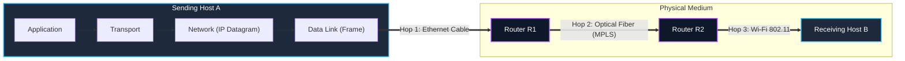
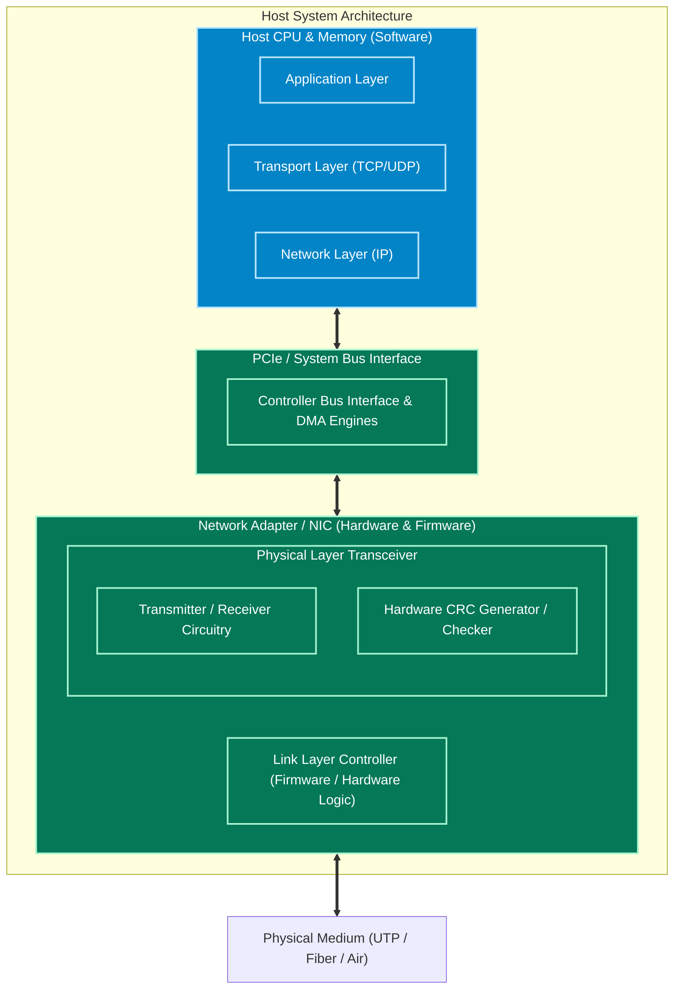
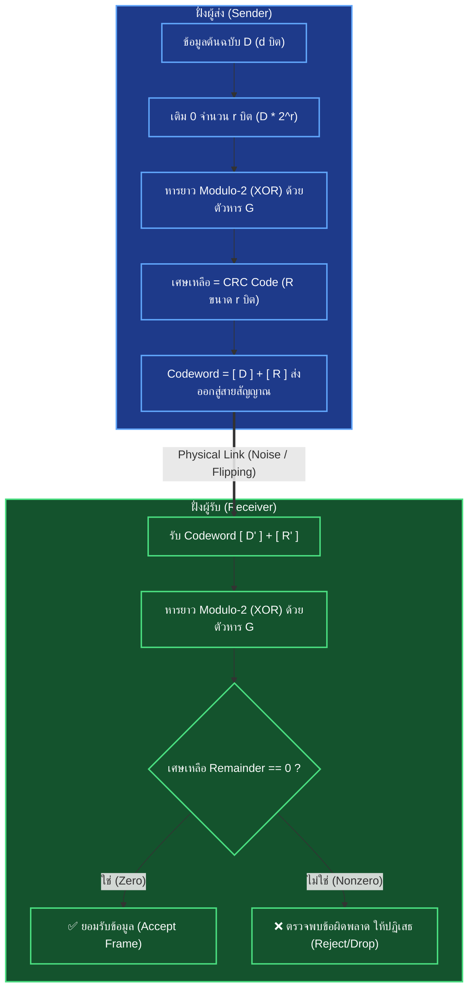
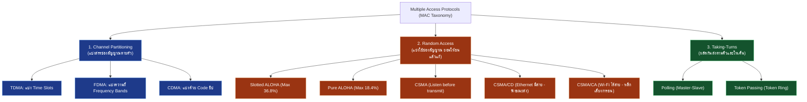
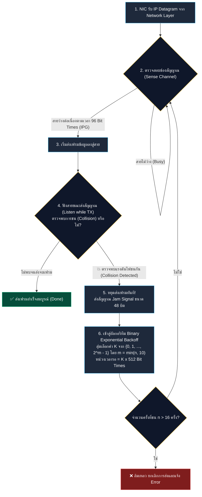
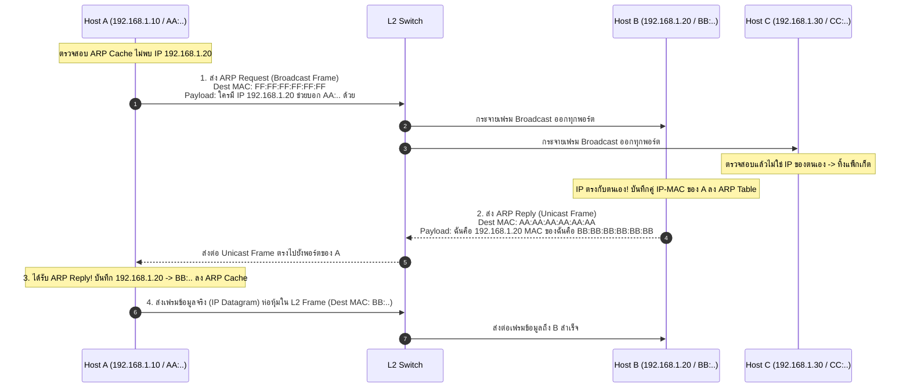
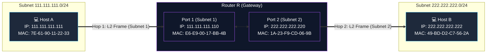
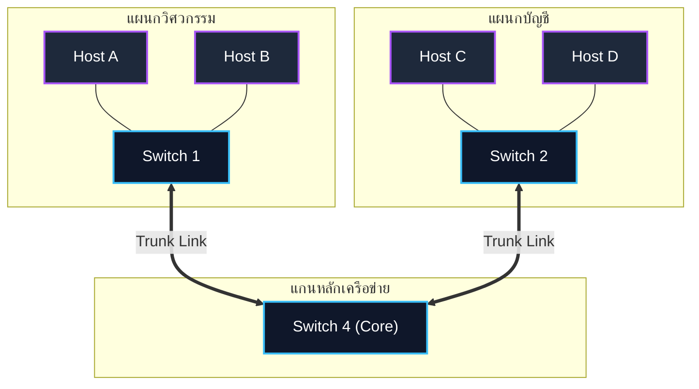
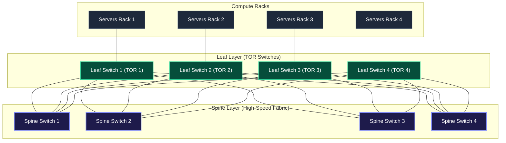
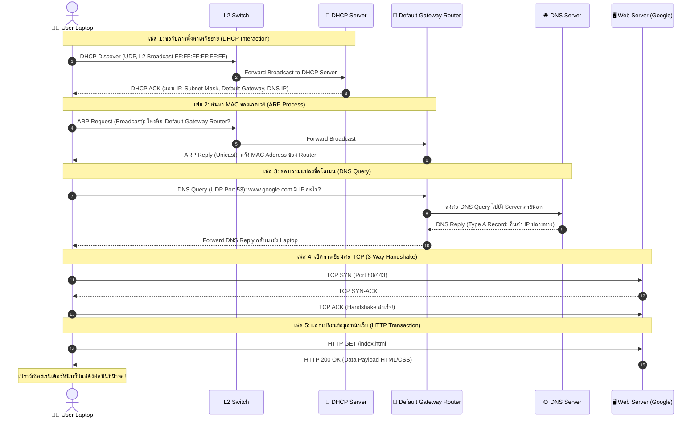

---
tags:
  - networking
  - lecture
  - link-layer
  - lan
  - ethernet
  - mac-address
  - arp
  - switch
  - vlan
  - vxlan
  - mpls
  - datacenter
  - crc
  - v9-current
created: 2026-09-21
updated: 2026-09-21
curriculum: Current v9.0 (Slides 1–111) & Kurose-Ross 8th Ed
type: lecture-note
---

# Lecture 6: Link Layer and Local Area Networks (Current v9.0 Complete Master Guide)

> [!SUMMARY]
> **เอกสารสรุปคลังความรู้วิชา Computer Networks: Chapter 6 Link Layer and LANs (ฉบับหลักสูตรปัจจุบัน v9.0 สไลด์ 1–111 ครบถ้วน 100% สมบูรณ์แบบ)**
> รวบรวมและวิเคราะห์เนื้อหาอย่างละเอียดลึกซึ้งจากสไลด์อาจารย์ผู้สอน สไลด์เจาะลึก CRC ของภาควิชา และหนังสือเรียน *Computer Networking: A Top-Down Approach (Kurose & Ross 8th Edition)* โดยไม่มีการตัดทอนหรือรวบรัดหัวข้อ ครอบคลุม:
> 1. บริการของ Link Layer, การทำงานในฮาร์ดแวร์ Network Adapter (NIC), Framing และ Flow/Error Control
> 2. เทคนิคการตรวจจับและแก้ไขข้อผิดพลาด (1D/2D Parity, Internet Checksum, CRC Modulo-2 Polynomial Division, คุณสมบัติ Generator Polynomial)
> 3. Multiple Access Protocols (TDMA, FDMA, Slotted/Pure ALOHA พร้อมบทพิสูจน์คณิตศาสตร์, CSMA, CSMA/CD พร้อมสูตร Minimum Frame Size 64 Bytes และ Backoff, Taking-Turns Polling/Token, และ Cable DOCSIS)
> 4. Physical Addressing (MAC Address 48 บิต), โปรโตคอล ARP (Broadcast Query / Unicast Reply), และการ Trace การส่งข้อมูลข้ามเครือข่ายย่อย (Routing to Another Subnet Step-by-Step)
> 5. สถาปัตยกรรมอีเทอร์เน็ต (Bus $\to$ Switch Star, โครงสร้างเฟรม 802.3, มาตรฐาน 10M ถึง 100G)
> 6. การทำงานของ Ethernet Switch, ตาราง Forwarding Table, กลไก Self-Learning, การเชื่อมต่อแบบหลายระดับ, กรณีศึกษา UMass Campus Network และการเปรียบเทียบ L2 Switch vs L3 Router
> 7. เครือข่ายเสมือน VLAN (Port-based, 802.1Q Tagging, Inter-VLAN Routing) และเทคโนโลยีศูนย์ข้อมูลยุคใหม่ (VXLAN Overlay, VTEP Tunneling, BGP EVPN)
> 8. Multiprotocol Label Switching (MPLS): โครงสร้าง Header, การสลับ Label (Label Swapping), Traffic Engineering และ LDP Signaling
> 9. เครือข่ายศูนย์ข้อมูล (Data Center Networks): สถาปัตยกรรม 2-Layer Leaf/Spine (Clos Network), ผังเครือข่าย Facebook F16, Multipath ECMP, DCTCP, RoCE, และ Google ORION SDN Control Plane
> 10. การสังเคราะห์ระดับมหาภาค: "A Day in the Life of a Web Request" (แกะรอยกระบวนการตั้งแต่ DHCP $\to$ ARP $\to$ DNS $\to$ TCP Handshake $\to$ HTTP Request/Reply)

---

## 📑 สารบัญเนื้อหาหลัก (Master Table of Contents)

1. [[#1. บริการของ Link Layer และสถาปัตยกรรมฮาร์ดแวร์ NIC (Slides 1–13)]]
   - [[#1.1 ขอบเขตและบริบทของ Data Link Layer]]
   - [[#1.2 การเปรียบเทียบเชิงอุปมา (Transportation Analogy)]]
   - [[#1.3 รายการบริการหลัก 6 ประการของ Link Layer]]
   - [[#1.4 ตำแหน่งการติดตั้ง Link Layer ในระบบคอมพิวเตอร์ (NIC Architecture)]]
   - [[#1.5 การสื่อสารระหว่างอินเทอร์เฟซ (Interfaces Communicating)]]
2. [[#2. เทคนิคการตรวจจับและแก้ไขข้อผิดพลาด (Error Detection & Correction - Slides 14–18)]]
   - [[#2.1 หลักการพื้นฐานของ Error Detection]]
   - [[#2.2 การตรวจสอบพาริตี (Parity Checking: 1D Parity vs. 2D Parity Matrix)]]
   - [[#2.3 ทบทวน Internet Checksum]]
   - [[#2.4 การคำนวณรหัสตรวจสอบส่วนเกินแบบวงรอบ (Cyclic Redundancy Check - CRC)]]
   - [[#2.5 คุณสมบัติของพหุนามตัวหารในอุดมคติ (Ideal Properties of CRC Divisor Polynomial)]]
   - [[#2.6 วงจรฮาร์ดแวร์และการประยุกต์ใช้งาน CRC ในมาตรฐานสากล]]
3. [[#3. โปรโตคอลควบคุมการเข้าใช้ตัวกลาง (Multiple Access Protocols - Slides 19–41)]]
   - [[#3.1 ชนิดของลิงก์: Point-to-Point vs Broadcast Links]]
   - [[#3.2 ปัญหาการชนกันของสัญญาณ (Collisions) และคุณสมบัติของ MAC Protocol ในอุดมคติ]]
   - [[#3.3 อนุกรมวิธานของ Multiple Access Protocols (Taxonomy)]]
   - [[#3.4 Channel Partitioning Protocols: TDMA และ FDMA]]
   - [[#3.5 Random Access Protocols 1: Slotted ALOHA และ Pure ALOHA]]
   - [[#3.6 Random Access Protocols 2: CSMA และ CSMA Collisions]]
   - [[#3.7 Random Access Protocols 3: Ethernet CSMA/CD Algorithm]]
   - [[#3.8 การคำนวณขนาดเฟรมขั้นต่ำของอีเทอร์เน็ต (Minimum Frame Size Derivation)]]
   - [[#3.9 ประสิทธิภาพของ CSMA/CD (CSMA/CD Efficiency)]]
   - [[#3.10 Taking-Turns Protocols: Polling และ Token Passing]]
   - [[#3.11 สถาปัตยกรรมเครือข่ายเคเบิลโมเด็ม: DOCSIS]]
   - [[#3.12 ตารางสรุปเปรียบเทียบโปรโตคอล MAC ทั้งหมด]]
4. [[#4. การระบุตำแหน่งทางกายภาพและโปรโตคอล ARP (Slides 42–55)]]
   - [[#4.1 บทบาทของ MAC Address เปรียบเทียบกับ IP Address]]
   - [[#4.2 โครงสร้างของ MAC Address 48 บิต (OUI vs Vendor Serial)]]
   - [[#4.3 Address Resolution Protocol (ARP): สถาปัตยกรรมและการทำงาน]]
   - [[#4.4 ขั้นตอนการทำงานของ ARP แบบละเอียด (Step-by-Step ARP in Action)]]
   - [[#4.5 การส่งข้อมูลข้ามเครือข่ายย่อย (Routing to Another Subnet Step-by-Step)]]
5. [[#5. สถาปัตยกรรมอีเทอร์เน็ตและมาตรฐาน IEEE 802.3 (Slides 56–63)]]
   - [[#5.1 วิวัฒนาการโทโปโลยีของอีเทอร์เน็ต (Bus vs Star)]]
   - [[#5.2 โครงสร้างเฟรมอีเทอร์เน็ต (Ethernet Frame Structure)]]
   - [[#5.3 คุณลักษณะ Unreliable และ Connectionless]]
   - [[#5.4 ตระกูลมาตรฐาน IEEE 802.3 Ethernet]]
6. [[#6. การทำงานของ Ethernet Switch และกลไก Self-Learning (Slides 64–75)]]
   - [[#6.1 บทบาทของ Ethernet Switch ในการขจัด Collision Domain]]
   - [[#6.2 การส่งข้อมูลพร้อมกันหลายคู่ (Simultaneous Transmissions & Buffering)]]
   - [[#6.3 ตารางการส่งต่อของสวิตช์ (Switch Forwarding Table)]]
   - [[#6.4 กลไกการเรียนรู้ด้วยตนเอง (Switch Self-Learning Algorithm)]]
   - [[#6.5 ตรรกะการคัดกรองและการส่งต่อ (Frame Filtering and Forwarding)]]
   - [[#6.6 การเชื่อมต่อสวิตช์หลายชั้นและการ Trace ตาราง Forwarding]]
   - [[#6.7 กรณีศึกษาโครงสร้างเครือข่ายระดับสถาบัน: UMass Campus Network]]
   - [[#6.8 การเปรียบเทียบเชิงลึก: Switches vs. Routers]]
7. [[#7. เครือข่ายเสมือน VLAN และระบบเสมือนศูนย์ข้อมูลยุคใหม่ (Slides 76–85)]]
   - [[#7.1 แรงจูงใจและความจำเป็นของ Virtual LANs (VLANs)]]
   - [[#7.2 สถาปัตยกรรม Port-Based VLANs]]
   - [[#7.3 การเชื่อมต่อ VLAN ข้ามสวิตช์ด้วย Trunking]]
   - [[#7.4 โครงสร้างแท็กเฟรม IEEE 802.1Q]]
   - [[#7.5 การส่งข้อมูลข้ามเครือข่ายเสมือน (Inter-VLAN Routing)]]
   - [[#7.6 เทคโนโลยีเสมือนศูนย์ข้อมูลยุคใหม่: VXLAN Overlay และ BGP EVPN Context]]
   - [[#7.7 อุโมงค์ VXLAN และจุดสิ้นสุดอุโมงค์ VTEP]]
8. [[#8. การสลับป้ายชื่อโปรโตคอลหลายชั้น (Multiprotocol Label Switching: MPLS - Slides 86–91)]]
   - [[#8.1 บทนำและแรงจูงใจของเทคโนโลยี MPLS]]
   - [[#8.2 สถาปัตยกรรมเร้าเตอร์ MPLS และโครงสร้าง MPLS Header]]
   - [[#8.3 การเปรียบเทียบเส้นทาง: IP Routing vs MPLS Explicit Path]]
   - [[#8.4 โปรโตคอลควบคุมเส้นทาง (MPLS Signaling: LDP & RSVP-TE)]]
   - [[#8.5 การทำงานของตารางส่งต่อ MPLS (Label Forwarding Tables & Swapping)]]
9. [[#9. สถาปัตยกรรมเครือข่ายศูนย์ข้อมูล (Data Center Networks - Slides 92–100)]]
   - [[#9.1 ความท้าทายเฉพาะตัวของ Data Center Networking]]
   - [[#9.2 องค์ประกอบพื้นฐาน: Server Racks และ Top-of-Rack (TOR) Switches]]
   - [[#9.3 สถาปัตยกรรม 2-Layer Leaf/Spine (Clos Network Architecture)]]
   - [[#9.4 ผังเครือข่ายจริงระดับโลก: Facebook F16 Data Center Topology]]
   - [[#9.5 การจัดการเส้นทางหลายช่องทางพร้อมกัน (Equal-Cost Multi-Path: ECMP)]]
   - [[#9.6 นวัตกรรมโปรโตคอลในศูนย์ข้อมูล (DCTCP & RoCE)]]
   - [[#9.7 ระบบควบคุมศูนย์ข้อมูลด้วยซอฟต์แวร์: Google ORION SDN Control Plane]]
10. [[#10. การสังเคราะห์ระดับมหาภาค: "A Day in the Life of a Web Request" (Slides 101–109)]]
    - [[#10.1 สถานการณ์จำลองและภาพรวมสถาปัตยกรรม]]
    - [[#10.2 ขั้นที่ 1: การเชื่อมต่อเข้าสู่เครือข่ายด้วย DHCP]]
    - [[#10.3 ขั้นที่ 2: การค้นหา MAC ของเกตเวย์ด้วย ARP]]
    - [[#10.4 ขั้นที่ 3: การแปลงชื่อโดเมนด้วย DNS]]
    - [[#10.5 ขั้นที่ 4: การเปิดการเชื่อมต่อ TCP Three-Way Handshake]]
    - [[#10.6 ขั้นที่ 5: การแลกเปลี่ยนข้อมูลระดับแอปพลิเคชันด้วย HTTP]]
11. [[#11. ภาคผนวก: การพิสูจน์ทางคณิตศาสตร์ของประสิทธิภาพ ALOHA (Slides 112–113)]]
    - [[#11.1 การพิสูจน์ประสิทธิภาพของ Slotted ALOHA ($S = G e^{-G}$)]]
    - [[#11.2 การพิสูจน์ประสิทธิภาพของ Pure ALOHA ($S = G e^{-2G}$)]]

---

# 1. บริการของ Link Layer และสถาปัตยกรรมฮาร์ดแวร์ NIC (Slides 1–13)

### 1.1 ขอบเขตและบริบทของ Data Link Layer
ในแบบจำลอง TCP/IP 5-Layer สถาปัตยกรรม Data Link Layer (Layer 2) มีหน้าที่รับผิดชอบการส่งผ่านข้อมูลในระดับ **โหนดสู่โหนดที่อยู่ติดกันโดยตรง (Node-to-Adjacent-Node / Hop-by-Hop)** ผ่านลิงก์กายภาพ (Communication Link) เชื่อมต่อระหว่างอุปกรณ์



- **โหนด (Nodes):** อุปกรณ์ใดๆ ก็ตามที่รันโปรโตคอล Link Layer ได้แก่ โฮสต์ (Hosts), เร้าเตอร์ (Routers), สวิตช์ (Switches), และ Access Points (APs)
- **ลิงก์ (Links):** ช่องทางการสื่อสารที่เชื่อมต่อโหนดที่อยู่ติดกัน ซึ่งอาจเป็นสายเคเบิล (Wired Links เช่น Twisted-Pair, Coaxial, Fiber Optic) หรือคลื่นวิทยุไร้สาย (Wireless Links เช่น Wi-Fi 802.11, Cellular 4G/5G, Satellite)
- **เฟรม (Frame):** หน่วยข้อมูลระดับ Data Link Layer (L2 Protocol Data Unit - PDU) ซึ่งทำหน้าที่ห่อหุ้ม Network-layer IP Datagram ไว้ภายใน

---

### 1.2 การเปรียบเทียบเชิงอุปมา (Transportation Analogy)
หนังสือ Kurose & Ross เปรียบเทียบการเดินทางของนักท่องเที่ยวจากเมือง Princeton สหรัฐฯ ไปยังเมือง Lausanne ประเทศสวิตเซอร์แลนด์:
- **นักเดินทาง (Tourist):** เปรียบเสมือน **IP Datagram**
- **ส่วนของการเดินทาง (Transport Segment):** เปรียบเสมือน **Physical Link** (เช่น แท็กซี่, เครื่องบิน, รถไฟ)
- **พาหนะแต่ละประเภท (Transportation Mode):** เปรียบเสมือน **Link-Layer Protocol** ต่างชนิดกัน (เช่น รถลีมูซีนคือ Ethernet, เครื่องบินข้ามมหาสมุทรคือ Optical SONET/SDH, รถไฟคือ Wi-Fi)
- **บริษัทตัวแทนท่องเที่ยว (Travel Agent):** เปรียบเสมือน **Routing Algorithm** ใน Network Layer ที่เลือกเส้นทางรวมทั้งหมด

> [!NOTE]
> ในแต่ละ Hop ของการเดินทาง โปรโตคอล Link Layer ที่ใช้งานอาจแตกต่างกันโดยสิ้นเชิง โดยที่ IP Datagram ไม่จำเป็นต้องรับรู้รายละเอียดของสื่อสัญญาณระดับล่าง ลิงก์แรกอาจเป็น Ethernet ลิงก์ที่สองอาจเป็น Frame Relay/MPLS และลิงก์สุดท้ายอาจเป็น Wi-Fi

---

### 1.3 รายการบริการหลัก 6 ประการของ Link Layer
แม้ว่าโปรโตคอล Link Layer แต่ละตัวจะมีคุณสมบัติเฉพาะ แต่บริการพื้นฐานที่พบได้ทั่วไปมีดังนี้:

1. **การสร้างกรอบข้อมูล (Framing):**
   - ห่อหุ้ม IP Datagram ด้วย **Header** (บรรจุ MAC Address ต้นทาง/ปลายทาง, Type/Length) และ **Trailer** (บรรจุรหัสตรวจสอบข้อผิดพลาด Frame Check Sequence - FCS)
2. **การเข้าถึงตัวกลาง (Link Access / Media Access Control - MAC):**
   - กำหนดกฎเกณฑ์ในการส่งเฟรมลงสู่ช่องสัญญาณ โดยเฉพาะอย่างยิ่งบนตัวกลางแบบใช้ร่วมกัน (Shared Broadcast Channel) ซึ่งหากมีโหนดส่งพร้อมกันจะเกิดการชนกันของคลื่นสัญญาณ (Collision)
   - ใช้ **MAC Address** ในการระบุฮาร์ดแวร์ต้นทางและปลายทางบนลิงก์เดียวกัน
3. **การส่งมอบข้อมูลที่เชื่อถือได้ (Reliable Delivery):**
   - มีกลไกตอบรับ (Acknowledgments - ACK) และส่งซ้ำ (Retransmissions) ในระดับฮาร์ดแวร์
   - นิยมใช้ในลิงก์ที่มีอัตราความผิดพลาดสูง (High Bit-Error Rate - BER) เช่น เครือข่ายไร้สาย Wi-Fi (IEEE 802.11)
   - **ไม่นิยมใช้** ในลิงก์มีสายคุณภาพสูง (Low BER) เช่น สาย Fiber หรือ Twisted-pair Ethernet เพื่อหลีกเลี่ยง Overhead ซ้ำซ้อน เนื่องจาก Transport Layer (TCP) มีกลไกรับประกันความถูกต้องอยู่แล้ว
4. **การควบคุมการไหลของข้อมูล (Flow Control):**
   - ควบคุมอัตราการส่งข้อมูลระหว่างโหนดส่งและโหนดรับที่เชื่อมต่อกันโดยตรง เพื่อป้องกันไม่ให้โหนดรับที่มีบัฟเฟอร์จำกัดเกิดปัญหา Buffer Overflow
5. **การตรวจจับข้อผิดพลาด (Error Detection):**
   - สัญญาณไฟฟ้าหรือคลื่นวิทยุอาจเกิดการบิดเบือน (Attenuation) หรือสัญญาณรบกวน (Noise/Interference) ทำให้บิต `0` พลิกเป็น `1` หรือกลับกัน
   - Link Layer ใช้บิตตรวจสอบส่วนเกิน (Parity, Checksum, CRC) เพื่อให้ตัวรับตรวจพบข้อผิดพลาด และทำการ Drop เฟรมทิ้งทันที
6. **การแก้ไขข้อผิดพลาด (Error Correction):**
   - ผู้รับไม่เพียงตรวจจับได้ว่ามีบิตผิดพลาด แต่สามารถระบุตำแหน่งของบิตที่ผิดและแก้ไขให้ถูกต้องได้ทันทีโดยไม่ต้องขอให้ส่งใหม่ เรียกว่า **Forward Error Correction (FEC)** นิยมใช้ในช่องสัญญาณไร้สายหรือดาวเทียม
7. **โหมดการส่งข้อมูล (Half-Duplex and Full-Duplex):**
   - **Half-Duplex:** โหนดทั้งสองฝั่งของลิงก์สามารถส่งข้อมูลได้ แต่ **ไม่สามารถส่งพร้อมกันได้** (หากส่งพร้อมกันจะชนกัน เช่น ในสาย Coaxial หรือ Wi-Fi ร่วมแชนเนล)
   - **Full-Duplex:** โหนดทั้งสองฝั่งสามารถส่งและรับข้อมูลได้พร้อมกันอย่างอิสระ (เช่น สาย Twisted-pair ต่อเข้า Switch สมัยใหม่)

---

### 1.4 ตำแหน่งการติดตั้ง Link Layer ในระบบคอมพิวเตอร์ (NIC Architecture)
Link Layer ถูกติดตั้งอยู่ที่ใดในสถาปัตยกรรมคอมพิวเตอร์?
คำตอบคือ: **Link Layer ติดตั้งอยู่ภายใน Network Interface Card (NIC)** หรือที่เรียกว่า **Network Adapter** (เช่น ชิป Ethernet หรือ Wi-Fi บนเมนบอร์ด)



- **การประสานงานระหว่าง Software และ Hardware:**
  - เลเยอร์ระดับบน (Application, Transport, Network) ทำงานบน CPU และระบบปฏิบัติการ (OS Kernel) ในรูปของซอฟต์แวร์
  - Link Layer เป็นจุดเชื่อมต่อกึ่งกลาง: มีส่วนควบคุมตรรกะระดับสูงรันบนไดรเวอร์การ์ดแลน (Software Driver) แต่การประมวลผลเฟรม การคำนวณ CRC การเข้ารหัสสัญญาณ และการรับส่งบิตลงสู่สายสัญญาณ ทำงานบน **Hardware/Firmware ภายในชิปการ์ดแลน (NIC)** โดยตรง เพื่อความเร็วระดับกิกะบิตต่อวินาที

---

### 1.5 การสื่อสารระหว่างอินเทอร์เฟซ (Interfaces Communicating)
เมื่อโฮสต์ A ต้องการส่งเฟรมไปยังโฮสต์ B:
1. **Sending Side:**
   - คอนโทรลเลอร์ของการ์ดแลนฝั่งส่งจะรับ IP Datagram มาจากเลเยอร์ 3 ทำการสร้างเฟรม ห่อหุ้ม Header และคำนวณบิต Error-Checking (CRC) เติมไว้ที่ Trailer
   - แปลงเฟรมเป็นสัญญาณไฟฟ้า/แสง/คลื่นวิทยุส่งลงสู่สื่อสัญญาณกายภาพ
2. **Receiving Side:**
   - การ์ดแลนฝั่งรับดักจับสัญญาณเข้ามา ตรวจสอบรหัส CRC หากพบว่ามีข้อผิดพลาดจะทำการ Drop เฟรมทิ้งทันที
   - หากข้อมูลถูกต้องและ Destination MAC ตรงกับตนเอง (หรือเป็น Broadcast) การ์ดแลนจะถอด Header ออก แล้วส่งผ่าน IP Datagram ขึ้นไปยังระบบปฏิบัติการผ่านกลไก Interrupt หรือ DMA (Direct Memory Access)

---

# 2. เทคนิคการตรวจจับและแก้ไขข้อผิดพลาด (Error Detection & Correction - Slides 14–18)

### 2.1 หลักการพื้นฐานของ Error Detection
ข้อมูลระดับบิตที่เดินทางผ่านสื่อสัญญาณจริงอาจเกิดสัญญาณรบกวนทางแม่เหล็กไฟฟ้า (Electromagnetic Noise) ทำให้ค่าบิตบิดเบือนไป (Bit Flip: $0 \to 1$ หรือ $1 \to 0$)
- ให้ $D$ คือบล็อกข้อมูลบิตต้นฉบับขนาด $d$ บิต
- โหนดส่งจะคำนวณบิตตรวจสอบส่วนเกินเรียกว่า **Error Detection and Correction bits ($EDC$)** ขนาด $r$ บิต
- โหนดส่งจะส่งบิตทั้งหมดขนาด $d + r$ บิต ออกไปในช่องสัญญาณ
- โหนดรับได้รับข้อมูล $D'$ และ $EDC'$ (ซึ่งอาจผิดเพี้ยนไปจาก $D$ และ $EDC$) ผู้รับจะทำการประมวลผลทางคณิตศาสตร์เพื่อตัดสินว่าเกิดความผิดพลาดขึ้นหรือไม่

> [!WARNING]
> เทคนิคการตรวจจับข้อผิดพลาดไม่สามารถรับประกันความถูกต้องได้ 100% ยังคงมีความน่าจะเป็นเล็กน้อยที่เกิด **Undetected Bit Errors** (เกิดข้อผิดพลาดหลายจุดพร้อมกันจนผลลัพธ์การคำนวณลงตัวพอดี) การออกแบบบิต $EDC$ ที่ยาวขึ้นและใช้อัลกอริทึมที่ซับซ้อนขึ้นจะช่วยลดความน่าจะเป็นนี้ลงจนเข้าใกล้ศูนย์

---

### 2.2 การตรวจสอบพาริตี (Parity Checking: 1D Parity vs. 2D Parity Matrix)

#### 1. การตรวจสอบพาริตีมิติเดียว (One-Dimensional Parity: 1D Parity)
เป็นการเพิ่มบิต Parity ($1$ บิต) ต่อท้ายข้อมูล:
- **Even Parity (พาริตีคู่):** กำหนดค่าบิต Parity ให้จำนวนเลข `1` ทั้งหมดในบล็อก (รวมบิตพาริตี) เป็น **เลขคู่**
- **Odd Parity (พาริตีคี่):** กำหนดค่าบิต Parity ให้จำนวนเลข `1` ทั้งหมดเป็น **เลขคี่**

| ประเภทพาริตี | ข้อมูลต้นฉบับ $D$ (7 บิต) | จำนวนเลข 1 เดิม | บิตพาริตีที่สร้าง ($P$) | สตรีมบิตที่ส่ง ($D + P$) |
| :--- | :--- | :--- | :--- | :--- |
| **Even Parity** | `0111000` | 3 (เลขคี่) | **1** | `01110001` (มี 1 รวม 4 ตัว) |
| **Even Parity** | `0111001` | 4 (เลขคู่) | **0** | `01110010` (มี 1 รวม 4 ตัว) |
| **Odd Parity** | `0111000` | 3 (เลขคี่) | **0** | `01110000` (มี 1 รวม 3 ตัว) |
| **Odd Parity** | `0111001` | 4 (เลขคู่) | **1** | `01110011` (มี 1 รวม 5 ตัว) |

- **ข้อจำกัด:** สามารถตรวจจับความผิดพลาดได้เฉพาะเมื่อเกิดการพลิกของบิตเป็น **จำนวนคี่ (1, 3, 5 บิต)** เท่านั้น หากบิตพลิกพร้อมกันเป็นจำนวนคู่ (เช่น พลิก 2 บิต) จะ **ไม่สามารถตรวจจับได้เลย (Undetected)** และไม่สามารถระบุตำแหน่งที่ผิดเพื่อแก้ไขได้

---

#### 2. การตรวจสอบพาริตีสองมิติ (Two-Dimensional Parity Matrix)
จัดเรียงบล็อกข้อมูล $D$ ในรูปเมทริกซ์ $i$ แถว และ $j$ คอลัมน์ จากนั้นคำนวณค่า Even Parity ประจำแต่ละแถว (Row Parity) และประจำแต่ละคอลัมน์ (Column Parity)

```
        Column 1   Column 2   Column 3   Column 4   Row Parity
Row 1:     1          0          1          0      |    0
Row 2:     0          1          1          0      |    0
Row 3:     1          1          0          1      |    1
       --------------------------------------------+------
Col Par:   0          0          0          1      |    1  (Parity of Parity)
```

- **กลไกการตรวจจับและแก้ไข (Forward Error Correction - FEC):**
  - หากเกิดความผิดพลาด **1 บิตเดี่ยว (Single-bit error)** เช่น บิตที่ Row 2, Column 2 พลิกจาก `1` เป็น `0`:
    - แถวที่ 2 จะเกิด Parity Error ทันที
    - คอลัมน์ที่ 2 จะเกิด Parity Error ทันที
    - จุดตัดของแถวและคอลัมน์ที่ผิดพลาด (Row 2, Column 2) จะระบุตำแหน่งของบิตที่ผิดได้อย่างแม่นยำ ผู้รับจึงสามารถทำการ **กลับค่าบิต (Bit Inversion)** เพื่อแก้ไขข้อผิดพลาดให้ถูกต้องได้ทันทีโดยไม่ต้องส่งคำขอให้ส่งซ้ำ!
  - หากเกิดข้อผิดพลาด 2 บิตในตำแหน่งใดๆ 2D Parity สามารถ **ตรวจจับได้เสมอ (Detect 2-bit errors)** แต่ไม่สามารถแก้ไขได้

---

### 2.3 ทบทวน Internet Checksum
- ใช้งานใน Transport Layer (UDP, TCP) และ Network Layer (IPv4 Header Checksum)
- นำข้อมูลมาแบ่งเป็นชุดขนาด 16 บิต แล้วนำมาบวกกันแบบ **1's Complement Sum** (หากมีตัวทด Carry เกิน 16 บิต ให้นำกลับมาวนบวกที่บิตต่ำสุด เรียกว่า Wraparound)
- ค่า Checksum คือผลลัพธ์จากการกลับบิต (Bit Inversion / 1's Complement)
- ฝั่งรับจะนำทุกชุด 16 บิตรวมถึงค่า Checksum มาบวกกัน หากผลลัพธ์เป็น `1111111111111111` (ฐาน 16 คือ `0xFFFF`) แสดงว่าข้อมูลไม่มีข้อผิดพลาด
- จุดเด่นคือคำนวณง่ายด้วยซอฟต์แวร์ แต่ประสิทธิภาพการตรวจจับต่ำกว่า CRC มาก

---

### 2.4 การคำนวณรหัสตรวจสอบส่วนเกินแบบวงรอบ (Cyclic Redundancy Check - CRC)
CRC เป็นเทคนิคการตรวจจับข้อผิดพลาดระดับฮาร์ดแวร์ที่ทรงพลังและนิยมใช้แพร่หลายที่สุดในโครงข่ายดิจิทัล (Ethernet IEEE 802.3, Wi-Fi 802.11, HDLC, USB, CAN Bus)

#### 1. หลักการทางคณิตศาสตร์ Modulo-2 Arithmetic:
- การดำเนินการทางคณิตศาสตร์ Modulo-2 ไม่มีการทด (No Carry) ในการบวก และไม่มีการยืม (No Borrow) ในการลบ
- การบวกและการลบในระบบ Modulo-2 มีค่าเทียบเท่ากับการทำ **XOR ($\oplus$)** ทางตรรกศาสตร์ทุกประการ:
  $$0 \oplus 0 = 0, \quad 0 \oplus 1 = 1, \quad 1 \oplus 0 = 1, \quad 1 \oplus 1 = 0$$

#### 2. กลไกการคำนวณของ CRC (Algorithm Steps):
1. ให้ข้อมูล $D$ คือบิตข้อมูลขนาด $d$ บิต
2. กำหนด **Generator Polynomial ($G$)** หรือตัวหาร (Divisor) ขนาด $r+1$ บิต โดยที่บิตสูงสุด (MSB) ของ $G$ ต้องเป็น `1` เสมอ (ซึ่งโหนดส่งและโหนดรับต้องตกลงค่า $G$ นี้ล่วงหน้าตามมาตรฐานโปรโตคอล)
3. **ฝั่งผู้ส่ง (Sender):**
   - เติมบิต `0` จำนวน $r$ บิต ต่อท้ายข้อมูล $D$ (เทียบเท่ากับการคูณ $D \times 2^r$)
   - นำค่า $(D \cdot 2^r)$ มาตั้งหารยาวแบบ Modulo-2 (XOR Division) ด้วยค่าตัวหาร $G$
   - เศษเหลือจากการหาร (Remainder) ขนาด $r$ บิต คือค่า **CRC Checksum ($R$)**
   - ผู้ส่งประกอบเฟรมส่งออกไปเป็นสตริงบิตขนาด $d + r$ บิต นั่นคือ:
     $$\text{Transmitted Codeword} = D \cdot 2^r \oplus R$$
4. **ฝั่งผู้รับ (Receiver):**
   - ผู้รับรับสตริงบิตขนาด $d + r$ บิตเข้ามา
   - นำสตริงบิตที่ได้รับมาตั้งหารด้วยตัวหาร $G$ เดิมแบบ Modulo-2
   - **การตัดสินใจ:**
     - หากเศษเหลือเท่ากับศูนย์ทั้งหมด ($\text{Remainder} = 0$) $\implies$ **ยอมรับเฟรม (Accept Data)**
     - หากเศษเหลือไม่เท่ากับศูนย์ ($\text{Remainder} \ne 0$) $\implies$ **ตรวจพบข้อผิดพลาด ให้ทิ้งเฟรมทันที (Reject / Discard Frame)**



---

### 2.5 คุณสมบัติของพหุนามตัวหารในอุดมคติ (Ideal Properties of CRC Divisor Polynomial)
ในทางคณิตศาสตร์ ตัวหาร $G$ นิยมเขียนในรูปพหุนาม เช่น:
$$G(x) = x^3 + x + 1 \iff \mathbf{1011}_2$$
(ดีกรีของพหุนามคือเลขชี้กำลังสูงสุด $r = 3$ ความยาวบิตคือ $r + 1 = 4$ บิต)

คุณสมบัติที่สำคัญของตัวหารพหุนามในมาตรฐานระดับสากล:
1. **ต้องหารด้วย $x$ ไม่ลงตัว (Must Not Be Divisible by $x$):** หมายถึงเทอม $x^0 = 1$ ต้องมีอยู่เสมอ (บิตขวาสุด LSB ต้องเป็น `1`) เพื่อรับประกันการตรวจจับข้อผิดพลาดที่เกิดขึ้นในบิตแรกได้อย่างแน่นอน
2. **ต้องหารด้วย $(x + 1)$ ลงตัว (Must Be Divisible by $x + 1$):** รับประกันการตรวจจับความผิดพลาดที่เกิดขึ้นเป็น **จำนวนคี่บิตทั้งหมด (All Odd Number of Bit Errors)**
3. **ความสามารถในการตรวจจับ Burst Errors:** ตัวหารที่มีดีกรี $r$ สามารถตรวจจับความผิดพลาดแบบกลุ่ม (Burst Errors) ที่มีความยาวไม่เกิน $r$ บิต ได้ **100% เต็ม**

---

### 2.6 วงจรฮาร์ดแวร์และการประยุกต์ใช้งาน CRC ในมาตรฐานสากล
- **ตัวหารมาตรฐานสากลที่สำคัญ:**
  - **CRC-32 (IEEE 802.3 Ethernet / Wi-Fi 802.11):** ใช้พหุนามดีกรี 32 ตรวจจับความผิดพลาดของเฟรมอีเทอร์เน็ตขนาดใหญ่ถึง 1500 ไบต์ได้อย่างแม่นยำยิ่งยวด
    $$G_{\text{CRC-32}}(x) = x^{32} + x^{26} + x^{23} + x^{22} + x^{16} + x^{12} + x^{11} + x^{10} + x^8 + x^7 + x^5 + x^4 + x^2 + x + 1$$
  - **CRC-15 (CAN Bus ในยานยนต์):** ใช้ในโครงข่ายควบคุมระบบเบรกและเครื่องยนต์
  - **CRC-5 / CRC-16 (USB):** ใช้ตรวจสอบ Packet ข้อมูลและ Token ในพอร์ต USB
- **การติดตั้งในฮาร์ดแวร์:** วงจรหาร CRC ไม่ได้ใช้ CPU ในการคำนวณทีละบรรทัด แต่สร้างด้วยวงจร **Linear Feedback Shift Register (LFSR)** ประกอบด้วย Shift Registers และ XOR Gates เพียงไม่กี่ตัว สามารถประมวลผลสตรีมบิตระดับ Serial ได้ด้วยความเร็วแสง (Wire-speed) ภายในฮาร์ดแวร์ NIC

---

# 3. โปรโตคอลควบคุมการเข้าใช้ตัวกลาง (Multiple Access Protocols - Slides 19–41)

### 3.1 ชนิดของลิงก์: Point-to-Point vs Broadcast Links
ลิงก์ในระดับ Data Link Layer แบ่งออกเป็น 2 ประเภทหลัก:
1. **Point-to-Point Link:** เชื่อมต่อระหว่างโหนดผู้ส่ง 1 ตัว และโหนดผู้รับ 1 ตัวโดยตรง เช่น สาย Fiber ข้ามประเทศ, สายต่อระหว่างพอร์ต Switch และ PC (Full-Duplex Ethernet), หรือโปรโตคอล PPP
2. **Broadcast Link (Shared Medium):** ลิงก์ที่โหนดหลายตัวเชื่อมต่อเข้าสู่ช่องสัญญาณทางกายภาพเดียวกัน เช่น สายเคเบิลโคแอ็กเชียลในอีเทอร์เน็ตยุคโบราณ (10BASE5/10BASE2), เครือข่ายไร้สาย Wi-Fi, เครือข่ายดาวเทียม หรือเคเบิลโมเด็มตามบ้าน

---

### 3.2 ปัญหาการชนกันของสัญญาณ (Collisions) และคุณสมบัติของ MAC Protocol ในอุดมคติ
ใน Broadcast Link หากมีโหนดส่งข้อมูลลงสู่ตัวกลางพร้อมกันตั้งแต่ 2 โหนดขึ้นไป คลื่นสัญญาณจะแทรกสอดและหักล้างกัน เรียกว่า **การชนกันของสัญญาณ (Collision)** ทำให้โหนดรับไม่สามารถถอดรหัสข้อมูลได้
- **Multiple Access Protocol (MAC):** คืออัลกอริทึมแบบกระจายศูนย์ (Distributed Algorithm) ที่กำหนดว่า **โหนดใดสามารถส่งข้อมูลได้เมื่อใด** ผ่านช่องสัญญาณที่ใช้งานร่วมกัน

> [!DEFINITION]
> **คุณสมบัติของ Multiple Access Protocol ในอุดมคติ (เมื่อช่องสัญญาณมีอัตราเร็ว $R$ bps):**
> 1. เมื่อมีโหนดต้องการส่งข้อมูลเพียงโหนดเดียว ($M = 1$) โหนดนั้นต้องสามารถใช้แบนด์วิดท์ได้เต็มพิกัดคือ **$R$ bps**
> 2. เมื่อมีโหนดต้องการส่งข้อมูลพร้อมกัน $M$ โหนด แต่ละโหนดต้องได้รับอัตราการส่งเฉลี่ยเท่ากับ **$R / M$ bps**
> 3. โปรโตคอลต้องเป็น **ระบบกระจายศูนย์ (Fully Decentralized):** ไม่พึ่งพา Master Node คอยสั่งการ และไม่ต้องมีการซิงโครไนซ์นาฬิกาที่ซับซ้อน
> 4. มีความเรียบง่าย (Simple) และต้นทุนต่ำในการติดตั้งใช้งาน

---

### 3.3 อนุกรมวิธานของ Multiple Access Protocols (Taxonomy)
โปรโตคอล MAC ในประวัติศาสตร์เครือข่ายแบ่งออกเป็น 3 ตระกูลใหญ่:



---

### 3.4 Channel Partitioning Protocols: TDMA และ FDMA

#### 1. Time Division Multiple Access (TDMA):
- แบ่งเวลาออกเป็นรอบๆ (Time Frames) และในแต่ละรอบจะแบ่งย่อยเป็นช่องเวลาขนาดคงที่ (**Time Slots**) เท่ากับจำนวนโหนด $N$
- แต่ละโหนดจะได้รับจัดสรรสล็อตประจำตัวอย่างถาวรในทุกรอบ
- **ข้อดี:** ไม่มีการชนกันของสัญญาณเลย (Zero Collision) และยุติธรรมเมื่อทุกโหนดมีข้อมูลส่ง
- **ข้อเสีย:** ขาดประสิทธิภาพอย่างรุนแรงเมื่อมีโหนดส่งข้อมูลน้อย (Low Traffic) ตัวอย่างเช่น หากมีสล็อตสำหรับ 6 โหนด แต่มีเพียงโหนดเดียวที่มีข้อมูล โหนดนั้นก็ยังคงส่งได้เพียง $R/6$ เท่านั้น ในขณะที่อีก 5 สล็อตที่เหลือต้องปล่อยว่างเปล่าอย่างสูญเปล่า

#### 2. Frequency Division Multiple Access (FDMA):
- แบ่งคลื่นความถี่ของช่องสัญญาณขนาด $R$ bps ออกเป็นแถบความถี่ย่อย (Frequency Bands) ประจำแต่ละโหนดอย่างถาวร
- **ข้อดี/ข้อเสีย:** เช่นเดียวกับ TDMA หากมีโหนดต้องการส่งข้อมูลเพียงโหนดเดียว แถบความถี่อื่นๆ จะถูกทิ้งว่าง ทำให้ Throughput สูงสุดจำกัดอยู่ที่ $R/N$

---

### 3.5 Random Access Protocols 1: Slotted ALOHA และ Pure ALOHA
ในกลุ่ม Random Access โหนดที่ต้องการส่งข้อมูลจะส่งด้วยอัตราเร็วเต็มพิกัด $R$ bps ทันที โดยไม่มีการแบ่งช่องสัญญาณตายตัว หากเกิดการชนกัน โหนดจะสุ่มหน่วงเวลา (Random Delay) ก่อนพยายามส่งใหม่

#### 1. Slotted ALOHA:
- **สมมติฐาน:** เวลาถูกแบ่งเป็นสล็อตขนาดเท่ากับเวลาส่ง 1 เฟรมพอดี ($L/R$), โหนดรับรู้จังหวะเริ่มต้นสล็อตพร้อมกัน, โหนดจะส่งเฟรมได้เฉพาะที่ **จุดเริ่มต้นของสล็อต (Beginning of Slot)** เท่านั้น
- **การทำงาน:** หากชนกันในสล็อต โหนดจะตรวจพบได้ก่อนจบสล็อต และในแต่ละสล็อตถัดไป โหนดจะสุ่มส่งซ้ำด้วยความน่าจะเป็น $p$ จนกว่าจะสำเร็จ
- **ประสิทธิภาพสูงสุด (Max Efficiency):**
  $$S = G e^{-G} \xrightarrow{G=1} \mathbf{\frac{1}{e} \approx 0.368 \quad (36.8\%)}$$
  (เมื่อช่องสัญญาณมีโหลดเต็มที่ จะมีการส่งสำเร็จเพียง 36.8% อีก 63.2% ของเวลาจะสูญเปล่าไปกับการชนกันหรือสล็อตว่าง)

#### 2. Pure ALOHA (Unslotted):
- ไม่มีการแบ่งสล็อตเวลา โหนดที่มีข้อมูลพร้อมสามารถ **ส่งเฟรมออกไปได้ทันทีทุกขณะ**
- **ช่องโหว่ความเสี่ยง (Vulnerable Period):** เฟรมจะถูกชนหากมีโหนดอื่นส่งข้อมูลในช่วงเวลา $[t_0 - t_{\text{frame}}, t_0 + t_{\text{frame}}]$ นั่นคือมีความกว้างของช่วงเวลาเสี่ยงถึง **$2 \times t_{\text{frame}}$** (ยาวเป็น 2 เท่าของ Slotted ALOHA)
- **ประสิทธิภาพสูงสุด (Max Efficiency):**
  $$S = G e^{-2G} \xrightarrow{G=0.5} \mathbf{\frac{1}{2e} \approx 0.184 \quad (18.4\%)}$$
  (ประสิทธิภาพสูงสุดลดลงเหลือเพียงครึ่งหนึ่งของ Slotted ALOHA)

---

### 3.6 Random Access Protocols 2: CSMA และ CSMA Collisions
ALOHA มีข้อเสียร้ายแรงคือ "ส่งโดยไม่ฟัง" (ไม่สนใจว่ามีโหนดอื่นส่งอยู่หรือไม่)
โปรโตคอล **Carrier Sense Multiple Access (CSMA)** นำหลักการมารยาทของมนุษย์มาประยุกต์ใช้: **"Listen before transmit" (ฟังช่องสัญญาณก่อนส่ง)**
- หากช่องสัญญาณว่าง (Idle) $\implies$ เริ่มส่งเฟรม
- หากช่องสัญญาณไม่ว่าง (Busy) $\implies$ ชะลอการส่งไว้ก่อน

#### ทำไม CSMA จึงยังเกิดการชนกันได้ (Why Collisions Still Occur)?
สาเหตุหลักมาจาก **Propagation Delay (ความล่าช้าในการแพร่สัญญาณ)** คลื่นแม่เหล็กไฟฟ้าในสายเคเบิลเดินทางด้วยความเร็วจำกัด (ประมาณ $2 \times 10^8$ เมตร/วินาที หรือ 2 ใน 3 ของความเร็วแสง):
- โหนด A ฟังสายเห็นว่าว่าง จึงเริ่มส่งข้อมูล
- ในขณะที่บิตแรกของ A กำลังเดินทางในสายแต่ยังไปไม่ถึงโหนด B โหนด B ทำการฟังสายและเห็นว่าสายว่างเช่นกัน โหนด B จึงเริ่มส่งข้อมูล
- บิตของ A และ B จึงเข้าปะทะและชนกันกลางสายสัญญาณ ทำให้ข้อมูลเสียหายทั้งสองฝ่าย!

---

### 3.7 Random Access Protocols 3: Ethernet CSMA/CD Algorithm
ในระบบสายเคเบิลอีเทอร์เน็ตดั้งเดิม โหนดได้พัฒนาขึ้นเป็น **CSMA with Collision Detection (CSMA/CD)**: **"Listen while transmitting" (ฟังช่องสัญญาณขณะที่กำลังส่งข้อมูลอยู่ตลอดเวลา)**



#### กลไก Binary Exponential Backoff:
- หลังการชนครั้งที่ $n$ ($n \le 10$): โหนดสุ่มค่าจำนวนเต็ม $K$ จากเซต:
  $$\{0, 1, 2, \dots, 2^{\min(n, 10)} - 1\}$$
- โหนดจะหน่วงเวลารอเป็นเวลา **$K \times 512\text{ Bit Times}$** (สำหรับ 10 Mbps Ethernet: $1\text{ Bit Time} = 0.1\ \mu\text{s}$, ดังนั้น $512\text{ Bit Times} = 51.2\ \mu\text{s}$)
- หากชนครั้งที่ 1 ($n=1$): $K \in \{0, 1\}$ (เลือกรอ 0 หรือ 51.2 $\mu\text{s}$)
- หากชนครั้งที่ 2 ($n=2$): $K \in \{0, 1, 2, 3\}$
- หากชนครั้งที่ 10 ($n=10$): $K \in \{0, 1, \dots, 1023\}$ (ช่วงเวลาสุ่มกว้างขึ้นแบบเอ็กซ์โพเนนเชียล เพื่อสลายความหนาแน่นของผู้ส่งเมื่อเครือข่ายแออัด)
- หากชนเกิน 16 ครั้ง จะยกเลิกและรายงานความผิดพลาดขึ้นสู่เลเยอร์บน

---

### 3.8 การคำนวณขนาดเฟรมขั้นต่ำของอีเทอร์เน็ต (Minimum Frame Size Derivation)

> [!IMPORTANT]
> **ทำไมเฟรมอีเทอร์เน็ตจึงต้องมีขนาดขั้นต่ำ 64 ไบต์ (512 บิต)?**
> เพื่อให้กลไก Collision Detection ทำงานได้อย่างถูกต้อง โหนดส่ง **ต้องยังคงส่งข้อมูลอยู่ (Transmission Time ยังไม่สิ้นสุด)** ในขณะที่สัญญาณการชนกันจากปลายสายที่ไกลที่สุดเดินทางกลับมาถึงตนเอง

```
Time 0: โหนด A เริ่มส่งบิตแรก
Time d_prop: บิตแรกเดินทางเกือบถึงโหนด B ที่ปลายสาย โหนด B เริ่มส่งข้อมูลพอดี เกิด Collision!
Time 2 * d_prop: คลื่นสัญญาณการชนกันเดินทางย้อนกลับมาถึงโหนด A
```

ดังนั้น เวลาในการส่งข้อมูลของเฟรม ($t_{\text{trans}} = L/R$) จะต้องมากกว่าหรือเท่ากับเวลาเดินทางไป-กลับของสัญญาณในสายที่ยาวที่สุดในระบบเครือข่าย ($2 \times d_{\text{prop}}$):
$$t_{\text{trans}} \ge 2 \times d_{\text{prop}} \implies \frac{L_{\min}}{R} \ge 2 \times d_{\text{prop}} \implies \mathbf{L_{\min} = 2 \times d_{\text{prop}} \times R}$$

- **การคำนวณในมาตรฐาน 10 Mbps Ethernet (ระยะสายสูงสุด 2,500 เมตร ผ่าน Repeater 4 ตัว):**
  - เวลาหน่วง Round-Trip Time สูงสุดของระบบ $= 51.2\ \mu\text{s}$
  - $L_{\min} = 51.2\ \mu\text{s} \times 10\times 10^6\text{ bps} = 512\text{ บิต} = \mathbf{64\text{ ไบต์}}$
  - หาก Payload ข้อมูลมีขนาดน้อยกว่า 46 ไบต์ Link Layer จะต้องเติมบิตศูนย์เสริม (**Padding**) ให้เฟรมมีขนาดอย่างน้อย 64 ไบต์เสมอ!

---

### 3.9 ประสิทธิภาพของ CSMA/CD (CSMA/CD Efficiency)
สูตรประสิทธิภาพของโปรโตคอล CSMA/CD:
$$\text{Efficiency} = \frac{1}{1 + 5 \frac{d_{\text{prop}}}{d_{\text{trans}}}}$$
- เมื่อระยะทางเข้าใกล้ 0 ($d_{\text{prop}} \to 0$) หรือขนาดเฟรมมีขนาดใหญ่มาก ($d_{\text{trans}} \to \infty$) อัตราส่วน $d_{\text{prop}}/d_{\text{trans}} \to 0$ ทำให้ **$\text{Efficiency} \to 100\%$**
- แสดงให้เห็นว่า CSMA/CD มีประสิทธิภาพสูงกว่า ALOHA อย่างมหาศาลภายใต้สภาวะเครือข่ายท้องถิ่นขนาดกะทัดรัด

---

### 3.10 Taking-Turns Protocols: Polling และ Token Passing
โปรโตคอลกลุ่ม "ผลัดกันส่ง" พยายามนำเอาจุดเด่นของ Channel Partitioning (ไม่ชนกันที่โหลดสูง) และ Random Access (ส่งได้เต็มสปีดที่โหลดต่ำ) มารวมกัน:

#### 1. Polling Protocol:
- มีอุปกรณ์ศูนย์กลางทำหน้าที่เป็น **Master Node**
- Master จะส่งข้อความสอบถาม (Poll) ไปยังอุปกรณ์สเลฟ (Slaves) ทีละโหนดตามลำดับ เพื่ออนุญาตให้ส่งข้อมูลได้ครั้งละ 1 เฟรม
- **ข้อเสีย:**
  - มีเวลาสูญเปล่าในการส่งแพ็กเก็ตถามตอบ (Polling Overhead)
  - เกิดความหน่วงในการรอคิว (Latency)
  - มีจุดล้มเหลวเดี่ยว (**Single Point of Failure**): หาก Master ล่ม ทั้งเครือข่ายจะหยุดทำงานทันที

#### 2. Token Passing Protocol (เช่น Token Ring, FDDI):
- ไม่มี Master Node แต่ใช้เฟรมพิเศษขนาดเล็กเรียกว่า **Token (เหรียญตรา)** ส่งเวียนไปตามวงแหวนของโหนดในทิศทางเดียว
- โหนดที่มี Token อยู่ในมือเท่านั้นจึงจะมีสิทธิ์ส่งข้อมูล เมื่อส่งเสร็จแล้วจะต้องส่งต่อ Token ให้โหนดถัดไป
- **ข้อเสีย:**
  - Token Overhead และ Latency
  - หาก Token สูญหายจากสัญญาณรบกวน ต้องมีโปรโตคอลฟื้นฟูและสร้าง Token ใหม่ที่ซับซ้อน

---

### 3.11 สถาปัตยกรรมเครือข่ายเคเบิลโมเด็ม: DOCSIS
**Data-Over-Cable Service Interface Specifications (DOCSIS)** คือมาตรฐานที่เชื่อมต่อบ้านเรือนเข้าสู่ระบบอินเทอร์เน็ตผ่านสายเคเบิลทีวี (Coaxial / HFC Cable):
- **Downstream (CMTS ไปยัง Cable Modems):** ช่องสัญญาณ FDM แต่ละช่องกว้าง 6–8 MHz ส่งข้อมูลแบบ Broadcast ด้วยความเร็วสูงถึงระดับ Gbps โดยไม่มีการชนกัน
- **Upstream (Cable Modems ไปยัง CMTS):** ใช้การผสมผสาน TDM/FDM ช่องสัญญาณถูกแบ่งเป็นช่วงเวลาสล็อตย่อยๆ (Mini-slots):
  - โมเด็มแต่ละตัวจะใช้สล็อตพิเศษสำหรับส่งคำขอจองช่องสัญญาณ (**Request Frame**) ซึ่งสล็อตนี้ทำงานแบบ **Random Access (อาจเกิด Collision กันได้)**
  - หากคำขอส่งสำเร็จ อุปกรณ์ CMTS จะส่งแผนผังอนุญาต (MAP Frame) บน Downstream ระบุว่าโมเด็มตัวใดสามารถส่งข้อมูลใน Mini-slot ถัดไปได้อย่างแน่นอนโดยไม่ชนกัน

---

### 3.12 ตารางสรุปเปรียบเทียบโปรโตคอล MAC ทั้งหมด

| หมวดหมู่โปรโตคอล | โปรโตคอล | การชนกันของสัญญาณ (Collisions) | ประสิทธิภาพที่โหลดต่ำ | ประสิทธิภาพที่โหลดสูง | ข้อจำกัดหลัก |
| :--- | :--- | :--- | :--- | :--- | :--- |
| **Channel Partitioning** | **TDMA / FDMA** | ไม่มี (Zero Collision) | ต่ำ (จำกัดที่ $R/N$) | สูง (แบ่งปันเท่าเทียม) | สูญเสียแบนด์วิดท์เมื่อมีผู้ส่งน้อย |
| **Random Access** | **Pure ALOHA** | มีตลอดเวลา | ปานกลาง | แย่มาก (สูงสุด 18.4%) | ไม่ฟังสาย ชนกันง่ายดาย |
| **Random Access** | **Slotted ALOHA** | มี | ปานกลาง | ต่ำ (สูงสุด 36.8%) | ต้องซิงโครไนซ์สล็อตเวลา |
| **Random Access** | **CSMA/CD** | มี แต่สั้นมาก (หยุดทันที) | สูงมาก (เกือบ 100%) | สูง (ขึ้นกับขนาดสาย) | ใช้ได้เฉพาะลิงก์มีสายแบบ Half-Duplex |
| **Taking-Turns** | **Polling** | ไม่มี | ปานกลาง (ติด Polling delay) | สูง | Single Point of Failure |
| **Taking-Turns** | **Token Passing**| ไม่มี | ปานกลาง (ติด Token wait) | สูง | ระบบจัดการ Token มีความซับซ้อน |

---

# 4. การระบุตำแหน่งทางกายภาพและโปรโตคอล ARP (Slides 42–55)

### 4.1 บทบาทของ MAC Address เปรียบเทียบกับ IP Address
- **IP Address (Layer 3 - 32 บิตใน IPv4):** ระบุตำแหน่ง **เชิงตรรกะ (Logical Address)** ของโฮสต์ในโครงสร้างอินเทอร์เน็ตทั่วโลก มีลักษณะเป็นลำดับชั้น (Hierarchical) เปลี่ยนแปลงตามเครือข่ายย่อย (Subnet) ที่ไปเชื่อมต่อ คล้ายกับ "ที่อยู่ไปรษณีย์"
- **MAC Address (Layer 2 - 48 บิต):** ระบุตัวตน **ทางกายภาพของอินเทอร์เฟซการ์ดแลน (Physical / Link-layer Address)** มีโครงสร้างแบบแบนราบ (Flat Architecture) ติดตัวถาวร ไม่เปลี่ยนแปลงตามสถานที่ คล้ายกับ "หมายเลขประจำตัวประชาชน"

---

### 4.2 โครงสร้างของ MAC Address 48 บิต (OUI vs Vendor Serial)
เขียนในรูปเลขฐานสิบหก 12 หลัก (แบ่งเป็น 6 ไบต์ คั่นด้วยโคลอนหรือขีด เช่น `00:1A:2B:3C:4D:5E`):
- **24 บิตแรก (3 ไบต์): Organizationally Unique Identifier (OUI)** — รหัสเฉพาะของบริษัทผู้ผลิตฮาร์ดแวร์ กำหนดและควบคุมโดยสถาบัน IEEE (เช่น Cisco, Apple, Intel)
- **24 บิตหลัง (3 ไบต์): Network Interface Specific** — หมายเลขซีเรียลเฉพาะตัวของการ์ดแลนแต่ละใบที่บริษัทผลิต
- **คุณสมบัติความสะดวกในการพกพา (Portability):** การ์ดแลนตัวเดิมเมื่อย้ายจาก LAN ในประเทศไทยไปต่อในสหรัฐฯ จะยังคงมี MAC Address เดิมเสมอ ในขณะที่ IP Address จะต้องเปลี่ยนใหม่ตาม Subnet นั้นๆ
- **Broadcast MAC Address:** `FF:FF:FF:FF:FF:FF` (บิตทุกบิตเป็น `1` ทั้งหมด ใช้ส่งถึงทุกโหนดใน LAN)

---

### 4.3 Address Resolution Protocol (ARP): สถาปัตยกรรมและการทำงาน
ในการส่งเฟรมระดับ L2 โหนดส่งจำเป็นต้องทราบ **MAC Address ปลายทาง** ของโหนดใน LAN เดียวกัน แต่โหนดต้นทางมักจะทราบเพียง **IP Address ปลายทาง** เท่านั้น
โปรโตคอล **ARP (RFC 826)** ทำหน้าที่เป็นตัวแปลภาษา ค้นหาและจับคู่ระหว่าง **IP Address $\to$ MAC Address**

#### โครงสร้างของตาราง ARP Table (ARP Cache):
แต่ละโหนดจะมีตาราง ARP Table เก็บอยู่ในหน่วยความจำ RAM:
```
IP Address       MAC Address          TTL (Time-To-Live)
--------------------------------------------------------
192.168.1.102    00:1A:2B:3C:4D:5E    1200 วินาที (20 นาที)
192.168.1.1      00:50:56:FE:ED:01    1180 วินาที
```
- ข้อมูลในตารางเป็นแบบ **Soft-State** มีอายุเวลา (TTL ปกติ 20 นาที) หากไม่มีการใช้งานจะถูกลบออกอัตโนมัติ เพื่อรองรับกรณีอุปกรณ์เปลี่ยนการ์ดแลนหรือเปลี่ยน IP

---

### 4.4 ขั้นตอนการทำงานของ ARP แบบละเอียด (Step-by-Step ARP in Action)
สมมติโฮสต์ A (IP $192.168.1.10$, MAC `AA:AA:AA:AA:AA:AA`) ต้องการส่งแพ็กเก็ตหาโฮสต์ B (IP $192.168.1.20$, MAC `BB:BB:BB:BB:BB:BB`) บน LAN เดียวกัน แต่ A ไม่มี MAC ของ B ในตาราง:



> [!TIP]
> **ARP เป็นโปรโตคอล Plug-and-Play:** ไม่ต้องให้ผู้ดูแลระบบมากรอกตาราง IP-MAC ด้วยตนเอง อุปกรณ์จะสร้างและเรียนรู้ตารางขึ้นมาโดยอัตโนมัติเมื่อมีการสื่อสารเกิดขึ้น

---

### 4.5 การส่งข้อมูลข้ามเครือข่ายย่อย (Routing to Another Subnet Step-by-Step)
เมื่อโฮสต์ A ต้องการส่ง IP Datagram ไปยังโฮสต์ B ที่อยู่ **คนละเครือข่ายย่อย (คนละ Subnet)** ผ่านเร้าเตอร์ R:



#### กระบวนการ 5 ขั้นตอนอย่างละเอียด:
1. **Host A สร้าง IP Datagram และเตรียมส่ง:**
   - IP Header: `Source IP = 111.111.111.111`, `Dest IP = 222.222.222.222`
   - A ตรวจสอบ Subnet Mask พบว่า B อยู่คนละ Subnet ดังนั้น A **ไม่สามารถส่งตรงหา B ได้** A จะต้องส่งต่อให้เกตเวย์คือ **Router R Interface 1**
   - A ใช้ ARP เพื่อหา MAC ของเร้าเตอร์เกตเวย์ (`111.111.111.110`) ได้ MAC คือ `E6-E9-00-17-BB-4B`
   - A ห่อหุ้ม L2 Frame:
     - `Src MAC = 7E-61-90-11-22-33` (A)
     - `Dest MAC = E6-E9-00-17-BB-4B` (Router R Port 1)
2. **เฟรมเดินทางถึง Router R Interface 1:**
   - การ์ดแลนของ R ตรวจสอบ Dest MAC ตรงกับตนเอง จึงรับเฟรมเข้ามา
   - R ถอด Header ของ L2 Frame ออก แล้วดึง IP Datagram ส่งต่อขึ้นสู่ Network Layer
3. **Router R ประมวลผลและค้นหาเส้นทาง:**
   - R ตรวจสอบ IP Header: `Dest IP = 222.222.222.222`
   - ค้นหาตาราง Routing Table พบว่า Subnet `222.222.222.0/24` เชื่อมต่อโดยตรงอยู่ที่ **Interface 2**
4. **Router R สร้างเฟรม L2 ใหม่สำหรับ Hop ที่สอง:**
   - R ทราบ IP ปลายทางคือ B (`222.222.222.222`) จึงใช้ ARP บน Subnet 2 เพื่อหา MAC ของ B ได้คือ `49-BD-D2-C7-56-2A`
   - R ห่อหุ้ม L2 Frame ตัวใหม่:
     - `Src MAC = 1A-23-F9-CD-06-9B` (Router R Port 2)
     - `Dest MAC = 49-BD-D2-C7-56-2A` (Host B)
     - *(หมายเหตุสำคัญ: IP Datagram ภายในยังคงเดิม `Src IP = A`, `Dest IP = B` ไม่มีการเปลี่ยนแปลง!)*
5. **Host B ได้รับเฟรม:**
   - การ์ดแลนของ B ตรวจสอบ Dest MAC ตรงกับตนเอง ถอด L2 Header ออก และส่งมอบ IP Datagram ขึ้นสู่ Network Layer สมบูรณ์แบบ

---

# 5. สถาปัตยกรรมอีเทอร์เน็ตและมาตรฐาน IEEE 802.3 (Slides 56–63)

### 5.1 วิวัฒนาการโทโปโลยีของอีเทอร์เน็ต (Bus vs Star)
- **โทโปโลยีแบบบัส (Bus Topology - ยุคแรก):**
  - ใช้สายโคแอ็กเชียลเส้นเดียวยาวตลอดแนว (10BASE5 สายเคเบิลหนา, 10BASE2 สายเคเบิลบาง)
  - ทุกโหนดเชื่อมต่อเข้ากับสายสัญญาณเดียวกัน จึงอยู่ใน **Collision Domain เดียวกันทั้งหมด** ต้องพึ่งพาอัลกอริทึม CSMA/CD หากสายสัญญาณขาดจุดใดจุดหนึ่ง ทั้งระบบจะล่มสลาย
- **โทโปโลยีแบบดาว (Star Topology - ยุคปัจจุบัน):**
  - ทุกโหนดเชื่อมต่อสาย Twisted-Pair (UTP) เข้าหาศูนย์กลางที่ **Switch**
  - แต่ละพอร์ตของสวิตช์ทำงานในโหมด **Full-Duplex** มี Collision Domain แยกขาดจากกันอย่างสิ้นเชิง ไม่มีโอกาสที่สัญญาณจะชนกันอีกต่อไป (CSMA/CD ไม่ถูกใช้งานอีกในอีเทอร์เน็ตสวิตช์สมัยใหม่)

---

### 5.2 โครงสร้างเฟรมอีเทอร์เน็ต (Ethernet Frame Structure)

```
+----------+-----+----------+----------+--------+----------------------+---------+
| Preamble | SFD | Dest MAC | Src MAC  | Type   | Data Payload         | CRC/FCS |
| 7 Bytes  | 1 B | 6 Bytes  | 6 Bytes  | 2 Bytes| 46 - 1500 Bytes      | 4 Bytes |
+----------+-----+----------+----------+--------+----------------------+---------+
```

1. **Preamble (7 ไบต์):** รูปแบบบิต `10101010` ซ้ำกัน 7 ไบต์ ใช้สำหรับซิงโครไนซ์สัญญาณนาฬิกา (Clock Synchronization) ระหว่างภาครับและภาคส่ง
2. **Start Frame Delimiter (SFD - 1 ไบต์):** รูปแบบบิต `10101011` บ่งชี้ว่าไบต์ถัดไปคือจุดเริ่มต้นของเฟรมข้อมูลจริง
3. **Destination MAC Address (6 ไบต์):** ระบุ MAC ของอินเทอร์เฟซผู้รับ
4. **Source MAC Address (6 ไบต์):** ระบุ MAC ของอินเทอร์เฟซผู้ส่ง
5. **Type / EtherType (2 ไบต์):** ระบุโปรโตคอลระดับ Network Layer ที่อยู่ภายใน Payload เช่น `0x0800` (IPv4), `0x86DD` (IPv6), `0x0806` (ARP)
6. **Data Payload (46 ถึง 1,500 ไบต์):** ข้อมูล IP Datagram โดยมีขนาดใหญ่สุดตามมาตรฐานเรียกว่า **Maximum Transmission Unit (MTU = 1500 ไบต์)** และขนาดต่ำสุด 46 ไบต์ (หากเล็กกว่านี้ต้องเติม Padding)
7. **CRC / Frame Check Sequence (FCS - 4 ไบต์):** รหัสตรวจสอบความถูกต้องขนาด 32 บิต (CRC-32) หากตรวจพบข้อผิดพลาด การ์ดแลนจะ Drop ทันที

---

### 5.3 คุณลักษณะ Unreliable และ Connectionless
- **Connectionless (ไร้การเชื่อมต่อ):** การ์ดแลนส่งเฟรมออกไปได้ทันทีโดยไม่ต้องทำ Handshake ล่วงหน้า
- **Unreliable (ไม่รับประกันความน่าเชื่อถือ):** การ์ดแลนผู้รับไม่ส่งข้อความ ACK หรือ NAK กลับมายังผู้ส่ง หากเฟรมเสียหายจาก CRC หรือเกิดบัฟเฟอร์ล้น เฟรมจะถูกทิ้งเงียบๆ (Silent Discard) หน้าที่การกู้คืนข้อมูลและการส่งซ้ำจะถูกผลักภาระให้โปรโตคอลระดับบนอย่าง **TCP** ใน Transport Layer เป็นผู้จัดการ

---

### 5.4 ตระกูลมาตรฐาน IEEE 802.3 Ethernet

| มาตรฐาน | ความเร็ว (Data Rate) | สื่อสัญญาณกายภาพ (Cable Media) | ระยะทางสูงสุด | โหมดการทำงาน |
| :--- | :--- | :--- | :--- | :--- |
| **10BASE-T** | 10 Mbps | สายทองแดงคู่เกลียว Cat3 UTP | 100 เมตร | Half / Full-Duplex |
| **100BASE-TX** (Fast Ethernet) | 100 Mbps | สายทองแดง Cat5 UTP (2 คู่สาย) | 100 เมตร | Full-Duplex |
| **1000BASE-T** (Gigabit Ethernet) | 1 Gbps | สายทองแดง Cat5e / Cat6 UTP (4 คู่สาย) | 100 เมตร | Full-Duplex |
| **10GBASE-T** | 10 Gbps | สายทองแดง Cat6a UTP | 100 เมตร | Full-Duplex |
| **10GBASE-LR** | 10 Gbps | สายใยแก้วนำแสง Single-Mode Fiber (1310 nm) | 10 กิโลเมตร | Full-Duplex |
| **40G / 100G Ethernet** | 40 / 100 Gbps | สายเคเบิล Fiber Multi-lane (OM3/OM4) | 100m - 10km | Full-Duplex |

---

# 6. การทำงานของ Ethernet Switch และกลไก Self-Learning (Slides 64–75)

### 6.1 บทบาทของ Ethernet Switch ในการขจัด Collision Domain
- **Ethernet Switch เป็นอุปกรณ์ระดับ Layer 2 (Link-Layer Device):** ทำหน้าที่รับ ส่งต่อ และคัดกรองเฟรมอีเทอร์เน็ตโดยอ้างอิงจาก MAC Address
- **Transparent (โปร่งใสต่อโฮสต์):** โฮสต์ปลายทางไม่รับรู้ถึงการมีอยู่ของสวิตช์ โฮสต์คิดว่าตนเองเชื่อมต่อสายเคเบิลตรงหาโฮสต์อื่น
- **ขจัด Collision Domain:** แต่ละพอร์ตของสวิตช์ถือเป็น 1 Collision Domain แยกอิสระ สวิตช์มีบัฟเฟอร์แยกประจำพอร์ต ทำให้โฮสต์หลายคู่สามารถรับส่งข้อมูล **พร้อมกันได้ (Simultaneous Transmissions)** โดยสัญญาณไม่ชนกัน เช่น โฮสต์ A ส่งหา B ในเวลาเดียวกับที่โฮสต์ C ส่งหา D

---

### 6.2 การส่งข้อมูลพร้อมกันหลายคู่ (Simultaneous Transmissions & Buffering)
เมื่อโฮสต์ A ส่งข้อมูลหา B และโฮสต์ C ส่งข้อมูลหา B พร้อมกันในพอร์ตปลายทางเดียวกัน:
- สวิตช์จะไม่ทำให้เกิดการชนกัน แต่จะนำเฟรมหนึ่งเข้าคิวรอใน **บัฟเฟอร์หน่วยความจำ (Output Buffer)** ของพอร์ตนั้น และส่งมอบตามลำดับ (FIFO) หากบัฟเฟอร์เต็มจึงจะเกิดปัญหา Buffer Drop

---

### 6.3 ตารางการส่งต่อของสวิตช์ (Switch Forwarding Table)
สวิตช์มีตารางภายในบันทึกว่า MAC Address ใดเชื่อมต่ออยู่ที่พอร์ตใด พร้อมอายุเวลา (TTL):
```
MAC Address           Interface (Port)    TTL (Aging Timer)
------------------------------------------------------------
00:12:34:56:78:AB     1                   300 วินาที
00:98:76:54:32:CD     3                   280 วินาที
```

---

### 6.4 กลไกการเรียนรู้ด้วยตนเอง (Switch Self-Learning Algorithm)
สวิตช์เป็นอุปกรณ์แบบ **Plug-and-Play (Zero Configuration)** ผู้ดูแลระบบไม่ต้องป้อนตาราง MAC สวิตช์จะเรียนรู้ด้วยตนเองผ่านกฎเหล็ก:
> [!IMPORTANT]
> **กฎการเรียนรู้ของสวิตช์:**
> เมื่อมีเฟรมใดๆ เดินทางเข้ามาที่พอร์ต $X$ สวิตช์จะส่องดู **Source MAC Address** เสมอ แล้วบันทึกคู่ของ `(Source MAC, Port X, Current Time)` ลงในตาราง Forwarding Table ทันที

---

### 6.5 ตรรกะการคัดกรองและการส่งต่อ (Frame Filtering and Forwarding)
เมื่อมีเฟรมส่งมาถึงพอร์ต $X$ โดยมีปลายทางคือ **Destination MAC ($DestMAC$)**:
1. สวิตช์บันทึก Source MAC ลงตาราง (Self-learning)
2. สวิตช์ค้นหา $DestMAC$ ในตาราง Forwarding Table:
   - **กรณีที่ 1 (Filtering / Drop):** พบ $DestMAC$ อยู่ในตาราง และเชื่อมต่ออยู่ที่พอร์ต $X$ (พอร์ตเดิมที่เฟรมเพิ่งเข้ามา) $\implies$ **ทิ้งเฟรม (Drop Frame)** เพราะโหนดปลายทางอยู่บนสายสัญญาณเดียวกันและได้รับเฟรมไปแล้ว
   - **กรณีที่ 2 (Selective Forwarding / Unicast):** พบ $DestMAC$ อยู่ในตาราง และเชื่อมต่ออยู่ที่พอร์ต $Y$ ($Y \ne X$) $\implies$ **ส่งเฟรมออกเฉพาะพอร์ต $Y$ เท่านั้น**
   - **กรณีที่ 3 (Unknown Unicast Flooding):** **ไม่พบ** $DestMAC$ ในตาราง $\implies$ สวิตช์จะทำการ **น้ำท่วม (Flood)** โดยส่งเฟรมสำเนาออกไปยัง **ทุกพอร์ต ยกเว้นพอร์ต $X$ ที่รับเฟรมเข้ามา**

---

### 6.6 การเชื่อมต่อสวิตช์หลายชั้นและการ Trace ตาราง Forwarding
เมื่อนำสวิตช์หลายตัวมาต่อพ่วงกัน (Hierarchical Interconnected Switches):



- เมื่อ Host A ส่งเฟรมหา Host C (ซึ่งสวิตช์ทุกตัวยังไม่มีข้อมูลในตาราง):
  1. Switch 1 บันทึก MAC ของ A อยู่ที่พอร์ตของ A แล้วทำการ Flooding ออกทุกพอร์ต รวมถึงพอร์ตที่ต่อไปยัง Switch 4
  2. Switch 4 ได้รับเฟรมจากพอร์ตที่ต่อกับ Switch 1 จึงบันทึกว่า MAC ของ A สามารถเข้าถึงได้ผ่านพอร์ตนี้ จากนั้น Flooding ต่อไปยัง Switch 2
  3. Switch 2 บันทึกว่า MAC ของ A เข้าถึงได้ทางพอร์ตที่มาจาก Switch 4 แล้ว Flooding ออกไปยัง Host C และ D
  4. เมื่อ Host C ส่งเฟรมตอบกลับหา Host A: คราวนี้สวิตช์ทุกตัวมีเส้นทางแล้ว เฟรมจะถูกส่งต่อแบบ **Unicast ตรงกลับไปยัง Host A อย่างแม่นยำ** โดยไม่มีการ Flooding อีกต่อไป!

---

### 6.7 กรณีศึกษาโครงสร้างเครือข่ายระดับสถาบัน: UMass Campus Network
สถาปัตยกรรมเครือข่ายของมหาวิทยาลัย UMass (University of Massachusetts Amherst) ในหนังสือ Kurose & Ross:
- **ชั้น Access (Access Layer):** สวิตช์ L2 ประจำชั้นในอาคาร เชื่อมต่อเครื่องคอมพิวเตอร์และ Access Points ด้วยสาย 1 Gbps Ethernet
- **ชั้น Distribution (Distribution Layer):** สวิตช์รวมทราฟฟิกประจำอาคาร เชื่อมต่อไปยัง Core Router ด้วยสาย Fiber 10 Gbps / 40 Gbps
- **ชั้น Core / Border (Core Layer & Border Gateway):** เร้าเตอร์หลักประจำมหาวิทยาลัย รันโปรโตคอล BGP เชื่อมต่อไปยังผู้ให้บริการอินเทอร์เน็ตภายนอก (ISPs)

---

### 6.8 การเปรียบเทียบเชิงลึก: Switches vs. Routers

| มิติการเปรียบเทียบ | สวิตช์ (Ethernet Switch) | เร้าเตอร์ (Network Router) |
| :--- | :--- | :--- |
| **ชั้นการทำงานหลัก** | **Layer 2 (Data Link Layer)** | **Layer 3 (Network Layer)** |
| **ที่อยู่ในการส่งต่อ** | MAC Address (48 บิต, แบนราบ) | IP Address (32 บิต หรือ 128 บิต, ลำดับชั้น) |
| **ตารางและอัลกอริทึม** | Forwarding Table สร้างโดย **Self-Learning (Plug-and-Play)** | Routing Table สร้างโดย **Routing Protocols (OSPF, BGP, RIP)** |
| **การแยกขอบเขตโดเมน** | แยก Collision Domain แต่ **ไม่แยก Broadcast Domain** | **แยกทั้ง Collision Domain และ Broadcast Domain** |
| **การป้องกัน Loop** | ใช้โปรโตคอล **Spanning Tree Protocol (STP / 802.1D)** ตัด Loop บังคับให้โครงข่ายเป็น Tree | มีฟิลด์ **TTL ใน IP Header** และใช้อัลกอริทึม Routing ป้องกัน Loop |
| **ความเร็ว Throughput** | สูงมาก (ฮาร์ดแวร์ ASIC ทำงานระดับสายสัญญาณ) | สูง แต่อาจมีประมวลผล Header ตรวจสอบ Route Prefix ที่ซับซ้อนกว่า |

---

# 7. เครือข่ายเสมือน VLAN และระบบเสมือนศูนย์ข้อมูลยุคใหม่ (Slides 76–85)

### 7.1 แรงจูงใจและความจำเป็นของ Virtual LANs (VLANs)
ในเครือข่าย LAN ดั้งเดิม ทุกพอร์ตบนสวิตช์จะอยู่ใน **Broadcast Domain เดียวกัน**:
1. **ปัญหาประสิทธิภาพ (Traffic Isolation):** หากเกิดทราฟฟิก Broadcast (เช่น ARP Request, DHCP) เฟรมจะแพร่กระจายไปรบกวนเครื่องคอมพิวเตอร์ทุกเครื่องในสถาบัน
2. **ปัญหาความปลอดภัย (Security):** พนักงานฝ่ายบัญชีและนักศึกษาเชื่อมต่อเข้าสวิตช์ตัวเดียวกัน อาจถูกดักจับข้อมูลหรือเจาะระบบได้ง่าย
3. **ปัญหาการจัดการ (Administrative Management):** เมื่อพนักงานย้ายโต๊ะทำงาน หากต้องการย้ายแผนก ผู้ดูแลระบบต้องเดินสายแลนใหม่ทางกายภาพ

---

### 7.2 สถาปัตยกรรม Port-Based VLANs
ผู้ดูแลระบบสามารถแบ่งพอร์ตบนสวิตช์ตัวเดียวกันออกเป็นเครือข่ายเสมือน (VLANs) แยกจากกัน เช่น:
- พอร์ต 1–8: กำหนดเป็น **VLAN 10 (ฝ่ายวิศวกรรม)**
- พอร์ต 9–16: กำหนดเป็น **VLAN 20 (ฝ่ายบัญชี)**
- **ผลลัพธ์:** แม้จะอยู่บนสวิตช์ฮาร์ดแวร์ตัวเดียวกัน ทราฟฟิก Broadcast ใน VLAN 10 จะไม่มีวันรั่วไหลข้ามไปยัง VLAN 20 ได้เลย เสมือนมีสวิตช์ 2 ตัวแยกกันอย่างเด็ดขาด

---

### 7.3 การเชื่อมต่อ VLAN ข้ามสวิตช์ด้วย Trunking
เมื่อมีสวิตช์หลายตัวในอาคาร และต้องการให้ VLAN 10 บน Switch 1 คุยกับ VLAN 10 บน Switch 2 ได้:
- **วิธีที่ไม่ดี:** เดินสายแยก 1 สายต่อ 1 VLAN (สิ้นเปลืองพอร์ตอย่างมหาศาล)
- **วิธีที่ถูกต้อง:** ใช้สายเพียงเส้นเดียวเชื่อมระหว่างสวิตช์ เรียกว่า **Trunk Port / Trunk Link** ซึ่งสามารถส่งเฟรมของทุก VLAN รวมกันผ่านสายเส้นนี้ได้ โดยมีข้อตกลงในการแปะป้ายกำกับ VLAN ID ไปกับเฟรม

---

### 7.4 โครงสร้างแท็กเฟรม IEEE 802.1Q
มาตรฐาน **IEEE 802.1Q** เพิ่มเติมฟิลด์แท็กขนาด **4 ไบต์ (32 บิต)** แทรกเข้าไประหว่าง Source MAC และ Type Field ของเฟรมอีเทอร์เน็ตเดิม:

```
+----------+---------+--------+--------------------+---------+--------------+---------+
| Dest MAC | Src MAC | 802.1Q | Tag Control Info   | Type    | Data Payload | CRC/FCS |
| 6 Bytes  | 6 Bytes | TPID   | (TCI: 16 Bits)     | 2 Bytes |              | 4 Bytes |
+----------+---------+--------+--------------------+---------+--------------+---------+
                     | 2 Bytes|
                     +--------+
```

รายละเอียดภายใน 802.1Q Tag:
1. **Tag Protocol Identifier (TPID - 16 บิต):** มีค่าคงที่คือ `0x8100` เพื่อบ่งบอกว่าเฟรมนี้มีแท็ก 802.1Q
2. **Tag Control Information (TCI - 16 บิต):**
   - **Priority Code Point (PCP - 3 บิต):** กำหนดระดับความสำคัญของทราฟฟิก (Quality of Service - QoS / CoS 0–7) เช่น สัญญาณเสียง VoIP จะได้รับสิทธิ์ส่งก่อน
   - **Drop Eligible Indicator (DEI - 1 บิต):** ระบุว่าเฟรมนี้สามารถถูกทิ้งก่อนได้หรือไม่เมื่อเครือข่ายแออัด
   - **VLAN Identifier (VID - 12 บิต):** หมายเลขประจำตัวของ VLAN มีขนาด 12 บิต ทำให้สามารถรองรับหมายเลข VLAN ได้สูงสุด:
     $$2^{12} = 4,096\text{ VLANs} \quad (\text{ใช้งานจริงหมายเลข 1–4094})$$

---

### 7.5 การส่งข้อมูลข้ามเครือข่ายเสมือน (Inter-VLAN Routing)
เนื่องจาก VLAN ตัดขาด Broadcast Domain และเครือข่ายย่อยออกจากกัน หากเครื่องใน VLAN 10 ต้องการส่งข้อมูลหาเครื่องใน VLAN 20 **จะต้องผ่านอุปกรณ์ Layer 3 (Router) เสมอ**:
- **Router-on-a-Stick:** ใช้ Trunk Link เส้นเดียวต่อระหว่างสวิตช์กับเร้าเตอร์ โดยเร้าเตอร์จะสร้างอินเทอร์เฟซเสมือนย่อย (**Sub-interfaces**) เช่น `Gig0/0.10` และ `Gig0/0.20` คอยทำหน้าที่เป็น Default Gateway และ Route แพ็กเก็ตข้ามไปมา
- **Layer 3 Switch (Multilayer Switch):** สวิตช์ยุคใหม่มีความสามารถของเร้าเตอร์ในตัว สามารถสร้าง **Switch Virtual Interface (SVI)** เช่น `Interface VLAN 10` และส่งต่อแพ็กเก็ตข้าม VLAN ได้ด้วยความเร็วของฮาร์ดแวร์ชิปสวิตช์

---

### 7.6 เทคโนโลยีเสมือนศูนย์ข้อมูลยุคใหม่: VXLAN Overlay และ BGP EVPN Context
ในยุคคลาวด์และศูนย์ข้อมูล (Data Center) ขนาดมหึมา มาตรฐาน VLAN 802.1Q แบบดั้งเดิมมีข้อจำกัดร้ายแรง 2 ประการ:
1. **ข้อจำกัดจำนวน 4,096 VLANs:** ใน Data Center ที่มีผู้เช่าระบบคลาวด์ (Multi-tenant Cloud) นับหมื่นราย จำนวน 4096 หมายเลขไม่เพียงพอต่อการใช้งาน
2. **ข้อจำกัดของ Spanning Tree Protocol (STP):** สวิตช์ L2 ดั้งเดิมต้องตัดลิงก์สำรองทิ้งเพื่อกัน Loop ทำให้สูญเสียแบนด์วิดท์มหาศาล

> [!DEFINITION]
> **Virtual Extensible LAN (VXLAN - RFC 7348):**
> โปรโตคอลการทำโครงข่ายเสมือนแบบโอเวอร์เลย์ (Network Virtualization Overlay) ที่ทำการห่อหุ้มเฟรม Layer 2 Ethernet ดั้งเดิม ไว้ภายในแพ็กเก็ต **Layer 3 UDP/IP (MAC-in-UDP Encapsulation)** ผ่านพอร์ต UDP หมายเลข **4789**

- **24-bit VXLAN Network Identifier (VNI):** ขยายขีดจำกัดจาก 12 บิต (4096) กลายเป็น 24 บิต ทำให้รองรับเครือข่ายเสมือนได้ถึง:
  $$2^{24} = \mathbf{16,777,216\text{ เครือข่ายเสมือน (16 ล้าน VNIs!)}}$$
- **BGP EVPN Control Plane:** ใช้โปรโตคอล MP-BGP ในการแลกเปลี่ยนข้อมูล MAC และ IP ของเครื่องเสมือน (VMs / Containers) ข้ามศูนย์ข้อมูล ทำให้เครื่องเสมือนสามารถย้ายเครื่อง (vMotion) ข้าม Data Center ได้โดยที่ IP และ MAC ไม่เปลี่ยน

---

### 7.7 อุโมงค์ VXLAN และจุดสิ้นสุดอุโมงค์ VTEP
- **VXLAN Tunnel Endpoint (VTEP):** อุปกรณ์ฮาร์ดแวร์ (เช่น Top-of-Rack Switch) หรือซอฟต์แวร์ (เช่น Open vSwitch ใน Hypervisor) ที่ทำหน้าที่เป็นจุดต้นทางและปลายทางของอุโมงค์ VXLAN
- เมื่อ VM1 ใน Rack 1 ส่งเฟรมหา VM2 ใน Rack 2:
  1. VTEP ต้นทางจับเฟรม L2 นำมาห่อหุ้มด้วย **VXLAN Header (VNI) + UDP Header + Outer IP Header**
  2. ส่งผ่านเครือข่าย L3 Underlay Network ทั่วไป (เร้าเตอร์ตรงกลางเห็นเป็นแพ็กเก็ต IP ธรรมดา)
  3. เมื่อถึง VTEP ปลายทาง จะทำการถอด Outer Header ออก แล้วส่งเฟรม L2 ดั้งเดิมมอบให้แก่ VM2 อย่างราบรื่น

---

# 8. การสลับป้ายชื่อโปรโตคอลหลายชั้น (Multiprotocol Label Switching: MPLS - Slides 86–91)

### 8.1 บทนำและแรงจูงใจของเทคโนโลยี MPLS
ในระบบการส่งต่อของ IP ดั้งเดิม (Hop-by-Hop Destination-based Routing):
- เร้าเตอร์ทุกตัวต้องส่องดู Destination IP Address 32 บิต แล้วค้นหาในตาราง Routing Table โดยใช้อัลกอริทึม **Longest Prefix Match** ซึ่งกินพลังประมวลผลสูง
- ไม่สามารถกำหนดเส้นทางแบบบังคับเฉพาะเจาะจง (Traffic Engineering) ได้ เพราะแพ็กเก็ตจะวิ่งตามเส้นทางที่สั้นที่สุด (Shortest Path) เสมอ ทำให้ลิงก์บางเส้นแออัดในขณะที่ลิงก์อื่นว่างเปล่า

> [!DEFINITION]
> **Multiprotocol Label Switching (MPLS):**
> สถาปัตยกรรมเครือข่ายความเร็วสูงที่ส่งต่อแพ็กเก็ตโดยพิจารณาจาก **ป้ายชื่อขนาดคงที่ (Fixed-Length Label)** แทนการค้นหา IP Prefix โดยทำการติดป้ายชื่อที่ขอบโครงข่าย และทำการ **สลับป้ายชื่อ (Label Swapping)** ภายในโครงข่ายอย่างรวดเร็ว

---

### 8.2 สถาปัตยกรรมเร้าเตอร์ MPLS และโครงสร้าง MPLS Header
MPLS Header ถูกแทรกอยู่ระหว่าง Data Link Layer Header (L2) และ Network Layer Header (L3) จึงมักถูกเรียกว่า **Layer 2.5 Protocol ("Shim" Header)** มีขนาด 32 บิต (4 ไบต์):

```
+-----------------------------------+------------+---+--------+
| Label Value                       | Exp / TC   | S | TTL    |
| 20 Bits                           | 3 Bits     | 1 | 8 Bits |
+-----------------------------------+------------+---+--------+
```

1. **Label Value (20 บิต):** ป้ายชื่อสำหรับจับคู่ตารางส่งต่อ รองรับได้ถึง $2^{20} \approx 1\text{ ล้านค่า}$
2. **Experimental / Traffic Class (Exp / TC - 3 บิต):** ใช้สำหรับกำหนดระดับความสำคัญ QoS / CoS
3. **Bottom of Stack ($S$ - 1 บิต):** บ่งบอกว่าเป็น Label ตัวสุดท้ายก่อนถึง IP Header หรือไม่ (MPLS รองรับการซ้อนป้ายชื่อหลายชั้น Label Stacking สำหรับ VPNs)
4. **Time to Live (TTL - 8 บิต):** คัดลอกมาจาก IP TTL เพื่อป้องกันลูปในเครือข่าย

#### ประเภทของเร้าเตอร์ในโครงข่าย MPLS:
- **Ingress Label Edge Router (Ingress LER):** เร้าเตอร์ที่ขอบทางเข้า ทำหน้าที่ตรวจสอบ IP Datagram แล้วแปะป้ายชื่อ MPLS (**Label Push**)
- **Label Switch Router (LSR):** เร้าเตอร์แกนหลักภายใน ทำหน้าที่ตรวจสอบป้ายชื่อ ค้นหาตารางเพื่อเปลี่ยนป้ายชื่อใหม่ (**Label Swap**) แล้วส่งต่อออกพอร์ตถัดไป
- **Egress Label Edge Router (Egress LER):** เร้าเตอร์ที่ขอบทางออก ทำหน้าที่ปลดป้ายชื่อ MPLS ทิ้ง (**Label Pop**) แล้วส่งมอบ IP Datagram ปกติให้เครือข่ายปลายทาง

---

### 8.3 การเปรียบเทียบเส้นทาง: IP Routing vs MPLS Explicit Path
- **IP Routing ดั้งเดิม:** แพ็กเก็ตที่ส่งไปยัง IP ปลายทางเดียวกัน จะต้องวิ่งผ่านเส้นทางเดียวกันเสมอตามที่ Dijkstra/OSPF คำนวณ
- **MPLS Traffic Engineering (MPLS-TE):** ผู้ให้บริการโครงข่ายสามารถกำหนดเส้นทาง **Explicit Routed LSP (Label Switched Path)** ได้อย่างอิสระ เช่น กำหนดให้ทราฟฟิกเว็บทั่วไปวิ่งผ่านเส้นทาง A แต่ทราฟฟิกการเงินหรือวิดีโอที่มีความสำคัญสูงวิ่งผ่านเส้นทาง B ที่มี Latency ต่ำกว่า แม้ว่าจะมี IP ปลายทางเดียวกันก็ตาม!

---

### 8.4 โปรโตคอลควบคุมเส้นทาง (MPLS Signaling: LDP & RSVP-TE)
การสร้างตารางและแจกจ่ายป้ายชื่อระหว่างเร้าเตอร์กระทำผ่านโปรโตคอลควบคุมใน Control Plane:
- **Label Distribution Protocol (LDP):** โปรโตคอลมาตรฐานที่เร้าเตอร์ใช้แลกเปลี่ยนข้อมูลการจับคู่ Label กับ IP Prefix โดยอัตโนมัติ
- **RSVP-TE (Resource Reservation Protocol for Traffic Engineering):** ใช้สำหรับการจองแบนด์วิดท์และสร้างเส้นทาง LSP แบบเจาะจงล่วงหน้า

---

### 8.5 การทำงานของตารางส่งต่อ MPLS (Label Forwarding Tables & Swapping)
โครงสร้างตารางส่งต่อของเร้าเตอร์ MPLS (Label Forwarding Information Base - LFIB):

```
In-Interface    In-Label    Dest IP Prefix    Out-Interface    Out-Label
------------------------------------------------------------------------
Port 1          10          10.1.0.0/16       Port 3           22
Port 2          12          10.2.0.0/16       Port 0           8
Port 0          8           10.3.0.0/16       Port 1           -- (Pop)
```

- เมื่อเร้าเตอร์ได้รับเฟรมเข้ามาที่ Port 1 พร้อมป้ายชื่อ `10` เร้าเตอร์เพียงสลับค่าป้ายชื่อเป็น `22` และส่งออกที่ Port 3 ทันทีโดยไม่ต้องสนใจ IP Address ด้านใน ทำให้มีความเร็วสูงและเป็นพื้นฐานสำคัญของระบบ **MPLS Layer 3 VPN** และ **Carrier Ethernet**

---

# 9. สถาปัตยกรรมเครือข่ายศูนย์ข้อมูล (Data Center Networks - Slides 92–100)

### 9.1 ความท้าทายเฉพาะตัวของ Data Center Networking
ศูนย์ข้อมูลสมัยใหม่ (Cloud Datacenters เช่น Google, AWS, Microsoft, Meta) บรรจุเซิร์ฟเวอร์นับแสนเครื่อง มีลักษณะทราฟฟิกเฉพาะตัว:
1. **การครอบงำของ East-West Traffic:** ทราฟฟิกส่วนใหญ่ (> 80%) ไม่ใช่การส่งข้อมูลระหว่างผู้ใช้ภายนอกกับเซิร์ฟเวอร์ (North-South) แต่เป็นการแลกเปลี่ยนข้อมูลความเร็วสูง **ระหว่างเซิร์ฟเวอร์ด้วยกันเองภายในศูนย์ข้อมูล (East-West)** เช่น การประมวลผล Big Data, Hadoop/Spark, Distributed Storage, และการฝึกสอน AI/ML Clusters
2. **ความต้องการ Bisection Bandwidth มหาศาล:** หากแบ่งเซิร์ฟเวอร์ออกเป็น 2 ฝั่งเท่าๆ กัน แบนด์วิดท์ระหว่างทั้งสองฝั่งต้องสูงมากพอที่จะไม่เกิดปัญหาคอขวด (Zero Bottleneck)
3. **ความหน่วงต่ำระดับไมโครวินาที (Ultra-low Latency) และความพร้อมใช้งานสูง (High Availability)**

---

### 9.2 องค์ประกอบพื้นฐาน: Server Racks และ Top-of-Rack (TOR) Switches
- **แร็กเซิร์ฟเวอร์ (Server Rack):** แต่ละแร็กบรรจุเซิร์ฟเวอร์แบบเบลด 20–40 เครื่อง
- **Top-of-Rack (TOR) Switch:** สวิตช์ที่ติดตั้งอยู่ด้านบนสุดของแต่ละแร็ก เชื่อมต่อเครื่องเซิร์ฟเวอร์ทั้งหมดในแร็กด้วยสาย UTP หรือ Direct-Attach Copper (DAC) ความเร็ว 10G/25G/100G

---

### 9.3 สถาปัตยกรรม 2-Layer Leaf/Spine (Clos Network Architecture)
โครงสร้างแบบต้นไม้ดั้งเดิม (Traditional 3-Tier Tree: Access-Aggregation-Core) เกิดปัญหาคอขวดรุนแรงที่คอร์สวิตช์ ศูนย์ข้อมูลยุคใหม่จึงเปลี่ยนมาใช้สถาปัตยกรรม **Leaf-Spine (Clos Network)**:



- **กฎเหล็กของสถาปัตยกรรม Leaf-Spine:**
  1. สวิตช์ Leaf ทุกตัว ต้องเชื่อมต่อไปยัง **สวิตช์ Spine ทุกตัว**
  2. สวิตช์ Leaf ด้วยกันเอง **ไม่มีการเชื่อมต่อกันโดยตรง**
  3. สวิตช์ Spine ด้วยกันเอง **ไม่มีการเชื่อมต่อกันโดยตรง**
- **ประโยชน์มหาศาล:**
  - **การเดินทางคงที่แน่นอน (Deterministic Hop Count):** เซิร์ฟเวอร์ในแร็กใดๆ ก็ตามจะเดินทางไปหาเซิร์ฟเวอร์ในแร็กอื่นด้วยระยะทางเพียง **3 Hops เสมอ** (`Server -> Leaf -> Spine -> Leaf -> Server`)
  - **ขยายระบบแบบไม่สะดุด (Horizontal Scalability):** หากต้องการเพิ่มแบนด์วิดท์ แค่เสียบสวิตช์ Spine เพิ่ม หากต้องการเพิ่มเซิร์ฟเวอร์ แค่เสียบสวิตช์ Leaf เพิ่ม

---

### 9.4 ผังเครือข่ายจริงระดับโลก: Facebook F16 Data Center Topology
กรณีศึกษาโครงสร้างเครือข่ายระดับโลก **Facebook (Meta) F16 Data Center Architecture**:
- นำหลักการ Leaf-Spine ขนาดเล็ก 16 สวิตช์ มาประกอบกันเป็นหน่วยย่อยเรียกว่า **"16-Pack" Fabric**
- ใช้ชิปสวิตช์ ASIC ขนาดมาตรฐาน (Commodity Switches) ความเร็ว 100 Gbps จำนวนมากแทนการใช้เร้าเตอร์ขนาดยักษ์ราคาแพงตัวเดียว
- รองรับอัตรา Oversubscription ต่ำเพียง 4:1 หรือ 1:1 Non-blocking มอบแบนด์วิดท์ระดับเพตาบิตต่อวินาที (Petabits per second) รองรับทราฟฟิกของผู้ใช้ทั่วโลก

---

### 9.5 การจัดการเส้นทางหลายช่องทางพร้อมกัน (Equal-Cost Multi-Path: ECMP)
ในสถาปัตยกรรม Leaf-Spine เมื่อ Leaf ส่งข้อมูลไปยัง Leaf ปลายทาง จะมีเส้นทางผ่าน Spine ให้เลือกหลายตัว (เช่น 4 หรือ 16 เส้นทางที่มี Cost เท่ากัน):
- สวิตช์จะใช้เทคนิค **ECMP (Layer 3 Load Balancing)** โดยนำค่า 5-Tuple (`Src IP, Dest IP, Protocol, Src Port, Dest Port`) มาทำ Hash เพื่อกระจาย Flow ข้อมูลไปยัง Spine แต่ละตัวอย่างสมดุล ป้องกันปัญหาการลื่นไหลไม่เท่ากันของแพ็กเก็ตในโฟลว์เดียวกัน (Out-of-order Packet Delivery)

---

### 9.6 นวัตกรรมโปรโตคอลในศูนย์ข้อมูล (DCTCP & RoCE)
เนื่องจากเครือข่าย Data Center มีแบนด์วิดท์สูงมากและความหน่วงต่ำมาก โปรโตคอลทั่วไปจึงทำงานได้ไม่เต็มประสิทธิภาพ จึงเกิดนวัตกรรมเฉพาะทาง:
1. **Data Center TCP (DCTCP):** ปรับปรุงอัลกอริทึม TCP Congestion Control โดยใช้ฟังก์ชัน ECN (Explicit Congestion Notification) จากบัฟเฟอร์ของสวิตช์อย่างละเอียด เพื่อปรับลดหน้าต่าง Window ก่อนที่จะเกิด Packet Drop ขจัดปัญหา Bufferbloat
2. **RDMA over Converged Ethernet (RoCE):** ระบบ **Remote Direct Memory Access** ผ่านโครงข่าย Ethernet ทำให้เซิร์ฟเวอร์เครื่องหนึ่งสามารถเขียน/อ่านหน่วยความจำ RAM ของอีกเครื่องหนึ่งได้โดยตรง **โดยไม่ต้องผ่าน CPU และ OS Kernel ของทั้งสองฝั่ง (Zero-Copy & OS Bypass)** ลด Latency ลงเหลือระดับ Sub-microsecond นิยมใช้ในคลัสเตอร์ GPU สำหรับ AI

---

### 9.7 ระบบควบคุมศูนย์ข้อมูลด้วยซอฟต์แวร์: Google ORION SDN Control Plane
ในศูนย์ข้อมูลระดับโลกอย่าง Google สวิตช์หลายหมื่นตัวไม่ได้รันโปรโตคอล OSPF/BGP แบบดั้งเดิมทั้งหมด แต่ถูกควบคุมโดย **ORION (Google's Centralized SDN Control Plane)**:
- ใช้ระบบควบคุมแบบกระจายตัวและรวมศูนย์ทางตรรกะ (Logically Centralized SDN Controller) ทำหน้าที่คำนวณและโปรแกรม Flow Rules ลงสู่ตารางฮาร์ดแวร์ OpenFlow ของสวิตช์ทุกตัวโดยตรง
- ตอบสนองต่อลิงก์ขาดหรือความแออัดได้ภายในเวลาหลักมิลลิวินาที

---

# 10. การสังเคราะห์ระดับมหาภาค: "A Day in the Life of a Web Request" (Slides 101–109)

หัวข้อสำคัญระดับ Master Synthesis ของ Kurose & Ross: **"หนึ่งวันในชีวิตของการขอหน้าเว็บ"**
เป็นการจำลองสถานการณ์ตั้งแต่เริ่มเสียบสายแลนของแล็ปท็อป เข้าสู่ระบบเครือข่าย จนกระทั่งเบราว์เซอร์ดาวน์โหลดและแสดงผลหน้าเว็บ `www.google.com` ได้สำเร็จ ซึ่งต้องบูรณาการทำงานร่วมกันของโปรโตคอลครบทั้ง 5 เลเยอร์!



---

### 10.1 สถานการณ์จำลองและภาพรวมสถาปัตยกรรม
- นักศึกษาเดินเข้าห้องเรียน นำสายแลนเสียบเข้าพอร์ต Ethernet ของโน้ตบุ๊ก เปิดเว็บบราวเซอร์แล้วพิมพ์ `www.google.com`
- โน้ตบุ๊กยังไม่มี IP Address, ไม่รู้จัก Default Gateway, ไม่รู้จัก DNS Server, และยังไม่รู้ IP ของ Google

---

### 10.2 ขั้นที่ 1: การเชื่อมต่อเข้าสู่เครือข่ายด้วย DHCP
1. ระบบปฏิบัติการสร้างข้อความ **DHCP Discover** ห่อหุ้มใน UDP Segment (`Src Port = 68`, `Dest Port = 67`)
2. ห่อหุ้มใน IP Datagram (`Src IP = 0.0.0.0`, `Dest IP = 255.255.255.255` Broadcast)
3. ห่อหุ้มใน Ethernet Frame (`Dest MAC = FF:FF:FF:FF:FF:FF`)
4. สวิตช์ในห้องเรียนรับเฟรม ทำการ Self-learning บันทึก MAC ของแล็ปท็อป และ Broadcast เฟรมออกทุกพอร์ต
5. เซิร์ฟเวอร์ DHCP ประจำแคมปัสได้รับข้อความ ตอบกลับด้วย **DHCP ACK** มอบข้อมูล 4 ประการ:
   - **Client IP Address:** `68.85.2.101`
   - **Subnet Mask:** `68.85.2.0/24`
   - **Default Gateway IP Router:** `68.85.2.1`
   - **DNS Server IP:** `68.87.71.226`
6. แล็ปท็อปบันทึกค่าและพร้อมเชื่อมต่ออินเทอร์เน็ต!

---

### 10.3 ขั้นที่ 2: การค้นหา MAC ของเกตเวย์ด้วย ARP
1. แล็ปท็อปต้องการส่งคำขอ DNS ไปยัง `68.87.71.226` ซึ่งอยู่นอก Subnet จึงต้องส่งผ่าน Default Gateway (`68.85.2.1`)
2. แล็ปท็อปตรวจสอบตาราง ARP Cache พบว่ายังไม่มี MAC ของเกตเวย์
3. แล็ปท็อปสร้างเฟรม **ARP Request** (`Target IP = 68.85.2.1`, `Dest MAC = FF:FF:FF:FF:FF:FF`)
4. เร้าเตอร์เกตเวย์รับข้อความและตอบกลับด้วย **ARP Reply** แบบ Unicast แจ้ง MAC Address ของตนคือ `00:22:6B:45:11:33`
5. แล็ปท็อปบันทึกลง ARP Table

---

### 10.4 ขั้นที่ 3: การแปลงชื่อโดเมนด้วย DNS
1. แล็ปท็อปสร้างข้อความ **DNS Query** สอบถาม IP ของ `www.google.com`
2. ห่อหุ้มใน UDP Datagram (`Dest Port = 53`)
3. ห่อหุ้มใน IP Datagram (`Dest IP = 68.87.71.226`)
4. ห่อหุ้มใน Ethernet Frame (`Dest MAC = 00:22:6B:45:11:33` ของ Gateway)
5. เร้าเตอร์เกตเวย์รับเฟรม ถอด L2 ออก ส่งต่อแพ็กเก็ตข้ามเครือข่ายอินเทอร์เน็ตไปยัง DNS Server
6. DNS Server ตอบกลับด้วย **DNS Response** ระบุ IP Address ของ Google เช่น `142.250.190.46`
7. แล็ปท็อปได้รับ IP ปลายทางพร้อมเริ่มการเชื่อมต่อเว็บ!

---

### 10.5 ขั้นที่ 4: การเปิดการเชื่อมต่อ TCP Three-Way Handshake
1. แล็ปท็อปสร้าง TCP SYN Segment (`Dest Port = 80` หรือ `443`, สุ่ม `Seq = x`)
2. ห่อหุ้มใน IP Datagram (`Dest IP = 142.250.190.46`) ส่งผ่านเกตเวย์ข้ามอินเทอร์เน็ต
3. เซิร์ฟเวอร์ Google ตอบกลับด้วย **TCP SYN-ACK** (`Seq = y`, `ACK = x + 1`)
4. แล็ปท็อปส่งกลับ **TCP ACK** (`Seq = x + 1`, `ACK = y + 1`)
5. การเชื่อมต่อ TCP สถานะ Established สมบูรณ์

---

### 10.6 ขั้นที่ 5: การแลกเปลี่ยนข้อมูลระดับแอปพลิเคชันด้วย HTTP
1. เบราว์เซอร์ส่งข้อความ **HTTP GET /index.html** ฝากไปกับ TCP Connection
2. เซิร์ฟเวอร์ Google ประมวลผลและส่งกลับ **HTTP 200 OK** พร้อม Payload หน้าเว็บ HTML/CSS/JavaScript
3. สแต็กเลเยอร์ในแล็ปท็อปถอด Header ของแต่ละชั้นออก: Ethernet $\to$ IP $\to$ TCP $\to$ HTTP
4. เบราว์เซอร์รับไฟล์ HTML ทำการ Parse DOM, ดาวน์โหลดรูปภาพ และเรนเดอร์หน้าเว็บแสดงผลให้ผู้ใช้เห็นบนจอภาพ เป็นอันเสร็จสิ้นกระบวนการทั้งหมด!

---

# 11. ภาคผนวก: การพิสูจน์ทางคณิตศาสตร์ของประสิทธิภาพ ALOHA (Slides 112–113)

### 11.1 การพิสูจน์ประสิทธิภาพของ Slotted ALOHA ($S = G e^{-G}$)
กำหนดให้:
- มีโหนดจำนวน $N$ โหนด
- แต่ละโหนดมีความน่าจะเป็นในการส่งเฟรมในสล็อตเวลาใดๆ เท่ากับ $p$
- ให้ $G = N \cdot p$ คือจำนวนความพยายามส่งเฉลี่ยต่อหนึ่งสล็อตเวลา (Offered Traffic Load)

ความน่าจะเป็นที่สล็อตเวลาหนึ่งจะส่งสำเร็จ ($S$) คือความน่าจะเป็นที่มี **โหนดหนึ่งส่งเพียงโหนดเดียว และอีก $N-1$ โหนดที่เหลือไม่ส่ง**:
$$S = P(\text{มี 1 โหนดส่ง}) = N \cdot p \cdot (1 - p)^{N - 1}$$

เมื่อจำนวนโหนด $N \to \infty$ และแทนค่า $p = G/N$:
$$S = \lim_{N \to \infty} N \left(\frac{G}{N}\right) \left(1 - \frac{G}{N}\right)^{N - 1} = G \cdot \lim_{N \to \infty} \left(1 - \frac{G}{N}\right)^N \cdot \left(1 - \frac{G}{N}\right)^{-1}$$
จากนิยามพื้นฐานทางคณิตศาสตร์ $\lim_{N \to \infty} (1 - G/N)^N = e^{-G}$:
$$S(G) = \mathbf{G \cdot e^{-G}}$$

เพื่อหาประสิทธิภาพสูงสุด ทำการดิฟเทียบกับ $G$ แล้วจับเท่ากับศูนย์:
$$\frac{dS}{dG} = e^{-G} - G e^{-G} = e^{-G} (1 - G) = 0 \implies \mathbf{G = 1}$$
แทนค่า $G = 1$ กลับลงในสมการ:
$$S_{\max} = 1 \cdot e^{-1} = \mathbf{\frac{1}{e} \approx 0.367879 \quad (36.8\%)}$$

---

### 11.2 การพิสูจน์ประสิทธิภาพของ Pure ALOHA ($S = G e^{-2G}$)
ใน Pure ALOHA ช่วงเวลาเสี่ยงที่เฟรมอื่นจะมาชนมีความกว้างเป็น **$2 \times t_{\text{frame}}$** (ช่วงเวลาก่อนหน้า 1 เฟรม และช่วงเวลาระหว่างส่ง 1 เฟรม)

ความน่าจะเป็นที่จะไม่มีโหนดอื่นส่งข้อมูลเลยตลอดช่วงเวลาเสี่ยงขนาด $2 \times t_{\text{frame}}$:
$$P(\text{สำเร็จ}) = (1 - p)^{2(N - 1)}$$
ความน่าจะเป็นรวมของ Throughput สำเร็จ ($S$):
$$S = N \cdot p \cdot (1 - p)^{2(N - 1)}$$
เมื่อ $N \to \infty$ และ $p = G/N$:
$$S(G) = \mathbf{G \cdot e^{-2G}}$$

ทำการหาจุดสูงสุด:
$$\frac{dS}{dG} = e^{-2G} - 2G e^{-2G} = e^{-2G} (1 - 2G) = 0 \implies \mathbf{G = \frac{1}{2} = 0.5}$$
แทนค่า $G = 0.5$ กลับลงในสมการ:
$$S_{\max} = 0.5 \cdot e^{-2(0.5)} = \frac{1}{2} e^{-1} = \mathbf{\frac{1}{2e} \approx 0.183939 \quad (18.4\%)}$$

---

## 🔗 เอกสารเชื่อมโยงที่เกี่ยวข้อง (Cross-References)
- [[00_Chapter_06_Reading_Guide]] — คู่มือการอ่านและแนวทางการศึกษา Chapter 6
- [[Calculations and Trace Workbook]] — รวมโจทย์คำนวณและเฉลยละเอียด: การหารยาวพหุนาม CRC Modulo-2 ครบทั้ง 4 ข้อจาก Quiz ภาควิชา
- [[01_Lecture_05_Chapter_4_Network_Data_Plane_v9]] — สถาปัตยกรรม Network Data Plane, IP Addressing และ Subnetting
- [[01_Lecture_06_Chapter_5_Network_Control_Plane_v9]] — สถาปัตยกรรม Control Plane, OSPF, BGP และ SDN
- [[Computer Network and Internet Master Index]] — สารบัญดัชนีคลังความรู้วิชา Computer Network & Internet ทั้งหมด
