---
tags:
  - networking
  - lecture
  - link-layer
  - lan
  - ethernet
  - wireless
  - wifi
  - mac-address
  - crc
created: 2026-08-03
updated: 2026-08-17
type: lecture-note
---

# Lecture 6: Link Layer, Local Area Networks, and Wireless — Master Comprehensive Guide

> [!SUMMARY]
> บันทึกวิกิความรู้ระดับสมบูรณ์ 100% สรุปเนื้อหาเจาะลึกทุกองค์ประกอบจากสไลด์ Chapter 6 (Link Layer and LANs), Chapter 7 (Wireless and Mobile Networks) และหนังสือเรียน Kurose & Ross 8th Edition โดยไม่มีการข้ามหัวข้อ พร้อม Trace Table, การหารพหุนาม CRC แบบ Step-by-step, กลไก CSMA/CD, CSMA/CA (RTS/CTS), สวิตช์ Self-Learning, VLAN 802.1Q, และสถาปัตยกรรม Wi-Fi / Cellular Mobility

---

## สารบัญโครงสร้างเนื้อหา (Master Table of Contents)
1. [[#1. บริการของ Link Layer และการทำงานในฮาร์ดแวร์ NIC (Link Layer Services & NIC Architecture)]]
2. [[#2. เทคนิคการตรวจจับและแก้ไขข้อผิดพลาด (Error Detection & Correction: Parity, Checksum & CRC)]]
3. [[#3. โปรโตคอลควบคุมการเข้าใช้ตัวกลาง (Multiple Access Protocols: Channel Partitioning, Random Access & Taking-Turns)]]
4. [[#4. การระบุตำแหน่งทางกายภาพและโปรโตคอล ARP (MAC Addressing & ARP Protocol)]]
5. [[#5. โครงสร้างเฟรมอีเทอร์เน็ตและมาตรฐาน IEEE 802.3 (Ethernet Architecture & Frame Format)]]
6. [[#6. การทำงานของ Ethernet Switch และกลไก Self-Learning (Switch Forwarding & Spanning Tree)]]
7. [[#7. เครือข่ายเสมือน VLAN และมาตรฐาน 802.1Q Tagging (VLANs, Trunking & Inter-VLAN Routing)]]
8. [[#8. เครือข่ายไร้สาย Wi-Fi (IEEE 802.11 Architecture, Channels & Frame Format)]]
9. [[#9. กลไก CSMA/CA, ปัญหา Hidden Terminal และการทำ RTS/CTS Handshake]]
10. [[#10. เครือข่ายส่วนบุคคลไร้สาย: Bluetooth & BLE (IEEE 802.15.1 Architecture)]]
11. [[#11. เครือข่ายเซลลูลาร์และการจัดการความคล่องตัว (Cellular Networks 4G/5G & Mobility Management)]]

---

# 1. บริการของ Link Layer และการทำงานในฮาร์ดแวร์ NIC (Link Layer Services & NIC Architecture)

Data Link Layer รับผิดชอบการส่งถ่ายเฟรมข้อมูลระหว่าง **โหนดที่อยู่ติดกันโดยตรง (Adjacent Nodes / Hop-by-Hop)** บนช่องสัญญาณกายภาพเดียวกัน

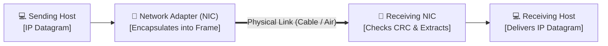

### บริการหลัก 6 ประการของ Data Link Layer:
1. **Framing:** ห่อหุ้ม Network-layer Datagram ด้วย Header (MAC Addresses, EtherType) และ Trailer (FCS) กลายเป็น **Link-layer Frame**
2. **Link Access (Media Access Control - MAC):** ควบคุมกฎการส่งเฟรมลงสู่ตัวกลาง โดยเฉพาะในช่องสัญญาณแบบใช้งานร่วมกัน (Shared Medium)
3. **Reliable Delivery (การส่งมอบที่เชื่อถือได้):** รับประกันความถูกต้องผ่านโปรโตคอล ACK/Retransmission นิยมใช้ในลิงก์ไร้สายที่มีอัตราข้อผิดพลาดสูง (Bit Error Rate สูง เช่น Wi-Fi) แต่มักไม่ใช้ในสาย Fiber หรือ UTP
4. **Flow Control:** ปรับสมดุลความเร็วในการส่งข้อมูลไม่ให้ผู้ส่งส่งเร็วเกินกว่าที่โหนดผู้รับจะรับไหว
5. **Error Detection (การตรวจจับข้อผิดพลาด):** ตรวจจับบิตข้อมูลที่ผิดเพี้ยนจากการลดทอนสัญญาณหรือสัญญาณรบกวน โดยใช้ Parity, Checksum หรือ CRC
6. **Error Correction (การแก้ไขข้อผิดพลาด):** ผู้รับสามารถระบุตำแหน่งและแก้ไขบิตที่ผิดพลาดได้เองโดยไม่ต้องส่งคำขอให้ส่งซ้ำ (Forward Error Correction - FEC)

> [!INFO]
> **Link Layer ถูกติดตั้งที่ใด? (Where is it implemented?):**
> Link Layer ส่วนใหญ่ถูกติดตั้งอยู่บน **Network Interface Controller (NIC) / Network Adapter** ในระดับฮาร์ดแวร์และเฟิร์มแวร์ โดยทำงานร่วมกับไดรเวอร์ (Device Driver) ในระบบปฏิบัติการของโฮสต์

---

# 2. เทคนิคการตรวจจับและแก้ไขข้อผิดพลาด (Error Detection & Correction: Parity, Checksum & CRC)

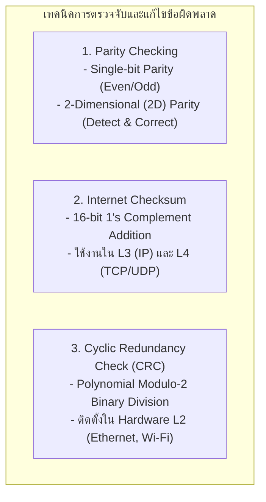

---

### 1. Parity Checking (การตรวจสอบด้วยบิตพาริตี):
- **Single-Bit Parity:** เติมบิตพาริตี 1 บิต เพื่อให้จำนวนเลข `1` ในข้อมูลเป็นเลขคู่ (Even Parity) หรือเลขคี่ (Odd Parity)
  - *ข้อจำกัด:* ตรวจจับข้อผิดพลาดได้เฉพาะกรณีที่บิตผิดพลาดเป็น **จำนวนคี่บิต (1, 3, 5 บิต)** หากบิตกลับข้างพร้อมกัน 2 บิต (Even-bit error) จะตรวจจับไม่ได้
- **Two-Dimensional (2D) Parity Matrix:** จัดข้อมูลเป็นตารางแถวและคอลัมน์ จากนั้นคำนวณ Parity ประจำแถวและประจำคอลัมน์
  - *ความสามารถ:* สามารถ **ตรวจจับและแก้ไขข้อผิดพลาด 1 บิตได้สมบูรณ์ (Single-bit Error Correction)** ณ จุดตัดของแถวและคอลัมน์ที่ Error และสามารถ **ตรวจจับข้อผิดพลาด 2 บิตได้ 100%**

```

   ข้อมูลเดิม (Data bits)        Row Parity
   [ 1   0   1   0   1 ]   --->   [ 1 ]
   [ 1   1   1   1   0 ]   --->   [ 0 ]
   [ 0   1   0   1   1 ]   --->   [ 1 ]
-----------------------------------------
   [ 0   0   0   0   0 ]   --->   [ 0 ]  <-- Column Parity

```

---

### 2. Cyclic Redundancy Check (CRC Polynomial Division Master Guide):

> [!DEFINITION]
> **CRC (Cyclic Redundancy Check):** การคำนวณบิตตรวจสอบ $R$ (ขนาด $r$ บิต) โดยใช้คณิตศาสตร์ **Modulo-2 Arithmetic (การหารพหุนามฐานสองโดยใช้ XOR โดยไม่มีการทดหรือขอยืม)**

#### หลักการทางคณิตศาสตร์:
กำหนดให้ข้อมูล $D$ มีขนาด $d$ บิต และ Generator Polynomial $G$ มีขนาด $r + 1$ บิต
$$\mathbf{(D \cdot 2^r) \text{ XOR } R = n \cdot G}$$
นั่นคือ $R = \text{เศษเหลือจากการหาร } (D \cdot 2^r) \text{ ด้วย } G$ (Remainder of $\frac{D \cdot 2^r}{G}$)

---

> [!EXAMPLE]
> **โจทย์คำนวณ CRC Step-by-Step:**
> - ข้อมูล $D = \mathbf{101110}$ ($d = 6$ bits)
> - Generator $G = \mathbf{1001}$ ($r+1 = 4$ bits $\implies r = 3$ bits)
> - จงคำนวณหาค่า CRC Code bits ($R$) และเฟรมข้อมูลที่จะส่งออกไปบนสาย ($D \cdot 2^r \text{ XOR } R$)

#### ขั้นตอนการคำนวณ:
1. เติมเลขศูนย์ $r = 3$ ตัว ต่อท้ายข้อมูล $D \implies D \cdot 2^3 = \mathbf{101110000}$
2. ตั้งหารยาวแบบ Binary Modulo-2 (ใช้การ XOR แทนการลบ):

```

             1 0 1 0 1 1  <-- Quotient
       ------------------
1 0 0 1 ) 1 0 1 1 1 0 0 0 0
          1 0 0 1
          -------
          0 0 1 0 1 0
              1 0 0 1
              -------
              0 0 1 1 0 0
                  1 0 0 1
                  -------
                  0 1 0 1 0
                    1 0 0 1
                    -------
                    0 0 1 1  <-- เศษเหลือ R (3 bits) = 011

```

3. **ผลลัพธ์:**
   - ค่าบิตตรวจสอบ $\mathbf{R = 011}$
   - เฟรมข้อมูลที่ส่งออกจริง: $D + R = \mathbf{101110011}$
4. **การตรวจสอบที่ฝั่งผู้รับ (Verification at Receiver):**
   - ผู้รับนำ $\mathbf{101110011}$ มาตั้งหารด้วย $G = \mathbf{1001}$
   - หากเศษเหลือเท่ากับ **`000`** $\implies$ แสดงว่าข้อมูลถูกต้องสมบูรณ์ 100%!

---

# 3. โปรโตคอลควบคุมการเข้าใช้ตัวกลาง (Multiple Access Protocols: Channel Partitioning, Random Access & Taking-Turns)

เมื่อโหนดหลายโหนดแชร์ช่องสัญญาณออกอากาศเดียวกัน (Broadcast Link) จะต้องมีกฎเพื่อป้องกัน **สัญญาณชนกัน (Collision)**

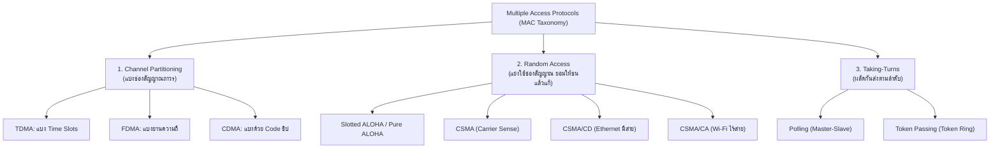

---

### ตารางเปรียบเทียบโปรโตคอล Random Access เชิงลึก:

| โปรโตคอล | กลไกการทำงาน | ประสิทธิภาพสูงสุด (Max Efficiency) | การตรวจจับการชน |
| :--- | :--- | :--- | :--- |
| **Pure ALOHA** | โหนดส่งเฟรมได้ทันทีที่ข้อมูลพร้อม หากชนจะรอสุ่มเวลาแล้วส่งใหม่ | **$1/(2e) \approx 18.4\%$** (Vulnerable window $= 2 \times t_{\text{frame}}$) | ไม่มี (รอ ACK) |
| **Slotted ALOHA** | แบ่งเวลาเป็น Slots เท่าๆ กัน โหนดส่งได้เฉพาะที่จุดเริ่มต้น Slot | **$1/e \approx 36.8\%$** (Vulnerable window $= 1 \times t_{\text{frame}}$) | ไม่มี (รอ ACK) |
| **CSMA** | "Listen before transmit" ฟังช่องสัญญาณก่อน หากว่างจึงส่ง | ขึ้นกับ Propagation Delay | ไม่มี |
| **CSMA/CD** | "Listen while transmitting" หากตรวจพบคลื่นชนกัน จะ **หยุดส่งทันที** แล้วส่ง Jam Signal | ใกล้เคียง **$100\%$** เมื่อสายสั้นและเฟรมใหญ่ | มีวงจรตรวจจับแรงดันไฟฟ้าชนกัน |

---

### กลไก CSMA/CD และสูตรคำนวณความยาวเฟรมขั้นต่ำ (Ethernet Minimum Frame Size):

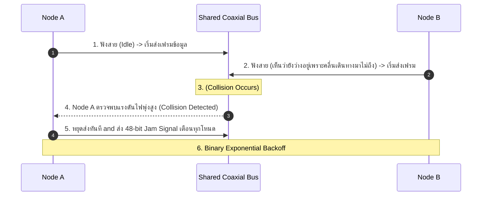

#### เงื่อนไขสำคัญของ CSMA/CD:
เวลาในการส่งข้อมูลของเฟรม ($t_{\text{trans}}$) ต้อง **มากกว่าหรือเท่ากับ 2 เท่าของเวลาเดินทางของสัญญาณไป-กลับ ($2 \times t_{\text{prop}}$)** เพื่อให้โหนดส่งยังคงส่งข้อมูลอยู่ขณะที่สัญญาณชนกันเดินทางกลับมาถึง:
$$t_{\text{trans}} \ge 2 \times t_{\text{prop}} \implies \frac{L_{\min}}{R} \ge 2 \times \frac{\text{Distance}}{v} \implies \mathbf{L_{\min} = 2 \times t_{\text{prop}} \times R}$$
- *ในอีเทอร์เน็ตดั้งเดิม (10 Mbps, ระยะสายไกลสุด 2.5 กม.):* $L_{\min} = 512\text{ bits} = \mathbf{64\text{ Bytes}}$

#### อัลกอริทึม Binary Exponential Backoff:
- หลังการชนครั้งที่ $n$ ($n \le 10$): โหนดจะสุ่มเลือกค่า $K$ จากเซต $\{0, 1, 2, \dots, 2^m - 1\}$ โดยที่ $m = \min(n, 10)$
- โหนดจะหน่วงเวลารอเป็นเวลา **$K \times 512\text{ Bit Times}$** ก่อนพยายามฟังสายและส่งใหม่อีกครั้ง (หากชนเกิน 16 ครั้งจะยกเลิกการส่งและแจ้ง Error)

---

# 4. การระบุตำแหน่งทางกายภาพและโปรโตคอล ARP (MAC Addressing & ARP Protocol)

### โครงสร้างของ MAC Address (48 Bits / 6 Bytes):
- เขียนในรูปเลขฐานสิบหก 6 คู่ คั่นด้วยโคลอนหรือขีด เช่น: `00:1A:2B:3C:4D:5E`
- **Organizationally Unique Identifier (OUI - 24 bits แรก):** ระบุรหัสบริษัทผู้ผลิตฮาร์ดแวร์ (กำหนดโดย IEEE)
- **NIC Specific (24 bits หลัง):** หมายเลขซีเรียลเฉพาะตัวของการ์ดแลน
- **Broadcast MAC Address:** `FF:FF:FF:FF:FF:FF` (ส่งถึงทุกโหนดใน LAN)

---

### การทำงานของโปรโตคอล ARP (Address Resolution Protocol - RFC 826):

> [!DEFINITION]
> **ARP:** โปรโตคอลที่ทำหน้าที่ค้นหาและจับคู่ระหว่าง **IP Address (Logical L3)** กับ **MAC Address (Physical L2)** ภายในเครือข่ายท้องถิ่นเดียวกัน

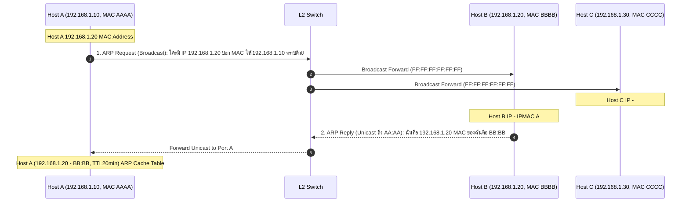

---

### การส่งแพ็กเก็ตข้ามซับเน็ต (Routing to Another Subnet Trace):

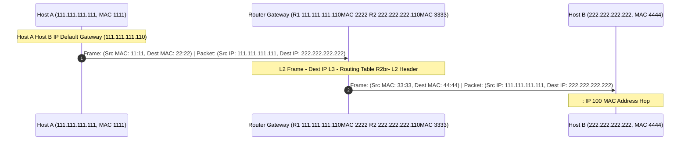

---

# 5. โครงสร้างเฟรมอีเทอร์เน็ตและมาตรฐาน IEEE 802.3 (Ethernet Architecture & Frame Format)

### โครงสร้าง Ethernet II Frame Layout:

```

+----------------+---------------+---------------+----------+--------------------+-------------+
| Preamble + SFD | Destination   | Source        | Type /   | Data Payload       | FCS / CRC   |
| (8 Bytes)      | MAC Address   | MAC Address   | Length   | (IP Datagram)      | (4 Bytes)   |
| 7B + 1B        | (6 Bytes)     | (6 Bytes)     | (2 Bytes)| (46 - 1,500 Bytes) | (CRC-32)    |

+----------------+---------------+---------------+----------+--------------------+-------------+

```

### หน้าที่ของแต่ละฟิลด์:
- **Preamble (7 Bytes - `10101010` ซ้ำกัน 7 ครั้ง) + SFD (1 Byte - `10101011`):** ซิงโครไนซ์สัญญาณนาฬิกา (Clock Synchronization) ระหว่างตัวรับและตัวส่ง
- **Destination & Source MAC Address (6 Bytes แต่ละฟิลด์):** หมายเลขแอดเดรสกายภาพของผู้รับและผู้ส่ง
- **Type / EtherType (2 Bytes):** ระบุโปรโตคอลชั้นบนที่บรรจุอยู่ใน Payload (เช่น `0x0800` = IPv4, `0x86DD` = IPv6, `0x0806` = ARP)
- **Data Payload (46 ถึง 1,500 Bytes):** ข้อมูลจาก Network Layer (ขนาดสูงสุดคือค่า **MTU = 1,500 Bytes**, ขนาดต่ำสุดคือ 46 Bytes หากข้อมูลสั้นกว่านี้จะเติม Padding ให้ครบ)
- **FCS (Frame Check Sequence - 4 Bytes):** ค่า CRC-32 สำหรับตรวจสอบความถูกต้องของเฟรม หากมีบิตผิดพลาด สวิตช์หรือโฮสต์จะดรอปเฟรมทิ้งทันที

---

# 6. การทำงานของ Ethernet Switch และกลไก Self-Learning (Switch Forwarding & Spanning Tree)

> [!DEFINITION]
> **Ethernet Switch (Layer 2 Switch):** อุปกรณ์สลับสัญญาณระดับ Data Link Layer ที่ส่งต่อเฟรมตามหมายเลข MAC Address มีคุณสมบัติเด่นคือ **Plug-and-Play**, แยก **Collision Domain** อิสระทุกพอร์ต (Full Duplex) และเรียนรู้ตำแหน่งโหนดได้เองอัตโนมัติ (Self-Learning)

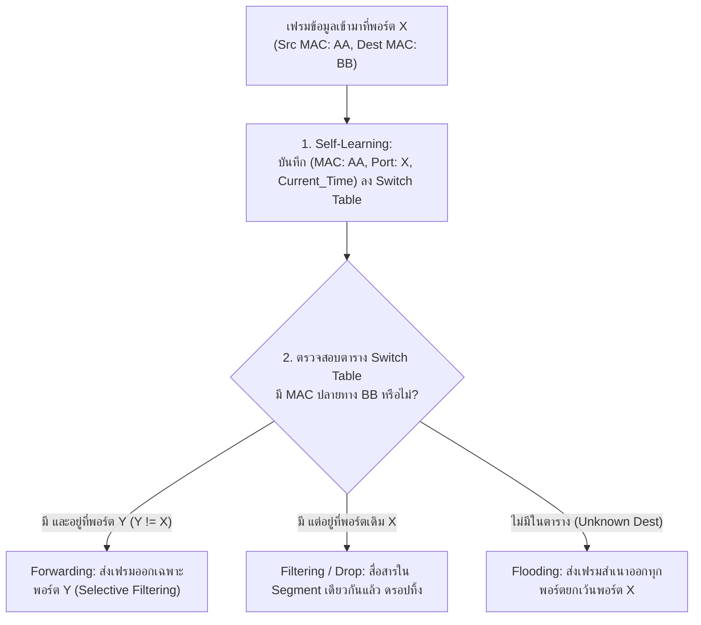

---

### ตารางสวิตช์ (Switch Forwarding Table Trace Table):

| MAC Address | Interface Port | Aging Timer (TTL) |
| :--- | :--- | :--- |
| `00:1A:2B:3C:4D:01` | **Port 1** | 300 seconds |
| `00:1A:2B:3C:4D:02` | **Port 2** | 285 seconds |
| `00:1A:2B:3C:4D:03` | **Port 3** | 299 seconds |

---

### การเปรียบเทียบอุปกรณ์เครือข่าย (Hub vs Switch vs Router):

| คุณลักษณะ | Hub (Repeater) | Layer 2 Switch | Router |
| :--- | :--- | :--- | :--- |
| **ทำงานใน Layer ใด** | Layer 1 (Physical) | Layer 2 (Data Link) | Layer 3 (Network) |
| **การใช้ Address** | ไม่มี (ขยายสัญญาณไฟฟ้าเท่านั้น) | ตรวจสอบ **MAC Address** | ตรวจสอบ **IP Address** |
| **การแบ่ง Collision Domain** | รวมเป็น 1 Collision Domain ใหญ่ | **แยก Collision Domain อิสระทุกพอร์ต** | แยก Collision Domain ทุกพอร์ต |
| **การแบ่ง Broadcast Domain**| รวมเป็น 1 Broadcast Domain | รวมเป็น 1 Broadcast Domain (ยกเว้นใช้ VLAN) | **ตัดแบ่ง Broadcast Domain 100%** |
| **ความเร็ว Throughput** | แย่งแบนด์วิดท์ร่วมกัน (Half Duplex) | Dedicated แบนด์วิดท์เต็มทุกพอร์ต (Full Duplex) | สวิตช์ตามการคำนวณ Routing Table |

---

# 7. เครือข่ายเสมือน VLAN และมาตรฐาน 802.1Q Tagging (VLANs, Trunking & Inter-VLAN Routing)

> [!DEFINITION]
> **VLAN (Virtual Local Area Network):** การแบ่งสวิตช์ทางกายภาพเครื่องเดียวให้กลายเป็นหลายเครือข่ายเสมือนเชิงตรรกะ เพื่อแยก **Broadcast Domain**, เพิ่มความปลอดภัย และจัดการแผนกต่างๆ ได้อย่างยืดหยุ่น

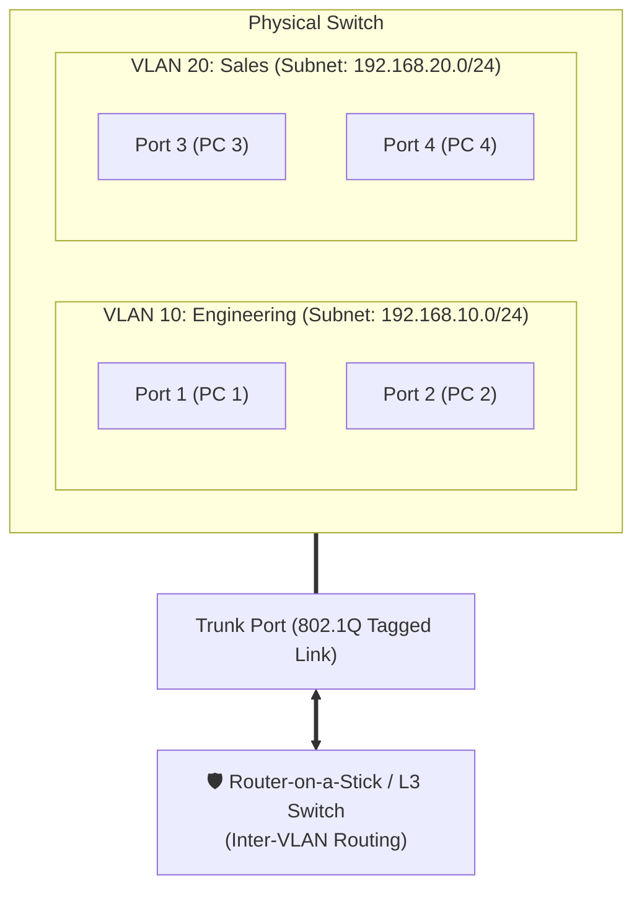

### โครงสร้าง 802.1Q VLAN Tag (ขนาด 4 Bytes):

```

+-------------+-------------+----------+---------------+
| TPID        | Priority    | DEI / CFI| VLAN ID (VID) |
| (0x8100)    | (3 bits)    | (1 bit)  | (12 bits)     |
| (2 Bytes)   | QoS CoS     | Drop     | 0 - 4,095     |

+-------------+-------------+----------+---------------+

```

- **VLAN ID (12 bits):** รองรับการสร้าง VLAN ได้สูงสุด $2^{12} = \mathbf{4,096\text{ VLANs}}$
- **Access Port:** พอร์ตสำหรับต่อ End-user จะส่งเฉพาะ **Untagged Frame** ปกติ
- **Trunk Port:** ลิงก์ความเร็วสูงที่เชื่อมระหว่างสวิตช์กับสวิตช์ หรือสวิตช์กับเร้าเตอร์ โดยเฟรมจะถูกแปะ **802.1Q Tag (Tagged Frame)** เพื่อระบุว่าเฟรมนั้นเป็นของ VLAN ใด

---

# 8. เครือข่ายไร้สาย Wi-Fi (IEEE 802.11 Architecture, Channels & Frame Format)

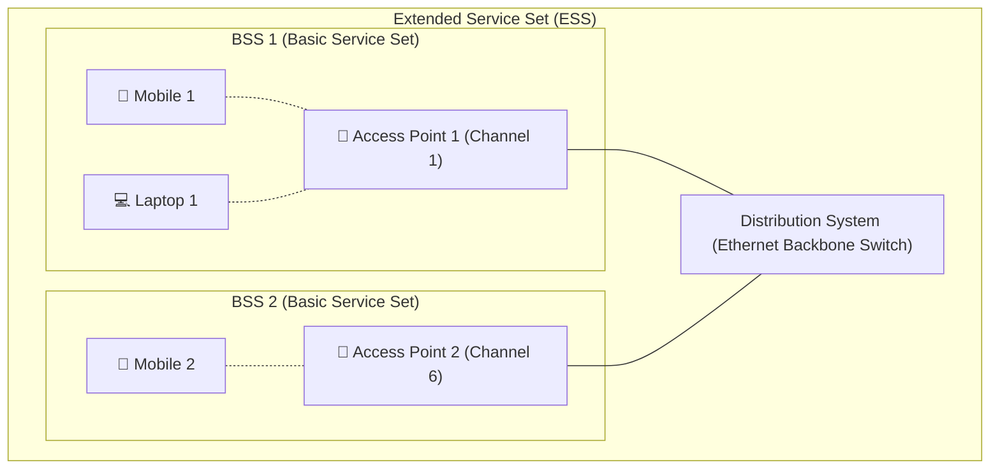

### ย่านความถี่และแชนเนลที่ไม่ทับซ้อน (2.4 GHz vs 5 GHz vs 6 GHz):
- **ย่าน 2.4 GHz:** มี 11–14 แชนเนล โดยมีเพียง **3 แชนเนลที่ไม่ทับซ้อนกันเลย (Non-Overlapping Channels): ช่อง 1, ช่อง 6, และช่อง 11** (ห่างกันช่องละ 25 MHz)
- **ย่าน 5 GHz:** มีแชนเนลกว้างกว่ามาก (20/40/80/160 MHz) สัญญาณรบกวนต่ำ แบนด์วิดท์สูง
- **ย่าน 6 GHz (Wi-Fi 6E / Wi-Fi 7):** เพิ่มช่องสัญญาณใหม่อีก 1,200 MHz รองรับความเร็วระดับ Multi-Gigabit

---

### โครงสร้าง 802.11 Frame (ประกอบด้วย 4 Address Fields):

```

+---------------+----------+-----------+-----------+-----------+-----------+---------------+----------+
| Frame Control | Duration | Address 1 | Address 2 | Address 3 | Sequence  | Address 4     | Data     |
| (2 Bytes)     | (2 Bytes)| (6 Bytes) | (6 Bytes) | (6 Bytes) | (2 Bytes) | (6 Bytes-Mesh)| Payload  |

+---------------+----------+-----------+-----------+-----------+-----------+---------------+----------+

```

| Address Field | หน้าที่และความหมาย | ตัวอย่างการใช้งานจริง |
| :--- | :--- | :--- |
| **Address 1** | **Receiver Address (RA):** MAC ของอุปกรณ์ไร้สายที่รับเฟรมนี้โดยตรง | MAC ของ Access Point (เมื่อส่งขึ้น) หรือ MAC ของเครื่องลูกข่าย (เมื่อส่งลง) |
| **Address 2** | **Transmitter Address (TA):** MAC ของอุปกรณ์ไร้สายที่ส่งเฟรมนี้ | MAC ของเครื่องลูกข่าย (เมื่อส่งขึ้น) หรือ MAC ของ Access Point (เมื่อส่งลง) |
| **Address 3** | **Destination / Source MAC (DA/SA):** MAC ของเร้าเตอร์เกตเวย์หรือโฮสต์ปลายทางในสาย LAN | MAC ของ Router Interface ที่ต่ออยู่หลัง AP |
| **Address 4** | ใช้เฉพาะในโหมดเชื่อมต่อระหว่าง AP ไร้สายด้วยกัน (WDS / Wireless Mesh Bridge) | MAC ของต้นทางดั้งเดิมในโหมด AP-to-AP Bridging |

---

# 9. กลไก CSMA/CA, ปัญหา Hidden Terminal และการทำ RTS/CTS Handshake

> [!WARNING]
> **ทำไมระบบ Wi-Fi จึงใช้ Collision Detection (CSMA/CD) แบบมีสายไม่ได้?**
> 1. **Signal Fading:** สัญญาณที่ส่งออกจากเสาอากาศของตนเองมีความแรงสูงมากจนบดบังสัญญาณที่รับเข้ามา ทำให้ภาครับไม่สามารถตรวจจับการชนกันของคลื่นที่แผ่วเบาได้
> 2. **Hidden Terminal Problem:** โหนดสองโหนดอาจอยู่นอกรัศมีสัญญาณของกันและกัน จึงไม่ได้ยินสัญญาณของกัน แต่ทั้งคู่อยู่ในรัศมีของ Access Point เดียวกัน ทำให้คลื่นไปชนกันที่ตัว AP

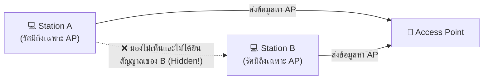

---

### ลำดับเวลาการทำงานของ CSMA/CA พร้อมกลไก RTS/CTS:

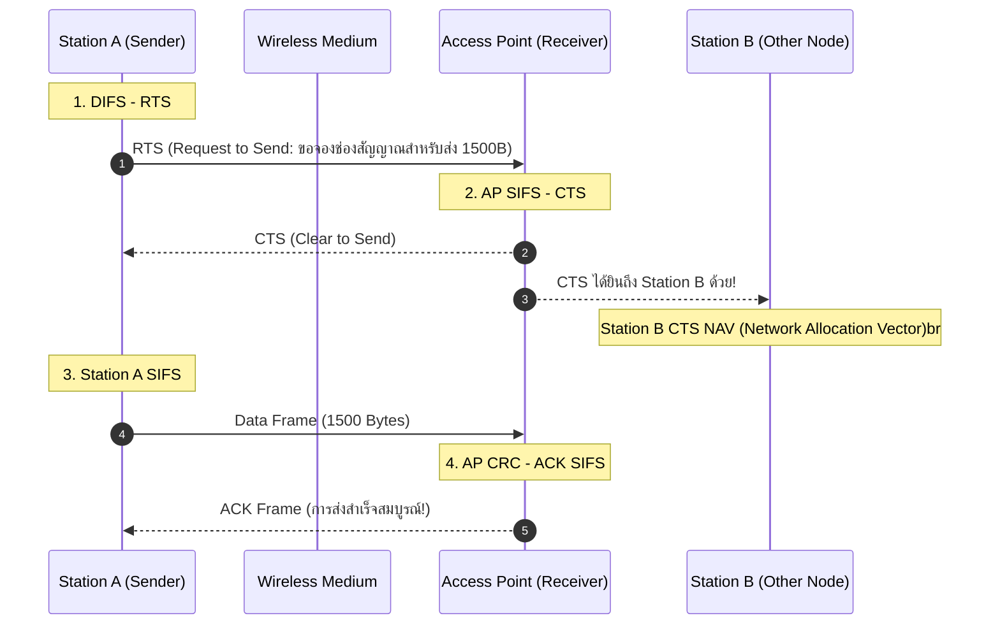

### ช่วงเวลาหยุดพักระหว่างเฟรม (Inter-Frame Spaces):
- **SIFS (Short Inter-Frame Space):** ช่วงเวลาที่สั้นที่สุด ใช้สำหรับเฟรมที่มีความสำคัญสูงสุด เช่น `ACK`, `CTS`
- **DIFS (DCF Inter-Frame Space):** ช่วงเวลามาตรฐานที่โหนดต้องรอฟังคลื่นว่างก่อนเริ่มนับถอยหลัง Backoff เพื่อส่งข้อมูลทั่วไป

---

# 10. เครือข่ายส่วนบุคคลไร้สาย: Bluetooth & BLE (IEEE 802.15.1 Architecture)

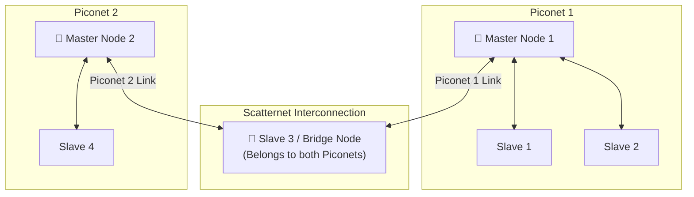

### คุณลักษณะสำคัญของ Bluetooth:
- **ย่านความถี่:** 2.4 GHz ISM Band โดยใช้เทคโนโลยี **Frequency Hopping Spread Spectrum (FHSS)** สลับความถี่ 1,600 ครั้งต่อวินาที ข้าม 79 ช่องสัญญาณย่อย เพื่อหลบหลีกสัญญาณรบกวน Wi-Fi
- **Piconet:** ประกอบด้วย **Master 1 ตัว** และรองรับ **Active Slaves ได้สูงสุด 7 ตัว** (และรองรับ Parked Slaves ในโหมดหลับได้ถึง 255 ตัว)
- **Bluetooth Low Energy (BLE / Bluetooth Smart):** ออกแบบสำหรับอุปกรณ์ IoT สวมใส่ ใช้พลังงานต่ำมาก ทำงานบน 40 ช่องสัญญาณ (ช่องโฆษณา Advertising Channels 37, 38, 39)

---

# 11. เครือข่ายเซลลูลาร์และการจัดการความคล่องตัว (Cellular Networks 4G/5G & Mobility Management)

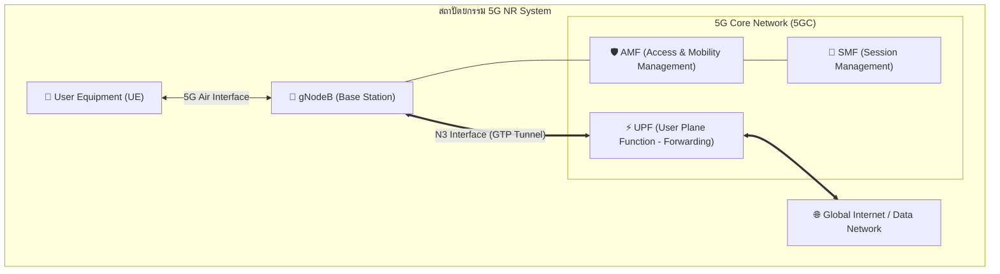

---

### กลไกการจัดการความคล่องตัวใน Mobile IP (Mobility Management Principles):

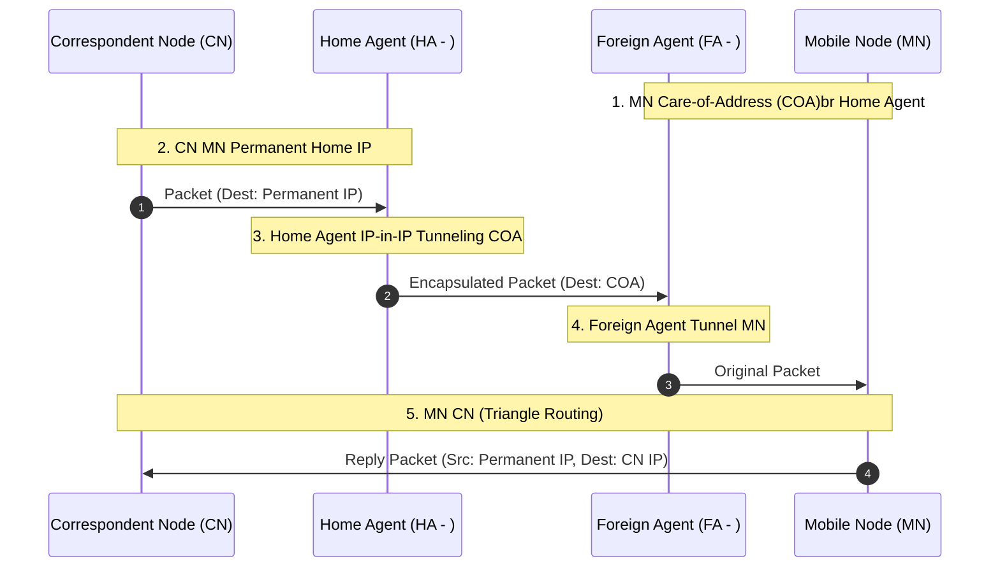

---

## เอกสารเชื่อมโยงที่เกี่ยวข้อง (Cross-References)
- [[Lecture 5 - Network Layer, Routing, and IP Addressing]] — สรุป Network Layer, IPv4/IPv6, Subnetting, VLSM
- [[Calculations and Trace Workbook]] — แบบฝึกหัดคำนวณ CRC Modulo-2, CSMA/CD Minimum Frame Size, และ Backoff Delay
- [[Interactive Lab Guide - Chapter 1 Network Fundamentals]] — บทเรียนจำลองโทโปโลยีและสื่อกลางนำสัญญาณ
- [[Computer Network and Internet Master Index]] — ดัชนีรวมสารบัญวิชาเครือข่ายคอมพิวเตอร์
