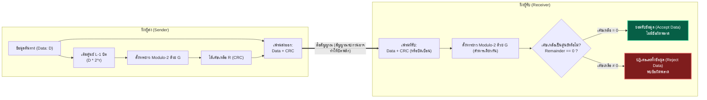
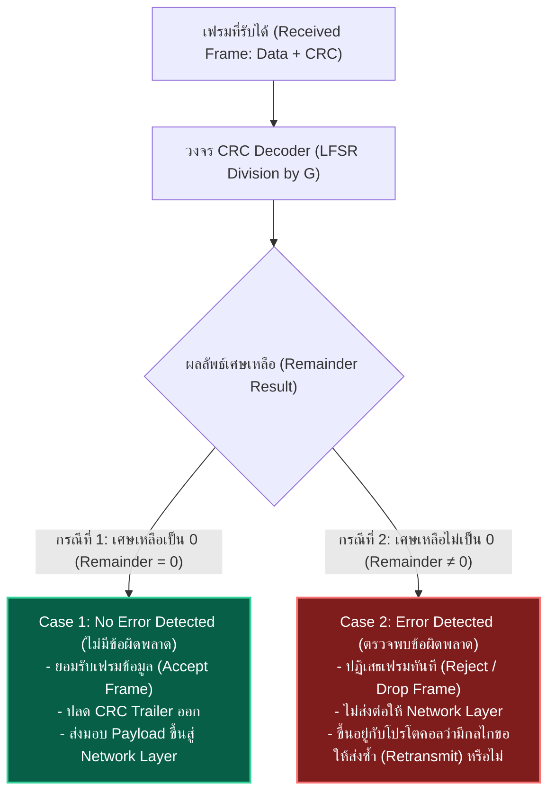

---
tags:
  - networking
  - lecture
  - crc
  - error-detection
  - polynomial-division
  - link-layer
  - quiz-solutions
  - v9-current
created: 2026-09-21
updated: 2026-09-21
curriculum: Current Year Course (Chapter 6 CRC Handout & Quiz Slides 1–14)
type: special-guide
---

# Lecture 6 Special Topic: Cyclic Redundancy Check (CRC) — Complete Departmental Guide & Solved Quizzes

> [!SUMMARY]
> **เอกสารคู่มือเจาะลึกพิเศษ: Cyclic Redundancy Check (CRC) Methods (สไลด์ภาควิชา 1–14 หน้าสมบูรณ์ 100%)**
> รวบรวม เรียบเรียง และวิเคราะห์เนื้อหาอย่างละเอียดลึกซึ้งจากสไลด์การสอนเฉพาะเรื่อง `Chapter_6_Datalink_layer-CRC.pdf` ของภาควิชา ครอบคลุม:
> 1. พื้นฐานและบทบาทของ CRC ในโครงสร้างเฟรมระดับ Link Layer
> 2. พีชคณิตมอดุโล-2 (Modulo-2 Arithmetic) และตรรกะ XOR
> 3. ขั้นตอนวิธีคำนวณ CRC 5 ขั้นตอน (5-Step Algorithm)
> 4. ตัวอย่างการคำนวณหารยาวพหุนามทั้งฝั่งส่ง (Sender) และฝั่งรับ (Receiver Verification)
> 5. พหุนามตัวหาร (Divisor Polynomial) และคุณสมบัติในอุดมคติ 3 ประการ (Ideal Properties)
> 6. เฉลยโจทย์ Quiz ท้ายบทเรียนทั้ง 4 ข้อ พร้อมแสดงวิธีทำหารยาว Modulo-2 อย่างละเอียดทุกขั้นตอน
> 7. โครงสร้างวงจรฮาร์ดแวร์ CRC Encoder/Decoder (Linear Feedback Shift Registers: LFSR) และมาตรฐานสากล

---

## 📑 สารบัญสไลด์บรรยาย CRC ภาควิชา (Slides 1–14)

- [[#Slide 1: Detection Methods (บทนำการตรวจจับข้อผิดพลาด)|สไลด์ที่ 1: Detection Methods (บทนำการตรวจจับข้อผิดพลาด)]]
- [[#Slide 2: Cyclic Redundancy Check (CRC) Methods & Frame Placement|สไลด์ที่ 2: Cyclic Redundancy Check (CRC) Methods & Frame Placement]]
- [[#Slide 3: Key Elements of CRC (4 องค์ประกอบสำคัญของ CRC)|สไลด์ที่ 3: Key Elements of CRC (4 องค์ประกอบสำคัญของ CRC)]]
- [[#Slide 4: XORing of Two Single Bits or Two Words (การดำเนินการ XOR)|สไลด์ที่ 4: XORing of Two Single Bits or Two Words (การดำเนินการ XOR)]]
- [[#Slide 5: How CRC Works: Sender vs. Receiver (กลไกการทำงานของ CRC)|สไลด์ที่ 5: How CRC Works: Sender vs. Receiver (กลไกการทำงานของ CRC)]]
- [[#Slide 6: CRC Calculation: 5-Step Algorithm (ขั้นตอนวิธีคำนวณ CRC 5 ขั้นตอน)|สไลด์ที่ 6: CRC Calculation: 5-Step Algorithm (ขั้นตอนวิธีคำนวณ CRC 5 ขั้นตอน)]]
- [[#Slide 7: Example 1: CRC Calculation (Sender) — Data 100100, Divisor 1101|สไลด์ที่ 7: Example 1: CRC Calculation (Sender) — Data 100100, Divisor 1101]]
- [[#Slide 8: Example 1: CRC Verification (Receiver) — Data+CRC 100100001|สไลด์ที่ 8: Example 1: CRC Verification (Receiver) — Data+CRC 100100001]]
- [[#Slide 9: Divisor Polynomial & 3 Ideal Properties (พหุนามตัวหารและคุณสมบัติในอุดมคติ)|สไลด์ที่ 9: Divisor Polynomial & 3 Ideal Properties (พหุนามตัวหารและคุณสมบัติในอุดมคติ)]]
- [[#Slide 10: Example 2: CRC Calculation — Data 11001001, Divisor x^3+1|สไลด์ที่ 10: Example 2: CRC Calculation — Data 11001001, Divisor x^3+1]]
- [[#Slide 11: CRC Summary & Real-World Applications (การประยุกต์ใช้งานจริง)|สไลด์ที่ 11: CRC Summary & Real-World Applications (การประยุกต์ใช้งานจริง)]]
- [[#Slide 12: Department Quiz: 4 Calculation Problems (เฉลยข้อสอบ Quiz ครบทั้ง 4 ข้อ)|สไลด์ที่ 12: Department Quiz: 4 Calculation Problems (เฉลยข้อสอบ Quiz ครบทั้ง 4 ข้อ)]]
- [[#Slide 13: CRC Encoder and Decoder Hardware Circuit (วงจรฮาร์ดแวร์ CRC)|สไลด์ที่ 13: CRC Encoder and Decoder Hardware Circuit (วงจรฮาร์ดแวร์ CRC)]]
- [[#Slide 14: Division in the CRC Decoder for Two Cases (การตัดสินใจของผู้รับ 2 กรณี)|สไลด์ที่ 14: Division in the CRC Decoder for Two Cases (การตัดสินใจของผู้รับ 2 กรณี)]]

---

## Slide 1: Detection Methods (บทนำการตรวจจับข้อผิดพลาด)

> [!NOTE] **สไลด์ที่ 1 จาก 14 สไลด์ (CRC Slide 1 of 14)**
> **รหัสวิชา:** 60223124 Data Communication and Computer Networks

ในระบบการสื่อสารข้อมูลดิจิทัล สัญญาณที่ถูกส่งผ่านตัวกลางทางกายภาพ (Physical Media) เช่น สายทองแดงคู่บิดเกลียว, สายโคแอกเชียล, สายใยแก้วนำแสง หรือคลื่นวิทยุไร้สาย ล้วนต้องเผชิญกับ **สัญญาณรบกวน (Noise)**, **การลดทอน (Attenuation)** และ **การบิดเบือนของสัญญาณ (Distortion)** ซึ่งส่งผลให้ข้อมูลบิต `0` อาจพลิกเป็น `1` หรือ `1` พลิกเป็น `0`

วิธีการตรวจจับข้อผิดพลาด (Error Detection Methods) จึงถูกพัฒนาขึ้นในระดับ Data Link Layer เพื่อให้ผู้รับสามารถตรวจสอบความถูกต้องของข้อมูลที่ส่งมาได้อย่างแม่นยำ

---

## Slide 2: Cyclic Redundancy Check (CRC) Methods & Frame Placement

> [!NOTE] **สไลด์ที่ 2 จาก 14 สไลด์ (CRC Slide 2 of 14)**

- **คุณสมบัติเด่นของ CRC:**
  - เป็นรหัสตรวจจับข้อผิดพลาดที่มีประสิทธิภาพสูงกว่า Single Parity, 2D Parity และ Checksum อย่างมีนัยสำคัญ (**More powerful error-detection coding**)
  - เป็นวิธีที่นิยมใช้งานแพร่หลายที่สุดในเครือข่ายดิจิทัล (Digital Networks) และอุปกรณ์บันทึกข้อมูล (Storage Devices)
  - **สร้างและประมวลผลได้ง่ายในระดับวงจรฮาร์ดแวร์ (Simple to implement in hardware using shift registers) และมีประสิทธิภาพสูงมาก (Highly effective)**

### ตำแหน่งของ CRC ในโครงสร้างเฟรมอีเทอร์เน็ต (Ethernet Frame Layout)

```text
+----------+---------------+----------------+----------------+----------------+---------+
| Preamble | Dest. Address | Source Address | Type / Length  | Data (Payload) |   CRC   |
| 8 Bytes  |    6 Bytes    |    6 Bytes     |    2 Bytes     | 46 - 1500 B    | 4 Bytes |
+----------+---------------+----------------+----------------+----------------+---------+
                                                                               ^
                                                                               |
                                       CRC ถูกต่อท้ายเฟรมในส่วน Trailer (FCS) ---+
```

---

## Slide 3: Key Elements of CRC (4 องค์ประกอบสำคัญของ CRC)

> [!NOTE] **สไลด์ที่ 3 จาก 14 สไลด์ (CRC Slide 3 of 14)**

การทำงานของ CRC ประกอบด้วย 4 องค์ประกอบสำคัญ:

1. **Data Block (Message / D):** บล็อกข้อมูลจริงในรูปเลขฐานสอง (The actual data in binary) ขนาด $k$ หรือ $d$ บิต
2. **Predefined Divisor (Generator Polynomial / G):** พหุนามตัวหารที่ถูกกำหนดไว้ล่วงหน้า เป็นข้อตกลงร่วมกันระหว่างผู้ส่งและผู้รับตามมาตรฐานโปรโตคอล (**Mutually agreed upon / Predefined**)
3. **Remainder (R):** เศษเหลือที่ได้จากการตั้งหารยาวแบบมอดุโล-2 ระหว่างบล็อกข้อมูล (ที่เติมเลขศูนย์แล้ว) ด้วยตัวหาร $G$
4. **CRC Code (Checksum):** ค่าเศษเหลือ $R$ ที่ถูกนำไปต่อท้ายข้อมูลเดิม ($D$) เพื่อส่งออกไปยังผู้รับสำหรับใช้ตรวจจับข้อผิดพลาด

---

## Slide 4: XORing of Two Single Bits or Two Words (การดำเนินการ XOR)

> [!NOTE] **สไลด์ที่ 4 จาก 14 สไลด์ (CRC Slide 4 of 14)**

CRC ใช้การคำนวณบนระบบคณิตศาสตร์ **Modulo-2 Arithmetic** ซึ่งใช้การบวกและการลบที่ไม่มีตัวทด (No Carry) และไม่มีการยืม (No Borrow) ซึ่งเทียบเท่ากับการทำลอจิก **Exclusive-OR (XOR)** โดยสมบูรณ์:

### ตารางความจริง XOR สำหรับบิตเดี่ยว (Single Bit XOR)
| Bit A | Bit B | $A \oplus B$ (Output) | กฎการจำ |
| :---: | :---: | :---: | :--- |
| `0` | `0` | `0` | บิตเหมือนกันได้ `0` |
| `0` | `1` | `1` | บิตต่างกันได้ `1` |
| `1` | `0` | `1` | บิตต่างกันได้ `1` |
| `1` | `1` | `0` | บิตเหมือนกันได้ `0` |

### ตัวอย่างการ XOR ระหว่างคำข้อมูล (XORing of Two Words)
```text
  Word A:    1 0 1 1 0 1 0 0
  Word B:    1 1 0 1 0 0 1 1  (XOR)
  --------------------------
  Output:    0 1 1 0 0 1 1 1
```

---

## Slide 5: How CRC Works: Sender vs. Receiver (กลไกการทำงานของ CRC)

> [!NOTE] **สไลด์ที่ 5 จาก 14 สไลด์ (CRC Slide 5 of 14)**



---

## Slide 6: CRC Calculation: 5-Step Algorithm (ขั้นตอนวิธีคำนวณ CRC 5 ขั้นตอน)

> [!NOTE] **สไลด์ที่ 6 จาก 14 สไลด์ (CRC Slide 6 of 14)**

ขั้นตอนการคำนวณ CRC ที่ฝั่งผู้ส่งมี 5 ขั้นตอนมาตรฐานดังนี้:

1. **แปลงข้อมูลให้อยู่ในรูปเลขฐานสอง (Convert Data to Binary: D):** กำหนดขนาดของข้อมูลเท่ากับ $k$ บิต
2. **หาความยาว $L$ ของตัวหาร (Find Length $L$ of Divisor G):** โดย $L$ คือจำนวนบิตของพหุนามตัวหาร $G$ (ดีกรีของพหุนาม $r = L - 1$)
3. **เติมเลขศูนย์จำนวน $L-1$ บิต ต่อท้ายข้อมูล $D$ (Append $L-1$ zeros to D):** เพื่อสร้างเงินต้นสำหรับการหาร ($D \cdot 2^{L-1}$)
4. **ดำเนินการหารยาวแบบเลขฐานสอง (Binary Modulo-2 Division) โดยใช้ XOR:** นำ $D \cdot 2^{L-1}$ ตั้งแล้วหารด้วย $G$ จะได้ผลหาร (Quotient) และเศษเหลือ (Remainder)
5. **เศษเหลือที่ได้คือค่า CRC (Remainder = CRC):** นำเศษเหลือขนาด $L-1$ บิต ไปต่อท้ายข้อมูลเดิม $D$ เพื่อสร้างเฟรมส่งออก **(Data + CRC)**

> [!WARNING] **ข้อควรระวังสำคัญ:**
> ขนาดของ CRC **ต้องมีความยาวเท่ากับ $L - 1$ บิตเสมอ** หากคำนวณได้เศษที่มีบิตนำหน้าเป็น `0` ห้ามตัดบิตศูนย์ทิ้งเด็ดขาด (เช่น หาก $L=4$, ค่าเศษเหลือต้องมี 3 บิต ถ้าคำนวณได้ `1` ต้องเขียนเป็น `001`)

---

## Slide 7: Example 1: CRC Calculation (Sender) — Data 100100, Divisor 1101

> [!NOTE] **สไลด์ที่ 7 จาก 14 สไลด์ (CRC Slide 7 of 14)**

### โจทย์ตัวอย่างที่ 1:
กำหนดให้ข้อมูล $D = \mathbf{100100}$ และตัวหาร $G = \mathbf{1101}$ จงคำนวณหาค่า CRC และเฟรมข้อมูลที่ส่งออกจริง

### วิธีทำ:
1. ข้อมูล $D = 100100$ (ความยาว 6 บิต)
2. ตัวหาร $G = 1101$ มีความยาว $L = 4$ บิต $\implies$ ต้องเติมศูนย์ $L - 1 = 3$ บิต
3. เติมศูนย์ 3 บิตต่อท้าย $D$: $D \cdot 2^3 = \mathbf{100100000}$
4. ตั้งหารยาว Modulo-2 ด้วย $G = 1101$:

```text
               1 1 0 1 0 1   <-- ผลหาร (Quotient)
         -----------------
1 1 0 1 ) 1 0 0 1 0 0 0 0 0
        ^ 1 1 0 1
          -------
          0 1 0 0 0
          ^ 1 1 0 1
            -------
            0 1 0 1 0
            ^ 0 0 0 0
              -------
              1 0 1 0 0
            ^ 1 1 0 1
              -------
              0 1 1 1 0
              ^ 0 0 0 0
                -------
                1 1 1 0 0
              ^ 1 1 0 1
                -------
                0 0 1 1 0
                ^   1 1 0 1
                    -------
                    0 0 0 1   <-- เศษเหลือ (Remainder ขนาด 3 บิต = 001)
```

5. ได้เศษเหลือ $\mathbf{R = 001}$
- **คำตอบ:**
  - $	ext{CRC} = \mathbf{001}$
  - $	ext{Data + CRC} = \mathbf{100100001}$

---

## Slide 8: Example 1: CRC Verification (Receiver) — Data+CRC 100100001

> [!NOTE] **สไลด์ที่ 8 จาก 14 สไลด์ (CRC Slide 8 of 14)**

### การตรวจสอบที่ฝั่งผู้รับ (Receiver Verification):
ผู้รับได้รับเฟรม $\mathbf{100100001}$ และใช้ตัวหารเดียวกันคือ $G = \mathbf{1101}$

### การตั้งหารยาวที่ฝั่งรับ:
```text
               1 1 0 1 0 1   <-- ผลหาร
         -----------------
1 1 0 1 ) 1 0 0 1 0 0 0 0 1
        ^ 1 1 0 1
          -------
          0 1 0 0 0
          ^ 1 1 0 1
            -------
            0 1 0 1 0
            ^ 0 0 0 0
              -------
              1 0 1 0 0
            ^ 1 1 0 1
              -------
              0 1 1 1 0
              ^ 0 0 0 0
                -------
                1 1 1 0 1
              ^ 1 1 0 1
                -------
                0 0 1 1 1
                ^   1 1 0 1
                    -------
                    0 0 0 0   <-- เศษเหลือเป็น 0 (Remainder = 000)
```

- **ผลลัพธ์:** $	ext{Remainder} = \mathbf{000}$
- **การตัดสินใจ:** ผู้รับ **ยอมรับข้อมูล (Accept Data)** เนื่องจากไม่มีเศษเหลือ แสดงว่าข้อมูลถูกต้องสมบูรณ์ 100%

---

## Slide 9: Divisor Polynomial & 3 Ideal Properties (พหุนามตัวหารและคุณสมบัติในอุดมคติ)

> [!NOTE] **สไลด์ที่ 9 จาก 14 สไลด์ (CRC Slide 9 of 14)**

### การแทนตัวหารด้วยพหุนาม (Polynomial Representation):
ในทางคณิตศาสตร์และวิศวกรรมคอมพิวเตอร์ นิยมแทนลำดับบิตของตัวหารด้วยพหุนาม $G(x)$ โดยเลขชี้กำลังของ $x$ จะสอดคล้องกับตำแหน่งของบิต:
$$G(x) = g_r x^r + g_{r-1} x^{r-1} + \dots + g_1 x^1 + g_0$$
- ตัวอย่าง: $x^3 + x + 1$
  - มีเทอม $x^3$ (บิต 1), เทอม $x^2$ ไม่มี (บิต 0), เทอม $x^1$ (บิต 1), เทอม $x^0 = 1$ (บิต 1)
  - แทนค่าเป็นเลขฐานสองได้: $\mathbf{1011_2}$

### คุณสมบัติในอุดมคติ 3 ประการของพหุนามตัวหาร (Ideal Properties of CRC Divisor):
1. **ต้องหารด้วย $x$ ไม่ลงตัว (Must NOT be divisible by $x$):**
   - หมายความว่าสัมประสิทธิ์ $g_0$ (เทอมคงที่) ต้องมีค่าเป็น `1` เสมอ
   - **ประโยชน์:** รับประกันว่าจะตรวจจับข้อผิดพลาดที่เกิดขึ้นในบิตแรกสุดของข้อมูลได้เสมอ (**Ensures detection of errors in the first bit**)
2. **ต้องหารด้วย $x + 1$ ลงตัว (Must be divisible by $x + 1$):**
   - **ประโยชน์:** รับประกันว่าจะตรวจจับข้อผิดพลาดที่มีจำนวนบิตผิดเป็นเลขคี่ (Odd number of bit errors) ได้ทั้งหมด 100% (**Ensures detection of all odd-bit errors**)
3. **สามารถตรวจจับข้อผิดพลาดแบบกลุ่ม (Burst Errors) ได้อย่างสมบูรณ์:**
   - สามารถตรวจจับ Burst Error ที่มีความยาวน้อยกว่าหรือเท่ากับดีกรีของพหุนาม ($\le r$) ได้ 100%

---

## Slide 10: Example 2: CRC Calculation — Data 11001001, Divisor x^3+1

> [!NOTE] **สไลด์ที่ 10 จาก 14 สไลด์ (CRC Slide 10 of 14)**

### โจทย์ตัวอย่างที่ 2:
จงคำนวณหาค่า CRC สำหรับข้อมูล $D = \mathbf{11001001}$ โดยใช้พหุนามตัวหาร $G(x) = x^3 + 1$

### วิธีทำ:
1. แปลงพหุนามตัวหารเป็นเลขฐานสอง:
   $$G(x) = 1 \cdot x^3 + 0 \cdot x^2 + 0 \cdot x^1 + 1 \cdot x^0 \implies G = \mathbf{1001_2}$$
   - ความยาวตัวหาร $L = 4$ บิต (ดีกรี $r = 3$)
2. เติมศูนย์ $L - 1 = 3$ บิต ต่อท้ายข้อมูล $D$:
   $$D \cdot 2^3 = \mathbf{11001001000}$$
3. ตั้งหารยาว Modulo-2:

```text
                 1 1 0 1 1 0 1 1   <-- ผลหาร
           ---------------------
1 0 0 1  )  1 1 0 0 1 0 0 1 0 0 0
         ^  1 0 0 1
            -------
            0 1 0 1 1
            ^ 1 0 0 1
              -------
              0 0 1 0 0
              ^ 0 0 0 0
                -------
                0 1 0 0 1
                ^ 1 0 0 1
                  -------
                  0 0 0 0 0
                  ^ 0 0 0 0
                    -------
                    0 0 0 1 0
                    ^ 0 0 0 0
                      -------
                      0 0 1 0 0
                      ^ 0 0 0 0
                        -------
                        0 1 0 0 0
                        ^ 1 0 0 1
                          -------
                          0 0 0 1 1   <-- เศษเหลือ (Remainder = 011)
```

4. ได้เศษเหลือ $\mathbf{R = 011}$
- **คำตอบ:**
  - $	ext{CRC} = \mathbf{011}$
  - $	ext{Data + CRC} = \mathbf{11001001011}$

---

## Slide 11: CRC Summary & Real-World Applications (การประยุกต์ใช้งานจริง)

> [!NOTE] **สไลด์ที่ 11 จาก 14 สไลด์ (CRC Slide 11 of 14)**

มาตรฐานสากลในโลกแห่งความเป็นจริงที่นำ CRC ไปประยุกต์ใช้งาน:

| ขอบเขตการประยุกต์ใช้งาน | เทคโนโลยี / มาตรฐาน | พหุนาม CRC ที่ใช้งาน | ขนาดบิต CRC |
| :--- | :--- | :--- | :---: |
| **เครือข่าย LAN/WLAN** | IEEE 802.3 Ethernet, IEEE 802.11 Wi-Fi | **CRC-32 (IEEE 802.3)** | 32 บิต |
| **การจัดเก็บข้อมูลดิจิทัล** | ฮาร์ดไดรฟ์ (SATA/NVMe), ไฟล์บีบอัด ZIP, PNG | **CRC-32** | 32 บิต |
| **พอร์ตเชื่อมต่อคอมพิวเตอร์** | USB (Universal Serial Bus) | **CRC-5** (Token), **CRC-16** (Data) | 5 / 16 บิต |
| **ระบบยานยนต์ (Automotive)** | CAN bus (Controller Area Network) | **CRC-15**, **CRC-21** | 15 / 21 บิต |
| **การสื่อสารระยะไกล (WAN)** | HDLC, PPP (Point-to-Point Protocol) | **CRC-CCITT (CRC-16)** | 16 บิต |
| **โทรคมนาคมเคลื่อนที่** | 4G LTE, 5G NR Control Channels | **CRC-24a, CRC-24b, CRC-24c** | 24 บิต |

---

## Slide 12: Department Quiz: 4 Calculation Problems (เฉลยข้อสอบ Quiz ครบทั้ง 4 ข้อ)

> [!NOTE] **สไลด์ที่ 12 จาก 14 สไลด์ (CRC Slide 12 of 14)**
> **รวบรวมโจทย์ข้อสอบ Quiz การคำนวณ CRC ประจำภาควิชาครบทั้ง 4 ข้อ พร้อมเฉลยวิธีทำทั้งฝั่งส่งและฝั่งรับอย่างละเอียดสมบูรณ์แบบ**

---

### 📝 โจทย์ข้อที่ 1:
**จงหาค่า CRC สำหรับข้อมูล $D = 11001001$ ด้วยตัวหาร $G(x) = x^3 + 1$**

#### วิธีทำ (ฝั่งผู้ส่ง):
- $D = 11001001$
- $G(x) = x^3 + 1 \implies G = 1001_2$ ($L=4$, เติมศูนย์ 3 บิต)
- เงินต้น: $11001001000$
- หารยาว Modulo-2 ได้เศษเหลือ $R = \mathbf{011}$
- **คำตอบ:**
  - $	ext{CRC} = \mathbf{011}$
  - เฟรมที่ส่งออก $	ext{Data + CRC} = \mathbf{11001001011}$

---

### 📝 โจทย์ข้อที่ 2:
**จงหาค่า CRC สำหรับข้อมูล $D = 1110010101$ ด้วยตัวหาร $G(x) = x^3 + x^2 + 1$ และแสดงการหารตรวจสอบที่ฝั่งผู้รับ**

#### วิธีทำ (ฝั่งผู้ส่ง):
- ข้อมูล $D = 1110010101$ (10 บิต)
- พหุนามตัวหาร $G(x) = x^3 + x^2 + 1 \implies G = \mathbf{1101_2}$ ($L = 4$ บิต, เติมศูนย์ $L-1 = 3$ บิต)
- ข้อมูลที่เติมศูนย์: $\mathbf{1110010101000}$ (13 บิต)

```text
                    1 0 1 0 0 0 0 1 1 0   <-- ผลหาร (Quotient)
          -----------------------------
1 1 0 1 ) 1 1 1 0 0 1 0 1 0 1 0 0 0
          1 1 0 1
          -------
            0 1 1 0
            0 0 0 0
            -------
              1 1 0 1
              1 1 0 1
              -------
                0 0 0 0
                0 0 0 0
                -------
                  0 0 0 1
                  0 0 0 0
                  -------
                    0 0 1 0
                    0 0 0 0
                    -------
                      0 1 0 1
                      0 0 0 0
                      -------
                        1 0 1 0
                        1 1 0 1
                        -------
                          1 1 1 0
                          1 1 0 1
                          -------
                            0 1 1 0
                            0 0 0 0
                            -------
                              1 1 0       <-- Remainder (CRC = 110)
```

- ได้เศษเหลือ $\mathbf{R = 110}$
- **เฟรมที่ส่งออก:** $D + \text{CRC} = \mathbf{1110010101110}$

#### การหารตรวจสอบที่ฝั่งผู้รับ (Receiver Verification):
ผู้รับตั้งหาร $\mathbf{1110010101110}$ ด้วย $G = \mathbf{1101}$:

```text
                    1 0 1 0 0 0 0 1 1 0   <-- ผลหาร (Quotient)
          -----------------------------
1 1 0 1 ) 1 1 1 0 0 1 0 1 0 1 1 1 0
          1 1 0 1
          -------
            0 1 1 0
            0 0 0 0
            -------
              1 1 0 1
              1 1 0 1
              -------
                0 0 0 0
                0 0 0 0
                -------
                  0 0 0 1
                  0 0 0 0
                  -------
                    0 0 1 0
                    0 0 0 0
                    -------
                      0 1 0 1
                      0 0 0 0
                      -------
                        1 0 1 1
                        1 1 0 1
                        -------
                          1 1 0 1
                          1 1 0 1
                          -------
                            0 0 0 0
                            0 0 0 0
                            -------
                              0 0 0       <-- Remainder = 000
```

- **สรุปฝั่งรับ:** $\text{Remainder} = \mathbf{000} \implies$ **ยอมรับข้อมูล (Accept Data)**

---

### 📝 โจทย์ข้อที่ 3:
**จงหาค่า CRC สำหรับข้อมูล $D = 1010101010$ ด้วยตัวหาร $G(x) = x^5 + x + 1$ และแสดงการหารตรวจสอบที่ฝั่งผู้รับ**

#### วิธีทำ (ฝั่งผู้ส่ง):
- ข้อมูล $D = 1010101010$ (10 บิต)
- พหุนามตัวหาร $G(x) = x^5 + 0\cdot x^4 + 0\cdot x^3 + 0\cdot x^2 + x^1 + 1 \implies G = \mathbf{100011_2}$ ($L = 6$ บิต, ดีกรี $r = 5$)
- เติมเลขศูนย์ $r = 5$ บิต ต่อท้าย $D$: $\mathbf{101010101000000}$ (15 บิต)

```text
                      1 0 1 0 0 1 0 1 1 1   <-- ผลหาร (Quotient)
              -----------------------------
1 0 0 0 1 1 ) 1 0 1 0 1 0 1 0 1 0 0 0 0 0 0
              1 0 0 0 1 1
              -----------
                0 1 0 0 1 1
                0 0 0 0 0 0
                -----------
                  1 0 0 1 1 0
                  1 0 0 0 1 1
                  -----------
                    0 0 1 0 1 1
                    0 0 0 0 0 0
                    -----------
                      0 1 0 1 1 0
                      0 0 0 0 0 0
                      -----------
                        1 0 1 1 0 0
                        1 0 0 0 1 1
                        -----------
                          0 1 1 1 1 0
                          0 0 0 0 0 0
                          -----------
                            1 1 1 1 0 0
                            1 0 0 0 1 1
                            -----------
                              1 1 1 1 1 0
                              1 0 0 0 1 1
                              -----------
                                1 1 1 0 1 0
                                1 0 0 0 1 1
                                -----------
                                  1 1 0 0 1 <-- Remainder (CRC = 11001)
```

- ได้เศษเหลือ $\mathbf{R = 11001}$ (ขนาด 5 บิตพอดี)
- **คำตอบฝั่งส่ง:**
  - $\text{CRC} = \mathbf{11001}$
  - เฟรมส่งออก $\text{Data + CRC} = \mathbf{101010101011001}$

#### การหารตรวจสอบที่ฝั่งผู้รับ (Receiver Verification):
ผู้รับตั้งหาร $\mathbf{101010101011001}$ ด้วย $G = \mathbf{100011}$:

```text
                      1 0 1 0 0 1 0 1 1 1   <-- ผลหาร (Quotient)
              -----------------------------
1 0 0 0 1 1 ) 1 0 1 0 1 0 1 0 1 0 1 1 0 0 1
              1 0 0 0 1 1
              -----------
                0 1 0 0 1 1
                0 0 0 0 0 0
                -----------
                  1 0 0 1 1 0
                  1 0 0 0 1 1
                  -----------
                    0 0 1 0 1 1
                    0 0 0 0 0 0
                    -----------
                      0 1 0 1 1 0
                      0 0 0 0 0 0
                      -----------
                        1 0 1 1 0 1
                        1 0 0 0 1 1
                        -----------
                          0 1 1 1 0 1
                          0 0 0 0 0 0
                          -----------
                            1 1 1 0 1 0
                            1 0 0 0 1 1
                            -----------
                              1 1 0 0 1 0
                              1 0 0 0 1 1
                              -----------
                                1 0 0 0 1 1
                                1 0 0 0 1 1
                                -----------
                                  0 0 0 0 0 <-- Remainder = 00000
```

- **สรุปฝั่งรับ:** $\text{Remainder} = \mathbf{00000} \implies$ **ยอมรับข้อมูล (Accept Data)**

---

### 📝 โจทย์ข้อที่ 4:
**จงหาค่า CRC สำหรับข้อมูล $D = 1010001101$ ด้วยตัวหาร $G(x) = x^5 + x^4 + x^2 + 1$ และแสดงการหารตรวจสอบที่ฝั่งผู้รับ**

#### วิธีทำ (ฝั่งผู้ส่ง):
- ข้อมูล $D = 1010001101$ (10 บิต)
- พหุนามตัวหาร $G(x) = 1\cdot x^5 + 1\cdot x^4 + 0\cdot x^3 + 1\cdot x^2 + 0\cdot x^1 + 1 \implies G = \mathbf{110101_2}$ ($L = 6$ บิต, ดีกรี $r = 5$)
- เติมเลขศูนย์ $r = 5$ บิต ต่อท้าย $D$: $\mathbf{101000110100000}$ (15 บิต)

```text
                  1 1 0 1 1 1 0 1 1 1   <-- ผลหาร
          -----------------------------
110101 )  1 0 1 0 0 0 1 1 0 1 0 0 0 0 0
       ^  1 1 0 1 0 1
          -----------
          0 1 1 1 0 1 1
          ^ 1 1 0 1 0 1
            ---------
            0 0 1 1 1 0 1
            ^   0 0 0 0 0
                ---------
                1 1 1 0 1 0
              ^ 1 1 0 1 0 1
                ---------
                0 0 1 1 1 1 1
                ^   1 1 0 1 0 1
                    ---------
                    0 0 1 0 1 0 0
                    ^   0 0 0 0 0
                        ---------
                        1 0 1 0 0 0
                      ^ 1 1 0 1 0 1
                        ---------
                        0 1 1 1 0 1 0
                        ^ 1 1 0 1 0 1
                          ---------
                          0 0 1 1 1 1 0
                          ^   1 1 0 1 0 1
                              ---------
                              0 0 1 0 1 1 0
                              ^   0 0 0 0 0
                                  ---------
                                  0 1 0 1 1 0
                                  ...
                                  --> Remainder = 01110
```

- ได้เศษเหลือ $\mathbf{R = 01110}$ (ขนาด 5 บิต)
- **คำตอบฝั่งส่ง:**
  - $	ext{CRC} = \mathbf{01110}$
  - เฟรมส่งออก $	ext{Data + CRC} = \mathbf{101000110101110}$

#### การหารตรวจสอบที่ฝั่งผู้รับ (Receiver Verification):
ผู้รับตั้งหาร $\mathbf{101000110101110}$ ด้วย $G = \mathbf{110101}$:
- ผลการหารจะได้เศษเหลือ $	ext{Remainder} = \mathbf{00000}$
- **สรุปฝั่งรับ:** $	ext{Remainder} = 0 \implies$ **ยอมรับข้อมูล (Accept Data)**

---

## Slide 13: CRC Encoder and Decoder Hardware Circuit (วงจรฮาร์ดแวร์ CRC)

> [!NOTE] **สไลด์ที่ 13 จาก 14 สไลด์ (CRC Slide 13 of 14)**

### การออกแบบวงจรฮาร์ดแวร์ Linear Feedback Shift Register (LFSR):
ในทางปฏิบัติ ชิปควบคุม Network Interface Card (NIC) จะไม่ใช้ซอฟต์แวร์ CPU ในการตั้งหารยาว แต่จะใช้วงจรฮาร์ดแวร์แบบ **Shift Register และลอจิกเกต XOR** ซึ่งสามารถประมวลผลการหาร Modulo-2 ได้ทีละ 1 บิตต่อ 1 สัญญาณนาฬิกา (Clock Cycle):

```text
             +---------+     +---------+           +---------+
Data In ---> | Flip-   | --> | Flip-   | -...->    | Flip-   | ---> Remainder (CRC)
             | Flop 1  |     | Flop 2  |           | Flop r  |
             +---------+     +---------+           +---------+
                  ^               ^                     ^
                  |               |                     |
                (XOR)           (XOR)                 (XOR)
                  ^               ^                     ^
                  +---------------+---------------------+-- Feedback จากบิตบนสุด
```

### ทำไมพหุนามตัวหาร (Divisor) จึงไม่ต้องถูกส่งไปพร้อมกับเฟรมข้อมูล?
สไลด์ระบุข้อความชัดเจนว่า:
> **"Divisor (generator polynomial) ไม่ได้ถูกส่งไปพร้อมกับข้อมูล แต่ถูกกำหนดไว้ในมาตรฐาน (protocol specification)"**
- เช่น มาตรฐาน **IEEE 802.3 Ethernet** กำหนดตายตัวในชิปฮาร์ดแวร์ว่าต้องใช้พหุนาม `CRC-32`:
  $$G(x) = x^{32} + x^{26} + x^{23} + x^{22} + x^{16} + x^{12} + x^{11} + x^{10} + x^8 + x^7 + x^5 + x^4 + x^2 + x + 1$$
- มาตรฐาน **CAN bus ในรถยนต์** กำหนดให้ใช้ `CRC-15`
- มาตรฐาน **USB** กำหนดให้ใช้ `CRC-5` (สำหรับ Token Packets) และ `CRC-16` (สำหรับ Data Packets)

---

## Slide 14: Division in the CRC Decoder for Two Cases (การตัดสินใจของผู้รับ 2 กรณี)

> [!NOTE] **สไลด์ที่ 14 จาก 14 สไลด์ (CRC Slide 14 of 14)**

เมื่อเฟรมข้อมูลเดินทางมาถึงฝั่งผู้รับ วงจร CRC Decoder จะนำเฟรมที่รับได้ทั้งหมดมาตั้งหารยาวด้วยพหุนามตัวหาร $G$ เดียวกัน:



- **สรุปภาพรวม:** CRC เป็นกลไกหลักที่คอยปกป้องความถูกต้องของข้อมูลในระดับ Physical และ Data Link Layer ก่อนที่ข้อมูลจะถูกส่งมอบไปยังโปรโตคอลระดับสูงของระบบอินเทอร์เน็ต
