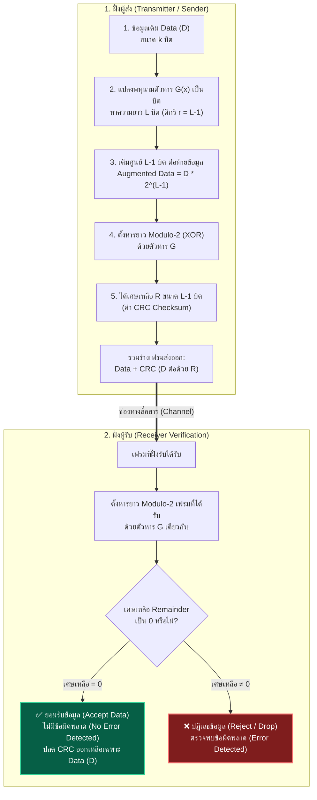

---
tags:
  - networking
  - link-layer
  - crc
  - error-detection
  - homework-solutions
  - assignment
  - polynomial-division
  - v9-current
created: 2026-09-21
updated: 2026-09-21
curriculum: Current Year Course (68/1-Computer Network IT - Pitpimon Choorod)
type: homework-solutions
---

# การบ้านและการคำนวณ CRC (Cyclic Redundancy Check) — เฉลยวิธีคิดและวิธีทำฉบับสมบูรณ์

> [!SUMMARY]
> **ข้อมูลงานที่ได้รับมอบหมาย (Google Classroom):**
> - **วิชา:** 68/1-Computer Network (IT) (เรียนวันจันทร์ เวลา 13.00-16.00 น.)
> - **หัวข้องาน:** CRC Calculation
> - **ผู้สอน:** Pitpimon Choorod
> - **กำหนดส่ง:** พรุ่งนี้ 23:59 น.
> - **อ้างอิงหลักการคำนวณ:** สไลด์การสอนภาควิชา `Chapter_6_Datalink_layer-CRC.pdf` (สไลด์ 1–14)

---

## 📌 สรุปหลักการคิดและการคำนวณ CRC ตามสไลด์ภาควิชา (5-Step CRC Algorithm)

ในระดับ **Data Link Layer** การตรวจจับข้อผิดพลาดด้วย **Cyclic Redundancy Check (CRC)** ทำงานบนระบบคณิตศาสตร์ **Modulo-2 Arithmetic** ซึ่งใช้การดำเนินการทางตรรกะแบบ **Exclusive-OR (XOR)**:
- $0 \oplus 0 = 0$
- $0 \oplus 1 = 1$
- $1 \oplus 0 = 1$
- $1 \oplus 1 = 0$
*(กฎการจำ: เหมือนกันได้ `0`, ต่างกันได้ `1` โดยไม่มีการทดและไม่มีการยืม)*



### ขั้นตอนวิธีคำนวณ 5 ขั้นตอน (ตาม Slide 6 ของภาควิชา):
1. **Convert Data to Binary ($D$):** ตรวจสอบบล็อกข้อมูลในรูปเลขฐานสอง
2. **Find Length $L$ of Divisor ($G$):** หาความยาว $L$ บิตของพหุนามตัวหาร $G(x)$ โดยดีกรีสูงสุดของพหุนามคือ $r = L - 1$
3. **Append $L-1$ zeros to $D$:** เติมเลขศูนย์จำนวน $L - 1$ บิต ต่อท้ายข้อมูลเดิม $D$
4. **Perform Binary Division ($D \cdot 2^{L-1} / G$) using XOR:** ตั้งหารยาว Modulo-2 โดยใช้ลอจิก XOR ทีละหลัก
5. **Remainder of Division = CRC:** เศษเหลือที่ได้จากการหารคือค่า CRC (มีความยาว $L - 1$ บิตเสมอ) จากนั้นนำไปต่อท้ายข้อมูลเดิมเพื่อส่งออกเป็น $\text{Data} + \text{CRC}$

---

## 🧠 เจาะลึก: พหุนามตัวหาร (Divisor Polynomial) คืออะไร? และแปลงเป็นเลขฐานสองอย่างไร?

> [!DEFINITION] **พหุนามตัวหาร (Generator Polynomial: $G(x)$)**
> ในมาตรฐานเครือข่ายและทฤษฎีสารสนเทศ ตัวหาร $G$ มักถูกเขียนในรูปพีชคณิตพหุนาม $G(x)$ โดย **"เลขชี้กำลังของ $x$ แต่ละพจน์"** จะสอดคล้องกับ **"ตำแหน่งของบิต (Bit Index)"** ภายในตัวหารฐานสอง เริ่มนับจากขวาสุดคือตำแหน่ง $0$ ($x^0 = 1$)

$$G(x) = g_r x^r + g_{r-1} x^{r-1} + \dots + g_2 x^2 + g_1 x^1 + g_0 x^0$$

### 1. กฎการแปลงพหุนามเป็นเลขฐานสอง 3 ข้อ:
1. **มีพจน์ $x^n$ ปรากฏอยู่ในสมการ** $\implies$ สัมประสิทธิ์ $g_n = \mathbf{1}$ (ใส่บิต `1` ที่ตำแหน่ง $n$)
2. **ไม่มีพจน์ $x^n$ ปรากฏอยู่ในสมการ** $\implies$ สัมประสิทธิ์ $g_n = \mathbf{0}$ (ใส่บิต `0` ที่ตำแหน่ง $n$)
3. **พจน์คงที่ท้ายสุด $+ 1$** $\implies$ คือ **$x^0$** เสมอ (เนื่องจาก $x^0 = 1$)

---

### 2. ถอดรหัส $x^3 + 1$ (Divisor ของข้อ 1) อย่างละเอียด
เมื่อโจทย์ระบุว่า **`with the divisor x3+1`**:
- เขียนเรียงดีกรีถอยหลังตั้งแต่สูงสุด ($x^3$) ลงไปหาต่ำสุด ($x^0$):
  $$G(x) = \mathbf{1}\cdot x^3 + \mathbf{0}\cdot x^2 + \mathbf{0}\cdot x^1 + \mathbf{1}\cdot x^0$$

| ตำแหน่งพจน์ | $x^3$ | $x^2$ | $x^1$ | $x^0$ (คือ 1) |
| :---: | :---: | :---: | :---: | :---: |
| **มีในโจทย์หรือไม่?** | **มี** | ไม่มี | ไม่มี | **มี** |
| **ค่าบิต (Bit Value)** | **`1`** | **`0`** | **`0`** | **`1`** |

- **ผลลัพธ์เลขฐานสอง:** ได้ตัวหาร $G = \mathbf{1001_2}$
- **ความยาวตัวหาร ($L$):** มี 4 บิต
- **ดีกรีพหุนาม ($r$):** ดีกรีสูงสุดคือ $3$ $\implies$ แปลว่าต้อง **เติมศูนย์ $r = 3$ บิต** ต่อท้ายข้อมูลต้นทางเสมอ

---

### 3. ถ้าเจอ $x$ อื่น หรือพหุนามค่าอื่น ดูยังไง? (สูตรลัด 3 สเต็ป)

```text
สเต็ป 1: หาเลขชี้กำลังสูงสุด (ดีกรี r)  ---> บอกทันทีว่ามีตัวหารทั้งหมด r + 1 บิต และต้องเติมศูนย์ r บิต
สเต็ป 2: ลิสต์ตำแหน่งพจน์ถอยหลังจาก r ถึง 0 ---> [x^r, x^(r-1), ..., x^2, x^1, x^0]
สเต็ป 3: หยอดบิต 1 หรือ 0                 ---> ตัวไหนมีในโจทย์ใส่ '1' / ตัวไหนหายไปใส่ '0'
```

#### ตารางเทียบเคียงพหุนามตัวหารในรูปแบบต่างๆ (Comparison Matrix):
| พหุนามตัวหาร ($G(x)$) | การกระจายพจน์ทุกตำแหน่ง | ลำดับบิตฐานสอง ($G$) | ความยาว ($L$) | บิตศูนย์ที่เติม ($r$) | ที่มา / การประยุกต์ใช้ |
| :--- | :--- | :---: | :---: | :---: | :--- |
| **$x^3 + 1$** | $1\cdot x^3 + 0\cdot x^2 + 0\cdot x^1 + 1\cdot x^0$ | **`1001`** | 4 บิต | 3 บิต | โจทย์ข้อ 1 / Slide 10 |
| **$x^3 + x^2 + 1$** | $1\cdot x^3 + 1\cdot x^2 + 0\cdot x^1 + 1\cdot x^0$ | **`1101`** | 4 บิต | 3 บิต | โจทย์ข้อ 2 / Slide 7 |
| **$x^5 + x + 1$** | $1\cdot x^5 + 0\cdot x^4 + 0\cdot x^3 + 0\cdot x^2 + 1\cdot x^1 + 1\cdot x^0$ | **`100011`** | 6 บิต | 5 บิต | โจทย์ข้อ 3 |
| **$x^5 + x^4 + x^2 + 1$** | $1\cdot x^5 + 1\cdot x^4 + 0\cdot x^3 + 1\cdot x^2 + 0\cdot x^1 + 1\cdot x^0$ | **`110101`** | 6 บิต | 5 บิต | Quiz ข้อ 4 |
| **$x^4 + x^3 + x^2 + x + 1$** | $1\cdot x^4 + 1\cdot x^3 + 1\cdot x^2 + 1\cdot x^1 + 1\cdot x^0$ | **`11111`** | 5 บิต | 4 บิต | มีครบทุกเทอม |
| **$x^7 + x^5 + x^2 + x + 1$** | $1\cdot x^7 + 0\cdot x^6 + 1\cdot x^5 + 0\cdot x^4 + 0\cdot x^3 + 1\cdot x^2 + 1\cdot x^1 + 1\cdot x^0$ | **`10100111`** | 8 บิต | 7 บิต | ตัวอย่างในสไลด์หน้า 9 |
| **$x^3 + x$ (ไม่มี $+1$)** | $1\cdot x^3 + 0\cdot x^2 + 1\cdot x^1 + 0\cdot x^0$ | **`1010`** | 4 บิต | 3 บิต | กรณีไม่มีพจน์คงที่ 1 |

---

### 4. ข้อควรระวังและกับดักที่พบบ่อยในข้อสอบ (Common Pitfalls)

> [!WARNING] **ระวังข้อผิดพลาด 3 จุดสำคัญ:**
> 1. **ห้ามลืมใส่ `0` ตรงพจน์ที่หายไป:** เช่น $x^3 + 1$ นักศึกษามักเผลอหยิบเฉพาะตัวเลขมาเขียนเป็น `11` ซึ่ง**ผิดทันที** เพราะตำแหน่ง $x^2$ และ $x^1$ ต้องใส่ `0` กลายเป็น `1001`
> 2. **พจน์ $x$ ลอยๆ คือ $x^1$:** เช่น $x^3 + x + 1 \implies$ ตำแหน่ง $x^1$ มีค่าเป็น `1`
> 3. **พจน์ $+ 1$ ท้ายสุดคือ $x^0$:** สัมประสิทธิ์หน้า $x^0$ มีค่าเป็น `1`
> 4. **จำนวนบิตศูนย์ที่เติมต่อท้ายข้อมูล ($r$):** ต้องเท่ากับดีกรีสูงสุดของพหุนามพอดีเสมอ ($r = L - 1$)

---

## 📝 ข้อที่ 1: Find the CRC for the data blocks 11001001 with the divisor $x^3+1$

### 1.1 วิเคราะห์ข้อมูลและตัวแปร
- **บล็อกข้อมูล ($D$):** `11001001` ($k = 8$ บิต)
- **พหุนามตัวหาร ($G(x)$):** $x^3 + 1$
- **แปลงพหุนามเป็นเลขฐานสอง ($G$):**
  $$G(x) = 1 \cdot x^3 + 0 \cdot x^2 + 0 \cdot x^1 + 1 \cdot x^0 \implies G = \mathbf{1001_2}$$
- **ความยาวของตัวหาร ($L$):** $L = 4$ บิต
- **จำนวนบิตศูนย์ที่ต้องเติม ($r = L - 1$):** $4 - 1 = 3$ บิต
- **ข้อมูลที่เติมศูนย์แล้ว (Dividend):** `11001001` + `000` = $\mathbf{11001001000}$ (11 บิต)

---

### 1.2 การตั้งหารยาว Modulo-2 ที่ฝั่งผู้ส่ง (Sender Long Division)

```text
                    1 1 0 1 0 0 1 1   <-- ผลหาร (Quotient)
          -------------------------
1 0 0 1 ) 1 1 0 0 1 0 0 1 0 0 0
          1 0 0 1                     (Step 1: บิตแรกเป็น 1 -> XOR ด้วย 1001)
          -------
            1 0 1 1                   (ดึงบิตที่ 5 คือ '1' ลงมา)
            1 0 0 1                   (Step 2: บิตแรกเป็น 1 -> XOR ด้วย 1001)
            -------
              0 1 0 0                 (ดึงบิตที่ 6 คือ '0' ลงมา)
              0 0 0 0                 (Step 3: บิตแรกเป็น 0 -> XOR ด้วย 0000)
              -------
                1 0 0 1               (ดึงบิตที่ 7 คือ '1' ลงมา)
                1 0 0 1               (Step 4: บิตแรกเป็น 1 -> XOR ด้วย 1001)
                -------
                  0 0 0 0             (ดึงบิตที่ 8 คือ '0' ลงมา [ศูนย์ตัวแรกที่เติม])
                  0 0 0 0             (Step 5: บิตแรกเป็น 0 -> XOR ด้วย 0000)
                  -------
                    0 0 0 0           (ดึงบิตที่ 9 คือ '0' ลงมา [ศูนย์ตัวที่สองที่เติม])
                    0 0 0 0           (Step 6: บิตแรกเป็น 0 -> XOR ด้วย 0000)
                    -------
                      0 0 0 0         (ดึงบิตที่ 10 คือ '0' ลงมา [ศูนย์ตัวที่สามที่เติม])
                                      (ขยับหลักมาที่ 1 1 0 0)
                      1 1 0 0
                      1 0 0 1         (Step 7: บิตแรกเป็น 1 -> XOR ด้วย 1001)
                      -------
                        1 0 1 0
                        1 0 0 1       (Step 8: บิตแรกเป็น 1 -> XOR ด้วย 1001)
                        -------
                          0 1 1       <-- เศษเหลือ (Remainder ขนาด 3 บิต = 011)
```

#### ตารางแจกแจงขั้นตอนหารทีละบิต (Trace Table):
| ลำดับขั้นตอน | ข้อมูลตัวตั้งในหลักปัจจุบัน | ตัวหารที่ใช้ (XOR) | บิตผลหาร (Quotient) | ผลลัพธ์หลัง XOR และดึงบิตถัดไป |
| :---: | :---: | :---: | :---: | :---: |
| บิตที่ 0 | `1100` | `1001` | **`1`** | `0101` ดึง `1` $\rightarrow$ `1011` |
| บิตที่ 1 | `1011` | `1001` | **`1`** | `0010` ดึง `0` $\rightarrow$ `0100` |
| บิตที่ 2 | `0100` | `0000` | **`0`** | `0100` ดึง `0` $\rightarrow$ `1000` |
| บิตที่ 3 | `1000` | `1001` | **`1`** | `0001` ดึง `1` $\rightarrow$ `0011` |
| บิตที่ 4 | `0011` | `0000` | **`0`** | `0011` ดึง `0` $\rightarrow$ `0110` |
| บิตที่ 5 | `0110` | `0000` | **`0`** | `0110` ดึง `0` $\rightarrow$ `1100` |
| บิตที่ 6 | `1100` | `1001` | **`1`** | `0101` ดึง `0` $\rightarrow$ `1010` |
| บิตที่ 7 | `1010` | `1001` | **`1`** | `0011` (หมดตัวตั้ง) $\rightarrow$ เศษคือ **`011`** |

- **ผลหาร (Quotient):** `11010011`
- **เศษเหลือ (Remainder):** $\mathbf{011}$ (ขนาด 3 บิต)

---

### 1.3 สรุปคำตอบข้อที่ 1
- **ค่า CRC (Checksum):** $\mathbf{011}$
- **เฟรมข้อมูลที่ส่งออกจริง ($\text{Data} + \text{CRC}$):** `11001001` ต่อด้วย `011` = $\mathbf{11001001011}$

---

### 1.4 การหารตรวจสอบที่ฝั่งผู้รับ (Receiver Verification for Problem 1)
เมื่อผู้รับได้รับเฟรม $\mathbf{11001001011}$ และนำมาตั้งหารยาวด้วยตัวหาร $G = \mathbf{1001}$:

```text
                    1 1 0 1 0 0 1 1   <-- ผลหาร (Quotient)
          -------------------------
1 0 0 1 ) 1 1 0 0 1 0 0 1 0 1 1
          1 0 0 1                     (XOR ด้วย 1001)
          -------
            1 0 1 1                   (ดึงบิต '1' ลงมา)
            1 0 0 1                   (XOR ด้วย 1001)
            -------
              0 1 0 0                 (ดึงบิต '0' ลงมา)
              0 0 0 0                 (XOR ด้วย 0000)
              -------
                1 0 0 1               (ดึงบิต '1' ลงมา)
                1 0 0 1               (XOR ด้วย 1001)
                -------
                  0 0 0 0             (ดึงบิต '0' ลงมา)
                  0 0 0 0             (XOR ด้วย 0000)
                  -------
                    0 0 0 1           (ดึงบิต '1' ลงมา)
                    0 0 0 0           (XOR ด้วย 0000)
                    -------
                      0 0 1 1         (ดึงบิต '1' ลงมา)
                      0 0 0 0         (XOR ด้วย 0000)
                      -------
                        1 1 0 1
                        1 0 0 1       (XOR ด้วย 1001)
                        -------
                          1 0 0 1
                          1 0 0 1     (XOR ด้วย 1001)
                          -------
                            0 0 0     <-- เศษเหลือเป็น 0 (Remainder = 000)
```

- **ผลลัพธ์ฝั่งรับ:** เศษเหลือเท่ากับ $\mathbf{000}$ (Remainder = 0)
- **การตัดสินใจ:** **ยอมรับข้อมูล (Accept Data)** ข้อมูลถูกต้องสมบูรณ์ ไม่มีความผิดพลาด

---

## 📝 ข้อที่ 2: Find the CRC for the data blocks 1110010101 with the divisor $x^3+x^2+1$. And perform division operations at the receiver.

### 2.1 วิเคราะห์ข้อมูลและตัวแปร
- **บล็อกข้อมูล ($D$):** `1110010101` ($k = 10$ บิต)
- **พหุนามตัวหาร ($G(x)$):** $x^3 + x^2 + 1$
- **แปลงพหุนามเป็นเลขฐานสอง ($G$):**
  $$G(x) = 1 \cdot x^3 + 1 \cdot x^2 + 0 \cdot x^1 + 1 \cdot x^0 \implies G = \mathbf{1101_2}$$
- **ความยาวของตัวหาร ($L$):** $L = 4$ บิต
- **จำนวนบิตศูนย์ที่ต้องเติม ($r = L - 1$):** $4 - 1 = 3$ บิต
- **ข้อมูลที่เติมศูนย์แล้ว (Dividend):** `1110010101` + `000` = $\mathbf{1110010101000}$ (13 บิต)

---

### 2.2 การตั้งหารยาว Modulo-2 ที่ฝั่งผู้ส่ง (Sender Long Division)

```text
                    1 0 1 0 0 0 0 1 1 0   <-- ผลหาร (Quotient)
          -----------------------------
1 1 0 1 ) 1 1 1 0 0 1 0 1 0 1 0 0 0
          1 1 0 1                         (Step 1: XOR ด้วย 1101)
          -------
            0 1 1 0                       (ดึงบิต '0' ลงมา)
            0 0 0 0                       (Step 2: XOR ด้วย 0000)
            -------
              1 1 0 1                     (ดึงบิต '1' ลงมา)
              1 1 0 1                     (Step 3: XOR ด้วย 1101)
              -------
                0 0 0 0                   (ดึงบิต '0' ลงมา)
                0 0 0 0                   (Step 4: XOR ด้วย 0000)
                -------
                  0 0 0 1                 (ดึงบิต '1' ลงมา)
                  0 0 0 0                 (Step 5: XOR ด้วย 0000)
                  -------
                    0 0 1 0               (ดึงบิต '0' ลงมา)
                    0 0 0 0               (Step 6: XOR ด้วย 0000)
                    -------
                      0 1 0 1             (ดึงบิต '1' ลงมา)
                      0 0 0 0             (Step 7: XOR ด้วย 0000)
                      -------
                        1 0 1 0           (ดึงบิต '0' ลงมา [ศูนย์ตัวแรกที่เติม])
                        1 1 0 1           (Step 8: XOR ด้วย 1101)
                        -------
                          1 1 1 0         (ดึงบิต '0' ลงมา [ศูนย์ตัวที่สองที่เติม])
                          1 1 0 1         (Step 9: XOR ด้วย 1101)
                          -------
                            0 1 1 0       (ดึงบิต '0' ลงมา [ศูนย์ตัวที่สามที่เติม])
                            0 0 0 0       (Step 10: XOR ด้วย 0000)
                            -------
                              1 1 0       <-- เศษเหลือ (Remainder = 110)
```

#### ตารางแจกแจงขั้นตอนหารทีละบิต (Sender Trace Table):
| ขั้นตอน | บิตผลหาร | ตัวตั้งย่อย | XOR ด้วย | ผลลัพธ์หลัง XOR | ดึงบิตถัดไป | ตัวตั้งถัดไป |
| :---: | :---: | :---: | :---: | :---: | :---: | :---: |
| 1 | **`1`** | `1110` | `1101` | `0011` | `0` (บิต 4) | `0110` |
| 2 | **`0`** | `0110` | `0000` | `0110` | `1` (บิต 5) | `1101` |
| 3 | **`1`** | `1101` | `1101` | `0000` | `0` (บิต 6) | `0000` |
| 4 | **`0`** | `0000` | `0000` | `0000` | `1` (บิต 7) | `0001` |
| 5 | **`0`** | `0001` | `0000` | `0001` | `0` (บิต 8) | `0010` |
| 6 | **`0`** | `0010` | `0000` | `0010` | `1` (บิต 9) | `0101` |
| 7 | **`0`** | `0101` | `0000` | `0101` | `0` (เติมบิต 10) | `1010` |
| 8 | **`1`** | `1010` | `1101` | `0111` | `0` (เติมบิต 11) | `1110` |
| 9 | **`1`** | `1110` | `1101` | `0011` | `0` (เติมบิต 12) | `0110` |
| 10 | **`0`** | `0110` | `0000` | `0110` | - (หมดแล้ว) | เศษคือ **`110`** |

- **ผลหาร (Quotient):** `1010000110`
- **เศษเหลือ (Remainder):** $\mathbf{110}$ (ขนาด 3 บิต)
- **ค่า CRC:** $\mathbf{110}$
- **เฟรมที่ส่งออกจริง ($\text{Data} + \text{CRC}$):** `1110010101` ต่อด้วย `110` = $\mathbf{1110010101110}$

---

### 2.3 การหารตรวจสอบที่ฝั่งผู้รับ (Receiver Division Operations)
โจทย์สั่งชัดเจน: *"And perform division operations at the receiver."*  
ฝั่งผู้รับได้รับเฟรม $\mathbf{1110010101110}$ และตั้งหารด้วย $G = \mathbf{1101}$:

```text
                    1 0 1 0 0 0 0 1 1 0   <-- ผลหาร (Quotient)
          -----------------------------
1 1 0 1 ) 1 1 1 0 0 1 0 1 0 1 1 1 0
          1 1 0 1                         (XOR ด้วย 1101)
          -------
            0 1 1 0                       (ดึงบิต '0' ลงมา)
            0 0 0 0                       (XOR ด้วย 0000)
            -------
              1 1 0 1                     (ดึงบิต '1' ลงมา)
              1 1 0 1                     (XOR ด้วย 1101)
              -------
                0 0 0 0                   (ดึงบิต '0' ลงมา)
                0 0 0 0                   (XOR ด้วย 0000)
                -------
                  0 0 0 1                 (ดึงบิต '1' ลงมา)
                  0 0 0 0                 (XOR ด้วย 0000)
                  -------
                    0 0 1 0               (ดึงบิต '0' ลงมา)
                    0 0 0 0               (XOR ด้วย 0000)
                    -------
                      0 1 0 1             (ดึงบิต '1' ลงมา)
                      0 0 0 0             (XOR ด้วย 0000)
                      -------
                        1 0 1 1           (ดึงบิต '1' ลงมา [CRC บิตแรก])
                        1 1 0 1           (XOR ด้วย 1101)
                        -------
                          1 1 0 1         (ดึงบิต '1' ลงมา [CRC บิตสอง])
                          1 1 0 1         (XOR ด้วย 1101)
                          -------
                            0 0 0 0       (ดึงบิต '0' ลงมา [CRC บิตสาม])
                            0 0 0 0       (XOR ด้วย 0000)
                            -------
                              0 0 0       <-- เศษเหลือเป็น 0 (Remainder = 000)
```

- **ผลลัพธ์ฝั่งผู้รับ:**
  - $\text{Remainder} = \mathbf{000}$
  - **การตัดสินใจ (Decision):** เนื่องจากเศษเหลือเป็นศูนย์ จึง **ยอมรับข้อมูล (Accept Data)** โดยตัดบิต CRC 3 บิตท้ายออก จะได้ข้อมูลแท้จริงคือ `1110010101`

---

## 📝 ข้อที่ 3: Find the CRC for the data block 1010101010 using the divisor $x^5+x+1$. And perform division operations at the receiver.

### 3.1 วิเคราะห์ข้อมูลและตัวแปร
- **บล็อกข้อมูล ($D$):** `1010101010` ($k = 10$ บิต)
- **พหุนามตัวหาร ($G(x)$):** $x^5 + x + 1$
- **แปลงพหุนามเป็นเลขฐานสอง ($G$):**
  $$G(x) = 1 \cdot x^5 + 0 \cdot x^4 + 0 \cdot x^3 + 0 \cdot x^2 + 1 \cdot x^1 + 1 \cdot x^0 \implies G = \mathbf{100011_2}$$
- **ความยาวของตัวหาร ($L$):** $L = 6$ บิต
- **จำนวนบิตศูนย์ที่ต้องเติม ($r = L - 1$):** $6 - 1 = 5$ บิต
- **ข้อมูลที่เติมศูนย์แล้ว (Dividend):** `1010101010` + `00000` = $\mathbf{101010101000000}$ (15 บิต)

---

### 3.2 การตั้งหารยาว Modulo-2 ที่ฝั่งผู้ส่ง (Sender Long Division)

```text
                      1 0 1 0 0 1 0 1 1 1   <-- ผลหาร (Quotient)
              -----------------------------
1 0 0 0 1 1 ) 1 0 1 0 1 0 1 0 1 0 0 0 0 0 0
              1 0 0 0 1 1                   (Step 1: XOR ด้วย 100011)
              -----------
                0 1 0 0 1 1                 (ดึงบิต '1' ลงมา)
                0 0 0 0 0 0                 (Step 2: XOR ด้วย 000000)
                -----------
                  1 0 0 1 1 0               (ดึงบิต '0' ลงมา)
                  1 0 0 0 1 1               (Step 3: XOR ด้วย 100011)
                  -----------
                    0 0 1 0 1 1             (ดึงบิต '1' ลงมา)
                    0 0 0 0 0 0             (Step 4: XOR ด้วย 000000)
                    -----------
                      0 1 0 1 1 0           (ดึงบิต '0' ลงมา)
                      0 0 0 0 0 0           (Step 5: XOR ด้วย 000000)
                      -----------
                        1 0 1 1 0 0         (ดึงบิต '0' ลงมา [ศูนย์ตัวที่ 1 ที่เติม])
                        1 0 0 0 1 1         (Step 6: XOR ด้วย 100011)
                        -----------
                          0 1 1 1 1 0       (ดึงบิต '0' ลงมา [ศูนย์ตัวที่ 2 ที่เติม])
                          0 0 0 0 0 0       (Step 7: XOR ด้วย 000000)
                          -----------
                            1 1 1 1 0 0     (ดึงบิต '0' ลงมา [ศูนย์ตัวที่ 3 ที่เติม])
                            1 0 0 0 1 1     (Step 8: XOR ด้วย 100011)
                            -----------
                              1 1 1 1 1 0   (ดึงบิต '0' ลงมา [ศูนย์ตัวที่ 4 ที่เติม])
                              1 0 0 0 1 1   (Step 9: XOR ด้วย 100011)
                              -----------
                                1 1 1 0 1 0 (ดึงบิต '0' ลงมา [ศูนย์ตัวที่ 5 ที่เติม])
                                1 0 0 0 1 1 (Step 10: XOR ด้วย 100011)
                                -----------
                                  1 1 0 0 1 <-- เศษเหลือ (Remainder ขนาด 5 บิต = 11001)
```

#### ตารางแจกแจงขั้นตอนหารทีละบิต (Sender Trace Table):
| ขั้นตอน | บิตผลหาร | ตัวตั้งย่อย (6 บิต) | ตัวหารที่ใช้ (XOR) | ผลลัพธ์หลัง XOR | ดึงบิตถัดไป | ตัวตั้งย่อยถัดไป |
| :---: | :---: | :---: | :---: | :---: | :---: | :---: |
| 1 | **`1`** | `101010` | `100011` | `001001` | `1` (บิต 6) | `010011` |
| 2 | **`0`** | `010011` | `000000` | `010011` | `0` (บิต 7) | `100110` |
| 3 | **`1`** | `100110` | `100011` | `000101` | `1` (บิต 8) | `001011` |
| 4 | **`0`** | `001011` | `000000` | `001011` | `0` (บิต 9) | `010110` |
| 5 | **`0`** | `010110` | `000000` | `010110` | `0` (เติมศูนย์ 1) | `101100` |
| 6 | **`1`** | `101100` | `100011` | `001111` | `0` (เติมศูนย์ 2) | `011110` |
| 7 | **`0`** | `011110` | `000000` | `011110` | `0` (เติมศูนย์ 3) | `111100` |
| 8 | **`1`** | `111100` | `100011` | `011111` | `0` (เติมศูนย์ 4) | `111110` |
| 9 | **`1`** | `111110` | `100011` | `011101` | `0` (เติมศูนย์ 5) | `111010` |
| 10 | **`1`** | `111010` | `100011` | `011001` | - (หมดแล้ว) | เศษคือ **`11001`** |

- **ผลหาร (Quotient):** `1010010111`
- **เศษเหลือ (Remainder):** $\mathbf{11001}$ (ขนาด 5 บิตพอดี)
- **ค่า CRC:** $\mathbf{11001}$
- **เฟรมที่ส่งออกจริง ($\text{Data} + \text{CRC}$):** `1010101010` ต่อด้วย `11001` = $\mathbf{101010101011001}$

---

### 3.3 การหารตรวจสอบที่ฝั่งผู้รับ (Receiver Division Operations)
โจทย์สั่งชัดเจน: *"And perform division operations at the receiver."*  
ฝั่งผู้รับได้รับเฟรม $\mathbf{101010101011001}$ และตั้งหารด้วย $G = \mathbf{100011}$:

```text
                      1 0 1 0 0 1 0 1 1 1   <-- ผลหาร (Quotient)
              -----------------------------
1 0 0 0 1 1 ) 1 0 1 0 1 0 1 0 1 0 1 1 0 0 1
              1 0 0 0 1 1                   (XOR ด้วย 100011)
              -----------
                0 1 0 0 1 1                 (ดึงบิต '1' ลงมา)
                0 0 0 0 0 0                 (XOR ด้วย 000000)
                -----------
                  1 0 0 1 1 0               (ดึงบิต '0' ลงมา)
                  1 0 0 0 1 1               (XOR ด้วย 100011)
                  -----------
                    0 0 1 0 1 1             (ดึงบิต '1' ลงมา)
                    0 0 0 0 0 0             (XOR ด้วย 000000)
                    -----------
                      0 1 0 1 1 0           (ดึงบิต '0' ลงมา)
                      0 0 0 0 0 0           (XOR ด้วย 000000)
                      -----------
                        1 0 1 1 0 1         (ดึงบิต '1' ลงมา [CRC บิต 1])
                        1 0 0 0 1 1         (XOR ด้วย 100011)
                        -----------
                          0 1 1 1 0 1       (ดึงบิต '1' ลงมา [CRC บิต 2])
                          0 0 0 0 0 0       (XOR ด้วย 000000)
                          -----------
                            1 1 1 0 1 0     (ดึงบิต '0' ลงมา [CRC บิต 3])
                            1 0 0 0 1 1     (XOR ด้วย 100011)
                            -----------
                              1 1 0 0 1 0   (ดึงบิต '0' ลงมา [CRC บิต 4])
                              1 0 0 0 1 1   (XOR ด้วย 100011)
                              -----------
                                1 0 0 0 1 1 (ดึงบิต '1' ลงมา [CRC บิต 5])
                                1 0 0 0 1 1 (XOR ด้วย 100011)
                                -----------
                                  0 0 0 0 0 <-- เศษเหลือเป็น 0 (Remainder = 00000)
```

- **ผลลัพธ์ฝั่งผู้รับ:**
  - $\text{Remainder} = \mathbf{00000}$
  - **การตัดสินใจ (Decision):** เศษเหลือเป็นศูนย์แสดงว่าข้อมูลที่ได้รับปราศจากความผิดพลาด $\implies$ **ยอมรับข้อมูล (Accept Data)** โดยปลดบิต CRC 5 บิตท้ายออก คงเหลือข้อมูลแท้จริงคือ `1010101010`

---

## 📊 ตารางสรุปคำตอบรวมทุกข้อสำหรับการส่งงาน (Master Submission Sheet)

| ข้อที่ | ข้อมูลเดิม ($D$) | พหุนามตัวหาร ($G(x)$) | ตัวหารฐานสอง ($G$) | บิต 0 ที่เติม ($r$) | ค่า **CRC** ที่ได้ | ข้อมูลที่ส่งออกจริง ($\text{Data} + \text{CRC}$) | เศษเหลือฝั่งรับ | ผลการตัดสินใจฝั่งรับ |
| :---: | :---: | :---: | :---: | :---: | :---: | :---: | :---: | :---: |
| **1** | `11001001` | $x^3 + 1$ | `1001` (4 บิต) | 3 บิต | $\mathbf{011}$ | $\mathbf{11001001011}$ | `000` | ยอมรับ (Accept) |
| **2** | `1110010101` | $x^3 + x^2 + 1$ | `1101` (4 บิต) | 3 บิต | $\mathbf{110}$ | $\mathbf{1110010101110}$ | `000` | ยอมรับ (Accept) |
| **3** | `1010101010` | $x^5 + x + 1$ | `100011` (6 บิต) | 5 บิต | $\mathbf{11001}$ | $\mathbf{101010101011001}$ | `00000` | ยอมรับ (Accept) |

---

## 🔗 โน้ตความรู้และแหล่งอ้างอิงที่เกี่ยวข้อง
- 📄 สไลด์ต้นฉบับภาควิชา: [[02_Lecture_06_CRC_Cyclic_Redundancy_Check_Special_Guide|Lecture 6 Special Topic: Cyclic Redundancy Check (CRC) — Complete Departmental Guide]]
- 📖 สรุปเนื้อหาเลเยอร์ 2 หลัก: [[01_Lecture_06_Chapter_6_Link_Layer_and_LANs_v9|Chapter 6 Link Layer & LANs v9.0]]
- 📑 สมุดรวมแบบฝึกหัดคำนวณเครือข่าย: [[Calculations and Trace Workbook#6. การคำนวณ Cyclic Redundancy Check (CRC)]]
