---
tags:
  - networking
  - chapter-07
  - reading-guide
  - wireless
  - mobile-networks
  - wifi
  - 5g
  - mimo
  - ofdma
  - mobility
  - satellite
  - iot
created: 2026-10-04
updated: 2026-10-04
type: reading-guide
---

# 📖 Chapter 07: Wireless and Mobile Networks (Study & Reading Guide)

> [!IMPORTANT]
> **เป้าหมายและภาพรวมของบทที่ 7:**  
> ทำความเข้าใจหลักการพื้นฐานของเครือข่ายไร้สายและเครือข่ายเคลื่อนที่ตามมาตรฐานสากล (Kurose & Ross 9th Edition 2025/2026):
> 1. **กายภาพคลื่นวิทยุ (Radio Physical Layer):** คลื่นแม่เหล็กไฟฟ้า, ความถี่/ความยาวคลื่น ($\lambda = c/f$), กำลังส่ง (mW, dBm), อุปสรรคในช่องสัญญาณ (Interference, Noise, SNR, Path Loss, Hidden Terminal, Multipath & ISI), ขีดความสามารถช่องสัญญาณของแชนนอน ($C = B \log_2(1+\text{SNR})$), เทคโนโลยีสายอากาศ MIMO (Spatial Diversity vs Spatial Multiplexing, SU vs MU-MIMO), และการมอดูเลชันดิจิทัล (BPSK, QPSK, 16/64/256-QAM, AMC)
> 2. **การเข้าถึงช่องสัญญาณและโปรโตคอล (Wireless Access & MAC):** การแบ่งช่องสัญญาณ (FDM, OFDM Subcarriers, OFDMA Resource Blocks), โปรโตคอลการเข้าถึงแบบสุ่ม CSMA/CA, การแก้ปัญหาโหนดซ่อนเร้นด้วย RTS/CTS และ NAV, โครงสร้างเฟรม IEEE 802.11 Wi-Fi และเหตุผลของการมี Address ถึง 4 ฟิลด์
> 3. **สถาปัตยกรรมเครือข่าย 5G (5G RAN & Core):** องค์ประกอบ UE, gNodeB, 5G Core, ลำดับชั้นช่องสัญญาณ (Logical, Transport, Physical), โปรโตคอลสแตก (SDAP, PDCP, RLC, MAC, PHY), Split RAN (CU, DU, RU) และ Open RAN (O-RAN), การเกาะสัญญาณ (Beaconing, Probing, RACH), อัลกอริทึมการจัดสรรทรัพยากร (Max Throughput, BET, Proportional Fair), การประหยัดพลังงาน DRX, และสถาปัตยกรรม 5G Core แบบ CUPS และ Service-Based Architecture (SBA: UPF, AMF, SMF) พร้อมอุโมงค์ GTP-U
> 4. **การเคลื่อนที่และการส่งมอบสัญญาณ (Mobility & Handover):** สเปกตรัมของการเคลื่อนที่, การโรมมิ่งใน Wi-Fi, ขั้นตอนการทำ Handover ใน 5G (Preparation, Execution, Completion) ผ่าน Xn / N2 interface
> 5. **เทคโนโลยีไร้สายเฉพาะทาง (Specialized Wireless):** บลูทูธ (Bluetooth Classic, BLE, FHSS, Piconet/Scatternet, L2CAP), เครือข่ายดาวเทียม (GEO vs LEO Starlink, การหน่วงเวลา, เลเซอร์เชื่อมต่อข้ามดาวเทียม ISL), และอินเทอร์เน็ตของสรรพสิ่ง (IoT LPWAN: LoRaWAN, NB-IoT, Zigbee)

---

## 🚦 แผนที่นำทางการเรียนรู้บทที่ 7 (Recommended Reading Roadmap)

```mermaid
flowchart TD
    Step1["<b>1. ภาพรวมและองค์ประกอบเครือข่ายไร้สาย</b><br/>(Hosts, Base Stations, Wireless Links, Edge vs Core)<br/><i>Slides 1–12</i>"]
    Step2["<b>2. ฟิสิกส์คลื่นวิทยุ & กายภาพ Physical Layer</b><br/>(Electromagnetics, SNR, Shannon Capacity, Path Loss, Hidden Terminal, Multipath, MIMO, QAM)<br/><i>Slides 13–48</i>"]
    Step3["<b>3. การเข้าถึงช่องสัญญาณ & IEEE 802.11 Wi-Fi</b><br/>(OFDM/OFDMA, CSMA/CA, RTS/CTS & NAV, 802.11 4-Address Frame)<br/><i>Slides 49–74</i>"]
    Step4["<b>4. สถาปัตยกรรม 5G RAN & Split RAN</b><br/>(gNodeB, Channels, Protocol Stack, CU/DU/RU Split, O-RAN)<br/><i>Slides 75–97</i>"]
    Step5["<b>5. การเกาะสัญญาณ & การจัดตารางคลื่นวิทยุ</b><br/>(Beaconing/Probing, Scheduling: Max TP/BET/PF, DRX Sleep)<br/><i>Slides 98–119</i>"]
    Step6["<b>6. สถาปัตยกรรมแกนกลาง 5G Core Network</b><br/>(CUPS, UPF/AMF/SMF, SBA HTTP/2 APIs, GTP-U Tunnels)<br/><i>Slides 120–129</i>"]
    Step7["<b>7. การเคลื่อนที่ & การส่งมอบสัญญาณ (Handover)</b><br/>(Wi-Fi Roaming, 5G Xn/N2 Handover 4 ขั้นตอน)<br/><i>Slides 130–136</i>"]
    Step8["<b>8. เครือข่ายไร้สายเฉพาะทาง (Bluetooth, Satellite, IoT)</b><br/>(BLE FHSS, Starlink LEO ISL, LoRaWAN, NB-IoT, Zigbee)<br/><i>Slides 137–154</i>"]

    Step1 --> Step2 --> Step3 --> Step4 --> Step5 --> Step6 --> Step7 --> Step8

    style Step1 fill:#e3f2fd,stroke:#1565c0,stroke-width:2px
    style Step2 fill:#fff3e0,stroke:#e65100,stroke-width:2px
    style Step3 fill:#e8f5e9,stroke:#2e7d32,stroke-width:2px
    style Step4 fill:#f3e5f5,stroke:#7b1fa2,stroke-width:2px
    style Step5 fill:#fbe9e7,stroke:#d84315,stroke-width:2px
    style Step6 fill:#e0f2f1,stroke:#00695c,stroke-width:2px
    style Step7 fill:#fff8e1,stroke:#f57f17,stroke-width:2px
    style Step8 fill:#ede7f6,stroke:#4527a0,stroke-width:2px
```

---

## 📚 เอกสารและไฟล์ต้นฉบับในโมดูลนี้

1. **โน้ตวิกิบรรยายสรุปเจาะลึกสมบูรณ์แบบ 100% (Master Lecture Note):**
   - 👉 [[01_Lecture_07_Wireless_and_Mobile_Networks_v9]] — สรุปเนื้อหาครบทั้ง 154 สไลด์ ละเอียดยิบทุกหัวข้อ พร้อมแผนภาพสถาปัตยกรรม Mermaid, ตารางเปรียบเทียบ Low-level, และไฮไลต์โน้ตสดจากอาจารย์
2. **ไฟล์สไลด์และการสอนต้นฉบับ:**
   - สไลด์นำเสนอฉบับทางการ v9.0 (มีบันทึกโน้ตสดภาษาไทยของอาจารย์):  
     [`02_Slides/Chapter_07_Wireless/Current_Year_Course_v9.0/Chapter_7_v9.0_Wireless_and_Mobile_Networks.pptx`](file:///c:/Project/computer-network-&-Internet/02_Slides/Chapter_07_Wireless/Current_Year_Course_v9.0/Chapter_7_v9.0_Wireless_and_Mobile_Networks.pptx)
   - ไฟล์บทเรียนสไลด์ฉบับ HTML ครบ 154 หน้า:  
     [`02_Slides/Chapter_07_Wireless/Current_Year_Course_v9.0/Chapter_7_Wireless_and_Mobile_Networks_1-154.html`](file:///c:/Project/computer-network-&-Internet/02_Slides/Chapter_07_Wireless/Current_Year_Course_v9.0/Chapter_7_Wireless_and_Mobile_Networks_1-154.html)
   - สไลด์หลักสูตรเก่า (สำหรับอ่านเสริม):  
     [`02_Slides/Chapter_07_Wireless/Archive_Old_Curriculum/Chapter_7_Wireless_Old.pdf`](file:///c:/Project/computer-network-&-Internet/02_Slides/Chapter_07_Wireless/Archive_Old_Curriculum/Chapter_7_Wireless_Old.pdf)

---

## ⚡ สรุปสูตรและแนวคิดสำคัญที่ต้องจำสำหรับห้องสอบ (Essential Formula & Concept Cheatsheet)

### 1. ความสัมพันธ์ระหว่างคลื่นวิทยุ:
$$\lambda = \frac{c}{f}$$
- $c = 3 \times 10^8 \text{ m/s}$ (ความเร็วแสง)
- ความถี่ ($f$) สูงขึ้น $\implies$ ความยาวคลื่น ($\lambda$) สั้นลง $\implies$ การลดทอนตามระยะทาง (Path Loss) เพิ่มขึ้น ทะลุทะลวงสิ่งกีดขวางได้น้อยลง

### 2. การแปลงหน่วยกำลังสัญญาณ (Watts $\leftrightarrow$ dBm):
$$P_{\text{dBm}} = 10 \log_{10}\left(\frac{P_{\text{mW}}}{1\text{ mW}}\right)$$
- $1\text{ mW} = 0\text{ dBm}$
- $10\text{ mW} = +10\text{ dBm}$
- $100\text{ mW} = +20\text{ dBm}$
- $250\text{ mW} \approx +24\text{ dBm}$ (กำลังส่งมาตรฐานของสมาร์ตโฟน)

### 3. อัตราส่วนสัญญาณต่อสัญญาณรบกวน (Signal-to-Noise Ratio: SNR):
$$\text{SNR}_{\text{dB}} = 10 \log_{10}\left(\frac{S}{N}\right)$$

### 4. ทฤษฎีความจุสูงสุดของช่องสัญญาณ (Shannon-Hartley Capacity):
$$C = B \log_2(1 + \text{SNR})$$
- $C$ = Theoretical Maximum Data Rate (bps)
- $B$ = Channel Bandwidth (Hz)
- $\text{SNR}$ = Linear Signal-to-Noise Ratio (ไม่ใช่ค่า dB)

### 5. จำนวนบิตต่อสัญลักษณ์ในระบบมอดูเลชัน (QAM Bit Capacity):
$$\text{Bits per Symbol} = \log_2(M)$$
- BPSK ($M=2$): 1 bit/symbol
- QPSK / 4-QAM ($M=4$): 2 bits/symbol
- 16-QAM ($M=16$): 4 bits/symbol
- 64-QAM ($M=64$): 6 bits/symbol
- 256-QAM ($M=256$): 8 bits/symbol
- 1024-QAM ($M=1024$): 10 bits/symbol

### 6. ความแตกต่างของ 4 Address Fields ในเฟรม 802.11:
| ฟิลด์ Address | บทบาทในการสื่อสาร (Station $\to$ AP $\to$ Router) |
| :--- | :--- |
| **Address 1** | **Receiver MAC:** ที่อยู่ MAC ของสถานีรับคลื่นโดยตรง (เช่น AP เมื่อโฮสต์ส่งเฟรมขึ้น หรือ โฮสต์เมื่อ AP ส่งเฟรมลง) |
| **Address 2** | **Transmitter MAC:** ที่อยู่ MAC ของสถานีผู้ส่งคลื่นโดยตรง (เช่น โฮสต์ หรือ AP) |
| **Address 3** | **Router / Gateway MAC (หรือ Original Source):** ที่อยู่อินเทอร์เฟซเราเตอร์ตัวแรก เพื่อให้ AP ใช้ส่งต่อเฟรมเข้าสู่เครือข่ายมีสาย (Ethernet) |
| **Address 4** | **Ad-hoc / Wireless Distribution System (WDS):** ใช้เฉพาะเมื่อ AP ส่งต่อเฟรมไปยังอีก AP หนึ่งผ่านลิงก์ไร้สายแบบ Mesh |

---

## ✅ เช็กลิสต์ความพร้อมก่อนสอบ Chapter 7 (Pre-Exam Checklist)

- [ ] อธิบายได้ว่าทำไม "Wireless does not always mean mobility"
- [ ] คำนวณความยาวคลื่น ($\lambda$) และแปลงหน่วยกำลังส่งระหว่าง mW กับ dBm ได้
- [ ] อธิบายความแตกต่างระหว่าง Interference และ Noise ได้อย่างถูกต้อง
- [ ] คำนวณ Theoretical Capacity ด้วยสูตรของ Shannon ได้
- [ ] อธิบายปรากฏการณ์ Hidden Terminal Problem และผลกระทบต่อเครือข่ายไร้สายได้
- [ ] อธิบายปรากฏการณ์ Multipath Propagation และ Inter-Symbol Interference (ISI) ได้
- [ ] แยกแยะความแตกต่างระหว่าง Spatial Diversity (เพื่อ Reliability) และ Spatial Multiplexing (เพื่อ Throughput) ในระบบ MIMO ได้
- [ ] อธิบายความแตกต่างระหว่าง FDM, OFDM (Subcarriers ตั้งฉาก) และ OFDMA (Resource Blocks สองมิติเวลา-ความถี่) ได้
- [ ] ตอบได้ว่าทำไม Wi-Fi จึงไม่ใช้ CSMA/CD แต่ต้องใช้ CSMA/CA
- [ ] อธิบายกลไกการจองช่องสัญญาณด้วย RTS/CTS และการทำงานของ NAV (Network Allocation Vector) ได้
- [ ] อธิบายหน้าที่ของ Address ทั้ง 4 ช่องในเฟรม IEEE 802.11 ได้อย่างแม่นยำ
- [ ] อธิบายสถาปัตยกรรม Split RAN (CU, DU, RU) และประโยชน์ของ Open RAN (O-RAN) ได้
- [ ] เปรียบเทียบอัลกอริทึมจัดตารางเวลา: Priority, Maximum Throughput, Blind Equal Throughput (BET), และ Proportional Fair (PF) ได้
- [ ] อธิบายกลไกประหยัดพลังงาน DRX (Sleep/Awake) และ Inactivity Timer ได้
- [ ] เข้าใจสถาปัตยกรรม 5G Core (CUPS) และหน้าที่ของ UPF, AMF, SMF รวมถึงอุโมงค์ GTP-U
- [ ] ลำดับขั้นตอนการทำ Handover ใน 5G (Measurement $\to$ Preparation $\to$ Execution $\to$ Completion) ได้
- [ ] อธิบายหลักการของ Bluetooth (FHSS 1600 hops/sec, Piconet/Scatternet, L2CAP) ได้
- [ ] เปรียบเทียบข้อดีข้อจำกัดของดาวเทียม GEO vs LEO (ความสูง, ความหน่วง, เลเซอร์เชื่อมต่อ ISL) ได้
- [ ] เปรียบเทียบเทคโนโลยี IoT: LoRaWAN (CSS, Sub-GHz), NB-IoT (3GPP 180 kHz), Zigbee (802.15.4 Mesh) ได้
