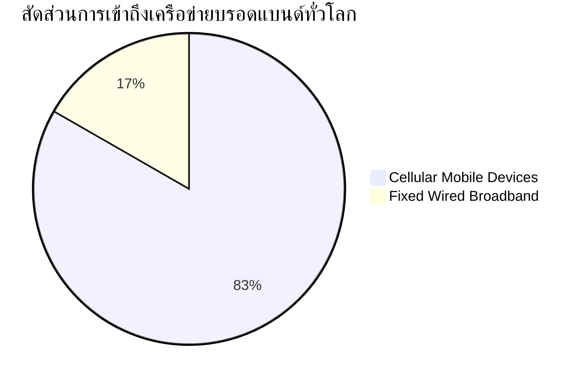
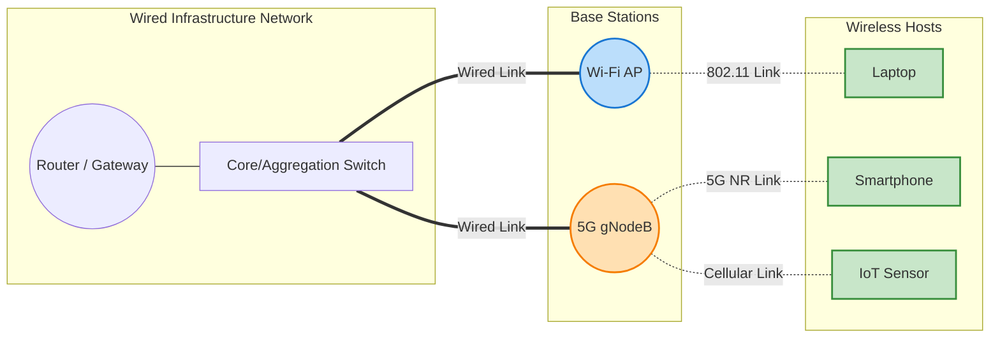
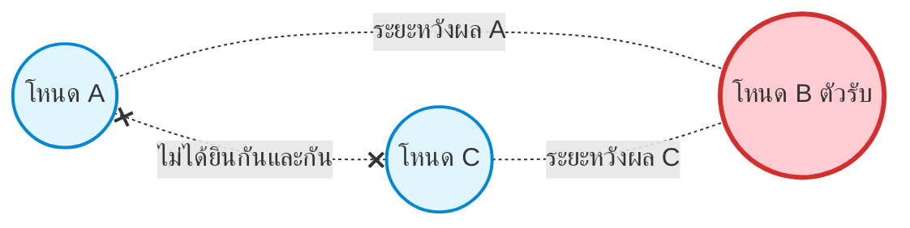
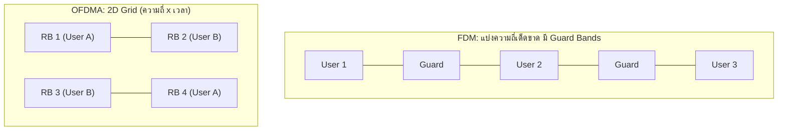
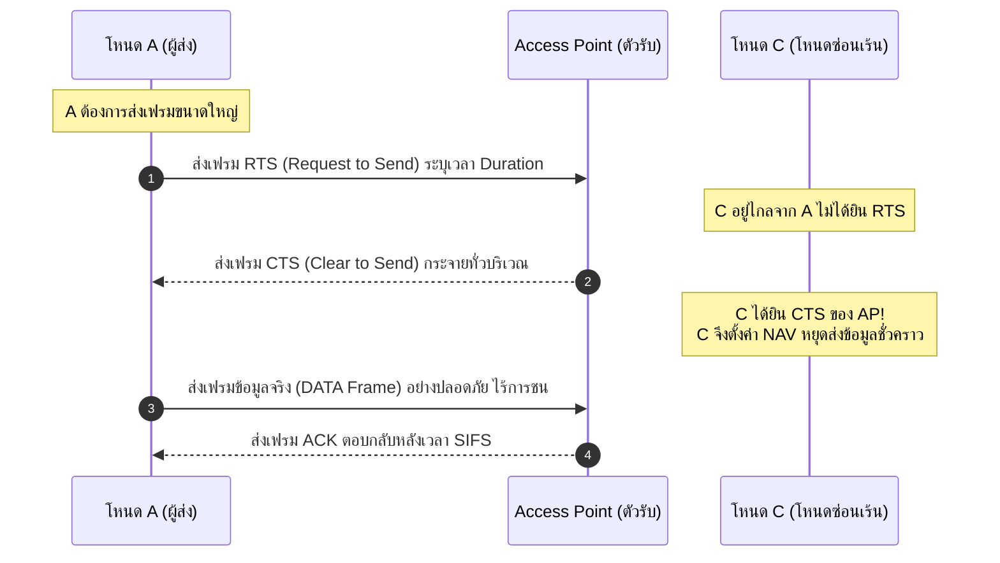
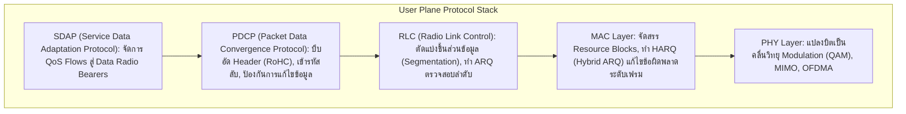
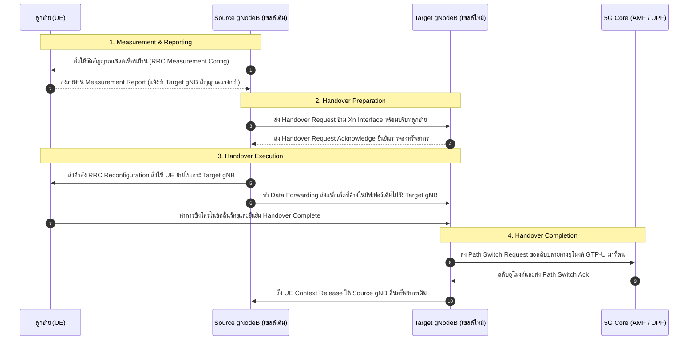

---
tags:
  - networking
  - chapter-07
  - wireless
  - mobile-networks
  - wifi
  - 802-11
  - 5g
  - 5g-ran
  - 5g-core
  - mimo
  - ofdma
  - csma-ca
  - mobility
  - handover
  - bluetooth
  - ble
  - satellite
  - starlink
  - iot
  - lora
  - nbiot
  - zigbee
created: 2026-10-04
updated: 2026-10-04
type: master-lecture-note
---

# 📡 Chapter 07: Wireless and Mobile Networks (ฉบับสมบูรณ์ v9.0 ครอบคลุม 154 สไลด์)

> [!SUMMARY] **บทสรุปและจุดมุ่งหมายหลักของเอกสาร (Comprehensive Master Lecture Guide)**
> เอกสารฉบับนี้รวบรวมและเรียบเรียงเนื้อหาจากสไลด์การสอน **Chapter 7: Wireless and Mobile Networks (Kurose & Ross 9th Edition 2025/2026)** ครบถ้วน **154 สไลด์** โดยไม่มีการตัดทอนหรือข้ามหัวข้อ เจาะลึกกลไกการทำงานระดับ Low-level พร้อมแผนภาพโครงสร้างสถาปัตยกรรม (Mermaid Diagrams), ตารางเปรียบเทียบเชิงวิศวกรรม, ลำดับเวลาการส่งสัญญาณ (Sequence Flow), สูตรคำนวณและทฤษฎีทางคณิตศาสตร์, พร้อมทั้งผสาน **บันทึกโน้ตสดภาษาไทยของอาจารย์จากห้องเรียน** ไว้อย่างสมบูรณ์แบบที่สุด

---

## 📑 สารบัญเนื้อหาหลัก (Master Table of Contents)

1. [[#1. บทนำและองค์ประกอบสถาปัตยกรรมเครือข่ายไร้สาย (Slides 1–12)|1. บทนำและองค์ประกอบสถาปัตยกรรมเครือข่ายไร้สาย (Slides 1–12)]]
   - [[#1.1 บริบทและสถิติการเติบโตของเครือข่ายเคลื่อนที่|1.1 บริบทและสถิติการเติบโตของเครือข่ายเคลื่อนที่]]
   - [[#1.2 ขอบเขตการประยุกต์ใช้งานไร้สาย 6 รูปแบบ (Application Areas)|1.2 ขอบเขตการประยุกต์ใช้งานไร้สาย 6 รูปแบบ]]
   - [[#1.3 องค์ประกอบหลัก 4 ส่วนของเครือข่ายไร้สาย (Elements of Wireless Networks)|1.3 องค์ประกอบหลัก 4 ส่วนของเครือข่ายไร้สาย]]
   - [[#1.4 การเปรียบเทียบระยะทางและอัตราการส่งข้อมูลของลิงก์ไร้สาย|1.4 การเปรียบเทียบระยะทางและอัตราการส่งข้อมูลของลิงก์ไร้สาย]]
   - [[#1.5 เครือข่ายส่วนริมและแกนกลาง (Edge vs Core: Wi-Fi vs 5G)|1.5 เครือข่ายส่วนริมและแกนกลาง (Edge vs Core)]]
2. [[#2. ฟิสิกส์คลื่นวิทยุและกายภาพ Physical Layer (Slides 13–48)|2. ฟิสิกส์คลื่นวิทยุและกายภาพ Physical Layer (Slides 13–48)]]
   - [[#2.1 หลักการคลื่นแม่เหล็กไฟฟ้าและการสร้างสัญญาณสื่อสาร|2.1 หลักการคลื่นแม่เหล็กไฟฟ้าและการสร้างสัญญาณสื่อสาร]]
   - [[#2.2 คุณสมบัติพื้นฐานของคลื่นวิทยุ: ความถี่, ความยาวคลื่น, และกำลังส่ง|2.2 คุณสมบัติพื้นฐานของคลื่นวิทยุ]]
   - [[#2.3 ความแตกต่างระหว่าง Spectrum, Channel, Radio Bandwidth และ Link Bandwidth|2.3 นิยาม Bandwidth, Spectrum, Channel]]
   - [[#2.4 อุปสรรคในช่องสัญญาณ: สัญญาณกวน (Interference) vs สัญญาณรบกวน (Noise)|2.4 Interference vs Noise และค่า SNR]]
   - [[#2.5 ทฤษฎีขีดความสามารถช่องสัญญาณของแชนนอน (Shannon-Hartley Capacity)|2.5 ทฤษฎีความจุสูงสุดของ Shannon]]
   - [[#2.6 การลดทอนตามระยะทาง (Path Loss) และปัญหาโหนดซ่อนเร้น (Hidden Terminal Problem)|2.6 Path Loss & Hidden Terminal Problem]]
   - [[#2.7 การแพร่กระจายหลายทิศทาง (Multipath Propagation) และ ISI|2.7 Multipath Propagation & ISI]]
   - [[#2.8 เทคโนโลยีสายอากาศและการรับส่งหลายช่องสัญญาณ (MIMO)|2.8 MIMO: Spatial Diversity vs Multiplexing, SU vs MU]]
   - [[#2.9 ย่านความถี่คลื่นวิทยุ: Wi-Fi Bands และ 5G Spectrum|2.9 ย่านความถี่ Wi-Fi และ 5G]]
   - [[#2.10 การเข้ารหัสแก้ไขข้อผิดพลาดและการมอดูเลชันดิจิทัล (Coding & Modulation)|2.10 Coding, ASK, PSK, QAM, Constellation & AMC]]
3. [[#3. สถาปัตยกรรมการเข้าถึงช่องสัญญาณและโพรโทคอล MAC (Slides 49–74)|3. สถาปัตยกรรมการเข้าถึงช่องสัญญาณและโพรโทคอล MAC (Slides 49–74)]]
   - [[#3.1 วิวัฒนาการ Multiple Access: FDM, OFDM และ OFDMA|3.1 FDM, OFDM, และ OFDMA Resource Blocks]]
   - [[#3.2 โพรโทคอล CSMA/CA และเหตุผลที่ไม่สามารถใช้ CSMA/CD ในเครือข่ายไร้สาย|3.2 CSMA/CA vs CSMA/CD]]
   - [[#3.3 กลไกการหลีกเลี่ยงการชนด้วย RTS/CTS Handshake และตัวชี้วัด NAV|3.3 RTS/CTS Handshake & Virtual Carrier Sensing (NAV)]]
   - [[#3.4 Multi-User RTS ในมาตรฐาน Wi-Fi ยุคใหม่|3.4 Multi-User RTS (MU-RTS)]]
   - [[#3.5 โครงสร้างเฟรม IEEE 802.11 และเหตุผลของการมี Address ถึง 4 ฟิลด์|3.5 โครงสร้างเฟรม 802.11 และ Address 1–4]]
   - [[#3.6 บทสรุปสังเคราะห์: A Day in the Life of a Web Request over Wi-Fi|3.6 Synthesis: A Day in the Life over Wi-Fi]]
4. [[#4. สถาปัตยกรรมเครือข่ายเข้าถึงคลื่นวิทยุ 5G (5G RAN, Slides 75–97)|4. สถาปัตยกรรมเครือข่ายเข้าถึงคลื่นวิทยุ 5G (Slides 75–97)]]
   - [[#4.1 องค์ประกอบเชิงสถาปัตยกรรมของระบบ 5G|4.1 องค์ประกอบสถาปัตยกรรม 5G]]
   - [[#4.2 โครงสร้างช่องสัญญาณ 5G: Logical, Transport และ Physical Channels|4.2 ลำดับชั้นช่องสัญญาณ 5G]]
   - [[#4.3 โปรโตคอลสแตกของ 5G RAN (User Plane & Control Plane)|4.3 RAN Protocol Stack (SDAP, PDCP, RLC, MAC, PHY)]]
   - [[#4.4 ท่อส่งข้อมูล RAN Packet Processing Pipeline|4.4 RAN Packet Processing Pipeline]]
   - [[#4.5 สถาปัตยกรรมแยกส่วน Split RAN (CU, DU, RU) และ Open RAN (O-RAN)|4.5 Split RAN, Open RAN และ SD-RAN]]
5. [[#5. การเข้าร่วมเครือข่ายและการจัดสรรทรัพยากรคลื่นวิทยุ (Slides 98–119)|5. การเข้าร่วมเครือข่ายและการจัดสรรทรัพยากรคลื่นวิทยุ (Slides 98–119)]]
   - [[#5.1 กลไกการเกาะสัญญาณเข้าสู่ขอบเครือข่าย: Beaconing vs Probing|5.1 การเกาะสัญญาณ: Beaconing vs Probing & 5G RACH]]
   - [[#5.2 ปัจจัยในการจัดตารางเวลา: CQI, SINR, และคลาสบริการ QCI / 5QI|5.2 ปัจจัยการจัดตารางเวลา: CQI & QCI]]
   - [[#5.3 การเปรียบเทียบ 4 อัลกอริทึม RAN Scheduling|5.3 อัลกอริทึมจัดตาราง: Priority, Max TP, BET, Proportional Fair]]
   - [[#5.4 กลไกการประหยัดพลังงานแบตเตอรี่ (DRX Cycles)|5.4 การประหยัดพลังงานแบตเตอรี่: DRX Sleep/Awake Cycles]]
6. [[#6. สถาปัตยกรรมแกนกลางเครือข่าย 5G (5G Core Network, Slides 120–129)|6. สถาปัตยกรรมแกนกลางเครือข่าย 5G (Slides 120–129)]]
   - [[#6.1 การแยกส่วนระนาบควบคุมและข้อมูล (CUPS Architecture)|6.1 สถาปัตยกรรม CUPS]]
   - [[#6.2 บทบาทของ Network Functions ใน Service-Based Architecture (SBA)|6.2 ฟังก์ชันแกนกลาง: UPF, AMF, SMF, UDM, AUSF, NRF]]
   - [[#6.3 อุโมงค์ขนส่งข้อมูลผู้ใช้ (GTP-U Tunnels)|6.3 อุโมงค์ข้อมูล User Plane GTP-U]]
   - [[#6.4 ลำดับขั้นตอนการลงทะเบียนและเปิดเซสชัน (5G Registration & PDU Session)|6.4 ขั้นตอนการลงทะเบียนเข้าสู่ระบบ 5G]]
7. [[#7. การเคลื่อนที่และการส่งมอบสัญญาณ (Mobility & Handover, Slides 130–136)|7. การเคลื่อนที่และการส่งมอบสัญญาณ (Slides 130–136)]]
   - [[#7.1 สเปกตรัมของการเคลื่อนที่ในมุมมองเครือข่าย (Spectrum of Mobility)|7.1 สเปกตรัมของการเคลื่อนที่]]
   - [[#7.2 การโรมมิ่งในเครือข่าย Wi-Fi (802.11r Fast Transition)|7.2 การโรมมิ่งใน Wi-Fi]]
   - [[#7.3 ขั้นตอนการทำ Handover ในเครือข่าย 5G (Xn / N2 Handover)|7.3 ขั้นตอน 5G Handover 4 จังหวะ (Measurement, Prep, Exec, Complete)]]
8. [[#8. เครือข่ายไร้สายเฉพาะทาง: บลูทูธ, ดาวเทียม และ IoT (Slides 137–154)|8. เครือข่ายไร้สายเฉพาะทาง: บลูทูธ, ดาวเทียม และ IoT (Slides 137–154)]]
   - [[#8.1 เครือข่ายเฉพาะกิจไร้สาย (Wireless Ad-hoc Networks)|8.1 เครือข่าย Ad-hoc ไร้โครงสร้างพื้นฐาน]]
   - [[#8.2 เทคโนโลยีบลูทูธ (Bluetooth Classic & BLE, FHSS, Piconet, L2CAP)|8.2 เทคโนโลยีบลูทูธ & BLE]]
   - [[#8.3 เครือข่ายดาวเทียมสู่อินเทอร์เน็ต (GEO vs LEO Starlink & ISL)|8.3 เครือข่ายดาวเทียม: GEO vs LEO และเลเซอร์ข้ามดาวเทียม ISL]]
   - [[#8.4 เครือข่ายอินเทอร์เน็ตของสรรพสิ่ง (IoT LPWAN: LoRaWAN, NB-IoT, Zigbee)|8.4 เทคโนโลยี IoT: LoRaWAN, NB-IoT, Zigbee]]

---

# 1. บทนำและองค์ประกอบสถาปัตยกรรมเครือข่ายไร้สาย (Slides 1–12)

## 1.1 บริบทและสถิติการเติบโตของเครือข่ายเคลื่อนที่
ในปัจจุบัน การเข้าถึงอินเทอร์เน็ตของมนุษย์ได้เปลี่ยนผ่านจากการเชื่อมต่อแบบมีสาย (Fixed Broadband) สู่การเชื่อมต่อแบบไร้สาย (Wireless & Mobile Broadband) อย่างท่วมท้น โดยสถิติระดับโลกจาก Statista ระบุชัดเจนว่า:
- จำนวนอุปกรณ์ที่เชื่อมต่อผ่าน **Cellular Mobile Broadband มีสัดส่วนมากกว่า Fixed Wired Broadband ถึง 5 ต่อ 1** ตั้งแต่ปี 2019
- มากกว่า **80% ของครัวเรือน** ใช้งานบรอดแบนด์ผ่านเครือข่ายท้องถิ่นไร้สาย **Wi-Fi**
- มากกว่า **60% ของทราฟฟิกอินเทอร์เน็ตทั่วโลก** ที่วิ่งเข้าสู่เว็บไซต์หลัก มีปลายทางส่งไปยังอุปกรณ์พกพา (Mobile Devices)



## 1.2 ขอบเขตการประยุกต์ใช้งานไร้สาย 6 รูปแบบ (Application Areas)
สไลด์หน้า 5 จำแนกรูปแบบความต้องการของแอปพลิเคชันไร้สายออกเป็น 6 ขอบเขตหลัก:
1. **Wide-area Mobile Wireless Internet Access:** การเข้าถึงอินเทอร์เน็ตระยะไกลระดับกิโลเมตรของผู้ใช้ที่กำลังเคลื่อนที่ (เช่น 4G LTE, 5G บนสมาร์ตโฟน/ยานยนต์)
2. **Local-area Mobile Wireless Internet Access:** การเข้าถึงอินเทอร์เน็ตระยะใกล้ภายในอาคารหรือพื้นที่เฉพาะ (เช่น Wi-Fi ในบ้าน, สำนักงาน, มหาวิทยาลัย)
3. **Fixed Wireless Internet Access:** อินเทอร์เน็ตไร้สายประจำที่สำหรับบ้านหรือโรงงานแทนการเดินสายใยแก้ว (เช่น 5G FWA, ดาวเทียม)
4. **Satellite Networks for Internet Access & Sensing:** เครือข่ายดาวเทียมสำหรับพื้นที่ห่างไกลกลางทะเล ทะเลทราย หรือการสำรวจตรวจวัดระยะไกล (เช่น Starlink, GPS)
5. **Cable Replacement:** การแทนที่สายเคเบิลเพื่อเชื่อมต่ออุปกรณ์ระยะสั้น (เช่น Bluetooth ต่อหูฟัง, เมาส์, คีย์บอร์ด)
6. **Internet of Things (IoT):** เครือข่ายเซนเซอร์นับล้านตัวที่ต้องการใช้พลังงานต่ำ ส่งข้อมูลขนาดเล็กเป็นระยะ (เช่น LoRaWAN, NB-IoT, Zigbee)

## 1.3 องค์ประกอบหลัก 4 ส่วนของเครือข่ายไร้สาย (Elements of Wireless Networks)



> [!TIP] **โน้ตข้อความสอนสดจากอาจารย์ (Instructor Classroom Annotation - Slides 7–10):**
> 1. **Wireless Hosts:** เช่น Laptop, Smartphone และอุปกรณ์ IoT ซึ่งเป็นอุปกรณ์ที่รัน Applications และอาจเป็นอุปกรณ์ที่เคลื่อนที่หรืออยู่นิ่งก็ได้ $\implies$ **"Wireless does not always mean mobility!"** (การเป็นระบบไร้สายไม่ได้แปลว่าจะต้องเคลื่อนที่เสมอไป เช่น ตู้ ATM ไร้สาย, เครื่อง PC ที่ใช้การ์ด Wi-Fi)
> 2. **Base Station:** เป็นอุปกรณ์โครงสร้างพื้นฐานที่ช่วยให้อุปกรณ์ไร้สายเข้าใช้งานเครือข่าย (Wireless Network) เช่น เสาเซลลูลาร์ 4G eNB, 5G gNodeB หรือ Wi-Fi APs โดยในบริบทนี้ คำว่า **Relay** คือ *การรับข้อมูลจากฝั่งหนึ่ง (ไร้สาย) แล้วส่งต่อไปยังอีกฝั่งหนึ่ง (มีสาย)*
> 3. **Wireless Link:** ช่องทางสื่อสารที่ใช้คลื่นวิทยุเชื่อมต่ออุปกรณ์เข้าด้วยกัน ส่วนคำว่า **Ad-hoc** หมายถึง *เครือข่ายเฉพาะกิจที่อุปกรณ์เชื่อมต่อและสื่อสารกันเองโดยตรงโดยไม่ต้องมีอุปกรณ์ตัวกลาง (Base Station)*
> 4. **Wireless Device Radio:** อุปกรณ์ไร้สายหนึ่งเครื่องสามารถมีได้หลาย Radio สำหรับรองรับหลายเครือข่ายพร้อมกัน เช่น iPhone 16 เครื่องเดียวมีวิทยุประมาณ **11 radios** พร้อมสายอากาศมากมาย (Cellular 5 radios, Wi-Fi, Bluetooth, UWB, Satellite, NFC, GPS)

## 1.4 การเปรียบเทียบระยะทางและอัตราการส่งข้อมูลของลิงก์ไร้สาย
สไลด์หน้า 11 แสดงเมทริกซ์คุณลักษณะเชิงกายภาพของลิงก์ไร้สายสำคัญ:

| ขอบเขตระยะทาง | ระยะหวังผล | ตัวอย่างเทคโนโลยี | อัตราความเร็วข้อมูล (Data Rate) | ลักษณะเด่นและข้อสังเกต |
| :--- | :---: | :--- | :---: | :--- |
| **Indoor (ในอาคาร)** | 10–30 m | 802.11ax/be (Wi-Fi 6/7) | สูงถึง 1–10 Gbps | อัตราความเร็วสูงมาก แต่ทะลุกำแพงหนาได้จำกัด |
| **Outdoor (ระยะใกล้)** | 50–200 m | Wi-Fi Outdoor, 5G mmWave | 1–3.5 Gbps | ลำคลื่นแคบ ความหน่วงต่ำมาก |
| **Midrange (ระยะกลาง)** | 200 m – 4 km | 4G LTE, 5G Sub-6 GHz (C-band) | 50–600 Mbps | สมดุลยอดเยี่ยมระหว่างความเร็วและพื้นที่ครอบคลุม |
| **Long Range (ระยะไกล)** | 4 km – 15 km | 4G/5G Low-band (< 1 GHz), LoRa | 2–50 Mbps (หรือ kbps ใน IoT) | สัญญาณทะลุทะลวงสูง ครอบคลุมพื้นที่ชนบทกว้างขวาง |
| **Space (อวกาศ)** | 100s of km | LEO Satellites (Starlink) | 50–220 Mbps | สัญญาณยิงทะลุชั้นบรรยากาศ ความหน่วงต่ำกว่าดาวเทียมเดิม |

## 1.5 เครือข่ายส่วนริมและแกนกลาง (Edge vs Core: Wi-Fi vs 5G)
สไลด์หน้า 12 จำแนกโครงสร้างสถาปัตยกรรมระหว่างเครือข่าย Wi-Fi กับ 5G:
- **Wi-Fi:** อุปกรณ์ลูกข่าย $	o$ Wi-Fi Link $	o$ Access Point (AP) $	o$ เข้าสู่ระบบสาย Ethernet/Switch $	o$ Router/Gateway $	o$ Internet *(ทราฟฟิกเข้าสู่ Institutional Wired Network เป็นหลัก)*
- **5G:** Smartphone/UE $	o$ Radio Link (Uu Interface) $	o$ สถานีฐาน gNodeB $	o$ **5G Core Network** (มี Network Functions หลายส่วนสำหรับจัดการ Authentication, Session, Mobility, และ QoS) $	o$ Data Network / Internet

---

# 2. ฟิสิกส์คลื่นวิทยุและกายภาพ Physical Layer (Slides 13–48)

## 2.1 หลักการคลื่นแม่เหล็กไฟฟ้าและการสร้างสัญญาณสื่อสาร
การสื่อสารไร้สายอาศัยพื้นฐานของทฤษฎีคลื่นแม่เหล็กไฟฟ้า (Electromagnetics) 3 ลำดับขั้น:
1. กระแสไฟฟ้าที่เคลื่อนที่ไปมาในสายอากาศฝั่งส่ง (Transmitter Current)
2. ก่อให้เกิดสนามแม่เหล็กไฟฟ้าแผ่กระจายออกไปในอวกาศ (Electromagnetic Field)
3. สนามแม่เหล็กไฟฟ้านี้เหนี่ยวนำให้เกิดกระแสไฟฟ้าเหนี่ยวนำขนาดเล็กขึ้นที่สายอากาศฝั่งรับ (Induced Current at Receiver)

## 2.2 คุณสมบัติพื้นฐานของคลื่นวิทยุ
คลื่นวิทยุคือคลื่นแม่เหล็กไฟฟ้ารูปไซน์ที่มีพารามิเตอร์ทางคณิตศาสตร์ 4 ประการ:
1. **ความถี่ (Frequency: $f$):** จำนวนรอบการแกว่งตัวต่อหนึ่งวินาที หน่วยเป็น Hertz (Hz)
2. **ความยาวคลื่น (Wavelength: $\lambda$):** ระยะทางที่คลื่นเคลื่อนที่ได้ในหนึ่งรอบคลื่น หน่วยเป็นเมตร (m)
3. **ความเร็วแสงในสุญญากาศ ($c$):** $c pprox 3 	imes 10^8 	ext{ m/s}$  
   ความสัมพันธ์พื้นฐานคือ:
   $$\lambda = rac{c}{f}$$
4. **เฟส (Phase: $\phi$):** ตำแหน่งเชิงมุมของคลื่นในวงรอบ มีค่าระหว่าง $0^\circ$ ถึง $360^\circ$ ($0, rac{\pi}{2}, \pi, rac{3\pi}{2}, 2\pi$)
5. **กำลังของสัญญาณ (Power: $P$):** ความแรงของคลื่นวิทยุที่ถูกส่งออกจากสายอากาศ วัดเป็นมิลลิวัตต์ (mW) หรือเดซิเบลมิลลิวัตต์ (dBm):
   $$P_{	ext{dBm}} = 10 \log_{10}\left(rac{P_{	ext{mW}}}{1	ext{ mW}}
ight)$$

> [!TIP] **โน้ตข้อความสอนสดจากอาจารย์ (Instructor Classroom Annotation - Slides 15–17):**
> - **Frequency vs Wavelength:** Frequency คือจำนวนรอบต่อวินาที และ Wavelength คือหนึ่งรอบคลื่นยาวแค่ไหน **"Frequency สูง $\implies$ Wavelength สั้น"**
> - **Phase:** เราสามารถเปลี่ยน Phase ของคลื่นเพื่อแทนค่าบิต 0 กับ 1 ได้ โดยที่ Frequency ยังคงเท่าเดิม (เช่น BPSK สลับระหว่าง $0^\circ$ และ $180^\circ$)
> - **Power:** กำลังส่งบอกว่าคลื่นแรงแค่ไหน เช่น สมาร์ตโฟนทั่วไปส่งสัญญาณด้วยกำลัง $250	ext{ mW} pprox +24	ext{ dBm}$ (เหมือนกับหลอดไฟขนาด $10	ext{ W}$)

## 2.3 ความแตกต่างระหว่าง Spectrum, Channel, Radio Bandwidth และ Link Bandwidth
สไลด์หน้า 18 เน้นย้ำความแตกต่างเชิงนิยามที่มักเกิดความสับสน:
- **Spectrum:** ย่านความถี่ทั้งหมดที่พิจารณาในระบบ (เช่น ย่านความถี่ 2.4 GHz หรือ Sub-6 GHz)
- **Channel:** ช่องสัญญาณย่อยที่ถูกแบ่งซอยออกมาจาก Spectrum เพื่อให้ใช้งานร่วมกันได้โดยไม่กวนกัน (เช่น Wi-Fi Channel 6 ที่ความถี่ศูนย์กลาง 2.437 GHz)
- **Radio Bandwidth:** ความกว้างของช่วงความถี่ที่ช่องสัญญาณนั้นครอบครอง หน่วยเป็น **Hertz (Hz, kHz, MHz)** เช่น ช่องสัญญาณ Wi-Fi กว้าง 20 MHz หรือ 80 MHz
- **Link Bandwidth (Data Rate / Capacity):** ขีดความสามารถในการส่งข้อมูลที่เป็นเนื้อบิตจริงของลิงก์ หน่วยเป็น **bps, Mbps, Gbps**

> [!IMPORTANT]
> **มุมมอง Wired vs Wireless:**  
> - ในระบบมีสาย (Wired) เรามักสนใจเพียงว่า *"ส่งข้อมูลได้กี่ Mbps หรือ Gbps"*  
> - แต่ในระบบไร้สาย (Wireless) เราจำเป็นต้องใส่ใจทั้งสองมิติคือ *"ใช้ Spectrum กว้างกี่ MHz"* ควบคู่ไปกับ *"แปลงเป็น Throughput ได้กี่ Mbps"*

## 2.4 อุปสรรคในช่องสัญญาณ: สัญญาณกวน (Interference) vs สัญญาณรบกวน (Noise)
สไลด์หน้า 19–20 จำแนกความแตกต่างระหว่าง Interference และ Noise:
- **สัญญาณรบกวน (Noise: $N$):** พลังงานสัญญาณรบกวนแบบสุ่มที่เกิดขึ้นตามธรรมชาติในวงจรอิเล็กทรอนิกส์และตัวกลาง แม้จะไม่มีตัวส่งอื่นเปิดใช้งานอยู่เลย เช่น Thermal Noise ($N_0 = kTB$)
- **สัญญาณกวน (Interference: $I$):** พลังงานคลื่นที่มาจาก **อุปกรณ์ตัวส่งอื่น (Transmitters)** ที่ส่งสัญญาณเข้ามาในย่านความถี่เดียวกัน (Co-channel Interference) หรือย่านใกล้เคียง (Adjacent-channel Interference)
- **อัตราส่วนสัญญาณต่อสัญญาณรบกวน (Signal-to-Noise Ratio: SNR):**
  $$	ext{SNR} = rac{	ext{Signal Power }(S)}{	ext{Noise Power }(N)}$$
  $$	ext{SNR}_{	ext{dB}} = 10 \log_{10}\left(rac{S}{N}
ight)$$
  - **SNR สูง:** สัญญาณมีความเด่นชัดเหนือสัญญาณรบกวนมาก ตัวรับถอดรหัสบิตได้ง่าย อัตราความผิดพลาดของบิต (Bit Error Rate: BER) ต่ำ สามารถใช้มอดูเลชันระดับสูงได้
  - **SNR ต่ำ:** สัญญาณมีความแรงใกล้เคียงกับ Noise ตัวรับแยกแยะระดับแรงดันและเฟสได้ยาก เกิดบิตผิดพลาดสูง ต้องลดทอนระดับมอดูเลชันลงมาเป็น BPSK/QPSK

## 2.5 ทฤษฎีขีดความสามารถช่องสัญญาณของแชนนอน (Shannon-Hartley Capacity)
สไลด์หน้า 21 อ้างอิงสมการอมตะของ Claude Shannon ที่ระบุขีดจำกัดทางทฤษฎีว่า ช่องสัญญาณที่มีสัญญาณรบกวนจะสามารถส่งข้อมูลได้สูงสุดเท่าใด:
$$C = B \log_2(1 + 	ext{SNR})$$
โดยที่:
- $C$ = Theoretical Channel Capacity (บิตต่อวินาที: bps)
- $B$ = Radio Bandwidth ของช่องสัญญาณ (Hertz: Hz)
- $	ext{SNR}$ = อัตราส่วนกำลังสัญญาณต่อสัญญาณรบกวนในรูปสเกลาร์เชิงเส้น (Linear Scale ไม่ใช่หน่วย dB)

> [!EXAMPLE] **ตัวอย่างการคำนวณ Shannon Capacity ในห้องสอบ:**  
> สมมติช่องสัญญาณมี Bandwidth $B = 20	ext{ MHz}$ และวัดค่า $	ext{SNR}_{	ext{dB}} = 30	ext{ dB}$  
> 1. แปลง $	ext{SNR}$ เป็นสเกลาร์เชิงเส้น: $30	ext{ dB} = 10 \log_{10}(	ext{SNR}) \implies 	ext{SNR} = 10^{30/10} = 1,000$  
> 2. แทนค่าในสูตรของ Shannon:
>    $$C = 20 	imes 10^6 	imes \log_2(1 + 1000) pprox 20 	imes 10^6 	imes \log_2(1001) pprox 20 	imes 10^6 	imes 9.967 pprox 199.3	ext{ Mbps}$$

## 2.6 การลดทอนตามระยะทาง (Path Loss) และปัญหาโหนดซ่อนเร้น (Hidden Terminal Problem)
- **การลดทอนตามระยะทาง (Path Loss):** คลื่นวิทยุเมื่อแผ่ออกจากสายอากาศจะกระจายตัวออกเป็นทรงกลม ทำให้ความหนาแน่นของพลังงานลดลงตามระยะทาง $d$ โดยในพื้นที่ว่างเปล่า (Free Space) กำลังรับจะแปรผันตาม $rac{1}{d^2}$ และในสภาพแวดล้อมจริงที่มีสิ่งกีดขวางจะแปรผันตาม $rac{1}{d^3}$ ถึง $rac{1}{d^4}$
- **สูตร Free Space Path Loss:**
  $$	ext{FSPL} \propto (f \cdot d)^2$$
  *(ยิ่งความถี่ $f$ สูงเท่าใด และระยะทาง $d$ ไกลเท่าใด การลดทอนของสัญญาณก็จะยิ่งรุนแรงมากขึ้นเท่านั้น)*
- **ปัญหาโหนดซ่อนเร้น (Hidden Terminal Problem, สไลด์ 23–24):**



> [!WARNING] **นิยามและกลไกของ Hidden Terminal Problem:**
> - สถานการณ์ที่โหนด 2 ตัว (เช่น $A$ และ $C$) มองไม่เห็นหรือไม่ได้ยินการส่งสัญญาณของกันและกัน (เนื่องจากอยู่นอกระยะรับสัญญาณ หรือมีสิ่งกีดขวาง/กำแพงบดบัง)
> - แต่ทั้งสองโหนดต่างสามารถส่งสัญญาณไปถึงตัวรับตัวเดียวกัน ($B$) ได้
> - ผลลัพธ์: หากทั้ง $A$ และ $C$ ดักฟังสื่อแล้วคิดว่าช่องสัญญาณว่าง จึงเริ่มส่งเฟรมพร้อมกัน จะเกิด **การชนกันของสัญญาณ (Collision) ขึ้นที่ตัวรับ $B$** อย่างหลีกเลี่ยงไม่ได้

## 2.7 การแพร่กระจายหลายทิศทาง (Multipath Propagation) และ ISI
สไลด์หน้า 25–26 แสดงปรากฏการณ์ **Multipath Propagation**:
- สัญญาณจากตัวส่งเดินทางไปยังตัวรับผ่านเส้นทางที่หลากหลาย (Paths) เนื่องจากคลื่นเกิดการสะท้อน (Reflection), การหักเห (Refraction), และการกระเจิง (Scattering) กับตึก, กำแพง, พื้นผิวถนน
- คลื่นในแต่ละเส้นทางเดินทางด้วยระยะทางไม่เท่ากัน ทำให้มาถึงตัวรับ **ณ เวลาที่ต่างกัน (Delay Spread)**
- หากคลื่นสำเนาที่มาช้า ซ้อนทับเข้ากับสัญลักษณ์ (Symbol) ตัวถัดไป จะเกิดปรากฏการณ์ **Inter-Symbol Interference (ISI)** ทำให้ตัวรับถอดรหัสบิตผิดพลาด

## 2.8 เทคโนโลยีสายอากาศและการรับส่งหลายช่องสัญญาณ (MIMO)
สไลด์หน้า 27–33 นำเสนอเทคโนโลยี **MIMO (Multiple-Input Multiple-Output)** ซึ่งติดตั้งสายอากาศหลายต้นทั้งที่ตัวส่งและตัวรับ (เช่น $2 	imes 2, 4 	imes 4, 8 	imes 8$ MIMO โดยระบุเป็น $N_{	ext{Tx}} 	imes N_{	ext{Rx}}$):

| มิติการใช้งาน MIMO | กลไกการทำงาน (Working Mechanics) | วัตถุประสงค์หลัก (Primary Goal) |
| :--- | :--- | :--- |
| **Spatial Diversity** | ส่ง **ข้อมูลชุดเดียวกัน** พร้อมกันผ่านสายอากาศหลายต้นและหลายทิศทาง | **เพิ่มความน่าเชื่อถือและความเสถียร (Reliability)** หากสัญญาณเส้นทางหนึ่งอ่อน อีกเส้นทางหนึ่งยังคงรับได้ชัดเจน |
| **Spatial Multiplexing** | ส่ง **ข้อมูลคนละชุด (Independent Data Streams)** พร้อมกันบนความถี่เดียวกันผ่านสายอากาศคนละต้น | **เพิ่มอัตราความเร็วข้อมูล (Data Rate / Throughput)** ทวีคูณตามจำนวน Spatial Streams |
| **Single-User MIMO (SU-MIMO)** | สายอากาศหลายต้นของสถานีฐานสื่อสารกับ **อุปกรณ์ลูกข่ายเครื่องเดียว** ในแต่ละช่วงเวลา | เร่งความเร็วสูงสุดให้กับลูกข่ายรายบุคคล |
| **Multi-User MIMO (MU-MIMO)** | สายอากาศหลายต้นของสถานีฐานใช้เทคนิค Beamforming ส่งข้อมูลไปยัง **หลายอุปกรณ์พร้อมกัน** บนความถี่เดียวกัน | เพิ่มความจุและ Throughput รวมของระบบเซลล์ |

## 2.9 ย่านความถี่คลื่นวิทยุ: Wi-Fi Bands และ 5G Spectrum
สไลด์หน้า 34–36 แสดงการจัดสรรย่านความถี่วิทยุ:
- **Wi-Fi Spectrum Bands:**
  - **2.4 GHz Band:** มี 11–14 แชนเนล แต่มีเพียง **3 แชนเนลที่ไม่ทับซ้อนกันเลย (Non-overlapping Channels) คือ แชนเนล 1, 6, และ 11** สัญญาณทะลุกำแพงดี แต่มีสัญญาณกวนหนาแน่น
  - **5 GHz Band (UNII Bands):** รองรับแบนด์วิดท์กว้าง 40, 80, และ 160 MHz มีแชนเนลไม่ทับซ้อนกันจำนวนมาก ความเร็วสูง แต่ระยะสั้นลง
  - **6 GHz Band (Wi-Fi 6E / Wi-Fi 7):** แถบความถี่ใหม่เปิดกว้างถึง 1,200 MHz ไร้สัญญาณกวนจากอุปกรณ์ยุคเก่า รองรับแชนเนลกว้าง 320 MHz
- **5G Spectrum Bands (3 ชั้นความถี่):**
  - **Low-band (< 1 GHz):** ทะลุทะลวงสูง ครอบคลุมพื้นที่ระดับหลายสิบกิโลเมตร ความเร็วปานกลาง (50–100 Mbps)
  - **Mid-band / Sub-6 GHz / C-band (1–6 GHz):** หัวใจหลักของ 5G เชิงพาณิชย์ แบนด์วิดท์กว้าง 100 MHz ความเร็ว 200–600 Mbps ครอบคลุมระดับกิโลเมตร
  - **High-band / mmWave (24–40+ GHz):** ย่านมิลลิเมตรเวฟ แบนด์วิดท์มหาศาล 400–800 MHz ความเร็วพุ่งเกิน 2–4 Gbps แต่ระยะส่งสั้นมาก (100–300 เมตร) ถูกดูดกลืนด้วยฝน ใบไม้ และผนังอาคาร

## 2.10 การเข้ารหัสแก้ไขข้อผิดพลาดและการมอดูเลชันดิจิทัล (Coding & Modulation)
สไลด์หน้า 38–48 อธิบายการแปลงบิตดิจิทัลเป็นคลื่นอนาล็อก:
- **Error Detection & Correction (EDC / FEC):** ชั้น Physical Layer เพิ่มบิตตรวจสอบความถูกต้อง (เช่น Convolutional Codes, LDPC, Polar Codes) เพื่อให้ตัวรับแก้ไขบิตที่ผิดเพี้ยนได้เองโดยไม่ต้องขอให้ส่งใหม่
- **Digital Modulation Schemes:**
  - **ASK (Amplitude Shift Keying):** เปลี่ยนระดับความสูงต่ำของแอมพลิจูดเพื่อแทนบิต
  - **PSK (Phase Shift Keying):** เปลี่ยนเฟสของคลื่น เช่น BPSK (2 เฟส: $0^\circ, 180^\circ$ แทน 1 บิต/สัญลักษณ์) และ QPSK (4 เฟส: $0^\circ, 90^\circ, 180^\circ, 270^\circ$ แทน 2 บิต/สัญลักษณ์)
  - **QAM (Quadrature Amplitude Modulation):** ปรับเปลี่ยนทั้งแอมพลิจูดและเฟสพร้อมกันอย่างแม่นยำ

```text
+--------------------------------------------------------------------------+
|                  การเปรียบเทียบลำดับขั้นของระบบ QAM                      |
+---------------+-------------------+--------------------+-----------------+
|  รูปแบบ QAM   | จำนวนสัญลักษณ์ (M)| จำนวนบิตต่อสัญลักษณ์|  ระดับ SNR ที่ต้องการ|
+---------------+-------------------+--------------------+-----------------+
| QPSK (4-QAM)  |         4         |    2 bits/symbol   | ต่ำ (ทนทานมาก)    |
| 16-QAM        |        16         |    4 bits/symbol   | ปานกลาง         |
| 64-QAM        |        64         |    6 bits/symbol   | สูง             |
| 256-QAM       |       256         |    8 bits/symbol   | สูงมาก          |
| 1024-QAM      |      1024         |   10 bits/symbol   | สูงระดับห้องทดลอง |
| 4096-QAM      |      4096         |   12 bits/symbol   | สูงมาก (Wi-Fi 7)|
+---------------+-------------------+--------------------+-----------------+
```

- **Constellation Diagrams (แผนภาพกลุ่มดาว):** กราฟระนาบแกน $I$ (In-phase) และแกน $Q$ (Quadrature) แสดงพิกัดของแต่ละ Symbol การเกิด Noise ในช่องสัญญาณจะผลักจุดพิกัดให้คลาดเคลื่อน หากหลุดข้ามเส้นแบ่งการตัดสินใจ (Decision Boundary) จะทำให้เกิด Bit Error
- **Adaptive Modulation and Coding (AMC):** ระบบไร้สายจะประเมินค่า SNR ของช่องสัญญาณอย่างต่อเนื่อง หากอุปกรณ์อยู่ใกล้เสาและสัญญาณชัดเจน (High SNR) จะใช้มอดูเลชันระดับสูง (เช่น 256-QAM) เพื่อดันความเร็วสูงสุด แต่เมื่อเดินห่างออกไปจนสัญญาณอ่อน (Low SNR) จะปรับลดลงมาเป็น QPSK เพื่อรักษาการเชื่อมต่อไม่ให้หลุด

---

# 3. สถาปัตยกรรมการเข้าถึงช่องสัญญาณและโพรโทคอล MAC (Slides 49–74)

## 3.1 วิวัฒนาการ Multiple Access: FDM, OFDM และ OFDMA
สไลด์หน้า 50–58 เปรียบเทียบเทคโนโลยีการแบ่งช่องสัญญาณ 3 ยุค:
1. **FDM (Frequency Division Multiplexing):** แบ่งความถี่ออกเป็นช่วง ๆ โดยต้องเว้นระยะห่างของย่านป้องกัน (Guard Bands) เพื่อป้องกันสัญญาณกวนกัน ทำให้สิ้นเปลืองสเปกตรัม
2. **OFDM (Orthogonal FDM):** แบ่งคลื่นพาหะออกเป็นคลื่นพาหะย่อย (Subcarriers) นับร้อยนับพันคลื่น โดยแต่ละ Subcarrier ถูกจัดวางให้ **ตั้งฉากกันทางคณิตศาสตร์ (Mathematically Orthogonal)** ทำให้สัญญาณยอดสูงสุดของคลื่นหนึ่ง ตรงกับจุดตัดศูนย์พอดีของคลื่นข้างเคียง สามารถวางเหลื่อมซ้อนทับกันได้ 100% โดยไม่กวนกัน ช่วยเพิ่มประสิทธิภาพการใช้สเปกตรัมอย่างมหาศาล
3. **OFDMA (Orthogonal Frequency Division Multiple Access):** นำคลื่นพาหะย่อยของ OFDM มาจัดสรรให้ **ผู้ใช้งานหลายคนพร้อมกัน** ทั้งในมิติของความถี่และเวลา ผ่านหน่วยที่เรียกว่า **Resource Block (RB)** (โดย 1 RB ประกอบด้วย 12 Subcarriers ในเวลา 1 Slot)



## 3.2 โพรโทคอล CSMA/CA และเหตุผลที่ไม่สามารถใช้ CSMA/CD ในเครือข่ายไร้สาย
สไลด์หน้า 59–62 อธิบายหลักการของ **CSMA/CA (Carrier Sense Multiple Access with Collision Avoidance)**:

> [!WARNING] **คำถามยอดฮิตในห้องสอบ: ทำไม Wi-Fi จึงไม่ใช้ CSMA/CD เหมือน Ethernet?**
> 1. **ปัญหาพลังงานของตัวส่งกลบตัวรับ (Self-Interference):** กำลังส่งของสายอากาศตนเองมีพลังงานสูงกว่าสัญญาณที่รับเข้ามาจากระยะไกลหลายพันหลายหมื่นเท่า หากส่งสัญญาณออกไป สายอากาศจะไม่สามารถตรวจจับการชนกันของสัญญาณระดับเบาบางที่เกิดขึ้นในอากาศได้พร้อมกัน
> 2. **ปัญหาโหนดซ่อนเร้น (Hidden Terminal Problem):** ถึงแม้ฝั่งส่งจะสามารถฟังสายได้ แต่การชนกันมักไม่ได้เกิดขึ้นที่ตัวส่ง แต่ไปเกิดขึ้นที่ **ตัวรับ (Receiver)** โหนดผู้ส่งจึงไม่มีทางรู้ได้เลยว่าสัญญาณของตนกำลังชนกับโหนดอื่น

### ลำดับขั้นตอนการทำงานของ CSMA/CA:
1. สถานีส่งต้องการส่งเฟรม ต้องดักฟังช่องสัญญาณ (Carrier Sense)
2. หากช่องสัญญาณว่างอย่างต่อเนื่องเป็นเวลา **DIFS (Distributed Inter-Frame Space)**:
   - สุ่มเวลาถอยหลัง (Random Backoff) จากช่วง $[0, 	ext{CW}-1]$ โดยตัวนับเวลาจะนับถอยหลังเมื่อช่องสัญญาณว่าง
3. เมื่อตัวนับเวลาถอยหลังหมดลง $\implies$ ส่งเฟรมข้อมูลทันที
4. หากเกิดการชนหรือไม่ได้รับการตอบรับ ตัวแปร Contention Window ($	ext{CW}$) จะถูกขยายเป็นสองเท่าแบบทวีคูณ (Binary Exponential Backoff)
5. เมื่อตัวรับได้รับเฟรมสมบูรณ์และตรวจสอบ CRC ถูกต้อง ตัวรับจะรอเวลาสั้น ๆ คือ **SIFS (Short Inter-Frame Space)** แล้วส่งเฟรม **ACK** ยืนยันกลับมาทันที

## 3.3 กลไกการหลีกเลี่ยงการชนด้วย RTS/CTS Handshake และตัวชี้วัด NAV
สไลด์หน้า 63–64 แสดงกลไกการจองช่องสัญญาณล่วงหน้าเพื่อแก้ปัญหา Hidden Terminal:



- **Network Allocation Vector (NAV):** เป็นตัวตั้งเวลาถอยหลังเสมือน (Virtual Carrier Sensing) โดยเมื่อโหนด $C$ ได้ยินเฟรม CTS จะดึงค่าเวลาในฟิลด์ Duration มาตั้งเป็นค่า NAV และจะปิดการส่งสัญญาณของตนเองจนกว่า NAV จะนับถึงศูนย์

## 3.4 Multi-User RTS ในมาตรฐาน Wi-Fi ยุคใหม่
สไลด์หน้า 66–67 อธิบายการขยายขีดความสามารถของ RTS/CTS ในมาตรฐาน Wi-Fi 6 (802.11ax) และ Wi-Fi 7 (802.11be):
- Access Point ส่งเฟรม **Multi-User RTS (MU-RTS / Trigger Frame)** ตัวเดียว เพื่อสอบถามความพร้อมของลูกข่ายหลายเครื่องพร้อมกัน
- ลูกข่ายเหล่านั้นส่งเฟรม **Clear to Send (CTS)** ตอบกลับมายัง AP ในจังหวะเวลาเดียวกันผ่านคลื่นพาหะย่อยของ OFDMA

## 3.5 โครงสร้างเฟรม IEEE 802.11 และเหตุผลของการมี Address ถึง 4 ฟิลด์
สไลด์หน้า 71–73 เจาะลึกโครงสร้างเฟรมมาตรฐานของ Wi-Fi:

```text
+---------------------------------------------------------------------------------------+
|                         โครงสร้างเฟรม IEEE 802.11 MAC Frame                           |
+-------------+----------+-----------+-----------+-----------+----------+-----------+---+
| Frame Ctrl  | Duration | Address 1 | Address 2 | Address 3 | Seq Ctrl | Address 4 |...|
|  (2 Bytes)  | (2 Bytes)| (6 Bytes) | (6 Bytes) | (6 Bytes) | (2 Bytes)| (6 Bytes) |   |
+-------------+----------+-----------+-----------+-----------+----------+-----------+---+
```

> [!IMPORTANT] **หน้าที่ของ Address ทั้ง 4 ช่องในเฟรม Wi-Fi (Exam Critical):**
> 1. **Address 1 (Receiver Address):** MAC Address ของสถานีไร้สายที่ทำหน้าที่ **รับคลื่นวิทยุเฟรมนี้โดยตรง** (เช่น MAC ของ AP เมื่อส่งข้อมูลขึ้น)
> 2. **Address 2 (Transmitter Address):** MAC Address ของสถานีไร้สายที่ทำหน้าที่ **ส่งคลื่นวิทยุเฟรมนี้โดยตรง** (เช่น MAC ของเครื่องโฮสต์ผู้ส่ง)
> 3. **Address 3 (Router / Destination Address):** MAC Address ของเราเตอร์อินเทอร์เฟซ (Default Gateway) เพื่อให้ AP นำไปใส่เป็น Destination MAC เมื่อแปลงเฟรมเป็น Ethernet ส่งต่อเข้าสู่ระบบสาย
> 4. **Address 4 (Mesh / Ad-hoc / WDS Address):** ใช้เฉพาะในโหมดเชื่อมต่อระหว่าง AP กับ AP ข้ามสะพานไร้สาย (Wireless Distribution System) โดยไม่มีการแปลงเป็นสายแลน

## 3.6 บทสรุปสังเคราะห์: A Day in the Life of a Web Request over Wi-Fi
สไลด์หน้า 74 นำเสนอการบูรณาการขั้นตอนตั้งแต่เปิดเครื่องเชื่อมต่อ Wi-Fi จนถึงโหลดหน้าเว็บ:
1. **Joining & DHCP:** เชื่อมต่อ Wi-Fi AP $	o$ ส่ง DHCP Discover ข้าม Wi-Fi $	o$ ได้รับ IP Address, Subnet Mask, Default Gateway, และ DNS Server IP
2. **ARP Resolution:** ตรวจสอบ ARP Cache $	o$ ส่ง ARP Request หา MAC ของ Default Gateway Router
3. **DNS Query:** บรรจุ DNS Query ลงใน UDP/IP ข้าม Wi-Fi ไปยัง DNS Server เพื่อหา IP ของเว็บเซิร์ฟเวอร์
4. **TCP Three-Way Handshake:** ส่งแพ็กเก็ต TCP SYN ข้าม Wi-Fi ผ่านเราเตอร์ไปยังเว็บเซิร์ฟเวอร์ และรับ SYN-ACK
5. **HTTP Request/Response:** ส่ง HTTP GET ข้ามการเชื่อมต่อ TCP และรับข้อมูลเว็บเพจกลับมาแสดงผล

---

# 4. สถาปัตยกรรมเครือข่ายเข้าถึงคลื่นวิทยุ 5G (5G RAN, Slides 75–97)

## 4.1 องค์ประกอบเชิงสถาปัตยกรรมของระบบ 5G
สไลด์หน้า 76–78 จำแนกระบบ 5G ออกเป็น 3 ส่วนสำคัญ:
- **User Equipment (UE):** อุปกรณ์ของผู้ใช้งาน เช่น สมาร์ตโฟน, โมเด็ม 5G, กล้องวงจรปิด, ยานยนต์อัจฉริยะ
- **5G Radio Access Network (5G RAN):** ประกอบด้วยสถานีฐานยุคใหม่ที่เรียกว่า **gNodeB (Next-Generation Node B)** ทำหน้าที่ควบคุมการสื่อสารผ่านคลื่นวิทยุกับ UE
- **5G Core Network (5GC):** แกนกลางระบบเครือข่ายที่ควบคุมการลงทะเบียน, ความปลอดภัย, การส่งข้อมูล, และการจัดการเส้นทาง

## 4.2 โครงสร้างช่องสัญญาณ 5G: Logical, Transport และ Physical Channels
สไลด์หน้า 80–83 อธิบายการแบ่งระดับช่องสัญญาณออกเป็น 3 ลำดับชั้น:
1. **Logical Channels (ชนิดข้อมูลที่ส่งคืออะไร?):**
   - Control Channels: BCCH (Broadcast), PCCH (Paging), CCCH (Common Control), DCCH (Dedicated Control)
   - Traffic Channels: DTCH (Dedicated Traffic สำหรับส่งข้อมูลผู้ใช้)
2. **Transport Channels (มีวิธีการและเงื่อนไขในการส่งอย่างไร?):**
   - ขาลง (Downlink): BCH (Broadcast Channel), PCH (Paging Channel), DL-SCH (Downlink Shared Channel)
   - ขาขึ้น (Uplink): UL-SCH (Uplink Shared Channel), RACH (Random Access Channel)
3. **Physical Channels (ส่งบนคลื่นวิทยุและ Resource Blocks จุดไหน?):**
   - PBCH (Physical Broadcast), PDCCH (Physical Downlink Control), PDSCH (Physical Downlink Shared Data)
   - PRACH (Physical Random Access), PUCCH (Physical Uplink Control), PUSCH (Physical Uplink Shared Data)

## 4.3 โปรโตคอลสแตกของ 5G RAN (User Plane & Control Plane)
สไลด์หน้า 84 แสดง Protocol Stack ของฝั่งวิทยุระหว่าง UE กับ gNodeB:



- **Control Plane:** เพิ่มเลเยอร์ **RRC (Radio Resource Control)** สำหรับสร้าง/ตัดการเชื่อมต่อวิทยุ และส่งผ่านข้อความ **NAS (Non-Access Stratum)** ไปยัง 5G Core AMF โดยตรง

## 4.4 ท่อส่งข้อมูล RAN Packet Processing Pipeline
สไลด์หน้า 87–91 แสดงท่อการประมวลผลข้อมูลแพ็กเก็ต (Pipeline):
- **ฝั่งส่ง (Downlink Transmission):** IP Packet จาก Core $	o$ SDAP กำหนด QoS $	o$ PDCP เข้ารหัสความปลอดภัย $	o$ RLC ตัดแบ่งขนาดให้พอดีกับช่องสัญญาณ $	o$ MAC กำหนด Resource Blocks พร้อมแนบ Header และเปิดใช้ HARQ $	o$ PHY มอดูเลตและยิงสัญญาณผ่านสายอากาศ
- **ฝั่งรับ (Uplink / Receiver):** รับสัญญาณ $	o$ PHY ถอดรหัสคลื่น $	o$ MAC ตรวจสอบ HARQ $	o$ RLC ประกอบชิ้นส่วนคืนรูป $	o$ PDCP ถอดรหัสลับและคืนสภาพ Header $	o$ ส่งต่อขึ้นสู่เลเยอร์ถัดไป

## 4.5 สถาปัตยกรรมแยกส่วน Split RAN (CU, DU, RU) และ Open RAN (O-RAN)
สไลด์หน้า 92–97 อธิบายการปฏิวัติโครงสร้างสถานีฐานจากการเป็นตู้เหล็กผูกขาดชิ้นเดียว (Monolithic Base Station) สู่การแยกส่วนเชิงฟังก์ชัน (Functional Splits):

```mermaid
graph LR
    subgraph gNodeB_Architecture ["Open & Disaggregated 5G gNodeB"]
        RU["RU (Radio Unit)<br/>• RF & Low-PHY<br/>• อยู่บนเสาสัญญาณ"]
        DU["DU (Distributed Unit)<br/>• High-PHY, MAC, RLC<br/>• อยู่ใต้เสาหรือ Edge Cloud"]
        CU["CU (Central Unit)<br/>• PDCP, SDAP, RRC<br/>• อยู่ใน Data Center กลาง"]
    end

    RU ===|Fronthaul (eCPRI)| DU
    DU ===|Midhaul (F1 Interface)| CU
    CU ===|Backhaul (N3 Interface)| Core[5G Core Network]

    style RU fill:#ffcdd2,stroke:#d32f2f,stroke-width:2px
    style DU fill:#fff9c4,stroke:#fbc02d,stroke-width:2px
    style CU fill:#c8e6c9,stroke:#388e3c,stroke-width:2px
```

- **Open RAN (O-RAN) & Software-Defined RAN (SD-RAN):**
  - เปิดอินเทอร์เฟซระหว่าง CU, DU, และ RU ให้เป็นมาตรฐานสากล ทำให้อุปกรณ์จากต่างผู้ผลิตสามารถต่อใช้งานร่วมกันได้
  - นำ **RAN Intelligent Controller (RIC)** มาควบคุมการจัดสรรคลื่นวิทยุผ่านปัญญาประดิษฐ์และ Machine Learning (Near-RT RIC ควบคุมภายใน 10–1000 ms, Non-RT RIC ควบคุมระดับนโยบาย > 1 วินาที)

---

# 5. การเข้าร่วมเครือข่ายและการจัดสรรทรัพยากรคลื่นวิทยุ (Slides 98–119)

## 5.1 กลไกการเกาะสัญญาณเข้าสู่ขอบเครือข่าย: Beaconing vs Probing
สไลด์หน้า 99–102 เปรียบเทียบกระบวนการที่อุปกรณ์ไร้สายค้นพบและเข้าร่วมเครือข่าย:
- **Beaconing (Passive Scanning):** อุปกรณ์ลูกข่ายจะคอยดักฟังสัญญาณเงียบ ๆ โดย Access Point จะส่งเฟรม **Beacon** ออกมาเป็นระยะ (ทุก ๆ 100 ms) กระจายชื่อ SSID, Supported Rates, และค่าพารามิเตอร์ของระบบ
- **Probing (Active Scanning):** อุปกรณ์ลูกข่ายเป็นฝ่ายส่งเฟรม **Probe Request** แบบกระจายเสียง (Broadcast) ออกไปในอากาศ แล้วคอยดักฟังเฟรม **Probe Response** ที่ตอบกลับมาจาก AP รอบข้าง
- **การเชื่อมต่อสู่ 5G Edge:**
  1. UE สแกนหาสัญญาณซิงโครไนซ์ **PSS (Primary Synchronization Signal)** และ **SSS (Secondary Synchronization Signal)** เพื่อตั้งค่าความถี่และระบุ Cell ID
  2. อ่านบล็อกข้อมูลระบบหลัก **MIB (Master Information Block)** จากช่องสัญญาณ PBCH
  3. อ่านบล็อกข้อมูลเสริม **SIBs (System Information Blocks)** เพื่อทราบค่าการตั้งค่าเครือข่าย
  4. ทำกระบวนการสุ่มเข้าใช้งานช่องสัญญาณ **RACH (Random Access Channel) 4 ขั้นตอน** เพื่อขอรับสิทธิการส่งข้อมูล

## 5.2 ปัจจัยในการจัดตารางเวลา: CQI, SINR, และคลาสบริการ QCI / 5QI
สไลด์หน้า 103–109 แสดงปัจจัยที่ตัวจัดตารางเวลา (Scheduler) ในสถานีฐานต้องนำมาใช้ตัดสินใจ:
- **Channel Quality Indicator (CQI):** ค่าตัวเลข 1–15 ที่ลูกข่าย UE วัดจากค่า Signal-to-Interference-plus-Noise Ratio (SINR) แล้วรายงานกลับไปยังสถานีฐาน เพื่อบอกว่าตนเองสามารถรับข้อมูลด้วยมอดูเลชันระดับใดได้โดยไม่ผิดพลาด
- **5G QoS Identifier (5QI / QCI):** คลาสคุณภาพบริการของแพ็กเก็ต:
  - **Guaranteed Bit Rate (GBR):** สัญญาณเสียง VoNR/VoLTE, สตรีมมิ่งสด ที่ต้องการันตีแบนด์วิดท์ขั้นต่ำ
  - **Non-GBR:** การโหลดเว็บ, อีเมล, ดาวน์โหลดไฟล์ทั่วไป

## 5.3 การเปรียบเทียบ 4 อัลกอริทึม RAN Scheduling
สไลด์หน้า 110–114 เจาะลึกอัลกอริทึมการจัดตารางเวลาของสถานีฐาน:

| อัลกอริทึมจัดตารางเวลา | กลไกและสูตรการคัดเลือก (Selection Rule) | ข้อดี (Advantages) | ข้อเสียและข้อจำกัด (Disadvantages) |
| :--- | :--- | :--- | :--- |
| **1. Strict Priority** | ให้บริการคิวที่มีความสำคัญสูงที่สุด (QCI สูง) ให้หมดก่อนเสมอ | ตอบสนองข้อมูลฉุกเฉินและเสียงแบบเรียลไทม์ได้ดีเยี่ยม | คิวที่มีความสำคัญต่ำจะเกิดภาวะอดตาย (Starvation) หากข้อมูลสำคัญหนาแน่น |
| **2. Maximum Throughput (Max CQI)** | เลือกส่งข้อมูลให้กับโหนด $i$ ที่มีคุณภาพช่องสัญญาณดีที่สุดในรอบนั้นเสมอ: $rg\max_i R_i(t)$ | ได้ Throughput รวมของทั้งเซลล์สูงที่สุดในทางคณิตศาสตร์ | ไม่มีความเป็นธรรม (Unfair) อุปกรณ์ที่อยู่ขอบเซลล์ (Cell Edge) จะไม่ได้รับบริการเลย |
| **3. Blind Equal Throughput (BET)** | พยายามเกลี่ยปริมาณ Throughput ที่ส่งมอบให้กับทุกโหนดให้เท่ากันอย่างสมบูรณ์ | มีความเป็นธรรมด้านผลลัพธ์ข้อมูลแก่ผู้ใช้ทุกคน | สิ้นเปลืองทรัพยากรคลื่นวิทยุอย่างมหาศาลกับเครื่องที่สัญญาณแย่ ทำให้ Throughput รวมตกต่ำ |
| **4. Proportional Fair (PF)** | เลือกโหนดที่ได้ค่าอัตราส่วนความเร็วขณะนั้นเทียบกับความเร็วเฉลี่ยสะสมสูงสุด: $rg\max_i rac{R_i(t)}{\overline{T}_i(t)}$ | **เป็นมาตรฐานสากลใน 4G/5G** สมดุลยอดเยี่ยมระหว่าง Throughput รวมและความเป็นธรรม | ต้องมีระบบติดตามและคำนวณค่าเฉลี่ยแบบเคลื่อนที่ของทราฟฟิกทุกลูกข่าย |

## 5.4 กลไกการประหยัดพลังงานแบตเตอรี่ (DRX Cycles)
สไลด์หน้า 115–119 อธิบายกลไก **DRX (Discontinuous Reception)** สำหรับสมาร์ตโฟน:
- วิทยุไร้สายเป็นส่วนที่ผลาญแบตเตอรี่มากที่สุด หากต้องเปิดฟังคลื่นตลอดเวลา แบตเตอรี่จะหมดอย่างรวดเร็ว
- **รอบการทำงาน (Sleep / Awake Cycle):**
  - เมื่อมีแพ็กเก็ตส่งถึงเครื่อง $\implies$ ทำงานและเริ่มจับเวลา **Inactivity Timer**
  - หากไม่มีข้อมูลใหม่เข้ามาจน Inactivity Timer หมดเวลา $\implies$ ชิปวิทยุจะปิดตัวเองลงสู่ **โหมดหลับ (Sleep Mode)**
  - อุปกรณ์จะตื่นขึ้นมาตรวจเช็กช่องสัญญาณ Paging เป็นช่วงสั้น ๆ (On-Duration) ตามรอบของ **Short DRX** หรือ **Long DRX**

---

# 6. สถาปัตยกรรมแกนกลางเครือข่าย 5G (5G Core Network, Slides 120–129)

## 6.1 การแยกส่วนระนาบควบคุมและข้อมูล (CUPS Architecture)
5G Core ถูกออกแบบตามแนวคิด **CUPS (Control and User Plane Separation)** อย่างเด็ดขาด:
- **User Plane:** มีหน้าที่เพียงอย่างเดียวคือการผลักดันแพ็กเก็ต (Packet Forwarding) ด้วยความเร็วสูงระดับเทราบิตต่อวินาที
- **Control Plane:** รวมศูนย์การควบคุม แยกฟังก์ชันออกเป็นหน่วยย่อยตามแนวคิด **Service-Based Architecture (SBA)**

## 6.2 บทบาทของ Network Functions ใน Service-Based Architecture (SBA)
สไลด์หน้า 122–125 แสดงองค์ประกอบหลักในแกนกลาง 5G:

```mermaid
graph TD
    subgraph ControlPlane_SBA ["5G Core Control Plane (HTTP/2 REST APIs)"]
        AMF[AMF: Access & Mobility Management]
        SMF[SMF: Session Management Function]
        UDM[UDM: Unified Data Management]
        AUSF[AUSF: Authentication Server]
        PCF[PCF: Policy Control Function]
        NRF[NRF: Network Repository Function]
    end

    subgraph UserPlane ["User Plane"]
        UPF[UPF: User Plane Function]
    end

    UE[User Equipment] -.-|Radio Link| gNB[gNodeB]
    gNB ===|N2 Interface (Control)| AMF
    gNB ===|N3 Interface (GTP-U User Data)| UPF
    SMF ===|N4 Interface (PFCP)| UPF
    UPF ===|N6 Interface| DataNetwork[Data Network / Internet]

    AMF --- SMF
    AMF --- AUSF
    AUSF --- UDM
    SMF --- PCF

    style UPF fill:#ffcdd2,stroke:#d32f2f,stroke-width:2px
    style AMF fill:#bbdefb,stroke:#1976d2,stroke-width:2px
    style SMF fill:#c8e6c9,stroke:#388e3c,stroke-width:2px
```

- **UPF (User Plane Function):** สถานีส่งต่อข้อมูล เป็นจุดเชื่อมต่อระหว่าง 5G RAN กับโลกภายนอก (Data Network), ทำหน้าที่ห่อหุ้ม/ถอดแคปซูลอุโมงค์ข้อมูล, และทำตัวเป็นจุดยึดตำแหน่ง (Mobility Anchor) เมื่อลูกข่ายเคลื่อนที่
- **AMF (Access and Mobility Management Function):** จัดการการเข้าถึง, รับการลงทะเบียนจากลูกข่าย, ตรวจสอบสถานะการเชื่อมต่อ และจัดการการเคลื่อนที่
- **SMF (Session Management Function):** ควบคุมการเปิดเซสชันการส่งข้อมูล, จัดสรรหมายเลข IP Address ให้แก่ลูกข่าย, และสั่งการ UPF ผ่านอินเทอร์เฟซ N4
- **UDM & AUSF:** จัดเก็บข้อมูลผู้ใช้และกุญแจความปลอดภัย ดำเนินการตรวจสอบความถูกต้องของ SIM Card โดยใช้รหัสระบุตัวตน **SUPI (Subscription Permanent Identifier)** และเข้ารหัสเป็น **SUCI (Subscription Concealed Identifier)** ในอากาศเพื่อความเป็นส่วนตัว
- **NRF (Network Repository Function):** เป็นสมุดหน้าเหลืองดิจิทัลที่ให้ Network Functions แต่ละตัวค้นหาบริการของกันและกันผ่าน RESTful API บนโพรโทคอล HTTP/2

## 6.3 อุโมงค์ขนส่งข้อมูลผู้ใช้ (GTP-U Tunnels)
สไลด์หน้า 126 ระบุว่า ระหว่างสถานีฐาน gNodeB กับ UPF ข้อมูลของผู้ใช้จะไม่ถูกส่งเป็นไอพีเปลือย แต่จะถูกห่อหุ้มเข้าไปในอุโมงค์ **GTP-U (GPRS Tunneling Protocol User Plane)** ซึ่งทำงานอยู่บน **UDP Port 2152** และครอบทับด้วยเครือข่าย IP ของผู้ให้บริการ (Underlay) ทำให้สามารถแยกแยะทราฟฟิกของผู้ใช้แต่ละคนได้อย่างอิสระผ่านค่า Tunnel Endpoint Identifier (TEID)

## 6.4 ลำดับขั้นตอนการลงทะเบียนและเปิดเซสชัน (5G Registration & PDU Session)
สไลด์หน้า 128–129 แสดงกระบวนการ 4 จังหวะในการเข้าสู่เครือข่าย:
1. **Registration Request:** ลูกข่ายส่งข้อความขอลงทะเบียนพร้อมส่ง SUCI ผ่าน gNodeB ไปยัง AMF
2. **Authentication & Security:** AMF ประสานงานกับ AUSF และ UDM เพื่อยืนยันตัวตนด้วยอัลกอริทึม 5G-AKA เมื่อผ่านแล้วจะเริ่มการเข้ารหัสสัญญาณควบคุม
3. **PDU Session Establishment:** ลูกข่ายขอสร้างเซสชันข้อมูล $\implies$ AMF ส่งคำขอไปยัง SMF $\implies$ SMF เลือกกำหนด UPF, ขอจัดสรรไอพีแอดเดรส และสร้างกฎ QoS
4. **Tunnel Setup:** SMF ส่งการตั้งค่าอุโมงค์ GTP-U ไปยัง UPF และแจ้ง gNodeB $\implies$ ท่อส่งข้อมูลเปิดใช้งาน ลูกข่ายส่งแพ็กเก็ตออกสู่อินเทอร์เน็ตได้ทันที

---

# 7. การเคลื่อนที่และการส่งมอบสัญญาณ (Mobility & Handover, Slides 130–136)

## 7.1 สเปกตรัมของการเคลื่อนที่ในมุมมองเครือข่าย (Spectrum of Mobility)
สไลด์หน้า 131 จำแนกระดับการเคลื่อนที่ของผู้ใช้:
- **No Mobility:** อุปกรณ์อยู่นิ่งตลอดเวลา (เช่น สมาร์ตทีวี, เดสก์ท็อป)
- **Mobility within same Access Network / Subnet:** เคลื่อนที่เปลี่ยนสถานีฐานแต่ยังคงอยู่ภายใต้ซับเน็ตเดียวกันและโครงข่ายเดียวกัน (การเปลี่ยน AP ในออฟฟิศ)
- **High Mobility across Cells:** เคลื่อนที่ด้วยความเร็วสูงข้ามเซลล์ (เช่น นั่งรถไฟฟ้าความเร็วสูง 300 กม./ชม. โดยการเชื่อมต่อต้องไม่สะดุด)
- **Heterogeneous Mobility:** เคลื่อนที่สลับไปมาระหว่างเทคโนโลยีที่แตกต่างกันโดยสิ้นเชิง เช่น สลับจาก Wi-Fi ในบ้านไปเป็น 5G ภายนอกบ้าน

## 7.2 การโรมมิ่งในเครือข่าย Wi-Fi
สไลด์หน้า 132 อธิบายการเคลื่อนที่ในระบบ Wi-Fi:
- หากอยู่ภายใน Extended Service Set (ESS) เดียวกันภายใต้ Subnet เดียวกัน ลูกข่ายจะส่งคำขอ Reassociation ไปยัง AP ตัวใหม่
- มาตรฐาน **IEEE 802.11r (Fast BSS Transition):** ช่วยลดเวลา Handshake ในการยืนยันตัวตนความปลอดภัย ทำให้การโทรศัพท์ผ่าน Wi-Fi (VoWiFi) ไม่เกิดอาการเสียงขาดหาย

## 7.3 ขั้นตอนการทำ Handover ในเครือข่าย 5G (Xn / N2 Handover)
สไลด์หน้า 133–136 นำเสนอลำดับขั้นตอนการย้ายเซลล์ (Handover) ในระบบ 5G อย่างละเอียด:



> [!NOTE] **จุดเด่นของการทำ Data Forwarding:**  
> ในระหว่างที่ UE กำลังจูนความถี่ไปยังเสาใหม่ แพ็กเก็ตที่ส่งมาจาก Core เข้าสู่เสาเดิมจะไม่ถูกทิ้ง (Zero Packet Loss) แต่เสาเดิมจะส่งต่อแพ็กเก็ตเหล่านี้ผ่านอินเทอร์เน็ตลิงก์ตรง (Xn Interface) ไปพักไว้ที่เสาใหม่ เพื่อรอส่งมอบให้แก่ UE ทันทีที่จูนเสร็จสิ้น

---

# 8. เครือข่ายไร้สายเฉพาะทาง: บลูทูธ, ดาวเทียม และ IoT (Slides 137–154)

## 8.1 เครือข่ายเฉพาะกิจไร้สาย (Wireless Ad-hoc Networks)
สไลด์หน้า 138 ชี้ให้เห็นว่าเครือข่าย Ad-hoc คือเครือข่ายที่อุปกรณ์สื่อสารกันเองโดยตรงโดยไม่ต้องมีสถานีฐานหรือเราเตอร์ตัวกลาง เช่น การแชร์ไฟล์ผ่าน AirDrop, Wi-Fi Direct หรือเครือข่ายยานยนต์ (VANET)

## 8.2 เทคโนโลยีบลูทูธ (Bluetooth Classic & BLE, FHSS, Piconet, L2CAP)
สไลด์หน้า 139–144 เจาะลึกโพรโทคอลบลูทูธ (IEEE 802.15.1):
- **คลื่นความถี่และเทคนิค FHSS:** ทำงานในย่าน 2.4 GHz ISM โดยใช้เทคนิค **Frequency Hopping Spread Spectrum (FHSS)** สลับกระโดดเปลี่ยนความถี่ถึง **1,600 ครั้งต่อวินาที** ข้าม 79 ช่องความถี่ (ใน Classic) หรือ 40 ช่องความถี่ (ใน BLE) เพื่อหลบหลีกสัญญาณกวนจาก Wi-Fi
- **Piconet & Scatternet Topology:**
  - **Piconet:** ประกอบด้วยอุปกรณ์ **Master 1 ตัว** และอุปกรณ์ **Slave สูงสุด 7 ตัวที่กำลัง Active** (และพักไว้ในโหมด Parked ได้ถึง 255 ตัว)
  - **Scatternet:** เกิดจากการนำ Piconet หลายวงมาเชื่อมต่อกัน โดยมีอุปกรณ์ตัวหนึ่งทำหน้าที่เป็น Bridge (เป็น Slave ในวงหนึ่ง และเป็น Master ในอีกวงหนึ่ง)
- **โปรโตคอล L2CAP (Logical Link Control & Adaptation Protocol):**
  - ทำหน้าที่คล้ายกับ Transport Layer ในสแต็กของบลูทูธ
  - ให้บริการมัลติเพล็กซ์แชนเนลเชิงตรรกะแบบ End-to-End
  - ทำหน้าที่ตัดแบ่งและประกอบแพ็กเก็ตข้อมูลขนาดใหญ่ (Segmentation and Reassembly: SAR)

## 8.3 เครือข่ายดาวเทียมสู่อินเทอร์เน็ต (GEO vs LEO Starlink & ISL)
สไลด์หน้า 145–150 เปรียบเทียบเทคโนโลยีการสื่อสารผ่านดาวเทียม:

| คุณลักษณะ | ดาวเทียมวงโคจรค้างฟ้า (GEO) | ดาวเทียมวงโคจรต่ำ (LEO: Starlink) |
| :--- | :--- | :--- |
| **ระดับความสูง (Altitude)** | **35,786 กิโลเมตร** | **500 – 1,200 กิโลเมตร** |
| **ตำแหน่งเทียบกับโลก** | อยู่นิ่งประจำที่สัมพัทธ์กับพื้นโลก (Geostationary) | เคลื่อนที่เร็วมาก โคจรรอบโลกครบ 1 รอบใน 90–120 นาที |
| **เวลาหน่วงการเดินทาง (Propagation Delay)** | **~250 ms ต่อเที่ยว (RTT พุ่งสูงเกิน 500–600 ms)** | **~10–20 ms ต่อเที่ยว (RTT ต่ำเพียง 25–45 ms ใกล้เคียงใยแก้ว)** |
| **จำนวนดาวเทียมที่ต้องการ** | ใช้เพียง 3 ดวงก็ครอบคลุมทั่วโลก (ยกเว้นขั้วโลก) | ต้องใช้กลุ่มดาวเทียม (Constellation) นับพันถึงนับหมื่นดวง |
| **สายอากาศฝั่งผู้ใช้** | จานพาราโบลาขนาดใหญ่ หันไปทางทิศเดิมตลอดเวลา | จานอิเล็กทรอนิกส์ **Phased Array** ส่ายลำคลื่นติดตามดาวเทียมอัตโนมัติ |

- **เลเซอร์เชื่อมต่อข้ามดาวเทียม (Inter-Satellite Links - ISL):**  
  ดาวเทียม Starlink ยุคใหม่ติดตั้งระบบสื่อสารด้วยแสงเลเซอร์ระหว่างดาวเทียมในอวกาศ ทำให้แพ็กเก็ตข้อมูลสามารถวิ่งข้ามทวีปผ่านอวกาศได้โดยตรง โดยแสงเดินทางในสุญญากาศเร็วกว่าแสงเดินทางในแก้วของสายใยแก้วนำแสงบนโลกถึงประมาณ **47%** ($c pprox 3	imes 10^8$ m/s เทียบกับ $2	imes 10^8$ m/s ในแก้ว)

## 8.4 เครือข่ายอินเทอร์เน็ตของสรรพสิ่ง (IoT LPWAN: LoRaWAN, NB-IoT, Zigbee)
สไลด์หน้า 151–153 สรุปเทคโนโลยีสำหรับเชื่อมต่ออุปกรณ์ IoT นับพันล้านชิ้น:
1. **LoRa / LoRaWAN (Long Range WAN):**
   - ใช้เทคนิคการกล้ำสัญญาณแบบ **Chirp Spread Spectrum (CSS)**
   - ทำงานบนคลื่นวิทยุที่ไม่ต้องขอใบอนุญาต (Unlicensed Sub-GHz: 868/915/920 MHz)
   - ระยะส่งไกลถึง 10–15 กิโลเมตร ทะลุทะลวงสิ่งแวดล้อมได้ดีเยี่ยม
   - อัตราการส่งข้อมูลต่ำ (0.3–50 kbps) แต่กินไฟน้อยมาก แบตเตอรี่อยู่ได้นานกว่า 10 ปี
2. **NB-IoT (Narrowband IoT):**
   - มาตรฐานเครือข่ายเซลลูลาร์ของกลุ่ม 3GPP ทำงานบนคลื่นที่ได้รับสัมปทาน (Licensed Spectrum)
   - ใช้ความกว้างช่องสัญญาณแคบเพียง **180 kHz** (เท่ากับ 1 Resource Block ของ LTE พอดี)
   - กำลังส่งสูง ทะลุทะลวงลงไปในชั้นใต้ดินและท่อระบายน้ำได้ดี สำหรับสมาร์ตมิเตอร์น้ำประปา/ไฟฟ้า
3. **Zigbee (IEEE 802.15.4):**
   - ทำงานในย่านความถี่ 2.4 GHz ระยะสั้น 10–100 เมตร
   - จุดเด่นคือรองรับสถาปัตยกรรมเครือข่ายแบบ **Mesh Topology** อุปกรณ์เซนเซอร์สามารถช่วยกันทวนสัญญาณส่งต่อเป็นทอด ๆ เหมาะสำหรับระบบบ้านอัจฉริยะ (Smart Home Automation)

---

## 🎯 สรุปภาพรวมและจุดเชื่อมโยงทั้งวิชา (Summary & Integration)
สไลด์หน้า 154 สรุปภาพรวมของวิชา Computer Networks:
เครือข่ายไร้สายและเคลื่อนที่ไม่ได้เข้ามาแทนที่ระบบอินเทอร์เน็ตเดิม แต่ทำหน้าที่เป็น **Access Network ชั้นยอด** ที่ขยายขอบเขตการเข้าถึงเครือข่ายไปสู่ทุกหนทุกแห่ง โดยเมื่อข้อมูลไร้สายหลุดพ้นจากสายอากาศของสถานีฐาน (Base Station) หรือ Access Point แล้ว ข้อมูลเหล่านั้นจะถูกห่อหุ้มและไหลเวียนผ่านสวิตช์และเราเตอร์ในระบบเครือข่ายมีสายตามหลักการของเลเยอร์ 1 ถึง 5 ที่ได้ศึกษามาตลอดทั้งวิชาอย่างกลมกลืนสมบูรณ์แบบ
