---
tags:
  - networking
  - chapter3
  - transport-layer
  - tcp
  - udp
  - rdt
  - congestion-control
  - quic
  - ecn
  - cubic
  - bbr
created: 2026-08-03
updated: 2026-08-03
type: wiki-note
---

# Chapter 3: Transport Layer (เลเยอร์นำส่งข้อมูล)

> [!SUMMARY] ภาพรวมประจำบท (Kurose & Ross 9th Edition Updated)
> โน้ตความรู้บทที่ 3 เจาะลึกเลเยอร์นำส่งข้อมูล (Transport Layer) ซึ่งทำหน้าที่เป็นสะพานเชื่อมการสื่อสารแบบโปรเซสถึงโปรเซส (Process-to-Process Logical Communication) ครอบคลุมหลักการ Multiplexing/Demultiplexing, โปรโตคอล UDP (Connectionless & Checksum), ทฤษฎีการส่งข้อมูลอย่างน่าเชื่อถือ (RDT 1.0 - 3.0 & Extended FSMs), โปรโตคอลท่อส่งข้อมูล (Pipelined Protocols: GBN vs SR), โครงสร้างโปรโตคอล TCP, การคำนวณ RTT/Timeout, การควบคุมการไหล (Flow Control), การจัดการเซสชันและ FSM (3-Way Handshake & Teardown), การควบคุมความคับคั่ง (AIMD, Slow Start, Congestion Avoidance, Fast Retransmit/Recovery, TCP Tahoe vs Reno), กลไกเครือข่ายช่วยแจ้งเตือน (ECN - Explicit Congestion Notification), อัลกอริทึมสมัยใหม่ (TCP CUBIC, Google BBR), การวิเคราะห์ Throughput บน Long Fat Pipes (LFP), และโปรโตคอลขนส่งยุคใหม่ QUIC over UDP (RFC 9000)

---

## 1. บริการของ Transport Layer และการ Demultiplexing

Transport Layer ทำหน้าที่สร้าง **Logical Communication** ระหว่างแอปพลิเคชันโปรเซส (Application Processes) ที่รันอยู่บนโฮสต์ต่างเครื่องกัน โดยอาศัยบริการ Best-Effort ของ Network Layer (IP Protocol) ซึ่งทำหน้าที่ส่งแพ็กเก็ตแบบ Host-to-Host

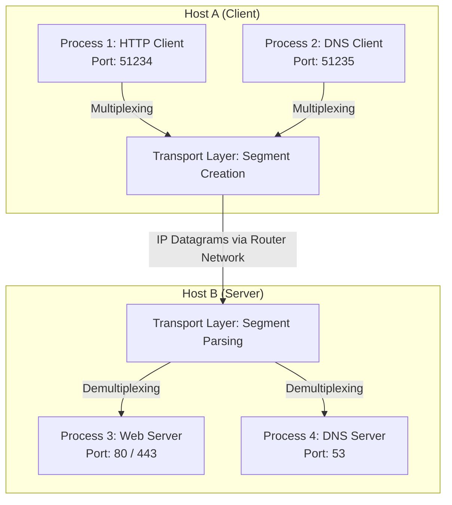

### 1.1 Multiplexing และ Demultiplexing
- **Multiplexing (ฝั่งส่ง):** การรวบรวมชิ้นส่วนข้อมูลจากหลายๆ ซ็อกเก็ต (Sockets) ใส่ Header ข้อมูลพอร์ต (Source & Destination Port Numbers) แล้วส่งลงไปยัง Network Layer
- **Demultiplexing (ฝั่งรับ):** การตรวจสอบ Header ของ Transport Segment เพื่อส่งมอบ Segment นั้นไปยังซ็อกเก็ตที่ถูกต้อง

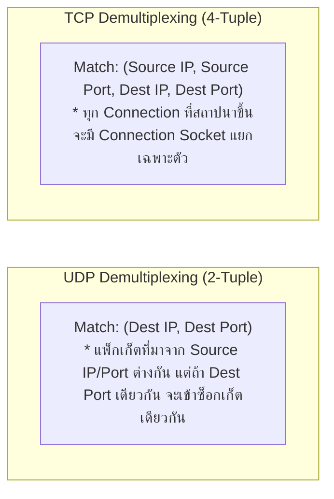

> [!INFO] พอร์ตหมายเลข (Port Numbers)
> Port Number มีขนาด 16 บิต ($0 - 65,535$) แบ่งออกเป็น 3 ช่วง:
> 1. **Well-Known Ports ($0 - 1,023$):** สงวนไว้สำหรับบริการมาตรฐาน (เช่น HTTP: 80, HTTPS: 443, SSH: 22, DNS: 53)
> 2. **Registered Ports ($1,024 - 49,151$):** สำหรับแอปพลิเคชันที่จดทะเบียน (เช่น MySQL: 3306, Redis: 6379)
> 3. **Dynamic / Private / Ephemeral Ports ($49,152 - 65,535$):** พอร์ตชั่วคราวที่ OS สุ่มให้ฝั่ง Client

---

## 2. โปรโตคอล UDP (User Datagram Protocol - RFC 768)

UDP เป็นโปรโตคอลนำส่งข้อมูลแบบ **Connectionless** (ไม่มีการสร้างการเชื่อมต่อก่อนส่ง) เป็นโปรโตคอลที่เรียบง่ายที่สุด โดยแทบไม่เพิ่มภาระ (Overhead) ใดๆ ครอบ IP Header

### 2.1 ข้อดีและคุณลักษณะของ UDP
1. **ไม่มี Connection Delay:** ไม่ต้องเสียเวลา 1 RTT ในการทำ 3-Way Handshake (ส่งข้อมูลได้ทันที)
2. **ไม่มี Connection State:** ไม่ต้องเก็บ State ในหน่วยความจำของเซิร์ฟเวอร์ (รองรับ Active Clients ได้เป็นจำนวนมาก)
3. **Header ขนาดเล็กมาก:** มีขนาดเพียง **8 Bytes** (เทียบกับ TCP ที่มีขนาดอย่างน้อย 20 Bytes)
4. **ไม่มี Congestion Control:** แอปพลิเคชันส่งข้อมูลออกไปได้ด้วยอัตราความเร็วตามที่ต้องการ โดยไม่ถูกชะลอความเร็วจากเครือข่าย

---

### 2.2 โครงสร้าง Header และการคำนวณ Checksum ของ UDP

```bitfield
0                   16                  31
+-------------------+-------------------+
|  Source Port (16) | Destination Port(16)|
+-------------------+-------------------+
|    Length (16)    |   Checksum (16)   |
+-------------------+-------------------+
|               Payload Data            |
+---------------------------------------+
```

> [!EXAMPLE] ขั้นตอนการคำนวณ UDP Checksum (1's Complement Sum)
> สมมติมีข้อมูล 16-bit 3 คำ ดังนี้:
> - คำที่ 1: `11100110 01100110` (0xE666)
> - คำที่ 2: `11010101 01010101` (0xD555)
> - คำที่ 3: `00000001 00000001` (0x0101)
>
> **ขั้นตอนการคำนวณ:**
> 1. บวกคำที่ 1 + คำที่ 2:
>    $$\begin{array}{r@{\quad}l}
>      11100110 & 01100110 \\
>    + 11010101 & 01010101 \\
>    \hline
>    1\,10111011 & 10111011 \quad (\text{เกิด Carry Bit ในตำแหน่ง 17}) \\
>    \to 10111011 & 10111100 \quad (\text{นำ Carry 1 มาบวกทบเข้าหลักหน่วย: End-Around Carry})
>    \end{array}$$
> 2. บวกผลลัพธ์กับคำที่ 3:
>    $$\begin{array}{r@{\quad}l}
>      10111011 & 10111100 \\
>    + 00000001 & 00000001 \\
>    \hline
>      10111100 & 10111101
>    \end{array}$$
> 3. ทำ **1's Complement (กลับบิต 0 เป็น 1 และ 1 เป็น 0):**
>    $$\text{Checksum} = \mathbf{01000011 \; 01000012} \quad (0x4342)$$
> *ฝั่งรับจะนำทุกคำรวมถึง Checksum มาบวกกัน หากได้ผลลัพธ์เป็น `11111111 11111111` แสดงว่าข้อมูลถูกต้องสมบูรณ์!*

---

## 3. ทฤษฎีการส่งข้อมูลอย่างน่าเชื่อถือ (Reliable Data Transfer: RDT)

การออกแบบกลไกส่งข้อมูลที่น่าเชื่อถือ (Reliable) บนเลเยอร์ล่างที่ไม่น่าเชื่อถือ (Unreliable IP Layer) มีวิวัฒนาการเชิงทฤษฎีตามลำดับ:

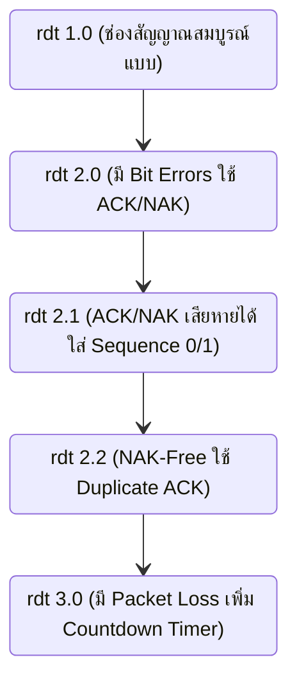

1. **rdt 1.0:** สมมติว่าช่องสัญญาณล่างสมบูรณ์แบบ ไม่มีข้อผิดพลาดและไม่มีแพ็กเก็ตสูญหาย
2. **rdt 2.0:** มี Bit Errors แก้ปัญหาโดยใช้ **ACK (Positive ACK)** และ **NAK (Negative ACK)** (กลไก ARQ - Automatic Repeat reQuest)
3. **rdt 2.1:** แก้ปัญหากรณีตัว **ACK/NAK เกิดความเสียหาย** โดยฝั่งส่งจะใส่ **Sequence Number (0 หรือ 1)** กำกับแพ็กเก็ต เพื่อให้ฝั่งรับแยกแยะได้ว่าเป็นแพ็กเก็ตใหม่หรือแพ็กเก็ตซ้ำ
4. **rdt 2.2:** **NAK-Free Protocol** ยกเลิกการใช้ NAK โดยเปลี่ยนมาส่ง ACK พร้อม Sequence Number ล่าสุดที่รับสำเร็จ หากฝั่งส่งได้รับ ACK ซ้ำ (Duplicate ACK) จะถือว่าเป็นการ NAK แพ็กเก็ตถัดไป
5. **rdt 3.0:** รองรับทั้ง Bit Errors และ **Packet Loss (แพ็กเก็ตสูญหาย)** โดยเพิ่ม **Countdown Timer** ฝั่งส่ง หากไทม์เอาต์จะส่งแพ็กเก็ตนั้นใหม่ทันที (Retransmit)

---

### 3.1 ประสิทธิภาพของ Stop-and-Wait Protocol
ใน rdt 3.0 การทำงานแบบ Stop-and-Wait ทำให้ประสิทธิภาพการใช้ลิงก์ (Sender Utilization) ต่ำมาก

$$U_{sender} = \frac{\frac{L}{R}}{RTT + \frac{L}{R}}$$

> [!EXAMPLE] คำนวณ Stop-and-Wait Utilization
> ลิงก์ความเร็ว $R = 1\text{ Gbps}$, RTT = $30\text{ ms}$, ขนาดแพ็กเก็ต $L = 1,000\text{ bytes} = 8,000\text{ bits}$
> - $d_{trans} = \frac{8,000}{10^9} = 0.008\text{ ms}$
> - $U_{sender} = \frac{0.008}{30 + 0.008} = \frac{0.008}{30.008} \approx 0.00027 \quad (0.027\%)$
> *สรุป: ท่อความเร็ว 1 Gbps ถูกใช้งานจริงเพียง 270 kbps เท่านั้น! จึงต้องนำระบบ Pipelining มาใช้*

---

### 3.2 โปรโตคอลท่อส่งข้อมูล (Pipelined Protocols: GBN vs SR)

**Pipelining** ยอมให้ฝั่งส่งสามารถส่งแพ็กเก็ตออกไปได้หลายแพ็กเก็ตล่วงหน้า (In-flight Unacknowledged Packets) ภายในขนาดของ Window ($N$)

| คุณลักษณะ (Property) | Go-Back-N (GBN) | Selective Repeat (SR) |
| :--- | :--- | :--- |
| **ลักษณะของ ACK** | **Cumulative ACK** (ACK $n$ หมายถึงได้รับแพ็กเก็ตถึง $n$ สมบูรณ์แล้ว) | **Individual ACK** (ACK แต่ละแพ็กเก็ตแยกกันอิสระ) |
| **Timer ฝั่งส่ง** | มี **Single Timer** สำหรับแพ็กเก็ตเก่าสุดที่ยังไม่ได้ ACK | มี **Timer แยกอิสระ** สำหรับทุกๆ แพ็กเก็ตที่ยังไม่ได้ ACK |
| **การ Retransmit เมื่อ Timeout** | ส่งใหม่ **ยกชุด** ตั้งแต่แพ็กเก็ตที่หายไปจนถึงแพ็กเก็ตล่าสุดใน Window | ส่งใหม่ **เฉพาะแพ็กเก็ตที่สูญหาย** เท่านั้น |
| **Buffer ฝั่งรับ** | **ไม่มี Buffer** ฝั่งรับ (หากรับแพ็กเก็ตข้ามลำดับจะทิ้งทันที) | **มี Buffer** สำหรับเก็บแพ็กเก็ตที่มาข้ามลำดับไว้รอเรียง |
| **ข้อจำกัด Window Size ($N$)** | $N \le 2^k - 1$ ($k$ คือจำนวนบิต Sequence) | $N \le 2^{k-1}$ (ป้องกันความสับสนของ Sequence Number) |

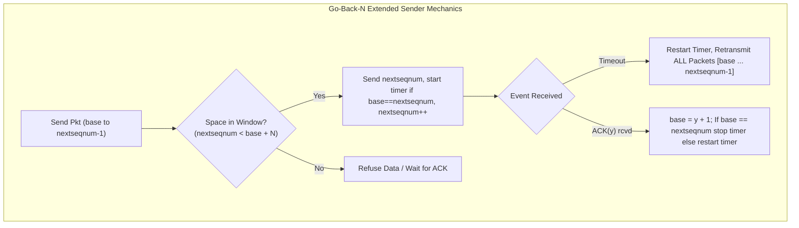

---

## 4. โปรโตคอล TCP (Transmission Control Protocol)

TCP (RFC 793, 1122, 2018, 5681) เป็นโปรโตคอลแบบ **Point-to-Point**, **Connection-Oriented**, **Reliable**, **In-order Byte Stream**, และรองรับ **Full Duplex Data**

### 4.1 โครงสร้าง Header ของ TCP (TCP Segment Format)

```bitfield
0                   15 16                   31
+---------------------+---------------------+
|  Source Port (16)   |  Destination Port(16)|
+---------------------+---------------------+
|           Sequence Number (32)            |
+-------------------------------------------+
|        Acknowledgment Number (32)         |
+-------+-------+-----+---------------------+
|DataOff|Rsvd(6)|Flags|  Receive Window (16)|
+-------+-------+-----+---------------------+
|    Checksum (16)    | Urgent Pointer (16) |
+---------------------+---------------------+
|               Options (Optional)          |
+-------------------------------------------+
|                   Payload                 |
+-------------------------------------------+
```

- **Sequence Number (32-bit):** หมายเลขไบต์แรกของข้อมูลใน Segment นั้น
- **Acknowledgment Number (32-bit):** หมายเลขไบต์ถัดไปที่ฝั่งรับ **กำลังรอคอย** จากฝั่งส่ง (Cumulative ACK)
- **Control Flags:**
  - `SYN`: เริ่มต้นสถาปนาการเชื่อมต่อ (Handshake)
  - `FIN`: ขอปิดการเชื่อมต่อ (Teardown)
  - `RST`: ยกเลิกการเชื่อมต่อทันที (Reset)
  - `ACK`: ยืนยันว่าฟิลด์ Acknowledgment Number มีผลใช้งาน
  - `PSH`: สั่งให้ส่งข้อมูลเข้าสู่ Application ทันที
  - `URG`: ข้อมูลด่วนพิเศษ

---

### 4.2 การประมาณค่า RTT และการกำหนด Timeout (TCP Timeout Estimation)

TCP คำนวณหาค่า Timeout จากการวัดค่า **SampleRTT** (เวลาส่ง Segment จนได้ ACK กลับมา)

1. **EstimatedRTT (Exponential Moving Average):**
   $$\text{EstimatedRTT} = (1 - \alpha) \cdot \text{EstimatedRTT} + \alpha \cdot \text{SampleRTT} \quad (\alpha = 0.125)$$
2. **DevRTT (ความผันผวนของ RTT):**
   $$\text{DevRTT} = (1 - \beta) \cdot \text{DevRTT} + \beta \cdot |\text{SampleRTT} - \text{EstimatedRTT}| \quad (\beta = 0.25)$$
3. **TimeoutInterval:**
   $$\text{TimeoutInterval} = \text{EstimatedRTT} + 4 \cdot \text{DevRTT}$$

> [!TIP] กลไก Fast Retransmit
> หาก Timeout มีระยะยาวเกินไป TCP มีกลไก **Fast Retransmit**: เมื่อฝั่งส่งได้รับ **ACK ซ้ำกัน 3 ครั้ง (3 Duplicate ACKs)** สำหรับแพ็กเก็ตเดิม TCP จะถือว่าแพ็กเก็ตถัดไปสูญหายแน่นอน และจะส่งแพ็กเก็ตนั้นใหม่ทันทีโดย **ไม่ต้องรอ Timeout!**

---

### 4.3 การควบคุมการไหลของข้อมูล (TCP Flow Control)

Flow Control ปรับความเร็วฝั่งส่งให้สอดคล้องกับความเร็วในการอ่านข้อมูลของแอปพลิเคชันฝั่งรับ เพื่อป้องกันไม่ให้ **Receive Buffer ล้น**

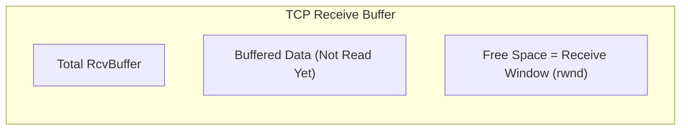

$$\text{rwnd} = \text{RcvBuffer} - [\text{LastByteRcvd} - \text{LastByteRead}]$$

- ฝั่งรับจะแนบค่า `rwnd` กลับไปใน Header ของทุกๆ ACK Segment
- ฝั่งส่งต้องควบคุมปริมาณข้อมูล In-flight ให้ไม่เกิน `rwnd`: ($\text{LastByteSent} - \text{LastByteAcked} \le \text{rwnd}$)

---

### 4.4 การจัดการเซสชันและ FSM (TCP Connection Management & Extended FSM)

#### 3-Way Handshake (การสร้างการเชื่อมต่อ)
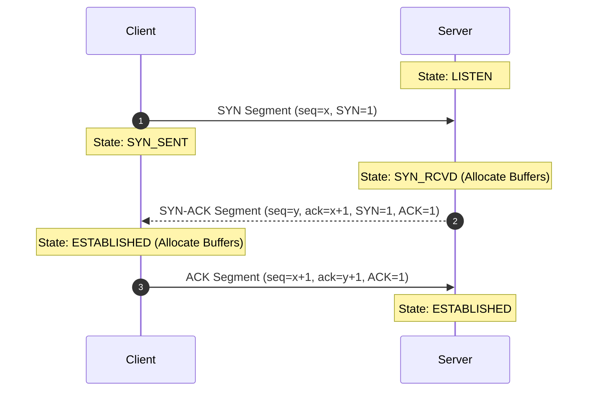

#### 4-Way Connection Teardown (การปิดการเชื่อมต่อ)
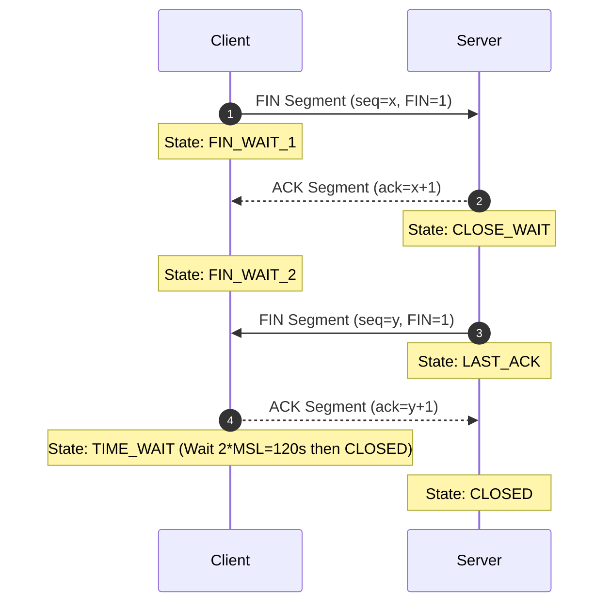

---

## 5. การควบคุมความคับคั่งของ TCP (TCP Congestion Control - Classic & Modern)

**Congestion Control** มีไว้เพื่อควบคุมปริมาณแพ็กเก็ตไม่ให้ล้น **Network Core Router Buffers** (ป้องกันปัญหา Buffer Overflow และ Congestion Collapse)

### 5.1 กลไกหลักของ TCP Congestion Control (AIMD)
TCP ปรับขนาดขนาดท่อส่งข้อมูลเรียกว่า **Congestion Window ($cwnd$)**
- **Additive Increase:** เพิ่มขนาด $cwnd$ ขึ้นทีละ $1\text{ MSS}$ ทุกๆ RTT เมื่อไม่มีแพ็กเก็ตสูญหาย
- **Multiplicative Decrease:** ลดขนาด $cwnd$ ลง **ครึ่งหนึ่ง** ($cwnd = cwnd / 2$) เมื่อตรวจพบแพ็กเก็ตสูญหาย

---

### 5.2 สถานะการทำงาน: Slow Start, Congestion Avoidance, และ Fast Recovery

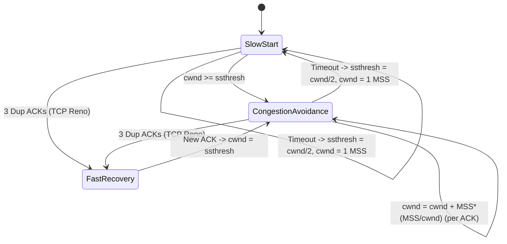

| เหตุการณ์ Loss Event | พฤติกรรมของ TCP Tahoe | พฤติกรรมของ TCP Reno |
| :--- | :--- | :--- |
| **เกิด Timeout** | - $\text{ssthresh} = cwnd / 2$<br/>- $cwnd = 1\text{ MSS}$<br/>- เข้าสู่ **Slow Start** | - $\text{ssthresh} = cwnd / 2$<br/>- $cwnd = 1\text{ MSS}$<br/>- เข้าสู่ **Slow Start** |
| **เกิด 3 Duplicate ACKs** | - $\text{ssthresh} = cwnd / 2$<br/>- $cwnd = 1\text{ MSS}$<br/>- เข้าสู่ **Slow Start** | - $\text{ssthresh} = cwnd / 2$<br/>- $cwnd = \text{ssthresh} + 3\text{ MSS}$<br/>- เข้าสู่ **Fast Recovery** (ไม่ต้องเริ่มจาก 1) |

---

### 5.3 เครือข่ายช่วยแจ้งเตือนความคับคั่ง (Explicit Congestion Notification: ECN - RFC 3168)

ในระบบดั้งเดิม TCP รับรู้ว่าเครือข่ายคับคั่งเมื่อเกิด **Packet Loss** (ทิ้งแพ็กเก็ต) เท่านั้น แต่ **ECN** ยอมให้เราเตอร์แจ้งเตือนก่อนที่แพ็กเก็ตจะถูกทิ้ง!

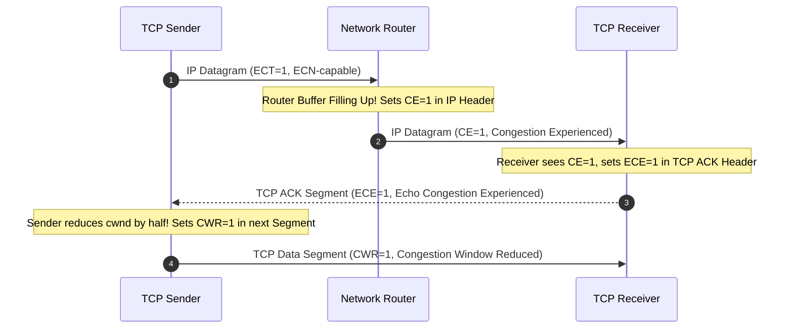

- **IP Header Bits (2-bit ECN field):** `ECT` (ECN-Capable Transport), `CE` (Congestion Experienced)
- **TCP Header Flags:** `ECE` (ECN-Echo), `CWR` (Congestion Window Reduced)

---

### 5.4 อัลกอริทึมควบคุมความคับคั่งยุคใหม่ (TCP CUBIC & Google BBR)

#### 1) TCP CUBIC (RFC 8312 - Default ใน Linux/Windows/macOS)
TCP ดั้งเดิมเพิ่ม $cwnd$ เป็นเส้นตรงตาม RTT ซึ่งทำให้โฮสต์ที่มี RTT สั้นได้เปรียบ TCP CUBIC แก้ปัญหานี้โดยใช้ **ฟังก์ชันกำลังสามของเวลา (Cubic Time Function)**:

$$W(t) = C \cdot (t - K)^3 + W_{max}$$

```mermaid
gantt
    title TCP CUBIC Window Growth Dynamics
    dateFormat X
    axisFormat %s
    section Window Progression
    Fast Recovery / Plateau near W_max : 0, 5
    Probing New Bandwidth (> W_max) : 5, 10
```

- **Plateau Behavior:** เมื่อเกิด Loss Event ให้บันทึกค่า $W_{max}$ ไว้ CUBIC จะเพิ่ม $cwnd$ อย่างรวดเร็วในช่วงแรก แล้วชะลอความเร็วเมื่อเข้าใกล้ $W_{max}$ (เพื่อรักษาเสถียรภาพ)
- **Bandwidth Probing:** หากผ่าน $W_{max}$ ไปแล้วไม่มี Loss จะเพิ่ม $cwnd$ ขึ้นอย่างก้าวกระโดดเพื่อค้นหาแบนด์วิดท์ใหม่
- **RTT Independence:** การเติบโตของ Window ขึ้นกับเวลาจริง $t$ ไม่ขึ้นกับค่า RTT ช่วยให้เกิดความเท่าเทียม (Fairness) ระหว่างลิงก์

#### 2) Google BBR (Bottleneck Bandwidth and RTT)
BBR เปลี่ยนแนวคิดจาก **Loss-based Congestion Control** มาเป็น **Model-based Rate Control**:
- วัดค่าความจุคอขวดสูงสุด ($BtlBw$) และ Round-Trip Propagation Time ต่ำสุด ($RTprop$)
- คำนวณ **Pacing Rate** $= BtlBw$ และจำกัดแพ็กเก็ต In-flight $= BtlBw \times RTprop$
- **ข้อดี:** ช่วยขจัดปัญหา **Bufferbloat** (คิวเราเตอร์เต็มส่งผลให้ Delay สูง) โดยไม่จำเป็นต้องรอให้แพ็กเก็ตสูญหาย

---

## 6. การวิเคราะห์ประสิทธิภาพ TCP บน Long Fat Pipes (LFP)

**Long Fat Pipes** คือเส้นทางสื่อสารที่มีความเร็วสูง (High Bandwidth) และมีความล่าช้าสูง (High RTT) เช่น ลิงก์ข้ามทวีป $10\text{ Gbps}$ ที่มี $\text{RTT} = 100\text{ ms}$

$$\text{Bandwidth-Delay Product (BDP)} = 10\text{ Gbps} \times 0.1\text{ s} = 10^9\text{ bits} = 12.5\text{ MB}$$

สูตรประมาณการ Throughput ของ TCP ภายใต้ความน่าจะเป็นของ Packet Loss ($p$):

$$\text{TCP Throughput} \le \frac{1.22 \times \text{MSS}}{\text{RTT} \times \sqrt{p}}$$

> [!WARNING] ข้อจำกัดของ TCP บน Long Fat Pipes
> สมมติ $\text{MSS} = 1,500\text{ Bytes}$, $\text{RTT} = 100\text{ ms}$ ต้องการ Throughput $10\text{ Gbps}$:
> - ความน่าจะเป็นของการเกิด Loss ($p$) จะต้องน้อยกว่า **$2 \times 10^{-10}$** (หรือหลุดได้เพียง 1 แพ็กเก็ตในทุกๆ 5,000,000,000 แพ็กเก็ต!)
> - นี่คือเหตุผลที่ต้องพัฒนา TCP Window Scaling Option (RFC 1323) และโปรโตคอลใหม่อย่าง QUIC

---

## 7. โปรโตคอลขนส่งยุคใหม่: QUIC (Quick UDP Internet Connections - RFC 9000)

QUIC เป็นโปรโตคอลเลเยอร์ขนส่งที่ทำงานอยู่บน **UDP** ออกแบบโดย Google และกลายมาเป็นมาตรฐานหลักของ **HTTP/3**

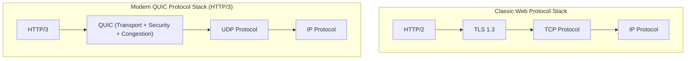

### 7.1 ฟีเจอร์สำคัญของ QUIC
1. **0-RTT / 1-RTT Connection Establishment:** รวมการ Handshake ของ Transport Layer และ TLS 1.3 ไว้ในขั้นตอนเดียว ช่วยลด Latency ในการเชื่อมต่อเซิร์ฟเวอร์
2. **แก้ปัญหา Head-of-Line (HOL) Blocking ในระดับ Stream:**
   - ใน TCP หากแพ็กเก็ตหนึ่งสูญหาย ท่อ TCP Byte Stream ทั้งหมดจะถูกระงับเพื่อรอ Retransmit
   - ใน QUIC ข้อมูลถูกแยกเป็น **Independent Streams** หาก Stream หนึ่งสูญหาย Stream อื่นๆ สามารถรับส่งต่อได้ทันทีโดยไม่ถูกบล็อก!
3. **Connection Migration (รองรับ Mobility):**
   - TCP อ้างอิง Connection ด้วย 4-Tuple (Source IP/Port, Dest IP/Port) เมื่อผู้ใช้สลับจาก Wi-Fi ไป 4G/5G เซสชันจะหลุดทันที
   - QUIC ใช้ **Connection ID (CID)** แบบสุ่มความยาว 64-bit แม้ IP/Port จะเปลี่ยนไป แต่ Connection ยังสามารถดำเนินต่อได้ราบรื่น

---

## 📚 อ้างอิงและโน้ตที่เกี่ยวข้อง
- 🔹 **[[Chapter 1 - Computer Networks and the Internet]]** - นิยาม Delay, Packet Loss และ Throughput
- 🔹 **[[Chapter 2 - Application Layer]]** - การใช้งาน Socket Interface ผ่าน TCP/UDP และ HTTP/3
- 🔹 **[[Chapter 4 - Network Data Plane]]** - การส่งมอบ Datagram ผ่าน IP Protocol
- 🔹 **[[Chapter 10 - Homework and Quiz Solution Guide]]** - เฉลยแบบฝึกหัด Assignments.pptx, การคำนวณ RTT Timeout, GBN/SR Trace Table, และ TCP Congestion Window
