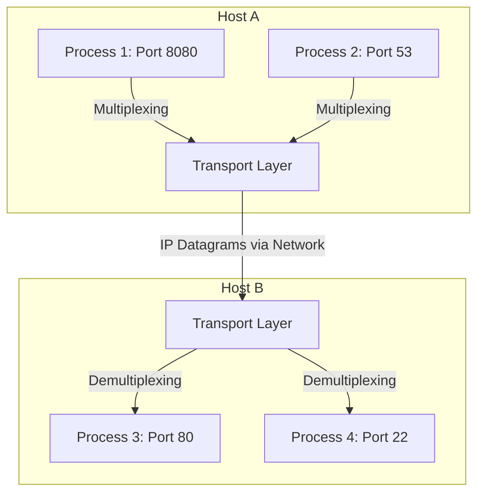
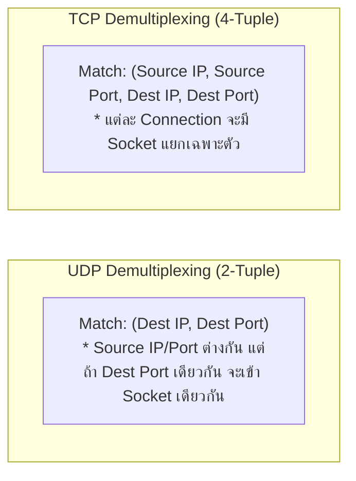
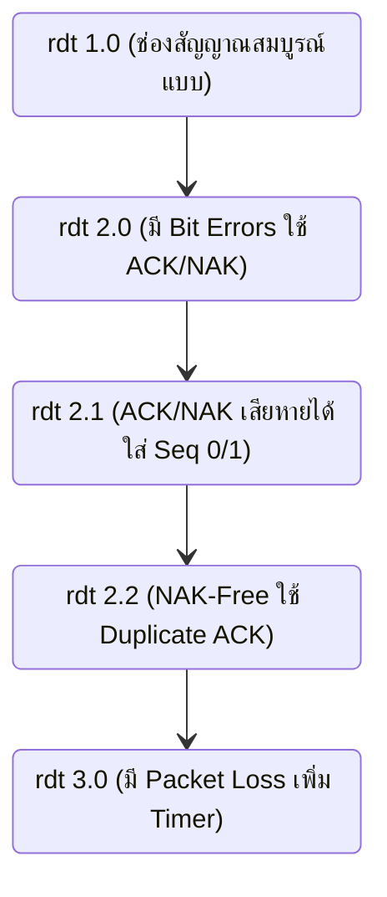
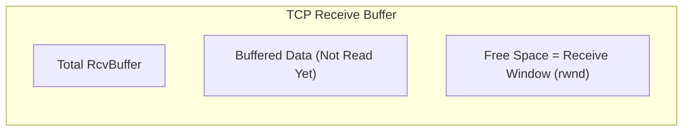
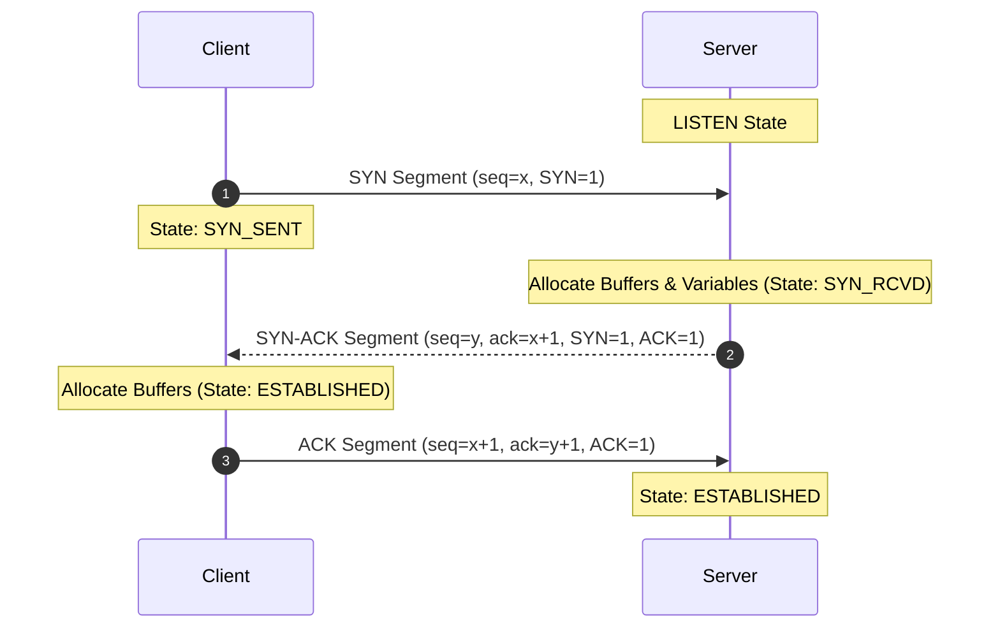
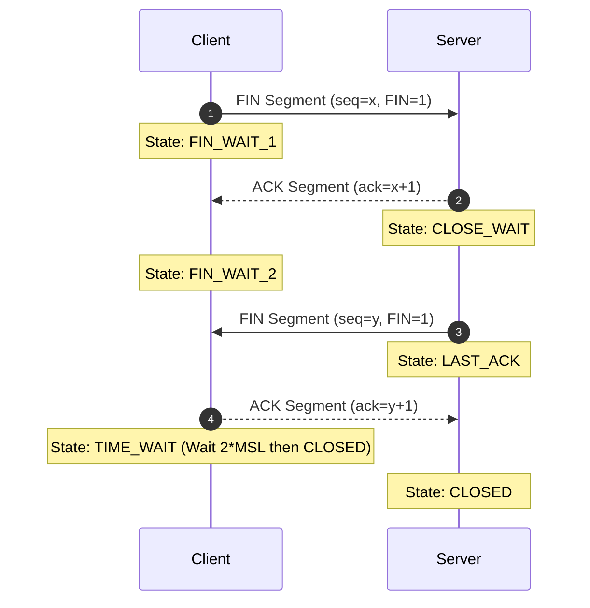
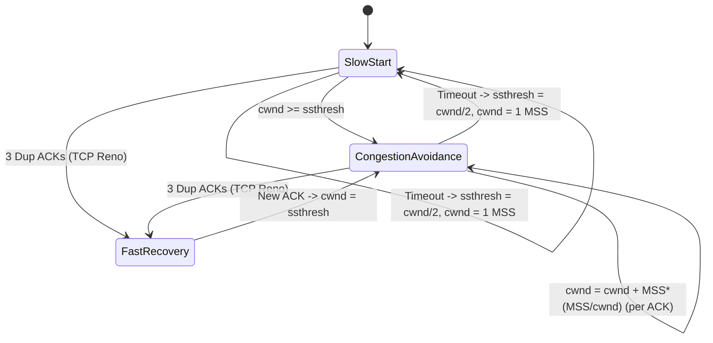

---
tags:
  - networking
  - chapter3
  - transport-layer
  - tcp
  - udp
  - rdt
  - congestion-control
created: 2026-08-03
updated: 2026-08-03
type: wiki-note
---

# Chapter 3: Transport Layer

> [!SUMMARY] ภาพรวมประจำบท
> โน้ตความรู้บทที่ 3 เจาะลึกเลเยอร์นำส่งข้อมูล (Transport Layer) ซึ่งทำหน้าที่เป็นสะพานเชื่อมระหว่างการสื่อสารระดับแอปพลิเคชัน (Process-to-Process Logical Communication) ครอบคลุมหลักการ Multiplexing/Demultiplexing, โปรโตคอล UDP (Connectionless & Checksum), ทฤษฎีการส่งข้อมูลอย่างน่าเชื่อถือ (RDT 1.0 - 3.0), โปรโตคอลท่อส่งข้อมูล (Pipelined Protocols: Go-Back-N vs Selective Repeat), โครงสร้างโปรโตคอล TCP, การคำนวณ RTT/Timeout, การควบคุมการไหล (Flow Control), การจัดการเชื่อมต่อ (3-Way Handshake & Teardown), และการควบคุมความคับคั่ง (Congestion Control: Slow Start, Congestion Avoidance, Fast Retransmit/Recovery, TCP Tahoe vs Reno)

---

## 1. บริการของ Transport Layer และการ Demultiplexing

Transport Layer ทำหน้าที่สร้าง **Logical Communication** ระหว่างแอปพลิเคชันโปรเซสที่รันอยู่บนคนละโฮสต์ โดยอาศัยบริการ Best-Effort ของ Network Layer (IP Protocol) ที่ทำหน้าที่ส่งแพ็กเก็ตระหว่างโฮสต์ (Host-to-Host)



### 1.1 Multiplexing และ Demultiplexing
- **Multiplexing (ฝั่งส่ง):** การรวบรวมชิ้นส่วนข้อมูลจากหลายๆ ซ็อกเก็ต (Sockets) ใส่ Header ข้อมูลพอร์ต (Port Numbers) แล้วส่งลงไปยัง Network Layer
- **Demultiplexing (ฝั่งรับ):** การตรวจสอบ Header ของ Transport Segment เพื่อส่งมอบ Segment นั้นไปยัง ซ็อกเก็ตที่ถูกต้อง



---

## 2. โปรโตคอล UDP (User Datagram Protocol)

UDP เป็นโปรโตคอลนำส่งข้อมูลแบบ **Connectionless** (ไม่มีการเชื่อมต่อ) ตามมาตรฐาน RFC 768 เป็นโปรโตคอลที่เรียบง่ายที่สุดโดยแทบไม่เพิ่มฟีเจอร์ใดๆ ครอบหัว IP

### 2.1 ข้อดีของ UDP
1. **ไม่มี Connection Delay:** ไม่ต้องเสียเวลาทำ 3-Way Handshake (ตอบสนองได้ทันที)
2. **ไม่มี Connection State:** ไม่ต้องเปลืองหน่วยความจำเก็บสถานะคอยดูเซสชันบนเซิร์ฟเวอร์
3. **Header มีขนาดเล็กมาก:** มีขนาดเพียง **8 Bytes** (เทียบกับ TCP ที่มีขนาดอย่างน้อย 20 Bytes)
4. **ไม่มี Congestion Control:** แอปพลิเคชันสามารถส่งข้อมูลออกไปได้ด้วยอัตราความเร็วตามที่ต้องการทันที

---

### 2.2 โครงสร้าง Header และการคำนวณ Checksum ของ UDP

```bitfield
0                   16                  31
+-------------------+-------------------+
|  Source Port (16) | Destination Port(16)|
+-------------------+-------------------+
|    Length (16)    |   Checksum (16)   |
+-------------------+-------------------+
|               Payload Data            |
+---------------------------------------+
```

> [!EXAMPLE] การคำนวณ UDP Checksum (1's Complement Sum)
> สมมติมีคำขนาด 16-bit จำนวน 3 ชุด:
> 1) `11100110 01100110`
> 2) `11010101 01010101`
> 3) `00000001 00000001`
>
> **ขั้นตอนการคำนวณ:**
> 1. นำคำที่ 1 + คำที่ 2:
>    $$\begin{array}{r@{\quad}l}
>      11100110 & 01100110 \\
>    + 11010101 & 01010101 \\
>    \hline
>    1\,10111011 & 10111011 \quad (\text{เกิด Carry 1 บิตขวาสุด}) \\
>    \to 10111011 & 10111000 \quad (\text{นำ Carry มาบวกเพิ่มเข้าหลักหน่วย})
>    \end{array}$$
> 2. นำผลลัพธ์ไปบวกกับคำที่ 3:
>    $$10111011 \; 10111101$$
> 3. ทำ **1's Complement (กลับบิต 0 เป็น 1 และ 1 เป็น 0):**
>    $$\text{Checksum} = 01000100 \; 01000010$$
> *ฝั่งรับจะนำทุกคำรวมถึง Checksum มาบวกกัน หากได้ผลลัพธ์เป็น `11111111 11111111` แสดงว่าไม่มีข้อผิดพลาด!*

---

## 3. ทฤษฎีการส่งข้อมูลอย่างน่าเชื่อถือ (Reliable Data Transfer: RDT)

การสร้างโปรโตคอลส่งข้อมูลที่น่าเชื่อถือ (Reliable) บนเลเยอร์ล่างที่ไม่น่าเชื่อถือ (Unreliable IP Layer) มีวิวัฒนาการตามลำดับ:



1. **rdt 1.0:** สมมติว่าช่องสัญญาณด้านล่างสมบูรณ์แบบ ไม่มีความผิดพลาดและไม่มีแพ็กเก็ตสูญหาย
2. **rdt 2.0:** ช่องสัญญาณมีโอกาสเกิด Bit Errors แก้ปัญหาโดยใช้ **ACK (Positive Acknowledgment)** และ **NAK (Negative Acknowledgment)** ทำงานแบบ Stop-and-Wait
3. **rdt 2.1:** แก้ปัญหากรณีที่ตัว **ACK/NAK เกิดความเสียหาย** ระหว่างทาง โดยฝั่งส่งจะใส่ **Sequence Number (0 หรือ 1)** กำกับแพ็กเก็ต
4. **rdt 2.2:** **NAK-Free Protocol** ยกเลิกการใช้ NAK โดยเปลี่ยนมาส่ง ACK พร้อม Sequence Number ล่าสุดที่รับสำเร็จ หากฝั่งส่งได้รับ ACK ซ้ำ (Duplicate ACK) จะถือว่าเป็นการ NAK แพ็กเก็ตถัดไป
5. **rdt 3.0:** ช่องสัญญาณมีโอกาสทั้งเกิด Bit Errors และ **Packet Loss (แพ็กเก็ตสูญหาย)** แก้ปัญหาโดยการเพิ่ม **Countdown Timer** ฝั่งส่ง หากไทม์เอาต์จะทำการ Retransmit

---

### 3.3 ประสิทธิภาพของ Stop-and-Wait Protocol
ใน rdt 3.0 การทำงานแบบ Stop-and-Wait ทำให้ประสิทธิภาพการใช้ลิงก์ (Sender Utilization) ต่ำมาก

$$U_{sender} = \frac{\frac{L}{R}}{RTT + \frac{L}{R}}$$

> [!EXAMPLE] ตัวอย่างคำนวณ Stop-and-Wait Utilization
> ลิงก์ความเร็ว $R = 1\text{ Gbps}$, RTT = $30\text{ ms}$, แพ็กเก็ตขนาด $L = 1,000\text{ bytes} = 8,000\text{ bits}$
> - $d_{trans} = \frac{8,000}{10^9} = 0.008\text{ ms}$
> - $U_{sender} = \frac{0.008}{30 + 0.008} = \frac{0.008}{30.008} \approx 0.00027 \quad (0.027\%)$
> *สรุป: ลิงก์ขนาด 1 Gbps ถูกใช้งานจริงเพียง 270 kbps เท่านั้น! จึงต้องนำระบบ Pipelining มาใช้*

---

## 4. โปรโตคอลท่อส่งข้อมูล (Pipelined Protocols: GBN vs SR)

**Pipelining** ยอมให้ฝั่งส่งสามารถส่งแพ็กเก็ตออกไปได้หลายแพ็กเก็ตล่วงหน้า (In-flight Unacknowledged Packets) โดยไม่ต้องรอ ACK ของแพ็กเก็ตแรก

```mermaid
gantt
    title Pipelining Comparison: Window Size N = 3
    dateFormat X
    axisFormat %s
    section Packet Transmission
    Pkt 0 (Send) : 0, 1
    Pkt 1 (Send) : 1, 2
    Pkt 2 (Send) : 2, 3
    ACK 0 Received : 4, 5
    Pkt 3 (Send) : 5, 6
```



---

### 4.1 เปรียบเทียบ Go-Back-N (GBN) และ Selective Repeat (SR)

| คุณลักษณะ (Property) | Go-Back-N (GBN) | Selective Repeat (SR) |
| :--- | :--- | :--- |
| **ลักษณะของ ACK** | **Cumulative ACK** (ACK $n$ หมายถึงได้รับแพ็กเก็ตถึง $n$ สมบูรณ์แล้ว) | **Individual ACK** (ACK แต่ละแพ็กเก็ตแยกกันอิสระ) |
| **Timer ฝั่งส่ง** | มี **Single Timer** สำหรับแพ็กเก็ตเก่าสุดที่ยังไม่ได้ ACK | มี **Timer แยกอิสระ** สำหรับทุกๆ แพ็กเก็ตที่ยังไม่ได้ ACK |
| **การ Retransmit เมื่อ Timeout** | ส่งใหม่ **ยกชุด** ตั้งแต่แพ็กเก็ตที่หายไปจนถึงแพ็กเก็ตล่าสุดใน Window | ส่งใหม่ **เฉพาะแพ็กเก็ตที่สูญหาย** เท่านั้น |
| **Buffer ฝั่งรับ** | **ไม่มี Buffer** ฝั่งรับ (หากได้รับแพ็กเก็ตข้ามลำดับจะทิ้งทันที) | **มี Buffer** สำหรับเก็บแพ็กเก็ตที่มาข้ามลำดับไว้รอเรียง |
| **เงื่อนไขขนาด Window ($N$)** | $N \le 2^k - 1$ ($k$ คือจำนวนบิต Sequence) | $N \le 2^{k-1}$ (เพื่อป้องกันความสับสนของ Sequence Number) |

```mermaid
flowchart TD
    subgraph GBN_Behavior ["Go-Back-N Scenario (Window N=4)"]
        G_Send["Send Pkt 0, 1, 2, 3"] --> G_Loss["Pkt 1 Lost in transit!"]
        G_Loss --> G_Ack["Receiver sends ACK 0 for Pkt 2 & 3 (Out of order -> Discard)"]
        G_Ack --> G_Timeout["Timeout for Pkt 1!"]
        G_Timeout --> G_Retrans["Go Back & Retransmit Pkt 1, 2, 3!"]
    end

    subgraph SR_Behavior ["Selective Repeat Scenario (Window N=4)"]
        S_Send["Send Pkt 0, 1, 2, 3"] --> S_Loss["Pkt 1 Lost in transit!"]
        S_Loss --> S_Buffer["Receiver Buffers Pkt 2 (ACK 2) & Pkt 3 (ACK 3)"]
        S_Buffer --> S_Timeout["Timeout for Pkt 1 ONLY!"]
        S_Timeout --> S_Retrans["Retransmit Pkt 1 ONLY!"]
    end
```



---

## 5. โปรโตคอล TCP (Transmission Control Protocol)

TCP ตามมาตรฐาน RFC 793, 1122, 2018, 5681 เป็นโปรโตคอลแบบ **Point-to-Point**, **Connection-Oriented**, **Reliable**, **In-order Bytes Stream**, และมี **Full Duplex Data**

### 5.1 โครงสร้าง Header ของ TCP (TCP Segment Format)

```bitfield
0                   15 16                   31
+---------------------+---------------------+
|  Source Port (16)   |  Destination Port(16)|
+---------------------+---------------------+
|           Sequence Number (32)            |
+-------------------------------------------+
|        Acknowledgment Number (32)         |
+-------+-------+-----+---------------------+
|DataOff|Rsvd(6)|Flags|  Receive Window (16)|
+-------+-------+-----+---------------------+
|    Checksum (16)    | Urgent Pointer (16) |
+---------------------+---------------------+
|               Options (Optional)          |
+-------------------------------------------+
|                   Payload                 |
+-------------------------------------------+
```

- **Sequence Number (32-bit):** หมายเลขบิตแรกของข้อมูลใน Segment นั้น
- **Acknowledgment Number (32-bit):** หมายเลขบิตถัดไปที่ฝั่งรับ **กำลังรอคอย** จากฝั่งส่ง (Cumulative ACK)
- **Control Flags (6-bits):**
  - `SYN`: ใช้เริ่มต้นสร้างการเชื่อมต่อ (Handshake)
  - `FIN`: ใช้ขอปิดการเชื่อมต่อ
  - `RST`: ใช้สั่งยกเลิกการเชื่อมต่อทันที (Reset)
  - `ACK`: บ่งบอกว่าฟิลด์ Acknowledgment Number มีผลใช้งาน
  - `PSH`: สั่งให้ส่งข้อมูลเข้าสู่ Application ทันที
  - `URG`: ข้อมูลด่วน

---

### 5.2 การประมาณค่า RTT และการกำหนด Timeout (TCP Timeout Estimation)
TCP คำนวณหาค่า Timeout จากการวัดค่า **SampleRTT** (เวลาที่ใช้ในการส่ง Segment จนได้ ACK กลับมา)

1. **EstimatedRTT (ค่าเฉลี่ยถ่วงน้ำหนัก Exponential Moving Average):**
   $$\text{EstimatedRTT} = (1 - \alpha) \cdot \text{EstimatedRTT} + \alpha \cdot \text{SampleRTT} \quad (\text{แนะนำ } \alpha = 0.125)$$
2. **DevRTT (ค่าเบี่ยงเบนของ RTT):**
   $$\text{DevRTT} = (1 - \beta) \cdot \text{DevRTT} + \beta \cdot |\text{SampleRTT} - \text{EstimatedRTT}| \quad (\text{แนะนำ } \beta = 0.25)$$
3. **TimeoutInterval (ช่วงเวลาที่จะสั่งให้เกิด Timeout):**
   $$\text{TimeoutInterval} = \text{EstimatedRTT} + 4 \cdot \text{DevRTT}$$

> [!TIP] กลไก Fast Retransmit
> หากไทม์เอาต์มีระยะยาวเกินไป TCP มีกลไก **Fast Retransmit**: หากฝั่งส่งได้รับ **ACK ซ้ำกัน 3 ครั้ง (3 Duplicate ACKs)** สำหรับแพ็กเก็ตเดิม TCP จะถือว่าแพ็กเก็ตถัดไปสูญหายอย่างแน่นอน และจะทำการส่งแพ็กเก็ตนั้นใหม่ทันทีโดย **ไม่ต้องรอให้เกิด Timeout**

---

### 5.3 การควบคุมการไหลของข้อมูล (TCP Flow Control)
Flow Control ทำหน้าที่ปรับความเร็วฝั่งส่งให้สอดคล้องกับความเร็วในการอ่านข้อมูลของแอปพลิเคชันฝั่งรับ เพื่อป้องกันไม่ให้ **Receive Buffer ล้น**



$$\text{rwnd} = \text{RcvBuffer} - [\text{LastByteRcvd} - \text{LastByteRead}]$$

- ฝั่งรับจะแนบค่า `rwnd` กลับไปใน Header ของทุกๆ ACK Segment
- ฝั่งส่งต้องควบคุมให้ปริมาณข้อมูลที่ยังไม่ได้ ACK ไม่เกินค่า `rwnd` ($\text{LastByteSent} - \text{LastByteAcked} \le \text{rwnd}$)

---

### 5.4 การจัดการการเชื่อมต่อ (TCP Connection Management)

#### 3-Way Handshake (การสร้างการเชื่อมต่อ)


#### 4-Way Connection Teardown (การปิดการเชื่อมต่อ)


---

## 6. การควบคุมความคับคั่งของ TCP (TCP Congestion Control)

แตกต่างจาก Flow Control (ที่เกรงใจความจุ Buffer ฝั่งรับ), **Congestion Control** มีไว้เพื่อเกรงใจความจุของ **Network Core** ไม่ให้เกิดการกระจุกตัวของแพ็กเก็ตจนเราเตอร์ล้น

### 6.1 กลไกหลักของ TCP Congestion Control (AIMD)
TCP ปรับขนาดขนาดท่อส่งข้อมูลเรียกว่า **Congestion Window ($cwnd$)**
- **Additive Increase:** เพิ่มขนาด $cwnd$ ขึ้นทีละ $1\text{ MSS}$ ทุกๆ RTT เมื่อไม่มีแพ็กเก็ตสูญหาย
- **Multiplicative Decrease:** ลดขนาด $cwnd$ ลง **ครึ่งหนึ่ง** ($cwnd = cwnd / 2$) เมื่อตรวจพบแพ็กเก็ตสูญหาย

---

### 6.2 สถานะการทำงาน: Slow Start, Congestion Avoidance, และ Fast Recovery



1. **Slow Start:**
   - เริ่มต้นด้วย $cwnd = 1\text{ MSS}$
   - เพิ่มขนาด $cwnd$ เป็น **2 เท่าทุกๆ RTT** (เพิ่มขึ้นแบบ Exponential) โดยบวก $1\text{ MSS}$ สำหรับทุกๆ ACK ที่ได้รับ
   - เมื่อ $cwnd \ge \text{ssthresh}$ จะเปลี่ยนเข้าสู่ช่วง Congestion Avoidance
2. **Congestion Avoidance:**
   - เพิ่มขนาด $cwnd$ แบบเส้นตรง (Linear Increase) โดยเพิ่ม $1\text{ MSS}$ ต่อ 1 RTT
3. **การรับมือเมื่อเกิด Loss Event:**

| เหตุการณ์ Loss Event | พฤติกรรมของ TCP Tahoe | พฤติกรรมของ TCP Reno |
| :--- | :--- | :--- |
| **เกิด Timeout** | - $\text{ssthresh} = cwnd / 2$<br/>- $cwnd = 1\text{ MSS}$<br/>- เข้าสู่ **Slow Start** | - $\text{ssthresh} = cwnd / 2$<br/>- $cwnd = 1\text{ MSS}$<br/>- เข้าสู่ **Slow Start** |
| **เกิด 3 Duplicate ACKs** | - $\text{ssthresh} = cwnd / 2$<br/>- $cwnd = 1\text{ MSS}$<br/>- เข้าสู่ **Slow Start** | - $\text{ssthresh} = cwnd / 2$<br/>- $cwnd = \text{ssthresh} + 3\text{ MSS}$<br/>- เข้าสู่ **Fast Recovery** (ส่งต่อได้โดยไม่ต้องเริ่มจาก 1) |

---

> [!EXAMPLE] ตัวอย่างการคำนวณการเปลี่ยนแปลงค่า $cwnd$ และ Trace Table
> สมมติค่าเริ่มต้น $\text{ssthresh} = 8\text{ MSS}$, $cwnd = 1\text{ MSS}$
>
> | RTT Round | $cwnd$ (MSS) | State (สถานะ) | เหตุการณ์ที่เกิดขึ้น |
> | :---: | :---: | :--- | :--- |
> | 1 | 1 | Slow Start | ได้รับ ACK $\to$ $cwnd = 2$ |
> | 2 | 2 | Slow Start | ได้รับ ACK $\to$ $cwnd = 4$ |
> | 3 | 4 | Slow Start | ได้รับ ACK $\to$ $cwnd = 8$ ($\ge \text{ssthresh}$) |
> | 4 | 8 | Congestion Avoidance | เพิ่มแบบ Linear $\to$ $cwnd = 9$ |
> | 5 | 9 | Congestion Avoidance | เพิ่มแบบ Linear $\to$ $cwnd = 10$ |
> | 6 | 10 | Congestion Avoidance | **เกิด 3 Duplicate ACKs!** |
> | **7 (Tahoe)** | **1** | **Slow Start** | **Reset $cwnd=1$, $\text{ssthresh}=5$** |
> | **7 (Reno)** | **5** | **Fast Recovery** | **Set $cwnd=\text{ssthresh}=5$, เพิ่มแบบ Linear** |

---

## 📚 อ้างอิงและโน้ตที่เกี่ยวข้อง
- 🔹 **[[Chapter 1 - Computer Networks and the Internet]]** - นิยาม Delay, Packet Loss และ Throughput
- 🔹 **[[Chapter 2 - Application Layer]]** - การใช้งาน Socket Interface ผ่าน TCP/UDP
- 🔹 **[[Chapter 4 - Network Data Plane]]** - การส่งมอบ Datagram ผ่าน IP Protocol
- 🔹 **[[Chapter 10 - Homework and Quiz Solution Guide]]** - แบบฝึกหัดคำนวณ RTT Timeout, GBN/SR Trace Table, และ TCP Congestion Window
